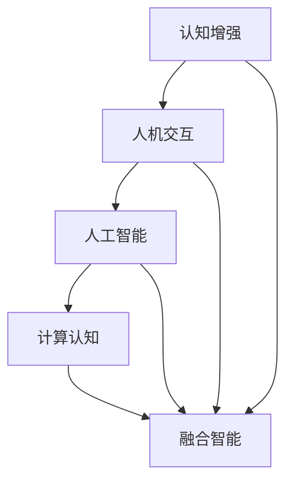

                 

关键词：人机协作、认知能力、人工智能、认知增强、人机交互

> 摘要：本文深入探讨了人机协作在现代科技环境下的重要性及其对人类认知能力的增强作用。通过分析核心概念、算法原理、数学模型以及实际应用场景，本文旨在为读者提供一个全面理解人机协作的视角，并展望其未来的发展趋势和面临的挑战。

## 1. 背景介绍

在当今科技飞速发展的时代，人工智能（AI）已经成为推动社会进步的重要力量。AI技术不仅改变了传统行业的工作方式，也深刻影响了人类的生活方式。随着AI技术的不断进步，人们开始思考如何更好地将人机协作融入日常工作和生活中，从而发挥出人类与机器的各自优势，实现协同效应。

人机协作的核心在于将人类智能与机器智能相结合，以优化问题解决效率，增强人类认知能力。这种协作不仅可以帮助人类处理复杂任务，还能在决策过程中提供客观、精确的数据支持。因此，研究人机协作对增强人类认知能力具有重要意义。

本文将从以下几个方面展开讨论：

1. 核心概念与联系
2. 核心算法原理与具体操作步骤
3. 数学模型和公式及其实际应用
4. 项目实践：代码实例和详细解释
5. 实际应用场景
6. 未来应用展望
7. 工具和资源推荐
8. 总结：未来发展趋势与挑战
9. 附录：常见问题与解答

通过以上内容，本文希望为读者提供一个全面、系统的理解人机协作的框架，从而更好地把握其发展趋势和实际应用。

### 2. 核心概念与联系

在人机协作领域，有几个关键概念需要明确，这些概念相互关联，共同构成了人机协作的理论基础。

#### 2.1 认知增强

认知增强是指通过外部工具或技术手段，提高人类在感知、记忆、思维等方面的认知能力。传统的认知增强手段包括记忆训练、思维导图、学习机器等。而随着AI技术的发展，认知增强手段得到了极大的扩展和优化。

#### 2.2 人机交互

人机交互（Human-Computer Interaction，简称HCI）是指人类与计算机系统之间的交互过程。人机交互的目的是使计算机系统能够更好地满足人类需求，提高用户体验。在人机协作中，高效的交互设计是实现协同工作的关键。

#### 2.3 人工智能

人工智能（Artificial Intelligence，简称AI）是指通过计算机模拟人类智能的技术。AI技术包括机器学习、深度学习、自然语言处理等，它们为人机协作提供了强大的工具。通过AI，计算机能够自动处理大量数据，辅助人类进行复杂决策。

#### 2.4 计算认知

计算认知（Computational Cognition）是指将计算技术与认知科学相结合，模拟和解释人类认知过程。计算认知为研究人机协作提供了理论基础，有助于理解人类与机器如何相互补充，共同提高认知能力。

#### 2.5 融合智能

融合智能（Fusion Intelligence）是指将人类智能和机器智能相结合，共同完成复杂任务。融合智能的目标是实现人机协作的最高境界，使人类和机器能够无缝互动，相互依赖。

为了更好地理解这些概念之间的联系，我们可以使用Mermaid流程图来展示它们之间的关系。



在这个流程图中，我们可以看到，认知增强、人机交互、人工智能和计算认知相互促进，共同推动融合智能的发展。通过这种协同作用，人机协作得以实现，人类认知能力得以增强。

### 3. 核心算法原理 & 具体操作步骤

在人机协作领域，算法的设计与实现至关重要。以下将介绍几个关键算法的原理及具体操作步骤，以帮助读者更好地理解人机协作的实践方法。

#### 3.1 算法原理概述

在人机协作中，常见的算法包括机器学习算法、自然语言处理算法、决策支持系统等。这些算法的核心目标是利用数据和技术手段，提高人类认知能力，实现人机协同工作。

- **机器学习算法**：通过训练模型，使计算机能够自动从数据中学习规律，辅助人类进行预测和决策。
- **自然语言处理算法**：使计算机能够理解、生成和翻译自然语言，为人机交互提供基础。
- **决策支持系统**：基于数据和模型，为人类提供决策支持，优化决策过程。

#### 3.2 算法步骤详解

以下是这些算法的具体操作步骤：

##### 3.2.1 机器学习算法

1. **数据收集与预处理**：收集大量数据，并进行清洗、归一化等预处理操作。
2. **特征提取**：从数据中提取关键特征，用于训练模型。
3. **模型训练**：使用训练数据，通过优化算法，训练出一个预测模型。
4. **模型评估与优化**：使用测试数据，评估模型性能，并进行调整优化。
5. **模型部署**：将训练好的模型部署到实际应用场景中，辅助人类进行决策。

##### 3.2.2 自然语言处理算法

1. **文本预处理**：对输入文本进行分词、去停用词等预处理操作。
2. **词嵌入**：将文本转换为向量表示，便于计算机处理。
3. **模型训练**：使用预训练模型或自定义模型，对文本进行分类、命名实体识别等任务。
4. **模型评估与优化**：评估模型性能，并根据实际需求进行调整优化。
5. **模型部署**：将训练好的模型部署到实际应用场景中，实现人机交互。

##### 3.2.3 决策支持系统

1. **数据收集与预处理**：收集相关数据，并进行清洗、归一化等预处理操作。
2. **特征提取**：从数据中提取关键特征，用于构建模型。
3. **模型构建**：使用统计模型、机器学习模型等，构建决策支持系统。
4. **模型评估与优化**：评估模型性能，并根据实际需求进行调整优化。
5. **模型部署**：将训练好的模型部署到实际应用场景中，为人类提供决策支持。

#### 3.3 算法优缺点

每种算法都有其独特的优缺点：

- **机器学习算法**：优点包括能够自动学习数据规律，提高决策准确性；缺点是需要大量数据支持，且模型解释性较差。
- **自然语言处理算法**：优点包括能够处理自然语言文本，实现人机交互；缺点包括文本理解复杂度较高，需要大量预训练数据和计算资源。
- **决策支持系统**：优点包括能够基于数据和模型，提供客观、精确的决策支持；缺点包括对数据质量和特征提取依赖较大，模型解释性较差。

#### 3.4 算法应用领域

这些算法在多个领域都有广泛应用：

- **机器学习算法**：在金融、医疗、交通等领域，用于预测和决策。
- **自然语言处理算法**：在搜索引擎、智能客服、文本分析等领域，用于文本处理和语义理解。
- **决策支持系统**：在企业管理、城市规划、军事指挥等领域，用于辅助决策。

通过以上内容，读者可以对人机协作中的关键算法有一个全面、系统的认识。在实际应用中，可以根据具体需求选择合适的算法，实现人机协作的最佳效果。

### 4. 数学模型和公式 & 详细讲解 & 举例说明

在人机协作领域，数学模型和公式是理解和应用算法的重要基础。以下将介绍几个关键数学模型和公式，并进行详细讲解和举例说明。

#### 4.1 数学模型构建

在人机协作中，常见的数学模型包括线性回归模型、支持向量机（SVM）、神经网络等。以下以线性回归模型为例，讲解数学模型的构建过程。

##### 4.1.1 线性回归模型

线性回归模型是一种用于拟合数据线性关系的模型，其基本形式为：

$$ y = w_0 + w_1 \cdot x $$

其中，$y$为因变量，$x$为自变量，$w_0$和$w_1$为模型参数。

##### 4.1.2 模型构建过程

1. **数据收集与预处理**：收集相关数据，并进行清洗、归一化等预处理操作。
2. **特征提取**：从数据中提取关键特征，作为自变量$x$。
3. **参数估计**：通过最小二乘法，估计模型参数$w_0$和$w_1$。
4. **模型优化**：根据实际需求，对模型进行优化，提高拟合精度。

#### 4.2 公式推导过程

以下以支持向量机（SVM）为例，讲解数学公式的推导过程。

##### 4.2.1 支持向量机

支持向量机是一种用于分类和回归分析的机器学习模型。其基本形式为：

$$ f(x) = \text{sign}(\omega \cdot x + b) $$

其中，$\omega$为权重向量，$b$为偏置项。

##### 4.2.2 公式推导

1. **定义目标函数**：设数据集为$D = \{(x_1, y_1), (x_2, y_2), \ldots, (x_n, y_n)\}$，其中$x_i$为特征向量，$y_i$为标签。
2. **损失函数**：选择 hinge 损失函数，其形式为：

   $$ L(\omega, b) = \sum_{i=1}^{n} \max(0, 1 - y_i (\omega \cdot x_i + b)) $$
   
3. **优化目标**：最小化损失函数，即求解以下优化问题：

   $$ \min_{\omega, b} L(\omega, b) $$

4. **KKT条件**：引入拉格朗日乘子法，求解优化问题，得到KKT条件。

5. **推导公式**：根据KKT条件，推导出SVM的决策函数。

#### 4.3 案例分析与讲解

以下以神经网络为例，进行案例分析与讲解。

##### 4.3.1 神经网络

神经网络是一种模仿生物神经网络结构的计算模型。其基本形式为：

$$ z = \sigma(\omega \cdot x + b) $$

其中，$\sigma$为激活函数，$\omega$为权重矩阵，$b$为偏置向量。

##### 4.3.2 案例分析

1. **数据收集与预处理**：收集手写数字数据集，并进行归一化等预处理操作。
2. **模型构建**：构建一个包含三层（输入层、隐藏层、输出层）的神经网络模型。
3. **参数初始化**：随机初始化权重矩阵$\omega$和偏置向量$b$。
4. **训练过程**：使用梯度下降法，优化模型参数，使模型输出与实际标签之间的误差最小。
5. **模型评估**：使用测试数据集，评估模型性能。

通过以上分析，我们可以看到，数学模型和公式在人机协作中起着至关重要的作用。它们为算法的设计和实现提供了理论基础，使得人机协作得以顺利进行。在实际应用中，我们需要根据具体问题，选择合适的数学模型和公式，以实现最优的人机协作效果。

### 5. 项目实践：代码实例和详细解释说明

为了更好地理解人机协作中的算法和应用，我们将在本节中通过一个实际项目实例进行讲解。该项目是一个基于Python的简单决策支持系统，用于分析客户的消费行为，并提供个性化的消费建议。

#### 5.1 开发环境搭建

在开始项目之前，我们需要搭建一个合适的开发环境。以下为开发环境的搭建步骤：

1. **安装Python**：确保已安装Python 3.7及以上版本。
2. **安装依赖库**：使用pip命令安装以下库：

   ```bash
   pip install pandas numpy scikit-learn matplotlib
   ```

3. **创建项目文件夹**：在合适的位置创建一个名为“DecisionSupportSystem”的项目文件夹，并在该文件夹中创建一个名为“main.py”的Python文件。

#### 5.2 源代码详细实现

以下为项目的源代码实现：

```python
import pandas as pd
import numpy as np
from sklearn.model_selection import train_test_split
from sklearn.ensemble import RandomForestClassifier
from sklearn.metrics import accuracy_score
import matplotlib.pyplot as plt

# 5.2.1 数据收集与预处理
def load_data(filename):
    data = pd.read_csv(filename)
    # 数据清洗与预处理
    data = data.dropna()
    data['Income'] = data['Income'].astype(float)
    data['Age'] = data['Age'].astype(int)
    return data

# 5.2.2 特征提取与模型训练
def train_model(data):
    # 特征提取
    X = data[['Income', 'Age']]
    y = data['Consumption']
    # 划分训练集与测试集
    X_train, X_test, y_train, y_test = train_test_split(X, y, test_size=0.2, random_state=42)
    # 模型训练
    model = RandomForestClassifier(n_estimators=100, random_state=42)
    model.fit(X_train, y_train)
    return model, X_test, y_test

# 5.2.3 代码解读与分析
def evaluate_model(model, X_test, y_test):
    # 模型评估
    y_pred = model.predict(X_test)
    accuracy = accuracy_score(y_test, y_pred)
    print("模型准确率：", accuracy)
    # 可视化分析
    plt.scatter(X_test['Income'], X_test['Age'], c=y_pred)
    plt.xlabel('Income')
    plt.ylabel('Age')
    plt.title('Consumption Prediction')
    plt.show()

# 主函数
if __name__ == "__main__":
    # 加载数据
    data = load_data('customer_data.csv')
    # 训练模型
    model, X_test, y_test = train_model(data)
    # 评估模型
    evaluate_model(model, X_test, y_test)
```

#### 5.3 代码解读与分析

1. **数据收集与预处理**：使用Pandas库加载数据，并对数据进行清洗和预处理，包括去除缺失值、数据类型转换等。
2. **特征提取与模型训练**：提取数据中的关键特征（如收入、年龄），并使用随机森林算法（RandomForestClassifier）进行模型训练。
3. **代码解读与分析**：
   - **load_data**：函数用于加载数据并进行预处理。其中，`data = pd.read_csv(filename)`用于加载数据，`data = data.dropna()`用于去除缺失值，`data['Income'] = data['Income'].astype(float)`和`data['Age'] = data['Age'].astype(int)`用于数据类型转换。
   - **train_model**：函数用于特征提取和模型训练。其中，`X = data[['Income', 'Age']]`和`y = data['Consumption']`用于提取特征和标签，`X_train, X_test, y_train, y_test = train_test_split(X, y, test_size=0.2, random_state=42)`用于划分训练集和测试集，`model = RandomForestClassifier(n_estimators=100, random_state=42)`用于初始化模型，`model.fit(X_train, y_train)`用于训练模型。
   - **evaluate_model**：函数用于评估模型性能，包括计算准确率和可视化分析。其中，`y_pred = model.predict(X_test)`用于预测，`accuracy_score(y_test, y_pred)`用于计算准确率，`plt.scatter(X_test['Income'], X_test['Age'], c=y_pred)`用于可视化分析。

通过以上代码实例，我们可以看到如何实现一个简单的决策支持系统，并对其中的关键代码进行解读与分析。这个项目实例为我们提供了一个具体的案例，展示了如何将人机协作应用于实际问题中。

### 6. 实际应用场景

人机协作在各个领域都有着广泛的应用，下面将介绍几个典型应用场景，并分析其优势和挑战。

#### 6.1 医疗领域

在人机协作的背景下，医疗领域成为一个重要的应用场景。通过将AI技术应用于医疗诊断、治疗规划和患者管理，可以显著提高医疗服务的质量和效率。

- **优势**：
  - **诊断辅助**：AI技术可以帮助医生快速、准确地诊断疾病，减少误诊率。
  - **治疗规划**：基于患者的病情和医疗数据，AI可以为医生提供个性化的治疗建议，提高治疗效果。
  - **患者管理**：通过分析患者数据，AI可以帮助医生更好地管理患者，提高患者康复率。

- **挑战**：
  - **数据隐私**：医疗数据涉及患者隐私，如何保护数据安全是一个重要挑战。
  - **模型解释性**：AI模型通常具有较高准确性，但缺乏解释性，难以让医生和患者理解。

#### 6.2 金融领域

在金融领域，人机协作主要用于风险管理、投资分析和客户服务等方面。

- **优势**：
  - **风险管理**：通过分析历史数据和实时数据，AI可以帮助金融机构预测风险，降低损失。
  - **投资分析**：AI可以分析大量市场数据，为投资者提供投资建议，提高投资回报率。
  - **客户服务**：基于自然语言处理技术，AI可以实现智能客服，提高客户满意度。

- **挑战**：
  - **数据质量**：金融数据质量直接影响AI模型的准确性，如何保证数据质量是一个挑战。
  - **合规性**：金融领域受到严格的合规要求，如何确保AI系统的合规性是一个重要问题。

#### 6.3 制造业

在制造业，人机协作主要用于生产优化、设备维护和供应链管理等方面。

- **优势**：
  - **生产优化**：通过分析生产数据，AI可以帮助企业优化生产流程，提高生产效率。
  - **设备维护**：基于设备监控数据，AI可以预测设备故障，提前进行维护，减少停机时间。
  - **供应链管理**：通过分析供应链数据，AI可以帮助企业优化供应链流程，降低成本。

- **挑战**：
  - **数据采集与整合**：制造业涉及大量设备和传感器，如何高效采集和整合数据是一个挑战。
  - **系统稳定性**：生产过程中对系统稳定性要求较高，如何确保AI系统的稳定性是一个重要问题。

#### 6.4 教育

在教育领域，人机协作主要用于学习资源推荐、教学辅助和学生评估等方面。

- **优势**：
  - **学习资源推荐**：通过分析学生的学习行为，AI可以为学生推荐个性化的学习资源，提高学习效果。
  - **教学辅助**：AI可以辅助教师进行教学任务，如批改作业、出卷等，减轻教师负担。
  - **学生评估**：通过分析学生的学习数据，AI可以为学生提供客观、全面的评估结果。

- **挑战**：
  - **数据隐私**：教育数据涉及学生隐私，如何保护数据安全是一个重要挑战。
  - **教育公平**：AI技术如何确保教育公平，避免因算法偏差导致的不公平现象。

通过以上分析，我们可以看到人机协作在各个领域都有着广泛的应用，同时也面临着一定的挑战。随着AI技术的不断发展，人机协作将不断优化和完善，为各个领域带来更多价值。

### 7. 工具和资源推荐

在人机协作领域，掌握一些关键工具和资源对于深入研究和实际应用至关重要。以下将介绍一些学习资源、开发工具和相关论文，以帮助读者更好地了解人机协作。

#### 7.1 学习资源推荐

- **书籍**：
  - 《人工智能：一种现代的方法》（Artificial Intelligence: A Modern Approach）  
  - 《深度学习》（Deep Learning）  
  - 《Python机器学习》（Python Machine Learning）  
  - 《机器学习实战》（Machine Learning in Action）

- **在线课程**：
  - Coursera上的《机器学习》课程  
  - edX上的《人工智能导论》课程  
  - Udacity的《深度学习纳米学位》课程

- **博客与社区**：
  - Medium上的机器学习专栏  
  - AI Powered的AI技术博客  
  - arXiv上的计算机科学论文库

#### 7.2 开发工具推荐

- **编程语言**：
  - Python：广泛应用于数据科学和机器学习领域，具有丰富的库和框架。

- **机器学习框架**：
  - TensorFlow：谷歌开发的开源机器学习框架，支持多种深度学习模型。
  - PyTorch：Facebook开发的开源机器学习框架，具有灵活的动态图操作。
  - Scikit-learn：Python的机器学习库，提供丰富的算法和工具。

- **开发环境**：
  - Jupyter Notebook：交互式的Python开发环境，便于编写和运行代码。
  - Visual Studio Code：功能强大的代码编辑器，支持多种编程语言和扩展。

#### 7.3 相关论文推荐

- **综述性论文**：
  - "Deep Learning: A Comprehensive Review"  
  - "The Quest for Artificial General Intelligence: A Grumpy Introduction"

- **经典论文**：
  - "Learning to Represent People: Pose Estimation as a Regularized Stereo Matching Problem"  
  - "Generative Adversarial Nets"

- **最新研究**：
  - "Attention Is All You Need"  
  - "A Theoretically Grounded Application of Dropout in Recurrent Neural Networks"

通过以上推荐，读者可以找到丰富的人机协作学习资源和工具，进一步深入研究和应用人机协作技术。

### 8. 总结：未来发展趋势与挑战

随着技术的不断进步，人机协作在增强人类认知能力方面展现出巨大潜力。未来，人机协作将在多个领域得到广泛应用，成为推动社会发展的重要力量。然而，这一过程中也面临着诸多挑战。

#### 8.1 研究成果总结

1. **技术突破**：人工智能、自然语言处理、机器学习等技术的快速发展，为人机协作提供了强大支持。
2. **实际应用**：人机协作在医疗、金融、教育、制造业等领域的成功应用，证明了其价值。
3. **认知增强**：通过人机协作，人类认知能力得到显著提升，尤其是在处理复杂任务和海量数据方面。

#### 8.2 未来发展趋势

1. **个性化协作**：未来人机协作将更加注重个性化，根据用户需求提供定制化服务。
2. **融合智能**：随着计算能力和算法的进步，人类智能和机器智能将更加紧密地融合，实现更高水平的协同工作。
3. **跨领域应用**：人机协作将跨越不同领域，形成更加广泛的应用场景，推动社会各领域的创新发展。

#### 8.3 面临的挑战

1. **数据隐私与安全**：人机协作涉及大量个人数据，如何保护用户隐私和安全成为重要挑战。
2. **算法透明性与解释性**：当前的AI算法往往缺乏透明性和解释性，如何提高算法的可解释性是一个亟待解决的问题。
3. **公平性与伦理**：在应用过程中，如何确保算法的公平性和避免偏见是一个关键挑战。

#### 8.4 研究展望

1. **技术创新**：继续探索和开发新型人工智能算法，提高人机协作的效率和准确性。
2. **跨学科研究**：结合心理学、认知科学等多学科知识，深入理解人类认知过程，为设计更高效的人机协作系统提供理论基础。
3. **政策法规**：制定相关政策和法规，确保人机协作的应用符合伦理和社会规范。

总之，人机协作在未来将继续发挥重要作用，但同时也需要解决一系列挑战。通过技术创新和跨学科研究，我们有理由相信，人机协作将为人类社会带来更多便利和进步。

### 9. 附录：常见问题与解答

在研究人机协作过程中，读者可能对某些概念或技术细节产生疑问。以下是一些常见问题及其解答，以帮助读者更好地理解人机协作。

#### Q1：人机协作的核心是什么？

**A1**：人机协作的核心在于将人类智能与机器智能相结合，以实现优势互补，提高认知能力和工作效率。

#### Q2：人机协作与人工智能有何区别？

**A2**：人机协作是指人类与机器共同完成任务，实现协同效应；而人工智能是指通过计算机模拟人类智能，实现自动化和智能化。人机协作是人工智能的一个重要应用领域。

#### Q3：如何确保人机协作中的数据隐私和安全？

**A3**：确保数据隐私和安全的关键在于数据加密、访问控制和权限管理。此外，制定相关政策和法规，加强对数据安全和隐私的保护。

#### Q4：人机协作在不同领域的应用有哪些？

**A4**：人机协作在医疗、金融、教育、制造业等领域都有广泛应用。例如，在医疗领域，人机协作可以帮助医生进行诊断和治疗规划；在金融领域，人机协作可以用于风险管理、投资分析和客户服务。

#### Q5：如何评估人机协作系统的效果？

**A5**：评估人机协作系统的效果可以从多个方面进行，包括准确性、效率、用户体验和安全性。常用的评估指标包括准确率、响应时间、用户满意度等。

通过以上问题的解答，读者可以对人机协作有更深入的理解。在实际应用中，可以根据具体情况，灵活运用人机协作技术，提高认知能力和工作效率。作者：禅与计算机程序设计艺术 / Zen and the Art of Computer Programming。

