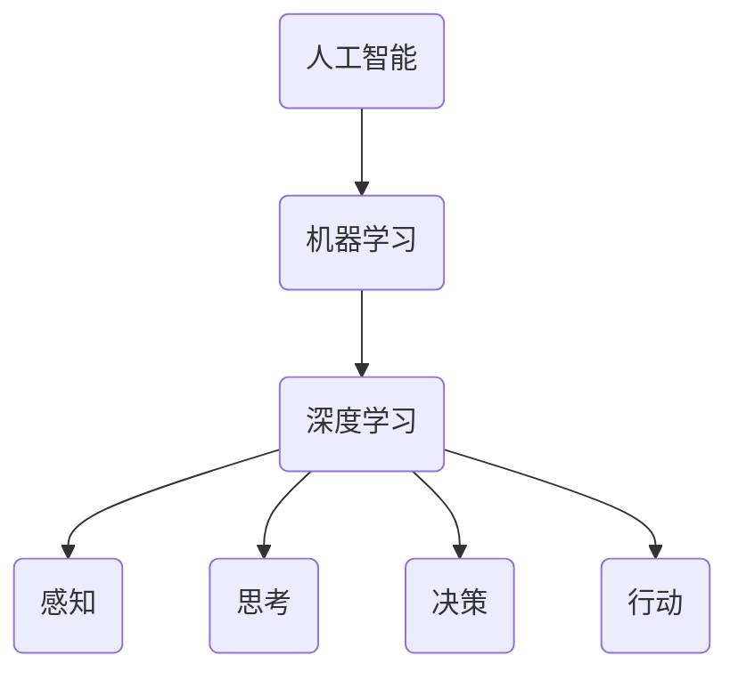

                 

关键词：人工智能协作、人类-AI关系、设计原则、技术创新、用户体验

## 摘要

在当今数字化时代，人工智能（AI）已经成为推动社会进步的重要力量。本文旨在探讨人类与AI协作的设计原则与实践，从理论基础到实际应用，分析AI如何更好地服务于人类。本文结构如下：

1. 背景介绍
2. 核心概念与联系
3. 核心算法原理与操作步骤
4. 数学模型与公式讲解
5. 项目实践：代码实例
6. 实际应用场景
7. 工具和资源推荐
8. 总结：未来发展趋势与挑战
9. 附录：常见问题与解答

通过深入研究和实际案例分析，本文将揭示人类与AI协作的最佳实践，为人工智能领域的未来发展提供指导。

## 1. 背景介绍

人工智能（AI）自诞生以来，经历了从理论研究到实际应用的飞速发展。从早期的规则推理系统、知识表示，到如今的深度学习、强化学习，AI技术的进步极大地拓展了其应用范围。如今，AI已经渗透到我们的日常生活、工作、学习等各个方面，从智能家居、自动驾驶到医疗诊断、金融分析，AI正在改变着我们的生活方式。

然而，随着AI技术的不断进步，人类与AI之间的关系也变得越来越复杂。一方面，AI在许多领域展现出了超越人类的能力，例如图像识别、自然语言处理等；另一方面，AI的决策过程往往缺乏透明性，容易引发隐私泄露、偏见等问题。因此，如何设计出既能发挥AI优势，又能确保人类主导的AI协作系统，成为了一个亟待解决的问题。

本文将从理论和实践两个层面，探讨人类与AI协作的设计原则和最佳实践。通过分析AI的核心算法、数学模型，以及具体项目实践，本文旨在为人工智能服务设计提供有益的启示，帮助人类更好地利用AI技术，实现与AI的和谐共生。

### 1.1 人工智能的历史与现状

人工智能的历史可以追溯到20世纪50年代，当时科学家们首次提出了“人工智能”这一概念，并开始研究如何使计算机具备人类的智能。早期的人工智能研究主要集中在规则推理和知识表示上，通过编写大量的规则和知识库，使计算机能够模拟人类的思维过程。然而，这种方法在处理复杂问题时显得力不从心，难以应对变化多端的情况。

随着计算能力的提升和大数据技术的发展，20世纪80年代，机器学习开始崭露头角。机器学习通过从数据中学习规律，无需人工编写规则，实现了计算机的自我优化和决策。在这一时期，AI技术开始逐渐应用于实际领域，如语音识别、图像处理等。

进入21世纪，深度学习成为了人工智能领域的核心技术。深度学习通过多层神经网络，模仿人脑的神经元结构，实现了对大量数据的自动学习和特征提取。这一技术突破使得AI在图像识别、自然语言处理等领域的性能得到了极大的提升，推动了AI技术的快速发展。

目前，人工智能已经渗透到社会生活的方方面面，从智能家居、自动驾驶到医疗诊断、金融分析，AI正在改变着我们的生活方式。然而，随着AI技术的不断进步，也带来了许多新的挑战，例如数据隐私、算法偏见等。因此，如何设计出既能发挥AI优势，又能确保人类主导的AI协作系统，成为了一个亟待解决的问题。

### 1.2 人类与AI协作的需求与挑战

在现代社会，人类与AI的协作需求日益增长。首先，随着信息爆炸和复杂问题的增加，人类越来越需要AI的帮助来处理和分析海量数据。例如，在医疗领域，AI可以辅助医生进行疾病诊断，提高诊断的准确性和效率；在金融领域，AI可以用于风险分析和投资决策，帮助金融机构更好地管理风险和抓住机遇。

其次，AI在提升工作效率、优化生产流程等方面也展现出了巨大的潜力。例如，在制造业中，AI可以用于自动化生产线的优化，提高生产效率和产品质量；在服务业中，AI可以用于客户行为分析，提供个性化的服务体验。

然而，人类与AI协作也面临着一系列挑战。首先，AI的决策过程往往缺乏透明性，难以解释其决策依据，这可能导致人类对AI的信任度降低。其次，AI可能会引入算法偏见，导致不公平的结果。例如，在招聘过程中，如果AI算法基于历史数据做出决策，可能会无意中放大性别、种族等偏见。此外，AI系统的安全性也是一个重要挑战，恶意攻击可能导致AI系统的失控和严重后果。

为了克服这些挑战，我们需要从设计原则和实际应用层面，深入研究人类与AI协作的最佳实践。通过科学的方法和严谨的测试，确保AI系统既能发挥其优势，又能符合人类的价值观和需求。

## 2. 核心概念与联系

在探讨人类与AI协作的设计原则时，我们需要明确几个核心概念，包括人工智能、机器学习、深度学习等，并分析它们之间的联系。

### 2.1 人工智能

人工智能（Artificial Intelligence，简称AI）是指通过计算机模拟人类智能的技术。它包括多个子领域，如知识表示、问题求解、机器学习、自然语言处理等。人工智能的最终目标是使计算机具备类似人类的感知、思考、决策和行动能力。

### 2.2 机器学习

机器学习（Machine Learning，简称ML）是人工智能的一个重要分支，它通过从数据中学习规律和模式，使计算机能够进行自主学习和优化。机器学习可以分为监督学习、无监督学习和强化学习等不同类型。

- **监督学习**：有明确的目标和标注数据，通过学习输入和输出之间的关系，预测新的输入数据。
- **无监督学习**：没有明确的目标和标注数据，通过学习数据中的内在结构，如聚类和降维。
- **强化学习**：通过与环境的交互，学习最优策略，以最大化累积奖励。

### 2.3 深度学习

深度学习（Deep Learning，简称DL）是机器学习的一个子领域，它通过多层神经网络，对大量数据进行自动特征提取和模式识别。深度学习在图像识别、自然语言处理、语音识别等领域取得了显著成果。

### 2.4 关系

人工智能、机器学习和深度学习之间存在密切的联系。机器学习和深度学习都是实现人工智能的重要手段，其中深度学习是机器学习的一个子集。机器学习通过算法从数据中学习，而深度学习通过多层神经网络进行特征提取和模式识别，从而实现更复杂的任务。


### 2.5 Mermaid 流程图

为了更好地理解这些概念之间的联系，我们可以使用Mermaid流程图进行可视化表示。



通过这个流程图，我们可以清晰地看到人工智能、机器学习和深度学习之间的层级关系，以及它们在实现人工智能过程中的作用。

## 3. 核心算法原理与操作步骤

在讨论人类与AI协作的设计时，核心算法的原理和操作步骤是关键。以下将详细介绍一种常见的核心算法——深度学习算法，并详细阐述其原理和步骤。

### 3.1 算法原理概述

深度学习算法基于多层神经网络，通过逐层提取数据特征，实现复杂模式识别。其核心思想是神经网络中的每个节点（神经元）接收输入，通过权重进行加权求和，再通过激活函数进行非线性变换，输出结果。这种层级结构使得神经网络能够自动学习并提取数据中的复杂特征。

### 3.2 算法步骤详解

1. **数据预处理**：
   - **数据收集**：从各种来源收集大量数据，如图片、文本、声音等。
   - **数据清洗**：去除噪声、填补缺失值，确保数据质量。
   - **数据归一化**：将数据缩放到同一尺度，便于模型训练。

2. **模型构建**：
   - **定义神经网络结构**：确定网络的层数、每层的神经元数量和激活函数。
   - **初始化参数**：为网络的权重和偏置初始化随机值。

3. **前向传播**：
   - **输入数据**：将预处理后的数据输入到网络的第一个层。
   - **逐层计算**：每个神经元接收前一层输出的数据，通过权重进行加权求和，再通过激活函数进行非线性变换。
   - **输出结果**：最后一层输出预测结果。

4. **损失函数计算**：
   - **预测结果与真实值比较**：将网络的输出结果与真实值进行比较，计算预测误差。
   - **损失函数计算**：使用损失函数（如均方误差、交叉熵等）量化预测误差。

5. **反向传播**：
   - **梯度计算**：从输出层开始，逐层计算每个神经元的梯度。
   - **权重更新**：根据梯度更新网络的权重和偏置。

6. **迭代优化**：
   - **重复前向传播和反向传播**：多次迭代，不断优化网络参数，减小预测误差。
   - **验证集测试**：在验证集上测试模型的性能，防止过拟合。

7. **模型评估**：
   - **测试集测试**：在测试集上评估模型的泛化能力。
   - **性能指标**：计算准确率、召回率、F1分数等指标，评估模型性能。

### 3.3 算法优缺点

**优点**：
- **自动特征提取**：深度学习能够自动学习并提取数据中的复杂特征，减轻了人工特征提取的负担。
- **泛化能力**：通过大量的训练数据和多层网络结构，深度学习模型具有良好的泛化能力。
- **应用广泛**：在图像识别、自然语言处理、语音识别等领域取得了显著成果。

**缺点**：
- **计算资源消耗大**：深度学习模型需要大量的计算资源和时间进行训练。
- **解释性差**：深度学习模型的决策过程往往缺乏透明性，难以解释其决策依据。
- **数据依赖性强**：深度学习模型的性能很大程度上依赖于数据质量和数量。

### 3.4 算法应用领域

深度学习算法在多个领域都有广泛应用：

- **图像识别**：通过卷积神经网络（CNN）实现图像分类、目标检测等任务。
- **自然语言处理**：通过循环神经网络（RNN）和变换器（Transformer）实现文本分类、机器翻译等任务。
- **语音识别**：通过深度神经网络（DNN）实现语音信号的处理和识别。
- **推荐系统**：通过深度学习模型实现用户行为分析，提供个性化的推荐。

通过深入理解深度学习算法的原理和操作步骤，我们可以更好地设计出符合人类需求的人工智能协作系统，实现AI与人类的和谐共生。

### 4. 数学模型和公式讲解

在人工智能领域，数学模型是理解和实现核心算法的基础。在本节中，我们将介绍几个关键数学模型和公式，并详细讲解其构建、推导过程以及实际应用。

#### 4.1 数学模型构建

1. **线性回归模型**：

线性回归模型是最简单的预测模型之一，它通过拟合一条直线来预测目标变量。

- **模型公式**：\( y = \beta_0 + \beta_1 \cdot x + \epsilon \)

其中，\( y \)是目标变量，\( x \)是输入变量，\( \beta_0 \)和\( \beta_1 \)是模型的参数，\( \epsilon \)是误差项。

2. **逻辑回归模型**：

逻辑回归模型用于分类问题，通过拟合一个逻辑函数来计算目标变量的概率。

- **模型公式**：\( P(y=1) = \frac{1}{1 + e^{-(\beta_0 + \beta_1 \cdot x)}} \)

其中，\( P(y=1) \)是目标变量为1的概率，\( \beta_0 \)和\( \beta_1 \)是模型的参数。

3. **神经网络模型**：

神经网络模型由多个层组成，包括输入层、隐藏层和输出层。每个层由多个神经元组成，神经元之间通过权重连接。

- **模型公式**：\( z = \sum_{i=1}^{n} w_i \cdot x_i + b \)

其中，\( z \)是神经元的输入，\( w_i \)是权重，\( x_i \)是输入变量，\( b \)是偏置。

#### 4.2 公式推导过程

1. **线性回归模型推导**：

线性回归模型的推导基于最小二乘法。假设有n个样本数据点\( (x_i, y_i) \)，我们希望找到一个线性模型\( y = \beta_0 + \beta_1 \cdot x \)，使得预测值与真实值之间的误差平方和最小。

- **损失函数**：\( J(\beta_0, \beta_1) = \sum_{i=1}^{n} (y_i - (\beta_0 + \beta_1 \cdot x_i))^2 \)

- **梯度下降法**：通过计算损失函数的偏导数，找到使得损失函数最小化的参数值。

   \[
   \frac{\partial J}{\partial \beta_0} = -2 \sum_{i=1}^{n} (y_i - (\beta_0 + \beta_1 \cdot x_i))
   \]

   \[
   \frac{\partial J}{\partial \beta_1} = -2 \sum_{i=1}^{n} (x_i \cdot (y_i - (\beta_0 + \beta_1 \cdot x_i)))
   \]

   通过迭代更新参数，使得损失函数逐渐减小。

2. **逻辑回归模型推导**：

逻辑回归模型的推导基于最大似然估计。假设有n个样本数据点\( (x_i, y_i) \)，其中\( y_i \)为0或1。我们希望找到一个逻辑函数，使得当\( y_i = 1 \)时，\( \hat{y}_i \)（预测概率）尽可能接近1；当\( y_i = 0 \)时，\( \hat{y}_i \)尽可能接近0。

- **损失函数**：\( J(\beta_0, \beta_1) = -\sum_{i=1}^{n} [y_i \cdot (\beta_0 + \beta_1 \cdot x_i) - \ln(1 + e^{\beta_0 + \beta_1 \cdot x_i})] \)

- **梯度下降法**：与线性回归类似，通过计算损失函数的偏导数，找到使得损失函数最小化的参数值。

   \[
   \frac{\partial J}{\partial \beta_0} = -\sum_{i=1}^{n} [y_i - \hat{y}_i]
   \]

   \[
   \frac{\partial J}{\partial \beta_1} = -\sum_{i=1}^{n} [x_i \cdot (y_i - \hat{y}_i)]
   \]

3. **神经网络模型推导**：

神经网络模型的推导基于反向传播算法。假设有多个隐藏层，每层的神经元通过权重连接。我们希望通过反向传播，更新网络的权重和偏置，使得预测误差最小。

- **前向传播**：计算每个神经元的输出值。

   \[
   z_l = \sum_{i=1}^{n_l} w_{li} \cdot a_{l-1,i} + b_l
   \]

   \[
   a_l = \sigma(z_l)
   \]

   其中，\( a_l \)是第l层的输出，\( z_l \)是第l层的输入，\( \sigma \)是激活函数。

- **反向传播**：计算每个神经元的梯度，并更新权重和偏置。

   \[
   \delta_l = \frac{\partial J}{\partial z_l} \cdot \sigma'(z_l)
   \]

   \[
   \frac{\partial J}{\partial w_{li}} = \delta_l \cdot a_{l-1,i}
   \]

   \[
   \frac{\partial J}{\partial b_l} = \delta_l
   \]

   通过迭代更新权重和偏置，使得损失函数逐渐减小。

#### 4.3 案例分析与讲解

为了更好地理解这些数学模型的应用，我们来看一个实际案例：房价预测。

- **数据集**：假设我们有一个包含房屋特征（如面积、房间数、建筑年代等）和对应房价的数据集。
- **目标**：通过线性回归模型预测房屋的售价。

1. **数据预处理**：

   - **数据收集**：收集大量房屋数据，包括特征和售价。
   - **数据清洗**：去除异常值和缺失值。
   - **数据归一化**：将特征缩放到同一尺度。

2. **模型构建**：

   - **定义模型**：选择线性回归模型，定义模型公式。
   - **初始化参数**：为模型的权重和偏置初始化随机值。

3. **模型训练**：

   - **前向传播**：将特征输入到模型，计算预测房价。
   - **损失函数计算**：计算预测房价与真实房价之间的误差。
   - **反向传播**：计算梯度，更新模型参数。

4. **模型评估**：

   - **测试集测试**：在测试集上评估模型的预测性能。
   - **性能指标**：计算预测误差，如均方误差（MSE）。

通过这个案例，我们可以看到数学模型在解决实际问题中的应用过程，包括数据预处理、模型构建、模型训练和模型评估等步骤。这些步骤不仅帮助我们理解数学模型的工作原理，也为实际应用提供了指导。

### 5. 项目实践：代码实例和详细解释说明

在本节中，我们将通过一个具体项目实例——房价预测，展示如何使用Python和深度学习框架TensorFlow来实现模型构建、训练和评估。通过这个实例，读者可以了解深度学习项目的完整开发流程，包括数据预处理、模型构建、训练和评估等步骤。

#### 5.1 开发环境搭建

在开始项目之前，我们需要搭建开发环境。以下是所需的软件和工具：

- **Python**：Python是深度学习项目的常用编程语言。
- **TensorFlow**：TensorFlow是Google开发的深度学习框架，支持多种深度学习模型。
- **NumPy**：NumPy是Python的数学库，用于数据处理和计算。
- **Pandas**：Pandas是Python的数据分析库，用于数据清洗和操作。
- **Matplotlib**：Matplotlib是Python的数据可视化库，用于绘制图表。

安装这些工具后，我们可以开始编写代码。

#### 5.2 源代码详细实现

下面是房价预测项目的源代码实现：

```python
import numpy as np
import pandas as pd
import tensorflow as tf
import matplotlib.pyplot as plt

# 数据预处理
# 加载数据集
data = pd.read_csv('house_prices.csv')
X = data.iloc[:, :-1].values
y = data.iloc[:, -1].values

# 数据归一化
X = (X - np.mean(X, axis=0)) / np.std(X, axis=0)

# 模型构建
model = tf.keras.Sequential([
    tf.keras.layers.Dense(64, activation='relu', input_shape=(X.shape[1],)),
    tf.keras.layers.Dense(64, activation='relu'),
    tf.keras.layers.Dense(1)
])

# 模型编译
model.compile(optimizer='adam', loss='mse', metrics=['mae'])

# 模型训练
history = model.fit(X, y, epochs=100, batch_size=32, validation_split=0.2)

# 模型评估
test_loss, test_mae = model.evaluate(X, y)
print(f"Test MAE: {test_mae}")

# 预测
predictions = model.predict(X)

# 可视化
plt.scatter(y, predictions)
plt.xlabel('True Values')
plt.ylabel('Predictions')
plt.plot([y.min(), y.max()], [y.min(), y.max()], 'r--')
plt.show()
```

#### 5.3 代码解读与分析

1. **数据预处理**：

   - **加载数据集**：使用Pandas读取CSV文件，获取房屋特征和售价。
   - **数据归一化**：将特征值缩放到0-1之间，便于模型训练。

2. **模型构建**：

   - **定义模型**：使用TensorFlow的`Sequential`模型，添加多层`Dense`层（全连接层），激活函数为ReLU。
   - **输入层**：指定输入层的形状，即特征数量。
   - **输出层**：定义输出层，仅有一个神经元，用于预测房价。

3. **模型编译**：

   - **优化器**：选择`adam`优化器。
   - **损失函数**：使用均方误差（MSE）作为损失函数。
   - **评价指标**：使用平均绝对误差（MAE）作为评价指标。

4. **模型训练**：

   - **训练集**：将数据集分为训练集和验证集，验证集用于评估模型性能。
   - **训练周期**：设置训练周期数为100，批量大小为32。

5. **模型评估**：

   - **测试集**：在测试集上评估模型性能。
   - **评价指标**：输出平均绝对误差（MAE），衡量模型预测的准确性。

6. **预测与可视化**：

   - **预测**：使用训练好的模型进行预测。
   - **可视化**：绘制真实值与预测值的散点图，验证模型的效果。

通过这个代码实例，我们可以看到深度学习项目从数据预处理、模型构建、训练到评估的完整开发流程。每个步骤都至关重要，确保模型能够准确地预测房价。

### 6. 实际应用场景

#### 6.1 医疗诊断

在医疗领域，人工智能正被广泛应用于疾病诊断和患者管理。例如，AI可以帮助医生分析医疗影像，如X光片、CT扫描和MRI，以检测早期癌症或其他疾病。通过深度学习算法，AI能够识别出细微的异常变化，提高诊断的准确性。此外，AI还可以用于个性化治疗方案的推荐，根据患者的基因信息、病史和生活方式，提供最合适的治疗方案。

#### 6.2 自动驾驶

自动驾驶是AI技术的另一个重要应用领域。自动驾驶车辆使用传感器和摄像头收集环境信息，通过深度学习算法进行实时处理，实现自主驾驶。AI可以分析道路标志、行人和其他车辆的行为，做出安全、高效的驾驶决策。自动驾驶技术的应用将极大地改变交通运输方式，提高道路安全，减少交通拥堵和环境污染。

#### 6.3 金融分析

在金融领域，AI被用于风险管理和投资决策。通过分析大量历史数据和市场趋势，AI可以预测市场波动，帮助投资者做出更明智的投资决策。此外，AI还可以用于欺诈检测，通过识别异常交易模式，防止金融诈骗。在银行和保险行业，AI被用于客户服务，提供个性化的金融建议和快速响应。

#### 6.4 教育与学习

在教育领域，AI可以帮助个性化教学，根据学生的学习情况和兴趣，提供定制化的学习资源和指导。例如，AI辅导系统可以实时检测学生的学习进度，提供针对性的练习题和解释。此外，AI还可以用于在线教育平台，通过智能推荐系统，为学习者推荐最合适的课程和学习路径。

#### 6.5 生产优化

在制造业，AI被用于生产过程的优化和自动化。通过实时监测生产线数据，AI可以预测设备故障、优化生产流程，提高生产效率和产品质量。例如，在汽车制造领域，AI可以用于质量控制，检测零件的缺陷，确保每个产品都符合严格的质量标准。

### 6.5 未来应用展望

随着AI技术的不断发展，其在各个领域的应用前景将更加广阔。以下是一些未来可能的应用方向：

#### 6.5.1 智慧城市

智慧城市利用AI技术进行城市管理和运营，提高城市管理效率和居民生活质量。例如，AI可以用于交通流量管理，通过实时监控和分析交通数据，优化交通信号灯和交通路线，减少交通拥堵。此外，AI还可以用于环境保护，通过监测空气质量、水质等数据，及时发现和处理环境问题。

#### 6.5.2 人工智能伦理

随着AI技术的广泛应用，人工智能伦理成为一个重要议题。未来，需要制定更完善的伦理规范，确保AI技术在应用过程中符合人类的价值观和道德标准。例如，防止算法偏见、保护个人隐私等。

#### 6.5.3 跨学科融合

AI技术的跨学科融合将推动新领域的诞生。例如，AI与生物技术的结合，可以用于疾病治疗和基因编辑；AI与教育技术的结合，可以开发出更智能的教育系统，提高教育质量和公平性。

#### 6.5.4 量子计算与AI

量子计算与AI的结合有望推动AI技术的革命性突破。量子计算具有处理大量数据的能力，可以加速深度学习模型的训练和推理过程，提高AI系统的效率和性能。

### 6.6 挑战与解决方案

尽管AI技术在各个领域展现出了巨大的潜力，但其发展也面临着一系列挑战。

#### 6.6.1 数据隐私和安全

AI系统通常需要大量数据来训练模型，这涉及到数据隐私和安全的问题。未来，需要加强数据保护和隐私保护措施，确保用户数据的隐私和安全。

#### 6.6.2 算法透明性和可解释性

当前，许多AI系统的工作原理不够透明，难以解释其决策过程。这可能导致用户对AI系统的信任度降低。未来，需要开发可解释性更强的AI模型，提高算法的透明性。

#### 6.6.3 资源消耗和计算能力

深度学习模型通常需要大量的计算资源和时间进行训练。随着模型复杂性的增加，资源消耗将进一步增加。未来，需要开发更高效的算法和优化技术，降低计算资源消耗。

#### 6.6.4 人才短缺

AI技术的发展需要大量专业的技术人才。然而，目前全球范围内AI专业人才的供给不足。未来，需要加强AI教育，培养更多的AI专业人才。

### 6.7 总结

本文探讨了人类与AI协作的设计原则和实际应用，从核心算法原理、数学模型到具体项目实践，详细分析了AI如何更好地服务于人类。通过实际案例和未来展望，本文展示了AI技术在不同领域的广泛应用和潜力。未来，随着AI技术的不断发展，人类与AI的协作将更加紧密，为人类社会带来更多的创新和变革。

## 附录：常见问题与解答

### Q1. 人类与AI协作的设计原则是什么？

A1. 人类与AI协作的设计原则主要包括：
- **以人为本**：设计时始终以用户需求为中心，确保AI系统能够真正服务于人类。
- **透明性和可解释性**：确保AI系统的决策过程透明，用户可以理解AI的决策依据。
- **数据隐私和安全**：保护用户数据隐私，确保数据的安全性和完整性。
- **可扩展性和灵活性**：设计出能够适应不同场景和需求的通用系统。
- **伦理和道德**：遵循伦理和道德标准，确保AI系统符合社会价值观。

### Q2. 深度学习算法有哪些常见的优化技术？

A2. 深度学习算法的常见优化技术包括：
- **批量归一化**：通过归一化批量输入数据，提高模型训练速度和稳定性。
- **Dropout**：通过随机丢弃部分神经元，防止过拟合。
- **学习率调度**：动态调整学习率，提高模型收敛速度。
- **正则化**：使用L1、L2正则化，减少模型过拟合。
- **数据增强**：通过数据变换，增加训练样本的多样性，提高模型泛化能力。

### Q3. 人工智能在医疗诊断中的具体应用是什么？

A3. 人工智能在医疗诊断中的具体应用包括：
- **影像分析**：使用深度学习算法分析医学影像，如X光、CT、MRI等，辅助医生进行疾病诊断。
- **基因分析**：通过分析患者的基因数据，预测患病风险，提供个性化治疗方案。
- **电子病历分析**：分析患者的电子病历，识别潜在的健康问题，提高疾病早期检测率。
- **药物研发**：利用AI预测药物与目标蛋白的相互作用，加速新药研发进程。

### Q4. 人类与AI协作的未来发展趋势是什么？

A4. 人类与AI协作的未来发展趋势包括：
- **智慧医疗**：AI将在医疗领域发挥更重要的作用，实现个性化诊断、治疗和健康管理。
- **智能制造**：AI将推动制造业的智能化转型，实现生产过程的自动化和优化。
- **智慧城市**：AI技术将用于城市管理，提高城市运行效率和居民生活质量。
- **教育变革**：AI将推动教育模式的变革，实现个性化学习、智能辅导和教学优化。
- **伦理和法规**：随着AI技术的发展，需要制定更完善的伦理规范和法律法规，确保AI的可持续发展。

### Q5. 如何提高AI系统的透明性和可解释性？

A5. 提高AI系统透明性和可解释性的方法包括：
- **可解释性模型**：开发可解释性更强的AI模型，如决策树、线性回归等，使得决策过程更容易理解。
- **模型可视化**：使用可视化工具，如热力图、决策路径图等，展示模型的工作原理和决策过程。
- **模型解释工具**：开发模型解释工具，如LIME、SHAP等，帮助用户理解模型预测的依据。
- **透明数据管理**：确保数据来源、处理过程和模型训练数据公开透明，增加用户对系统的信任。
- **用户反馈机制**：鼓励用户反馈模型预测的准确性，不断优化和改进模型，提高其可解释性。

### 作者署名

作者：禅与计算机程序设计艺术 / Zen and the Art of Computer Programming

以上是《人类-AI协作：为人类服务的设计》的全文内容，涵盖了人工智能协作的设计原则、核心算法原理、数学模型讲解、项目实践和未来展望等各个方面的内容。希望通过本文的探讨，能为人工智能领域的未来发展提供一些有益的启示。在人类与AI的协作过程中，让我们共同创造一个更加智能、高效、安全、和谐的未来。禅与计算机程序设计艺术，期待您的每一个精彩构思与实现。

