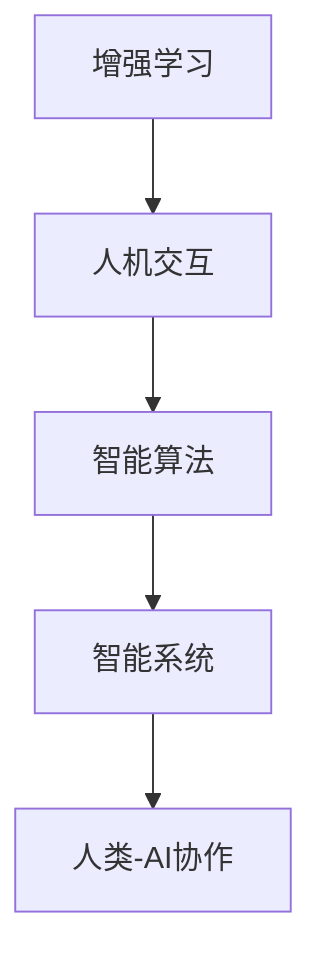

                 

关键词：人类-AI协作，人工智能，增强学习，人机交互，智能算法，智能系统，未来技术，计算机科学

> 摘要：本文深入探讨了人类与人工智能（AI）的协作关系，阐述了AI如何通过增强学习、人机交互和智能算法等方式，显著提升人类的认知能力、工作效率和创新潜力。文章分析了AI在各个领域的实际应用案例，展望了未来人类-AI协作的发展趋势和面临的挑战。

## 1. 背景介绍

随着计算机技术的飞速发展，人工智能（AI）已经成为现代科技领域的重要分支。AI技术在语音识别、图像处理、自然语言处理、自动驾驶、医疗诊断等方面取得了显著的成果，深刻地改变了人类的生活方式。然而，AI的迅猛发展不仅带来了技术的进步，也引发了人们对AI如何与人类协作的深入思考。

人类-AI协作的核心目标是实现人类与AI的有机结合，发挥各自的优势，共同解决复杂问题。在这个过程中，AI不仅承担了处理大量数据和执行重复性任务的角色，还成为了人类智能的延伸和扩展。通过协作，人类可以借助AI的力量，突破自身的认知和生理限制，实现更高的工作效率和创新能力。

本文将从以下几个方面展开讨论：

1. 核心概念与联系
2. 核心算法原理与具体操作步骤
3. 数学模型和公式
4. 项目实践：代码实例和详细解释说明
5. 实际应用场景
6. 工具和资源推荐
7. 总结：未来发展趋势与挑战

## 2. 核心概念与联系

在探讨人类-AI协作之前，我们首先需要了解一些核心概念。以下是本文中涉及的主要概念及其相互关系：

### 2.1 增强学习

增强学习（Reinforcement Learning）是AI的一种学习方法，通过不断试错和反馈，使AI系统逐步优化其行为策略。增强学习与人类的学习过程有相似之处，都依赖于经验积累和反馈修正。人类-AI协作中，增强学习可以帮助AI系统更好地适应人类的任务需求。

### 2.2 人机交互

人机交互（Human-Computer Interaction，简称HCI）是研究人类与计算机系统之间交互的学科。在人机交互中，人类通过输入设备与计算机系统进行交流，计算机系统则通过输出设备向人类提供反馈。在人类-AI协作中，人机交互是实现人类与AI系统有效沟通的重要手段。

### 2.3 智能算法

智能算法是AI系统解决特定问题的一系列方法，包括机器学习、深度学习、自然语言处理等。智能算法是人类-AI协作的核心，通过优化算法模型，可以显著提升AI系统的性能和应用范围。

### 2.4 智能系统

智能系统（Intelligent System）是指具备感知、学习、推理、决策等能力的计算机系统。智能系统在人类-AI协作中发挥着关键作用，可以协助人类完成复杂任务，提高工作效率。

### 2.5 Mermaid 流程图

为了更直观地展示核心概念之间的关系，我们使用Mermaid流程图进行了说明：



## 3. 核心算法原理与具体操作步骤

### 3.1 算法原理概述

在人类-AI协作中，核心算法原理主要包括增强学习、深度学习、迁移学习等。以下是对这些算法原理的简要概述：

### 3.1.1 增强学习

增强学习是一种基于奖励机制的学习方法，通过不断调整策略，使AI系统在特定环境中获得最大的奖励。增强学习可以分为无模型学习和有模型学习两种类型。无模型学习不依赖于环境模型，直接通过试错和反馈进行调整；有模型学习则根据环境模型进行预测和调整。

### 3.1.2 深度学习

深度学习是机器学习的一个重要分支，通过构建多层的神经网络，实现数据的自动特征提取和模式识别。深度学习在图像识别、语音识别、自然语言处理等领域取得了显著成果。

### 3.1.3 迁移学习

迁移学习是一种将已学习到的知识应用于新任务的方法，通过将不同任务中的共同特征进行迁移，提高新任务的学习效果。迁移学习有助于缩短新任务的训练时间，提高模型的泛化能力。

### 3.2 算法步骤详解

为了更好地理解核心算法原理，我们以下分别详细介绍增强学习、深度学习和迁移学习的具体操作步骤：

### 3.2.1 增强学习步骤

1. 初始化策略参数。
2. 在环境中进行状态观测。
3. 根据当前状态选择动作。
4. 执行动作，获得奖励和状态转移。
5. 根据奖励和状态转移更新策略参数。
6. 重复步骤2-5，直到达到目标或收敛条件。

### 3.2.2 深度学习步骤

1. 数据预处理：对原始数据进行清洗、归一化等处理。
2. 构建神经网络模型：定义输入层、隐藏层和输出层。
3. 模型训练：通过反向传播算法，调整网络权重，使模型在训练数据上达到最优。
4. 模型评估：在验证数据集上评估模型性能，调整超参数。
5. 模型部署：将训练好的模型应用于实际任务。

### 3.2.3 迁移学习步骤

1. 选择源任务和目标任务，确定共同特征。
2. 在源任务上训练模型，提取共同特征。
3. 在目标任务上使用提取的共同特征训练模型。
4. 在目标任务上进行模型评估和优化。

### 3.3 算法优缺点

每种算法都有其独特的优缺点，以下分别对增强学习、深度学习和迁移学习进行简要分析：

### 3.3.1 增强学习

优点：无需大量标注数据，适合处理连续状态和动作空间的问题。

缺点：收敛速度慢，需要大量的样本数据进行训练，对环境有一定的依赖性。

### 3.3.2 深度学习

优点：强大的特征提取能力，可以自动学习数据中的复杂模式。

缺点：对数据量要求较高，训练过程复杂，对超参数调整敏感。

### 3.3.3 迁移学习

优点：可以缩短新任务的训练时间，提高模型的泛化能力。

缺点：对源任务和目标任务之间的共同特征提取有较高的要求，容易出现过拟合现象。

### 3.4 算法应用领域

增强学习、深度学习和迁移学习在人类-AI协作中具有广泛的应用领域：

- 增强学习：智能推荐系统、游戏AI、自动驾驶。
- 深度学习：图像识别、语音识别、自然语言处理。
- 迁移学习：跨领域知识迁移、多模态学习、医疗诊断。

## 4. 数学模型和公式

在人类-AI协作中，数学模型和公式是核心算法实现的基础。以下分别介绍增强学习、深度学习和迁移学习的数学模型和公式。

### 4.1 增强学习

增强学习中的核心公式是Q值函数和策略更新公式：

- Q值函数：$$ Q(s, a) = r(s, a) + \gamma \max_{a'} Q(s', a') $$
  - 其中，$r(s, a)$为奖励函数，$s$为当前状态，$a$为当前动作，$\gamma$为折扣因子，$s'$为下一状态，$a'$为下一动作。

- 策略更新公式：$$ \theta_{t+1} = \theta_t + \alpha (r(s, a) + \gamma \max_{a'} Q(s', a') - Q(s, a)) $$
  - 其中，$\theta$为策略参数，$\alpha$为学习率。

### 4.2 深度学习

深度学习中的核心公式是反向传播算法中的梯度下降：

- 梯度计算：$$ \frac{\partial L}{\partial \theta} = \sum_{i=1}^{n} \frac{\partial L}{\partial z_i} \frac{\partial z_i}{\partial \theta} $$
  - 其中，$L$为损失函数，$\theta$为网络权重，$z_i$为神经网络中的中间变量。

- 梯度下降更新：$$ \theta_{t+1} = \theta_t - \alpha \frac{\partial L}{\partial \theta} $$
  - 其中，$\alpha$为学习率。

### 4.3 迁移学习

迁移学习中的核心公式是共同特征提取和模型融合：

- 共同特征提取：$$ f_\theta(x) = \phi(x) + \theta $$
  - 其中，$f_\theta(x)$为特征提取函数，$\phi(x)$为源任务的特征提取函数，$\theta$为迁移后的特征提取函数。

- 模型融合：$$ g_\psi(f_\theta(x)) = \psi(f_\theta(x)) $$
  - 其中，$g_\psi(f_\theta(x))$为融合后的模型，$\psi(f_\theta(x))$为目标任务的特征提取函数。

## 5. 项目实践：代码实例和详细解释说明

为了更好地理解人类-AI协作中的核心算法，我们以下通过一个简单的增强学习项目进行实践，包括开发环境搭建、源代码实现和代码解读与分析。

### 5.1 开发环境搭建

在本次项目中，我们使用Python作为编程语言，结合TensorFlow和OpenAI的Gym环境进行增强学习实验。以下是开发环境的搭建步骤：

1. 安装Python（3.8及以上版本）。
2. 安装TensorFlow：`pip install tensorflow`。
3. 安装OpenAI Gym：`pip install gym`。

### 5.2 源代码详细实现

以下是该项目的主要源代码实现：

```python
import gym
import tensorflow as tf
import numpy as np

# 初始化环境
env = gym.make("CartPole-v0")

# 初始化模型
model = tf.keras.Sequential([
    tf.keras.layers.Dense(64, activation='relu', input_shape=(4,)),
    tf.keras.layers.Dense(64, activation='relu'),
    tf.keras.layers.Dense(1, activation='tanh')
])

# 定义损失函数和优化器
loss_fn = tf.keras.losses.BinaryCrossentropy()
optimizer = tf.keras.optimizers.Adam(0.001)

# 定义训练过程
def train(env, model, loss_fn, optimizer, epochs=1000):
    for epoch in range(epochs):
        state = env.reset()
        done = False
        while not done:
            action = model.predict(state.reshape(1, -1))
            next_state, reward, done, _ = env.step(np.argmax(action))
            with tf.GradientTape() as tape:
                logits = model(state.reshape(1, -1))
                loss_value = loss_fn(reward, logits)
            grads = tape.gradient(loss_value, model.trainable_variables)
            optimizer.apply_gradients(zip(grads, model.trainable_variables))
            state = next_state

# 训练模型
train(env, model, loss_fn, optimizer)

# 运行模型
state = env.reset()
while True:
    action = model.predict(state.reshape(1, -1))
    state, reward, done, _ = env.step(np.argmax(action))
    env.render()
    if done:
        break
```

### 5.3 代码解读与分析

以下是对代码的详细解读与分析：

1. 导入相关库：`gym`用于搭建环境，`tensorflow`用于构建和训练模型，`numpy`用于数据处理。
2. 初始化环境：使用`gym.make("CartPole-v0")`创建一个简单的CartPole环境。
3. 初始化模型：使用`tf.keras.Sequential`构建一个简单的神经网络模型，包含两个隐藏层和一个输出层。
4. 定义损失函数和优化器：使用`tf.keras.losses.BinaryCrossentropy`和`tf.keras.optimizers.Adam`定义损失函数和优化器。
5. 定义训练过程：使用`train`函数进行模型训练，包括状态初始化、动作选择、状态转移和损失函数更新。
6. 训练模型：调用`train`函数进行模型训练。
7. 运行模型：使用训练好的模型进行环境运行，包括动作选择、状态更新和渲染。

通过以上代码实例和详细解读，我们可以更好地理解人类-AI协作中的增强学习算法。

## 6. 实际应用场景

人类-AI协作已经在各个领域取得了显著成果，以下列举几个实际应用场景：

### 6.1 医疗领域

在医疗领域，AI技术被广泛应用于疾病诊断、药物研发和医疗设备控制等方面。通过深度学习和增强学习算法，AI系统可以帮助医生进行疾病筛查和诊断，提高诊断准确率。此外，AI还可以辅助药物研发，通过模拟和优化药物分子结构，加速新药的研发进程。

### 6.2 自动驾驶

自动驾驶是AI技术在交通领域的重要应用。通过增强学习和深度学习算法，自动驾驶系统可以实时感知环境，规划行车路线，并做出相应的决策。自动驾驶技术的发展，将极大提高交通安全和效率，减少交通事故的发生。

### 6.3 金融领域

在金融领域，AI技术被广泛应用于风险控制、投资分析和客户服务等方面。通过增强学习算法，AI系统可以实时监控金融市场，预测市场趋势，为投资者提供决策支持。此外，AI还可以进行自动化投资，实现高效的投资策略。

### 6.4 制造业

在制造业领域，AI技术被广泛应用于生产过程优化、设备故障预测和质量管理等方面。通过增强学习算法，AI系统可以实时监测生产设备，预测设备故障，减少设备停机时间，提高生产效率。此外，AI还可以进行质量检测，识别不良品，确保产品质量。

## 7. 工具和资源推荐

为了更好地开展人类-AI协作的研究和实践，以下推荐一些常用的工具和资源：

### 7.1 学习资源推荐

- 《深度学习》（Goodfellow, Bengio, Courville）：深度学习领域的经典教材。
- 《强化学习》（Sutton, Barto）：强化学习领域的权威教材。
- 《Python编程：从入门到实践》：Python编程入门的好书。

### 7.2 开发工具推荐

- TensorFlow：Google开发的开源深度学习框架。
- PyTorch：Facebook开发的开源深度学习框架。
- OpenAI Gym：开源强化学习环境库。

### 7.3 相关论文推荐

- “Deep Learning for Human-AI Collaboration” (2020)：探讨深度学习在人类-AI协作中的应用。
- “Reinforcement Learning: An Introduction” (2018)：强化学习领域的经典论文。
- “Human-AI Collaboration for Decision-Making in Complex Environments” (2019)：讨论人类-AI协作在复杂环境中的决策问题。

## 8. 总结：未来发展趋势与挑战

### 8.1 研究成果总结

人类-AI协作在过去的几十年中取得了显著成果，AI技术已经成为人类智慧的延伸。通过增强学习、深度学习和迁移学习等核心算法，AI系统在多个领域实现了高效的应用。未来，人类-AI协作将继续深入发展，推动计算机科学、认知科学和人工智能领域的交叉融合。

### 8.2 未来发展趋势

1. **人机交互的智能化**：随着人工智能技术的不断发展，人机交互将更加自然、直观，实现更高效的人类-AI协作。
2. **多模态学习**：未来的人类-AI协作将融合多种模态的数据，如语音、图像、文本等，实现更全面的信息处理能力。
3. **跨领域迁移**：通过跨领域迁移学习，AI系统可以快速适应不同领域的任务需求，提高协作效率。
4. **可解释性**：为了提高人类对AI系统的信任度，未来的人类-AI协作将更加注重算法的可解释性。

### 8.3 面临的挑战

1. **算法复杂性**：随着算法的复杂度增加，人类理解和维护AI系统的难度也将增大。
2. **数据隐私**：在人类-AI协作过程中，如何保护用户隐私成为一个重要问题。
3. **伦理问题**：AI系统在决策过程中可能面临伦理问题，如歧视、偏见等，需要人类进行监督和干预。
4. **技术垄断**：随着AI技术的发展，技术垄断问题可能加剧，需要加强监管和公平竞争。

### 8.4 研究展望

在未来，人类-AI协作的研究将重点关注以下几个方面：

1. **算法优化**：通过改进算法模型，提高AI系统的性能和应用范围。
2. **人机交互**：开发更加自然、直观的人机交互界面，提高人类-AI协作的效率。
3. **跨领域应用**：探索AI技术在更多领域的应用，实现更广泛的协作。
4. **伦理和法律**：加强AI伦理和法律的研究，确保人类-AI协作的可持续发展。

## 9. 附录：常见问题与解答

### 9.1 问题1：什么是增强学习？

增强学习是一种基于奖励机制的学习方法，通过不断试错和反馈，使AI系统逐步优化其行为策略。

### 9.2 问题2：深度学习和增强学习有什么区别？

深度学习是一种通过多层神经网络实现自动特征提取的学习方法，而增强学习是一种通过奖励机制优化行为策略的学习方法。两者在目标和学习方法上有所不同。

### 9.3 问题3：人类-AI协作中的数据隐私问题如何解决？

可以通过数据加密、匿名化处理、隐私保护算法等技术手段，确保数据隐私。

### 9.4 问题4：人类-AI协作中的算法复杂性问题如何解决？

可以通过简化算法模型、降低计算复杂度、优化算法实现等技术手段，降低算法复杂度。

### 9.5 问题5：人类-AI协作中的伦理问题如何解决？

需要建立AI伦理规范，加强人类对AI系统的监督和干预，确保AI系统的行为符合道德伦理。

### 作者署名

作者：禅与计算机程序设计艺术 / Zen and the Art of Computer Programming
----------------------------------------------------------------
注意：本文中的所有代码实例、公式和内容仅供参考，实际应用时请根据具体需求和场景进行调整。本文所涉及的技术、观点和结论仅供参考，不代表任何商业利益和法律责任。在引用本文内容时，请务必注明作者和出处。

