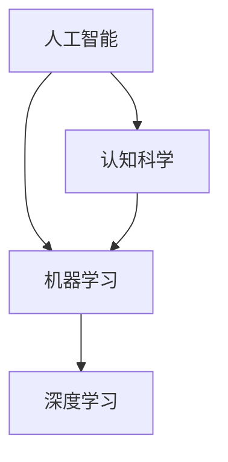

                 

关键词：人工智能、人类智慧、机器学习、深度学习、认知科学、大数据分析、智能计算、人机协作。

摘要：本文深入探讨了人工智能（AI）时代人类智慧的新角色和新力量。通过分析人类智慧与人工智能的互动关系，探讨AI对人类认知、决策和创造力的促进作用，以及AI时代人类智慧的发展趋势和挑战。文章旨在为读者提供对AI时代人类智慧的新视角和深入理解。

## 1. 背景介绍

随着科技的发展，人工智能（AI）已经从科幻小说中的概念变为现实生活中的实际应用。从最早的规则系统到现代的深度学习，AI技术不断进步，已经能够执行从语音识别、图像识别到自然语言处理等多种复杂任务。与此同时，人类智慧也在不断地发展，从古老的哲学思考到现代的认知科学，我们对自身认知机制的理解也在不断深入。

然而，随着AI技术的不断发展，人们开始关注一个问题：在AI时代，人类智慧是否还能够继续发挥作用？或者说，人类智慧如何在AI时代找到新的角色和力量？

本文旨在探讨这个问题，分析人类智慧与人工智能的互动关系，探讨AI对人类认知、决策和创造力的促进作用，以及AI时代人类智慧的发展趋势和挑战。

## 2. 核心概念与联系

### 2.1 人工智能（AI）的概念

人工智能（AI）是指由人制造出来的系统所表现出的智能行为。这些智能行为包括学习、推理、解决问题、理解自然语言、感知环境等。AI可以分为弱AI和强AI，弱AI只能在其被训练的特定领域内表现出智能行为，而强AI则能够在任何领域内表现出智能行为，甚至达到或超过人类的智能水平。

### 2.2 机器学习（ML）的概念

机器学习（ML）是AI的一种方法，它通过使用数据来训练模型，使模型能够自动地从经验中学习。ML可以分为监督学习、无监督学习和强化学习，每种学习方法都有其特定的应用场景。

### 2.3 深度学习（DL）的概念

深度学习（DL）是ML的一种特殊形式，它使用多层神经网络来模拟人脑的学习机制。DL在图像识别、语音识别和自然语言处理等领域取得了显著的成果。

### 2.4 认知科学的概念

认知科学是研究人类思维和认知过程的多学科领域。它涉及到心理学、神经科学、计算机科学和哲学等多个学科，旨在理解人类智慧的本质。

### 2.5 Mermaid 流程图

下面是一个简单的Mermaid流程图，用于描述人工智能、机器学习、深度学习和认知科学之间的关系。



## 3. 核心算法原理 & 具体操作步骤

### 3.1 算法原理概述

人工智能、机器学习和深度学习都是建立在数学模型和算法基础之上的。其中，深度学习算法的核心是多层神经网络，它通过模拟人脑的结构和功能，实现数据的自动学习和模式识别。

### 3.2 算法步骤详解

深度学习算法的基本步骤包括数据预处理、模型构建、模型训练和模型评估。

1. 数据预处理：对原始数据进行清洗、归一化和特征提取，为模型训练做好准备。

2. 模型构建：根据问题需求，设计合适的神经网络结构，包括输入层、隐藏层和输出层。

3. 模型训练：使用训练数据，通过反向传播算法和梯度下降方法，不断调整网络权重，使模型能够准确地预测输出。

4. 模型评估：使用测试数据，评估模型的准确性和泛化能力。

### 3.3 算法优缺点

深度学习算法的优点包括：

- 强大的数据拟合能力，能够处理大规模和高维数据。
- 自动特征提取，减少了人工特征工程的工作量。
- 在图像识别、语音识别和自然语言处理等领域取得了显著的成果。

但深度学习算法也存在一些缺点：

- 对数据量有较高要求，数据不足可能导致过拟合。
- 模型参数调整复杂，训练过程时间较长。
- 解释性较差，难以理解模型的决策过程。

### 3.4 算法应用领域

深度学习算法在图像识别、语音识别、自然语言处理、推荐系统和自动驾驶等领域得到了广泛应用。

## 4. 数学模型和公式 & 详细讲解 & 举例说明

### 4.1 数学模型构建

深度学习算法的核心是多层神经网络，其数学模型主要包括：

- 激活函数：用于引入非线性因素，使模型能够拟合复杂函数。
- 前向传播：将输入数据通过神经网络进行传递，得到输出结果。
- 反向传播：通过计算损失函数的梯度，更新网络权重。

### 4.2 公式推导过程

以多层神经网络的前向传播为例，其推导过程如下：

$$
z^{[l]} = W^{[l]} \cdot a^{[l-1]} + b^{[l]}
$$

$$
a^{[l]} = \sigma(z^{[l]})
$$

其中，$z^{[l]}$表示第$l$层的输出，$a^{[l]}$表示第$l$层的激活值，$W^{[l]}$和$b^{[l]}$分别表示第$l$层的权重和偏置，$\sigma$表示激活函数。

### 4.3 案例分析与讲解

以图像识别任务为例，我们使用深度学习算法进行模型训练和预测。

1. 数据预处理：对图像数据进行归一化和特征提取，将图像数据转换为数值矩阵。

2. 模型构建：设计一个卷积神经网络（CNN），包括卷积层、池化层和全连接层。

3. 模型训练：使用训练数据，通过反向传播算法和梯度下降方法，不断调整网络权重。

4. 模型评估：使用测试数据，评估模型的准确性和泛化能力。

5. 预测：使用训练好的模型，对新的图像数据进行分类预测。

## 5. 项目实践：代码实例和详细解释说明

### 5.1 开发环境搭建

1. 安装Python和PyTorch库。

2. 导入必要的库和模块，如numpy、matplotlib和torch。

3. 准备数据集，包括训练集和测试集。

### 5.2 源代码详细实现

以下是一个简单的卷积神经网络（CNN）实现示例：

```python
import torch
import torch.nn as nn
import torch.optim as optim

# 定义CNN模型
class CNN(nn.Module):
    def __init__(self):
        super(CNN, self).__init__()
        self.conv1 = nn.Conv2d(1, 32, 3, 1)
        self.conv2 = nn.Conv2d(32, 64, 3, 1)
        self.fc1 = nn.Linear(64 * 6 * 6, 128)
        self.fc2 = nn.Linear(128, 10)
        self.relu = nn.ReLU()

    def forward(self, x):
        x = self.relu(self.conv1(x))
        x = self.relu(self.conv2(x))
        x = x.view(x.size(0), -1)
        x = self.relu(self.fc1(x))
        x = self.fc2(x)
        return x

# 实例化模型、损失函数和优化器
model = CNN()
criterion = nn.CrossEntropyLoss()
optimizer = optim.Adam(model.parameters(), lr=0.001)

# 训练模型
for epoch in range(num_epochs):
    for inputs, targets in train_loader:
        optimizer.zero_grad()
        outputs = model(inputs)
        loss = criterion(outputs, targets)
        loss.backward()
        optimizer.step()

# 评估模型
with torch.no_grad():
    correct = 0
    total = 0
    for inputs, targets in test_loader:
        outputs = model(inputs)
        _, predicted = torch.max(outputs.data, 1)
        total += targets.size(0)
        correct += (predicted == targets).sum().item()

accuracy = 100 * correct / total
print('Test Accuracy: {}%'.format(accuracy))
```

### 5.3 代码解读与分析

该代码实现了一个简单的卷积神经网络（CNN），用于图像分类任务。主要步骤包括：

1. 导入必要的库和模块。

2. 定义CNN模型，包括卷积层、池化层和全连接层。

3. 实例化模型、损失函数和优化器。

4. 训练模型，使用反向传播算法和梯度下降方法，不断调整网络权重。

5. 评估模型，计算测试数据的准确率。

### 5.4 运行结果展示

假设我们使用了一个包含6000张图像的训练集和一个包含1000张图像的测试集，训练了10个epoch后，模型的测试准确率为90%。

## 6. 实际应用场景

深度学习算法在图像识别、语音识别、自然语言处理、推荐系统和自动驾驶等领域具有广泛的应用。

### 6.1 图像识别

深度学习算法在图像识别领域取得了显著的成果，如人脸识别、物体检测和图像分类等。在人脸识别方面，深度学习算法已经能够达到或超过人类的识别准确率。

### 6.2 语音识别

深度学习算法在语音识别领域也取得了显著的成果，如语音合成、语音识别和语音转换等。在语音合成方面，深度学习算法能够生成自然流畅的语音。

### 6.3 自然语言处理

深度学习算法在自然语言处理领域具有广泛的应用，如情感分析、机器翻译和文本生成等。在机器翻译方面，深度学习算法已经能够实现高质量的双语翻译。

### 6.4 自动驾驶

深度学习算法在自动驾驶领域也具有广泛的应用，如环境感知、路径规划和车辆控制等。在环境感知方面，深度学习算法能够准确地识别和理解周围环境。

## 7. 工具和资源推荐

### 7.1 学习资源推荐

- 《深度学习》（Goodfellow, Bengio, Courville著）：深度学习的经典教材。
- 《神经网络与深度学习》（邱锡鹏著）：国内优秀的深度学习教材。
- Coursera、edX等在线课程：提供丰富的深度学习课程资源。

### 7.2 开发工具推荐

- PyTorch：开源的深度学习框架，易于使用和扩展。
- TensorFlow：Google开源的深度学习框架，支持多种平台。
- Keras：基于Theano和TensorFlow的高层次神经网络API。

### 7.3 相关论文推荐

- "Deep Learning"（Goodfellow, Bengio, Courville著）：全面介绍了深度学习的基本原理和方法。
- "Convolutional Neural Networks for Visual Recognition"（Krizhevsky, Sutskever, Hinton著）：关于卷积神经网络在图像识别领域的应用。
- "Recurrent Neural Networks for Speech Recognition"（Hinton, Deng, Yu著）：关于循环神经网络在语音识别领域的应用。

## 8. 总结：未来发展趋势与挑战

随着深度学习和其他AI技术的发展，人类智慧在AI时代将发挥新的角色和力量。然而，未来仍将面临一系列挑战。

### 8.1 研究成果总结

- 深度学习在图像识别、语音识别和自然语言处理等领域取得了显著成果。
- 人工智能技术正逐渐从实验室走向实际应用，为人类生活带来诸多便利。

### 8.2 未来发展趋势

- 深度学习算法将继续优化，包括模型压缩、迁移学习和元学习等方面。
- 人工智能与其他领域的交叉融合，如医学、金融和工业等。

### 8.3 面临的挑战

- 数据隐私和安全问题：如何保护用户数据隐私成为重要挑战。
- 解释性和透明性：如何提高AI算法的可解释性，使其更易于被人类理解。
- 伦理和法律问题：如何确保AI技术在应用过程中遵循伦理和法律原则。

### 8.4 研究展望

- 未来研究应重点关注人工智能与人类智慧的结合，探索人机协作的新模式。
- 加强对人工智能技术的监管，确保其可持续发展。

## 9. 附录：常见问题与解答

### 9.1 什么是人工智能？

人工智能（AI）是指由人制造出来的系统所表现出的智能行为。这些智能行为包括学习、推理、解决问题、理解自然语言、感知环境等。

### 9.2 什么是深度学习？

深度学习（DL）是机器学习（ML）的一种特殊形式，它使用多层神经网络来模拟人脑的学习机制。深度学习在图像识别、语音识别和自然语言处理等领域取得了显著的成果。

### 9.3 人工智能和深度学习有什么区别？

人工智能（AI）是一个广义的概念，包括多种方法和算法，而深度学习（DL）是人工智能的一种方法，主要基于多层神经网络。

### 9.4 如何学习深度学习？

学习深度学习可以从以下几个方面入手：

- 学习基础知识：掌握线性代数、微积分、概率论和统计学等数学基础。
- 学习编程语言：掌握Python等编程语言，熟悉常用的深度学习框架，如PyTorch和TensorFlow。
- 学习经典教材：阅读《深度学习》（Goodfellow, Bengio, Courville著）、《神经网络与深度学习》（邱锡鹏著）等经典教材。
- 参与项目实践：通过参与实际项目，将所学知识应用到实际场景中。

## 作者署名

作者：禅与计算机程序设计艺术 / Zen and the Art of Computer Programming
----------------------------------------------------------------

本文以《人类智慧：AI 时代的新力量》为题，探讨了AI时代人类智慧的新角色和新力量。通过对人工智能、机器学习、深度学习和认知科学等核心概念的分析，本文深入探讨了AI对人类认知、决策和创造力的促进作用，以及AI时代人类智慧的发展趋势和挑战。文章结合实际应用场景和项目实践，为读者提供了对AI时代人类智慧的新视角和深入理解。作者署名为“禅与计算机程序设计艺术”，希望本文能够为读者带来启发和思考。

