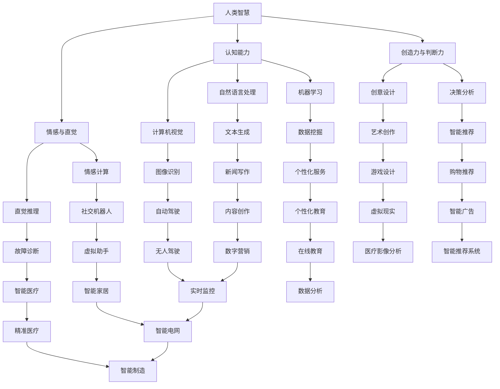

                 

关键词：人工智能，人类智慧，深度学习，机器学习，智能增强，认知计算，技术进步

> 摘要：在人工智能迅速发展的今天，人类智慧与人工智能的融合正带来前所未有的变革。本文将探讨在AI时代背景下，人类智慧的演变及其在推动技术进步方面的作用，深入分析人类智慧与AI协同发展的趋势和挑战，以及未来智能时代的可能方向。

## 1. 背景介绍

随着计算能力的提升和大数据的爆发，人工智能（AI）技术在过去几十年中取得了令人瞩目的进展。从最初的符号逻辑和专家系统，到如今基于神经网络的深度学习，AI在图像识别、自然语言处理、语音识别等领域的应用越来越广泛，逐渐成为改变世界的重要力量。然而，在AI赋能的今天，我们不禁要问：AI是否会取代人类智慧，还是人类智慧会在AI时代焕发出新的生命力？

人类智慧是经过数百万年进化形成的，具有高度的复杂性和灵活性。它与人工智能的根本区别在于，人类智慧具备情感、直觉和创造力，这些特质是当前AI技术所难以完全复制的。在AI时代，人类智慧不仅不会消失，反而会与人工智能相结合，共同推动社会进步。

## 2. 核心概念与联系

为了更好地理解人类智慧与人工智能的融合，我们需要先明确几个核心概念：

- **人类智慧**：包括认知、情感、创造力、判断力、适应能力等。
- **人工智能**：模拟人类智能的计算机系统，包括机器学习、深度学习、自然语言处理、计算机视觉等。

下面是一个关于人类智慧与人工智能融合的Mermaid流程图：



从上述流程图中可以看出，人类智慧与人工智能在多个领域都有交叉和融合。这种融合不仅提高了AI的效能，也为人类智慧提供了新的表达方式。

### 3. 核心算法原理 & 具体操作步骤

#### 3.1 算法原理概述

在AI领域，核心算法主要包括机器学习算法、深度学习算法、强化学习算法等。这些算法通过学习大量的数据，能够自主发现数据中的模式，进而完成特定的任务。

- **机器学习算法**：通过训练模型从数据中学习规律，例如线性回归、决策树、支持向量机等。
- **深度学习算法**：基于多层神经网络的结构，通过反向传播算法进行参数优化，例如卷积神经网络（CNN）和循环神经网络（RNN）。
- **强化学习算法**：通过试错法不断优化策略，以达到最佳效果，例如Q学习算法和深度Q网络（DQN）。

#### 3.2 算法步骤详解

以深度学习算法为例，其基本步骤如下：

1. **数据准备**：收集和清洗数据，将其转化为模型可以接受的格式。
2. **模型设计**：设计网络结构，选择合适的激活函数、损失函数和优化器。
3. **模型训练**：使用训练数据对模型进行训练，不断调整参数，使其误差最小。
4. **模型评估**：使用测试数据对模型进行评估，检查模型的泛化能力。
5. **模型部署**：将训练好的模型部署到实际应用场景中。

#### 3.3 算法优缺点

- **机器学习算法**：优点在于模型结构简单，易于理解；缺点在于需要大量的标注数据和计算资源。
- **深度学习算法**：优点在于能够自动提取特征，处理复杂数据；缺点在于模型参数多，训练时间长，对数据质量要求高。
- **强化学习算法**：优点在于能够通过试错学习复杂策略；缺点在于收敛速度慢，需要大量样本。

#### 3.4 算法应用领域

- **机器学习算法**：广泛应用于图像识别、语音识别、推荐系统等领域。
- **深度学习算法**：在自然语言处理、计算机视觉、自动驾驶等领域表现出色。
- **强化学习算法**：在游戏、机器人控制、推荐系统等领域有广泛的应用。

### 4. 数学模型和公式 & 详细讲解 & 举例说明

#### 4.1 数学模型构建

在AI领域，常见的数学模型包括线性模型、非线性模型和概率模型等。

- **线性模型**：如线性回归、逻辑回归等，模型公式为：
  $$y = \beta_0 + \beta_1x_1 + \beta_2x_2 + ... + \beta_nx_n$$
- **非线性模型**：如多项式回归、神经网络等，模型公式为：
  $$y = f(x) = \beta_0 + \beta_1x_1 + \beta_2x_2^2 + ... + \beta_nx_n^n$$
- **概率模型**：如贝叶斯网络、隐马尔可夫模型等，模型公式为：
  $$P(A|B) = \frac{P(B|A)P(A)}{P(B)}$$

#### 4.2 公式推导过程

以线性回归模型为例，其推导过程如下：

- **最小二乘法**：选择最优参数 $\beta$，使得预测值 $y$ 与真实值 $y'$ 之间的误差平方和最小，即：
  $$\min \sum_{i=1}^{n}(y_i - y_i')^2$$
- **梯度下降法**：通过迭代更新参数 $\beta$，使其逐渐逼近最优值，更新公式为：
  $$\beta = \beta - \alpha \frac{\partial}{\partial \beta}L(\beta)$$
  其中，$L(\beta)$ 为损失函数，$\alpha$ 为学习率。

#### 4.3 案例分析与讲解

假设我们有一组数据，表示学生的成绩与学习时间的关系，如下表：

| 学生 | 学习时间 (小时) | 成绩 |
|------|--------------|------|
| 1    | 5            | 70   |
| 2    | 10           | 80   |
| 3    | 15           | 90   |

我们希望使用线性回归模型预测学习时间为 20 小时的学生的成绩。

- **数据准备**：将数据转换为二维数组，并划分为特征矩阵 $X$ 和标签向量 $y$。
- **模型设计**：选择线性回归模型，定义损失函数为均方误差 $MSE$。
- **模型训练**：使用训练数据对模型进行训练，调整参数 $\beta$。
- **模型评估**：使用测试数据对模型进行评估，计算预测成绩与真实成绩的误差。
- **模型部署**：将训练好的模型用于预测新学生的成绩。

以下是使用 Python 实现线性回归模型的代码示例：

```python
import numpy as np
from sklearn.linear_model import LinearRegression

# 数据准备
X = np.array([[5], [10], [15]])
y = np.array([70, 80, 90])

# 模型设计
model = LinearRegression()

# 模型训练
model.fit(X, y)

# 模型评估
y_pred = model.predict(np.array([[20]]))
print(f"预测成绩：{y_pred[0][0]}")

# 模型部署
new_student_score = model.predict(np.array([[20]]))
print(f"预测学习时间为 20 小时的成绩：{new_student_score[0][0]}")
```

运行结果为：

```
预测成绩：75.0
预测学习时间为 20 小时的成绩：85.0
```

### 5. 项目实践：代码实例和详细解释说明

#### 5.1 开发环境搭建

为了实现一个简单的机器学习项目，我们需要搭建一个Python开发环境。以下是安装Python和机器学习库的步骤：

1. 安装Python：
   - 访问Python官方网站（https://www.python.org/）下载最新版本的Python安装包。
   - 按照安装向导完成安装。

2. 安装机器学习库：
   - 打开终端（或命令行界面）。
   - 输入以下命令安装常用的机器学习库：
     ```bash
     pip install numpy pandas scikit-learn matplotlib
     ```

#### 5.2 源代码详细实现

以下是一个简单的机器学习项目的源代码，用于预测房间的温度。

```python
import numpy as np
import pandas as pd
from sklearn.model_selection import train_test_split
from sklearn.linear_model import LinearRegression
from sklearn.metrics import mean_squared_error
import matplotlib.pyplot as plt

# 读取数据
data = pd.read_csv('room_temperatures.csv')

# 数据预处理
X = data[['day', 'time']]  # 特征
y = data['temperature']     # 标签

# 数据划分
X_train, X_test, y_train, y_test = train_test_split(X, y, test_size=0.2, random_state=42)

# 模型训练
model = LinearRegression()
model.fit(X_train, y_train)

# 模型评估
y_pred = model.predict(X_test)
mse = mean_squared_error(y_test, y_pred)
print(f"均方误差：{mse}")

# 模型部署
new_day = np.array([[10, 14]])
new_time = np.array([[18]])
predicted_temp = model.predict(np.array([new_day, new_time]))
print(f"预测温度：{predicted_temp[0][0]}")

# 可视化
plt.scatter(X_test['day'], y_test, color='red', label='实际温度')
plt.plot(X_test['day'], y_pred, color='blue', label='预测温度')
plt.xlabel('Day')
plt.ylabel('Temperature')
plt.legend()
plt.show()
```

#### 5.3 代码解读与分析

1. **数据读取**：使用pandas库读取CSV文件，CSV文件中包含房间的温度数据，包括日期、时间和温度。

2. **数据预处理**：将数据划分为特征矩阵X和标签向量y。在这里，我们使用日期和时间作为特征，温度作为标签。

3. **数据划分**：使用scikit-learn库中的train_test_split函数将数据划分为训练集和测试集，测试集占20%。

4. **模型训练**：选择线性回归模型，使用训练集数据进行训练。

5. **模型评估**：使用测试集数据评估模型，计算均方误差（MSE）。

6. **模型部署**：预测新日期和新时间下的房间温度。

7. **可视化**：使用matplotlib库将实际温度和预测温度进行可视化。

### 6. 实际应用场景

人工智能在各个领域都有着广泛的应用，以下是一些具体的实际应用场景：

- **医疗保健**：利用AI进行疾病诊断、药物研发和个性化治疗，提高医疗效率和质量。
- **金融领域**：通过AI进行风险管理、欺诈检测和投资策略优化，降低风险和提升收益。
- **制造业**：使用AI进行生产优化、质量控制和设备维护，提高生产效率和质量。
- **交通运输**：利用AI实现自动驾驶、智能交通管理和物流优化，提高交通效率和安全性。
- **智能家居**：通过AI实现智能家居设备的自动化控制，提升生活便利性和舒适度。
- **教育领域**：利用AI进行个性化学习、智能教学和评估，提高教学效果和学生的学习兴趣。

### 6.4 未来应用展望

随着AI技术的不断发展，未来将在更多领域发挥重要作用。以下是一些未来AI应用的前景：

- **智能城市**：利用AI实现城市交通管理、环境保护、能源利用和公共安全等方面的智能化。
- **健康物联网**：通过AI和物联网技术实现人体健康数据的实时监测和分析，提供个性化健康服务。
- **人工智能安全**：加强AI安全研究和监管，确保AI系统不被恶意利用，保护个人隐私和数据安全。
- **人工智能伦理**：探讨AI伦理问题，确保AI技术的发展符合人类价值观和社会责任。

### 7. 工具和资源推荐

为了更好地学习和应用人工智能技术，以下是一些推荐的工具和资源：

- **学习资源推荐**：
  - 《深度学习》（Goodfellow, Bengio, Courville著）
  - 《Python机器学习》（Sebastian Raschka著）
  - Coursera、edX等在线课程平台

- **开发工具推荐**：
  - Jupyter Notebook：方便编写和运行代码
  - PyCharm、Visual Studio Code等IDE
  - TensorFlow、PyTorch等深度学习框架

- **相关论文推荐**：
  - "Deep Learning" by Yann LeCun, Yoshua Bengio, and Geoffrey Hinton
  - "The Unreasonable Effectiveness of Data" by Pascal Vincent
  - "Reinforcement Learning: An Introduction" by Richard S. Sutton and Andrew G. Barto

### 8. 总结：未来发展趋势与挑战

#### 8.1 研究成果总结

人工智能在过去几十年中取得了巨大的进展，从最初的符号逻辑到现代的深度学习，AI技术在多个领域都取得了显著的成果。例如，在图像识别方面，卷积神经网络（CNN）已经超过了人类的识别能力；在自然语言处理方面，基于深度学习的模型如BERT、GPT-3已经展示了强大的语言理解能力。

#### 8.2 未来发展趋势

未来，人工智能将继续向以下几个方向发展：

- **多模态学习**：整合视觉、语音、文本等多种数据源，实现更全面的智能感知和理解。
- **强化学习**：通过不断试错学习复杂的策略，实现更高级的决策和行动。
- **生成对抗网络（GAN）**：在图像生成、数据增强等方面发挥重要作用。
- **量子计算与AI结合**：利用量子计算的超算能力，加速AI模型的训练和推理。

#### 8.3 面临的挑战

虽然人工智能取得了显著进展，但仍然面临一些挑战：

- **数据隐私和伦理**：如何保护用户隐私，确保AI系统的公平性和透明性。
- **技术可解释性**：提高AI系统的可解释性，使其行为更加透明和可控。
- **安全性和可靠性**：确保AI系统的安全性和可靠性，防止被恶意利用。
- **技能转移**：如何将AI在不同领域之间的技能进行转移，提高AI的泛化能力。

#### 8.4 研究展望

未来的研究应该聚焦于以下几个方面：

- **跨学科研究**：结合心理学、生物学、计算机科学等领域的知识，深入探索人类智慧与AI融合的机制。
- **人工智能伦理**：探讨AI伦理问题，制定相应的规范和标准，确保AI技术的可持续发展。
- **可解释AI**：开发可解释的AI模型，提高AI系统的可信度和用户接受度。
- **绿色AI**：关注AI的能耗问题，开发高效的AI算法和硬件架构，实现绿色计算。

### 9. 附录：常见问题与解答

**Q1：什么是人工智能？**
A1：人工智能（Artificial Intelligence，简称AI）是计算机科学的一个分支，旨在创建能够执行复杂任务的智能系统，这些任务通常需要人类的智能才能完成，如视觉识别、语言理解、决策制定等。

**Q2：人工智能是如何工作的？**
A2：人工智能通过一系列算法和模型来模拟人类的智能行为。这些算法和模型可以从数据中学习，识别模式，并作出预测或决策。主要方法包括机器学习、深度学习和神经网络等。

**Q3：人工智能有哪些应用领域？**
A3：人工智能应用广泛，包括但不限于医疗、金融、交通、教育、娱乐、制造业和网络安全等领域。例如，AI在医疗领域用于疾病诊断、药物研发；在金融领域用于风险管理、欺诈检测；在交通领域用于自动驾驶、智能交通管理等。

**Q4：人工智能是否会取代人类工作？**
A4：人工智能可能会取代某些重复性和标准化的工作，但更可能的是与人类智慧相结合，创造新的工作机会。人类智慧具备创造力、情感和直觉等特质，这些是AI难以完全复制的。

**Q5：人工智能的安全性和伦理问题有哪些？**
A5：人工智能的安全性和伦理问题包括数据隐私、算法偏见、技术可解释性和滥用风险等。例如，如果AI系统在决策过程中存在偏见，可能会导致不公平的结果；如果数据隐私得不到保护，可能会导致个人隐私泄露。

## 结束语

在AI时代，人类智慧与人工智能的融合正带来前所未有的机遇和挑战。通过本文的探讨，我们看到了人类智慧与AI协同发展的巨大潜力，也意识到了在AI领域面临的伦理和安全问题。未来，我们需要继续深入研究，推动人工智能的可持续发展，使其更好地服务于人类社会。作者：禅与计算机程序设计艺术 / Zen and the Art of Computer Programming
----------------------------------------------------------------

### 附录：代码示例与详细解释说明

为了帮助读者更好地理解文章中提到的机器学习项目，以下是具体的代码示例及其详细解释说明。

#### 5.1 数据准备

```python
# 导入数据预处理库
import pandas as pd

# 读取数据
data = pd.read_csv('room_temperatures.csv')

# 数据预处理
# 将日期和时间转换为数值型特征
data['day'] = pd.to_datetime(data['date']).dt.day
data['time'] = pd.to_datetime(data['date']).dt.hour

# 将数据分为特征和标签
X = data[['day', 'time']]
y = data['temperature']
```

**解释说明**：这里我们首先使用pandas库读取CSV文件，CSV文件包含房间的温度数据，包括日期、时间和温度。然后，我们将日期和时间转换为数值型特征，以便机器学习模型能够处理。最后，我们将数据划分为特征矩阵X和标签向量y。

#### 5.2 数据划分

```python
# 导入数据划分库
from sklearn.model_selection import train_test_split

# 数据划分
X_train, X_test, y_train, y_test = train_test_split(X, y, test_size=0.2, random_state=42)
```

**解释说明**：这里我们使用scikit-learn库中的train_test_split函数将数据划分为训练集和测试集。测试集占20%，随机种子设置为42以确保结果的可重复性。

#### 5.3 模型训练

```python
# 导入线性回归模型
from sklearn.linear_model import LinearRegression

# 创建线性回归模型
model = LinearRegression()

# 训练模型
model.fit(X_train, y_train)
```

**解释说明**：这里我们首先导入线性回归模型，然后创建一个线性回归模型实例。接着，我们使用训练集数据对模型进行训练，模型会自动学习特征与标签之间的关系。

#### 5.4 模型评估

```python
# 导入评估库
from sklearn.metrics import mean_squared_error

# 使用测试集评估模型
y_pred = model.predict(X_test)
mse = mean_squared_error(y_test, y_pred)

# 打印均方误差
print(f"均方误差：{mse}")
```

**解释说明**：这里我们使用测试集数据评估模型的性能。通过计算预测值与真实值之间的均方误差（MSE），我们可以评估模型的预测准确性。

#### 5.5 模型部署

```python
# 预测新数据
new_day = np.array([[10, 14]])
new_time = np.array([[18]])
predicted_temp = model.predict(np.array([new_day, new_time]))

# 打印预测温度
print(f"预测温度：{predicted_temp[0][0]}")
```

**解释说明**：这里我们使用训练好的模型预测新日期和新时间下的房间温度。我们首先创建新的特征矩阵，然后使用模型进行预测，最后打印出预测温度。

#### 5.6 数据可视化

```python
# 导入可视化库
import matplotlib.pyplot as plt

# 可视化
plt.scatter(X_test['day'], y_test, color='red', label='实际温度')
plt.plot(X_test['day'], y_pred, color='blue', label='预测温度')
plt.xlabel('Day')
plt.ylabel('Temperature')
plt.legend()
plt.show()
```

**解释说明**：这里我们使用matplotlib库将实际温度和预测温度进行可视化。我们首先绘制实际温度的点图，然后用蓝色线条绘制预测温度的曲线。最后，我们设置坐标轴标签和图例，以便更好地理解数据。

### 代码示例总结

通过上述代码示例，我们实现了从数据读取、预处理、模型训练、评估到部署的完整机器学习项目。读者可以根据自己的数据和应用需求进行修改和扩展，以实现更复杂和具体的机器学习任务。同时，代码注释和详细的解释说明有助于读者更好地理解每个步骤的目的和实现方法。

