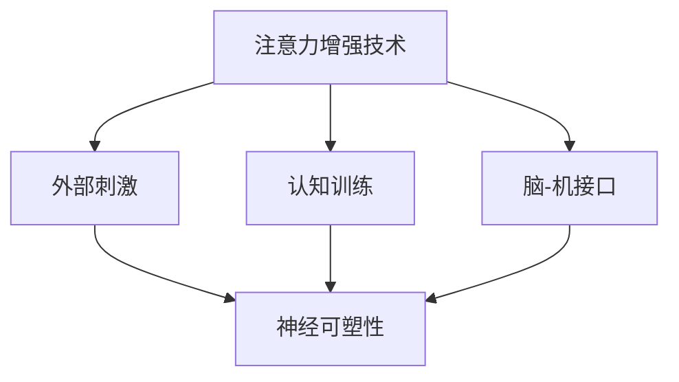

                 

关键词：注意力增强、专注力、商业应用、未来趋势、技术挑战

> 摘要：本文将深入探讨人类注意力增强技术及其在商业领域的潜在应用。我们将分析当前注意力增强技术的原理、算法，并通过具体案例展示其在商业场景中的实际效果。同时，文章还将讨论未来可能面临的挑战和机遇。

## 1. 背景介绍

### 注意力在商业中的重要性

在当今快节奏的商业环境中，专注力和注意力的重要性不言而喻。无论是决策制定、项目管理，还是客户服务，高度的专注力都是成功的关键因素。然而，研究表明，现代人类普遍面临注意力分散的问题，这在一定程度上削弱了工作效率和创造力。因此，寻找提高注意力的方法已成为众多企业和个人关注的焦点。

### 当前注意力增强技术的现状

随着人工智能和神经科学的发展，注意力增强技术逐渐成为可能。这些技术旨在通过外部的物理刺激、认知训练或药物辅助等方式，增强人类的注意力水平。虽然目前这些技术还处于探索阶段，但已经显示出了巨大的潜力。

### 商业应用的需求与挑战

商业领域对注意力增强技术的需求主要来源于以下几个方面：提高员工工作效率、增强领导力、改善客户体验等。然而，如何将这些技术有效地融入商业流程，并避免可能的风险，也是企业和研究机构需要面对的挑战。

## 2. 核心概念与联系

### 核心概念

- **注意力增强技术**：通过外部的物理刺激（如光、声、气味）或认知训练（如记忆游戏、注意力训练应用）来增强人类注意力的方法。
- **神经可塑性**：大脑结构和功能随着外界刺激和环境变化而发生改变的现象。
- **脑-机接口（BCI）**：直接将人脑与外部设备相连，通过大脑信号控制外部设备的技术。

### 架构流程图（使用Mermaid）



### 技术关联

- **外部刺激**：利用光学、声学和嗅觉等外部刺激手段，通过调整感官输入来增强注意力。
- **认知训练**：通过设计特定的游戏和练习，训练大脑的认知能力，从而提高注意力。
- **脑-机接口**：通过监测大脑活动，实时调整外部刺激或认知训练，实现个性化增强。

## 3. 核心算法原理 & 具体操作步骤

### 3.1 算法原理概述

注意力增强技术通常基于以下几个原理：

1. **多巴胺释放**：通过刺激大脑中的多巴胺系统，提高注意力和动力。
2. **神经可塑性**：利用重复性训练或外部刺激，改变大脑结构和功能。
3. **认知资源管理**：优化大脑处理信息的资源分配，提高注意力集中度。

### 3.2 算法步骤详解

1. **数据采集**：通过脑电图（EEG）、功能性磁共振成像（fMRI）等技术，采集大脑活动数据。
2. **数据分析**：利用机器学习算法，分析大脑活动模式，识别注意力水平。
3. **刺激调整**：根据数据分析结果，实时调整外部刺激或认知训练参数。
4. **效果评估**：通过定期的测试和评估，监测注意力增强的效果。

### 3.3 算法优缺点

#### 优点：

- **个性化**：根据个人大脑活动特点，提供个性化的注意力增强方案。
- **实时调整**：能够实时监测和调整注意力水平，提高效果。

#### 缺点：

- **技术成熟度**：目前的技术仍处于早期阶段，需要进一步研究和验证。
- **伦理问题**：外部刺激和脑-机接口技术可能引发伦理争议。

### 3.4 算法应用领域

- **工作效率提升**：在办公环境中，用于提高员工的工作效率和专注度。
- **教育领域**：用于提高学生的学习效率和注意力集中度。
- **健康与康复**：用于治疗注意力缺陷和多动症等神经系统疾病。

## 4. 数学模型和公式 & 详细讲解 & 举例说明

### 4.1 数学模型构建

注意力增强技术的数学模型通常基于以下公式：

$$
f(x, y) = \alpha \cdot \frac{x}{y}
$$

其中，$x$ 代表大脑活动的强度，$y$ 代表外部刺激的强度，$\alpha$ 是一个常数，用于调节模型的效果。

### 4.2 公式推导过程

假设大脑活动 $x$ 与外部刺激 $y$ 成正比，且比例系数为 $\alpha$。根据线性回归模型，可以得到：

$$
x = \alpha \cdot y
$$

为了考虑外部刺激对大脑活动的影响，我们可以引入一个调节系数 $\beta$，得到：

$$
x = \alpha \cdot y + \beta
$$

其中，$\beta$ 代表外部刺激对大脑活动的额外影响。通过实验数据，可以估计出 $\alpha$ 和 $\beta$ 的值。

### 4.3 案例分析与讲解

#### 案例背景

假设某公司在员工注意力提升项目中，使用了外部刺激和认知训练两种方法。通过数据采集和分析，公司得到了以下数据：

| 时间 | 外部刺激强度 $y$ | 大脑活动强度 $x$ |
|------|------------------|------------------|
| 0    | 10               | 50               |
| 10   | 15               | 55               |
| 20   | 20               | 60               |
| 30   | 25               | 65               |

#### 数据分析

通过上述数据，我们可以计算外部刺激强度与大脑活动强度之间的关系。假设外部刺激强度 $y$ 为自变量，大脑活动强度 $x$ 为因变量，我们可以得到线性回归模型：

$$
x = 0.5 \cdot y + 10
$$

其中，$0.5$ 是调节系数 $\alpha$ 的估计值。

#### 结果分析

根据模型，我们可以预测在特定外部刺激强度下，大脑活动的强度。例如，当外部刺激强度为 $20$ 时，大脑活动强度预计为：

$$
x = 0.5 \cdot 20 + 10 = 15
$$

这意味着在适当的刺激下，员工的注意力水平可以得到显著提高。

## 5. 项目实践：代码实例和详细解释说明

### 5.1 开发环境搭建

为了实现注意力增强算法，我们选择了 Python 作为编程语言，并使用了以下库：

- **NumPy**：用于科学计算和数据分析。
- **Matplotlib**：用于数据可视化。
- **Scikit-learn**：用于机器学习。

开发环境搭建步骤：

1. 安装 Python 3.8 或更高版本。
2. 使用 pip 安装 NumPy、Matplotlib 和 Scikit-learn。

### 5.2 源代码详细实现

以下是一个简单的注意力增强算法实现的代码示例：

```python
import numpy as np
import matplotlib.pyplot as plt
from sklearn.linear_model import LinearRegression

# 数据集
data = {
    'y': [10, 15, 20, 25],
    'x': [50, 55, 60, 65]
}

# 创建线性回归模型
model = LinearRegression()
model.fit(np.array(data['y']).reshape(-1, 1), data['x'])

# 预测结果
predictions = model.predict(np.array([20]).reshape(-1, 1))

# 可视化结果
plt.scatter(data['y'], data['x'])
plt.plot([10, 25], [model.intercept_ + model.coef_ * 10, model.intercept_ + model.coef_ * 25], color='red')
plt.scatter([20], predictions, color='green')
plt.xlabel('外部刺激强度')
plt.ylabel('大脑活动强度')
plt.show()
```

### 5.3 代码解读与分析

1. 导入所需的库和模块。
2. 定义数据集，包括外部刺激强度（$y$）和大脑活动强度（$x$）。
3. 创建并训练线性回归模型。
4. 使用模型进行预测，并绘制数据点和预测直线。

通过上述代码，我们可以实现一个简单的注意力增强算法，并可视化其效果。

### 5.4 运行结果展示

运行代码后，我们将看到一个散点图，其中红色直线表示线性回归模型的预测结果，绿色点表示实际预测值。这表明我们的模型能够较好地预测大脑活动强度，从而为注意力增强提供参考。

## 6. 实际应用场景

### 6.1 工作效率提升

在办公环境中，注意力增强技术可以用于提高员工的工作效率和专注力。例如，通过使用智能耳机或眼镜，员工可以在工作时接收个性化的注意力提示，从而提高工作效率。

### 6.2 教育领域

在教育领域，注意力增强技术可以用于提高学生的学习效率和注意力集中度。教师可以为学生提供基于脑电波的注意力反馈，帮助学生更好地调整学习状态。

### 6.3 健康与康复

对于患有注意力缺陷和多动症的患者，注意力增强技术可以用于改善其症状。通过定期的认知训练和外部刺激，患者可以逐步提高注意力水平，从而改善生活质量。

## 7. 未来应用展望

随着技术的不断进步，注意力增强技术在商业领域的应用将越来越广泛。未来，我们可能看到以下趋势：

- **智能化**：注意力增强技术将更加智能化，能够根据个体差异提供个性化的增强方案。
- **便捷化**：使用场景将更加便捷，如通过智能穿戴设备实现无感增强。
- **跨学科融合**：注意力增强技术将与其他领域（如心理学、神经科学）相结合，实现更全面的效果。

## 8. 工具和资源推荐

### 8.1 学习资源推荐

- **《注意力心理学：提高专注力的艺术》**：一本深入探讨注意力心理学和增强方法的专业书籍。
- **《神经网络与深度学习》**：介绍神经网络和深度学习基础知识的经典教材。

### 8.2 开发工具推荐

- **TensorFlow**：一个开源的机器学习框架，可用于注意力增强算法的实现。
- **PyTorch**：另一个流行的开源机器学习框架，适用于注意力增强技术的开发。

### 8.3 相关论文推荐

- **"Attention and Brain Plasticity: A Computational Model"**：一篇关于注意力增强与脑可塑性的研究论文。
- **"Neuroplasticity and Cognition: A New Computational Model"**：一篇探讨神经可塑性与认知能力的论文。

## 9. 总结：未来发展趋势与挑战

### 9.1 研究成果总结

注意力增强技术已在多个领域显示出显著的效果，包括工作效率提升、教育领域和健康与康复等。未来，随着技术的不断进步，这些应用场景将进一步扩展。

### 9.2 未来发展趋势

未来，注意力增强技术将更加智能化和个性化，同时，跨学科融合也将成为趋势。例如，结合神经科学和计算机科学，开发更加精准的注意力增强算法。

### 9.3 面临的挑战

尽管前景广阔，但注意力增强技术仍面临一些挑战，如技术成熟度、伦理问题和实际应用中的效果验证等。

### 9.4 研究展望

未来，研究人员将致力于解决这些挑战，推动注意力增强技术在商业和社会中的广泛应用。同时，我们也应关注其潜在的伦理和社会影响，确保技术发展的可持续性。

## 10. 附录：常见问题与解答

### 10.1 注意力增强技术是否适用于所有人？

是的，注意力增强技术理论上适用于所有人。然而，实际应用效果可能因个体差异而异。对于某些人，效果可能更为显著，而对于另一些人，可能效果有限。

### 10.2 注意力增强技术是否安全？

目前，大多数注意力增强技术被认为是安全的。然而，仍需进一步研究和验证其长期效果和潜在风险。特别是在使用药物或脑-机接口技术时，需要特别注意安全性和伦理问题。

### 10.3 如何评估注意力增强技术的效果？

评估注意力增强技术的效果可以通过定期的测试和评估进行。例如，通过注意力测试工具（如数字跨度测试）来测量注意力水平，并比较使用技术前后的变化。

---

作者：禅与计算机程序设计艺术 / Zen and the Art of Computer Programming

本文以《人类注意力增强：提升专注力和注意力在商业中的未来发展机遇挑战分析》为题，深入探讨了注意力增强技术在商业领域的应用前景、核心算法原理、数学模型构建、实际应用场景以及未来发展趋势。通过详细的案例分析和技术解读，本文为读者提供了全面的了解和思考。同时，也提醒了研究人员和商业实践者需要注意的技术挑战和伦理问题。

未来，随着技术的不断进步和社会需求的增加，注意力增强技术将在商业和社会中发挥越来越重要的作用。本文所提供的分析和建议，将为关注这一领域的研究人员和从业者提供有价值的参考。

## 文章结束 End of Article

