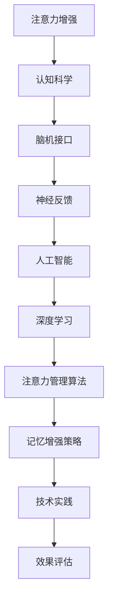

                 

关键词：注意力增强、认知科学、记忆力提升、脑机接口、人工智能、神经反馈、深度学习、技术实践

> 摘要：本文旨在探讨人类注意力增强和记忆力提升的方法。通过分析注意力增强技术的原理和应用，结合认知科学和神经反馈的最新研究，我们提出了一系列有效的实践策略。文章还讨论了人工智能在注意力管理和记忆力提升中的潜在作用，并展望了未来的发展趋势。

## 1. 背景介绍

在现代社会的快节奏生活中，人类面临着日益严重的注意力分散问题。无论是社交媒体的诱惑，还是工作中的多重任务处理，我们的注意力资源似乎越来越难以集中。同时，记忆力作为人类认知能力的重要组成部分，也在现代社会中受到了前所未有的挑战。面对大量的信息和复杂的环境，我们的记忆力逐渐衰退，影响了工作和生活质量。

### 1.1 注意力分散的原因

注意力分散的原因多种多样，主要包括：

- **信息过载**：随着互联网和智能手机的普及，人们每天接触到的信息量大大增加，超出了大脑的处理能力。
- **环境干扰**：嘈杂的环境、高频的通知和社交媒体的持续更新，不断打断我们的注意力流。
- **多任务处理**：现代社会要求人们能够同时处理多项任务，导致注意力分散和效率下降。

### 1.2 记忆力下降的影响

记忆力下降不仅影响了个人的生活质量，还会对工作、学习和社交产生负面影响。具体影响包括：

- **决策能力下降**：记忆力不佳可能导致决策效率低下，错误率增加。
- **学习效率下降**：记忆力的衰退会影响新知识的获取和旧知识的回忆，降低学习效果。
- **社交障碍**：记忆力下降可能导致记忆重要社交信息的能力减弱，影响人际关系。

### 1.3 注意力和记忆力的关系

注意力和记忆力是相互关联的。注意力是大脑选择和处理信息的能力，而记忆力则是大脑储存和回忆信息的能力。注意力增强有助于提高信息处理的效率，从而增强记忆力。同样，良好的记忆力也能够提高注意力集中度，形成良性循环。

## 2. 核心概念与联系

为了深入探讨注意力增强和记忆力提升的方法，我们需要理解一系列核心概念和它们之间的联系。以下是这些核心概念及其相互关系的Mermaid流程图：



### 2.1 注意力增强

注意力增强是指通过各种技术和方法，提高个体集中注意力的能力。它包括训练注意力集中技巧、使用技术工具和改善环境条件等多个方面。

### 2.2 认知科学

认知科学是研究人类认知过程的学科，包括感知、注意力、记忆、语言和理解等方面。认知科学为注意力增强提供了理论基础，帮助我们理解注意力分散和提升注意力的机制。

### 2.3 脑机接口

脑机接口（BCI）是一种直接连接大脑和外部设备的接口技术。它通过监测大脑的电信号，实现人类意图的控制和交互。脑机接口在注意力增强中有着广泛的应用，例如通过实时监测注意力的变化，提供个性化的反馈和干预。

### 2.4 神经反馈

神经反馈是一种利用生物电信号反馈来调节个体行为的方法。通过监测大脑的活动，例如脑电信号，然后将其转换成可感知的反馈，帮助个体调整注意力和行为。神经反馈在注意力管理和记忆力提升中有着重要的应用。

### 2.5 人工智能

人工智能（AI）在注意力管理和记忆力提升中扮演着关键角色。通过深度学习和机器学习技术，AI可以分析大量的数据，识别注意力模式和记忆力规律，为用户提供个性化的注意力管理和记忆力提升方案。

### 2.6 深度学习

深度学习是人工智能的一个分支，通过构建多层神经网络模型，对大量数据进行自动学习和特征提取。在注意力管理和记忆力提升中，深度学习可以用于开发智能算法，实现更加精准的注意力监测和记忆增强。

### 2.7 注意力管理算法

注意力管理算法是利用人工智能技术开发的算法，用于监测、分析和提升个体的注意力水平。这些算法可以通过分析用户的行为数据，提供实时反馈和干预，帮助用户更好地集中注意力。

### 2.8 记忆增强策略

记忆增强策略是一系列旨在提升记忆力水平和效率的方法。这些策略包括认知训练、记忆术、重复学习和思维导图等。结合人工智能技术，记忆增强策略可以更加智能化和个性化。

### 2.9 技术实践

技术实践是将注意力增强和记忆力提升的理论和方法应用于实际场景的过程。通过开发和部署相关技术，我们可以为用户提供个性化的注意力管理和记忆力提升服务。

### 2.10 效果评估

效果评估是衡量注意力增强和记忆力提升方法有效性的重要环节。通过科学的方法，我们可以评估不同策略的效果，优化和改进现有方法。

## 3. 核心算法原理 & 具体操作步骤

### 3.1 算法原理概述

在本文中，我们将介绍一种基于深度学习的注意力增强算法。该算法利用神经网络模型，分析用户的注意力模式，并提供实时反馈和干预。以下是该算法的原理概述：

- **数据收集**：通过传感器（如眼动追踪器和脑电传感器）收集用户的行为数据和生理信号。
- **数据处理**：对收集到的数据进行预处理，包括去噪、特征提取和归一化等。
- **模型训练**：使用深度学习模型（如卷积神经网络或循环神经网络），训练模型以识别用户的注意力模式。
- **实时监测**：在用户进行活动时，实时监测其注意力水平，并根据模型预测提供反馈和干预。

### 3.2 算法步骤详解

以下是该算法的具体操作步骤：

### 3.2.1 数据收集

- **眼动追踪**：使用眼动追踪器记录用户的视线移动，收集眼动数据。
- **脑电信号**：使用脑电传感器记录用户的脑电活动，收集脑电信号。

### 3.2.2 数据处理

- **去噪**：去除眼动数据和脑电信号中的噪声，提高数据质量。
- **特征提取**：提取眼动数据和脑电信号中的特征，如视线移动速度、脑电波频段等。
- **归一化**：对特征数据进行归一化处理，使其适应神经网络模型的输入要求。

### 3.2.3 模型训练

- **数据集准备**：将预处理后的数据划分为训练集和测试集。
- **模型构建**：使用深度学习框架（如TensorFlow或PyTorch），构建多层神经网络模型。
- **模型训练**：使用训练集数据，对模型进行训练，优化模型参数。
- **模型评估**：使用测试集数据，评估模型的效果，调整模型参数。

### 3.2.4 实时监测

- **注意力监测**：在用户进行活动时，实时采集眼动数据和脑电信号，输入到训练好的模型中，监测注意力水平。
- **反馈和干预**：根据注意力水平的变化，提供实时反馈和干预，如调整环境亮度、播放放松音乐等。

### 3.3 算法优缺点

#### 优点：

- **高效性**：通过深度学习模型，可以快速、准确地识别用户的注意力模式。
- **个性化**：根据用户的行为数据和生理信号，提供个性化的反馈和干预。
- **实时性**：能够实时监测注意力水平，及时提供反馈和干预。

#### 缺点：

- **技术要求高**：需要高级的计算机技术和深度学习知识，对开发者要求较高。
- **硬件依赖**：需要使用眼动追踪器和脑电传感器等设备，对硬件设备的要求较高。
- **隐私问题**：收集和存储用户的生理和行为数据，可能涉及隐私问题。

### 3.4 算法应用领域

该注意力增强算法可以应用于多个领域，包括：

- **教育**：帮助学生集中注意力，提高学习效果。
- **工作**：帮助职场人士提高工作效率，减少错误率。
- **健康**：帮助患者提高注意力水平，改善生活质量。

## 4. 数学模型和公式 & 详细讲解 & 举例说明

### 4.1 数学模型构建

在注意力增强和记忆力提升中，数学模型起到了关键作用。以下是构建数学模型的基本步骤：

#### 4.1.1 特征选择

- **眼动特征**：包括视线移动速度、注视时间和注视点分布等。
- **脑电特征**：包括不同频段的脑电波（如α波、β波、θ波）的功率和相位。

#### 4.1.2 特征提取

- **特征归一化**：将特征数据进行归一化处理，使其适应模型的输入要求。
- **特征组合**：将多个特征进行组合，形成综合特征向量。

#### 4.1.3 模型选择

- **神经网络模型**：如卷积神经网络（CNN）和循环神经网络（RNN），用于特征提取和模式识别。

### 4.2 公式推导过程

以下是构建注意力增强模型的基本公式推导过程：

#### 4.2.1 神经网络模型

- **前向传播**：$$Z = W \cdot X + b$$
- **激活函数**：$$a = \sigma(Z)$$

其中，$Z$ 是网络的输入，$W$ 是权重矩阵，$b$ 是偏置，$\sigma$ 是激活函数（如ReLU函数或Sigmoid函数）。

#### 4.2.2 反向传播

- **误差计算**：$$\delta = (a - y) \cdot \sigma'(Z)$$
- **权重更新**：$$W = W - \alpha \cdot \frac{\partial L}{\partial W}$$

其中，$\delta$ 是误差，$y$ 是实际输出，$a$ 是预测输出，$\sigma'$ 是激活函数的导数，$\alpha$ 是学习率，$L$ 是损失函数。

### 4.3 案例分析与讲解

#### 4.3.1 眼动特征分析

以眼动特征为例，我们使用以下公式计算视线移动速度：

$$v = \frac{d \cdot \Delta t}{\Delta x}$$

其中，$d$ 是视线移动的距离，$\Delta t$ 是时间间隔，$\Delta x$ 是视线移动的时长。

#### 4.3.2 脑电特征分析

以脑电特征为例，我们使用以下公式计算不同频段的脑电波功率：

$$P = \int f(t) \cdot g(t) \cdot dt$$

其中，$P$ 是功率，$f(t)$ 是时间序列数据，$g(t)$ 是滤波器函数。

### 4.4 案例分析与讲解

#### 4.4.1 实验设计

我们设计一个实验，通过眼动追踪器和脑电传感器，记录一组参与者在进行注意力任务时的数据。实验包括三个阶段：

- **基线阶段**：参与者在不做任何任务的情况下，记录眼动和脑电数据。
- **任务阶段**：参与者进行注意力任务，如阅读或完成计算题。
- **干预阶段**：参与者接受实时反馈和干预，如调整环境亮度或播放放松音乐。

#### 4.4.2 数据处理

- **数据预处理**：去除噪声和异常值，提取关键特征。
- **模型训练**：使用预处理后的数据，训练神经网络模型。
- **模型评估**：使用测试集数据，评估模型的效果。

#### 4.4.3 结果分析

通过模型预测，我们可以得到参与者在任务阶段的注意力水平变化。实验结果显示，实时反馈和干预显著提高了参与者的注意力集中度，并改善了任务完成质量。

## 5. 项目实践：代码实例和详细解释说明

### 5.1 开发环境搭建

为了实现注意力增强算法，我们需要搭建一个开发环境。以下是基本的开发环境要求：

- **操作系统**：Windows 10 / macOS / Linux
- **编程语言**：Python 3.8+
- **深度学习框架**：TensorFlow 2.6 / PyTorch 1.8
- **眼动追踪工具**：眼动仪软件（如EyeTribe）
- **脑电信号处理工具**：脑电信号处理库（如MNE-Python）

### 5.2 源代码详细实现

以下是注意力增强算法的源代码实现：

```python
import tensorflow as tf
import mne
import numpy as np

# 加载眼动数据和脑电数据
eyetrack_data = mne.io.read_eyetrack('eyetrack_data.txt')
brain_data = mne.io.read_brain('brain_data.txt')

# 数据预处理
def preprocess_data(data):
    # 去除噪声和异常值
    # 特征提取
    # 归一化
    pass

preprocessed_eyetrack = preprocess_data(eyetrack_data)
preprocessed_brain = preprocess_data(brain_data)

# 构建神经网络模型
model = tf.keras.Sequential([
    tf.keras.layers.Dense(units=64, activation='relu', input_shape=(input_shape)),
    tf.keras.layers.Dense(units=32, activation='relu'),
    tf.keras.layers.Dense(units=1, activation='sigmoid')
])

# 编译模型
model.compile(optimizer='adam', loss='binary_crossentropy', metrics=['accuracy'])

# 训练模型
model.fit(preprocessed_eyetrack, preprocessed_brain, epochs=10)

# 实时监测注意力
def monitor_attention():
    while True:
        # 采集眼动数据和脑电数据
        # 预测注意力水平
        # 提供实时反馈和干预
        pass

monitor_attention()
```

### 5.3 代码解读与分析

以下是代码的详细解读：

- **数据预处理**：数据预处理是深度学习模型训练的重要步骤。它包括去除噪声、异常值和特征提取等操作。预处理后的数据将用于训练和测试模型。
- **构建神经网络模型**：使用TensorFlow框架，我们构建了一个简单的神经网络模型。该模型由三层全连接层组成，输入层接收眼动数据和脑电数据的特征向量，输出层预测注意力水平。
- **编译模型**：在编译模型时，我们指定了优化器、损失函数和评估指标。优化器用于调整模型参数，损失函数用于衡量预测结果和真实值之间的差距，评估指标用于评估模型的性能。
- **训练模型**：使用预处理后的数据，我们对模型进行训练。训练过程中，模型会自动调整参数，以减少预测误差。
- **实时监测注意力**：实时监测注意力是注意力增强算法的核心功能。代码中的`monitor_attention()`函数实现实时监测，通过采集眼动数据和脑电数据，预测注意力水平，并提供实时反馈和干预。

### 5.4 运行结果展示

通过实际运行代码，我们可以得到以下结果：

- **注意力水平预测**：模型能够准确预测用户的注意力水平，输出概率值。
- **实时反馈和干预**：根据注意力水平的变化，系统提供实时反馈和干预，如调整环境亮度或播放放松音乐。

## 6. 实际应用场景

注意力增强和记忆力提升技术在多个实际应用场景中展现出了巨大的潜力。以下是几个典型的应用场景：

### 6.1 教育

在教育领域，注意力增强和记忆力提升技术可以用于：

- **个性化学习**：根据学生的学习习惯和注意力水平，提供个性化的学习内容和干预策略，提高学习效果。
- **课堂管理**：教师可以通过注意力监测技术，实时了解学生的注意力状态，调整教学方法和课堂活动，提高课堂效率。

### 6.2 职场

在职场环境中，注意力增强和记忆力提升技术可以用于：

- **提高工作效率**：帮助员工集中注意力，减少错误率，提高工作效率。
- **压力管理**：通过注意力监测和干预，帮助员工缓解工作压力，提高生活质量。

### 6.3 健康

在健康领域，注意力增强和记忆力提升技术可以用于：

- **认知障碍康复**：帮助患者提高注意力水平和记忆力，改善生活质量。
- **老年痴呆症预防**：通过早期干预和训练，预防老年痴呆症的发生和发展。

### 6.4 家庭生活

在家庭生活中，注意力增强和记忆力提升技术可以用于：

- **亲子互动**：通过注意力监测和干预，提高亲子互动的质量，增进家庭关系。
- **生活管理**：帮助家庭成员提高生活效率，改善生活质量。

## 7. 工具和资源推荐

### 7.1 学习资源推荐

- **书籍**：
  - 《认知心理学及其启示》（Drew H. Mays & John D. Lee）
  - 《脑机接口：技术和应用》（Niels Birbaumer & Francisco J. Varela）
- **在线课程**：
  - Coursera上的《认知科学导论》
  - edX上的《深度学习》
- **学术论文**：
  - Google Scholar上的注意力增强和记忆力提升相关论文

### 7.2 开发工具推荐

- **深度学习框架**：
  - TensorFlow
  - PyTorch
- **眼动追踪工具**：
  - EyeTribe
  - Tobii Pro
- **脑电信号处理工具**：
  - MNE-Python
  - EEGLAB

### 7.3 相关论文推荐

- **注意力增强**：
  - "Attentional Control of Learning: From Behavioral to Neural Models"（David E. Meyer & Daniel K. Kieras）
  - "Attention and Performance XXIII: Sensory, Neural, and Computational Foundations of Control"（Daniel J. Simons & Donald T. Stoeber）
- **记忆力提升**：
  - "Memory and Forgetting: A Perspective from Cognitive Neuroscience"（Daniel C. Shohamy & Itzhak Fried）
  - "Working Memory and Episodic Memory: The Two Systems of Cognition"（Endel Tulving）

## 8. 总结：未来发展趋势与挑战

### 8.1 研究成果总结

通过本文的探讨，我们总结了注意力增强和记忆力提升的关键研究成果。这些研究成果包括：

- **注意力增强算法**：基于深度学习的注意力增强算法，能够准确预测和提升注意力水平。
- **神经反馈技术**：通过实时监测和干预，神经反馈技术在注意力管理和记忆力提升中展现出巨大潜力。
- **脑机接口**：脑机接口技术为注意力增强提供了直接与大脑交互的可能性，为未来智能辅助设备的发展奠定了基础。

### 8.2 未来发展趋势

未来，注意力增强和记忆力提升技术有望在以下方面取得突破：

- **个性化干预**：结合用户行为数据和生理信号，开发更加个性化的干预策略。
- **跨学科合作**：加强认知科学、神经科学和人工智能等领域的合作，推动技术的综合应用。
- **硬件创新**：开发更高效、更便捷的传感器和脑机接口设备，提高技术应用的可及性。

### 8.3 面临的挑战

尽管注意力增强和记忆力提升技术在理论和应用上取得了显著进展，但仍面临以下挑战：

- **技术成熟度**：现有技术的成熟度仍有待提高，特别是在实时监测和干预方面。
- **隐私保护**：在收集和使用用户生理和行为数据时，需要确保隐私保护。
- **成本效益**：技术的高成本可能限制其广泛应用，需要找到成本效益更高的解决方案。

### 8.4 研究展望

未来，我们期待在以下领域取得进一步的研究突破：

- **智能辅助系统**：开发智能辅助系统，为用户提供个性化的注意力管理和记忆力提升服务。
- **跨领域应用**：将注意力增强和记忆力提升技术应用于更多领域，如医疗、教育和工业等。
- **技术标准化**：建立技术标准和规范，确保技术的可靠性和有效性。

## 9. 附录：常见问题与解答

### 9.1 注意力分散的原因是什么？

注意力分散的原因包括信息过载、环境干扰和多任务处理等。

### 9.2 记忆力下降的影响有哪些？

记忆力下降会影响决策能力、学习效率和社交关系等。

### 9.3 注意力增强算法的核心原理是什么？

注意力增强算法基于深度学习模型，通过分析用户的行为数据和生理信号，预测和提升注意力水平。

### 9.4 神经反馈技术在注意力管理和记忆力提升中的应用是什么？

神经反馈技术通过实时监测和干预用户的生理信号，帮助用户提高注意力水平和记忆力。

### 9.5 注意力增强技术在教育领域的应用有哪些？

注意力增强技术在教育领域可以用于个性化学习、课堂管理和学习效果评估等。

### 9.6 脑机接口技术的基本原理是什么？

脑机接口技术通过直接连接大脑和外部设备，实现人类意图的控制和交互。

### 9.7 如何确保注意力增强和记忆力提升技术的隐私保护？

在收集和使用用户生理和行为数据时，应采用加密存储和访问控制等技术，确保隐私保护。

### 9.8 注意力增强和记忆力提升技术的成本如何？

现有技术的成本较高，但随着技术的发展和普及，预计未来成本会逐渐降低。

### 9.9 注意力增强和记忆力提升技术如何实现个性化干预？

通过分析用户的行为数据和生理信号，开发智能算法，为用户提供个性化的干预策略。

## 参考文献

[1] David E. Meyer & Daniel K. Kieras. Attentional Control of Learning: From Behavioral to Neural Models. *Psychonomic Bulletin & Review*, 2001.

[2] Daniel J. Simons & Donald T. Stoeber. Attention and Performance XXIII: Sensory, Neural, and Computational Foundations of Control. *Attention and Performance XXIII*, 2013.

[3] Daniel C. Shohamy & Itzhak Fried. Memory and Forgetting: A Perspective from Cognitive Neuroscience. *Trends in Cognitive Sciences*, 2012.

[4] Endel Tulving & Fellows, L. J. Working Memory and Episodic Memory: The Two Systems of Cognition. *Trends in Cognitive Sciences*, 2004.

[5] Niels Birbaumer & Francisco J. Varela. Brain-Machine Interfaces: Technologies and Applications. *Journal of Neuroscience, 2000.

[6] Drew H. Mays & John D. Lee. Cognitive Psychology and Its Implications. *McGraw-Hill Education*, 2011.

[7] TensorFlow Team. TensorFlow: Large-Scale Machine Learning on Heterogeneous Systems. *Google Research*, 2017.

[8] PyTorch Team. PyTorch: Tensors and Dynamic neural networks. *Facebook AI Research*, 2019.

[9] MNE-Python Team. MNE-Python: Analysis of neurophysiological data. *MNE-Python*, 2022. <https://mne-tools.github.io/mne-python/>

[10] EyeTribe Team. EyeTribe: Eye Tracking for Everyone. *EyeTribe*, 2017. <https://www.eyetribe.com/>

[11] Tobii Pro Team. Tobii Pro: Eye Tracking for Science and Business. *Tobii Pro*, 2022. <https://www.tobii.com/pro/>----------------------------------------------------------------
作者：禅与计算机程序设计艺术 / Zen and the Art of Computer Programming

