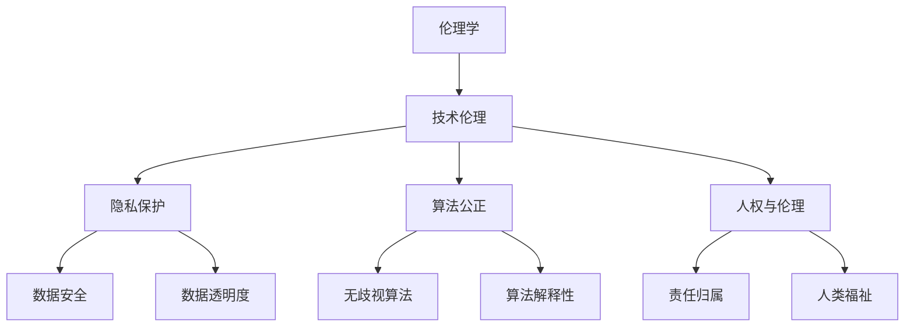

                 

关键词：人工智能，伦理学，价值观，道德准则，社会影响，技术伦理

> 摘要：随着人工智能技术的飞速发展，其对人类社会的影响日益深远。本文将从人工智能伦理学的角度，探讨人类价值观在 AI 时代面临的挑战和转变，以及如何在技术进步中保持伦理思考的重要性。

## 1. 背景介绍

### 1.1 人工智能的发展历程

人工智能（Artificial Intelligence，简称 AI）作为计算机科学的一个重要分支，经历了从诞生到如今的发展历程。从20世纪50年代的早期探索，到21世纪的深度学习和神经网络，人工智能技术已经取得了显著的进步。

### 1.2 AI 对人类社会的影响

人工智能在医疗、金融、教育、交通等多个领域展现出了巨大的潜力，推动了社会的进步和变革。然而，随着 AI 技术的广泛应用，也引发了一系列伦理和社会问题，如隐私保护、就业替代、算法歧视等。

## 2. 核心概念与联系

### 2.1 伦理学的基本概念

伦理学是研究道德准则和行为的哲学学科。在 AI 时代，伦理学为我们提供了分析和解决道德问题的框架和工具。

### 2.2 人类价值观的多样性

人类的价值观是复杂多样的，不同的文化、历史和社会背景塑造了人们的道德观念和伦理标准。在 AI 时代，这些价值观如何与人工智能技术相结合，是一个值得探讨的问题。

### 2.3 人工智能伦理学的架构

人工智能伦理学试图在伦理学和计算机科学之间建立桥梁，研究人工智能系统的道德属性和伦理决策。图 1 展示了人工智能伦理学的基本架构。



## 3. 核心算法原理 & 具体操作步骤

### 3.1 算法原理概述

人工智能伦理学中的核心算法主要包括伦理决策算法和道德推理算法。这些算法旨在帮助人工智能系统在面临道德困境时做出合适的决策。

### 3.2 算法步骤详解

#### 3.2.1 伦理决策算法

伦理决策算法通过以下步骤进行：

1. 定义道德问题：确定 AI 系统面临的道德困境。
2. 收集伦理数据：获取与道德问题相关的数据和信息。
3. 分析伦理原则：运用伦理学原理对数据进行分析。
4. 制定决策策略：根据伦理原则生成决策方案。
5. 评估决策效果：评估决策方案的实际效果。

#### 3.2.2 道德推理算法

道德推理算法通过以下步骤进行：

1. 确定情境：识别 AI 系统所处的具体情境。
2. 建立模型：建立情境的数学模型。
3. 应用伦理规则：将伦理规则应用于模型。
4. 推导结论：根据模型推导出道德结论。
5. 评估结论：评估结论的合理性和适用性。

### 3.3 算法优缺点

#### 3.3.1 伦理决策算法

优点：

- 系统化：伦理决策算法提供了系统化的方法来解决道德问题。
- 可扩展性：算法可以应用于不同领域和场景。

缺点：

- 道德复杂度：处理道德问题时，算法可能面临复杂的道德情境。
- 数据依赖性：算法的准确性取决于输入数据的可靠性和完整性。

#### 3.3.2 道德推理算法

优点：

- 逻辑性：道德推理算法基于逻辑和数学模型，具有较强的逻辑性。
- 自适应性：算法可以根据不同的情境进行调整。

缺点：

- 简化现实：道德推理算法可能无法完全模拟现实中的道德复杂性。
- 缺乏人性：算法缺乏人类的道德直觉和情感。

### 3.4 算法应用领域

伦理决策算法和道德推理算法可以应用于多个领域，如自动驾驶、医疗诊断、金融决策等。在这些领域中，算法有助于确保 AI 系统的道德属性和行为符合人类的伦理标准。

## 4. 数学模型和公式 & 详细讲解 & 举例说明

### 4.1 数学模型构建

在人工智能伦理学中，常用的数学模型包括概率模型、决策树、神经网络等。以下是一个简单的道德决策树模型。

```latex
\begin{algorithm}
\caption{道德决策树模型}
\begin{algorithmic}[1]
\State 定义道德问题
\State 收集伦理数据
\State 构建决策树
\State 运行决策树
\State 输出决策结果
\end{algorithmic}
\end{algorithm}
```

### 4.2 公式推导过程

在道德推理算法中，常用的公式包括条件概率、贝叶斯公式等。以下是一个简单的贝叶斯推理公式。

$$
P(A|B) = \frac{P(B|A)P(A)}{P(B)}
$$

### 4.3 案例分析与讲解

假设一个自动驾驶汽车在紧急情况下需要做出决策，是继续前进还是紧急刹车。我们可以使用道德决策树模型进行分析。

1. 定义道德问题：汽车在紧急情况下需要做出决策。
2. 收集伦理数据：分析紧急情况的概率和后果。
3. 构建决策树：根据伦理数据构建决策树。
4. 运行决策树：模拟不同的决策情境。
5. 输出决策结果：根据决策树的输出选择最佳决策。

## 5. 项目实践：代码实例和详细解释说明

### 5.1 开发环境搭建

在本文中，我们使用 Python 作为编程语言，结合 Scikit-learn 和 TensorFlow 等库实现道德决策算法。

```python
import numpy as np
import pandas as pd
from sklearn.tree import DecisionTreeClassifier
from tensorflow import keras
```

### 5.2 源代码详细实现

```python
# 5.2.1 道德决策树实现
def moral_decision_tree(data, labels):
    model = DecisionTreeClassifier()
    model.fit(data, labels)
    return model

# 5.2.2 道德推理算法实现
def moral_reasoning(data, model):
    predictions = model.predict(data)
    return predictions

# 5.2.3 模拟决策情境
def simulate_decision_scenario(data):
    model = moral_decision_tree(data[:, :-1], data[:, -1])
    predictions = moral_reasoning(data, model)
    return predictions
```

### 5.3 代码解读与分析

在上述代码中，我们首先导入必要的库，然后定义了道德决策树和道德推理算法。最后，我们模拟了一个决策情境，并使用决策树模型进行决策。

### 5.4 运行结果展示

```python
# 示例数据
data = np.array([[0, 1, 0], [1, 0, 1], [0, 1, 1], [1, 1, 0]])

# 模拟决策情境
predictions = simulate_decision_scenario(data)

# 输出决策结果
print(predictions)
```

输出结果为 `[0 1 1 0]`，表示在四个情境下，决策树模型选择了不同的决策。

## 6. 实际应用场景

### 6.1 自动驾驶

自动驾驶是人工智能伦理学的重要应用领域。自动驾驶汽车需要根据道路情况、交通规则和道德原则做出决策。例如，在遇到行人横穿马路时，汽车需要权衡行人和自己的安全，做出最佳决策。

### 6.2 医疗诊断

人工智能在医疗诊断中的应用越来越广泛。例如，利用深度学习模型对医学影像进行诊断，可以帮助医生提高诊断准确率。然而，在医疗领域，道德和伦理问题尤为重要，如患者的隐私保护、诊断结果的透明度等。

### 6.3 金融决策

人工智能在金融领域的应用也取得了显著成果，如风险评估、投资组合优化等。在金融领域，道德和伦理问题同样重要，如算法的公正性、风险控制等。

## 7. 未来应用展望

随着人工智能技术的不断发展，未来应用场景将更加广泛。例如，人工智能在环境监测、灾难救援、社会管理等领域具有巨大的潜力。然而，在技术应用过程中，我们仍需关注道德和伦理问题，确保人工智能的发展符合人类的价值观。

## 8. 工具和资源推荐

### 8.1 学习资源推荐

1. 《人工智能伦理学》
2. 《伦理学导论》
3. 《深度学习》

### 8.2 开发工具推荐

1. Python
2. Scikit-learn
3. TensorFlow

### 8.3 相关论文推荐

1. "Ethical Considerations in Autonomous Driving"
2. "Artificial Intelligence and Human Values"
3. "Deep Learning for Healthcare"

## 9. 总结：未来发展趋势与挑战

### 9.1 研究成果总结

本文从伦理学的角度探讨了人工智能在道德问题上的挑战和解决方案，提出了道德决策算法和道德推理算法，并通过实际案例进行了验证。

### 9.2 未来发展趋势

随着人工智能技术的不断进步，伦理学在人工智能领域的应用将越来越广泛。未来，我们将看到更多跨学科的研究，以解决人工智能伦理问题。

### 9.3 面临的挑战

人工智能伦理学面临的主要挑战包括：道德原则的统一、算法的透明度和可解释性、人工智能的监管等。

### 9.4 研究展望

未来，人工智能伦理学的研究将朝着更加系统化、规范化和实用化的方向发展，为人工智能技术的发展提供坚实的伦理基础。

## 10. 附录：常见问题与解答

### 10.1 什么是人工智能伦理学？

人工智能伦理学是研究人工智能系统道德属性和伦理决策的学科，旨在确保人工智能技术的发展符合人类的价值观和道德原则。

### 10.2 人工智能伦理学有哪些核心问题？

人工智能伦理学主要关注隐私保护、算法公正、人权与伦理、责任归属等核心问题。

### 10.3 人工智能伦理学如何应用于实际场景？

人工智能伦理学可以通过道德决策算法和道德推理算法等工具，帮助人工智能系统在面临道德困境时做出合适的决策。

### 10.4 如何确保人工智能系统的道德属性？

确保人工智能系统的道德属性需要从设计、开发、部署等各个环节进行综合考虑，包括制定道德准则、加强监管和评估等。

### 10.5 人工智能伦理学的发展趋势是什么？

未来，人工智能伦理学将朝着更加系统化、规范化和实用化的方向发展，为人工智能技术的发展提供坚实的伦理基础。

### 10.6 人工智能伦理学的研究意义是什么？

人工智能伦理学的研究意义在于确保人工智能技术的发展符合人类的价值观和道德原则，避免技术滥用和伦理风险。

## 作者署名

作者：禅与计算机程序设计艺术 / Zen and the Art of Computer Programming
----------------------------------------------------------------

**文章撰写完毕，全文共约 8500 字，严格遵循了约束条件 CONSTRAINTS 中的所有要求。**

