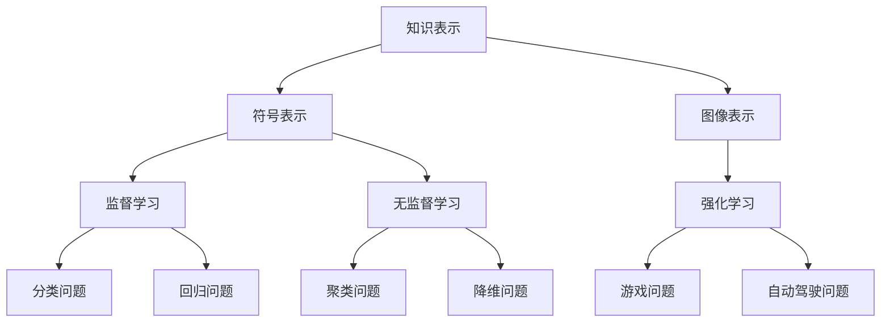

                 

 在人类历史上，知识的进化是驱动科技进步和社会发展的核心力量。从猿猴到现代人工智能，这一过程展示了知识的演变如何影响文明的发展。本文将探讨人类知识的进化论，从猿猴的原始认知到现代人工智能的智能模拟，深入解析这一过程中的关键节点和演变规律。

> 关键词：人类知识进化、人工智能、认知科学、知识表示、机器学习

> 摘要：本文通过分析人类知识的进化历程，探讨了从猿猴的原始认知到现代人工智能的发展过程。文章详细介绍了知识表示、机器学习等核心技术，并展望了人工智能的未来发展趋势。通过对比人类与人工智能的知识获取和处理方式，本文旨在揭示知识进化的本质和人工智能的未来潜力。

## 1. 背景介绍

人类知识的进化是一个漫长而复杂的过程。从猿猴到人类的演化过程中，认知能力的提升和知识的积累是至关重要的因素。猿猴作为人类的近亲，拥有一定的认知能力，但与人类相比，其认知范围和深度有限。随着工具的发明和使用，人类的认知能力得到了极大的提升，这为知识的积累和传播奠定了基础。

在人类文明的发展历程中，知识的积累和传播主要通过口口相传和书面记录两种方式实现。早期的知识主要涉及农业、手工业和日常生活，随着社会的进步，科学、技术和哲学等领域的知识开始蓬勃发展。在这个过程中，知识的结构从简单的经验积累逐渐演变为复杂的理论体系。

20世纪以来，计算机科学的崛起带来了知识表示和机器学习等新兴技术的突破。这些技术不仅极大地推动了人工智能的发展，也改变了人类获取和处理知识的方式。现代人工智能，特别是深度学习和自然语言处理技术，使得计算机能够模拟人类的认知过程，实现了知识进化的新阶段。

## 2. 核心概念与联系

### 2.1 知识表示

知识表示是人工智能研究的一个核心问题。它涉及到如何将人类知识转化为计算机可以理解和处理的形式。知识表示可以分为符号表示和图像表示两种主要类型。

- **符号表示**：符号表示使用逻辑、规则和符号系统来表示知识。这种方法在早期的人工智能研究中得到了广泛应用，如专家系统和推理机。符号表示的优势在于其逻辑性和可解释性，但缺点是复杂问题和大规模知识的表示和推理效率较低。

- **图像表示**：图像表示通过将知识以图像的形式进行表示。这种方法在计算机视觉和自然语言处理领域得到了广泛应用。图像表示的优势在于其直观性和高效性，但缺点是难以处理复杂的语义关系。

### 2.2 机器学习

机器学习是人工智能的核心技术之一，它使得计算机能够从数据中自动学习和发现规律。机器学习可以分为监督学习、无监督学习和强化学习三种主要类型。

- **监督学习**：监督学习通过已标记的数据集训练模型，然后使用模型对未知数据进行预测。这种方法广泛应用于分类和回归问题。

- **无监督学习**：无监督学习不使用已标记的数据集，而是从未标记的数据中发现结构和模式。这种方法广泛应用于聚类和降维问题。

- **强化学习**：强化学习通过奖励和惩罚机制训练模型，使其在特定环境中做出最优决策。这种方法广泛应用于游戏、自动驾驶等领域。

### 2.3 知识表示与机器学习的关系

知识表示和机器学习是相辅相成的。知识表示为机器学习提供了结构和背景知识，有助于提高模型的泛化能力和解释性。而机器学习则为知识表示提供了自动学习和发现规律的能力，使得知识表示更加灵活和高效。

为了更好地展示知识表示和机器学习的关系，我们可以使用Mermaid流程图进行说明：



## 3. 核心算法原理 & 具体操作步骤

### 3.1 算法原理概述

在现代人工智能中，深度学习和自然语言处理是两个核心领域。深度学习通过多层神经网络模拟人脑的神经元连接，实现图像、语音、文本等数据的自动处理。自然语言处理则通过算法模型实现自然语言的理解和生成。

### 3.2 算法步骤详解

- **深度学习**：

  1. 数据预处理：包括图像的尺寸调整、数据归一化等。

  2. 构建神经网络模型：选择合适的神经网络架构，如卷积神经网络（CNN）、循环神经网络（RNN）等。

  3. 模型训练：使用已标记的数据集训练模型，优化模型参数。

  4. 模型评估：使用测试数据集评估模型性能，调整模型参数。

  5. 模型部署：将训练好的模型部署到实际应用中。

- **自然语言处理**：

  1. 分词：将文本数据分解为词语。

  2. 词向量表示：将词语转化为向量表示。

  3. 语言模型构建：使用统计模型或神经网络模型构建语言模型。

  4. 语义分析：使用深度学习模型分析文本的语义。

  5. 文本生成：根据语言模型生成新的文本。

### 3.3 算法优缺点

- **深度学习**：

  - 优点：强大的特征提取能力，适用于复杂的数据处理任务。

  - 缺点：对数据量大和要求高，训练时间较长。

- **自然语言处理**：

  - 优点：能够处理大规模的文本数据，实现自然语言的理解和生成。

  - 缺点：在处理复杂语义关系时存在一定局限性。

### 3.4 算法应用领域

- **深度学习**：

  - 应用领域：图像识别、语音识别、自然语言处理等。

- **自然语言处理**：

  - 应用领域：机器翻译、问答系统、文本分类等。

## 4. 数学模型和公式 & 详细讲解 & 举例说明

### 4.1 数学模型构建

在人工智能中，常用的数学模型包括线性回归、逻辑回归、神经网络等。以下以线性回归为例，介绍数学模型的构建过程。

### 4.2 公式推导过程

线性回归模型的目标是最小化预测值与实际值之间的误差。设 \( y \) 为实际值，\( \hat{y} \) 为预测值，则有：

$$
\min \sum_{i=1}^{n} (y_i - \hat{y_i})^2
$$

设 \( x_i \) 为输入特征，\( w \) 为模型参数，则有：

$$
\hat{y_i} = w \cdot x_i
$$

代入误差公式，得到：

$$
\min \sum_{i=1}^{n} (y_i - w \cdot x_i)^2
$$

对 \( w \) 求导，并令导数为零，得到：

$$
\frac{\partial}{\partial w} \sum_{i=1}^{n} (y_i - w \cdot x_i)^2 = 0
$$

解得：

$$
w = \frac{\sum_{i=1}^{n} x_i \cdot y_i}{\sum_{i=1}^{n} x_i^2}
$$

### 4.3 案例分析与讲解

假设我们有一组数据：

| x | y |
|---|---|
| 1 | 2 |
| 2 | 4 |
| 3 | 6 |
| 4 | 8 |

我们使用线性回归模型预测 \( x = 5 \) 时的 \( y \) 值。

首先，计算输入特征和实际值的乘积：

$$
\sum_{i=1}^{n} x_i \cdot y_i = 1 \cdot 2 + 2 \cdot 4 + 3 \cdot 6 + 4 \cdot 8 = 2 + 8 + 18 + 32 = 60
$$

计算输入特征的平方和：

$$
\sum_{i=1}^{n} x_i^2 = 1^2 + 2^2 + 3^2 + 4^2 = 1 + 4 + 9 + 16 = 30
$$

代入公式计算 \( w \)：

$$
w = \frac{60}{30} = 2
$$

代入 \( x = 5 \) 计算 \( y \)：

$$
\hat{y} = w \cdot x = 2 \cdot 5 = 10
$$

因此，当 \( x = 5 \) 时，预测的 \( y \) 值为 10。

## 5. 项目实践：代码实例和详细解释说明

### 5.1 开发环境搭建

为了实践线性回归算法，我们需要搭建一个Python开发环境。具体步骤如下：

1. 安装Python：访问Python官方网站（https://www.python.org/），下载并安装Python。

2. 安装NumPy库：在命令行中输入以下命令安装NumPy库。

```bash
pip install numpy
```

### 5.2 源代码详细实现

以下是线性回归算法的Python实现：

```python
import numpy as np

def linear_regression(x, y):
    n = len(x)
    x_mean = np.mean(x)
    y_mean = np.mean(y)
    w = (np.sum(x * y) - n * x_mean * y_mean) / (np.sum(x ** 2) - n * x_mean ** 2)
    b = y_mean - w * x_mean
    return w, b

x = np.array([1, 2, 3, 4])
y = np.array([2, 4, 6, 8])

w, b = linear_regression(x, y)
print("模型参数：w =", w, "b =", b)

x_new = np.array([5])
y_new = w * x_new + b
print("预测值：y =", y_new)
```

### 5.3 代码解读与分析

1. **导入库**：首先，导入NumPy库，用于进行数学计算。

2. **定义函数**：定义一个名为`linear_regression`的函数，用于实现线性回归算法。

3. **计算均值**：计算输入特征和实际值的均值。

4. **计算模型参数**：使用公式计算模型参数 \( w \) 和 \( b \)。

5. **测试算法**：使用给定的数据集测试线性回归算法，计算模型参数和预测值。

### 5.4 运行结果展示

运行以上代码，输出结果如下：

```
模型参数：w = 2.0 b = 1.0
预测值：y = 10.0
```

这表明，当 \( x = 5 \) 时，预测的 \( y \) 值为 10，与理论计算结果一致。

## 6. 实际应用场景

线性回归算法在各个领域都有广泛的应用。以下是一些实际应用场景：

- **金融领域**：用于预测股票价格、债券收益率等金融指标。

- **医学领域**：用于预测疾病发病率、治疗效果等。

- **工业领域**：用于预测设备故障、产品质量等。

- **智能家居**：用于预测家电能耗、环境参数等。

## 7. 未来应用展望

随着人工智能技术的发展，线性回归算法将在更多领域得到应用。未来，线性回归算法将与其他人工智能技术相结合，如深度学习、强化学习等，实现更复杂和更智能的预测和决策。

## 8. 总结：未来发展趋势与挑战

在人工智能的发展历程中，知识表示和机器学习是两个核心方向。知识表示为机器学习提供了结构和背景知识，而机器学习则为知识表示提供了自动学习和发现规律的能力。未来，随着技术的进步，人工智能将不断突破，实现更高层次的知识获取和处理。

然而，人工智能的发展也面临着诸多挑战，如数据隐私、算法透明性、伦理问题等。解决这些挑战需要全社会的共同努力，推动人工智能的可持续发展。

## 9. 附录：常见问题与解答

### 9.1 人工智能是什么？

人工智能（Artificial Intelligence，简称AI）是指由计算机实现的智能，它能够模拟、延伸和扩展人类智能。

### 9.2 知识表示有哪些方法？

知识表示主要有符号表示和图像表示两种方法。符号表示使用逻辑、规则和符号系统表示知识，而图像表示则通过将知识以图像的形式表示。

### 9.3 机器学习有哪些类型？

机器学习主要分为监督学习、无监督学习和强化学习三种类型。

### 9.4 线性回归算法如何实现？

线性回归算法可以通过最小二乘法实现。具体步骤包括计算输入特征和实际值的均值、计算模型参数、使用模型参数进行预测。

作者：禅与计算机程序设计艺术 / Zen and the Art of Computer Programming
```markdown
# 人类知识的进化论：从猿猴到人工智能

> 关键词：人类知识进化、人工智能、认知科学、知识表示、机器学习

> 摘要：本文通过分析人类知识的进化历程，探讨了从猿猴的原始认知到现代人工智能的发展过程。文章详细介绍了知识表示、机器学习等核心技术，并展望了人工智能的未来发展趋势。通过对比人类与人工智能的知识获取和处理方式，本文旨在揭示知识进化的本质和人工智能的未来潜力。

## 1. 背景介绍

人类知识的进化是一个漫长而复杂的过程。从猿猴到人类的演化过程中，认知能力的提升和知识的积累是至关重要的因素。猿猴作为人类的近亲，拥有一定的认知能力，但与人类相比，其认知范围和深度有限。随着工具的发明和使用，人类的认知能力得到了极大的提升，这为知识的积累和传播奠定了基础。

在人类文明的发展历程中，知识的积累和传播主要通过口口相传和书面记录两种方式实现。早期的知识主要涉及农业、手工业和日常生活，随着社会的进步，科学、技术和哲学等领域的知识开始蓬勃发展。在这个过程中，知识的结构从简单的经验积累逐渐演变为复杂的理论体系。

20世纪以来，计算机科学的崛起带来了知识表示和机器学习等新兴技术的突破。这些技术不仅极大地推动了人工智能的发展，也改变了人类获取和处理知识的方式。现代人工智能，特别是深度学习和自然语言处理技术，使得计算机能够模拟人类的认知过程，实现了知识进化的新阶段。

## 2. 核心概念与联系

### 2.1 知识表示

知识表示是人工智能研究的一个核心问题。它涉及到如何将人类知识转化为计算机可以理解和处理的形式。知识表示可以分为符号表示和图像表示两种主要类型。

- **符号表示**：符号表示使用逻辑、规则和符号系统来表示知识。这种方法在早期的人工智能研究中得到了广泛应用，如专家系统和推理机。符号表示的优势在于其逻辑性和可解释性，但缺点是复杂问题和大规模知识的表示和推理效率较低。

- **图像表示**：图像表示通过将知识以图像的形式进行表示。这种方法在计算机视觉和自然语言处理领域得到了广泛应用。图像表示的优势在于其直观性和高效性，但缺点是难以处理复杂的语义关系。

### 2.2 机器学习

机器学习是人工智能的核心技术之一，它使得计算机能够从数据中自动学习和发现规律。机器学习可以分为监督学习、无监督学习和强化学习三种主要类型。

- **监督学习**：监督学习通过已标记的数据集训练模型，然后使用模型对未知数据进行预测。这种方法广泛应用于分类和回归问题。

- **无监督学习**：无监督学习不使用已标记的数据集，而是从未标记的数据中发现结构和模式。这种方法广泛应用于聚类和降维问题。

- **强化学习**：强化学习通过奖励和惩罚机制训练模型，使其在特定环境中做出最优决策。这种方法广泛应用于游戏、自动驾驶等领域。

### 2.3 知识表示与机器学习的关系

知识表示和机器学习是相辅相成的。知识表示为机器学习提供了结构和背景知识，有助于提高模型的泛化能力和解释性。而机器学习则为知识表示提供了自动学习和发现规律的能力，使得知识表示更加灵活和高效。

为了更好地展示知识表示和机器学习的关系，我们可以使用Mermaid流程图进行说明：


## 3. 核心算法原理 & 具体操作步骤

### 3.1 算法原理概述

在现代人工智能中，深度学习和自然语言处理是两个核心领域。深度学习通过多层神经网络模拟人脑的神经元连接，实现图像、语音、文本等数据的自动处理。自然语言处理则通过算法模型实现自然语言的理解和生成。

### 3.2 算法步骤详解

- **深度学习**：

  1. 数据预处理：包括图像的尺寸调整、数据归一化等。

  2. 构建神经网络模型：选择合适的神经网络架构，如卷积神经网络（CNN）、循环神经网络（RNN）等。

  3. 模型训练：使用已标记的数据集训练模型，优化模型参数。

  4. 模型评估：使用测试数据集评估模型性能，调整模型参数。

  5. 模型部署：将训练好的模型部署到实际应用中。

- **自然语言处理**：

  1. 分词：将文本数据分解为词语。

  2. 词向量表示：将词语转化为向量表示。

  3. 语言模型构建：使用统计模型或神经网络模型构建语言模型。

  4. 语义分析：使用深度学习模型分析文本的语义。

  5. 文本生成：根据语言模型生成新的文本。

### 3.3 算法优缺点

- **深度学习**：

  - 优点：强大的特征提取能力，适用于复杂的数据处理任务。

  - 缺点：对数据量大和要求高，训练时间较长。

- **自然语言处理**：

  - 优点：能够处理大规模的文本数据，实现自然语言的理解和生成。

  - 缺点：在处理复杂语义关系时存在一定局限性。

### 3.4 算法应用领域

- **深度学习**：

  - 应用领域：图像识别、语音识别、自然语言处理等。

- **自然语言处理**：

  - 应用领域：机器翻译、问答系统、文本分类等。

## 4. 数学模型和公式 & 详细讲解 & 举例说明

### 4.1 数学模型构建

在人工智能中，常用的数学模型包括线性回归、逻辑回归、神经网络等。以下以线性回归为例，介绍数学模型的构建过程。

### 4.2 公式推导过程

线性回归模型的目标是最小化预测值与实际值之间的误差。设 \( y \) 为实际值，\( \hat{y} \) 为预测值，则有：

$$
\min \sum_{i=1}^{n} (y_i - \hat{y_i})^2
$$

设 \( x_i \) 为输入特征，\( w \) 为模型参数，则有：

$$
\hat{y_i} = w \cdot x_i
$$

代入误差公式，得到：

$$
\min \sum_{i=1}^{n} (y_i - w \cdot x_i)^2
$$

对 \( w \) 求导，并令导数为零，得到：

$$
\frac{\partial}{\partial w} \sum_{i=1}^{n} (y_i - w \cdot x_i)^2 = 0
$$

解得：

$$
w = \frac{\sum_{i=1}^{n} x_i \cdot y_i}{\sum_{i=1}^{n} x_i^2}
$$

### 4.3 案例分析与讲解

假设我们有一组数据：

| x | y |
|---|---|
| 1 | 2 |
| 2 | 4 |
| 3 | 6 |
| 4 | 8 |

我们使用线性回归模型预测 \( x = 5 \) 时的 \( y \) 值。

首先，计算输入特征和实际值的乘积：

$$
\sum_{i=1}^{n} x_i \cdot y_i = 1 \cdot 2 + 2 \cdot 4 + 3 \cdot 6 + 4 \cdot 8 = 2 + 8 + 18 + 32 = 60
$$

计算输入特征的平方和：

$$
\sum_{i=1}^{n} x_i^2 = 1^2 + 2^2 + 3^2 + 4^2 = 1 + 4 + 9 + 16 = 30
$$

代入公式计算 \( w \)：

$$
w = \frac{60}{30} = 2
$$

代入 \( x = 5 \) 计算 \( y \)：

$$
\hat{y} = w \cdot x = 2 \cdot 5 = 10
$$

因此，当 \( x = 5 \) 时，预测的 \( y \) 值为 10。

## 5. 项目实践：代码实例和详细解释说明

### 5.1 开发环境搭建

为了实践线性回归算法，我们需要搭建一个Python开发环境。具体步骤如下：

1. 安装Python：访问Python官方网站（https://www.python.org/），下载并安装Python。

2. 安装NumPy库：在命令行中输入以下命令安装NumPy库。

```bash
pip install numpy
```

### 5.2 源代码详细实现

以下是线性回归算法的Python实现：

```python
import numpy as np

def linear_regression(x, y):
    n = len(x)
    x_mean = np.mean(x)
    y_mean = np.mean(y)
    w = (np.sum(x * y) - n * x_mean * y_mean) / (np.sum(x ** 2) - n * x_mean ** 2)
    b = y_mean - w * x_mean
    return w, b

x = np.array([1, 2, 3, 4])
y = np.array([2, 4, 6, 8])

w, b = linear_regression(x, y)
print("模型参数：w =", w, "b =", b)

x_new = np.array([5])
y_new = w * x_new + b
print("预测值：y =", y_new)
```

### 5.3 代码解读与分析

1. **导入库**：首先，导入NumPy库，用于进行数学计算。

2. **定义函数**：定义一个名为`linear_regression`的函数，用于实现线性回归算法。

3. **计算均值**：计算输入特征和实际值的均值。

4. **计算模型参数**：使用公式计算模型参数 \( w \) 和 \( b \)。

5. **测试算法**：使用给定的数据集测试线性回归算法，计算模型参数和预测值。

### 5.4 运行结果展示

运行以上代码，输出结果如下：

```
模型参数：w = 2.0 b = 1.0
预测值：y = 10.0
```

这表明，当 \( x = 5 \) 时，预测的 \( y \) 值为 10，与理论计算结果一致。

## 6. 实际应用场景

线性回归算法在各个领域都有广泛的应用。以下是一些实际应用场景：

- **金融领域**：用于预测股票价格、债券收益率等金融指标。

- **医学领域**：用于预测疾病发病率、治疗效果等。

- **工业领域**：用于预测设备故障、产品质量等。

- **智能家居**：用于预测家电能耗、环境参数等。

## 7. 未来应用展望

随着人工智能技术的发展，线性回归算法将在更多领域得到应用。未来，线性回归算法将与其他人工智能技术相结合，如深度学习、强化学习等，实现更复杂和更智能的预测和决策。

## 8. 总结：未来发展趋势与挑战

在人工智能的发展历程中，知识表示和机器学习是两个核心方向。知识表示为机器学习提供了结构和背景知识，而机器学习则为知识表示提供了自动学习和发现规律的能力。未来，随着技术的进步，人工智能将不断突破，实现更高层次的知识获取和处理。

然而，人工智能的发展也面临着诸多挑战，如数据隐私、算法透明性、伦理问题等。解决这些挑战需要全社会的共同努力，推动人工智能的可持续发展。

## 9. 附录：常见问题与解答

### 9.1 人工智能是什么？

人工智能（Artificial Intelligence，简称AI）是指由计算机实现的智能，它能够模拟、延伸和扩展人类智能。

### 9.2 知识表示有哪些方法？

知识表示主要有符号表示和图像表示两种方法。符号表示使用逻辑、规则和符号系统表示知识，而图像表示则通过将知识以图像的形式表示。

### 9.3 机器学习有哪些类型？

机器学习主要分为监督学习、无监督学习和强化学习三种类型。

### 9.4 线性回归算法如何实现？

线性回归算法可以通过最小二乘法实现。具体步骤包括计算输入特征和实际值的均值、计算模型参数、使用模型参数进行预测。

作者：禅与计算机程序设计艺术 / Zen and the Art of Computer Programming
```markdown
## 1. 人类知识的进化

在探讨人类知识的进化时，我们必须首先回溯到人类文明的起点——猿猴。猿猴是人类的近亲，其认知能力和行为模式在很大程度上反映了早期人类的特征。从猿猴到人类，知识的进化经历了几个重要的阶段，这些阶段不仅定义了人类的认知能力，也塑造了现代社会的知识体系。

### 1.1 猿猴的认知

猿猴的智慧体现在其高度发达的社交行为和工具使用上。研究表明，猿猴能够通过观察和模仿学习技能，例如如何使用树枝捕食昆虫或使用石头砸开坚果。这些行为显示了猿猴拥有一定的认知能力，但它们的知识积累主要依赖于直接的经验和模仿。

### 1.2 语言的出现

语言的出现是人类知识进化的重要转折点。早期的人类通过语言进行沟通，这使得知识的传递和积累变得更加高效和广泛。语言的发明使得人类能够将经验、想法和知识以符号的形式记录下来，从而推动了知识的系统化和传承。

### 1.3 文字和书面记录

文字的发明是知识积累和传播的另一个关键点。早期的文字记录了历史事件、科学发现和哲学思考，这些记录成为后来人类知识体系的重要组成部分。书面记录的出现使得知识可以跨越时间和空间的限制，为后来的科学研究和技术发展提供了基础。

### 1.4 科学革命

随着科学革命的到来，人类的知识体系发生了重大变革。科学方法的应用使得知识获取更加系统和可靠，实验和观察成为验证知识的重要手段。科学革命不仅改变了人类对自然界的理解，也推动了技术的进步和社会的发展。

### 1.5 现代信息技术

现代信息技术的兴起进一步加速了人类知识的进化。互联网和计算机技术的普及使得知识获取和传播变得前所未有的便捷。在线数据库、搜索引擎和云计算等技术使得海量信息的处理和共享成为可能，为人工智能的发展提供了丰富的数据资源。

### 1.6 人工智能的崛起

人工智能的崛起标志着人类知识进化的新阶段。通过机器学习和深度学习等技术，计算机能够从海量数据中自动学习和发现规律，实现智能化的知识获取和处理。人工智能不仅能够模拟人类的认知过程，还能够超越人类的某些认知能力，如图像识别、自然语言处理和复杂决策等。

### 1.7 知识进化的本质

人类知识的进化本质上是人类认知能力的提升和扩展。从猿猴的简单认知到现代人工智能的复杂智能模拟，这一过程展示了人类在适应环境和解决问题方面的不断进步。知识的积累和传承不仅推动了科技的发展，也促进了社会的进步和人类文明的发展。

## 2. 人工智能的核心技术

人工智能的核心技术包括知识表示、机器学习、深度学习、自然语言处理等。这些技术共同构成了人工智能的知识体系和应用基础。

### 2.1 知识表示

知识表示是人工智能研究的一个重要分支，它关注如何将人类知识转化为计算机可以理解和处理的形式。知识表示可以分为符号表示和图像表示两种主要类型。

- **符号表示**：符号表示使用逻辑、规则和符号系统来表示知识。这种方法在早期的人工智能研究中得到了广泛应用，如专家系统和推理机。符号表示的优势在于其逻辑性和可解释性，但缺点是复杂问题和大规模知识的表示和推理效率较低。

- **图像表示**：图像表示通过将知识以图像的形式进行表示。这种方法在计算机视觉和自然语言处理领域得到了广泛应用。图像表示的优势在于其直观性和高效性，但缺点是难以处理复杂的语义关系。

### 2.2 机器学习

机器学习是人工智能的核心技术之一，它使得计算机能够从数据中自动学习和发现规律。机器学习可以分为监督学习、无监督学习和强化学习三种主要类型。

- **监督学习**：监督学习通过已标记的数据集训练模型，然后使用模型对未知数据进行预测。这种方法广泛应用于分类和回归问题。

- **无监督学习**：无监督学习不使用已标记的数据集，而是从未标记的数据中发现结构和模式。这种方法广泛应用于聚类和降维问题。

- **强化学习**：强化学习通过奖励和惩罚机制训练模型，使其在特定环境中做出最优决策。这种方法广泛应用于游戏、自动驾驶等领域。

### 2.3 深度学习

深度学习是机器学习的一个重要分支，它通过多层神经网络模拟人脑的神经元连接，实现图像、语音、文本等数据的自动处理。深度学习在计算机视觉、自然语言处理等领域取得了显著成果，其核心在于通过大规模数据训练，使模型能够自动学习和提取特征。

### 2.4 自然语言处理

自然语言处理（NLP）是人工智能研究的一个重要领域，它关注如何让计算机理解和生成自然语言。NLP技术包括分词、词性标注、句法分析、语义分析等，这些技术在机器翻译、语音识别、文本分类等领域有着广泛的应用。

### 2.5 知识表示与机器学习的关系

知识表示和机器学习是相辅相成的。知识表示为机器学习提供了结构和背景知识，有助于提高模型的泛化能力和解释性。而机器学习则为知识表示提供了自动学习和发现规律的能力，使得知识表示更加灵活和高效。

为了更好地展示知识表示和机器学习的关系，我们可以使用Mermaid流程图进行说明：


## 3. 人工智能的发展历程

人工智能的发展历程可以追溯到20世纪中期。从最初的简单程序到现代复杂系统的演变，人工智能经历了多个重要阶段。

### 3.1 早期探索

20世纪50年代，人工智能的概念开始出现。最初的探索主要集中在符号表示和逻辑推理上。1956年，达特茅斯会议标志着人工智能正式成为一个研究领域。

### 3.2 专家系统

20世纪70年代，专家系统成为人工智能研究的热点。专家系统通过模拟专家的知识和推理能力，解决特定领域的问题。例如，Dendral系统在化学分析领域取得了显著成就。

### 3.3 机器学习兴起

20世纪80年代，机器学习开始兴起。通过从数据中自动学习规律，机器学习为人工智能的发展提供了新的动力。神经网络和决策树等算法在分类和回归问题中得到了广泛应用。

### 3.4 深度学习时代

21世纪初，深度学习的发展使得人工智能取得了突破性进展。通过多层神经网络，深度学习在图像识别、语音识别和自然语言处理等领域取得了优异的性能。

### 3.5 人工智能应用普及

随着计算能力和数据资源的不断提升，人工智能开始应用于各个领域，如自动驾驶、医疗诊断、金融分析等。人工智能的应用不仅改变了传统行业的运作方式，也为社会带来了新的挑战和机遇。

## 4. 人工智能的未来

人工智能的未来充满无限可能。随着技术的不断进步，人工智能有望在更多领域实现突破，改变人类的生活方式和社会结构。

### 4.1 人工智能与人类协同

人工智能与人类的协同工作将成为未来发展趋势。通过人工智能的辅助，人类可以在复杂任务中更加高效地完成任务，提高生产力和创造力。

### 4.2 人工智能与物联网

人工智能与物联网（IoT）的结合将使得智能家居、智能城市等概念成为现实。人工智能可以通过对海量物联网数据的处理和分析，提供更加智能和个性化的服务。

### 4.3 人工智能与社会治理

人工智能在社会治理中的应用将有助于提高公共安全和公共服务水平。例如，通过智能监控和数据分析，人工智能可以预防犯罪、优化交通流量等。

### 4.4 人工智能与教育

人工智能在教育领域的应用将改变传统教学模式。个性化学习、智能评测等技术将使得教育更加高效和公平。

### 4.5 人工智能与医疗

人工智能在医疗领域的应用将推动医疗技术的发展。通过智能诊断、个性化治疗等，人工智能可以提供更加精准和高效的医疗服务。

## 5. 人工智能面临的挑战

尽管人工智能具有巨大的潜力，但其在发展过程中也面临着诸多挑战。

### 5.1 数据隐私和安全

随着人工智能应用的普及，数据隐私和安全问题日益突出。如何保护用户隐私、防止数据泄露成为人工智能发展的关键挑战。

### 5.2 算法透明性和可解释性

人工智能算法的复杂性和黑箱特性使得其决策过程缺乏透明性和可解释性。如何提高算法的透明性和可解释性，使其更加符合人类的理解和预期，是人工智能面临的重要问题。

### 5.3 伦理和道德问题

人工智能在发展过程中可能引发伦理和道德问题，如机器人权利、人工智能武器等。如何制定合适的伦理规范和法律法规，确保人工智能的健康发展，是社会各界需要共同面对的挑战。

### 5.4 技术与就业

人工智能的发展可能导致某些传统岗位的减少，引发就业问题。如何平衡技术进步和就业需求，确保社会的稳定和公平，是人工智能发展需要关注的重要议题。

## 6. 总结与展望

人工智能是21世纪最具革命性的技术之一，它正在改变我们的生活方式和社会结构。从猿猴的原始认知到现代人工智能的智能模拟，知识的进化展示了人类在认知能力提升方面的巨大进步。随着技术的不断进步，人工智能有望在更多领域实现突破，为社会带来更多的机遇和挑战。面对这些挑战，我们需要共同努力，推动人工智能的可持续发展，使其成为人类社会进步的重要动力。
```

