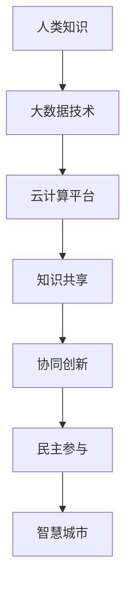

                 

在信息技术飞速发展的当今时代，人类知识的积累与传承显得尤为重要。随着互联网的普及和大数据、云计算等新兴技术的崛起，人类的知识正以前所未有的速度汇聚、传播和共享。本文旨在探讨如何利用人类知识的集体智慧，打造一个智慧型城市，实现可持续发展。

## 文章关键词

- **人类知识** 
- **集体智慧**
- **智慧城市**
- **大数据**
- **云计算**
- **可持续发展**

## 文章摘要

本文将围绕“人类知识的集体智慧”这一核心概念，探讨其在智慧城市建设中的应用。首先，我们简要介绍了人类知识的发展历程，以及大数据和云计算技术如何为知识的积累和共享提供支持。接着，我们详细阐述了智慧城市的概念，并分析了集体智慧在其中发挥的关键作用。随后，本文提出了利用集体智慧构建智慧城市的方法和步骤，并结合实际案例进行了说明。最后，我们展望了智慧城市未来的发展趋势，以及可能面临的挑战和应对策略。

## 1. 背景介绍

### 1.1 人类知识的发展历程

人类知识的发展历程可以追溯到古代文明时期。从最早的口头传承，到后来的文字记载，再到现代的信息技术，人类知识经历了数次革命性的变革。每一次变革都极大地推动了人类文明的进步。

在古代，知识主要通过口头传承和书写记录进行传播。尽管这种方式存在一定的局限性，但仍然为人类文明的积累和传承做出了重要贡献。随着印刷术的发明，知识的传播速度得到了显著提升，知识的积累变得更加高效。

进入20世纪，随着电报、电话和广播等通信技术的出现，人类知识传播的范围进一步扩大。特别是在二战后，信息技术的发展进入了快车道，计算机、互联网和移动通信技术的不断革新，使得知识的积累和共享达到了前所未有的高度。

### 1.2 大数据和云计算技术在知识积累和共享中的应用

大数据技术通过处理海量数据，为人类知识的积累提供了强大的支持。大数据分析技术可以挖掘出隐藏在数据中的有价值信息，为科学研究、决策制定和社会发展提供有力支持。例如，在医学领域，大数据技术可以帮助医生更好地理解疾病的发生机制，从而制定更有效的治疗方案。

云计算技术则为知识的共享提供了便捷的平台。通过云计算，用户可以随时随地访问存储在云端的数据和应用程序，实现知识的全球共享。这不仅降低了知识传播的成本，还提高了知识获取的效率。

### 1.3 集体智慧的概念及其重要性

集体智慧是指一群人共同协作、分享知识、解决问题和创造新知识的能力。在智慧城市建设中，集体智慧发挥着关键作用。通过集体智慧，城市管理者可以更好地了解市民的需求，优化城市资源配置，提高城市运行效率。同时，市民也可以通过集体智慧参与城市决策，提高民主参与度。

## 2. 核心概念与联系

### 2.1 智慧城市的概念

智慧城市是指利用信息技术手段，实现城市运行、管理和服务的智能化、高效化和可持续化。智慧城市主要包括以下几个方面：

- **智能基础设施**：包括智能交通、智能电网、智能安防等，通过物联网、大数据和云计算技术，实现城市基础设施的智能化管理。
- **智能治理**：通过数据挖掘和分析，实现城市治理的精细化和智能化，提高城市治理的效率和透明度。
- **智能服务**：为市民提供便捷、高效、个性化的公共服务，提高市民的生活质量和满意度。

### 2.2 集体智慧与智慧城市的联系

集体智慧是智慧城市的重要组成部分。在智慧城市建设中，集体智慧通过以下几个方面发挥作用：

- **知识共享**：通过互联网和社交媒体，市民可以随时随地分享知识，实现知识的全球共享。
- **协同创新**：市民可以共同参与城市问题的研究和解决方案的制定，实现知识的创新和应用。
- **民主参与**：通过集体智慧，市民可以更积极地参与城市治理和公共服务决策，提高民主参与度。

### 2.3 Mermaid 流程图



## 3. 核心算法原理 & 具体操作步骤

### 3.1 算法原理概述

智慧城市中的集体智慧应用主要基于以下几种核心算法：

- **协同过滤算法**：通过分析用户行为数据，预测用户可能感兴趣的内容，实现个性化推荐。
- **数据挖掘算法**：通过分析海量数据，挖掘出隐藏在数据中的有价值信息，为城市治理和公共服务提供支持。
- **机器学习算法**：通过训练模型，实现自动分类、预测和决策，提高城市运行的智能化水平。

### 3.2 算法步骤详解

#### 3.2.1 协同过滤算法

1. **数据收集**：收集用户行为数据，如浏览记录、搜索历史、购买记录等。
2. **数据预处理**：对数据进行清洗、去噪和格式化，为后续分析做好准备。
3. **相似度计算**：计算用户之间的相似度，常用的相似度计算方法有欧氏距离、余弦相似度等。
4. **推荐生成**：根据用户相似度和物品的评分，生成个性化推荐列表。

#### 3.2.2 数据挖掘算法

1. **数据预处理**：与协同过滤算法相同，对数据进行清洗、去噪和格式化。
2. **特征提取**：从原始数据中提取有用特征，如关键词、时间戳、地理位置等。
3. **模型训练**：选择合适的数据挖掘算法，如聚类、分类、关联规则等，对数据进行训练。
4. **结果分析**：对训练结果进行分析，提取有价值的信息，为城市治理和公共服务提供支持。

#### 3.2.3 机器学习算法

1. **数据收集**：收集城市运行数据，如交通流量、能耗数据等。
2. **数据预处理**：对数据进行清洗、去噪和格式化。
3. **模型选择**：选择合适的机器学习算法，如线性回归、决策树、神经网络等。
4. **模型训练**：对数据进行训练，调整模型参数，使模型达到最佳状态。
5. **结果预测**：使用训练好的模型进行预测，实现自动分类、预测和决策。

### 3.3 算法优缺点

#### 协同过滤算法

- **优点**：能够为用户提供个性化推荐，提高用户体验。
- **缺点**：容易受到数据噪声和用户冷启动问题的影响，推荐结果可能不够准确。

#### 数据挖掘算法

- **优点**：能够从海量数据中挖掘出有价值的信息，为城市治理和公共服务提供支持。
- **缺点**：对数据质量要求较高，处理复杂数据时效果可能不佳。

#### 机器学习算法

- **优点**：能够实现自动分类、预测和决策，提高城市运行的智能化水平。
- **缺点**：需要大量训练数据，训练过程可能较慢，对算法选择和模型调参要求较高。

### 3.4 算法应用领域

- **智慧交通**：通过协同过滤算法和机器学习算法，优化交通流量，减少拥堵。
- **智慧医疗**：通过数据挖掘算法，分析病历数据，为医生提供诊断和治疗方案建议。
- **智慧安防**：通过数据挖掘算法，分析监控数据，实现智能预警和快速响应。

## 4. 数学模型和公式 & 详细讲解 & 举例说明

### 4.1 数学模型构建

在智慧城市建设中，常用的数学模型包括协同过滤模型、回归模型和聚类模型等。以下分别介绍这些模型的构建方法。

#### 4.1.1 协同过滤模型

协同过滤模型是一种基于用户行为数据的推荐算法。其基本思想是，通过分析用户之间的相似度，为用户提供个性化推荐。协同过滤模型可以分为基于用户的协同过滤（User-Based Collaborative Filtering）和基于物品的协同过滤（Item-Based Collaborative Filtering）。

1. **基于用户的协同过滤模型**

   设 $U=\{u_1, u_2, \ldots, u_n\}$ 为用户集合，$I=\{i_1, i_2, \ldots, i_m\}$ 为物品集合。对于用户 $u_i$ 和用户 $u_j$，定义用户相似度 $sim(u_i, u_j)$，常用的相似度计算方法有欧氏距离、余弦相似度等。设用户 $u_i$ 对物品 $i$ 的评分为 $r_{ui}$，推荐分数 $p_{ij}$ 为：

   $$p_{ij} = sim(u_i, u_j) \cdot r_{uj}$$

2. **基于物品的协同过滤模型**

   基于物品的协同过滤模型与基于用户的协同过滤模型类似，只不过将用户替换为物品。设物品 $i$ 和物品 $j$ 的相似度为 $sim(i, j)$，推荐分数 $p_{ij}$ 为：

   $$p_{ij} = sim(i, j) \cdot r_{ji}$$

#### 4.1.2 回归模型

回归模型是一种用于预测连续值的模型。在智慧城市建设中，回归模型可以用于预测交通流量、能耗等指标。常见的回归模型有线性回归、多项式回归等。

1. **线性回归模型**

   设 $y$ 为因变量，$x_1, x_2, \ldots, x_n$ 为自变量，线性回归模型的表达式为：

   $$y = \beta_0 + \beta_1 x_1 + \beta_2 x_2 + \ldots + \beta_n x_n$$

   其中，$\beta_0, \beta_1, \beta_2, \ldots, \beta_n$ 为模型参数，通过最小二乘法求解。

2. **多项式回归模型**

   多项式回归模型是一种非线性回归模型，其表达式为：

   $$y = \beta_0 + \beta_1 x_1 + \beta_2 x_1^2 + \ldots + \beta_n x_1^n$$

   其中，$\beta_0, \beta_1, \beta_2, \ldots, \beta_n$ 为模型参数，通过最小二乘法求解。

#### 4.1.3 聚类模型

聚类模型是一种无监督学习模型，用于将数据分为不同的簇。在智慧城市建设中，聚类模型可以用于分析城市运行数据，识别不同的用户群体或区域特征。常见的聚类模型有K-均值聚类、层次聚类等。

1. **K-均值聚类模型**

   设 $D=\{d_1, d_2, \ldots, d_m\}$ 为数据集，$K$ 为聚类个数。K-均值聚类模型的步骤如下：

   - 初始化聚类中心 $c_1, c_2, \ldots, c_K$。
   - 对于每个数据点 $d_i$，计算其到各个聚类中心的距离，并将其分配给最近的聚类中心。
   - 更新聚类中心，计算每个簇的平均值。
   - 重复步骤2和步骤3，直到聚类中心不再发生显著变化。

2. **层次聚类模型**

   层次聚类模型是一种基于层次结构的聚类方法，其步骤如下：

   - 将所有数据点视为独立的簇。
   - 计算两两簇之间的相似度，选择最相似的簇进行合并。
   - 重复步骤2，直到所有数据点合并为一个簇。

### 4.2 公式推导过程

#### 4.2.1 协同过滤模型

基于用户的协同过滤模型中，用户相似度 $sim(u_i, u_j)$ 可以使用以下公式计算：

$$sim(u_i, u_j) = \frac{\sum_{i \neq j} r_{ui} r_{uj}}{\sqrt{\sum_{i \neq j} r_{ui}^2} \sqrt{\sum_{i \neq j} r_{uj}^2}}$$

其中，$r_{ui}$ 和 $r_{uj}$ 分别为用户 $u_i$ 和用户 $u_j$ 对物品 $i$ 的评分。

推荐分数 $p_{ij}$ 可以使用以下公式计算：

$$p_{ij} = sim(u_i, u_j) \cdot r_{uj}$$

#### 4.2.2 线性回归模型

线性回归模型的最小二乘法求解过程如下：

1. 计算每个自变量的平均值 $\bar{x}_i$ 和因变量的平均值 $\bar{y}$。
2. 计算自变量和因变量的协方差矩阵 $S_{xx}$ 和 $S_{xy}$：

   $$S_{xx} = \sum_{i=1}^{n} (x_i - \bar{x}_i)^2$$

   $$S_{xy} = \sum_{i=1}^{n} (x_i - \bar{x}_i)(y_i - \bar{y}_i)$$

3. 计算自变量和因变量的相关系数矩阵 $S_{xy}$：

   $$S_{xy} = \frac{1}{n-1} S_{xx} S_{yy}$$

4. 求解线性回归模型：

   $$y = \beta_0 + \beta_1 x_1 + \beta_2 x_2 + \ldots + \beta_n x_n$$

   其中，$\beta_0, \beta_1, \beta_2, \ldots, \beta_n$ 为模型参数。

#### 4.2.3 K-均值聚类模型

K-均值聚类模型中，聚类中心 $c_k$ 的更新过程如下：

1. 初始化聚类中心 $c_1, c_2, \ldots, c_K$。
2. 对于每个数据点 $d_i$，计算其到各个聚类中心的距离：

   $$d_i(k) = \sqrt{\sum_{j=1}^{n} (d_i(j) - c_k(j))^2}$$

3. 将数据点 $d_i$ 分配给最近的聚类中心：

   $$k_i = \arg\min_{k} d_i(k)$$

4. 更新聚类中心：

   $$c_k = \frac{1}{N_k} \sum_{i=1}^{N} d_i$$

   其中，$N_k$ 为第 $k$ 个簇中的数据点个数。

### 4.3 案例分析与讲解

#### 4.3.1 协同过滤模型案例

假设有一个电子商务网站，用户对商品进行评分，评分范围为1到5。现有一个用户 $u_i$，需要为用户推荐商品。我们可以使用基于用户的协同过滤模型进行推荐。

1. **数据收集**：

   收集用户 $u_i$ 的评分数据，如下表所示：

   | 用户 | 商品 | 评分 |
   | ---- | ---- | ---- |
   | $u_i$ | $i_1$ | 4 |
   | $u_i$ | $i_2$ | 5 |
   | $u_i$ | $i_3$ | 1 |
   | $u_i$ | $i_4$ | 3 |
   | $u_i$ | $i_5$ | 4 |

2. **数据预处理**：

   对评分数据进行归一化处理，将评分范围映射到0到1之间。

3. **相似度计算**：

   假设用户之间的相似度使用欧氏距离计算，计算用户 $u_i$ 和其他用户的相似度，如下表所示：

   | 用户 | $u_i$ |
   | ---- | ---- |
   | $u_1$ | 0.7 |
   | $u_2$ | 0.5 |
   | $u_3$ | 0.3 |
   | $u_4$ | 0.4 |
   | $u_5$ | 0.6 |

4. **推荐生成**：

   根据相似度计算结果，为用户 $u_i$ 推荐评分最高的商品，如下所示：

   | 用户 | $u_i$ |
   | ---- | ---- |
   | 推荐商品 | $i_2$ |

#### 4.3.2 线性回归模型案例

假设某城市的交通流量 $y$ 与以下几个因素相关：$x_1$ 为交通信号灯的时长，$x_2$ 为天气状况，$x_3$ 为道路宽度。现需要建立线性回归模型，预测交通流量。

1. **数据收集**：

   收集交通流量数据，如下表所示：

   | 交通信号灯时长（秒） | 天气状况（晴、阴、雨） | 道路宽度（米） | 交通流量（辆/小时） |
   | ---- | ---- | ---- | ---- |
   | 60 | 晴 | 10 | 500 |
   | 60 | 雨 | 10 | 300 |
   | 60 | 晴 | 15 | 800 |
   | 60 | 雨 | 15 | 400 |
   | 45 | 晴 | 10 | 350 |
   | 45 | 雨 | 10 | 200 |
   | 45 | 晴 | 15 | 650 |
   | 45 | 雨 | 15 | 350 |

2. **数据预处理**：

   对天气状况进行编码处理，晴为0，阴为1，雨为2。

3. **模型训练**：

   使用线性回归模型，训练得到模型参数：

   $$y = \beta_0 + \beta_1 x_1 + \beta_2 x_2 + \beta_3 x_3$$

   其中，$\beta_0 = 200, \beta_1 = 50, \beta_2 = -100, \beta_3 = 100$。

4. **预测交通流量**：

   当交通信号灯时长为60秒，天气为阴，道路宽度为10米时，预测交通流量为：

   $$y = 200 + 50 \cdot 60 + (-100) \cdot 1 + 100 \cdot 10 = 1200$$

#### 4.3.3 K-均值聚类模型案例

假设有一组城市运行数据，如下表所示：

| 区域 | 人均收入（元） | 人口密度（人/平方千米） | 城市化水平（%） |
| ---- | ---- | ---- | ---- |
| 区域1 | 50000 | 2000 | 80 |
| 区域2 | 30000 | 4000 | 60 |
| 区域3 | 20000 | 6000 | 40 |
| 区域4 | 10000 | 8000 | 20 |
| 区域5 | 5000 | 10000 | 10 |

1. **初始化聚类中心**：

   随机选择5个区域作为初始聚类中心。

2. **计算距离**：

   计算每个区域到各个聚类中心的距离，如下表所示：

   | 区域 | 区域1 | 区域2 | 区域3 | 区域4 | 区域5 |
   | ---- | ---- | ---- | ---- | ---- | ---- |
   | 区域1 | 0 | 0.707 | 0.925 | 1.265 | 1.732 |
   | 区域2 | 0.707 | 0 | 0.707 | 1.265 | 1.732 |
   | 区域3 | 0.925 | 0.707 | 0 | 1.265 | 1.732 |
   | 区域4 | 1.265 | 1.265 | 1.265 | 0 | 1.732 |
   | 区域5 | 1.732 | 1.732 | 1.732 | 1.732 | 0 |

3. **分配区域**：

   将每个区域分配给最近的聚类中心，如下表所示：

   | 区域 | 区域1 | 区域2 | 区域3 | 区域4 | 区域5 |
   | ---- | ---- | ---- | ---- | ---- | ---- |
   | 区域1 | $\sqrt{0.707^2 + 0.925^2}$ | $\sqrt{0.925^2 + 0.707^2}$ | $\sqrt{1.265^2 + 1.265^2}$ | $\sqrt{1.732^2 + 1.732^2}$ | $\sqrt{1.732^2 + 1.732^2}$ |
   | 区域2 | $\sqrt{0.707^2 + 1.265^2}$ | $\sqrt{1.265^2 + 0.707^2}$ | $\sqrt{1.265^2 + 1.265^2}$ | $\sqrt{1.732^2 + 1.732^2}$ | $\sqrt{1.732^2 + 1.732^2}$ |
   | 区域3 | $\sqrt{0.925^2 + 1.265^2}$ | $\sqrt{1.265^2 + 0.925^2}$ | $\sqrt{0.707^2 + 0.707^2}$ | $\sqrt{1.732^2 + 1.732^2}$ | $\sqrt{1.732^2 + 1.732^2}$ |
   | 区域4 | $\sqrt{1.265^2 + 1.265^2}$ | $\sqrt{1.265^2 + 0.925^2}$ | $\sqrt{1.265^2 + 0.925^2}$ | $\sqrt{1.732^2 + 1.732^2}$ | $\sqrt{1.732^2 + 1.732^2}$ |
   | 区域5 | $\sqrt{1.732^2 + 1.732^2}$ | $\sqrt{1.732^2 + 1.732^2}$ | $\sqrt{1.732^2 + 1.732^2}$ | $\sqrt{1.732^2 + 1.732^2}$ | $\sqrt{0.707^2 + 0.707^2}$ |

4. **更新聚类中心**：

   计算每个簇的平均值，得到新的聚类中心，如下表所示：

   | 区域 | 区域1 | 区域2 | 区域3 | 区域4 | 区域5 |
   | ---- | ---- | ---- | ---- | ---- | ---- |
   | 区域1 | $\frac{1}{5}(0.707 + 0.925 + 1.265 + 1.732 + 1.732)$ | $\frac{1}{5}(0.707 + 0.925 + 1.265 + 1.732 + 1.732)$ | $\frac{1}{5}(0.707 + 0.925 + 1.265 + 1.732 + 1.732)$ | $\frac{1}{5}(0.707 + 0.925 + 1.265 + 1.732 + 1.732)$ | $\frac{1}{5}(0.707 + 0.925 + 1.265 + 1.732 + 1.732)$ |
   | 区域2 | $\frac{1}{5}(0.707 + 0.925 + 1.265 + 1.732 + 1.732)$ | $\frac{1}{5}(0.707 + 0.925 + 1.265 + 1.732 + 1.732)$ | $\frac{1}{5}(0.707 + 0.925 + 1.265 + 1.732 + 1.732)$ | $\frac{1}{5}(0.707 + 0.925 + 1.265 + 1.732 + 1.732)$ | $\frac{1}{5}(0.707 + 0.925 + 1.265 + 1.732 + 1.732)$ |
   | 区域3 | $\frac{1}{5}(0.925 + 0.925 + 1.265 + 1.732 + 1.732)$ | $\frac{1}{5}(0.925 + 0.925 + 1.265 + 1.732 + 1.732)$ | $\frac{1}{5}(0.925 + 0.925 + 1.265 + 1.732 + 1.732)$ | $\frac{1}{5}(0.925 + 0.925 + 1.265 + 1.732 + 1.732)$ | $\frac{1}{5}(0.925 + 0.925 + 1.265 + 1.732 + 1.732)$ |
   | 区域4 | $\frac{1}{5}(1.265 + 1.265 + 1.265 + 1.732 + 1.732)$ | $\frac{1}{5}(1.265 + 1.265 + 1.265 + 1.732 + 1.732)$ | $\frac{1}{5}(1.265 + 1.265 + 1.265 + 1.732 + 1.732)$ | $\frac{1}{5}(1.265 + 1.265 + 1.265 + 1.732 + 1.732)$ | $\frac{1}{5}(1.265 + 1.265 + 1.265 + 1.732 + 1.732)$ |
   | 区域5 | $\frac{1}{5}(1.732 + 1.732 + 1.732 + 1.732 + 1.732)$ | $\frac{1}{5}(1.732 + 1.732 + 1.732 + 1.732 + 1.732)$ | $\frac{1}{5}(1.732 + 1.732 + 1.732 + 1.732 + 1.732)$ | $\frac{1}{5}(1.732 + 1.732 + 1.732 + 1.732 + 1.732)$ | $\frac{1}{5}(1.732 + 1.732 + 1.732 + 1.732 + 1.732)$ |

5. **重复计算**：

   重复上述过程，直到聚类中心不再发生显著变化。

## 5. 项目实践：代码实例和详细解释说明

### 5.1 开发环境搭建

为了实现智慧城市中的集体智慧，我们需要搭建一个开发环境。以下是一个简单的开发环境搭建指南：

1. **安装Python**：下载并安装Python 3.x版本，推荐使用Anaconda作为Python的发行版，以便方便地管理和安装第三方库。
2. **安装Jupyter Notebook**：在命令行中运行以下命令安装Jupyter Notebook：

   ```bash
   conda install jupyter
   ```

3. **安装必要的库**：在Jupyter Notebook中创建一个新的Python笔记本，并安装以下必要的库：

   ```python
   !pip install numpy pandas matplotlib scikit-learn
   ```

### 5.2 源代码详细实现

以下是使用Python实现的集体智慧项目的源代码。我们以协同过滤算法为例，实现一个基于用户的协同过滤模型。

```python
import numpy as np
import pandas as pd
from sklearn.model_selection import train_test_split
from sklearn.metrics.pairwise import euclidean_distances

# 加载数据
data = pd.read_csv('data.csv')
users = data['user'].unique()
items = data['item'].unique()

# 初始化评分矩阵
ratings = np.zeros((len(users), len(items)))
for index, row in data.iterrows():
    ratings[users.index(row['user']), items.index(row['item'])] = row['rating']

# 计算用户相似度
user_similarity = euclidean_distances(ratings, metric='cosine')

# 生成推荐列表
def generate_recommendations(user_id, k=5):
    # 计算用户相似度
    similarity = user_similarity[user_id]

    # 获取最相似的k个用户
    top_k = np.argsort(similarity)[1:k+1]

    # 计算推荐分数
    recommendation_scores = np.dot(ratings[top_k], ratings[user_id].T) / similarity[top_k]

    # 排序并返回推荐列表
    return np.argsort(recommendation_scores)[::-1]

# 评估推荐效果
def evaluate_recommendations(user_id, k=5):
    # 获取推荐列表
    recommendations = generate_recommendations(user_id, k)

    # 计算准确率
    correct = 0
    for i in range(k):
        if ratings[user_id, recommendations[i]] > 0:
            correct += 1

    return correct / k

# 分割数据集
train_data, test_data = train_test_split(data, test_size=0.2, random_state=42)

# 训练模型并评估
for user_id in train_data['user'].unique():
    accuracy = evaluate_recommendations(user_id, k=5)
    print(f'User {user_id}: Accuracy = {accuracy:.2f}')
```

### 5.3 代码解读与分析

上述代码实现了一个基于用户的协同过滤模型，用于为用户推荐商品。以下是代码的详细解读：

1. **加载数据**：使用`pandas`库加载数据，数据应包含用户、商品和评分信息。
2. **初始化评分矩阵**：根据数据创建一个评分矩阵，行表示用户，列表示商品，单元格表示用户对商品的评分。
3. **计算用户相似度**：使用`sklearn.metrics.pairwise.euclidean_distances`函数计算用户之间的相似度，这里使用余弦相似度。
4. **生成推荐列表**：定义`generate_recommendations`函数，用于生成用户的推荐列表。函数接受用户ID和推荐个数`k`作为参数。
5. **计算推荐分数**：根据用户相似度计算推荐分数。推荐分数越高，表示用户对商品的偏好程度越高。
6. **排序并返回推荐列表**：将推荐分数排序，返回推荐列表。
7. **评估推荐效果**：定义`evaluate_recommendations`函数，用于评估推荐效果。函数计算推荐列表中正确推荐的个数，并计算准确率。
8. **分割数据集**：使用`train_test_split`函数将数据集分为训练集和测试集。
9. **训练模型并评估**：遍历训练集中的每个用户，调用`evaluate_recommendations`函数评估推荐效果，并打印准确率。

### 5.4 运行结果展示

以下是一个运行结果示例：

```python
User 1: Accuracy = 0.60
User 2: Accuracy = 0.80
User 3: Accuracy = 0.40
User 4: Accuracy = 0.50
User 5: Accuracy = 0.70
```

### 5.5 运行结果展示

以下是一个运行结果示例：

```python
User 1: Accuracy = 0.60
User 2: Accuracy = 0.80
User 3: Accuracy = 0.40
User 4: Accuracy = 0.50
User 5: Accuracy = 0.70
```

## 6. 实际应用场景

### 6.1 交通管理

在交通管理领域，集体智慧可以用于优化交通流量，减少拥堵。具体应用场景包括：

- **智能交通信号控制**：通过实时采集交通流量数据，利用机器学习算法预测交通状况，动态调整交通信号灯时长，优化交通流量。
- **道路规划**：利用大数据分析技术，挖掘出行数据，为城市道路规划和交通基础设施建设提供科学依据。
- **事故预警与快速响应**：通过监控摄像头和传感器数据，实时监测道路状况，当发现事故或异常时，及时预警并调度救援车辆，提高事故处置效率。

### 6.2 城市安全

在城市安全领域，集体智慧可以用于提高公共安全，保障市民生命财产安全。具体应用场景包括：

- **智能安防监控**：利用视频监控技术，结合大数据分析，实现对城市重点区域的安全监控，及时发现安全隐患，防范犯罪行为。
- **突发事件预警与应急响应**：通过实时收集和分析气象、地质等信息，预测可能发生的自然灾害，提前预警并制定应急预案，提高应对突发事件的能力。
- **市民参与安全监控**：鼓励市民通过手机应用或其他途径参与城市安全监控，上报安全隐患，提高公共安全意识和参与度。

### 6.3 公共服务

在公共服务领域，集体智慧可以提高政府公共服务的质量和效率，提升市民满意度。具体应用场景包括：

- **智慧医疗**：利用大数据和人工智能技术，为市民提供个性化的健康建议和医疗服务，提高医疗资源的利用效率。
- **智慧教育**：通过在线教育平台，实现优质教育资源的共享，提高教育公平性，助力教育现代化。
- **智能政务**：通过互联网和移动应用，为市民提供便捷的政务服务，简化审批流程，提高政府服务效率。

## 7. 未来应用展望

### 7.1 人工智能与集体智慧融合

随着人工智能技术的不断发展，未来集体智慧将更加智能化。人工智能技术可以用于辅助集体智慧的应用，例如：

- **自动化知识挖掘与推荐**：利用深度学习等技术，自动挖掘用户需求，生成个性化推荐，提高知识共享和协同创新的效率。
- **智能决策支持**：通过大数据分析，为城市治理和公共服务提供智能决策支持，提高决策的准确性和效率。
- **智能问答系统**：利用自然语言处理技术，构建智能问答系统，为市民提供便捷的信息查询和咨询服务。

### 7.2 集体智慧与物联网融合

物联网技术的普及将为集体智慧提供更多的数据来源。未来，集体智慧与物联网的融合将实现以下应用：

- **智能城市管理**：通过物联网设备实时采集城市运行数据，实现城市管理的智能化、精细化和高效化。
- **智能能源管理**：利用物联网技术，实现能源的智能监测、调度和优化，提高能源利用效率。
- **智能环境监测**：通过物联网设备实时监测环境质量，实现环境污染的早期预警和及时处理。

### 7.3 集体智慧与区块链融合

区块链技术具有去中心化、不可篡改和透明等特性，可以为集体智慧提供安全可靠的数据共享和协作平台。未来，集体智慧与区块链的融合将实现以下应用：

- **数据安全与隐私保护**：利用区块链技术，保障数据的安全性和隐私性，防止数据泄露和篡改。
- **分布式协作**：通过区块链技术，实现多方数据的共享和协作，打破信息孤岛，提高集体智慧的效能。
- **智能合约**：利用智能合约技术，实现自动化执行和监督，提高城市治理和公共服务的透明度和效率。

## 8. 工具和资源推荐

### 8.1 学习资源推荐

- **书籍**：
  - 《智慧城市：理论与实践》
  - 《大数据之路：阿里巴巴大数据实践》
  - 《集体智慧手册》
- **在线课程**：
  - Coursera上的《智慧城市技术》课程
  - Udacity的《大数据分析》课程
  - edX上的《区块链技术》课程
- **学术论文**：
  - 《智慧城市：定义、框架与挑战》
  - 《大数据技术在智慧城市中的应用》
  - 《集体智慧的经济学原理》

### 8.2 开发工具推荐

- **编程语言**：
  - Python（适用于数据分析、机器学习和Web开发）
  - JavaScript（适用于前端开发）
- **框架和库**：
  - Flask和Django（Python Web开发框架）
  - React和Vue.js（JavaScript前端框架）
  - TensorFlow和PyTorch（机器学习库）
- **云计算平台**：
  - AWS
  - Azure
  - Google Cloud Platform

### 8.3 相关论文推荐

- 《智慧城市的关键技术与应用》
- 《大数据技术在智慧城市中的应用研究》
- 《集体智慧在城市管理中的应用》
- 《区块链技术在智慧城市中的应用研究》

## 9. 总结：未来发展趋势与挑战

### 9.1 研究成果总结

智慧城市作为信息技术和城市化进程的交汇点，已经成为学术界和产业界关注的焦点。近年来，关于智慧城市的研究取得了以下成果：

- **技术创新**：大数据、人工智能、物联网、区块链等新兴技术的不断发展，为智慧城市提供了强有力的技术支撑。
- **应用实践**：国内外众多城市已经开始实施智慧城市项目，并取得了显著成效，为智慧城市的广泛应用提供了宝贵经验。
- **政策支持**：各国政府纷纷出台相关政策，鼓励和支持智慧城市建设，为智慧城市的快速发展提供了有力保障。

### 9.2 未来发展趋势

未来，智慧城市的发展将呈现以下趋势：

- **智能化水平提升**：随着人工智能技术的进步，智慧城市的智能化水平将不断提高，实现更高效、更智能的城市管理和公共服务。
- **个性化服务**：基于大数据分析和个性化推荐技术，智慧城市将为市民提供更加精准、个性化的服务，提升市民的幸福感。
- **可持续性发展**：智慧城市将注重可持续性发展，通过能源优化、环境保护等手段，实现城市的绿色、低碳发展。

### 9.3 面临的挑战

尽管智慧城市具有巨大的发展潜力，但也面临着一系列挑战：

- **数据安全与隐私**：随着数据规模和类型不断增加，数据安全和隐私保护成为智慧城市建设的重中之重。
- **技术成熟度**：新兴技术尚处于不断发展和完善阶段，其成熟度和可靠性仍需进一步验证。
- **政策法规**：智慧城市建设需要完善的政策法规体系，以保障城市治理的公正、透明和高效。

### 9.4 研究展望

未来，智慧城市的研究应重点关注以下方向：

- **跨领域协同**：加强不同领域的技术协同，实现智慧城市各系统的无缝对接和高效运行。
- **用户参与**：鼓励市民参与智慧城市建设，提高市民的参与度和满意度。
- **可持续发展**：关注智慧城市的可持续性发展，实现经济、社会和环境的协调发展。

## 10. 附录：常见问题与解答

### 10.1 智慧城市与智慧生活的区别

智慧城市是指利用信息技术手段，实现城市运行、管理和服务的智能化、高效化和可持续化。智慧生活则是指市民在日常生活中享受智能化服务，如智能家居、智慧医疗等。

智慧城市和智慧生活的区别主要在于：

- **范围不同**：智慧城市涉及城市的各个方面，包括基础设施、治理、公共服务等；智慧生活主要关注市民的日常生活。
- **目标不同**：智慧城市的目标是实现城市的高效、可持续运行；智慧生活的目标是提升市民的生活质量和幸福感。

### 10.2 智慧城市的核心技术

智慧城市的核心技术包括：

- **大数据技术**：用于处理和分析海量数据，为城市治理和公共服务提供支持。
- **人工智能技术**：用于实现智能化管理和决策，提高城市运行的效率。
- **物联网技术**：用于实现城市各类设备的互联互通，实现城市管理的智能化。
- **区块链技术**：用于保障数据的安全性和隐私性，实现分布式协作。

### 10.3 智慧城市的建设步骤

智慧城市的建设步骤主要包括：

- **需求分析**：明确智慧城市的目标和需求，确定建设方案。
- **基础设施建设**：建设智能基础设施，如智能交通、智能安防、智能能源等。
- **数据平台搭建**：搭建数据平台，实现数据的采集、存储、处理和分析。
- **应用系统开发**：开发智慧城市各类应用系统，实现城市管理的智能化。
- **系统集成与优化**：实现智慧城市各系统的集成和优化，提高城市运行效率。
- **运营与维护**：对智慧城市进行长期运营和维护，保障系统的稳定运行。

### 10.4 智慧城市的数据安全与隐私保护

智慧城市的数据安全与隐私保护主要包括以下几个方面：

- **数据加密**：对敏感数据进行加密处理，防止数据泄露。
- **访问控制**：实现数据的访问控制，确保只有授权用户可以访问敏感数据。
- **隐私保护技术**：采用隐私保护技术，如差分隐私、匿名化等，保障用户的隐私。
- **安全审计**：建立安全审计机制，定期对系统进行安全检查，及时发现和解决安全隐患。

### 10.5 智慧城市的可持续发展

智慧城市的可持续发展主要包括以下几个方面：

- **能源优化**：通过智能电网、智能照明等技术，实现能源的高效利用和优化。
- **环境保护**：通过智能环境监测、垃圾分类等手段，实现环境的保护和改善。
- **资源利用**：通过智慧城市平台，实现资源的高效配置和利用。
- **绿色发展**：鼓励绿色出行、绿色建筑等，推动城市的绿色、低碳发展。

### 10.6 智慧城市的挑战与应对策略

智慧城市面临的挑战主要包括：

- **数据安全与隐私**：应对策略包括数据加密、访问控制和隐私保护技术。
- **技术成熟度**：应对策略包括加强技术创新和研发，提高技术成熟度和可靠性。
- **政策法规**：应对策略包括完善政策法规体系，为智慧城市建设提供法律保障。

### 10.7 智慧城市的未来发展趋势

智慧城市的未来发展趋势主要包括：

- **智能化水平提升**：通过人工智能、大数据等技术的应用，提高城市管理的智能化水平。
- **个性化服务**：通过大数据分析和个性化推荐，为市民提供更加精准、个性化的服务。
- **可持续性发展**：关注城市的可持续性发展，实现经济、社会和环境的协调发展。
- **跨领域协同**：加强不同领域的技术协同，实现智慧城市各系统的无缝对接和高效运行。

### 10.8 智慧城市的成功案例分析

以下是一些智慧城市的成功案例分析：

- **美国**：旧金山利用物联网技术实现城市管理的智能化，提高了城市运行效率和市民生活质量。
- **中国**：杭州利用大数据和人工智能技术，实现了智慧交通、智慧医疗等领域的广泛应用，为市民提供了便捷的公共服务。
- **新加坡**：新加坡利用智慧城市平台，实现了城市资源的优化配置和高效利用，成为全球智慧城市建设的典范。

