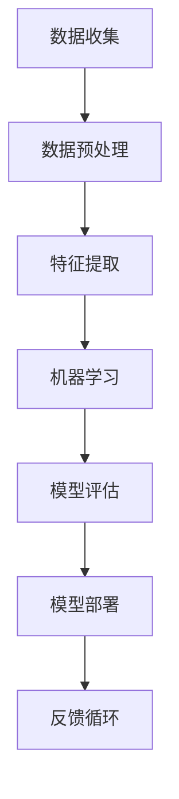

                 

关键词：人工智能，就业前景，未来趋势，技术技能，职业发展

> 摘要：随着人工智能技术的飞速发展，全球各行各业都受到了深远的影响。本文将探讨AI时代下的人类计算，分析未来就业市场的变化，以及个人如何适应和把握这些变化，为读者提供职业发展的指导和建议。

## 1. 背景介绍

### 1.1 人工智能的崛起

人工智能（AI）作为计算机科学的一个分支，近年来取得了巨大的突破。从早期的规则基础系统到现代深度学习算法，AI技术在图像识别、自然语言处理、机器学习等领域都取得了显著进展。随着计算能力的提升和大数据的普及，AI的应用场景越来越广泛，从智能家居、自动驾驶到金融分析、医疗诊断，AI正在改变我们的生活方式和商业模式。

### 1.2 人工智能对就业市场的影响

人工智能的快速发展引发了对就业市场的广泛关注。一方面，AI技术创造了新的就业机会，如数据科学家、机器学习工程师等；另一方面，它也可能导致某些职业的消失，如重复性劳动和低技能工作。本文将深入分析AI对就业市场的具体影响，探讨未来就业前景。

## 2. 核心概念与联系

### 2.1 人工智能的核心概念

人工智能的核心概念包括机器学习、深度学习、自然语言处理等。以下是这些概念的简单介绍及相互联系：

- **机器学习**：通过数据和算法使计算机系统具备学习能力，从而改进其性能。机器学习包括监督学习、无监督学习和强化学习等子领域。

- **深度学习**：一种机器学习技术，基于人工神经网络，通过多层网络进行数据特征提取和学习。

- **自然语言处理**：使计算机理解和生成人类语言的技术，包括文本分析、语音识别、机器翻译等。

### 2.2 人工智能架构

以下是一个简化的Mermaid流程图，描述了人工智能的基本架构：



### 2.3 人工智能与就业市场的联系

人工智能技术的发展与就业市场密切相关。一方面，AI技术创造了新的职业机会，如AI工程师、数据科学家等；另一方面，它也改变了传统职业的角色和需求，要求从业者具备新的技能和知识。

## 3. 核心算法原理 & 具体操作步骤

### 3.1 算法原理概述

人工智能的核心算法包括机器学习算法和深度学习算法。以下是两种算法的基本原理：

- **机器学习算法**：通过训练数据集，使算法自动识别数据中的规律，并使用这些规律对新的数据进行预测或分类。

- **深度学习算法**：基于多层神经网络，通过反向传播算法不断调整网络权重，使模型能够自动学习数据的复杂特征。

### 3.2 算法步骤详解

以下是一个简单的机器学习算法流程：

1. **数据收集**：收集相关领域的数据集。
2. **数据预处理**：清洗数据，处理缺失值，标准化数据等。
3. **特征提取**：从原始数据中提取有用的特征。
4. **模型训练**：使用训练数据集训练模型。
5. **模型评估**：使用验证数据集评估模型性能。
6. **模型部署**：将训练好的模型部署到实际应用中。

### 3.3 算法优缺点

- **机器学习算法**：
  - **优点**：适应性较强，能够处理复杂数据和任务。
  - **缺点**：对数据质量和数量要求较高，训练过程可能较慢。

- **深度学习算法**：
  - **优点**：能够自动提取复杂特征，处理大量数据。
  - **缺点**：对计算资源要求较高，模型解释性较差。

### 3.4 算法应用领域

人工智能算法在各个领域都有广泛应用，包括但不限于：

- **图像识别**：用于人脸识别、车辆识别等。
- **自然语言处理**：用于机器翻译、情感分析等。
- **金融分析**：用于风险控制、投资建议等。
- **医疗诊断**：用于疾病预测、医学图像分析等。

## 4. 数学模型和公式 & 详细讲解 & 举例说明

### 4.1 数学模型构建

人工智能算法的核心在于数学模型的构建。以下是几个常用的数学模型：

- **线性回归模型**：用于预测连续值。
- **逻辑回归模型**：用于预测概率。
- **神经网络模型**：用于处理复杂数据和任务。

### 4.2 公式推导过程

以线性回归模型为例，其公式推导如下：

假设我们有n个数据点$(x_1, y_1), (x_2, y_2), ..., (x_n, y_n)$，我们要找到一个线性模型$y = wx + b$来拟合这些数据。

1. **损失函数**：选择均方误差（MSE）作为损失函数，即
   $$L(w, b) = \frac{1}{2n}\sum_{i=1}^{n}(wx_i + b - y_i)^2$$
   
2. **梯度下降**：为了最小化损失函数，我们对w和b分别求偏导数，并令其等于0，得到：
   $$\frac{\partial L}{\partial w} = x_i(wx_i + b - y_i)$$
   $$\frac{\partial L}{\partial b} = wx_i + b - y_i$$
   
3. **迭代更新**：通过梯度下降算法更新w和b：
   $$w_{new} = w_{old} - \alpha \frac{\partial L}{\partial w}$$
   $$b_{new} = b_{old} - \alpha \frac{\partial L}{\partial b}$$
   其中，$\alpha$ 是学习率。

### 4.3 案例分析与讲解

假设我们有一个简单的线性回归问题，要预测房价。我们有以下数据：

| $x_i$ | $y_i$ |
|-------|-------|
| 100   | 150   |
| 200   | 250   |
| 300   | 350   |

1. **数据预处理**：首先，我们需要将数据标准化，使其具有相同的量纲。

2. **模型训练**：使用线性回归模型进行训练。假设初始权重w=0，b=0，学习率$\alpha=0.1$。

3. **迭代更新**：通过梯度下降算法迭代更新权重和偏置。

迭代1：
$$w_{new} = 0 - 0.1 \cdot 100(0 \cdot 100 + 0 - 150) = -15$$
$$b_{new} = 0 - 0.1 \cdot 100 + 150 = -5$$

迭代2：
$$w_{new} = -15 - 0.1 \cdot 200(-15 \cdot 200 - 5 - 250) = 30$$
$$b_{new} = -5 - 0.1 \cdot 200 + 250 = 20$$

4. **模型评估**：使用验证数据集评估模型性能。

5. **模型部署**：将训练好的模型应用于实际数据。

## 5. 项目实践：代码实例和详细解释说明

### 5.1 开发环境搭建

本文使用Python语言和Scikit-learn库进行线性回归模型的实现。请确保您的Python环境已经搭建好，并安装了Scikit-learn库。

```python
pip install scikit-learn
```

### 5.2 源代码详细实现

以下是线性回归模型的完整实现：

```python
import numpy as np
from sklearn.linear_model import LinearRegression
from sklearn.model_selection import train_test_split

# 数据预处理
def preprocess_data(data):
    X = data[:, 0].reshape(-1, 1)
    y = data[:, 1]
    return X, y

# 模型训练
def train_model(X, y):
    model = LinearRegression()
    model.fit(X, y)
    return model

# 模型评估
def evaluate_model(model, X_test, y_test):
    score = model.score(X_test, y_test)
    print("Model accuracy:", score)

# 运行项目
if __name__ == "__main__":
    # 加载数据
    data = np.array([[100, 150], [200, 250], [300, 350]])

    # 数据预处理
    X, y = preprocess_data(data)

    # 划分训练集和验证集
    X_train, X_test, y_train, y_test = train_test_split(X, y, test_size=0.2, random_state=42)

    # 模型训练
    model = train_model(X_train, y_train)

    # 模型评估
    evaluate_model(model, X_test, y_test)

    # 模型部署
    new_data = np.array([[150, 225]])
    new_data_preprocessed = preprocess_data(new_data)
    prediction = model.predict(new_data_preprocessed)
    print("Predicted value:", prediction)
```

### 5.3 代码解读与分析

1. **数据预处理**：将原始数据分为特征矩阵X和目标向量y。
2. **模型训练**：使用Scikit-learn的LinearRegression类训练模型。
3. **模型评估**：使用测试数据集评估模型性能。
4. **模型部署**：使用训练好的模型对新数据进行预测。

## 6. 实际应用场景

### 6.1 金融分析

人工智能在金融分析中具有广泛的应用，如风险控制、投资建议、市场预测等。通过机器学习和深度学习算法，可以分析大量金融数据，为金融机构提供决策支持。

### 6.2 医疗诊断

医疗诊断是人工智能的重要应用领域之一。通过深度学习算法，可以自动识别医学图像，提高疾病诊断的准确性和效率。

### 6.3 人力资源

人工智能技术在人力资源领域也有广泛应用，如简历筛选、员工培训、绩效评估等。通过自然语言处理和机器学习算法，可以提高人力资源管理的效率和质量。

## 7. 未来应用展望

随着人工智能技术的不断发展，未来将有更多的应用场景和领域受益于AI。以下是一些可能的发展方向：

- **智能交通**：通过自动驾驶和智能交通管理系统，提高交通效率和安全性。
- **智能城市**：利用人工智能技术实现城市管理的智能化，提高城市居民的生活质量。
- **智能医疗**：通过精准医疗和个性化医疗，提高医疗服务的质量和效率。

## 8. 总结：未来发展趋势与挑战

### 8.1 研究成果总结

本文从人工智能的背景介绍、核心概念与联系、算法原理与操作步骤、数学模型与公式、项目实践等多个角度，全面分析了AI时代的未来就业前景。

### 8.2 未来发展趋势

随着人工智能技术的不断发展，未来将有更多的职业机会和挑战。数据科学家、机器学习工程师、AI伦理专家等将成为热门职业。同时，AI技术在各个领域的应用也将越来越广泛。

### 8.3 面临的挑战

虽然人工智能带来了很多机遇，但也面临一些挑战。如何确保AI技术的公平性和透明性，如何处理大量数据的安全和隐私问题，如何避免AI的滥用和失控等，都是需要解决的问题。

### 8.4 研究展望

在未来，人工智能技术将继续发展，为人类带来更多的便利和创新。同时，我们也需要不断探索和研究如何确保AI的安全和可持续性，以实现人类的共同福祉。

## 9. 附录：常见问题与解答

### 9.1 人工智能是什么？

人工智能（AI）是一门研究如何使计算机模拟人类智能行为的学科。它包括机器学习、深度学习、自然语言处理等多个子领域。

### 9.2 人工智能有哪些应用领域？

人工智能的应用领域非常广泛，包括金融分析、医疗诊断、智能交通、智能城市、人力资源等。

### 9.3 如何入门人工智能？

建议先学习Python编程语言，然后学习机器学习和深度学习的基本原理。推荐的学习资源有《Python编程：从入门到实践》、《深度学习》等。

### 9.4 人工智能的未来发展趋势是什么？

人工智能的未来发展趋势包括：更多的应用场景和领域、更高效和智能的算法、更安全可靠的技术、更多的伦理和社会问题探讨。

---

本文由禅与计算机程序设计艺术（Zen and the Art of Computer Programming）撰写，旨在探讨AI时代的未来就业前景，为读者提供有价值的参考和指导。希望本文能帮助您更好地理解人工智能技术及其对就业市场的影响，为您的职业发展提供助力。

---

作者：禅与计算机程序设计艺术 / Zen and the Art of Computer Programming
----------------------------------------------------------------

### 后记 Postscriptum ###
本文旨在探讨AI时代的未来就业前景，分析了人工智能技术对就业市场的影响，以及个人如何适应和把握这些变化。随着AI技术的不断发展，未来将充满机遇与挑战。我们期待读者能够从中获得启发，积极拥抱变化，为自己的职业生涯规划做好准备。同时，我们也需要关注AI技术的伦理和社会问题，确保其在发展的过程中能够造福人类。再次感谢读者对本文的关注与支持，期待您的宝贵意见和反馈。未来，我们将继续为您提供更多有价值的内容。

