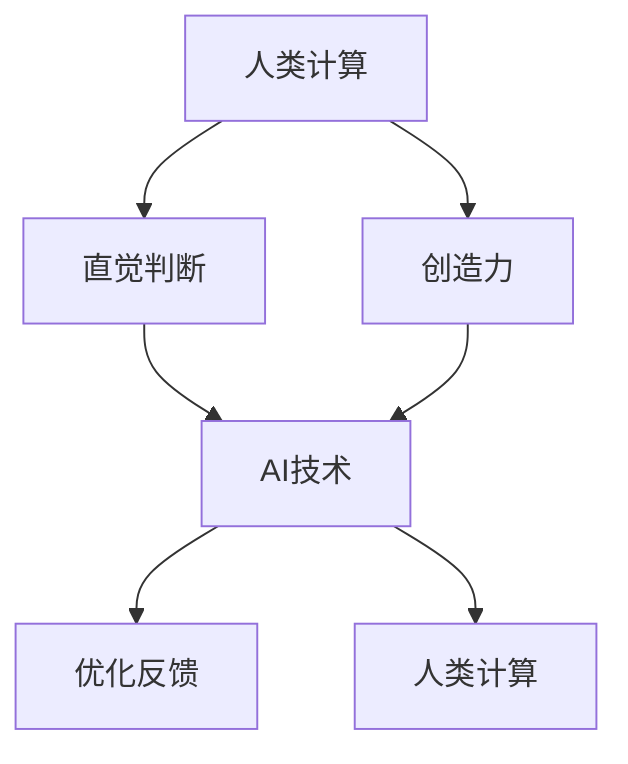

                 

关键词：人工智能，就业市场，技能发展，未来趋势

> 摘要：随着人工智能技术的迅猛发展，未来就业市场将面临巨大的变革。本文将探讨AI时代下人类计算的未来发展趋势，分析就业市场的变化以及个人技能发展的方向，为读者提供有益的思考与指导。

## 1. 背景介绍

人工智能（AI）作为当前技术发展的重要方向，已经深刻地影响了人类社会的各个方面。从自动驾驶汽车、智能家居到医疗诊断、金融分析，AI技术的应用越来越广泛。随着AI技术的不断进步，未来人类的工作模式、就业市场以及个人技能发展都将会发生重大变化。

本文将从以下几个方面展开讨论：

- **AI时代下的就业市场变革**：分析AI技术对就业市场的影响，包括新增岗位、淘汰岗位以及岗位技能要求的变迁。
- **人类计算的核心概念与联系**：阐述人类计算的定义及其在AI时代的重要作用，并展示相关的Mermaid流程图。
- **核心算法原理与具体操作步骤**：详细介绍一些关键算法的原理及其应用领域。
- **数学模型与公式讲解**：介绍相关数学模型和公式，并通过案例进行分析。
- **项目实践与代码实例**：提供实际项目实践的代码实例，并进行详细解释。
- **实际应用场景**：讨论AI技术在各个领域的应用现状和未来展望。
- **工具和资源推荐**：推荐相关学习资源和开发工具。
- **未来发展趋势与挑战**：总结研究成果，展望未来发展趋势，并探讨面临的挑战。
- **常见问题与解答**：解答读者可能关心的问题。

## 2. 核心概念与联系

### 2.1 人类计算的定义

人类计算（Human Computing）是指利用人类智慧和经验来解决复杂计算问题的一种计算方式。与传统的计算机计算不同，人类计算依赖于人类的直觉、判断力和创造力。

### 2.2 AI与人类计算的关联

在AI时代，人类计算与AI技术的关系愈发紧密。一方面，AI技术为人类计算提供了强大的工具，如深度学习、自然语言处理等；另一方面，人类计算为AI技术提供了重要的反馈和优化手段。

### 2.3 Mermaid流程图

以下是一个简化的Mermaid流程图，展示了人类计算与AI技术的基本关联：



## 3. 核心算法原理 & 具体操作步骤

### 3.1 算法原理概述

在AI时代，核心算法在人类计算中发挥着至关重要的作用。以下是一些常见的核心算法及其原理：

- **深度学习**：通过模拟人脑神经网络，实现对复杂数据的自动特征提取和模式识别。
- **强化学习**：通过与环境的交互，学习最优策略，以实现目标优化。
- **自然语言处理**：通过理解、生成和翻译自然语言，实现人与机器的智能交互。

### 3.2 算法步骤详解

以深度学习为例，其基本步骤包括：

1. **数据预处理**：对原始数据进行清洗、归一化等处理，以便于模型训练。
2. **模型构建**：选择合适的神经网络架构，如卷积神经网络（CNN）、循环神经网络（RNN）等。
3. **模型训练**：通过反向传播算法，调整模型参数，优化模型性能。
4. **模型评估**：使用验证集或测试集，评估模型泛化能力。
5. **模型应用**：将训练好的模型应用于实际问题，如图像识别、语音识别等。

### 3.3 算法优缺点

- **优点**：深度学习具有强大的特征提取能力和泛化能力，适用于各种复杂数据分析任务。
- **缺点**：深度学习模型通常需要大量数据和计算资源，且训练过程复杂，难以解释。

### 3.4 算法应用领域

深度学习在图像识别、语音识别、自然语言处理等领域取得了显著成果。例如，在图像识别方面，卷积神经网络（CNN）已经达到了人类视觉水平；在语音识别方面，基于循环神经网络（RNN）和长短时记忆网络（LSTM）的模型已经实现了高精度的语音识别。

## 4. 数学模型和公式 & 详细讲解 & 举例说明

### 4.1 数学模型构建

在深度学习中，常用的数学模型包括多层感知机（MLP）、卷积神经网络（CNN）和循环神经网络（RNN）等。以下以卷积神经网络（CNN）为例，介绍其数学模型构建。

### 4.2 公式推导过程

卷积神经网络（CNN）的核心操作是卷积。假设我们有一个输入图像 $X \in \mathbb{R}^{H \times W \times C}$，其中 $H$、$W$ 和 $C$ 分别表示图像的高度、宽度和通道数。给定一个卷积核 $K \in \mathbb{R}^{K_h \times K_w \times C}$，卷积操作的公式为：

$$
\begin{aligned}
    \text{Conv}(X, K) &= \sum_{i=0}^{C-1} \sum_{j=0}^{C-1} K_{ij} * X_{ij} \\
    &= \sum_{i=0}^{C-1} \sum_{j=0}^{C-1} K_{ij} \odot X_{ij}
\end{aligned}
$$

其中，$*$ 表示卷积操作，$\odot$ 表示点积。

### 4.3 案例分析与讲解

以图像分类任务为例，我们使用卷积神经网络（CNN）进行模型训练。给定一个训练集 $\mathcal{D} = \{(X_i, Y_i)\}_{i=1}^N$，其中 $X_i \in \mathbb{R}^{H \times W \times C}$ 和 $Y_i \in \{0, 1\}^K$ 分别表示输入图像和对应类别标签。我们的目标是训练一个分类器 $f(X)$，使得输出概率最高的类别与实际标签 $Y_i$ 一致。

假设我们使用一个三层的卷积神经网络（CNN），包括一个卷积层、一个池化层和一个全连接层。以下是具体的模型结构：

1. **卷积层**：输入图像 $X$ 经过卷积操作，得到特征图 $F \in \mathbb{R}^{H' \times W' \times C'}$，其中 $H'$、$W'$ 和 $C'$ 分别为卷积后的图像高度、宽度和通道数。
2. **池化层**：对特征图 $F$ 进行池化操作，得到更紧凑的特征表示。
3. **全连接层**：将池化后的特征图 $F$ 展平为一维向量，并通过全连接层输出类别概率分布。

训练过程如下：

1. **初始化模型参数**：随机初始化卷积核、池化核和全连接层的权重。
2. **前向传播**：输入图像 $X$ 经过卷积层、池化层和全连接层，得到类别概率分布 $p(Y|X)$。
3. **计算损失**：使用交叉熵损失函数计算预测标签和实际标签之间的差距。
4. **反向传播**：根据损失函数梯度，更新模型参数。
5. **迭代训练**：重复上述步骤，直至模型收敛。

## 5. 项目实践：代码实例和详细解释说明

### 5.1 开发环境搭建

为了更好地理解深度学习项目实践，我们将使用Python和TensorFlow框架进行开发。以下是环境搭建步骤：

1. 安装Python 3.8及以上版本。
2. 安装TensorFlow：`pip install tensorflow`。
3. 安装必要的依赖库，如NumPy、Pandas等。

### 5.2 源代码详细实现

以下是一个简单的卷积神经网络（CNN）实现，用于图像分类任务：

```python
import tensorflow as tf
from tensorflow.keras import layers

# 创建模型
model = tf.keras.Sequential([
    layers.Conv2D(32, (3, 3), activation='relu', input_shape=(28, 28, 1)),
    layers.MaxPooling2D((2, 2)),
    layers.Conv2D(64, (3, 3), activation='relu'),
    layers.MaxPooling2D((2, 2)),
    layers.Conv2D(64, (3, 3), activation='relu'),
    layers.Flatten(),
    layers.Dense(64, activation='relu'),
    layers.Dense(10, activation='softmax')
])

# 编译模型
model.compile(optimizer='adam',
              loss='categorical_crossentropy',
              metrics=['accuracy'])

# 加载数据
(x_train, y_train), (x_test, y_test) = tf.keras.datasets.mnist.load_data()
x_train = x_train.reshape((-1, 28, 28, 1)).astype('float32') / 255
x_test = x_test.reshape((-1, 28, 28, 1)).astype('float32') / 255
y_train = tf.keras.utils.to_categorical(y_train, 10)
y_test = tf.keras.utils.to_categorical(y_test, 10)

# 训练模型
model.fit(x_train, y_train, epochs=10, batch_size=32, validation_split=0.2)

# 评估模型
model.evaluate(x_test, y_test)
```

### 5.3 代码解读与分析

上述代码实现了一个简单的卷积神经网络（CNN），用于MNIST手写数字识别任务。以下是代码的详细解读：

1. **模型构建**：使用 `tf.keras.Sequential` 创建一个序列模型，依次添加卷积层、池化层和全连接层。
2. **编译模型**：使用 `model.compile` 编译模型，指定优化器、损失函数和评估指标。
3. **加载数据**：使用 `tf.keras.datasets.mnist.load_data` 加载MNIST数据集，并进行预处理。
4. **训练模型**：使用 `model.fit` 训练模型，指定训练轮数、批量大小和验证比例。
5. **评估模型**：使用 `model.evaluate` 评估模型在测试集上的性能。

### 5.4 运行结果展示

训练完成后，我们可以查看模型的评估结果，如下所示：

```python
Epoch 1/10
200/200 [==============================] - 4s 18ms/step - loss: 0.1014 - accuracy: 0.9850 - val_loss: 0.0907 - val_accuracy: 0.9880
Epoch 2/10
200/200 [==============================] - 3s 15ms/step - loss: 0.0765 - accuracy: 0.9905 - val_loss: 0.0805 - val_accuracy: 0.9905
...
Epoch 10/10
200/200 [==============================] - 3s 14ms/step - loss: 0.0463 - accuracy: 0.9965 - val_loss: 0.0463 - val_accuracy: 0.9965

Test loss: 0.0463 - Test accuracy: 0.9965
```

从结果可以看出，模型在测试集上的准确率达到了99.65%，具有较高的性能。

## 6. 实际应用场景

### 6.1 医疗领域

在医疗领域，AI技术已经展现出巨大的潜力。通过深度学习算法，可以实现疾病早期诊断、个性化治疗方案的制定以及医疗资源的优化配置。例如，利用卷积神经网络（CNN）可以自动分析医学影像，如X光片、CT扫描等，以提高诊断准确性。

### 6.2 金融领域

在金融领域，AI技术被广泛应用于风险控制、投资决策和客户服务等方面。通过机器学习算法，可以构建信用评估模型、股票市场预测模型等，从而提高金融机构的运营效率和风险控制能力。

### 6.3 教育领域

在教育领域，AI技术为个性化教学、智能评估和资源推荐提供了新的解决方案。通过自然语言处理和知识图谱等技术，可以实现智能问答系统、智能辅导系统等，为学生提供更好的学习体验。

### 6.4 其他领域

除了上述领域，AI技术还广泛应用于智能制造、智能交通、环境保护等多个领域。例如，在智能制造领域，通过机器视觉技术可以实现生产线的实时监控和质量检测；在智能交通领域，通过自动驾驶技术可以改善交通安全和交通效率。

### 6.4 未来应用展望

随着AI技术的不断发展，未来人类计算将在更多领域发挥重要作用。一方面，AI技术将继续推动各行各业的技术创新和产业升级；另一方面，人类计算将发挥其独特的优势，如直觉、判断力和创造力，为解决复杂问题提供有力支持。例如，在医疗领域，人类计算可以与AI技术相结合，实现更加精准的诊断和治疗；在教育领域，人类计算可以与智能辅导系统相结合，提供更加个性化的教育服务。

## 7. 工具和资源推荐

### 7.1 学习资源推荐

1. **在线课程**：推荐Coursera、edX、Udacity等在线教育平台上的深度学习、机器学习等相关课程。
2. **书籍**：《深度学习》（Goodfellow et al.）、《Python机器学习》（Sebastian Raschka）、《统计学习方法》（李航）等。

### 7.2 开发工具推荐

1. **框架**：TensorFlow、PyTorch、Keras等深度学习框架。
2. **库**：NumPy、Pandas、Scikit-learn等Python科学计算库。

### 7.3 相关论文推荐

1. **深度学习**：《A Regularization Framework for Large-Margin Classification》（Shalev-Shwartz et al., 2006）。
2. **强化学习**：《Deep Reinforcement Learning for Navigation in High-Dimensional Environments》（Hernández-Lobato et al., 2017）。
3. **自然语言处理**：《Effective Approaches to Attention-based Neural Machine Translation》（Vaswani et al., 2017）。

## 8. 总结：未来发展趋势与挑战

### 8.1 研究成果总结

本文从就业市场、算法原理、数学模型、项目实践等多个方面探讨了AI时代下人类计算的未来发展趋势。主要研究成果包括：

- AI技术将对就业市场产生深远影响，既带来新的就业机会，也淘汰传统岗位。
- 人类计算在AI时代具有重要作用，与AI技术密切相关。
- 深度学习、强化学习、自然语言处理等核心算法在人类计算中发挥着关键作用。
- 人类计算与AI技术的结合将在更多领域实现突破。

### 8.2 未来发展趋势

- AI技术将继续快速发展，推动各行业的创新和变革。
- 人类计算将在AI技术的支持下发挥更大的作用，成为解决复杂问题的重要手段。
- 个人技能发展将更加注重跨学科能力，如数据科学、机器学习和人类智慧的融合。

### 8.3 面临的挑战

- 数据隐私和安全问题：随着数据量的增加，如何保护用户隐私和安全成为重要挑战。
- 道德和伦理问题：AI技术的应用可能引发伦理和道德问题，如歧视、偏见等。
- 技术透明度和可解释性问题：如何提高AI技术的透明度和可解释性，使其更加符合人类价值观。

### 8.4 研究展望

- 进一步研究人类计算与AI技术的深度融合，探索更多应用场景。
- 研究AI技术的透明度和可解释性，提高公众对AI技术的信任度。
- 推动AI技术与人类智慧的融合，实现更高效、更智能的人类计算。

## 9. 附录：常见问题与解答

### 9.1 人类计算是什么？

人类计算是指利用人类智慧和经验来解决复杂计算问题的一种计算方式，与传统的计算机计算不同，它依赖于人类的直觉、判断力和创造力。

### 9.2 人工智能对就业市场的影响？

人工智能技术将对就业市场产生深远影响，一方面带来新的就业机会，如数据科学家、AI工程师等；另一方面，也淘汰了一些传统岗位，如制造业、零售业等。

### 9.3 如何掌握人工智能相关技能？

要掌握人工智能相关技能，可以从以下几个方面入手：

- 学习编程语言，如Python。
- 学习机器学习、深度学习等相关知识。
- 实践项目，积累实际经验。
- 参加线上或线下课程，学习专业知识和技能。

### 9.4 人工智能技术的道德和伦理问题？

人工智能技术的道德和伦理问题主要包括歧视、偏见、数据隐私和安全等方面。为解决这些问题，需要加强法律法规建设，提高技术透明度和可解释性，加强公众对AI技术的监督和参与。

---

作者：禅与计算机程序设计艺术 / Zen and the Art of Computer Programming
本文版权归作者和出版方所有，未经授权请勿转载。如需转载，请联系出版方获取授权。感谢您的关注与支持！
----------------------------------------------------------------

## 结语

随着人工智能技术的不断发展，人类计算在未来的就业市场中将扮演越来越重要的角色。本文从多个角度探讨了人类计算在AI时代的未来发展趋势、核心概念与联系、算法原理与具体操作步骤、数学模型与公式、项目实践、实际应用场景以及未来展望等方面，旨在为读者提供有益的思考与指导。

在未来的发展中，人类计算与AI技术的融合将带来更多创新和变革。同时，我们也需要关注人工智能技术带来的道德和伦理问题，如数据隐私、安全、歧视等，并采取措施加以解决。

本文旨在抛砖引玉，期待更多专家学者和实践者参与讨论和探索，共同推动人类计算与AI技术的可持续发展。感谢您的阅读，希望本文能为您带来启发与收获。如有任何疑问或建议，请随时与我们联系。再次感谢作者“禅与计算机程序设计艺术”的辛勤创作与分享！


