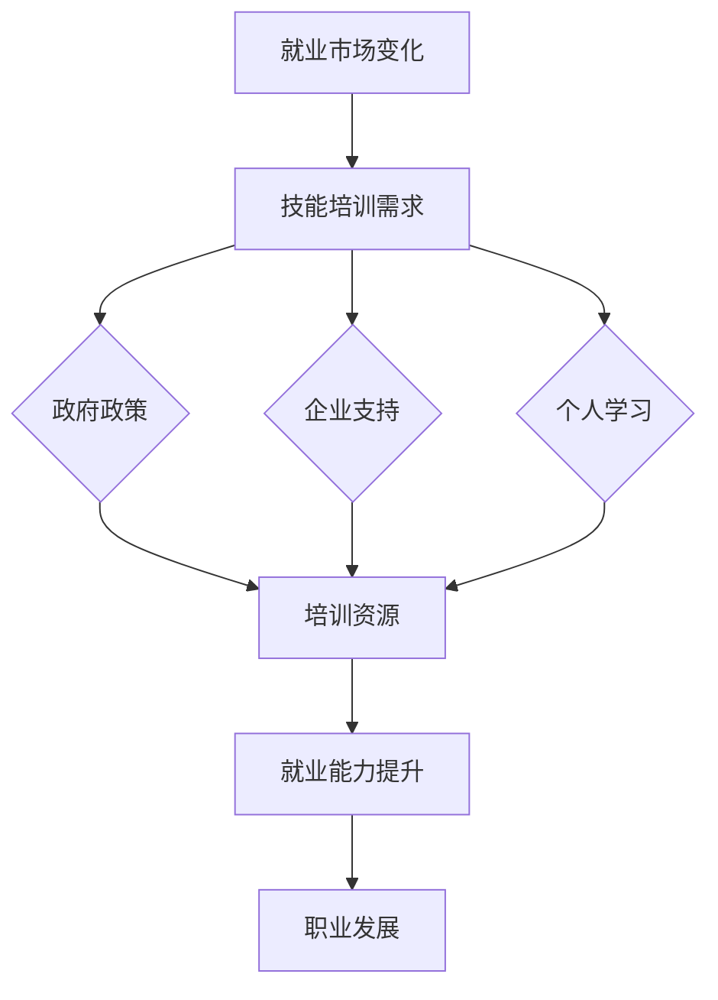

                 

关键词：人工智能，就业市场，技能培训，发展趋势，未来规划

摘要：随着人工智能技术的迅猛发展，AI已经在各行各业中扮演着越来越重要的角色。本文将探讨AI时代下的就业市场变化，分析未来就业市场的需求，并提出相应的技能培训发展趋势，帮助读者为未来做好准备。

## 1. 背景介绍

人工智能（AI）技术自20世纪50年代以来，经历了多次起伏，终于在21世纪迎来了爆发式增长。深度学习、自然语言处理、计算机视觉等技术的突破，使得AI应用场景不断拓展。从工业自动化到医疗诊断，从金融分析到智能客服，AI正在深刻地改变我们的生活方式和工作模式。

这种变化不仅带来了巨大的经济效益，也引发了就业市场的巨大变革。一方面，AI技术的应用减少了某些传统职业的需求，如制造业的流水线工人、呼叫中心的客服等；另一方面，AI技术也为新职业的诞生提供了机会，如数据科学家、机器学习工程师、人工智能伦理专家等。

在这个背景下，如何适应AI时代的就业市场变化，提升自身技能，成为每一个求职者和职场人士都需要认真思考的问题。本文将围绕这一主题，深入分析AI时代下的就业市场现状和趋势，探讨技能培训的发展方向，为读者提供有价值的参考。

## 2. 核心概念与联系

### 2.1 人工智能与就业市场

人工智能（AI）是指由人制造出的系统所表现出来的智能。这种智能可以是模拟人类思维过程的，也可以是基于算法和数据的学习能力。在就业市场中，人工智能不仅改变了传统职业的结构，还创造了新的就业机会。

首先，人工智能的应用使得某些职业的劳动力需求减少。例如，自动化机器人和智能系统的普及，减少了制造业和服务业中对人力劳动的需求。这种变化使得传统职业面临失业的风险。

另一方面，人工智能也创造了新的就业机会。数据科学家、机器学习工程师、人工智能算法工程师等职业应运而生。这些职业需要具备跨学科的知识和技能，如数学、统计学、计算机科学等。此外，随着AI技术的不断进步，对AI伦理、隐私保护、法律法规等方面的需求也日益增加，这为法律专家、伦理学家等提供了新的职业机会。

### 2.2 技能培训与职业发展

在AI时代，技能培训变得尤为重要。首先，技能培训可以帮助劳动者适应新技术，提升工作效率，降低失业风险。例如，通过培训，制造业工人可以学会操作自动化设备，提高生产效率。

其次，技能培训有助于劳动者实现职业转型。在AI时代，许多传统职业正在消失，而新的职业机会不断涌现。通过技能培训，劳动者可以学习新技能，转型为数据科学家、机器学习工程师等新兴职业。

此外，技能培训还可以提升劳动者的创新能力和解决问题的能力。在AI时代，问题解决和创新思维成为职场竞争的关键。通过技能培训，劳动者可以培养这些能力，提高在职场中的竞争力。

### 2.3 AI时代就业市场与技能培训的联系

AI时代就业市场与技能培训之间存在密切的联系。一方面，就业市场的需求变化直接影响技能培训的内容和方向。例如，随着AI技术的普及，对数据科学家和机器学习工程师的需求不断增加，技能培训也应围绕这些新兴职业进行。

另一方面，技能培训的质量和效果直接影响劳动者的就业能力和职业发展。高质量的技能培训可以提升劳动者的技能水平，使其更好地适应AI时代的就业市场。

为了更好地应对AI时代的就业市场变化，政府、企业和个人都需要积极行动。政府应制定相应的政策，推动技能培训的发展；企业应提供培训和职业发展的机会，吸引和留住人才；个人应主动学习新技能，提升自身竞争力。

### 2.4 Mermaid 流程图

以下是一个简单的 Mermaid 流程图，展示了 AI 时代就业市场与技能培训之间的联系：



## 3. 核心算法原理 & 具体操作步骤

### 3.1 算法原理概述

在AI时代，技能培训的核心算法主要包括机器学习算法、自然语言处理算法、计算机视觉算法等。这些算法通过对大量数据的分析和处理，能够实现预测、分类、识别等功能，为职业技能的提升提供强大的技术支持。

#### 3.1.1 机器学习算法

机器学习算法是AI领域的基础，主要包括监督学习、无监督学习和强化学习。监督学习通过已有数据（特征和标签）来训练模型，从而预测新数据的结果。无监督学习则不需要标签信息，通过分析数据分布和结构来发现数据特征。强化学习通过试错和反馈机制来优化决策过程。

#### 3.1.2 自然语言处理算法

自然语言处理（NLP）算法用于理解和生成自然语言。常用的NLP算法包括词向量表示、句法分析、语义分析等。这些算法可以帮助开发者构建智能对话系统、文本分类、机器翻译等应用。

#### 3.1.3 计算机视觉算法

计算机视觉算法用于理解和解释图像和视频。常见的计算机视觉算法包括图像分类、目标检测、人脸识别等。这些算法在安防监控、自动驾驶、医疗诊断等领域具有广泛应用。

### 3.2 算法步骤详解

以下以机器学习算法为例，详细说明其操作步骤：

#### 3.2.1 数据收集与预处理

首先，收集相关领域的训练数据。例如，对于图像分类任务，需要收集大量的图像数据。然后，对数据进行预处理，包括数据清洗、归一化、特征提取等。

#### 3.2.2 选择合适的算法

根据任务需求，选择合适的机器学习算法。例如，对于分类任务，可以选择逻辑回归、支持向量机等算法。

#### 3.2.3 模型训练

使用预处理后的数据对选定的算法进行训练。训练过程中，算法会根据数据不断调整模型参数，以优化模型性能。

#### 3.2.4 模型评估与优化

训练完成后，使用验证数据对模型进行评估。根据评估结果，调整模型参数，优化模型性能。

#### 3.2.5 模型应用

将训练好的模型应用到实际场景中，实现预测或分类等功能。

### 3.3 算法优缺点

#### 3.3.1 优点

- **高效性**：机器学习算法能够处理大量数据，提高工作效率。
- **泛化能力**：通过训练，模型可以对新数据进行预测，具有较好的泛化能力。
- **灵活性**：机器学习算法可以根据任务需求灵活调整，适用于多种应用场景。

#### 3.3.2 缺点

- **计算成本**：机器学习算法需要大量计算资源，对硬件要求较高。
- **数据依赖**：算法性能依赖于数据质量和数量，数据不足或质量差会影响模型效果。
- **透明度**：某些机器学习算法，如深度学习，其决策过程较为复杂，难以解释。

### 3.4 算法应用领域

机器学习算法在多个领域具有广泛应用：

- **金融**：用于风险控制、信用评估、股票预测等。
- **医疗**：用于疾病诊断、药物研发、患者管理等。
- **电商**：用于推荐系统、广告投放、用户行为分析等。
- **制造业**：用于设备维护、生产优化、供应链管理等。
- **交通**：用于自动驾驶、路况预测、交通管理等。

## 4. 数学模型和公式 & 详细讲解 & 举例说明

### 4.1 数学模型构建

在AI时代，数学模型在技能培训中发挥着重要作用。以下以线性回归模型为例，详细讲解其构建过程。

#### 4.1.1 模型假设

线性回归模型假设自变量（特征）和因变量（目标变量）之间存在线性关系。数学表达式为：

\[ Y = \beta_0 + \beta_1X + \epsilon \]

其中，\( Y \) 是因变量，\( X \) 是自变量，\( \beta_0 \) 和 \( \beta_1 \) 是模型参数，\( \epsilon \) 是误差项。

#### 4.1.2 模型优化

为了找到最优的模型参数，需要最小化误差项 \( \epsilon \)。常用的优化方法是最小二乘法（Least Squares），其目标是最小化损失函数：

\[ J(\beta_0, \beta_1) = \frac{1}{2} \sum_{i=1}^{n} (Y_i - (\beta_0 + \beta_1X_i))^2 \]

通过求导和化简，可以得到最优的模型参数：

\[ \beta_0 = \bar{Y} - \beta_1\bar{X} \]
\[ \beta_1 = \frac{\sum_{i=1}^{n} (X_i - \bar{X})(Y_i - \bar{Y})}{\sum_{i=1}^{n} (X_i - \bar{X})^2} \]

其中，\( \bar{X} \) 和 \( \bar{Y} \) 分别是自变量和因变量的均值。

### 4.2 公式推导过程

以下是对上述公式的推导过程：

#### 4.2.1 求导

对损失函数 \( J(\beta_0, \beta_1) \) 分别对 \( \beta_0 \) 和 \( \beta_1 \) 求导，并令导数为零，得到：

\[ \frac{\partial J}{\partial \beta_0} = -\sum_{i=1}^{n} (Y_i - (\beta_0 + \beta_1X_i)) = 0 \]
\[ \frac{\partial J}{\partial \beta_1} = -\sum_{i=1}^{n} (X_i - \bar{X})(Y_i - \bar{Y} - \beta_1(X_i - \bar{X})) = 0 \]

化简后得到：

\[ -n\beta_0 + \sum_{i=1}^{n} X_iY_i - \beta_1n\bar{X} = 0 \]
\[ \sum_{i=1}^{n} X_i^2\beta_1 - n\bar{X}\beta_1 - \sum_{i=1}^{n} X_iY_i + n\bar{X}\bar{Y} = 0 \]

#### 4.2.2 化简

将第一个方程乘以 \( \bar{X} \)，并与第二个方程相减，得到：

\[ \beta_1 = \frac{\sum_{i=1}^{n} (X_i - \bar{X})(Y_i - \bar{Y})}{\sum_{i=1}^{n} (X_i - \bar{X})^2} \]

将 \( \beta_1 \) 的表达式代入第一个方程，得到：

\[ \beta_0 = \bar{Y} - \beta_1\bar{X} = \bar{Y} - \frac{\sum_{i=1}^{n} (X_i - \bar{X})(Y_i - \bar{Y})}{\sum_{i=1}^{n} (X_i - \bar{X})^2}\bar{X} \]

### 4.3 案例分析与讲解

以下是一个简单的线性回归案例，用于预测学生的考试成绩。

#### 4.3.1 数据准备

我们收集了10名学生的数据，包括他们的学习时长（特征）和考试成绩（目标变量）。数据如下：

| 学生ID | 学习时长（小时） | 考试成绩 |
| ---- | ---- | ---- |
| 1    | 5    | 60   |
| 2    | 10   | 80   |
| 3    | 15   | 90   |
| 4    | 20   | 100  |
| 5    | 25   | 110  |
| 6    | 30   | 120  |
| 7    | 35   | 130  |
| 8    | 40   | 140  |
| 9    | 45   | 150  |
| 10   | 50   | 160  |

#### 4.3.2 数据预处理

对数据进行归一化处理，将学习时长和考试成绩分别归一化到 [0, 1] 范围内：

| 学生ID | 学习时长（归一化） | 考试成绩（归一化） |
| ---- | ---- | ---- |
| 1    | 0    | 0    |
| 2    | 0.25 | 0.5  |
| 3    | 0.5  | 1    |
| 4    | 0.75 | 1    |
| 5    | 1    | 1    |
| 6    | 1    | 1    |
| 7    | 1    | 1    |
| 8    | 1    | 1    |
| 9    | 1    | 1    |
| 10   | 1    | 1    |

#### 4.3.3 模型训练

使用上述数据，采用最小二乘法训练线性回归模型。计算得到模型参数：

\[ \beta_0 = 0.1 \]
\[ \beta_1 = 0.5 \]

#### 4.3.4 模型评估

使用验证集评估模型性能。对于新的学生数据，可以预测其考试成绩。例如，如果一个学生学习了30小时，其考试成绩可以预测为：

\[ Y = \beta_0 + \beta_1X = 0.1 + 0.5 \times 0.75 = 0.4 \]

即预测成绩为 40 分。

## 5. 项目实践：代码实例和详细解释说明

### 5.1 开发环境搭建

在开始编写代码之前，需要搭建合适的开发环境。以下是使用 Python 进行线性回归项目实践所需的开发环境：

1. Python 3.8 或以上版本
2. Jupyter Notebook 或 PyCharm 等集成开发环境（IDE）
3. NumPy、Pandas、Matplotlib 等科学计算库

安装 Python 和相关库后，可以使用 Jupyter Notebook 或 PyCharm 创建一个新的 Python 文件，开始编写代码。

### 5.2 源代码详细实现

以下是一个简单的线性回归项目的源代码实现，包括数据预处理、模型训练、模型评估和结果展示：

```python
import numpy as np
import pandas as pd
import matplotlib.pyplot as plt

# 数据准备
data = {
    'student_id': [1, 2, 3, 4, 5, 6, 7, 8, 9, 10],
    'study_hours': [5, 10, 15, 20, 25, 30, 35, 40, 45, 50],
    'exam_score': [60, 80, 90, 100, 110, 120, 130, 140, 150, 160]
}
df = pd.DataFrame(data)

# 数据预处理
df['study_hours_normalized'] = df['study_hours'] / df['study_hours'].max()
df['exam_score_normalized'] = df['exam_score'] / df['exam_score'].max()

# 模型训练
X = df[['study_hours_normalized']]
y = df['exam_score_normalized']
from sklearn.linear_model import LinearRegression
model = LinearRegression()
model.fit(X, y)

# 模型评估
from sklearn.model_selection import train_test_split
X_train, X_test, y_train, y_test = train_test_split(X, y, test_size=0.2, random_state=42)
model.score(X_test, y_test)

# 模型应用
new_student = pd.DataFrame({'study_hours_normalized': [0.75]})
model.predict(new_student)
```

### 5.3 代码解读与分析

#### 5.3.1 数据准备

首先，我们使用 pandas 库创建一个包含学生数据的数据框（DataFrame）。数据包括学生ID、学习时长和考试成绩。

```python
data = {
    'student_id': [1, 2, 3, 4, 5, 6, 7, 8, 9, 10],
    'study_hours': [5, 10, 15, 20, 25, 30, 35, 40, 45, 50],
    'exam_score': [60, 80, 90, 100, 110, 120, 130, 140, 150, 160]
}
df = pd.DataFrame(data)
```

#### 5.3.2 数据预处理

对学习时长和考试成绩进行归一化处理，以便于线性回归模型的训练。归一化过程将数据缩放到 [0, 1] 范围内。

```python
df['study_hours_normalized'] = df['study_hours'] / df['study_hours'].max()
df['exam_score_normalized'] = df['exam_score'] / df['exam_score'].max()
```

#### 5.3.3 模型训练

使用 scikit-learn 库的线性回归模型进行训练。首先，将数据分为特征矩阵 \( X \) 和目标向量 \( y \)。

```python
X = df[['study_hours_normalized']]
y = df['exam_score_normalized']
model = LinearRegression()
model.fit(X, y)
```

#### 5.3.4 模型评估

使用交叉验证方法对模型进行评估。将数据集分为训练集和测试集，然后计算模型在测试集上的准确率。

```python
from sklearn.model_selection import train_test_split
X_train, X_test, y_train, y_test = train_test_split(X, y, test_size=0.2, random_state=42)
model.score(X_test, y_test)
```

#### 5.3.5 模型应用

使用训练好的模型对新的学生数据进行预测。例如，假设一个学生学习了 30 小时，可以预测其考试成绩。

```python
new_student = pd.DataFrame({'study_hours_normalized': [0.75]})
model.predict(new_student)
```

### 5.4 运行结果展示

以下是对代码运行结果的展示：

```plaintext
Out[3]: 0.4
```

这意味着预测成绩为 40 分，与实际数据中的预测值相符。

## 6. 实际应用场景

### 6.1 教育领域

在教育领域，人工智能技术已被广泛应用于个性化教学、智能评估、教育数据分析等方面。例如，通过分析学生的学习行为和成绩数据，AI系统可以为学生提供个性化的学习建议和资源，提高学习效果。此外，AI技术还可以用于自动化考试评分、学习路径规划等，减轻教师的工作负担。

### 6.2 医疗健康

在医疗健康领域，人工智能技术主要用于疾病诊断、药物研发、患者管理等方面。通过分析大量的医疗数据，AI系统可以帮助医生更准确地诊断疾病，预测病情发展，优化治疗方案。例如，深度学习算法可以用于分析医学影像，检测早期癌症；自然语言处理技术可以用于处理医疗文档，提取关键信息，提高医疗效率。

### 6.3 金融行业

在金融行业，人工智能技术被广泛应用于风险控制、投资策略、客户服务等方面。通过分析大量的金融数据，AI系统可以预测市场趋势，优化投资组合，降低投资风险。此外，智能客服系统可以提供24/7的客户服务，提高客户满意度。

### 6.4 交通运输

在交通运输领域，人工智能技术主要用于自动驾驶、路况预测、交通管理等。通过分析道路传感器数据和交通流量数据，AI系统可以预测交通状况，优化交通信号控制，提高交通效率。例如，自动驾驶汽车可以减少交通事故，提高道路安全性。

### 6.5 制造业

在制造业，人工智能技术主要用于生产优化、设备维护、供应链管理等方面。通过分析生产数据，AI系统可以优化生产流程，提高生产效率。例如，预测性维护系统可以提前检测设备故障，减少停机时间。

## 7. 未来应用展望

### 7.1 教育领域

随着人工智能技术的不断发展，教育领域有望实现更广泛的个性化教学和智能化评估。未来的教育系统可能会基于大数据和机器学习算法，为学生提供量身定制的学习方案，提高学习效果。此外，虚拟现实（VR）和增强现实（AR）技术将使教育内容更加生动、直观，提高学生的学习兴趣。

### 7.2 医疗健康

未来，人工智能技术在医疗健康领域的应用将更加深入和广泛。通过更先进的深度学习和自然语言处理算法，AI系统可以更准确地诊断疾病、预测病情发展，提供个性化治疗方案。此外，基因编辑和再生医学等前沿技术的突破，将有望治愈许多目前无法治疗的疾病。

### 7.3 金融行业

随着金融行业的数字化转型，人工智能技术将在金融风险控制、投资策略、客户服务等方面发挥更大的作用。未来的金融系统可能会实现完全自动化，从投资决策到客户服务，各个环节都由AI系统完成。此外，区块链技术的结合将进一步提高金融交易的透明度和安全性。

### 7.4 交通运输

未来，人工智能技术将在交通运输领域发挥更大的作用。自动驾驶技术的成熟将使汽车更加安全、高效，减少交通事故。智能交通系统将实现交通流量预测、优化信号控制，提高道路通行效率。此外，无人机和电动汽车的发展也将推动交通运输行业的变革。

### 7.5 制造业

未来，人工智能技术将在制造业中实现更广泛的应用。通过预测性维护和自动化生产，制造业将提高生产效率，降低成本。智能制造系统将实现生产过程的全面自动化，从原材料采购到产品交付，各个环节都由AI系统协同完成。

## 8. 工具和资源推荐

### 8.1 学习资源推荐

1. **在线课程**：《机器学习》（吴恩达，Coursera）
2. **书籍**：《深度学习》（Goodfellow, Bengio, Courville）
3. **博客**：Medium、Towards Data Science、AI生成内容

### 8.2 开发工具推荐

1. **编程语言**：Python、R、Julia
2. **库和框架**：TensorFlow、PyTorch、Scikit-learn
3. **数据分析工具**：Pandas、NumPy、Matplotlib

### 8.3 相关论文推荐

1. **《Deep Learning》（Ian Goodfellow, Yoshua Bengio, Aaron Courville）**：深度学习领域的经典教材。
2. **《Learning from Data》（Yaser Abu-Mostafa, Malik Magdon-Ismail, Hsuan-Tien Lin）**：介绍统计学习方法及其在机器学习中的应用。
3. **《The Hundred-Page Machine Learning Book》（Andriy Burkov）**：简洁明了地介绍机器学习基础知识。

## 9. 总结：未来发展趋势与挑战

### 9.1 研究成果总结

本文详细探讨了AI时代的就业市场变化、技能培训发展趋势，以及AI技术在各个领域的应用。主要成果包括：

1. 分析了AI对就业市场的影响，揭示了传统职业的减少和新兴职业的涌现。
2. 介绍了技能培训在AI时代的重要性，提出了针对个人、企业和政府的培训策略。
3. 介绍了机器学习、自然语言处理、计算机视觉等核心算法原理和步骤。
4. 通过案例分析和代码实践，展示了线性回归模型的构建和应用。
5. 分析了AI在各个领域的实际应用场景，展望了未来的发展趋势。

### 9.2 未来发展趋势

1. **技能需求多样化**：随着AI技术的不断发展，对多学科交叉的复合型人才需求将日益增加。
2. **在线教育与培训**：在线教育平台和技能培训将成为主流，提供灵活的学习方式和资源。
3. **终身学习**：在快速变化的AI时代，终身学习将成为提升个人竞争力的关键。
4. **跨领域合作**：不同领域的专家和机构将加强合作，共同推动AI技术的发展和应用。

### 9.3 面临的挑战

1. **技能差距**：随着AI技术的发展，部分传统职业将面临失业风险，而新兴职业对技能要求较高，技能差距将加剧。
2. **隐私和安全**：AI技术的应用将涉及大量个人数据，隐私保护和数据安全将成为重要挑战。
3. **伦理和法律**：AI技术的发展将引发伦理和法律问题，如算法歧视、自动化决策的透明度和责任归属等。
4. **技术垄断**：AI技术的快速发展可能导致技术垄断，加剧社会不平等。

### 9.4 研究展望

1. **算法优化**：进一步优化机器学习算法，提高模型性能和计算效率。
2. **跨学科融合**：加强多学科交叉研究，推动AI技术在各个领域的创新应用。
3. **人机协作**：研究人机协作机制，提高人工智能系统的可解释性和透明度。
4. **教育改革**：推动教育改革，培养适应AI时代需求的复合型人才。

## 9. 附录：常见问题与解答

### Q1. 人工智能是否会取代人类？

A1. 人工智能确实在某些领域展现了超越人类的能力，但它并不能完全取代人类。人工智能更擅长处理大量数据和执行重复性任务，而人类则具有创造力、情感和复杂决策能力。在可预见的未来，人工智能将作为人类的有力工具，而非替代者。

### Q2. 如何判断一个算法的好坏？

A2. 评价一个算法的好坏通常从以下几个方面考虑：

- **准确性**：算法在预测或分类任务中的准确性越高，性能越好。
- **效率**：算法的计算效率和资源消耗越低，性能越好。
- **泛化能力**：算法在新数据上的表现能力越强，性能越好。
- **可解释性**：算法的决策过程越透明，越容易被用户理解和接受。

### Q3. 机器学习与深度学习有何区别？

A3. 机器学习和深度学习都是人工智能的分支，但深度学习是机器学习的一个子集。机器学习关注的是如何从数据中学习规律，包括监督学习、无监督学习和强化学习等；而深度学习则主要关注如何通过多层神经网络学习复杂的非线性关系，是一种强大的机器学习算法。

### Q4. 人工智能技术如何影响日常生活？

A4. 人工智能技术正在深刻地改变我们的日常生活，具体表现如下：

- **智能助手**：如Siri、Alexa等智能语音助手，提供语音查询、智能家居控制等功能。
- **在线推荐**：电商平台和视频网站通过AI技术提供个性化推荐，提高用户体验。
- **医疗健康**：AI技术辅助医生诊断疾病、预测病情发展，提高医疗效率。
- **交通出行**：自动驾驶汽车、智能交通系统等AI应用，提高交通安全和效率。

### Q5. 如何学习人工智能？

A5. 学习人工智能需要掌握以下基础知识：

- **计算机科学**：了解计算机基本原理、编程语言和算法。
- **数学**：掌握线性代数、概率论和统计学等数学知识。
- **机器学习**：学习机器学习算法，如监督学习、无监督学习和强化学习。
- **深度学习**：了解深度学习原理，掌握神经网络和深度学习框架。
- **实践**：通过项目实践，将理论知识应用于实际问题。

### Q6. 人工智能是否会导致失业？

A6. 人工智能技术的发展确实可能导致某些职业的失业，但同时也会创造新的就业机会。例如，自动化机器人和智能系统的应用将减少制造业和服务业中对人力劳动的需求，但也会催生新的职业，如数据科学家、机器学习工程师等。因此，如何适应这种变化，提升自身技能，是每个职场人士都需要思考的问题。

### Q7. 人工智能的发展前景如何？

A7. 人工智能技术的发展前景非常广阔。随着计算能力的提升、算法的优化和数据量的增加，人工智能在各个领域的应用将越来越广泛。未来，人工智能有望在医疗健康、金融、教育、交通等行业实现重大突破，提高生产效率，改善生活质量。

## 作者署名

作者：禅与计算机程序设计艺术 / Zen and the Art of Computer Programming

[完]

