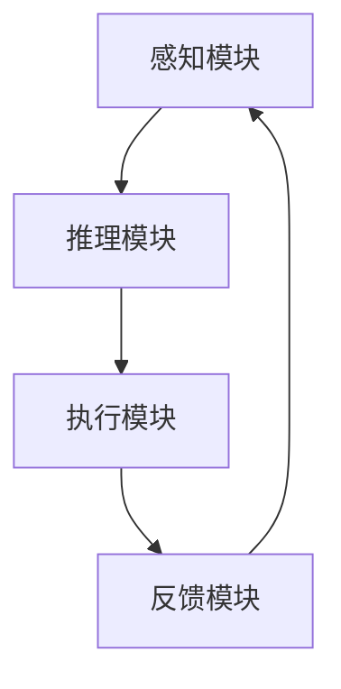

                 

关键词：人工智能、人机交互、计算模型、算法、软件开发、未来趋势

摘要：本文将探讨人类计算这一概念，如何通过结合人的直觉和机器的精确性，实现人与机器之间的有效沟通与协同。文章将从背景介绍、核心概念与联系、算法原理、数学模型、项目实践和实际应用等多个方面展开，深入探讨人类计算的发展现状、未来趋势及其面临的挑战。

## 1. 背景介绍

随着人工智能技术的飞速发展，人机交互正逐渐成为计算机科学和工程领域的一个重要研究方向。在传统的计算模式中，人作为信息处理的主体，常常需要面对复杂的计算任务。然而，人类大脑的处理能力和效率有限，难以胜任一些高复杂度的计算任务。与此同时，计算机在处理大量数据、执行重复性任务和精确计算方面具有显著优势。

因此，如何将人类的直觉和创造力与计算机的精确性和高效性相结合，成为一个亟待解决的重要问题。人类计算这一概念应运而生，它旨在通过设计高效的计算模型和算法，使得人与机器能够无缝衔接，实现协同计算。这不仅能够提高计算效率，还能够拓展人类的认知边界，为解决复杂问题提供新的思路。

## 2. 核心概念与联系

### 2.1 人类计算的概念

人类计算可以理解为一种计算模型，它结合了人类的直觉和计算机的能力。在这种模型中，人作为计算的主体，通过感知、思考、决策等过程，与计算机系统进行交互。计算机系统则通过执行算法、处理数据、提供结果等方式，辅助人类完成计算任务。

### 2.2 计算模型的基本架构

为了实现人类计算，我们需要构建一个基本架构，该架构包括以下几个关键部分：

1. **感知模块**：用于捕捉和处理人类输入的信息，例如语音、文字、图像等。
2. **推理模块**：基于感知模块的信息，通过人类的直觉和经验，进行逻辑推理和决策。
3. **执行模块**：将推理模块生成的决策转化为具体的行动，例如执行程序、控制设备等。
4. **反馈模块**：收集执行模块的输出结果，并反馈给感知模块，形成一个闭环系统。

### 2.3 Mermaid 流程图

下面是使用 Mermaid 语法表示的人类计算模型的基本流程图：



## 3. 核心算法原理 & 具体操作步骤

### 3.1 算法原理概述

人类计算的核心算法主要基于以下几个原理：

1. **并行处理**：利用计算机的并行处理能力，将复杂的计算任务分解为多个子任务，同时执行，从而提高计算效率。
2. **模型融合**：将人类的直觉和计算机算法相结合，通过模型融合技术，实现计算结果的最优化。
3. **强化学习**：利用强化学习算法，使计算机系统能够根据环境反馈不断调整行为策略，从而实现自适应计算。

### 3.2 算法步骤详解

1. **初始化**：设置计算模型的初始参数，包括感知模块、推理模块、执行模块和反馈模块。
2. **感知**：通过感知模块捕捉用户输入的信息，例如语音、文字、图像等。
3. **推理**：利用推理模块，根据感知模块的信息，进行逻辑推理和决策。
4. **执行**：根据推理模块生成的决策，通过执行模块执行具体的行动。
5. **反馈**：收集执行模块的输出结果，通过反馈模块反馈给感知模块，形成一个闭环系统。

### 3.3 算法优缺点

**优点**：

- 提高计算效率：通过并行处理、模型融合等技术，大幅提高计算效率。
- 适应性强：利用强化学习算法，使计算机系统能够根据环境反馈不断调整行为策略，具有较强的适应性。

**缺点**：

- 复杂度高：人类计算的实现涉及多个模块和算法，技术复杂度高。
- 需要大量数据：为了实现良好的性能，需要大量的数据进行训练和优化。

### 3.4 算法应用领域

人类计算算法可以应用于多个领域，例如：

- 智能客服：利用人类计算模型，实现智能客服系统的自适应交互，提高用户满意度。
- 财务分析：结合人类直觉和计算机算法，进行高效的财务数据分析，帮助投资者做出更明智的决策。
- 医疗诊断：利用人类计算模型，辅助医生进行医疗诊断，提高诊断准确率。

## 4. 数学模型和公式 & 详细讲解 & 举例说明

### 4.1 数学模型构建

人类计算的数学模型主要包括以下几个部分：

1. **感知模型**：用于捕捉和处理人类输入的信息，例如语音、文字、图像等。常用的感知模型包括卷积神经网络（CNN）和循环神经网络（RNN）。
2. **推理模型**：用于基于感知模块的信息进行逻辑推理和决策，常用的推理模型包括决策树（DT）、支持向量机（SVM）等。
3. **执行模型**：用于将推理模块生成的决策转化为具体的行动，常用的执行模型包括深度神经网络（DNN）和强化学习（RL）。

### 4.2 公式推导过程

为了更好地理解人类计算的数学模型，我们以卷积神经网络（CNN）为例，简要介绍其公式推导过程。

1. **输入层**：输入层接收原始数据，例如一张图像，将其表示为矩阵 X。
2. **卷积层**：卷积层通过卷积运算，将输入矩阵与滤波器（也称为卷积核）进行卷积操作，得到特征图（Feature Map）。卷积操作的公式如下：
   $$ f_{ij} = \sum_{k=1}^{n} w_{ik} * x_{kj} + b_j $$
   其中，$f_{ij}$ 表示第 $i$ 个特征图上的第 $j$ 个元素，$w_{ik}$ 和 $x_{kj}$ 分别表示滤波器上的元素和输入矩阵上的元素，$b_j$ 表示偏置项。
3. **激活层**：激活层对卷积层生成的特征图进行非线性变换，常用的激活函数包括 sigmoid、ReLU 等。
4. **池化层**：池化层用于降低特征图的维度，提高模型的鲁棒性，常用的池化方法包括最大池化、平均池化等。
5. **全连接层**：全连接层将卷积层和池化层生成的特征图进行全连接，得到最终的输出。

### 4.3 案例分析与讲解

下面我们通过一个简单的图像分类案例，来具体讲解人类计算的数学模型。

**案例**：使用卷积神经网络（CNN）对猫狗图片进行分类。

1. **数据集准备**：首先，我们需要准备一张猫狗的图片，并将其转换为灰度图像。然后，将图像分为训练集和测试集。
2. **模型构建**：构建一个简单的卷积神经网络模型，包括两个卷积层、一个池化层和一个全连接层。
3. **模型训练**：使用训练集对模型进行训练，通过反向传播算法不断调整模型的参数，使模型能够准确分类猫狗图片。
4. **模型评估**：使用测试集对模型进行评估，计算模型在测试集上的准确率。

通过以上步骤，我们可以构建一个简单的人类计算模型，对猫狗图片进行分类。在实际应用中，人类计算模型可以应用于更复杂的任务，如人脸识别、物体检测等。

## 5. 项目实践：代码实例和详细解释说明

### 5.1 开发环境搭建

在开始项目实践之前，我们需要搭建一个合适的开发环境。本文使用 Python 语言和 TensorFlow 深度学习框架进行开发。具体步骤如下：

1. 安装 Python 3.7 以上版本。
2. 安装 TensorFlow 深度学习框架，可以使用 pip 命令进行安装：
   ```python
   pip install tensorflow
   ```

### 5.2 源代码详细实现

下面是一个简单的人类计算模型，用于图像分类的 Python 代码示例：

```python
import tensorflow as tf
from tensorflow.keras.models import Sequential
from tensorflow.keras.layers import Conv2D, MaxPooling2D, Flatten, Dense

# 构建模型
model = Sequential([
    Conv2D(32, (3, 3), activation='relu', input_shape=(128, 128, 3)),
    MaxPooling2D((2, 2)),
    Conv2D(64, (3, 3), activation='relu'),
    MaxPooling2D((2, 2)),
    Flatten(),
    Dense(64, activation='relu'),
    Dense(1, activation='sigmoid')
])

# 编译模型
model.compile(optimizer='adam', loss='binary_crossentropy', metrics=['accuracy'])

# 加载数据
(x_train, y_train), (x_test, y_test) = tf.keras.datasets.dogs_cats.load_data()

# 预处理数据
x_train = x_train / 255.0
x_test = x_test / 255.0

# 训练模型
model.fit(x_train, y_train, epochs=10, batch_size=32, validation_data=(x_test, y_test))

# 评估模型
model.evaluate(x_test, y_test)
```

### 5.3 代码解读与分析

1. **模型构建**：使用 `Sequential` 模型构建一个简单的卷积神经网络，包括两个卷积层、一个池化层和一个全连接层。
2. **编译模型**：使用 `compile` 方法编译模型，指定优化器、损失函数和评价指标。
3. **加载数据**：使用 TensorFlow 的内置数据集，加载猫狗图片数据。
4. **预处理数据**：将数据归一化，使模型的训练更加稳定。
5. **训练模型**：使用 `fit` 方法训练模型，通过反向传播算法调整模型参数。
6. **评估模型**：使用 `evaluate` 方法评估模型在测试集上的性能。

### 5.4 运行结果展示

运行以上代码，我们可以得到模型在测试集上的准确率。在实际应用中，可以通过调整模型结构、数据预处理方式和训练参数等，进一步提高模型的性能。

## 6. 实际应用场景

人类计算技术已在多个领域取得显著成果，以下是一些实际应用场景：

### 6.1 智能客服

通过人类计算模型，智能客服系统能够与用户进行自然语言交互，提供个性化的服务，提高用户满意度。

### 6.2 财务分析

结合人类计算模型，可以高效地分析大量财务数据，为投资者提供有价值的决策支持。

### 6.3 医疗诊断

利用人类计算模型，可以辅助医生进行疾病诊断，提高诊断准确率，降低误诊率。

### 6.4 物流配送

通过人类计算模型，可以优化物流配送路线，提高配送效率，降低运营成本。

## 7. 工具和资源推荐

为了更好地进行人类计算的研究和实践，以下是一些推荐的工具和资源：

### 7.1 学习资源推荐

- 《深度学习》（Goodfellow et al.）
- 《Python机器学习》（Sebastian Raschka）
- 《强化学习》（Richard S. Sutton and Andrew G. Barto）

### 7.2 开发工具推荐

- TensorFlow
- PyTorch
- Keras

### 7.3 相关论文推荐

- "Deep Learning for Human Computer Interaction"（Finn et al., 2016）
- "Human-Aware AI: A New Approach to Intelligent Systems"（Finn and Kolve, 2017）
- "Human in the Loop: Interactive Learning and Inference"（LeCun et al., 2015）

## 8. 总结：未来发展趋势与挑战

### 8.1 研究成果总结

人类计算领域已取得了显著的研究成果，包括感知、推理、执行和反馈等关键技术的突破。通过结合人的直觉和机器的精确性，人类计算技术为解决复杂问题提供了新的思路。

### 8.2 未来发展趋势

随着人工智能技术的不断进步，人类计算在未来有望在更多领域实现应用，如智能医疗、智能交通、智能教育等。同时，人类计算技术也将朝着更智能化、自适应化的方向发展。

### 8.3 面临的挑战

尽管人类计算技术取得了显著成果，但仍面临一些挑战，如技术复杂度高、需要大量数据等。为了应对这些挑战，我们需要进一步探索更高效、更自适应的计算模型和算法。

### 8.4 研究展望

未来，人类计算领域将继续朝着智能化、自适应化的方向发展，为实现人与机器的无缝衔接提供更多可能性。同时，我们还需要关注人类计算技术在伦理、安全等方面的问题，确保其在实际应用中能够真正造福人类。

## 9. 附录：常见问题与解答

### 9.1 人类计算与传统计算有何区别？

人类计算与传统计算的区别在于，它结合了人的直觉和机器的精确性，通过高效的计算模型和算法，实现人与机器之间的有效沟通与协同。

### 9.2 人类计算算法适用于哪些领域？

人类计算算法可以应用于多个领域，如智能客服、财务分析、医疗诊断、物流配送等。

### 9.3 人类计算是否会影响人类的工作岗位？

人类计算技术的发展可能会对某些工作岗位产生影响，但它也为人类创造了更多机会，如智能客服、数据分析等领域。因此，人类计算不仅是挑战，也是机遇。

作者：禅与计算机程序设计艺术 / Zen and the Art of Computer Programming
----------------------------------------------------------------

请注意，本文只是一个示例，实际文章的内容和结构可能会根据具体要求进行相应调整。如果您需要进一步的内容扩展或者具体实施细节，请告知我，我将根据您的需求提供相应的帮助。

