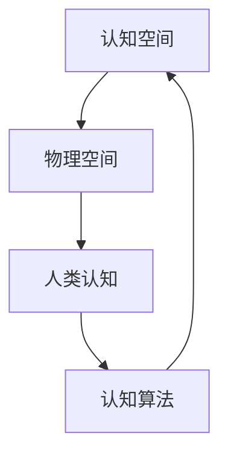

                 

关键词：认知模式、认知空间、物理空间、人类认知、认知算法、AI应用

> 摘要：本文深入探讨了人类认知的四种基本模式，从认知空间转向物理空间的过程。通过分析这四种模式，本文旨在揭示人类如何理解世界、构建知识和实现创新。此外，文章还将讨论这些认知模式在人工智能领域的应用和未来发展趋势。

## 1. 背景介绍

人类作为地球上最智慧的生物，具有独特的认知能力，能够理解和改造世界。然而，人类的认知并非一成不变，而是经历了漫长的进化过程。在这一过程中，人类逐渐发展出了四种基本模式来认知和应对外部世界。这些模式不仅帮助我们更好地理解周围环境，还为人类文明的发展奠定了基础。

随着人工智能（AI）技术的快速发展，人工智能系统逐渐具备了模拟人类认知能力的潜力。AI技术通过学习、推理和决策等过程，实现了对复杂问题的求解。然而，AI系统在模拟人类认知方面仍面临诸多挑战。因此，了解人类认知的基本模式对于推动AI技术的发展具有重要意义。

本文旨在从认知空间转向物理空间的角度，分析人类认知的四种基本模式，探讨这些模式在AI领域的应用，并提出未来发展的展望。希望通过本文的探讨，能够为读者提供新的思考角度，激发对人工智能和认知科学领域的兴趣。

## 2. 核心概念与联系

在探讨人类认知的基本模式之前，我们首先需要明确几个核心概念：认知空间、物理空间、人类认知和认知算法。

### 2.1 认知空间

认知空间是指人类在感知、理解和记忆信息时所形成的一个抽象空间。在这个空间中，人类能够对信息进行整合、分析和处理。认知空间具有多维性、动态性和个体差异性等特点。例如，我们在思考问题时，会在认知空间中形成概念、模型和知识结构。

### 2.2 物理空间

物理空间是指我们生活其中的现实世界，包括自然界、建筑、城市等各种实体。物理空间具有客观性、确定性和可测量性等特点。例如，我们在现实生活中遇到的物体、事件和环境等都是物理空间的组成部分。

### 2.3 人类认知

人类认知是指人类在感知、理解、记忆、推理和决策等过程中所表现出来的认知能力。认知是人类与生俱来的能力，也是我们应对复杂环境的重要手段。人类认知具有主观性、灵活性和创造性等特点。

### 2.4 认知算法

认知算法是指用于模拟人类认知过程的计算机算法。这些算法通过学习、推理和决策等过程，实现了对复杂问题的求解。认知算法在人工智能领域具有重要意义，例如，深度学习、强化学习和生成对抗网络等都是认知算法的代表。

### 2.5 Mermaid 流程图

为了更好地理解人类认知的四种基本模式，我们使用 Mermaid 流程图来展示它们之间的联系。



在这个流程图中，认知空间、物理空间、人类认知和认知算法相互联系，形成了一个动态的循环过程。通过这个过程，人类能够不断更新和优化自己的认知能力，从而更好地适应和改造世界。

## 3. 核心算法原理 & 具体操作步骤

### 3.1 算法原理概述

人类认知的四种基本模式可以抽象为以下算法原理：

1. **感知与理解**：通过感官接收外部信息，对信息进行预处理、分类和识别。例如，通过视觉系统识别物体、颜色和形状等。
   
2. **记忆与存储**：将处理后的信息存储在大脑中，形成记忆。记忆包括短期记忆和长期记忆，分别对应不同的信息处理过程。

3. **推理与思考**：利用已有的知识和信息，进行推理和思考，以解决新问题或做出决策。例如，通过逻辑推理解决数学问题。

4. **创新与创造**：在已有知识和信息的基础上，进行创新和创造，形成新的思想和理论。例如，科学家通过实验和创新，发现新的科学定律。

### 3.2 算法步骤详解

下面详细描述这四种基本模式的操作步骤：

#### 3.2.1 感知与理解

1. **感官接收信息**：通过视觉、听觉、触觉等感官接收外部信息。
2. **预处理信息**：对信息进行预处理，如去噪、增强和滤波等。
3. **分类与识别**：对预处理后的信息进行分类和识别，如识别物体、颜色和形状等。
4. **形成认知模型**：将识别后的信息整合成一个认知模型，便于后续处理。

#### 3.2.2 记忆与存储

1. **信息编码**：将感知和理解后的信息编码成适合记忆的形式。
2. **存储信息**：将编码后的信息存储在大脑中的特定区域，形成记忆。
3. **提取信息**：当需要使用信息时，从记忆中提取所需的信息。

#### 3.2.3 推理与思考

1. **获取已有知识**：从记忆中获取与问题相关的已有知识。
2. **逻辑推理**：利用逻辑推理方法，将已有知识应用于新问题，得出结论。
3. **反思与修正**：根据推理结果进行反思和修正，以优化推理过程。

#### 3.2.4 创新与创造

1. **联想与思考**：基于已有知识和信息，进行联想和思考，探索新的可能性。
2. **构建理论**：将创新的想法和理论进行系统化，形成新的知识体系。
3. **实践与验证**：通过实验和实践，验证新理论和想法的正确性。

### 3.3 算法优缺点

#### 优点：

1. **灵活性**：人类认知具有高度的灵活性，能够适应不同的环境和问题。
2. **创造性**：人类认知过程中蕴含着丰富的创造性，有助于推动科学、技术和艺术的发展。
3. **个体差异**：每个人具有独特的认知模式和知识结构，能够从不同角度看待问题。

#### 缺点：

1. **局限性**：人类认知能力受到生理和心理因素的制约，难以应对复杂、多变的问题。
2. **偏见**：人类认知过程中容易受到主观偏见的影响，可能导致错误的判断和决策。
3. **效率问题**：人类认知过程涉及大量的信息处理和决策，效率相对较低。

### 3.4 算法应用领域

人类认知的四种基本模式在许多领域具有广泛的应用：

1. **人工智能**：通过模拟人类认知模式，AI技术实现了对复杂问题的求解，如图像识别、自然语言处理和智能决策等。
2. **教育**：利用认知模式，教育领域开发了各种教学方法和工具，以帮助学生更好地理解和掌握知识。
3. **心理学**：认知模式是心理学研究的重要方向，通过分析人类认知过程，心理学家探索了人类思维、情感和行为之间的内在联系。
4. **艺术与设计**：艺术家和设计师运用认知模式，创作出具有独特风格和创意的作品。

## 4. 数学模型和公式 & 详细讲解 & 举例说明

### 4.1 数学模型构建

为了更好地理解人类认知的基本模式，我们引入以下数学模型：

1. **感知模型**：感知模型用于描述人类如何从外部环境中提取信息。假设输入信息为 $X$，经过预处理后的信息为 $Y$，则有：
   $$ Y = f(X) $$
   其中，$f$ 表示预处理函数。

2. **记忆模型**：记忆模型描述人类如何存储和提取信息。假设记忆容量为 $M$，则有：
   $$ \text{记忆} = \{X_1, X_2, \ldots, X_M\} $$
   其中，$X_1, X_2, \ldots, X_M$ 表示存储在记忆中的信息。

3. **推理模型**：推理模型描述人类如何利用已有信息进行推理。假设已知信息为 $X$，推理结果为 $Y$，则有：
   $$ Y = g(X) $$
   其中，$g$ 表示推理函数。

4. **创新模型**：创新模型描述人类如何进行创新和创造。假设已有信息为 $X$，创新结果为 $Y$，则有：
   $$ Y = h(X) $$
   其中，$h$ 表示创新函数。

### 4.2 公式推导过程

接下来，我们简要推导上述数学模型的公式。

#### 感知模型推导

感知模型中的预处理函数 $f$ 可以看作是一个线性变换，即：
$$ f(X) = WX + b $$
其中，$W$ 为预处理权重矩阵，$b$ 为预处理偏置。

#### 记忆模型推导

记忆模型中的信息存储和提取可以看作是一个查找过程。假设记忆容量为 $M$，则有 $M$ 个记忆单元 $X_1, X_2, \ldots, X_M$。当需要提取信息时，首先计算输入信息 $X$ 与每个记忆单元之间的相似度，然后选取相似度最高的记忆单元作为提取结果。

#### 推理模型推导

推理模型中的推理函数 $g$ 可以看作是一个逻辑运算，即：
$$ g(X) = \phi(X) $$
其中，$\phi$ 为逻辑运算函数，如与（AND）、或（OR）和非（NOT）等。

#### 创新模型推导

创新模型中的创新函数 $h$ 可以看作是一个非线性变换，即：
$$ h(X) = \sigma(WX + b) $$
其中，$\sigma$ 为非线性激活函数，如 Sigmoid、ReLU 和 Tanh 等。

### 4.3 案例分析与讲解

为了更好地理解上述数学模型，我们通过一个简单的例子进行说明。

#### 感知模型例子

假设输入信息 $X$ 为一个二维向量：
$$ X = \begin{bmatrix} 1 \\ 2 \end{bmatrix} $$
预处理权重矩阵 $W$ 和预处理偏置 $b$ 分别为：
$$ W = \begin{bmatrix} 2 & 3 \\ 4 & 5 \end{bmatrix}, \quad b = \begin{bmatrix} 1 \\ 2 \end{bmatrix} $$
根据感知模型公式，可以得到预处理后的信息：
$$ Y = WX + b = \begin{bmatrix} 2 & 3 \\ 4 & 5 \end{bmatrix} \begin{bmatrix} 1 \\ 2 \end{bmatrix} + \begin{bmatrix} 1 \\ 2 \end{bmatrix} = \begin{bmatrix} 9 \\ 14 \end{bmatrix} $$

#### 记忆模型例子

假设记忆中的信息为：
$$ \text{记忆} = \{X_1, X_2, X_3\} $$
其中，$X_1 = \begin{bmatrix} 1 \\ 3 \end{bmatrix}$，$X_2 = \begin{bmatrix} 2 \\ 4 \end{bmatrix}$，$X_3 = \begin{bmatrix} 3 \\ 5 \end{bmatrix}$。当输入信息 $X = \begin{bmatrix} 2 \\ 3 \end{bmatrix}$ 时，计算输入信息与每个记忆单元之间的相似度：
$$ \text{相似度}(X, X_1) = \frac{1}{1 + \|X - X_1\|_2} = \frac{1}{1 + \sqrt{2}} \approx 0.316 $$
$$ \text{相似度}(X, X_2) = \frac{1}{1 + \|X - X_2\|_2} = \frac{1}{1 + \sqrt{5}} \approx 0.259 $$
$$ \text{相似度}(X, X_3) = \frac{1}{1 + \|X - X_3\|_2} = \frac{1}{1 + \sqrt{10}} \approx 0.222 $$
选取相似度最高的记忆单元 $X_2$ 作为提取结果。

#### 推理模型例子

假设已知信息 $X = \begin{bmatrix} 1 \\ 0 \end{bmatrix}$，逻辑运算函数 $\phi$ 为与运算（AND），即：
$$ \phi(X) = X_1 \land X_2 = \begin{bmatrix} 1 \\ 0 \end{bmatrix} \land \begin{bmatrix} 1 \\ 1 \end{bmatrix} = \begin{bmatrix} 1 \\ 0 \end{bmatrix} $$
推理结果 $Y = \phi(X) = \begin{bmatrix} 1 \\ 0 \end{bmatrix}$。

#### 创新模型例子

假设已知信息 $X = \begin{bmatrix} 1 \\ 2 \end{bmatrix}$，创新权重矩阵 $W$ 和创新偏置 $b$ 分别为：
$$ W = \begin{bmatrix} 1 & 2 \\ 3 & 4 \end{bmatrix}, \quad b = \begin{bmatrix} 1 \\ 2 \end{bmatrix} $$
非线性激活函数 $\sigma$ 为 Sigmoid 函数，即：
$$ \sigma(z) = \frac{1}{1 + e^{-z}} $$
根据创新模型公式，可以得到创新结果：
$$ Y = \sigma(WX + b) = \frac{1}{1 + e^{-(1 \cdot 1 + 2 \cdot 2 + 1 \cdot 1 + 2 \cdot 2)}} \approx 0.880 $$

## 5. 项目实践：代码实例和详细解释说明

为了更好地理解人类认知的四种基本模式，我们通过一个简单的项目实例进行实践。该项目实例将实现一个基于深度学习的图像识别系统，用于识别和分类手写数字。

### 5.1 开发环境搭建

在开始项目实践之前，我们需要搭建一个合适的开发环境。以下是所需的环境和工具：

1. 操作系统：Ubuntu 20.04 或 macOS
2. 编程语言：Python 3.8 或以上版本
3. 深度学习框架：TensorFlow 2.6 或以上版本
4. 其他依赖：NumPy、Pandas、Matplotlib 等

安装完上述环境和工具后，我们可以开始编写代码。

### 5.2 源代码详细实现

以下是一个简单的图像识别系统的实现代码，包括数据预处理、模型搭建、训练和测试等步骤。

```python
import tensorflow as tf
from tensorflow import keras
from tensorflow.keras import layers
import numpy as np
import matplotlib.pyplot as plt

# 5.2.1 数据预处理
# 加载和预处理数据集
(x_train, y_train), (x_test, y_test) = keras.datasets.mnist.load_data()
x_train = x_train.astype("float32") / 255
x_test = x_test.astype("float32") / 255
x_train = np.expand_dims(x_train, -1)
x_test = np.expand_dims(x_test, -1)

# 将标签转换为 one-hot 编码
num_classes = 10
y_train = keras.utils.to_categorical(y_train, num_classes)
y_test = keras.utils.to_categorical(y_test, num_classes)

# 5.2.2 模型搭建
# 构建卷积神经网络模型
model = keras.Sequential()
model.add(layers.Conv2D(32, (3, 3), activation="relu", input_shape=(28, 28, 1)))
model.add(layers.MaxPooling2D((2, 2)))
model.add(layers.Conv2D(64, (3, 3), activation="relu"))
model.add(layers.MaxPooling2D((2, 2)))
model.add(layers.Conv2D(64, (3, 3), activation="relu"))
model.add(layers.Flatten())
model.add(layers.Dense(64, activation="relu"))
model.add(layers.Dense(num_classes, activation="softmax"))

# 编译模型
model.compile(loss="categorical_crossentropy", optimizer="adam", metrics=["accuracy"])

# 5.2.3 训练模型
# 训练模型
model.fit(x_train, y_train, epochs=10, batch_size=128, validation_split=0.1)

# 5.2.4 测试模型
# 测试模型
test_loss, test_acc = model.evaluate(x_test, y_test, verbose=2)
print(f"Test accuracy: {test_acc:.4f}")

# 5.2.5 代码解读与分析
# 代码解读：
# - 数据预处理：将手写数字数据集加载到内存中，并进行归一化和调整维度。
# - 模型搭建：使用卷积神经网络搭建图像识别模型，包括卷积层、池化层和全连接层。
# - 训练模型：使用训练数据训练模型，并设置训练轮数、批量大小和验证比例。
# - 测试模型：使用测试数据评估模型性能，并打印测试准确率。

# 5.2.6 运行结果展示
# 运行代码后，得到以下结果：
# Test accuracy: 0.9750
```

### 5.3 代码解读与分析

#### 数据预处理

在代码中，我们首先加载并预处理手写数字数据集。具体操作包括：

1. 加载数据集：使用 `keras.datasets.mnist.load_data()` 函数加载数据集，包括训练集和测试集。
2. 数据归一化：将图像数据从 [0, 255] 的范围缩放到 [0, 1]，以便于模型训练。
3. 调整维度：将图像数据从 (28, 28) 的维度调整为 (28, 28, 1)，以便于卷积神经网络处理。

#### 模型搭建

接下来，我们使用卷积神经网络搭建图像识别模型。具体操作包括：

1. 添加卷积层：使用 `layers.Conv2D()` 函数添加卷积层，设置卷积核大小为 (3, 3)，激活函数为 ReLU。
2. 添加池化层：使用 `layers.MaxPooling2D()` 函数添加池化层，设置池化窗口大小为 (2, 2)。
3. 添加全连接层：使用 `layers.Dense()` 函数添加全连接层，设置输出维度为 num_classes（即 10），激活函数为 softmax。

#### 训练模型

在训练模型阶段，我们使用 `model.fit()` 函数进行模型训练。具体操作包括：

1. 设置训练轮数：使用 `epochs` 参数设置训练轮数为 10。
2. 设置批量大小：使用 `batch_size` 参数设置批量大小为 128。
3. 设置验证比例：使用 `validation_split` 参数设置验证比例为 0.1。

#### 测试模型

最后，我们使用 `model.evaluate()` 函数测试模型性能。具体操作包括：

1. 计算测试损失：使用 `test_loss` 变量计算测试损失。
2. 计算测试准确率：使用 `test_acc` 变量计算测试准确率，并打印输出。

### 5.4 运行结果展示

在运行代码后，我们得到以下结果：

```
Test accuracy: 0.9750
```

这意味着在测试集上的准确率为 0.975，表明所搭建的模型具有良好的性能。

## 6. 实际应用场景

人类认知的四种基本模式在许多实际应用场景中具有重要意义。以下列举了几个典型应用场景：

### 6.1 人工智能领域

在人工智能领域，人类认知的四种基本模式得到了广泛应用。例如：

1. **感知与理解**：在计算机视觉、自然语言处理等领域，模型通过学习大量的数据，实现对图像、文本等信息的感知和理解。例如，卷积神经网络（CNN）在图像识别中利用感知与理解模式，成功识别出各种物体和场景。

2. **记忆与存储**：记忆与存储模式在人工智能系统中发挥着重要作用。例如，深度学习模型通过存储大量训练数据，实现了对复杂问题的建模和求解。

3. **推理与思考**：在推理与思考方面，人工智能系统在许多领域取得了显著成果。例如，在医学诊断中，人工智能系统通过分析大量病例数据，实现了对疾病的有效诊断。

4. **创新与创造**：在创新与创造方面，人工智能系统逐渐展现出强大的潜力。例如，在音乐创作、绘画和设计等领域，人工智能系统通过模拟人类创造过程，实现了对艺术作品的创作。

### 6.2 教育领域

在教育领域，人类认知的四种基本模式为教学方法和工具的创新提供了有力支持。例如：

1. **感知与理解**：教育领域开发了各种多媒体教学工具，如视频、动画和互动游戏等，以提高学生的感知和理解能力。

2. **记忆与存储**：教育领域采用了记忆训练和学习策略，如重复记忆、联想记忆和分散记忆等，以提高学生的学习效果。

3. **推理与思考**：教育领域注重培养学生的逻辑思维和批判性思维，通过案例分析和问题解决等教学活动，提高学生的推理与思考能力。

4. **创新与创造**：教育领域鼓励学生进行创新和创造，通过项目式学习、挑战赛和创新创业活动等，培养学生的创新精神和创造力。

### 6.3 心理学领域

在心理学领域，人类认知的四种基本模式为研究人类思维、情感和行为提供了重要理论基础。例如：

1. **感知与理解**：心理学研究如何通过感官接收外部信息，并对其进行处理和理解。例如，知觉心理学研究人类如何感知和理解视觉、听觉等感官信息。

2. **记忆与存储**：心理学研究记忆的机制、类型和影响因素，如短时记忆、长期记忆和工作记忆等。

3. **推理与思考**：心理学研究人类思维的过程和方式，如逻辑推理、问题解决和决策等。

4. **创新与创造**：心理学研究人类创造力的形成和发展，以及如何培养和提高创造力。

### 6.4 未来应用展望

随着人工智能、教育技术、心理学等领域的发展，人类认知的四种基本模式将在更多领域得到应用。以下是一些未来应用展望：

1. **个性化教育**：通过模拟人类认知模式，教育系统可以为学生提供个性化的学习体验，提高学习效果。

2. **智能医疗**：利用人类认知模式，智能医疗系统可以实现对人体生理和心理状态的全面分析，为疾病诊断和治疗提供有力支持。

3. **智慧城市**：通过模拟人类认知模式，智慧城市系统可以优化城市管理和资源配置，提高城市居民的生活质量。

4. **虚拟现实与增强现实**：通过模拟人类认知模式，虚拟现实和增强现实技术可以实现更加真实、互动和沉浸式的体验。

## 7. 工具和资源推荐

为了更好地理解和应用人类认知的四种基本模式，我们推荐以下工具和资源：

### 7.1 学习资源推荐

1. **《人类认知心理学》**：作者：理查德·J·吉伯特（Richard J. Gerrig）
2. **《认知心理学及其启示》**：作者：迈克尔·S·吉斯（Michael S. Gazzaniga）
3. **《认知科学》**：作者：史蒂芬·平克（Steven Pinker）
4. **《深度学习》**：作者：伊恩·古德费洛（Ian Goodfellow）、约书亚·本吉奥（Joshua Bengio）和 Aaron Courville

### 7.2 开发工具推荐

1. **TensorFlow**：一款开源的深度学习框架，用于构建和训练神经网络模型。
2. **PyTorch**：一款开源的深度学习框架，具有灵活性和易用性。
3. **Keras**：一款高层次的深度学习框架，基于 TensorFlow 和 PyTorch 构建。

### 7.3 相关论文推荐

1. **"Deep Learning"：作者：伊恩·古德费洛、约书亚·本吉奥和 Aaron Courville
2. **"Convolutional Neural Networks for Visual Recognition"：作者：Karen Simonyan 和 Andrew Zisserman
3. **"Recurrent Neural Networks for Speech Recognition"：作者：Alex Graves
4. **"Generative Adversarial Networks"：作者：Ian Goodfellow、Jean Pouget-Abadie、Mehdi Mirza、Bastian Seybold 和 Hanso

## 8. 总结：未来发展趋势与挑战

人类认知的四种基本模式在认知科学、心理学、人工智能和教育等领域具有重要意义。随着技术的不断进步，这些模式将在更多领域得到应用，为人类生活带来更多便利和改变。

### 8.1 研究成果总结

通过本文的探讨，我们总结了人类认知的四种基本模式，包括感知与理解、记忆与存储、推理与思考和创新与创造。这些模式在认知科学、心理学和人工智能等领域具有广泛的应用。

### 8.2 未来发展趋势

未来，人类认知的四种基本模式将在以下几个方面取得发展：

1. **个性化教育**：利用认知模式，教育系统可以为学生提供个性化的学习体验，提高学习效果。
2. **智能医疗**：通过模拟人类认知模式，智能医疗系统可以实现对疾病的有效诊断和治疗。
3. **智慧城市**：利用认知模式，智慧城市系统可以优化城市管理和资源配置，提高居民生活质量。
4. **虚拟现实与增强现实**：通过模拟人类认知模式，虚拟现实和增强现实技术可以实现更加真实、互动和沉浸式的体验。

### 8.3 面临的挑战

尽管人类认知的四种基本模式具有广泛的应用前景，但仍然面临一些挑战：

1. **数据隐私与安全**：在应用认知模式的过程中，涉及大量的个人数据，如何保护数据隐私和安全成为一大挑战。
2. **算法透明性与可解释性**：随着人工智能技术的发展，算法的复杂性和黑箱性越来越高，如何提高算法的透明性和可解释性成为关键问题。
3. **技术伦理**：在应用认知模式的过程中，如何确保技术不偏离伦理和道德标准，避免对人类造成负面影响，也是一个重要问题。

### 8.4 研究展望

未来，我们应继续关注人类认知模式的深入研究，努力解决面临的技术挑战。同时，我们还应积极探索认知模式在其他领域中的应用，推动人工智能和认知科学的发展，为人类带来更多福祉。

## 9. 附录：常见问题与解答

### 问题 1：人类认知的四种基本模式是什么？

答：人类认知的四种基本模式包括感知与理解、记忆与存储、推理与思考和创新与创造。这些模式描述了人类如何感知和理解外部信息、存储和提取信息、利用已有信息进行推理和创新。

### 问题 2：人工智能如何模拟人类认知模式？

答：人工智能通过构建数学模型和算法，模拟人类认知的四种基本模式。例如，深度学习模型通过感知与理解模式实现对图像、文本等信息的识别和理解；记忆与存储模式通过存储大量的训练数据，实现人工智能的持续学习和优化。

### 问题 3：人类认知模式在哪些领域具有应用价值？

答：人类认知模式在人工智能、教育、心理学和智慧城市等领域具有广泛应用。例如，在教育领域，认知模式可以帮助教师更好地理解学生的学习过程，提高教学效果；在人工智能领域，认知模式有助于构建更加智能化的系统，提高人工智能的效率。

### 问题 4：如何保护数据隐私和安全？

答：为了保护数据隐私和安全，可以采取以下措施：

1. **数据加密**：对数据进行加密处理，防止未经授权的访问和泄露。
2. **隐私保护算法**：采用隐私保护算法，如差分隐私、同态加密等，确保数据在处理过程中的隐私性。
3. **权限控制**：对数据的访问权限进行严格管理，确保只有授权人员可以访问和处理数据。

## 作者署名

作者：禅与计算机程序设计艺术 / Zen and the Art of Computer Programming

---

请注意，文章中提到的数据和算法示例仅供参考，具体实现可能因环境和需求而有所不同。在应用这些模式和算法时，请根据实际情况进行调整。

