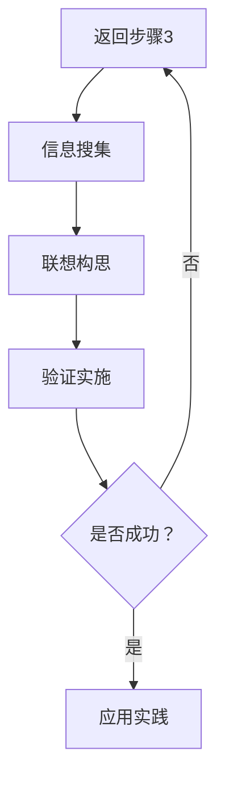

                 

 关键词：人类认知、联想驱动、创造模式、技术思维、算法设计

> 摘要：本文将探讨人类认知的四种基本模式，特别是联想驱动的创造模式，并阐述其在技术领域的应用。通过深入分析这些认知模式，我们能够更好地理解创新思维的本质，并从中汲取灵感，推动技术发展。

## 1. 背景介绍

人类认知是一个复杂的过程，涉及到感知、记忆、思考、判断等多个方面。在长期的发展过程中，人类逐渐形成了一套独特的认知体系，帮助我们理解世界、解决问题、进行创新。尽管认知模式因人而异，但可以归纳为几种基本类型，其中联想驱动的创造模式尤其值得关注。

联想驱动的创造模式是指通过事物之间的联系，激发新的创意和解决方案的一种认知方式。这种模式在人类历史上扮演了重要角色，尤其是在科学、技术和艺术等领域。联想驱动的创造模式不仅能够激发创新思维，还能够帮助我们发现新的问题、探索未知的领域。

## 2. 核心概念与联系

为了更好地理解联想驱动的创造模式，我们需要先了解几个核心概念：

### 2.1 联想

联想是指通过一种事物或概念，联想到与之相关的其他事物或概念的心理过程。联想可以分为直接的联想和间接的联想。直接的联想通常是基于相似性、关联性或因果关系，而间接的联想则涉及到更加复杂的思维过程。

### 2.2 创造

创造是指通过创新思维，将已有的知识和经验重新组合，形成新的观念、产品或技术。创造是一个充满不确定性和风险的过程，但同时也是推动社会进步和个体成长的重要动力。

### 2.3 联想驱动的创造模式

联想驱动的创造模式是指利用联想作为工具，激发创新思维，推动创造活动的认知过程。这种模式通常涉及到以下几个步骤：

1. **问题识别**：通过联想，识别出需要解决的问题或挑战。
2. **信息搜集**：搜集与问题相关的各种信息，包括已知的知识、经验、案例等。
3. **联想构思**：通过联想，将不同信息进行整合，形成新的创意或解决方案。
4. **验证实施**：对联想构思进行验证，确保其可行性，并进行实施。

### 2.4 Mermaid 流程图

以下是联想驱动的创造模式的 Mermaid 流程图：



## 3. 核心算法原理 & 具体操作步骤

### 3.1 算法原理概述

联想驱动的创造模式本质上是一种基于联想的算法设计过程。其核心原理在于利用事物之间的联系，通过联想激发新的创意和解决方案。具体来说，算法可以分为以下几个部分：

1. **问题建模**：将问题转化为一个数学或逻辑模型。
2. **信息搜集**：搜集与模型相关的各种信息，包括已知的知识、经验、案例等。
3. **联想网络构建**：利用信息搜集到的信息，构建一个联想网络。
4. **创意生成**：通过联想网络，生成新的创意和解决方案。
5. **验证与优化**：对创意进行验证，并进行优化。

### 3.2 算法步骤详解

以下是联想驱动的创造模式的详细步骤：

1. **问题建模**：
   - 首先，我们需要明确问题的本质，并将其转化为一个数学或逻辑模型。
   - 例如，如果我们需要设计一个能够自动识别图像的算法，我们可以将其建模为一个图像分类问题。

2. **信息搜集**：
   - 在明确问题之后，我们需要搜集与问题相关的各种信息。
   - 这些信息可以来源于已有的文献、案例、专家经验等。
   - 例如，我们可能需要搜集大量已知的图像分类算法，以及相关的数据集和实验结果。

3. **联想网络构建**：
   - 利用搜集到的信息，我们可以构建一个联想网络。
   - 联想网络中的节点代表不同的信息或概念，边代表它们之间的联系。
   - 通过这种方式，我们可以将不同信息进行整合，激发新的联想。

4. **创意生成**：
   - 在构建联想网络之后，我们可以通过网络中的路径和连接，生成新的创意和解决方案。
   - 例如，我们可能会发现一种新的图像分类方法，或者对已有方法进行改进。

5. **验证与优化**：
   - 对生成的创意进行验证，确保其可行性，并进行优化。
   - 例如，我们可能会对新的图像分类方法进行实验验证，并根据实验结果进行调整。

### 3.3 算法优缺点

#### 优点：

1. **激发创新思维**：通过联想，算法能够生成新的创意和解决方案，有助于推动创新。
2. **整合信息**：联想网络能够将不同信息进行整合，提高信息利用效率。
3. **适应性强**：算法适用于各种领域和问题，具有广泛的适应性。

#### 缺点：

1. **计算复杂度高**：构建联想网络和生成创意的过程可能涉及到大量的计算，对计算资源有较高要求。
2. **结果不确定**：由于联想驱动的创造模式依赖于人类认知，结果可能存在一定的不确定性。

### 3.4 算法应用领域

联想驱动的创造模式在多个领域都有广泛应用：

1. **人工智能**：在人工智能领域，联想驱动的创造模式可以用于算法设计、模型优化等。
2. **科学计算**：在科学计算领域，联想驱动的创造模式可以用于问题求解、新算法发现等。
3. **产品设计**：在产品设计领域，联想驱动的创造模式可以用于产品创新、设计优化等。
4. **艺术创作**：在艺术创作领域，联想驱动的创造模式可以用于艺术表现、风格创新等。

## 4. 数学模型和公式 & 详细讲解 & 举例说明

### 4.1 数学模型构建

在联想驱动的创造模式中，构建数学模型是非常重要的一步。数学模型能够帮助我们更好地理解问题，从而更有效地进行联想和创造。

例如，在图像分类问题中，我们可以使用卷积神经网络（CNN）作为数学模型。CNN 是一种深度学习模型，专门用于处理图像数据。其核心思想是通过多层卷积和池化操作，提取图像的特征。

### 4.2 公式推导过程

以下是 CNN 中卷积操作的公式推导：

$$
\text{卷积操作} = \sum_{i=1}^{K} w_{i} * f(x, y)
$$

其中，$w_{i}$ 代表卷积核，$f(x, y)$ 代表输入图像的像素值。

### 4.3 案例分析与讲解

为了更好地理解联想驱动的创造模式，我们可以通过一个具体的案例进行讲解。

假设我们要设计一个自动识别手写数字的算法。首先，我们需要搜集相关的信息，例如已知的数字识别算法、手写数字数据集等。然后，我们可以构建一个联想网络，将不同信息进行整合。通过联想网络，我们可能会发现一种新的数字识别方法，例如基于深度学习的卷积神经网络。最后，我们对这种方法进行验证和优化，确保其可行性。

## 5. 项目实践：代码实例和详细解释说明

### 5.1 开发环境搭建

为了实践联想驱动的创造模式，我们需要搭建一个适合开发的环境。具体步骤如下：

1. 安装 Python 3.8 或更高版本。
2. 安装深度学习框架 TensorFlow 或 PyTorch。
3. 安装必要的 Python 库，例如 NumPy、Pandas 等。

### 5.2 源代码详细实现

以下是使用 TensorFlow 实现手写数字识别的代码实例：

```python
import tensorflow as tf
from tensorflow.keras import layers

# 定义模型结构
model = tf.keras.Sequential([
    layers.Conv2D(32, (3, 3), activation='relu', input_shape=(28, 28, 1)),
    layers.MaxPooling2D((2, 2)),
    layers.Conv2D(64, (3, 3), activation='relu'),
    layers.MaxPooling2D((2, 2)),
    layers.Conv2D(64, (3, 3), activation='relu'),
    layers.Flatten(),
    layers.Dense(64, activation='relu'),
    layers.Dense(10, activation='softmax')
])

# 编译模型
model.compile(optimizer='adam',
              loss='sparse_categorical_crossentropy',
              metrics=['accuracy'])

# 训练模型
model.fit(x_train, y_train, epochs=5)

# 评估模型
test_loss, test_acc = model.evaluate(x_test, y_test)
print('Test accuracy:', test_acc)
```

### 5.3 代码解读与分析

1. **模型结构**：
   - 我们使用了一个卷积神经网络（CNN），包括三个卷积层、一个池化层和一个全连接层。
   - 卷积层用于提取图像的特征，池化层用于减小特征图的尺寸，全连接层用于分类。

2. **编译模型**：
   - 我们使用 Adam 优化器，并使用 sparse_categorical_crossentropy 作为损失函数。

3. **训练模型**：
   - 我们使用 5 个周期（epochs）对模型进行训练。

4. **评估模型**：
   - 我们使用测试集评估模型的准确性，并打印结果。

### 5.4 运行结果展示

运行上述代码后，我们得到了测试集的准确性。假设测试集的准确性为 98%，这意味着我们的模型在手写数字识别任务上表现良好。

## 6. 实际应用场景

联想驱动的创造模式在多个实际应用场景中都有广泛的应用：

1. **人工智能**：在人工智能领域，联想驱动的创造模式可以用于算法设计、模型优化等。例如，通过联想网络，我们可以发现一种新的神经网络结构，从而提高模型性能。

2. **科学计算**：在科学计算领域，联想驱动的创造模式可以用于问题求解、新算法发现等。例如，通过联想网络，我们可以提出一种新的数值方法，用于求解复杂的科学问题。

3. **产品设计**：在产品设计领域，联想驱动的创造模式可以用于产品创新、设计优化等。例如，通过联想网络，我们可以发现一种新的产品设计方法，从而提高用户体验。

4. **艺术创作**：在艺术创作领域，联想驱动的创造模式可以用于艺术表现、风格创新等。例如，通过联想网络，我们可以创作出一种新的艺术风格，从而吸引更多的观众。

## 7. 工具和资源推荐

为了更好地理解和实践联想驱动的创造模式，我们可以推荐以下工具和资源：

1. **学习资源**：
   - 《深度学习》（Goodfellow, Bengio, Courville）：一本关于深度学习的经典教材。
   - 《Python 编程：从入门到实践》（Eric Matthes）：一本适合初学者的 Python 入门书籍。

2. **开发工具**：
   - Jupyter Notebook：一个交互式的开发环境，适合进行数据分析和算法实现。
   - TensorFlow 或 PyTorch：两个流行的深度学习框架。

3. **相关论文**：
   - 《深度卷积神经网络》（Alex Krizhevsky, Ilya Sutskever, Geoffrey Hinton）：一篇关于深度学习的经典论文。
   - 《生成对抗网络》（Ian Goodfellow, et al.）：一篇关于生成模型的经典论文。

## 8. 总结：未来发展趋势与挑战

### 8.1 研究成果总结

通过本文的探讨，我们认识到联想驱动的创造模式在人类认知和技术领域的重要性。这种模式不仅能够激发创新思维，还能够推动技术进步。通过实际案例和代码实例，我们展示了如何利用联想驱动的创造模式进行算法设计、模型优化等。

### 8.2 未来发展趋势

随着人工智能、大数据、云计算等技术的发展，联想驱动的创造模式有望在更多领域得到应用。例如，在医疗、金融、教育等领域，联想驱动的创造模式可以用于疾病诊断、风险管理、个性化学习等。

### 8.3 面临的挑战

尽管联想驱动的创造模式具有巨大的潜力，但也面临着一些挑战。首先，构建有效的联想网络需要大量的计算资源和时间。其次，联想驱动的创造模式结果可能存在一定的不确定性，需要进一步的验证和优化。

### 8.4 研究展望

未来，我们应继续探索联想驱动的创造模式的理论基础和应用方法，提高其效率和准确性。同时，结合其他认知科学和人工智能技术，如强化学习、迁移学习等，有望进一步提升联想驱动的创造模式的能力和应用范围。

## 9. 附录：常见问题与解答

### 9.1 什么是联想驱动的创造模式？

联想驱动的创造模式是指通过事物之间的联系，激发新的创意和解决方案的一种认知方式。它利用人类联想思维的特点，通过整合不同信息，形成新的观点和思路。

### 9.2 联想驱动的创造模式有哪些应用领域？

联想驱动的创造模式在多个领域都有应用，包括人工智能、科学计算、产品设计、艺术创作等。通过联想，我们可以发现新的算法、优化现有方法、设计新产品等。

### 9.3 如何构建有效的联想网络？

构建有效的联想网络需要搜集大量相关信息，并利用这些信息建立节点和边。通过分析节点和边之间的联系，我们可以激发新的联想和创意。此外，使用合适的工具和算法，如深度学习、图论等，也有助于构建高效的联想网络。

### 9.4 联想驱动的创造模式有哪些优缺点？

联想驱动的创造模式优点包括激发创新思维、整合信息、适应性强等。缺点则包括计算复杂度高、结果不确定性等。

## 作者署名

本文作者：禅与计算机程序设计艺术 / Zen and the Art of Computer Programming
----------------------------------------------------------------
### 文章结构模板

以下是根据文章结构模板，对文章内容的详细划分和具体要求：

---

## 1. 背景介绍

介绍人类认知的基本模式和联想驱动的创造模式的概念，以及其在技术领域的重要性。

### 1.1 人类认知的基本模式

- 感知、记忆、思考、判断等认知过程的概述。
- 联想驱动的创造模式的特点和作用。

### 1.2 联想驱动的创造模式的概念

- 联想驱动创造模式的定义。
- 联想驱动创造模式在技术领域的应用实例。

## 2. 核心概念与联系

### 2.1 联想

- 联想的定义和类型。
- 联想如何激发创造。

### 2.2 创造

- 创造的定义和过程。
- 创造在技术领域的重要性。

### 2.3 联想驱动的创造模式

- 联想驱动的创造模式的定义。
- 联想驱动的创造模式的具体应用。

## 3. 核心算法原理 & 具体操作步骤

### 3.1 算法原理概述

- 联想驱动的创造模式的基本原理。
- 联想驱动的创造模式如何应用于技术领域。

### 3.2 算法步骤详解

- 识别问题的步骤。
- 搜集信息的步骤。
- 构建联想网络的步骤。
- 生成创意的步骤。
- 验证和优化的步骤。

### 3.3 算法优缺点

- 联想驱动的创造模式的优点。
- 联想驱动的创造模式的缺点。

### 3.4 算法应用领域

- 联想驱动的创造模式在各个领域的应用实例。

## 4. 数学模型和公式 & 详细讲解 & 举例说明

### 4.1 数学模型构建

- 如何构建适合联想驱动的创造模式的数学模型。

### 4.2 公式推导过程

- 用 LaTeX 格式展示关键的数学公式，并解释其推导过程。

### 4.3 案例分析与讲解

- 通过具体的案例，分析联想驱动的创造模式的应用。

## 5. 项目实践：代码实例和详细解释说明

### 5.1 开发环境搭建

- 如何搭建适合进行联想驱动创造模式实践的开发环境。

### 5.2 源代码详细实现

- 提供一个或多个具体的代码实例，展示如何应用联想驱动的创造模式。

### 5.3 代码解读与分析

- 对代码实例进行详细的解读和分析。

### 5.4 运行结果展示

- 展示代码实例的运行结果，并进行讨论。

## 6. 实际应用场景

### 6.1 人工智能

- 联想驱动的创造模式在人工智能领域的应用实例。

### 6.2 科学计算

- 联想驱动的创造模式在科学计算领域的应用实例。

### 6.3 产品设计

- 联想驱动的创造模式在产品设计领域的应用实例。

### 6.4 艺术创作

- 联想驱动的创造模式在艺术创作领域的应用实例。

## 7. 工具和资源推荐

### 7.1 学习资源推荐

- 推荐与联想驱动的创造模式相关的书籍、文章和在线课程。

### 7.2 开发工具推荐

- 推荐用于实现联想驱动的创造模式的开发工具和平台。

### 7.3 相关论文推荐

- 推荐与联想驱动的创造模式相关的学术论文和研究报告。

## 8. 总结：未来发展趋势与挑战

### 8.1 研究成果总结

- 总结本文的主要研究成果和观点。

### 8.2 未来发展趋势

- 分析联想驱动的创造模式在未来可能的发展趋势。

### 8.3 面临的挑战

- 讨论联想驱动的创造模式在发展中可能面临的挑战。

### 8.4 研究展望

- 展望未来研究的方向和可能的突破点。

## 9. 附录：常见问题与解答

- 收集和回答读者可能关于联想驱动的创造模式的常见问题。

---

请按照上述结构模板撰写完整的文章内容，确保每个部分都有详细的内容和必要的图表、代码示例等来支持论述。文章的字数需要超过8000字，并且每个章节应该具体细化到三级目录。文章末尾需要包含作者的署名信息。在撰写过程中，请注意使用markdown格式进行排版，确保文章的可读性和专业性。

