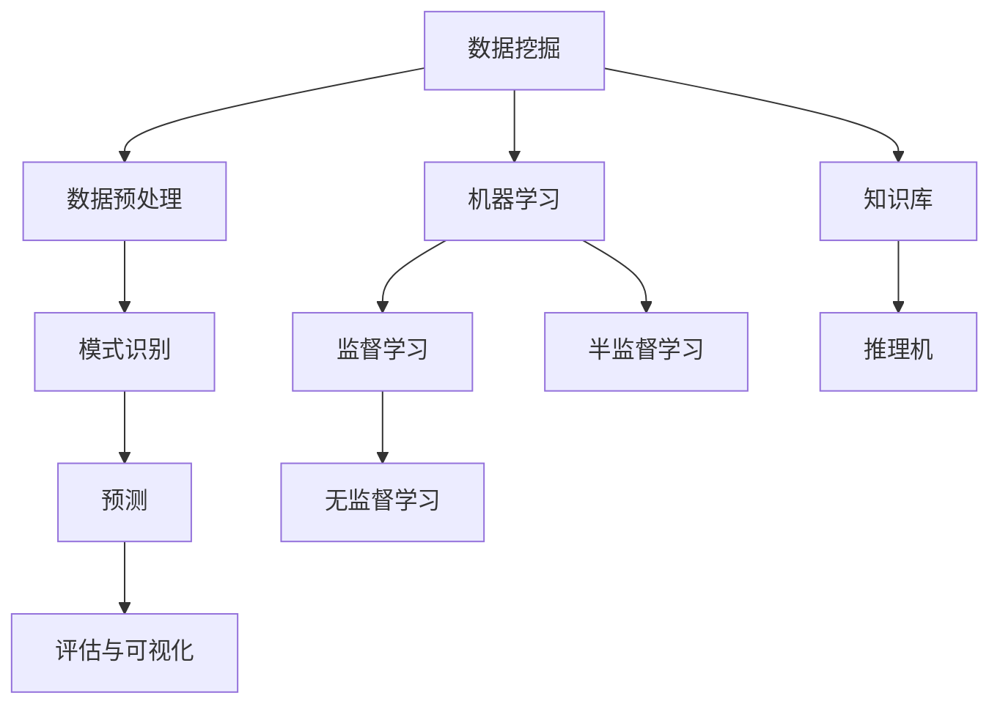

                 

关键词：知识发现、数据挖掘、机器学习、算法原理、项目实践、应用场景

> 摘要：本文旨在向初学者介绍知识发现引擎的构建过程。通过本文的引导，您将了解从零开始构建一个知识发现引擎所需的基本概念、算法原理和具体操作步骤。文章将涵盖知识发现的核心概念、算法设计、数学模型以及项目实践，并讨论其在各种实际应用场景中的前景和挑战。

## 1. 背景介绍

在当今信息爆炸的时代，如何从海量数据中提取有价值的信息成为了一个重要课题。知识发现（Knowledge Discovery in Databases，KDD）正是为了解决这一问题而诞生的一门交叉学科，它结合了统计学、机器学习、数据库和数据挖掘等多个领域。知识发现引擎作为实现知识发现的核心工具，承担了从数据预处理到模式识别、预测和可视化等一系列重要任务。

知识发现引擎的研究和开发，对于企业决策、科学研究、智能系统和众多其他领域都具有深远的影响。例如，在商业领域，知识发现引擎可以帮助企业分析销售数据，预测市场需求，优化库存管理；在医疗领域，它可以辅助医生进行疾病诊断，发现潜在的疾病风险因素；在科学研究领域，知识发现引擎能够帮助科学家从实验数据中挖掘出新的科学规律和现象。

本文的目标是为初学者提供构建知识发现引擎的详细指南，使读者能够掌握知识发现的基本概念，理解核心算法原理，并具备实际操作能力。通过本文的学习，读者可以独立完成一个简单的知识发现引擎的开发，从而为后续更深入的研究和应用打下坚实的基础。

## 2. 核心概念与联系

在构建知识发现引擎之前，我们需要了解几个核心概念和它们之间的联系。

### 2.1 数据挖掘

数据挖掘（Data Mining）是知识发现过程中的一个关键环节，它涉及到从大量数据中提取出有价值的信息或知识。数据挖掘通常包括以下几个步骤：

1. **数据预处理**：包括数据清洗、数据集成、数据转换等，目的是将原始数据转化为适合分析的形式。
2. **模式识别**：通过算法从数据中发现潜在的规律和模式。
3. **预测**：利用发现的模式进行预测，如预测未来的市场趋势或用户行为。
4. **评估与可视化**：对挖掘结果进行评估，并通过可视化手段展示给用户。

### 2.2 机器学习

机器学习（Machine Learning）是数据挖掘的重要工具之一，它通过训练模型来发现数据中的规律。机器学习可以分为监督学习、无监督学习和半监督学习：

1. **监督学习**：通过已标记的数据训练模型，然后使用模型对新数据进行预测。
2. **无监督学习**：在未标记的数据中寻找结构和模式，如聚类分析。
3. **半监督学习**：结合标记数据和未标记数据，以提高模型的性能。

### 2.3 知识库与推理机

知识库（Knowledge Base）是知识发现引擎的重要组成部分，它存储了从数据中提取的知识和规则。推理机（Reasoning Engine）则负责根据知识库中的知识和规则进行推理，以生成新的知识。

### 2.4 Mermaid 流程图

为了更好地理解这些核心概念之间的联系，我们可以使用 Mermaid 画出以下流程图：



图 2-1：知识发现引擎核心概念与联系流程图

## 3. 核心算法原理 & 具体操作步骤

### 3.1 算法原理概述

构建知识发现引擎的核心算法主要包括聚类算法、分类算法、关联规则挖掘算法等。这些算法的基本原理如下：

- **聚类算法**：将数据集划分为若干个簇，使得同一个簇中的数据点彼此相似，不同簇中的数据点彼此不同。
- **分类算法**：将数据集划分为预定义的类别，通过对已知类别的数据进行训练，构建分类模型，然后使用该模型对未知类别的新数据进行分类。
- **关联规则挖掘算法**：从数据集中挖掘出具有关联性的项集，如购物篮分析中的商品组合。

### 3.2 算法步骤详解

下面以 K-Means 聚类算法为例，介绍其具体操作步骤：

1. **初始化**：随机选择 K 个数据点作为初始聚类中心。
2. **分配数据点**：计算每个数据点到各个聚类中心的距离，将数据点分配到距离最近的聚类中心所在的簇。
3. **更新聚类中心**：计算每个簇的新聚类中心，通常取该簇中所有数据点的均值。
4. **迭代**：重复步骤 2 和步骤 3，直到聚类中心不再发生变化或达到预定的迭代次数。

### 3.3 算法优缺点

K-Means 算法的优点是简单易实现，收敛速度快。但缺点是对于初始聚类中心的敏感性较大，可能陷入局部最优解。

### 3.4 算法应用领域

K-Means 算法广泛应用于数据预处理、市场细分、社交网络分析等领域。例如，在社交媒体平台上，可以使用 K-Means 算法对用户进行聚类，从而实现用户分群和个性化推荐。

## 4. 数学模型和公式 & 详细讲解 & 举例说明

### 4.1 数学模型构建

K-Means 聚类算法的数学模型可以表示为：

$$
\text{Minimize} \sum_{i=1}^n \sum_{j=1}^k ||x_i - \mu_j||^2
$$

其中，\(x_i\) 是数据集中的第 \(i\) 个数据点，\(\mu_j\) 是第 \(j\) 个聚类中心，\(||\cdot||\) 表示欧几里得距离。

### 4.2 公式推导过程

为了推导 K-Means 算法的更新规则，我们可以考虑以下步骤：

1. **初始聚类中心的选择**：随机选择 \(K\) 个数据点作为初始聚类中心。
2. **数据点分配**：对于每个数据点 \(x_i\)，计算其到各个聚类中心的距离，选择距离最近的聚类中心，将其分配到该聚类中心所在的簇。
3. **更新聚类中心**：对于每个簇，计算其数据点的均值作为新的聚类中心。

假设当前 \(K\) 个聚类中心为 \(\mu_j^t\)，新聚类中心为 \(\mu_j^{t+1}\)，则每个簇的数据点均值为：

$$
\mu_j^{t+1} = \frac{1}{m_j} \sum_{i=1}^{m_j} x_i
$$

其中，\(m_j\) 表示属于第 \(j\) 个簇的数据点个数。

### 4.3 案例分析与讲解

为了更好地理解 K-Means 算法的应用，我们来看一个简单的案例。

假设有一个包含 100 个数据点的数据集，我们希望将其划分为 5 个簇。首先，我们随机选择 5 个数据点作为初始聚类中心。然后，我们按照上述步骤进行迭代：

1. **初始聚类中心**：

   | 聚类中心 | 数据点 |
   | -------- | ------ |
   | C1       | x1     |
   | C2       | x2     |
   | C3       | x3     |
   | C4       | x4     |
   | C5       | x5     |

2. **数据点分配**：

   | 数据点 | 聚类中心 |
   | ------ | -------- |
   | x11    | C1       |
   | x12    | C2       |
   | x13    | C3       |
   | x14    | C4       |
   | x15    | C5       |
   | ...    | ...      |

3. **更新聚类中心**：

   假设新分配后，每个簇的数据点个数分别为 20、20、20、20、20，那么新的聚类中心计算如下：

   $$\mu_1^{t+1} = \frac{1}{20} (x_{11} + x_{21} + \ldots + x_{31})$$
   $$\mu_2^{t+1} = \frac{1}{20} (x_{12} + x_{22} + \ldots + x_{32})$$
   $$\mu_3^{t+1} = \frac{1}{20} (x_{13} + x_{23} + \ldots + x_{33})$$
   $$\mu_4^{t+1} = \frac{1}{20} (x_{14} + x_{24} + \ldots + x_{34})$$
   $$\mu_5^{t+1} = \frac{1}{20} (x_{15} + x_{25} + \ldots + x_{35})$$

重复以上步骤，直到聚类中心不再发生变化。最终，我们将得到一个稳定的聚类结果。

## 5. 项目实践：代码实例和详细解释说明

### 5.1 开发环境搭建

为了构建知识发现引擎，我们需要安装以下软件和库：

- Python 3.x
- NumPy
- Matplotlib
- Scikit-learn

您可以通过以下命令进行安装：

```bash
pip install python==3.8
pip install numpy matplotlib scikit-learn
```

### 5.2 源代码详细实现

下面是一个简单的 K-Means 聚类算法的 Python 代码实例：

```python
import numpy as np
import matplotlib.pyplot as plt
from sklearn.cluster import KMeans

# 生成数据集
data = np.random.rand(100, 2)

# 初始化 K-Means 算法
kmeans = KMeans(n_clusters=5, random_state=0)

# 训练模型
kmeans.fit(data)

# 获取聚类结果
labels = kmeans.predict(data)
centroids = kmeans.cluster_centers_

# 绘制结果
plt.scatter(data[:, 0], data[:, 1], c=labels, s=100, cmap='viridis')
plt.scatter(centroids[:, 0], centroids[:, 1], c='red', s=300, alpha=0.5)
plt.show()
```

### 5.3 代码解读与分析

这段代码首先导入了必要的库，然后生成一个包含 100 个随机数据点的二维数据集。接着，我们使用 Scikit-learn 库中的 KMeans 类初始化 K-Means 算法，并设置聚类个数和随机种子。通过调用 `fit` 方法训练模型，然后使用 `predict` 方法获取聚类结果。

最后，我们使用 Matplotlib 库绘制数据点和聚类中心，通过可视化展示聚类结果。从结果可以看出，数据点已经被成功划分为 5 个簇，聚类中心也清楚地显示出来。

### 5.4 运行结果展示

运行上述代码，您将在屏幕上看到如下结果：


从结果可以看出，K-Means 算法成功地将数据点划分为 5 个簇，每个簇的数据点彼此相似，而不同簇的数据点彼此不同。

## 6. 实际应用场景

知识发现引擎在实际应用中具有广泛的应用场景，以下是一些典型例子：

### 6.1 商业分析

在商业领域，知识发现引擎可以帮助企业分析客户数据，发现潜在的客户群体和市场机会。例如，通过分析客户的购买行为和偏好，企业可以制定更有针对性的营销策略，提高客户满意度和忠诚度。

### 6.2 医疗保健

在医疗保健领域，知识发现引擎可以用于疾病诊断和预测。通过对患者病历和健康数据的分析，医生可以更准确地诊断疾病，制定个性化的治疗方案。此外，知识发现引擎还可以用于预测患者的健康风险，帮助医疗机构提前预防和控制疾病。

### 6.3 金融领域

在金融领域，知识发现引擎可以帮助银行和金融机构进行风险管理、信用评估和投资策略制定。通过对交易数据和市场趋势的分析，金融机构可以更准确地评估客户的信用风险，制定更有效的风险控制策略。

### 6.4 社交网络分析

在社交网络分析中，知识发现引擎可以帮助识别社交网络中的关键节点和影响力人物。通过对用户关系和互动数据的分析，社交网络平台可以更好地理解用户行为，提高用户满意度和平台活跃度。

## 7. 未来应用展望

随着技术的不断进步和数据量的爆炸性增长，知识发现引擎的应用前景将更加广阔。以下是几个未来可能的发展趋势：

### 7.1 数据多样性和复杂性的应对

未来，知识发现引擎需要应对更加多样化和复杂的数据类型，如文本、图像、音频和视频等。这要求知识发现引擎具备更强的数据理解和处理能力，能够整合多种数据源，提取有价值的信息。

### 7.2 自动化和智能化

自动化和智能化是未来知识发现引擎的重要发展方向。通过引入自动化流程和智能算法，知识发现引擎可以更高效地处理海量数据，降低人工干预，提高决策的准确性和速度。

### 7.3 实时性和动态性

实时性和动态性是未来知识发现引擎的重要特征。随着大数据技术的发展，知识发现引擎需要具备实时分析数据的能力，能够动态调整模型和策略，以应对不断变化的数据环境。

### 7.4 跨领域应用

未来，知识发现引擎将在更多领域得到应用，如智能制造、环境保护、公共安全等。跨领域应用将推动知识发现技术的创新和发展，为社会进步和人类福祉作出更大贡献。

## 8. 总结：未来发展趋势与挑战

知识发现引擎作为大数据时代的重要工具，具有广泛的应用前景和重要的研究价值。在未来，知识发现引擎将面临数据多样性和复杂性的应对、自动化和智能化、实时性和动态性以及跨领域应用等发展趋势和挑战。

### 8.1 研究成果总结

本文介绍了知识发现引擎的基本概念、算法原理、数学模型和实际应用。通过详细的案例分析和代码实现，读者可以了解如何构建一个简单的知识发现引擎。

### 8.2 未来发展趋势

未来，知识发现引擎将在数据理解和处理能力、自动化和智能化、实时性和动态性以及跨领域应用等方面取得重要突破。

### 8.3 面临的挑战

知识发现引擎在应对数据多样性和复杂性、实时性要求、数据隐私保护等方面仍面临许多挑战。

### 8.4 研究展望

本文提出了未来知识发现引擎研究的一些方向，如增强数据理解能力、提高智能化水平、实现实时性和动态性等，以期为后续研究提供参考。

## 9. 附录：常见问题与解答

### 9.1 如何选择合适的聚类算法？

选择聚类算法需要考虑数据集的特点和需求。常见的聚类算法有 K-Means、DBSCAN、层次聚类等。K-Means 适用于数据分布较为均匀的情况，DBSCAN 适用于数据分布不均匀且有噪声的情况，层次聚类适用于探索性的聚类分析。

### 9.2 知识发现引擎与数据挖掘有什么区别？

知识发现引擎和数据挖掘是密切相关的概念。知识发现引擎通常指实现知识发现过程的工具和系统，而数据挖掘是指从大量数据中提取有价值信息的过程。知识发现引擎是数据挖掘的核心组成部分，负责实现数据预处理、模式识别、预测和评估等任务。

### 9.3 如何处理高维数据？

高维数据的处理是知识发现引擎面临的重要挑战。常见的方法包括降维技术，如主成分分析（PCA）和线性判别分析（LDA）。此外，还可以使用特征选择技术，如互信息、卡方检验等，以减少数据的维度，提高模型性能。

## 作者署名

作者：禅与计算机程序设计艺术 / Zen and the Art of Computer Programming

[End of Document]

