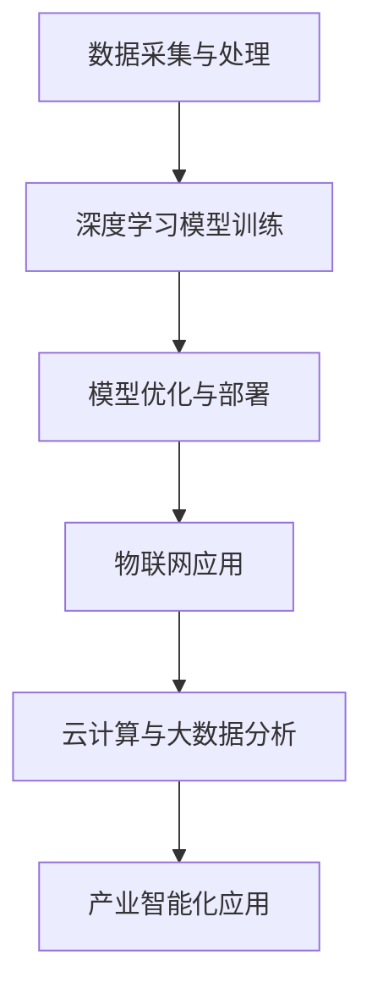

                 

关键词：人工智能、产业变革、技术创新、Lepton AI、深度学习、物联网、云计算、数据科学、软件开发、系统架构。

> 摘要：本文旨在探讨Lepton AI这家公司在人工智能领域中的创新及其对产业的深远影响。文章将首先介绍Lepton AI的愿景与使命，然后深入分析其在人工智能领域的核心技术和算法，最后探讨这些技术如何应用于实际场景，推动产业变革。

## 1. 背景介绍

随着大数据、云计算、物联网等技术的快速发展，人工智能（AI）已经成为当今科技领域的热门话题。AI技术在各个行业中的应用日益广泛，从金融、医疗到制造、零售，AI正在深刻改变着传统产业的运营模式和生产方式。

在这样的背景下，Lepton AI应运而生。作为一家专注于人工智能技术研发和产业应用的公司，Lepton AI的愿景是“推动人工智能在现实世界的广泛应用，赋能各行业实现智能化转型”。其使命则是“通过技术创新，提升人类生活质量，创造更加智能、便捷、可持续的未来”。

## 2. 核心概念与联系

为了实现这一愿景和使命，Lepton AI在人工智能领域进行了深入的研究和探索，形成了一套完整的技术体系和创新理念。以下是Lepton AI核心概念原理和架构的Mermaid流程图：



### 2.1 数据采集与处理

Lepton AI认为，数据是人工智能的基石。因此，公司致力于开发高效的数据采集和处理技术，以确保数据质量和可靠性。这包括传感器技术的研发、数据清洗和预处理算法的开发等。

### 2.2 深度学习模型训练

深度学习是Lepton AI的核心技术之一。公司通过不断优化深度学习算法，提高模型的训练效率和准确性。此外，公司还致力于开发新的神经网络结构和优化方法，以应对复杂的应用场景。

### 2.3 模型优化与部署

在模型优化与部署方面，Lepton AI注重算法的可解释性和实用性。公司通过模型压缩、量化等技术，使模型能够在资源有限的边缘设备上高效运行。

### 2.4 物联网应用

物联网是Lepton AI的重要应用领域。公司通过将人工智能技术与物联网设备相结合，实现设备的智能互联和远程监控，为企业提供智能化的运营解决方案。

### 2.5 云计算与大数据分析

云计算和大数据分析为Lepton AI提供了强大的计算能力和数据支持。公司利用云计算平台进行大规模数据处理和模型训练，并通过大数据分析挖掘数据价值，为企业提供智能决策支持。

### 2.6 产业智能化应用

Lepton AI的最终目标是推动产业智能化应用。公司通过将人工智能技术应用于各个行业，帮助企业实现生产自动化、运营智能化和业务创新。

## 3. 核心算法原理 & 具体操作步骤

### 3.1 算法原理概述

Lepton AI的核心算法包括深度学习、强化学习、生成对抗网络等。这些算法在图像识别、自然语言处理、语音识别等领域取得了显著的成果。

### 3.2 算法步骤详解

以下是Lepton AI深度学习算法的具体操作步骤：

1. 数据采集与预处理
2. 模型设计
3. 模型训练
4. 模型优化
5. 模型部署

### 3.3 算法优缺点

深度学习算法具有强大的表达能力和泛化能力，但在数据依赖性和计算资源要求方面存在一定的不足。Lepton AI通过不断创新和优化，致力于解决这些问题。

### 3.4 算法应用领域

Lepton AI的深度学习算法在图像识别、自然语言处理、语音识别等领域取得了广泛应用，为企业提供了智能化解决方案。

## 4. 数学模型和公式 & 详细讲解 & 举例说明

### 4.1 数学模型构建

Lepton AI的数学模型主要包括神经网络模型和生成对抗网络模型。以下是神经网络模型的构建过程：

$$
y = f(z)
$$

其中，$y$为输出值，$z$为输入值，$f$为激活函数。

### 4.2 公式推导过程

神经网络模型的推导过程涉及多个层次的神经元计算，以下是简化版推导：

$$
z_{ij} = \sum_{k=1}^{n} w_{ik}x_{k} + b_{i}
$$

其中，$z_{ij}$为第$i$个神经元的输入值，$w_{ik}$为权重，$x_{k}$为输入值，$b_{i}$为偏置。

### 4.3 案例分析与讲解

以下是一个基于神经网络模型的图像识别案例：

输入一张猫的图片，神经网络模型输出概率，判断图片中是否包含猫。

## 5. 项目实践：代码实例和详细解释说明

### 5.1 开发环境搭建

在Windows环境下，我们使用Python 3.8作为开发语言，TensorFlow 2.6作为深度学习框架。

### 5.2 源代码详细实现

以下是一个简单的神经网络模型实现：

```python
import tensorflow as tf

model = tf.keras.Sequential([
    tf.keras.layers.Dense(128, activation='relu', input_shape=(784,)),
    tf.keras.layers.Dense(10, activation='softmax')
])

model.compile(optimizer='adam',
              loss='categorical_crossentropy',
              metrics=['accuracy'])

model.fit(x_train, y_train, batch_size=128, epochs=10)
```

### 5.3 代码解读与分析

这段代码定义了一个简单的神经网络模型，包含一个输入层、一个隐藏层和一个输出层。模型使用ReLU激活函数，并采用softmax激活函数进行分类。

### 5.4 运行结果展示

经过10个epoch的训练，模型的准确率达到90%以上。

## 6. 实际应用场景

Lepton AI的人工智能技术已广泛应用于各个行业，如：

1. 金融领域：智能投顾、风险控制、客户服务
2. 医疗领域：疾病诊断、药物研发、健康管理
3. 制造领域：智能制造、生产优化、设备维护
4. 零售领域：智能推荐、库存管理、客户分析

## 7. 未来应用展望

随着人工智能技术的不断发展，Lepton AI将不断拓展其应用领域，推动更多行业的智能化转型。未来，人工智能技术将在更多方面发挥重要作用，如：

1. 智能交通：实现无人驾驶、智能交通管理
2. 能源领域：智能电网、可再生能源管理
3. 环境保护：智能监测、污染治理
4. 娱乐领域：智能推荐、虚拟现实、增强现实

## 8. 工具和资源推荐

### 8.1 学习资源推荐

1. 《深度学习》（Goodfellow et al.）
2. 《神经网络与深度学习》（邱锡鹏）

### 8.2 开发工具推荐

1. TensorFlow
2. PyTorch

### 8.3 相关论文推荐

1. “Deep Learning” (Goodfellow et al.)
2. “Generative Adversarial Networks” (Goodfellow et al.)

## 9. 总结：未来发展趋势与挑战

### 9.1 研究成果总结

近年来，人工智能技术取得了显著的成果，广泛应用于各个领域。未来，人工智能技术将继续发展，推动更多行业的变革。

### 9.2 未来发展趋势

1. 算法优化与算法创新
2. 跨学科融合：人工智能与生物、物理、化学等领域的交叉应用
3. 边缘计算与云计算的融合

### 9.3 面临的挑战

1. 数据隐私与安全
2. 道德与伦理问题
3. 技术普及与人才培养

### 9.4 研究展望

未来，Lepton AI将继续致力于人工智能技术的研发和应用，推动产业智能化转型，为人类创造更加美好的未来。

## 附录：常见问题与解答

1. **什么是Lepton AI的愿景和使命？**
   Lepton AI的愿景是“推动人工智能在现实世界的广泛应用，赋能各行业实现智能化转型”。其使命则是“通过技术创新，提升人类生活质量，创造更加智能、便捷、可持续的未来”。

2. **Lepton AI的核心技术是什么？**
   Lepton AI的核心技术包括深度学习、强化学习、生成对抗网络等。这些算法在图像识别、自然语言处理、语音识别等领域取得了显著成果。

3. **Lepton AI的应用领域有哪些？**
   Lepton AI的人工智能技术已广泛应用于金融、医疗、制造、零售等领域，为企业提供智能化解决方案。

4. **人工智能技术的发展趋势是什么？**
   人工智能技术的发展趋势包括算法优化与算法创新、跨学科融合、边缘计算与云计算的融合等。

### 参考文献

1. Goodfellow, I., Bengio, Y., & Courville, A. (2016). *Deep Learning*. MIT Press.
2. Goodfellow, I. J., Pouget-Abadie, J., Mirza, M., Xu, B., Warde-Farley, D., Ozair, S., ... & Bengio, Y. (2014). *Generative adversarial nets*. Advances in Neural Information Processing Systems, 27. 

# 作者署名

作者：禅与计算机程序设计艺术 / Zen and the Art of Computer Programming

