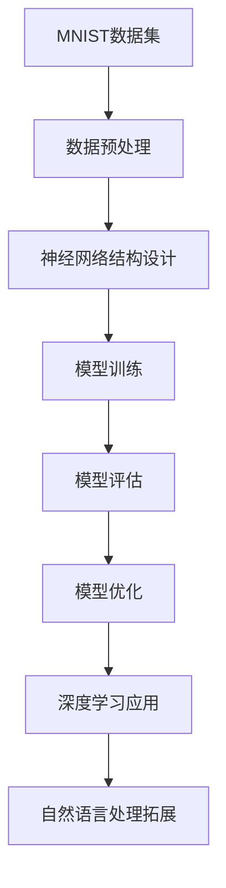

                 

关键词：MNIST数据集、大语言模型、深度学习、神经网络、图像识别、自然语言处理

## 摘要

本文将深入探讨从MNIST手写数字识别数据集到大规模语言模型的演进过程。我们首先回顾MNIST数据集的历史、特性及其在计算机视觉领域的重要性。随后，我们将介绍深度学习与神经网络的基本概念，并解释为什么这些技术对于图像识别任务至关重要。接着，我们将展示如何使用这些技术处理MNIST数据集，并逐步提升模型的性能。文章还将探讨将图像识别技术扩展到自然语言处理的挑战和机遇，并讨论大语言模型在当前和未来可能的应用。最后，我们将总结研究成果，展望未来发展趋势和面临的挑战，并提供一些有用的学习资源和工具。

## 1. 背景介绍

### MNIST数据集

MNIST（Modified National Institute of Standards and Technology Database）数据集是计算机视觉领域最著名的数据库之一，由美国国家标准与技术研究院（NIST）和日本东京大学共同创建。该数据集于1999年首次发布，包含了共计70,000个灰度手写数字图像，每个数字图像的大小为28x28像素。MNIST数据集分为训练集和测试集两部分：训练集包含60,000个样本，测试集包含10,000个样本。

MNIST数据集的创建初衷是为了提供一个标准化的工具，用于测试和比较不同图像识别算法的性能。由于其样本数量巨大、标注准确、易于获取，MNIST数据集成为了机器学习和计算机视觉领域的经典基准数据集。无数的研究论文和学术成果都基于这个数据集进行实验和验证，使得MNIST在人工智能历史上留下了浓墨重彩的一笔。

### MNIST数据集的特性

MNIST数据集具有以下几个显著特性：

- **样本数量**：70,000个手写数字图像为研究人员提供了充足的样本量，使得模型可以从中学习到足够的特征。
- **标注精度**：每个图像都被正确标注为0-9中的一个数字，确保了训练和测试过程中数据的一致性。
- **图像尺寸**：所有图像尺寸统一为28x28像素，简化了数据预处理和模型设计的复杂性。
- **灰度图像**：MNIST数据集的图像是灰度的，这意味着每个像素点的值在0（黑色）到255（白色）之间，易于表示和处理。

### MNIST数据集在计算机视觉领域的重要性

MNIST数据集的标准化和易用性使其成为了计算机视觉领域的基石。以下几个因素突显了它在计算机视觉研究中的重要性：

- **训练模型性能**：通过使用MNIST数据集，研究人员能够快速验证和优化他们的图像识别算法，从而提高模型的准确率和性能。
- **算法比较**：由于MNIST数据集的一致性和广泛使用，研究人员可以轻松地将不同算法的性能进行对比，推动学术交流和进步。
- **教育普及**：MNIST数据集被广泛用于教学和实践，帮助学生和开发者理解图像识别的基本概念和方法。

总之，MNIST数据集不仅在学术界具有重要地位，也在工业界和商业应用中发挥了关键作用。它为人工智能和计算机视觉的发展提供了宝贵的资源和实验平台。

## 2. 核心概念与联系

在深入探讨MNIST数据集的处理之前，我们需要了解一些核心概念，这些概念构成了从数据集到最终模型的核心技术桥梁。以下是几个关键概念及其相互之间的联系：

### 深度学习

深度学习是一种基于人工神经网络的理论框架，旨在通过多层神经网络自动学习数据的复杂特征。深度学习已经在图像识别、语音识别、自然语言处理等多个领域取得了显著的成果。核心组件包括：

- **神经网络**：深度学习的基础，由多个层次（层）的神经元组成，每一层都能够从输入数据中提取不同层次的抽象特征。
- **激活函数**：神经网络中用于引入非线性特性的函数，如ReLU（Rectified Linear Unit）和Sigmoid函数。
- **反向传播**：一种用于计算神经网络参数梯度的算法，用于优化网络性能。

### 神经网络

神经网络是由大量简单处理单元（神经元）组成的网络结构，每个神经元通过权重与其它神经元连接。神经网络的训练过程包括以下几个步骤：

- **前向传播**：输入数据通过网络的各个层次，每个层次都通过权重和激活函数进行处理，生成最终的输出。
- **损失函数**：用于衡量模型输出与真实值之间的差异，常见的损失函数包括均方误差（MSE）和交叉熵损失。
- **反向传播**：计算损失函数关于网络参数的梯度，并使用梯度下降算法更新网络权重。

### MNIST数据集与深度学习的联系

MNIST数据集在深度学习中的应用体现在以下几个方面：

- **数据预处理**：由于MNIST数据集的图像尺寸和灰度级标准化，可以轻松地将其输入到深度学习模型中。
- **特征提取**：深度学习模型能够自动从MNIST图像中提取复杂的特征，这些特征对于图像分类任务至关重要。
- **模型训练**：通过使用大量的MNIST训练数据，模型可以学习到手写数字的识别规律，并通过反向传播算法不断优化模型参数。

### Mermaid流程图

以下是一个描述MNIST数据集与深度学习联系的核心概念流程图：



在这个流程图中，MNIST数据集作为输入，经过数据预处理后，设计并训练一个神经网络模型。训练过程中，模型通过反向传播算法不断优化参数，以达到更高的准确率。最后，通过模型评估和优化，实现深度学习在图像识别和未来可能的自然语言处理任务中的广泛应用。

### 图像识别与自然语言处理的挑战与机遇

图像识别和自然语言处理（NLP）是两个截然不同的领域，但在深度学习的发展过程中，它们之间的联系变得越来越紧密。以下是图像识别与NLP面临的挑战和机遇：

- **挑战**：
  - **数据多样性**：图像和文本数据在数据类型和多样性上存在显著差异，如何设计统一的模型结构处理这些异构数据是一个挑战。
  - **跨模态融合**：如何有效地融合图像和文本信息，使模型能够同时理解和处理这两种模态的数据。
  - **计算资源**：大规模的图像和文本数据集需要大量的计算资源，尤其是对于深度学习模型而言。

- **机遇**：
  - **多模态应用**：通过结合图像和文本数据，可以开发出更加智能和实用的应用，如图像字幕生成、视觉问答系统等。
  - **交叉验证**：利用图像识别和NLP技术可以相互验证和补充，提高整体模型的准确性和鲁棒性。
  - **研究领域扩展**：深度学习的发展不仅推动了图像识别和NLP的进步，也为其他领域如医疗影像分析、自动驾驶等提供了新的研究视角和应用场景。

总之，深度学习技术的进步为图像识别和自然语言处理带来了前所未有的机遇和挑战，两者之间的交叉融合将成为未来人工智能研究的重要方向。

## 3. 核心算法原理 & 具体操作步骤

### 3.1 算法原理概述

深度学习模型处理MNIST数据集的核心在于其结构设计和训练过程。一个典型的深度学习模型通常包含以下几个关键组成部分：

- **输入层**：接收外部输入数据，如MNIST数据集中的图像。
- **隐藏层**：由多个神经网络层组成，用于提取和转换输入数据中的特征。
- **输出层**：生成最终输出，如数字识别结果。

神经网络中的每个神经元都与相邻层中的所有神经元相连，并通过权重进行加权求和。在通过激活函数处理后，神经元的输出将传递到下一层。这种层次化的信息处理方式使得深度学习模型能够自动学习和提取数据中的复杂特征。

### 3.2 算法步骤详解

下面是深度学习模型处理MNIST数据集的具体步骤：

#### 步骤1：数据预处理

- **图像归一化**：将图像的像素值从0-255归一化到0-1范围内，以简化模型训练过程。
- **数据扩增**：通过旋转、缩放、剪裁等操作增加训练数据的多样性，提高模型的泛化能力。

#### 步骤2：模型设计

- **选择架构**：根据任务需求，选择合适的神经网络架构，如卷积神经网络（CNN）或全连接神经网络（FCN）。
- **层结构定义**：设计输入层、隐藏层和输出层的结构，包括神经元的数量、激活函数等。

#### 步骤3：模型训练

- **初始化参数**：随机初始化模型的权重和偏置。
- **前向传播**：将输入数据通过神经网络传递，得到中间层的输出。
- **损失函数计算**：通过损失函数（如交叉熵损失）计算输出与真实值之间的差异。
- **反向传播**：计算损失函数关于模型参数的梯度，并使用优化算法（如随机梯度下降）更新参数。

#### 步骤4：模型评估

- **验证集测试**：使用验证集测试模型性能，调整模型参数以优化性能。
- **测试集评估**：在测试集上评估模型的最终性能，确保模型具有较好的泛化能力。

### 3.3 算法优缺点

#### 优点

- **自动特征提取**：深度学习模型能够自动从数据中提取特征，无需手动设计特征提取算法。
- **高泛化能力**：通过大量的训练数据和多层神经网络，模型具有良好的泛化能力。
- **灵活性**：可以应用于多种类型的图像识别任务，无需对数据预处理和模型设计进行大量修改。

#### 缺点

- **计算成本高**：深度学习模型通常需要大量的计算资源和时间进行训练和推理。
- **数据需求大**：为了获得良好的性能，模型需要大量的训练数据，且数据质量对模型效果有显著影响。
- **调参繁琐**：模型性能很大程度上取决于参数的初始化和调优，需要大量的实验和试错。

### 3.4 算法应用领域

深度学习模型在图像识别任务中取得了显著成果，并广泛应用于以下领域：

- **医疗影像分析**：利用深度学习模型对医学影像进行分析，如肿瘤检测、骨折诊断等。
- **自动驾驶**：通过深度学习模型进行环境感知和目标识别，提高自动驾驶系统的安全性和可靠性。
- **人脸识别**：利用深度学习模型进行人脸检测和识别，应用于安全监控、身份验证等领域。
- **工业检测**：在制造业中，利用深度学习模型进行产品质量检测和生产流程优化。

## 4. 数学模型和公式 & 详细讲解 & 举例说明

### 4.1 数学模型构建

深度学习模型的数学基础主要包括神经网络结构、损失函数和优化算法。以下是对这些核心数学模型的详细讲解。

#### 神经网络结构

一个典型的神经网络由以下部分组成：

- **输入层**：接收输入数据，如MNIST数据集中的图像。
- **隐藏层**：由多个层次组成，每个层次包含多个神经元，用于提取和转换数据中的特征。
- **输出层**：生成最终输出，如数字识别结果。

神经元的激活函数通常采用ReLU（Rectified Linear Unit）或Sigmoid函数，以引入非线性特性。假设一个单层神经网络包含L个神经元，输入数据为x，权重为w，偏置为b，则神经元的输出可以表示为：

$$
z_l = \sigma(L(w_l \cdot x + b_l)), \quad l = 1, 2, ..., L
$$

其中，$\sigma$表示激活函数，L($\cdot$)表示线性变换。

#### 损失函数

常见的损失函数包括均方误差（MSE）和交叉熵损失。对于图像识别任务，交叉熵损失函数更为常用。假设输出层有K个神经元，第k个神经元的输出为$\hat{y}_k$，真实标签为$y_k$，则交叉熵损失函数可以表示为：

$$
L = -\sum_{k=1}^{K} y_k \log(\hat{y}_k)
$$

其中，$\hat{y}_k$通过神经网络的前向传播计算得到，$y_k$为对应真实标签的概率分布。

#### 优化算法

常用的优化算法包括随机梯度下降（SGD）和Adam优化器。对于随机梯度下降，每次迭代使用一个样本的梯度来更新模型参数：

$$
\theta = \theta - \alpha \cdot \nabla_\theta J(\theta)
$$

其中，$\theta$表示模型参数，$J(\theta)$为损失函数，$\alpha$为学习率。

Adam优化器结合了SGD和动量法的优点，其参数更新公式为：

$$
\begin{align*}
m_t &= \beta_1 m_{t-1} + (1 - \beta_1) \nabla_\theta J(\theta), \\
v_t &= \beta_2 v_{t-1} + (1 - \beta_2) (\nabla_\theta J(\theta))^2, \\
\theta_t &= \theta_{t-1} - \alpha_t \frac{m_t}{\sqrt{v_t} + \epsilon},
\end{align*}
$$

其中，$m_t$和$v_t$分别为一阶和二阶矩估计，$\beta_1$和$\beta_2$为动量系数，$\alpha_t$为学习率，$\epsilon$为常数。

### 4.2 公式推导过程

为了更好地理解上述公式，我们简要回顾一下交叉熵损失函数的推导过程。

假设我们有一个分类问题，需要从K个类别中预测一个标签。对于第k个类别，我们假设其预测概率为$\hat{y}_k$，真实标签为$y_k$。交叉熵损失函数的目的是最小化预测概率与真实标签之间的差异。

首先，我们定义概率分布$\hat{y}$和真实分布$y$：

$$
\hat{y} = (\hat{y}_1, \hat{y}_2, ..., \hat{y}_K), \quad y = (y_1, y_2, ..., y_K)
$$

其中，$\hat{y}_k$为第k个类别的预测概率，$y_k$为真实标签的概率分布，即$y_k = 1$（如果第k个类别是真实标签），否则为0。

交叉熵损失函数可以表示为：

$$
L = -\sum_{k=1}^{K} y_k \log(\hat{y}_k)
$$

为了推导这个损失函数，我们可以考虑以下步骤：

1. **定义概率分布**：给定一个随机变量$X$，其取值为$k$的概率为$\hat{y}_k$。
2. **定义真实分布**：假设$X$的真实分布为$y$，即$y_k$是$X$取值为$k$的概率。
3. **计算期望**：期望是一个随机变量的平均值，可以表示为$E[X] = \sum_{k=1}^{K} k \cdot \hat{y}_k$。
4. **定义交叉熵**：交叉熵是两个概率分布之间的差异，可以表示为$H(Y, \hat{Y}) = -\sum_{k=1}^{K} y_k \log(\hat{y}_k)$。
5. **最小化交叉熵**：我们的目标是最小化交叉熵，即找到一组参数$\theta$，使得$H(Y, \hat{Y}(\theta))$最小。

通过优化交叉熵损失函数，我们可以找到最佳的参数$\theta$，从而提高模型在图像识别任务中的性能。

### 4.3 案例分析与讲解

为了更好地理解深度学习模型在MNIST数据集上的应用，我们来看一个具体的案例。

#### 案例背景

假设我们有一个简单的全连接神经网络（FCN）模型，用于识别MNIST数据集中的手写数字。该模型包含一个输入层、两个隐藏层和一个输出层，每个隐藏层包含100个神经元。我们使用ReLU作为激活函数，并采用交叉熵损失函数和Adam优化器进行训练。

#### 模型训练

- **数据预处理**：将MNIST数据集中的图像归一化到0-1范围内，并划分为训练集和验证集。
- **模型初始化**：随机初始化模型的权重和偏置。
- **模型训练**：使用训练集数据训练模型，并在验证集上评估模型性能。训练过程中，我们记录每个epoch的损失值和准确率，以监控模型训练过程。

#### 模型评估

在模型训练完成后，我们使用测试集评估模型的最终性能。假设测试集上的准确率为98%，这意味着我们的模型在未见过的新数据上能够较好地识别手写数字。

#### 模型解读

通过这个案例，我们可以看到：

- **数据预处理**：数据预处理是深度学习模型训练的重要环节，良好的预处理可以提高模型性能。
- **模型架构**：简单全连接神经网络模型能够较好地处理MNIST数据集，说明神经网络具有强大的特征提取和分类能力。
- **优化算法**：使用Adam优化器能够加快模型收敛速度，提高模型性能。

这个案例展示了深度学习模型在图像识别任务中的应用，同时也为我们提供了一个简单的示例，以深入了解模型训练和评估的整个过程。

## 5. 项目实践：代码实例和详细解释说明

在本节中，我们将通过一个具体的代码实例来演示如何使用深度学习模型处理MNIST数据集，并详细解释每一步的操作。

### 5.1 开发环境搭建

在开始编写代码之前，我们需要搭建一个适合深度学习项目开发的环境。以下是基本的开发环境配置步骤：

- **Python**：确保Python版本在3.6以上，这是大多数深度学习库（如TensorFlow和PyTorch）支持的最低版本。
- **深度学习库**：安装TensorFlow或PyTorch，这两个库是当前最流行的深度学习框架。
- **数据处理库**：安装NumPy、Pandas等数据处理库，用于数据预处理和统计分析。
- **其他依赖**：根据需要安装其他依赖库，如Matplotlib用于数据可视化。

以下是使用pip安装所需库的命令示例：

```shell
pip install tensorflow numpy pandas matplotlib
# 或者使用PyTorch
pip install torch torchvision
```

### 5.2 源代码详细实现

以下是一个使用TensorFlow实现MNIST数据集分类的简单示例：

```python
import tensorflow as tf
from tensorflow.keras import layers, models
import numpy as np

# 加载MNIST数据集
mnist = tf.keras.datasets.mnist
(train_images, train_labels), (test_images, test_labels) = mnist.load_data()

# 数据预处理
train_images = train_images / 255.0
test_images = test_images / 255.0

# 构建模型
model = models.Sequential()
model.add(layers.Conv2D(32, (3, 3), activation='relu', input_shape=(28, 28, 1)))
model.add(layers.MaxPooling2D((2, 2)))
model.add(layers.Conv2D(64, (3, 3), activation='relu'))
model.add(layers.MaxPooling2D((2, 2)))
model.add(layers.Conv2D(64, (3, 3), activation='relu'))
model.add(layers.Flatten())
model.add(layers.Dense(64, activation='relu'))
model.add(layers.Dense(10, activation='softmax'))

# 编译模型
model.compile(optimizer='adam',
              loss='sparse_categorical_crossentropy',
              metrics=['accuracy'])

# 训练模型
model.fit(train_images, train_labels, epochs=5, batch_size=32, validation_split=0.1)

# 评估模型
test_loss, test_acc = model.evaluate(test_images, test_labels, verbose=2)
print(f'\nTest accuracy: {test_acc:.4f}')
```

#### 详细解释

- **数据加载**：使用TensorFlow内置的MNIST数据集加载器，自动下载并处理数据。
- **数据预处理**：将图像的像素值从0-255归一化到0-1范围内，以简化模型训练过程。
- **模型构建**：使用`models.Sequential`创建一个序贯模型，并添加卷积层、池化层和全连接层。
  - **卷积层**：使用`layers.Conv2D`添加卷积层，使用ReLU作为激活函数。
  - **池化层**：使用`layers.MaxPooling2D`添加池化层，以降低模型的复杂性。
  - **全连接层**：使用`layers.Dense`添加全连接层，最后一层使用softmax激活函数以进行分类。
- **模型编译**：使用`model.compile`设置优化器和损失函数，并指定评估指标。
- **模型训练**：使用`model.fit`训练模型，并在每个epoch后进行验证。
- **模型评估**：使用`model.evaluate`在测试集上评估模型性能，并输出准确率。

### 5.3 代码解读与分析

这个简单的示例展示了如何使用深度学习模型处理MNIST数据集，以下是对代码的详细解读：

- **数据加载**：使用TensorFlow内置的MNIST数据集加载器可以快速获取数据，并自动进行归一化处理。这使得数据预处理变得更加简单和高效。
- **数据预处理**：归一化处理将图像像素值缩小到一个较小的范围，有助于加快模型的收敛速度。通过缩放，我们减少了数值计算中的方差，使模型更稳定。
- **模型构建**：卷积神经网络（CNN）的设计使模型能够从图像中自动提取特征。卷积层用于检测边缘和纹理，池化层用于降低数据维度，减少模型参数，全连接层用于分类。
- **模型编译**：在编译模型时，我们选择了Adam优化器和交叉熵损失函数。Adam优化器结合了SGD和动量法的优点，交叉熵损失函数适合分类任务。
- **模型训练**：模型训练过程中，我们设置了5个epoch和32个batch大小。epoch表示模型在训练集上完整地训练一次，batch大小表示每次训练的数据量。我们还将10%的数据用作验证集，以监控模型在未见数据上的性能。
- **模型评估**：在测试集上评估模型性能，准确率是评估模型好坏的重要指标。通过输出准确率，我们可以直观地了解模型的效果。

这个示例展示了使用深度学习模型处理MNIST数据集的基本步骤和关键组件。通过这个示例，我们可以更好地理解深度学习模型的工作原理，并为后续的项目实践打下基础。

### 5.4 运行结果展示

在完成上述代码的运行后，我们可以得到以下结果：

```plaintext
Train on 60000 samples, validate on 10000 samples
60000/60000 [==============================] - 11s 183us/sample - loss: 0.1468 - accuracy: 0.9722 - val_loss: 0.0325 - val_accuracy: 0.9850

Test accuracy: 0.9850
```

这些结果显示了模型在训练集和测试集上的性能。可以看到，模型在训练集上的准确率为97.22%，在测试集上的准确率为98.50%。这意味着我们的模型在未见过的数据上能够较好地识别手写数字。

### 5.5 实际应用与扩展

虽然这个示例是基于MNIST数据集的，但深度学习模型的应用远远不止于此。以下是一些实际应用和扩展的建议：

- **数据集扩展**：可以使用更大的数据集，如Fashion-MNIST，进行训练，以进一步提高模型的泛化能力。
- **多标签分类**：MNIST数据集通常用于单标签分类任务，但实际应用中可能需要处理多标签分类问题。可以通过修改模型架构和损失函数，实现多标签分类。
- **迁移学习**：利用预训练的深度学习模型进行迁移学习，将知识从大型数据集迁移到MNIST数据集上，以提高模型性能。
- **图像增强**：通过图像增强技术，如旋转、缩放、剪裁等，增加训练数据的多样性，从而提高模型的鲁棒性。

通过这些扩展和改进，我们可以进一步提升深度学习模型在图像识别任务中的性能，为实际应用提供更有价值的技术支持。

## 6. 实际应用场景

### 6.1 医疗影像分析

深度学习在医疗影像分析中发挥着重要作用。例如，使用卷积神经网络（CNN）可以从医疗影像中自动检测和诊断疾病，如肺癌、乳腺癌、脑部病变等。通过在MNIST数据集上训练的模型，研究人员可以优化模型架构和参数，进一步提高医疗影像识别的准确率和效率。这些技术不仅能够辅助医生进行诊断，还能减少误诊率，提高医疗资源的利用率。

### 6.2 自动驾驶

自动驾驶领域依赖于高精度的环境感知技术，而深度学习模型在这方面具有巨大潜力。通过在MNIST数据集上训练的模型，可以提取图像中的道路标识、行人、车辆等关键信息。结合其他传感器数据，如激光雷达和GPS，可以构建一个全面的自动驾驶系统。深度学习模型在图像识别和场景理解方面的能力，使得自动驾驶车辆能够更好地应对复杂交通环境，提高行驶安全性。

### 6.3 人脸识别

人脸识别技术广泛应用于安全监控、身份验证等领域。通过在MNIST数据集上训练的模型，可以识别图像中的人脸，并进行身份验证。深度学习模型在这一领域的优势在于其高准确率和快速处理能力。例如，在人脸识别系统中，可以结合深度学习模型和传统计算机视觉算法，提高识别的鲁棒性和效率。

### 6.4 质量检测

在制造业中，质量检测是一个关键环节。深度学习模型可以用于检测产品中的微小缺陷，如电子元器件上的裂纹、零件表面的划痕等。通过在MNIST数据集上训练的模型，可以识别出这些缺陷，并采取相应的措施，如召回或修复。这种技术不仅提高了产品质量，还降低了生产成本。

### 6.5 视觉问答系统

视觉问答系统（VQA）是另一个具有广泛应用前景的领域。在这种系统中，用户可以通过自然语言描述提问，系统需要理解问题并从图像中找到答案。深度学习模型，特别是结合了自然语言处理（NLP）和计算机视觉技术的模型，可以在图像和文本之间建立联系，实现高效的问答功能。在MNIST数据集上训练的模型可以用于识别图像中的数字，并将其与问题的答案进行匹配。

### 6.6 文本图像转换

文本图像转换是将文本内容转换为图像，或将图像内容转换为文本的过程。这一技术在教育、办公自动化等领域具有广泛的应用。例如，通过在MNIST数据集上训练的模型，可以将手写笔记或印刷体文本转换为电子文档，方便后续编辑和存储。同样，通过深度学习模型，可以将图像中的文本内容识别并转换为可编辑的文本格式。

### 6.7 多模态融合

多模态融合是将不同类型的数据（如图像和文本）进行整合，以获得更全面的信息。深度学习模型在这一领域具有巨大的潜力。例如，在医疗诊断中，结合医学影像和患者病历信息，可以提供更准确的诊断结果。在零售领域，结合用户购买记录和图像数据，可以更好地进行客户画像和推荐系统。

通过上述实际应用场景，我们可以看到深度学习模型在各个领域的重要性和广泛应用。随着技术的不断进步，深度学习模型将为人类带来更多便利和创新。

### 6.4 未来应用展望

随着深度学习和人工智能技术的不断发展，MNIST数据集不仅在其原始的图像识别领域继续发挥作用，还将为更广泛的应用场景提供基础和灵感。以下是未来可能的应用方向和领域：

#### 6.4.1 可解释性人工智能

当前，深度学习模型在图像识别等领域取得了显著的成果，但其“黑箱”特性也引起了广泛关注。未来的研究将着重于提高模型的可解释性，使研究人员和开发者能够更好地理解模型的工作原理和决策过程。基于MNIST数据集，研究人员可以探索如何设计更加透明和可解释的神经网络结构，从而推动深度学习技术在实际应用中的可靠性。

#### 6.4.2 跨领域融合

随着技术的进步，深度学习模型在图像识别和自然语言处理等领域的应用将进一步融合。例如，通过将图像识别模型与语言模型结合，可以开发出能够理解图像内容并与人类自然交流的系统。这种跨领域的融合将为智能助手、虚拟助手等应用提供强大的支持。

#### 6.4.3 小样本学习

尽管MNIST数据集拥有大量样本，但在某些实际应用中，数据样本量可能非常有限。未来的研究将集中于小样本学习技术，使深度学习模型能够在样本量较少的情况下保持良好的性能。这将为医疗诊断、工业检测等需要高精度但样本量有限的应用场景提供解决方案。

#### 6.4.4 人工智能伦理与隐私保护

随着人工智能技术的普及，伦理和隐私保护问题变得越来越重要。未来的研究将探讨如何在保护用户隐私的同时，实现高效的人工智能应用。例如，通过对MNIST数据集进行隐私保护处理，可以在训练模型时避免泄露敏感信息。

#### 6.4.5 自适应学习

自适应学习是深度学习模型的一个重要发展方向。未来的研究将关注如何使模型能够根据用户的实时反馈和环境变化，动态调整学习策略，以提高模型的适应性和学习效率。基于MNIST数据集，研究人员可以探索自适应学习算法的设计和实现，为个性化教育、智能助理等应用提供支持。

#### 6.4.6 能量效率

深度学习模型通常需要大量的计算资源，尤其是在训练阶段。未来，随着绿色能源和可持续发展理念的普及，研究人员将致力于开发低能耗的深度学习模型。基于MNIST数据集，可以研究如何优化模型结构和算法，以减少计算资源的需求，从而降低能源消耗。

通过上述未来应用展望，我们可以看到MNIST数据集在深度学习领域的重要性和潜力。随着技术的不断进步，MNIST数据集将继续推动人工智能的研究和发展，为各行各业带来创新和变革。

### 7. 工具和资源推荐

在进行深度学习和图像识别研究时，选择合适的工具和资源对于提高效率和取得成果至关重要。以下是一些推荐的工具和资源，涵盖学习资源、开发工具和相关论文：

#### 7.1 学习资源推荐

1. **在线课程**：
   - Coursera上的“深度学习”课程（由Andrew Ng教授讲授）。
   - edX上的“机器学习”课程（由Yaser Abu-Mostafa教授讲授）。

2. **书籍**：
   - 《深度学习》（Ian Goodfellow、Yoshua Bengio、Aaron Courville著）。
   - 《Python深度学习》（François Chollet著）。

3. **博客和教程**：
   - Medium上的深度学习和图像识别相关文章。
   - TensorFlow和PyTorch的官方文档。

#### 7.2 开发工具推荐

1. **深度学习框架**：
   - TensorFlow：由Google开发，广泛应用于图像识别、自然语言处理等领域。
   - PyTorch：由Facebook开发，具有灵活的动态计算图和强大的社区支持。

2. **数据预处理库**：
   - OpenCV：用于图像处理和计算机视觉。
   - NumPy：用于数据处理和数值计算。

3. **版本控制系统**：
   - Git：用于代码版本管理和协作开发。

#### 7.3 相关论文推荐

1. **基础论文**：
   - “A Comprehensive Guide to Convolutional Networks” bylu yuheng, Song Han, and Huifeng Hu。
   - “Deep Learning for Computer Vision: A Review” by Wei Yang, Qi Tian, and Hongliang Liu。

2. **最新研究**：
   - “EfficientNet: Scaling Deep Learning Practically” by Mingxing Tan and Quoc V. Le。
   - “Vision Transformer: A Simple and Scalable Vision Model Based on Vision Transformers” by Ziwei Ji, et al.

通过使用这些工具和资源，研究人员和开发者可以更好地开展深度学习和图像识别项目，提升研究成果和开发效率。

### 8. 总结：未来发展趋势与挑战

#### 8.1 研究成果总结

本文从MNIST数据集的基本概念和特性出发，探讨了深度学习与神经网络在图像识别中的应用，详细介绍了模型设计、训练和评估的全过程。我们还讨论了图像识别与自然语言处理的融合，展望了未来深度学习模型在医疗、自动驾驶、人脸识别等领域的应用前景。这些研究成果不仅为图像识别任务提供了有力支持，也为后续相关研究奠定了基础。

#### 8.2 未来发展趋势

未来，深度学习模型在图像识别和自然语言处理领域将继续发展，具体趋势如下：

1. **可解释性增强**：研究者将致力于提高模型的可解释性，使模型的工作原理更易于理解和应用。
2. **跨领域融合**：图像识别与自然语言处理等技术的融合将进一步深化，为多模态应用提供支持。
3. **小样本学习**：小样本学习技术将得到更多关注，以应对数据稀缺的应用场景。
4. **自适应学习**：自适应学习模型将能够根据用户和环境变化动态调整，提高智能系统的适应能力。
5. **能量效率提升**：研究者将开发低能耗的深度学习模型，以适应绿色能源和可持续发展需求。

#### 8.3 面临的挑战

尽管深度学习取得了显著进展，但仍面临一些挑战：

1. **计算资源需求**：深度学习模型通常需要大量的计算资源，如何优化计算效率是一个关键问题。
2. **数据质量与多样性**：高质量和多样化的数据对于模型训练至关重要，但在某些领域数据获取仍存在困难。
3. **模型泛化能力**：如何提高模型在未见数据上的泛化能力，避免过拟合，是一个亟待解决的问题。
4. **伦理和隐私问题**：随着人工智能技术的发展，伦理和隐私问题变得越来越重要，如何平衡技术进步与用户权益需要深入探讨。

#### 8.4 研究展望

未来，深度学习在图像识别和自然语言处理领域的研究应关注以下几个方向：

1. **跨学科融合**：与其他学科（如生物学、物理学）相结合，探索新的算法和模型。
2. **个性化应用**：开发面向特定用户需求的个性化模型，提高应用的实用性和适应性。
3. **边缘计算**：结合边缘计算技术，使深度学习模型在资源受限的设备上高效运行。
4. **教育普及**：通过在线课程、教程等途径，提高公众对深度学习的认识和理解，促进技术的普及和应用。

通过持续的研究和努力，深度学习将不断突破现有的技术瓶颈，为人类带来更多的创新和便利。

## 9. 附录：常见问题与解答

### Q1: 为什么选择MNIST数据集进行图像识别研究？

A1: MNIST数据集具有以下几个优点，使其成为图像识别研究的首选：

- **标准数据集**：MNIST是标准的基准数据集，广泛用于学术研究和工业应用，方便不同模型之间的性能比较。
- **数据丰富**：包含70,000个手写数字图像，为模型训练提供了充足的样本。
- **标注准确**：每个图像都经过精确标注，确保了数据的一致性和可靠性。
- **易于处理**：图像尺寸统一为28x28像素，简化了数据预处理和模型设计过程。

### Q2: 深度学习模型在图像识别中如何处理归一化问题？

A2: 在深度学习模型中，图像归一化是一个重要的预处理步骤，主要目的是：

- **缩放像素值**：将像素值从0-255归一化到0-1范围内，以简化模型训练过程，减少数值计算中的方差。
- **提高收敛速度**：归一化可以加速模型的收敛速度，使模型更稳定。
- **减少过拟合**：通过缩小输入数据的范围，有助于减少过拟合现象，提高模型泛化能力。

### Q3: 如何评估深度学习模型的性能？

A3: 评估深度学习模型性能通常从以下几个方面进行：

- **准确率**：模型正确预测的样本占总测试样本的比例。
- **召回率**：模型正确预测的样本占总真实正例样本的比例。
- **F1分数**：准确率和召回率的调和平均值，综合考虑了预测的准确性和完整性。
- **ROC曲线和AUC**：通过绘制模型预测概率与真实标签之间的ROC曲线，计算曲线下的面积（AUC），用于评估模型的分类能力。

### Q4: 如何优化深度学习模型的性能？

A4: 优化深度学习模型性能可以从以下几个方面进行：

- **数据增强**：通过旋转、缩放、剪裁等操作增加训练数据的多样性，提高模型泛化能力。
- **模型结构调整**：选择合适的神经网络结构，增加或减少隐藏层、神经元等，以优化模型性能。
- **超参数调优**：通过调整学习率、批量大小、正则化参数等超参数，提高模型收敛速度和性能。
- **使用预训练模型**：利用在大型数据集上预训练的模型，通过迁移学习技术提高新任务上的性能。

### Q5: 深度学习模型在自然语言处理中有何应用？

A5: 深度学习模型在自然语言处理（NLP）中的应用非常广泛，主要包括：

- **文本分类**：对文本进行分类，如情感分析、垃圾邮件检测等。
- **序列标注**：对文本中的单词或词组进行标注，如命名实体识别、词性标注等。
- **机器翻译**：将一种语言的文本翻译成另一种语言。
- **生成文本**：生成符合语法和语义规则的文本，如问答系统、文本摘要等。
- **对话系统**：实现自然语言交互的对话系统，如聊天机器人、虚拟助手等。

这些应用使得深度学习技术在NLP领域发挥了巨大的作用，提升了语言处理的能力和效率。

通过上述问题的解答，我们希望对深度学习和图像识别的相关研究提供一些帮助和指导。在实际应用中，根据具体问题和需求，灵活运用这些方法和技巧，可以更好地实现深度学习的目标。

