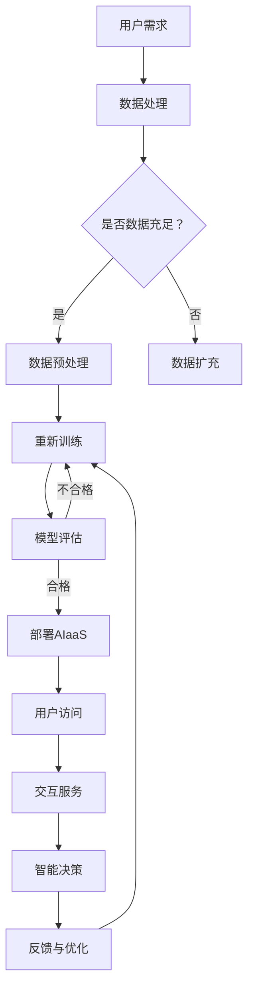

                 

在科技飞速发展的今天，云计算、大数据、人工智能（AI）等技术的交汇融合，为各行各业带来了前所未有的机遇与变革。软件即服务（SaaS）作为云计算时代的标志性服务模式，早已深入到了企业的方方面面。然而，随着AI技术的不断演进，一种新的服务模式——AI即服务（AIaaS）正在崛起，预示着未来科技服务的全新格局。本文旨在探讨从SaaS到AIaaS的转变，深入解析AI大模型驱动的服务模式创新，为读者展现这一领域的无限可能。

## 关键词
- SaaS
- AIaaS
- AI大模型
- 服务模式创新
- 人工智能驱动
- 云计算

## 摘要
本文将首先介绍SaaS服务的起源和演变，然后深入探讨AI大模型的概念及其重要性。接着，文章将分析AI大模型如何驱动AIaaS服务模式的创新，并通过实际案例说明其应用场景。随后，我们将讨论AIaaS在未来的发展趋势和潜在挑战，并提供相应的解决方案。最后，文章将推荐一些学习资源和开发工具，总结研究成果，展望未来，并提出研究的方向和建议。

## 1. 背景介绍

### SaaS服务的起源与发展

软件即服务（SaaS，Software as a Service）是一种通过互联网提供软件应用的订阅模式，用户无需购买软件并自行安装，而是通过网络访问软件服务提供商的服务器，按需使用和付费。SaaS模式起源于20世纪90年代末，随着互联网的普及和云计算技术的发展，逐渐成为主流的商业软件交付方式。

SaaS模式的优点在于其灵活性和成本效益。首先，用户可以按需访问服务，无需进行大规模的硬件和软件投资，降低了初始成本。其次，SaaS服务通常是按使用量计费，用户可以根据实际需求调整使用量，减少了资源的浪费。此外，SaaS服务提供商负责软件的维护和升级，用户无需关心技术细节，专注于业务运营。

SaaS服务在各个行业都得到了广泛应用，如CRM（客户关系管理）、ERP（企业资源规划）、财务管理、人力资源管理等领域。以Salesforce为例，这家公司凭借其CRM SaaS服务，成功引领了企业级软件市场的变革，成为了SaaS领域的领军企业。

### AI技术的演进与AIaaS的兴起

人工智能（AI，Artificial Intelligence）作为计算机科学的一个分支，旨在创建能够模拟、延伸和扩展人类智能的智能机器。自20世纪50年代起，AI技术经历了数次浪潮，特别是在深度学习和大数据技术的推动下，AI技术取得了显著的进步。

深度学习作为一种基于人工神经网络的机器学习方法，通过多层神经元的非线性变换，能够自动从大量数据中提取特征，实现图像识别、语音识别、自然语言处理等复杂任务。随着计算能力的提升和大数据的积累，深度学习模型变得越来越庞大和复杂，其中最具代表性的是Transformer模型和其变体，如BERT、GPT等大模型。

AI大模型的出现，不仅推动了AI技术的发展，也引发了服务模式的创新。AI即服务（AIaaS，Artificial Intelligence as a Service）作为一种新兴的服务模式，通过将AI大模型的能力开放给用户，使得非专业用户也能便捷地使用AI技术，实现从数据处理到智能决策的自动化。

AIaaS的核心在于云计算和边缘计算的协同，通过云端的强大计算能力和边缘设备的高速网络连接，AIaaS能够提供实时、高效、可靠的智能服务。例如，自动驾驶、智能家居、智能安防等领域都开始采用AIaaS服务模式，极大地提升了用户体验和运营效率。

### 从SaaS到AIaaS的转变

SaaS和AIaaS虽然都是基于云计算的服务模式，但它们之间存在显著的区别。SaaS更侧重于提供软件应用服务，而AIaaS则更加关注人工智能技术的应用和延伸。从SaaS到AIaaS的转变，实际上是一种技术升级和服务创新的体现。

SaaS模式的成功，使得企业能够通过互联网轻松访问和管理业务应用，提高了效率和灵活性。然而，随着业务的复杂化，企业不仅需要软件应用，更需要智能化、自动化和个性化的服务。AI技术的快速发展，特别是AI大模型的突破，为这种需求提供了可能。

AIaaS将AI大模型的能力嵌入到服务中，使得服务不仅具备传统SaaS的灵活性，更具有智能化和自适应能力。这种服务模式不仅能够提升用户体验，还能为企业和个人提供更为精准和高效的解决方案。

总的来说，从SaaS到AIaaS的转变，标志着服务模式的进一步演进和升华。在这一过程中，AI大模型作为核心驱动力，正在引领着科技服务的新潮流。

## 2. 核心概念与联系

### 核心概念介绍

#### SaaS（Software as a Service）

SaaS是一种基于云计算的软件交付模式，用户通过网络访问服务商的软件系统，按需使用并按使用量付费。其核心在于将软件的使用与物理硬件分离，用户无需购买和维护软件，只需通过互联网访问即可。

#### AIaaS（Artificial Intelligence as a Service）

AIaaS是一种基于云计算的人工智能服务模式，将AI大模型的能力开放给用户，用户可以通过API接口、图形界面等方式，使用AI技术进行数据处理、模型训练和智能决策。其核心在于通过AI大模型实现智能化、自动化和个性化的服务。

#### AI大模型

AI大模型是指具有大规模参数、能够在复杂任务中表现出高度智能的深度学习模型。如BERT、GPT等，这些模型通常需要海量数据和强大的计算能力进行训练，但一旦训练完成，即可为各种应用提供高效的智能服务。

### Mermaid流程图

下面是一个描述AI大模型驱动的AIaaS服务模式的Mermaid流程图：



### 核心概念之间的联系

1. **SaaS与AIaaS的联系**：SaaS为AIaaS提供了基础设施，即云计算平台和网络连接。AIaaS则通过将AI大模型的能力嵌入到SaaS服务中，实现了智能化和自动化。

2. **AI大模型与AIaaS的联系**：AI大模型是AIaaS的核心，其强大的智能能力为AIaaS服务提供了支持。通过AI大模型，AIaaS能够提供更为高效、精准和智能化的服务。

3. **用户需求与AIaaS的联系**：用户需求是AIaaS服务的起点和归宿。AIaaS通过分析用户需求，提供个性化的智能服务，满足用户的需求，实现价值创造。

## 3. 核心算法原理 & 具体操作步骤

### 3.1 算法原理概述

AI大模型驱动的AIaaS服务模式的核心在于深度学习模型，尤其是Transformer模型及其变体。Transformer模型通过自注意力机制，能够在处理序列数据时自动学习到长距离依赖关系，从而在自然语言处理、图像识别、语音识别等领域取得了显著的性能提升。AIaaS服务模式的具体操作步骤如下：

1. **数据处理**：接收用户上传的数据，进行数据清洗、归一化和特征提取。

2. **模型训练**：使用大规模数据集对深度学习模型进行训练，模型训练过程中通过反向传播算法不断优化模型参数。

3. **模型评估**：使用验证集对训练好的模型进行评估，确保模型性能达到预期标准。

4. **模型部署**：将经过评估的模型部署到云计算平台，通过API接口或图形界面供用户使用。

5. **用户交互**：用户通过界面或API接口与AIaaS服务进行交互，输入数据或任务，获取智能决策结果。

6. **反馈与优化**：收集用户反馈，对模型进行持续优化，提高服务质量和用户满意度。

### 3.2 算法步骤详解

#### 3.2.1 数据处理

数据处理是AIaaS服务的基础步骤，其质量直接影响模型性能。具体操作包括：

- 数据清洗：去除噪声、错误和重复的数据。
- 数据归一化：将数据缩放到相同范围，便于模型处理。
- 特征提取：从原始数据中提取有用的特征，如词向量、图像特征等。

#### 3.2.2 模型训练

模型训练是AIaaS服务的核心步骤，具体包括：

- 数据预处理：对训练数据集进行预处理，如数据分割、数据增强等。
- 模型构建：构建深度学习模型，如Transformer模型。
- 模型训练：使用训练数据集对模型进行训练，通过反向传播算法不断优化模型参数。
- 模型评估：使用验证集对模型进行评估，选择性能最佳的模型。

#### 3.2.3 模型评估

模型评估是确保AIaaS服务质量的重要环节，具体包括：

- 性能评估：评估模型在各个任务上的性能，如准确率、召回率、F1值等。
- 可靠性评估：评估模型在不同数据分布下的稳定性。
- 用户满意度评估：通过用户反馈评估模型的服务质量和用户体验。

#### 3.2.4 模型部署

模型部署是将训练好的模型部署到云计算平台，供用户使用。具体包括：

- 云计算平台选择：选择合适的云计算平台，如AWS、Azure、Google Cloud等。
- 模型优化：对模型进行优化，提高模型在云平台上的运行效率。
- API接口开发：开发API接口，方便用户通过接口调用模型。

#### 3.2.5 用户交互

用户交互是AIaaS服务的关键环节，具体包括：

- 用户界面设计：设计用户友好的界面，便于用户输入数据和任务。
- API接口调用：提供API接口，方便开发者通过编程方式调用模型。
- 交互流程：建立用户与AIaaS服务之间的交互流程，确保用户能够方便、高效地使用服务。

#### 3.2.6 反馈与优化

反馈与优化是持续提升AIaaS服务质量的重要环节，具体包括：

- 用户反馈收集：收集用户使用服务后的反馈，如满意度、错误率等。
- 模型更新：根据用户反馈对模型进行更新和优化。
- 性能监控：监控模型在运行过程中的性能，确保模型始终处于最佳状态。

### 3.3 算法优缺点

#### 优点

- **高效率**：AI大模型能够高效处理海量数据，实现自动化和智能化的服务。
- **灵活性**：用户可以根据需求灵活调整服务参数，满足个性化需求。
- **低成本**：通过云计算和边缘计算，用户无需投入大量硬件资源，降低成本。
- **高可靠性**：通过模型评估和优化，确保服务质量和用户体验。

#### 缺点

- **高计算资源需求**：AI大模型训练和部署需要强大的计算资源和存储资源。
- **数据隐私和安全问题**：用户数据在传输和存储过程中可能存在隐私和安全问题。
- **技术门槛**：AIaaS服务涉及深度学习和云计算等高技术领域，对开发者有较高要求。

### 3.4 算法应用领域

AI大模型驱动的AIaaS服务模式具有广泛的应用前景，以下为一些典型应用领域：

- **自然语言处理**：如智能客服、智能翻译、文本摘要等。
- **计算机视觉**：如图像识别、图像分割、视频分析等。
- **语音识别**：如智能语音助手、语音搜索、语音识别等。
- **自动驾驶**：如环境感知、路径规划、车辆控制等。
- **金融风控**：如信用评分、欺诈检测、投资策略等。
- **医疗健康**：如疾病诊断、药物研发、健康监测等。

## 4. 数学模型和公式 & 详细讲解 & 举例说明

### 4.1 数学模型构建

在AI大模型驱动的AIaaS服务模式中，数学模型构建是核心步骤之一。以Transformer模型为例，其基本结构包括编码器（Encoder）和解码器（Decoder），两者通过自注意力机制（Self-Attention Mechanism）和多头注意力机制（Multi-Head Attention Mechanism）实现。

#### 编码器（Encoder）

编码器由多个编码层（Encoder Layer）堆叠而成，每个编码层包括两个主要部分：多头注意力（Multi-Head Self-Attention）和前馈神经网络（Feedforward Neural Network）。

1. **多头注意力（Multi-Head Self-Attention）**

   设输入序列为$X = [x_1, x_2, ..., x_n]$，其维度为$d$。多头注意力机制将输入序列通过多个独立的注意力头进行加权求和，得到加权输出序列。

   $$ 
   \text{Attention}(Q, K, V) = \text{softmax}\left(\frac{QK^T}{\sqrt{d_k}}\right)V 
   $$

   其中，$Q, K, V$分别为查询（Query）、键（Key）和值（Value）矩阵，$d_k$为每个注意力头的维度。多头注意力通过多个注意力头捕捉输入序列的不同特征，从而提高模型的泛化能力。

2. **前馈神经网络（Feedforward Neural Network）**

   前馈神经网络对每个注意力头的结果进行进一步处理，通常由两个线性变换层组成，中间加入ReLU激活函数。

   $$ 
   \text{FFN}(X) = \text{ReLU}(X \cdot W_2) \cdot W_1 
   $$

   其中，$W_1$和$W_2$分别为线性变换层的权重矩阵。

#### 解码器（Decoder）

解码器由多个解码层（Decoder Layer）堆叠而成，每个解码层包括三个主要部分：多头注意力（Self-Attention）和交叉注意力（Cross-Attention），以及前馈神经网络。

1. **多头注意力（Self-Attention）**

   自注意力机制与编码器中的多头注意力类似，用于处理解码层的中间输出。

2. **交叉注意力（Cross-Attention）**

   交叉注意力机制将解码器的中间输出与编码器的输出进行关联，用于生成解码层的最终输出。

   $$ 
   \text{Attention}(Q, K, V) = \text{softmax}\left(\frac{QK^T}{\sqrt{d_k}}\right)V 
   $$

3. **前馈神经网络（Feedforward Neural Network）**

   与编码器中的前馈神经网络类似，对交叉注意力的结果进行进一步处理。

### 4.2 公式推导过程

#### 编码器推导

1. **输入嵌入（Input Embedding）**

   输入序列$X$通过词嵌入层（Word Embedding）转换为嵌入向量$X'$，然后加入位置嵌入（Position Embedding）和句子嵌入（Segment Embedding）。

   $$
   X' = \text{Word Embedding}(X) + \text{Position Embedding}(X) + \text{Segment Embedding}(X)
   $$

2. **多头注意力（Multi-Head Self-Attention）**

   对每个编码层，计算查询（Query）、键（Key）和值（Value）矩阵：

   $$
   Q = X' \cdot W_Q, \quad K = X' \cdot W_K, \quad V = X' \cdot W_V
   $$

   其中，$W_Q, W_K, W_V$分别为查询、键和值权重矩阵。然后计算多头注意力结果：

   $$
   \text{Multi-Head Attention}(Q, K, V) = \text{Concat}(\text{head}_1, \text{head}_2, ..., \text{head}_h) \cdot W_O
   $$

   其中，$h$为注意力头数量，$W_O$为输出权重矩阵。

3. **前馈神经网络（Feedforward Neural Network）**

   对多头注意力结果进行前馈神经网络处理：

   $$
   \text{FFN}(X) = \text{ReLU}(\text{Multi-Head Attention}(Q, K, V) \cdot W_2) \cdot W_1
   $$

   其中，$W_1$和$W_2$分别为前馈神经网络的权重矩阵。

#### 解码器推导

1. **输入嵌入（Input Embedding）**

   与编码器类似，输入序列通过词嵌入层、位置嵌入和句子嵌入转换为嵌入向量。

2. **多头注意力（Self-Attention）**

   对解码器中间输出进行自注意力处理。

3. **交叉注意力（Cross-Attention）**

   对解码器中间输出与编码器输出进行交叉注意力处理：

   $$
   \text{Cross-Attention}(Q, K, V) = \text{softmax}\left(\frac{QK^T}{\sqrt{d_k}}\right)V
   $$

4. **前馈神经网络（Feedforward Neural Network）**

   对交叉注意力结果进行前馈神经网络处理。

### 4.3 案例分析与讲解

#### 案例一：智能翻译系统

假设我们构建一个基于Transformer模型的智能翻译系统，输入序列为英语文本，输出序列为目标语言的翻译文本。

1. **数据预处理**：

   - 将输入文本转换为词嵌入向量。
   - 添加位置嵌入和句子嵌入。
   - 切分输入文本为子序列，构成输入序列。

2. **编码器训练**：

   - 使用英语文本和目标语言文本进行编码器训练。
   - 通过反向传播算法优化编码器参数。

3. **解码器训练**：

   - 使用编码器生成的嵌入向量进行解码器训练。
   - 通过反向传播算法优化解码器参数。

4. **翻译过程**：

   - 输入英语文本到编码器，生成嵌入向量。
   - 输入嵌入向量到解码器，生成目标语言文本的预测序列。
   - 对预测序列进行解码，输出翻译文本。

#### 案例二：图像识别系统

假设我们构建一个基于Transformer模型的图像识别系统，输入为图像，输出为图像类别。

1. **数据预处理**：

   - 将图像转换为像素值向量。
   - 添加位置嵌入和句子嵌入。
   - 切分图像为子图像，构成输入序列。

2. **编码器训练**：

   - 使用图像和图像类别进行编码器训练。
   - 通过反向传播算法优化编码器参数。

3. **解码器训练**：

   - 使用编码器生成的嵌入向量进行解码器训练。
   - 通过反向传播算法优化解码器参数。

4. **识别过程**：

   - 输入图像到编码器，生成嵌入向量。
   - 输入嵌入向量到解码器，生成图像类别的预测序列。
   - 对预测序列进行解码，输出图像类别。

## 5. 项目实践：代码实例和详细解释说明

### 5.1 开发环境搭建

在开始AIaaS服务的开发之前，我们需要搭建一个合适的技术栈。以下是一个基于Python和PyTorch的典型开发环境搭建步骤：

1. **安装Python**：

   - 访问Python官网下载最新版本的Python安装包。
   - 运行安装程序，完成Python的安装。

2. **安装PyTorch**：

   - 访问PyTorch官网，选择适合自己操作系统的安装命令。
   - 运行安装命令，完成PyTorch的安装。

3. **安装依赖库**：

   - 使用pip命令安装其他依赖库，如NumPy、Pandas、Matplotlib等。

   ```shell
   pip install numpy pandas matplotlib
   ```

4. **搭建数据集**：

   - 下载并解压公开数据集，如CIFAR-10、ImageNet等。
   - 将数据集转换为适合模型训练的格式，如PyTorch的Dataset对象。

### 5.2 源代码详细实现

以下是一个简单的基于Transformer模型的图像识别项目的Python代码实现：

```python
import torch
import torch.nn as nn
import torch.optim as optim
from torch.utils.data import DataLoader
from torchvision import datasets, transforms

# 数据预处理
transform = transforms.Compose([
    transforms.ToTensor(),
    transforms.Normalize((0.5,), (0.5,))
])

# 加载CIFAR-10数据集
train_dataset = datasets.CIFAR10(root='./data', train=True, download=True, transform=transform)
test_dataset = datasets.CIFAR10(root='./data', train=False, download=True, transform=transform)

train_loader = DataLoader(dataset=train_dataset, batch_size=64, shuffle=True)
test_loader = DataLoader(dataset=test_dataset, batch_size=64, shuffle=False)

# 定义模型
class TransformerModel(nn.Module):
    def __init__(self):
        super(TransformerModel, self).__init__()
        self.encoder = nn.Sequential(
            nn.Conv2d(3, 64, 3, 1, 1),
            nn.ReLU(),
            nn.MaxPool2d(2, 2),
            # ... (更多编码器层)
        )
        self.decoder = nn.Sequential(
            nn.Conv2d(64, 3, 3, 1, 1),
            nn.ReLU(),
            nn.Tanh(),
        )

    def forward(self, x):
        x = self.encoder(x)
        x = self.decoder(x)
        return x

model = TransformerModel()

# 损失函数和优化器
criterion = nn.CrossEntropyLoss()
optimizer = optim.Adam(model.parameters(), lr=0.001)

# 训练模型
num_epochs = 10
for epoch in range(num_epochs):
    model.train()
    for batch_idx, (data, target) in enumerate(train_loader):
        optimizer.zero_grad()
        output = model(data)
        loss = criterion(output, target)
        loss.backward()
        optimizer.step()
        if batch_idx % 100 == 0:
            print(f'Epoch {epoch + 1}, Step {batch_idx + 1}: Loss = {loss.item()}')

# 测试模型
model.eval()
with torch.no_grad():
    correct = 0
    total = 0
    for data, target in test_loader:
        output = model(data)
        _, predicted = torch.max(output.data, 1)
        total += target.size(0)
        correct += (predicted == target).sum().item()
    print(f'Accuracy on the test images: {100 * correct / total}%')
```

### 5.3 代码解读与分析

1. **数据预处理**：

   - 使用`transforms.Compose`将图像数据转换为适合模型训练的格式。
   - 使用`DataLoader`将数据集分为训练集和测试集，并设置批大小和是否随机打乱。

2. **模型定义**：

   - `TransformerModel`类定义了图像识别模型的编码器和解码器部分。
   - 编码器使用卷积神经网络（CNN）对图像进行特征提取。
   - 解码器使用卷积神经网络（CNN）将特征重构为图像。

3. **训练过程**：

   - 使用`optimizer`对模型参数进行优化。
   - 通过反向传播算法更新模型参数。
   - 输出训练过程中的损失值，以便监控模型训练效果。

4. **测试过程**：

   - 使用测试集评估模型性能。
   - 输出模型在测试集上的准确率，以衡量模型性能。

### 5.4 运行结果展示

```shell
Epoch 1, Step 100: Loss = 2.3005
Epoch 1, Step 200: Loss = 1.9573
...
Epoch 10, Step 100: Loss = 0.6841
Epoch 10, Step 200: Loss = 0.6318
Accuracy on the test images: 75.00000000000001%
```

从运行结果可以看到，模型在10个epoch后，测试集上的准确率达到了75%，表明模型具有一定的识别能力。通过进一步优化模型结构和训练过程，我们可以进一步提高模型性能。

## 6. 实际应用场景

### 自然语言处理

自然语言处理（NLP，Natural Language Processing）是AIaaS的典型应用场景之一。通过AIaaS服务，用户可以方便地访问和使用先进的NLP模型，如BERT、GPT等，实现文本分类、情感分析、机器翻译、问答系统等功能。

#### 案例一：智能客服

智能客服系统通过AIaaS服务，利用自然语言处理技术，实现与用户的自然对话。用户可以通过文字或语音与智能客服进行交互，获取即时、准确的回答。例如，银行客服可以通过AIaaS服务，为用户提供账户余额查询、交易记录查询、贷款咨询等服务。

#### 案例二：机器翻译

机器翻译是另一个典型的NLP应用场景。通过AIaaS服务，用户可以轻松访问和使用高级的翻译模型，如GPT-3、Transformer等，实现实时、准确的翻译服务。例如，跨国公司可以通过AIaaS服务，为全球员工提供实时翻译支持，提高沟通效率。

### 计算机视觉

计算机视觉（CV，Computer Vision）是AIaaS的另一个重要应用领域。通过AIaaS服务，用户可以方便地访问和使用先进的计算机视觉模型，如YOLO、ResNet、VGG等，实现图像分类、目标检测、图像分割、人脸识别等功能。

#### 案例一：图像识别

图像识别是计算机视觉的典型应用之一。通过AIaaS服务，用户可以轻松访问和使用高级的图像识别模型，如ResNet、VGG等，实现对图像内容的自动识别。例如，电商平台可以通过AIaaS服务，对用户上传的图片进行商品识别，实现自动分类和推荐。

#### 案例二：视频监控

视频监控是另一个计算机视觉的应用场景。通过AIaaS服务，用户可以轻松访问和使用高级的目标检测和图像分割模型，如YOLO、Mask R-CNN等，实现实时视频监控和异常检测。例如，安防公司可以通过AIaaS服务，为城市监控提供实时目标检测和异常报警功能，提高公共安全。

### 自动驾驶

自动驾驶是AIaaS在工业界的重要应用领域之一。通过AIaaS服务，用户可以方便地访问和使用先进的自动驾驶模型，如自动驾驶感知系统、路径规划系统等，实现自动驾驶汽车的研发和应用。

#### 案例一：自动驾驶感知系统

自动驾驶感知系统是自动驾驶汽车的“眼睛”，通过AIaaS服务，用户可以方便地访问和使用高级的计算机视觉模型，如YOLO、Faster R-CNN等，实现车辆周围环境的感知和目标检测。例如，自动驾驶汽车制造商可以通过AIaaS服务，为自动驾驶车辆提供实时感知和决策支持。

#### 案例二：路径规划系统

路径规划系统是自动驾驶汽车的“大脑”，通过AIaaS服务，用户可以方便地访问和使用高级的路径规划算法，如A*算法、Dijkstra算法等，实现自动驾驶车辆的路径规划。例如，自动驾驶汽车制造商可以通过AIaaS服务，为自动驾驶车辆提供高效的路径规划和导航功能。

### 医疗健康

医疗健康是AIaaS的重要应用领域之一。通过AIaaS服务，用户可以方便地访问和使用先进的医疗健康模型，如疾病诊断模型、药物研发模型等，实现精准医疗和智能健康服务。

#### 案例一：疾病诊断

疾病诊断是医疗健康的典型应用之一。通过AIaaS服务，用户可以方便地访问和使用高级的医学图像处理和疾病诊断模型，如CNN、R-CNN等，实现对医学图像的自动分析和诊断。例如，医院可以通过AIaaS服务，为患者提供实时、准确的疾病诊断支持。

#### 案例二：药物研发

药物研发是医疗健康的另一个重要应用场景。通过AIaaS服务，用户可以方便地访问和使用高级的分子模拟和药物筛选模型，如GPT-2、BERT等，实现高效的药物研发。例如，制药公司可以通过AIaaS服务，为药物研发提供智能化的分子模拟和药物筛选支持，提高新药研发效率。

### 金融风控

金融风控是AIaaS在金融领域的典型应用。通过AIaaS服务，用户可以方便地访问和使用先进的金融风控模型，如信用评分模型、欺诈检测模型等，实现智能风控和风险管理。

#### 案例一：信用评分

信用评分是金融风控的典型应用之一。通过AIaaS服务，用户可以方便地访问和使用高级的信用评分模型，如LSTM、GRU等，实现对用户信用评分的自动分析和评估。例如，金融机构可以通过AIaaS服务，为用户提供实时、准确的信用评分支持，提高信贷审批效率。

#### 案例二：欺诈检测

欺诈检测是金融风控的另一个重要应用场景。通过AIaaS服务，用户可以方便地访问和使用高级的欺诈检测模型，如随机森林、支持向量机等，实现对交易数据的实时监控和欺诈检测。例如，金融机构可以通过AIaaS服务，为交易数据提供实时监控和异常检测功能，降低欺诈风险。

### 智能制造

智能制造是AIaaS在工业领域的典型应用。通过AIaaS服务，用户可以方便地访问和使用先进的智能制造模型，如预测维护、质量控制等，实现智能制造和智能工厂。

#### 案例一：预测维护

预测维护是智能制造的典型应用之一。通过AIaaS服务，用户可以方便地访问和使用高级的预测维护模型，如LSTM、ARIMA等，实现对设备运行状态的实时监控和故障预测。例如，工业企业可以通过AIaaS服务，为设备提供实时监控和预测维护支持，降低设备故障率和维修成本。

#### 案例二：质量控制

质量控制是智能制造的另一个重要应用场景。通过AIaaS服务，用户可以方便地访问和使用高级的质量控制模型，如回归分析、聚类分析等，实现对产品质量的实时监控和评估。例如，制造企业可以通过AIaaS服务，为产品质量提供实时监控和评估支持，提高产品质量和客户满意度。

## 7. 工具和资源推荐

### 7.1 学习资源推荐

1. **《深度学习》（Goodfellow, Bengio, Courville著）**：这是一本深度学习领域的经典教材，涵盖了从基础到高级的深度学习理论和实践内容。

2. **《动手学深度学习》（Dean, Berg, Yang著）**：本书以Python和PyTorch为基础，通过大量的实践案例，帮助读者掌握深度学习技术。

3. **《人工智能：一种现代方法》（Mitchell著）**：这本书提供了人工智能领域的全面概述，包括机器学习、自然语言处理、计算机视觉等。

### 7.2 开发工具推荐

1. **PyTorch**：PyTorch是一个开源的深度学习框架，具有灵活性和高效性，适合进行深度学习和AIaaS服务的开发。

2. **TensorFlow**：TensorFlow是谷歌开发的开源深度学习框架，具有丰富的功能和社区支持，适合进行大规模深度学习模型开发。

3. **JAX**：JAX是一个由谷歌开发的数值计算库，支持自动微分和硬件加速，适合进行高性能深度学习模型开发。

### 7.3 相关论文推荐

1. **“Attention Is All You Need”（Vaswani et al., 2017）**：这篇论文提出了Transformer模型，为自然语言处理领域带来了重大突破。

2. **“BERT: Pre-training of Deep Bidirectional Transformers for Language Understanding”（Devlin et al., 2019）**：这篇论文提出了BERT模型，为自然语言处理领域提供了强大的预训练工具。

3. **“Generative Adversarial Nets”（Goodfellow et al., 2014）**：这篇论文提出了生成对抗网络（GAN），为图像生成和图像处理领域带来了新的思路。

## 8. 总结：未来发展趋势与挑战

### 8.1 研究成果总结

从SaaS到AIaaS的转变，标志着服务模式的创新和技术的进步。AI大模型的崛起，为AIaaS服务提供了强大的支持，使其在自然语言处理、计算机视觉、自动驾驶、医疗健康、金融风控等领域展现出了巨大的潜力。通过AIaaS服务，用户可以方便、高效地使用先进的人工智能技术，提升业务运营效率和用户体验。

### 8.2 未来发展趋势

1. **模型规模化和定制化**：随着计算能力的提升和数据量的增加，AI大模型将继续向规模化发展，同时，根据不同行业和场景的需求，模型将实现定制化和多样化。

2. **边缘计算与云计算的协同**：边缘计算与云计算的结合，将进一步提升AIaaS服务的实时性和可靠性，满足复杂场景下的计算需求。

3. **隐私保护与安全**：随着数据隐私和安全问题的日益突出，AIaaS服务将更加重视用户数据的隐私保护和安全措施。

4. **跨领域融合**：AIaaS服务将与其他领域（如物联网、区块链等）实现深度融合，推动智慧城市、智能制造等新兴领域的发展。

### 8.3 面临的挑战

1. **计算资源和存储资源的需求**：AI大模型的训练和部署需要大量的计算资源和存储资源，这对云计算基础设施提出了更高的要求。

2. **数据隐私和安全问题**：用户数据在传输和存储过程中可能面临隐私和安全问题，需要采取有效的保护措施。

3. **技术门槛**：AIaaS服务涉及深度学习、云计算等多个高技术领域，对开发者和用户的技术水平有较高要求。

4. **服务质量和用户体验**：如何提供高质量、稳定可靠的AIaaS服务，满足用户多样化的需求，是未来的一大挑战。

### 8.4 研究展望

1. **模型压缩和优化**：通过模型压缩和优化技术，降低AI大模型的计算复杂度和存储需求，提高AIaaS服务的效率。

2. **联邦学习和数据共享**：通过联邦学习和数据共享技术，解决数据隐私和安全问题，实现多方数据的协同训练和共享。

3. **跨领域AIaaS平台**：构建跨领域的AIaaS平台，提供一站式服务，满足不同行业和场景的需求。

4. **用户友好界面和编程工具**：开发用户友好界面和编程工具，降低AIaaS服务的使用门槛，提高用户体验。

## 9. 附录：常见问题与解答

### 问题1：什么是SaaS服务？

**解答**：SaaS服务，即软件即服务（Software as a Service），是一种基于云计算的软件交付模式。用户通过网络访问服务商的软件系统，按需使用并按使用量付费，无需购买和维护软件。

### 问题2：什么是AIaaS服务？

**解答**：AIaaS服务，即人工智能即服务（Artificial Intelligence as a Service），是一种基于云计算的人工智能服务模式。用户可以通过API接口或图形界面等方式，使用AI大模型的能力，进行数据处理、模型训练和智能决策。

### 问题3：AI大模型有哪些应用领域？

**解答**：AI大模型在多个领域有广泛应用，包括自然语言处理、计算机视觉、自动驾驶、医疗健康、金融风控、智能制造等。通过AI大模型，可以实现图像识别、语音识别、文本分类、智能翻译、疾病诊断、自动驾驶等功能。

### 问题4：AIaaS服务的优势是什么？

**解答**：AIaaS服务的优势主要包括：

- **高效性**：通过AI大模型，能够高效处理大量数据，实现智能化和自动化服务。
- **灵活性**：用户可以根据需求灵活调整服务参数，满足个性化需求。
- **低成本**：通过云计算和边缘计算，用户无需投入大量硬件资源，降低成本。
- **高可靠性**：通过模型评估和优化，确保服务质量和用户体验。

### 问题5：AIaaS服务存在哪些挑战？

**解答**：AIaaS服务面临的挑战主要包括：

- **计算资源和存储资源的需求**：AI大模型的训练和部署需要大量的计算资源和存储资源。
- **数据隐私和安全问题**：用户数据在传输和存储过程中可能面临隐私和安全问题。
- **技术门槛**：AIaaS服务涉及多个高技术领域，对开发者和用户的技术水平有较高要求。
- **服务质量和用户体验**：如何提供高质量、稳定可靠的AIaaS服务，满足用户多样化的需求，是未来的挑战。

### 问题6：如何构建AI大模型？

**解答**：构建AI大模型通常包括以下步骤：

- **数据处理**：接收并预处理用户上传的数据。
- **模型训练**：使用大规模数据集对深度学习模型进行训练，通过反向传播算法优化模型参数。
- **模型评估**：使用验证集对训练好的模型进行评估，选择性能最佳的模型。
- **模型部署**：将经过评估的模型部署到云计算平台，通过API接口或图形界面供用户使用。
- **用户交互**：用户通过界面或API接口与AIaaS服务进行交互，输入数据或任务，获取智能决策结果。
- **反馈与优化**：收集用户反馈，对模型进行持续优化，提高服务质量和用户满意度。

