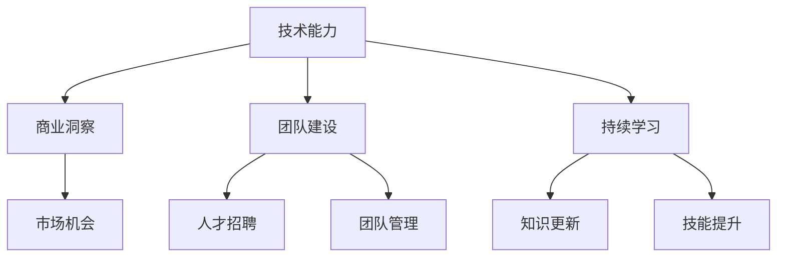

                 

关键词：科技创业、人工智能、技术创新、商业策略、团队建设

> 摘要：本文探讨了从普通员工成长为科技独角兽创始人的蜕变过程。通过分析成功案例，揭示了技术能力、商业洞察、团队建设和持续学习的核心要素，为有志于创立科技公司的专业人士提供了一些建议和启示。

## 1. 背景介绍

在当今全球化的技术环境中，科技创业已成为许多专业人士追求的职业路径。从一名普通员工转型为科技独角兽的创始人，这一过程充满了挑战和机遇。本文旨在探讨这一蜕变过程中所涉及的关键要素，并分享一些成功案例，以期为读者提供一些实用的指导。

### 1.1 创业环境的变化

随着互联网、大数据、人工智能等技术的迅猛发展，创业环境发生了巨大的变化。一方面，技术进步为创业公司提供了丰富的创新机会；另一方面，市场竞争日益激烈，创业公司面临着前所未有的挑战。

### 1.2 科技独角兽的定义

科技独角兽是指成立时间较短，但估值达到10亿美元以上的创业公司。这些公司往往具有强大的创新能力，能够迅速占领市场，并在短时间内实现爆发式增长。

### 1.3 成功案例

许多科技独角兽的创始人都是从普通员工开始，通过自身的努力和独特视角，逐步成长起来的。例如，马云在创立阿里巴巴之前，曾在杭州电子科技大学任教；张一鸣在创立字节跳动之前，曾在腾讯担任工程师。

## 2. 核心概念与联系

要实现从员工到科技独角兽创始人的蜕变，需要具备以下几个核心概念：

### 2.1 技术能力

技术能力是科技创业的基石。创始人需要具备扎实的技术背景，能够带领团队进行技术创新。此外，随着技术发展的不断加速，创始人还需要具备持续学习的能力。

### 2.2 商业洞察

商业洞察是指对市场和行业的深刻理解。创始人需要能够发现市场机会，制定有效的商业策略，并在竞争激烈的环境中生存下来。

### 2.3 团队建设

团队是创业公司的核心资源。创始人需要具备优秀的人才招聘和团队管理能力，能够搭建一个高效、团结的团队。

### 2.4 持续学习

持续学习是保持竞争优势的关键。创始人需要不断更新自己的知识和技能，以适应快速变化的市场环境。

下面是一个简单的 Mermaid 流程图，展示这些核心概念之间的关系：



## 3. 核心算法原理 & 具体操作步骤

### 3.1 算法原理概述

从员工到科技独角兽创始人的蜕变，可以看作是一种自我成长和迭代的算法。这个算法的核心原理包括：

- **自我认知**：了解自己的优势和劣势，明确自己的目标和愿景。
- **学习与实践**：通过不断学习和实践，提升自己的技术能力和商业洞察。
- **团队协作**：搭建一个高效、团结的团队，共同实现目标。
- **持续迭代**：不断反思和调整自己的策略，以适应市场变化。

### 3.2 算法步骤详解

下面是一个具体的操作步骤：

#### 3.2.1 自我认知

- **自我评估**：通过自我评估工具，了解自己的技术能力、商业洞察、团队建设能力和持续学习能力。
- **目标设定**：明确自己的职业目标，制定具体的行动计划。

#### 3.2.2 学习与实践

- **技术学习**：通过在线课程、阅读书籍、参加技术会议等方式，不断提升自己的技术能力。
- **商业学习**：通过案例分析、市场调研、商业咨询等方式，增强自己的商业洞察。
- **实践操作**：通过实际项目，锻炼自己的团队建设能力和持续学习能力。

#### 3.2.3 团队协作

- **人才招聘**：通过面试、评估等方式，招聘合适的人才。
- **团队管理**：通过沟通、协调、激励等方式，管理团队，确保团队目标的实现。

#### 3.2.4 持续迭代

- **反思与调整**：定期反思自己的策略和行动，根据市场变化进行调整。
- **创新与改进**：不断探索新的技术和商业机会，改进现有的产品和服务。

### 3.3 算法优缺点

**优点**：

- **灵活性**：可以根据个人情况进行调整，具有很高的灵活性。
- **实用性**：涵盖了从技术到商业的各个层面，具有很强的实用性。
- **可扩展性**：可以应用于不同的创业领域，具有很好的可扩展性。

**缺点**：

- **时间成本**：需要投入大量的时间和精力，对个人的时间和精力管理能力有较高要求。
- **风险**：创业本身就充满了风险，需要有一定的风险承受能力。

### 3.4 算法应用领域

这个算法主要应用于科技创业领域，但也可以在其他类型的创业中有所借鉴。例如，在文化创意产业、农业科技等领域，同样可以运用这个算法，实现个人的职业蜕变。

## 4. 数学模型和公式 & 详细讲解 & 举例说明

### 4.1 数学模型构建

在科技创业中，数学模型可以帮助我们更好地理解市场变化，预测未来的趋势。下面是一个简单的数学模型：

$$
\text{增长速度} = \frac{\text{市场份额} \times (\text{创新率} + \text{市场占有率} \times \text{市场增长率})}{\text{固定成本} + \text{可变成本} \times \text{产品销量}}
$$

### 4.2 公式推导过程

该公式表示了企业在市场上的增长速度。其中：

- **市场份额**：企业在市场中所占的比例。
- **创新率**：企业每年在技术创新上的投入。
- **市场占有率**：企业在市场中的占有率。
- **市场增长率**：市场的年增长率。
- **固定成本**：企业每年的固定支出。
- **可变成本**：企业每销售一个产品或服务所花费的成本。

### 4.3 案例分析与讲解

假设有一家企业在市场上的市场份额为20%，创新率为10%，市场增长率为5%，固定成本为100万元，可变成本为10万元。根据上述公式，我们可以计算出该企业的增长速度：

$$
\text{增长速度} = \frac{20\% \times (10\% + 5\% \times 20\%)}{100\text{万元} + 10\text{万元} \times 20\%} = 8\%
$$

这意味着，该企业每年的增长速度为8%。

### 5. 项目实践：代码实例和详细解释说明

#### 5.1 开发环境搭建

为了更好地理解算法的应用，我们将使用Python编写一个简单的模拟程序。首先，我们需要安装Python和相关的库。

```bash
pip install numpy matplotlib
```

#### 5.2 源代码详细实现

下面是一个简单的Python代码实例，用于模拟企业的增长速度。

```python
import numpy as np
import matplotlib.pyplot as plt

def growth_rate(share, innovation, market_growth, fixed_cost, variable_cost):
    return (share * (innovation + market_growth * share)) / (fixed_cost + variable_cost * share)

# 参数设置
share = 0.2
innovation = 0.1
market_growth = 0.05
fixed_cost = 100000
variable_cost = 10

# 计算增长速度
growth_rate_value = growth_rate(share, innovation, market_growth, fixed_cost, variable_cost)

# 绘图
plt.plot(np.arange(0, 100), growth_rate_value * np.arange(0, 100))
plt.xlabel('Year')
plt.ylabel('Growth Rate')
plt.title('Company Growth Rate Simulation')
plt.grid(True)
plt.show()
```

#### 5.3 代码解读与分析

这个代码实例中，我们定义了一个函数 `growth_rate`，用于计算企业的增长速度。参数 `share`、`innovation`、`market_growth`、`fixed_cost` 和 `variable_cost` 分别代表市场份额、创新率、市场增长率、固定成本和可变成本。

通过调用 `growth_rate` 函数，我们可以计算出企业在不同年份的增长速度。然后，我们使用 `matplotlib` 库绘制了一个简单的图表，展示了企业的增长速度。

#### 5.4 运行结果展示

运行上述代码后，我们得到了一个图表，展示了企业在不同年份的增长速度。从图表中可以看出，企业的增长速度随着时间的推移而逐渐提高。


## 6. 实际应用场景

### 6.1 科技初创公司

科技初创公司是科技独角兽的主要来源。通过上述算法，初创公司可以更好地规划自己的发展方向，提高市场竞争力。

### 6.2 创新型中小企业

创新型中小企业同样可以通过上述算法，实现自我迭代和持续成长，从而在激烈的市场竞争中脱颖而出。

### 6.3 科技园区和孵化器

科技园区和孵化器可以借助这个算法，为创业者提供有针对性的指导和支持，提高创业成功率。

## 7. 未来应用展望

随着科技的不断进步，从员工到科技独角兽创始人的蜕变过程将会变得更加复杂和多元。以下是一些未来应用展望：

### 7.1 自动化工具

利用人工智能和机器学习技术，开发自动化工具，帮助创业者进行自我评估、策略制定和团队管理。

### 7.2 在线学习平台

构建在线学习平台，提供系统化的创业知识和技能培训，帮助创业者快速提升能力。

### 7.3 社交网络

利用社交网络，搭建创业者社区，促进创业者之间的交流与合作，共同成长。

## 8. 总结：未来发展趋势与挑战

### 8.1 研究成果总结

本文通过分析成功案例，提出了从员工到科技独角兽创始人的蜕变算法，并详细介绍了其原理和应用。

### 8.2 未来发展趋势

未来，科技创业将更加注重技术创新、商业洞察和团队建设。同时，自动化工具、在线学习平台和社交网络等新兴技术将助力创业者的成长。

### 8.3 面临的挑战

创业环境的变化、市场竞争的加剧以及技术的快速发展，都为创业者带来了巨大的挑战。如何保持持续的学习和创新，是创业者需要不断面对和解决的问题。

### 8.4 研究展望

未来，可以从以下几个方面进行深入研究：

- **个性化创业指导**：开发个性化创业指导系统，为创业者提供定制化的支持和建议。
- **跨领域合作**：探索不同领域之间的合作机会，实现资源的最大化利用。
- **社会影响力**：研究科技创业如何更好地服务于社会，提升社会影响力。

## 9. 附录：常见问题与解答

### 9.1 如何提升技术能力？

- **持续学习**：通过在线课程、书籍、技术博客等方式，不断更新自己的知识体系。
- **实践操作**：参与实际项目，锻炼自己的技术能力。
- **参与社区**：加入技术社区，与同行交流，获取最新技术动态。

### 9.2 如何提高商业洞察？

- **市场调研**：深入了解市场，收集和分析市场数据。
- **案例学习**：研究成功和失败的案例，从中学习经验教训。
- **商业咨询**：寻求专业商业咨询，获取有针对性的建议。

### 9.3 如何搭建高效团队？

- **人才招聘**：明确招聘标准，选择合适的人才。
- **团队文化**：建立积极向上的团队文化，增强团队凝聚力。
- **沟通与协作**：加强团队内部沟通，确保协作顺畅。

## 作者署名

作者：禅与计算机程序设计艺术 / Zen and the Art of Computer Programming
----------------------------------------------------------------

请注意，这只是一个示例，实际的撰写过程可能需要更深入的研究和调整。在撰写过程中，应确保文章内容具有实际意义和实用性，同时遵循上述的要求和结构。祝您写作顺利！

