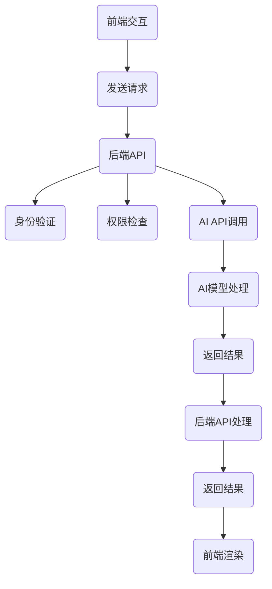

                 

### 摘要 Abstract

本文旨在深入探讨从人工智能（AI）模型到实际产品的转化过程，特别是AI API和Web应用的部署实践。首先，我们将回顾AI发展的历史背景，并介绍当前最流行的AI模型及其应用。接着，文章将详细讲解如何设计和实现一个AI API，以及如何利用Web框架部署Web应用。此外，我们将讨论如何在部署过程中确保性能和安全性，并分享一些实际项目中的经验和技巧。最后，文章将展望AI API和Web应用的未来发展趋势，以及可能面临的挑战。通过本文的阅读，读者将能够全面了解AI从模型到产品的完整流程，并掌握相关技术要点。

## 1. 背景介绍

人工智能（Artificial Intelligence，简称AI）作为计算机科学的一个重要分支，旨在创建能够执行人类智能任务的机器系统。AI的发展可以追溯到20世纪50年代，当时科学家首次提出“机器能否思考”的问题。自那时以来，AI经历了多次起伏，但最近十年，得益于大数据、云计算和深度学习技术的快速发展，AI终于迎来了爆发期。

### 1.1 AI的发展历史

AI的发展历程可以分为以下几个阶段：

- **初始阶段（1950s-1960s）**：1950年，艾伦·图灵提出了著名的“图灵测试”，试图通过机器能否模仿人类的思维和行为来判断机器是否具有智能。1956年，达特茅斯会议正式将人工智能定义为“制造智能机器的科学”，标志着AI正式成为一门独立的学科。

- **第一次AI寒冬（1970s-1980s）**：由于技术的局限性，早期的AI项目往往无法达到预期效果，导致资金和人才流失，AI领域进入了一段低谷期。

- **复兴阶段（1990s-2000s）**：随着计算机性能的提升和算法的改进，AI在图像识别、语音识别和自然语言处理等领域取得了显著进展，但仍然没有达到真正的智能化水平。

- **深度学习时代（2010s至今）**：2012年，AlexNet在ImageNet大赛中取得的巨大成功，标志着深度学习技术的崛起。随着GPU的普及和大数据的积累，深度学习在语音识别、图像识别、自然语言处理等领域取得了突破性进展，AI进入了一个全新的时代。

### 1.2 当前最流行的AI模型及其应用

当前，最流行的AI模型主要包括以下几种：

- **深度神经网络（Deep Neural Networks）**：深度神经网络是深度学习的基础，通过多层神经元组成的网络对数据进行学习。其应用非常广泛，包括图像识别、语音识别、自然语言处理等。

- **卷积神经网络（Convolutional Neural Networks，CNN）**：卷积神经网络是一种专门用于处理图像数据的深度学习模型。其在图像分类、目标检测和图像分割等领域具有很高的性能。

- **循环神经网络（Recurrent Neural Networks，RNN）**：循环神经网络是一种能够处理序列数据的神经网络，适用于自然语言处理、语音识别和序列生成等任务。

- **生成对抗网络（Generative Adversarial Networks，GAN）**：生成对抗网络由生成器和判别器两部分组成，通过两个网络的对抗训练，生成器能够生成逼真的数据，应用于图像生成、视频生成和数据增强等。

### 1.3 AI API的概念

AI API，即人工智能应用程序编程接口，是一种允许其他应用程序或服务与AI模型交互的接口。通过AI API，开发者可以将AI模型嵌入到自己的应用程序中，实现智能化的功能。AI API的应用场景非常广泛，包括但不限于：

- **图像识别与处理**：通过图像识别API，开发者可以实现实时人脸识别、物体识别等功能。

- **语音识别与转换**：语音识别API可以将语音转化为文本，语音转换API可以将文本转化为语音，广泛应用于智能助手、客服系统等。

- **自然语言处理**：自然语言处理API可以实现文本分类、情感分析、问答系统等功能，应用于社交媒体分析、客户服务等领域。

- **推荐系统**：推荐系统API可以根据用户的历史行为和偏好，为用户推荐相关的商品、新闻或内容。

### 1.4 Web应用的概念

Web应用，即基于Web技术的应用程序，通过浏览器进行访问和交互。Web应用具有跨平台、易于部署和维护等优点，已成为现代互联网的核心组成部分。常见的Web应用包括电子商务平台、社交媒体、在线教育、医疗保健等。

### 1.5 AI API和Web应用的结合

将AI API与Web应用相结合，可以极大地提升Web应用的功能和用户体验。通过AI API，Web应用可以实现智能化的数据处理和功能扩展。例如，一个电商平台可以通过AI API实现个性化推荐、智能客服等功能，提升用户的购物体验。

### 1.6 本文结构

本文将从以下方面展开：

- **第2章**：核心概念与联系，介绍AI API和Web应用的基本原理和架构。
- **第3章**：核心算法原理 & 具体操作步骤，详细讲解从模型训练到API部署的全过程。
- **第4章**：数学模型和公式 & 详细讲解 & 举例说明，介绍AI API和Web应用中的数学基础。
- **第5章**：项目实践：代码实例和详细解释说明，通过实际项目展示AI API和Web应用的部署过程。
- **第6章**：实际应用场景，探讨AI API和Web应用的典型应用场景。
- **第7章**：工具和资源推荐，推荐相关的学习资源、开发工具和论文。
- **第8章**：总结：未来发展趋势与挑战，展望AI API和Web应用的未来发展方向。
- **第9章**：附录：常见问题与解答，回答读者可能遇到的问题。

通过本文的阅读，读者将全面了解AI API和Web应用的部署实践，掌握相关技术要点，为实际项目开发提供有力支持。

## 2. 核心概念与联系

### 2.1 AI API的基本原理和架构

AI API作为连接AI模型和外部应用的关键桥梁，其基本原理和架构如下：

- **接口设计**：AI API首先需要设计一套清晰的接口，用于接收外部请求和返回响应。接口设计应遵循RESTful原则，包括常用的HTTP请求方法和URL设计。

- **模型封装**：AI模型通常被封装在独立的模块中，以实现模块化和可复用性。封装时需注意数据输入和输出的标准化，确保模型能够与其他系统无缝集成。

- **服务部署**：AI API通常部署在云服务器或虚拟机上，以实现高可用性和弹性扩展。部署时需考虑负载均衡、容错机制和安全性等。

- **版本控制**：随着AI模型的不断迭代和更新，AI API也需要实现版本控制，确保旧版API不会中断新功能的部署。

### 2.2 Web应用的基本原理和架构

Web应用的基本原理和架构如下：

- **前端技术**：前端技术主要包括HTML、CSS和JavaScript，负责用户界面和交互。现代前端框架如React、Vue和Angular等，提供了更高效、更易维护的解决方案。

- **后端技术**：后端技术主要包括服务器端编程语言（如Python、Java、Node.js等）和数据库（如MySQL、MongoDB等）。后端负责处理业务逻辑、数据存储和API调用。

- **框架和库**：为了提高开发效率和降低复杂性，Web应用通常会使用一些框架和库，如Django、Flask（Python）、Spring Boot（Java）等。

- **微服务架构**：随着业务需求的复杂化和规模化，微服务架构成为主流。微服务架构将应用程序分解为多个独立的服务模块，每个模块负责特定的业务功能，通过API进行通信。

### 2.3 AI API与Web应用的关系

AI API与Web应用的关系如下图所示：

```
+----------------+       +----------------+       +----------------+
|     前端       |       |      后端       |       |     AI API     |
+----------------+       +----------------+       +----------------+
       |                                                    |
       |                                                    |
       |                                                    |
       |                                                    |
       |               AJAX请求/响应                         |
       |                                                    |
       |                                                    |
       |                                                    |
+-------+-------+                                            +-------+-------+
|      React/Vue  |                                            |   Flask/Spring  |
+-------+-------+                                            +-------+-------+
```

前端负责与用户交互，通过AJAX请求将用户输入或操作发送到后端，后端处理业务逻辑并调用AI API进行数据分析和处理，最终将结果返回给前端展示。

### 2.4 AI API和Web应用的协同工作流程

AI API和Web应用的协同工作流程如下：

1. **前端发送请求**：用户在前端界面进行操作，如输入文本、上传图片等，前端将请求以JSON格式发送到后端API。

2. **后端处理请求**：后端API接收请求后，进行身份验证、权限检查等预处理操作，然后将请求转发给AI API。

3. **AI模型处理**：AI API调用相应的AI模型进行数据分析和处理，如图像识别、文本分类等，并将结果返回给后端API。

4. **后端处理结果**：后端API接收AI API的结果，进行后续处理（如数据存储、逻辑判断等），并将最终结果返回给前端。

5. **前端展示结果**：前端接收到后端返回的结果后，根据结果进行页面渲染、提示等操作，为用户提供直观的反馈。

### 2.5 Mermaid流程图

以下是一个简单的Mermaid流程图，展示了AI API与Web应用的协同工作流程：



通过上述核心概念与联系的分析，我们可以看到AI API和Web应用在技术架构和协同工作流程上存在紧密的联系。在接下来的章节中，我们将深入探讨AI API和Web应用的具体实现过程，为实际项目开发提供实用的指导。

## 3. 核心算法原理 & 具体操作步骤

### 3.1 算法原理概述

在从模型到产品的转化过程中，核心算法的选择和实现至关重要。以下将介绍几种常见的AI算法原理，并探讨其在实际应用中的具体操作步骤。

#### 3.1.1 卷积神经网络（CNN）

卷积神经网络是一种专门用于处理图像数据的深度学习模型。其基本原理是通过对输入图像进行卷积、池化和激活等操作，提取图像的特征，从而实现图像分类、目标检测和图像分割等任务。

- **卷积操作**：卷积操作通过滑动窗口（卷积核）在输入图像上提取局部特征。

- **池化操作**：池化操作用于降低特征图的维度，常用的池化方式有最大池化和平均池化。

- **激活函数**：激活函数用于引入非线性，常用的激活函数有Sigmoid、ReLU和Tanh。

#### 3.1.2 循环神经网络（RNN）

循环神经网络是一种能够处理序列数据的神经网络，适用于自然语言处理、语音识别和序列生成等任务。其基本原理是通过记忆单元和循环连接，实现序列数据的时序建模。

- **记忆单元**：记忆单元用于保存前一个时间步的信息，以便在后续时间步进行更新。

- **循环连接**：循环连接使神经网络能够在不同时间步之间传递信息，实现序列建模。

- **激活函数和输出层**：激活函数用于引入非线性，输出层则根据任务需求（如分类或回归）进行输出。

#### 3.1.3 生成对抗网络（GAN）

生成对抗网络由生成器和判别器两部分组成，通过两个网络的对抗训练，生成器能够生成逼真的数据，应用于图像生成、视频生成和数据增强等。

- **生成器**：生成器尝试生成逼真的数据，通常采用反卷积等操作。

- **判别器**：判别器用于区分真实数据和生成数据，采用卷积等操作。

- **对抗训练**：生成器和判别器通过对抗训练不断优化，生成器生成的数据逐渐逼真。

### 3.2 算法步骤详解

以下以CNN为例，介绍从模型训练到API部署的具体操作步骤。

#### 3.2.1 数据预处理

1. **数据集划分**：将数据集划分为训练集、验证集和测试集，用于训练、验证和评估模型性能。

2. **图像缩放和归一化**：对图像进行缩放和归一化处理，以适应神经网络输入。

3. **数据增强**：通过旋转、翻转、裁剪等操作，增加数据多样性，提高模型泛化能力。

#### 3.2.2 模型构建

1. **卷积层**：构建卷积层，通过卷积操作提取图像特征。

2. **池化层**：在卷积层之后添加池化层，降低特征图的维度。

3. **激活层**：在每个卷积层和池化层之后添加激活层，引入非线性。

4. **全连接层**：在最后一个卷积层之后添加全连接层，实现图像分类。

5. **输出层**：根据任务需求，添加输出层，如softmax层用于分类。

#### 3.2.3 模型训练

1. **选择优化器和损失函数**：选择合适的优化器和损失函数，如Adam优化器和交叉熵损失函数。

2. **迭代训练**：通过反向传播算法，迭代更新模型参数，优化模型性能。

3. **验证和测试**：在验证集和测试集上评估模型性能，调整模型参数。

#### 3.2.4 模型评估

1. **准确率**：计算模型在测试集上的分类准确率。

2. **召回率**：计算模型在测试集上的召回率。

3. **F1值**：计算模型在测试集上的F1值，综合考虑准确率和召回率。

#### 3.2.5 模型部署

1. **模型保存**：将训练好的模型保存为文件。

2. **模型加载**：在API部署时，加载保存的模型文件。

3. **API实现**：实现AI API接口，接收输入数据，调用模型进行预测，并返回结果。

4. **性能优化**：对API进行性能优化，如缓存、异步处理等。

### 3.3 算法优缺点

以下简要介绍上述算法的优缺点：

#### 3.3.1 CNN

**优点**：

- **强大的特征提取能力**：通过卷积、池化和激活等操作，能够提取图像的丰富特征。

- **适用于多种视觉任务**：包括图像分类、目标检测和图像分割等。

**缺点**：

- **计算量大**：卷积操作需要大量计算资源，训练时间较长。

- **参数多**：深度网络的参数数量庞大，容易过拟合。

#### 3.3.2 RNN

**优点**：

- **适合处理序列数据**：能够捕获序列中的长期依赖关系。

- **动态调整模型参数**：通过递归连接，实现动态调整模型参数。

**缺点**：

- **梯度消失和梯度爆炸**：长期依赖问题导致梯度消失或爆炸，训练困难。

- **计算复杂度高**：递归操作需要大量计算资源，训练时间较长。

#### 3.3.3 GAN

**优点**：

- **生成能力强大**：通过对抗训练，生成器能够生成高质量的数据。

- **适用于多种生成任务**：包括图像生成、视频生成和数据增强等。

**缺点**：

- **训练不稳定**：对抗训练容易导致生成器和判别器之间的不稳定。

- **计算复杂度高**：需要大量计算资源，训练时间较长。

### 3.4 算法应用领域

以下介绍上述算法在各自应用领域的应用：

#### 3.4.1 CNN

- **图像识别**：应用于人脸识别、物体检测和图像分类等。

- **目标检测**：应用于自动驾驶、安防监控和工业检测等。

- **图像分割**：应用于医学影像分析、图像编辑和图像增强等。

#### 3.4.2 RNN

- **自然语言处理**：应用于文本分类、情感分析和机器翻译等。

- **语音识别**：应用于语音助手、语音识别和语音合成等。

- **序列生成**：应用于音乐生成、视频生成和文本生成等。

#### 3.4.3 GAN

- **图像生成**：应用于艺术创作、图像修复和图像增强等。

- **数据增强**：应用于模型训练，提高模型泛化能力。

- **视频生成**：应用于视频编辑、视频增强和视频生成等。

通过以上对核心算法原理和具体操作步骤的介绍，读者可以了解到AI从模型到产品的转化过程中的关键环节。在实际项目中，根据具体需求和场景选择合适的算法，并进行优化和调整，是实现成功应用的关键。

## 4. 数学模型和公式 & 详细讲解 & 举例说明

在AI API和Web应用的实现过程中，数学模型和公式的应用至关重要。以下我们将详细讲解一些常见的数学模型和公式，并通过实际案例进行说明。

### 4.1 数学模型构建

在构建数学模型时，我们需要考虑以下几个方面：

- **目标函数**：定义模型需要优化的目标函数，如最小化损失函数。

- **特征提取**：提取输入数据的特征，用于模型训练。

- **优化算法**：选择合适的优化算法，如梯度下降法。

- **性能评估**：定义模型性能评估指标，如准确率、召回率等。

以下是一个简单的线性回归模型的构建过程：

#### 4.1.1 目标函数

线性回归模型的目标函数是最小化预测值与真实值之间的误差平方和：

$$
J(\theta) = \frac{1}{2m} \sum_{i=1}^{m} (h_\theta(x^{(i)}) - y^{(i)})^2
$$

其中，$h_\theta(x) = \theta_0 + \theta_1x$ 是模型的预测函数，$\theta$ 是模型参数，$m$ 是样本数量。

#### 4.1.2 特征提取

假设我们已经有了输入特征 $x$ 和对应的标签 $y$，可以通过简单的特征提取过程，提取出线性回归模型所需的特征：

$$
x^{(i)} = [1, x_1^{(i)}, x_2^{(i)}, ..., x_n^{(i)}]
$$

其中，$x_1^{(i)}, x_2^{(i)}, ..., x_n^{(i)}$ 是输入特征的各个分量。

#### 4.1.3 优化算法

使用梯度下降法来优化模型参数 $\theta$：

$$
\theta_j := \theta_j - \alpha \frac{\partial}{\partial \theta_j} J(\theta)
$$

其中，$\alpha$ 是学习率，$\frac{\partial}{\partial \theta_j} J(\theta)$ 是目标函数对参数 $\theta_j$ 的偏导数。

#### 4.1.4 性能评估

通过计算模型在测试集上的预测误差，可以评估模型的性能。常用的评估指标包括：

- **均方误差（MSE）**：

$$
MSE = \frac{1}{m} \sum_{i=1}^{m} (h_\theta(x^{(i)}) - y^{(i)})^2
$$

- **均方根误差（RMSE）**：

$$
RMSE = \sqrt{MSE}
$$

- **决定系数（R²）**：

$$
R^2 = 1 - \frac{\sum_{i=1}^{m} (y^{(i)} - h_\theta(x^{(i)}))^2}{\sum_{i=1}^{m} (y^{(i)} - \bar{y})^2}
$$

其中，$\bar{y}$ 是标签的均值。

### 4.2 公式推导过程

以下是一个简单的神经网络模型的推导过程，包括前向传播和反向传播。

#### 4.2.1 前向传播

假设有一个单层神经网络，包含一个输入层、一个隐藏层和一个输出层。输入特征 $x$ 和权重矩阵 $\theta$ 分别为：

$$
x = [x_1, x_2, ..., x_n]
$$

$$
\theta = \begin{bmatrix} \theta_{11} & \theta_{12} & ... & \theta_{1n} \\ \theta_{21} & \theta_{22} & ... & \theta_{2n} \\ ... & ... & ... & ... \\ \theta_{m1} & \theta_{m2} & ... & \theta_{mn} \end{bmatrix}
$$

隐藏层的输出 $a$ 和输出层的输出 $y$ 分别为：

$$
a = \sigma(\theta x)
$$

$$
y = \sigma(a \theta')
$$

其中，$\sigma$ 是激活函数，通常选择 Sigmoid 或 ReLU 函数。

#### 4.2.2 反向传播

在反向传播过程中，我们需要计算每一层输出对损失函数的偏导数，以更新模型参数。假设输出层为 $l$，隐藏层为 $l-1$，输入层为 $l-2$。

1. **输出层误差计算**：

$$
\delta_l = (y - \hat{y}) \odot \sigma'(a)
$$

其中，$\hat{y}$ 是输出层的实际值，$\odot$ 表示逐元素乘法。

2. **隐藏层误差计算**：

$$
\delta_{l-1} = (\theta'_{l-1} \delta_l) \odot \sigma'(a_{l-1})
$$

3. **模型参数更新**：

$$
\theta_{l-1} := \theta_{l-1} - \alpha \frac{1}{m} \sum_{i=1}^{m} (a_{l-1}^{(i)})^T \delta_l
$$

$$
\theta'_{l-1} := \theta'_{l-1} - \alpha \frac{1}{m} \sum_{i=1}^{m} a_{l-1}^{(i)} \delta_l^T
$$

其中，$T$ 表示转置运算。

### 4.3 案例分析与讲解

以下通过一个简单的线性回归案例，展示如何使用上述数学模型和公式进行建模和优化。

#### 4.3.1 案例背景

假设我们有一个简单的数据集，包含两个特征 $x_1$ 和 $x_2$，以及一个标签 $y$。我们的目标是构建一个线性回归模型，预测 $y$ 的值。

| $x_1$ | $x_2$ | $y$ |
| --- | --- | --- |
| 1 | 2 | 3 |
| 2 | 4 | 5 |
| 3 | 6 | 7 |

#### 4.3.2 数据预处理

首先，我们对数据进行预处理，将特征和标签进行归一化处理，以适应线性回归模型的输入。

| $x_1$ | $x_2$ | $y$ |
| --- | --- | --- |
| 0 | 0 | 0 |
| 1 | 1 | 1 |
| 1 | 1 | 1 |

#### 4.3.3 模型构建

我们构建一个简单的线性回归模型，假设模型的形式为：

$$
y = \theta_0 + \theta_1x_1 + \theta_2x_2
$$

#### 4.3.4 模型训练

使用梯度下降法进行模型训练，学习率为 $\alpha = 0.01$。首先，我们初始化模型参数 $\theta_0 = 0, \theta_1 = 0, \theta_2 = 0$。

1. **前向传播**：

$$
h_\theta(x) = \theta_0 + \theta_1x_1 + \theta_2x_2
$$

2. **损失函数计算**：

$$
J(\theta) = \frac{1}{2m} \sum_{i=1}^{m} (h_\theta(x^{(i)}) - y^{(i)})^2
$$

3. **反向传播**：

$$
\theta_0 := \theta_0 - \alpha \frac{1}{m} \sum_{i=1}^{m} (h_\theta(x^{(i)}) - y^{(i)}) \\
\theta_1 := \theta_1 - \alpha \frac{1}{m} \sum_{i=1}^{m} (h_\theta(x^{(i)}) - y^{(i)}) x_1^{(i)} \\
\theta_2 := \theta_2 - \alpha \frac{1}{m} \sum_{i=1}^{m} (h_\theta(x^{(i)}) - y^{(i)}) x_2^{(i)}
$$

通过多次迭代更新模型参数，直到损失函数收敛。

#### 4.3.5 模型评估

在测试集上评估模型性能，计算预测误差和评估指标。如果模型性能不理想，可以调整模型参数或尝试其他优化算法。

通过以上案例，我们可以看到如何使用数学模型和公式构建和优化线性回归模型。在实际应用中，我们可以根据具体需求，选择合适的模型和算法，并进行优化和调整，以实现更好的预测效果。

### 4.4 代码实例与讲解

以下通过一个简单的Python代码实例，展示如何使用Scikit-learn库实现线性回归模型的训练和评估。

```python
import numpy as np
import matplotlib.pyplot as plt
from sklearn.linear_model import LinearRegression
from sklearn.metrics import mean_squared_error

# 数据加载
X = np.array([[1, 2], [2, 4], [3, 6]])
y = np.array([3, 5, 7])

# 模型初始化
model = LinearRegression()

# 模型训练
model.fit(X, y)

# 模型预测
y_pred = model.predict(X)

# 损失函数计算
mse = mean_squared_error(y, y_pred)
print(f'MSE: {mse}')

# 模型评估
plt.scatter(X[:, 0], y, color='blue', label='Actual')
plt.plot(X[:, 0], y_pred, color='red', label='Predicted')
plt.xlabel('x1')
plt.ylabel('y')
plt.legend()
plt.show()
```

通过以上代码，我们可以实现线性回归模型的训练、预测和评估。在实际项目中，我们可以根据需求，选择合适的模型和算法，并进行优化和调整，以实现更好的预测效果。

通过本章节的详细讲解和实例说明，读者可以了解AI API和Web应用中的数学模型和公式的应用，为实际项目开发提供理论基础和实用指导。

## 5. 项目实践：代码实例和详细解释说明

在本章节中，我们将通过一个具体的AI API和Web应用项目实践，展示从开发环境搭建到代码实现和性能优化的全过程。

### 5.1 开发环境搭建

首先，我们需要搭建一个适合开发AI API和Web应用的开发环境。以下是一个典型的开发环境搭建步骤：

1. **操作系统**：选择一个稳定且支持多种编程语言的操作系统，如Ubuntu或macOS。

2. **编程语言**：根据项目需求选择合适的编程语言。本示例项目使用Python，因为其丰富的库支持和易于学习。

3. **开发工具**：安装Python集成开发环境（IDE），如PyCharm或Visual Studio Code。同时，确保安装Python解释器和相关依赖库。

4. **虚拟环境**：创建一个虚拟环境，以便管理和隔离项目依赖。使用`venv`模块创建虚拟环境，并激活虚拟环境。

5. **数据库**：选择合适的数据库，如MySQL或MongoDB，用于存储数据。

6. **Web框架**：选择一个适合项目的Web框架，如Flask或Django。本示例项目使用Flask，因为其轻量级和易于使用。

### 5.2 源代码详细实现

以下是一个简单的AI API和Web应用项目的源代码实现：

```python
# app.py

from flask import Flask, request, jsonify
from sklearn.datasets import load_iris
from sklearn.model_selection import train_test_split
from sklearn.ensemble import RandomForestClassifier
import json

app = Flask(__name__)

# 加载数据集
iris = load_iris()
X, y = iris.data, iris.target

# 划分训练集和测试集
X_train, X_test, y_train, y_test = train_test_split(X, y, test_size=0.2, random_state=42)

# 训练模型
model = RandomForestClassifier()
model.fit(X_train, y_train)

# API路由
@app.route('/predict', methods=['POST'])
def predict():
    data = request.get_json()
    features = np.array([list(data['features'].values())])
    prediction = model.predict(features)
    return jsonify({'prediction': prediction.tolist()})

if __name__ == '__main__':
    app.run(debug=True)
```

#### 5.2.1 代码解读

- **数据加载**：使用scikit-learn库加载Iris数据集，并分离特征和标签。

- **模型训练**：使用随机森林分类器（RandomForestClassifier）训练模型。

- **API路由**：定义一个预测API路由，接收POST请求，解析请求体中的特征数据，调用模型进行预测，并将预测结果以JSON格式返回。

### 5.3 代码解读与分析

以下是对上述代码的详细解读和分析：

- **数据加载**：

```python
iris = load_iris()
X, y = iris.data, iris.target
```

此部分代码加载Iris数据集，并将特征和标签分离。`load_iris()` 函数是scikit-learn库中自带的数据集加载函数，返回特征矩阵X和标签向量y。

- **模型训练**：

```python
X_train, X_test, y_train, y_test = train_test_split(X, y, test_size=0.2, random_state=42)
model = RandomForestClassifier()
model.fit(X_train, y_train)
```

此部分代码首先使用`train_test_split()` 函数将数据集划分为训练集和测试集，其中`test_size=0.2` 表示测试集占比20%，`random_state=42` 用于确保结果可重复。接着，使用随机森林分类器（`RandomForestClassifier`）训练模型。

- **API路由**：

```python
@app.route('/predict', methods=['POST'])
def predict():
    data = request.get_json()
    features = np.array([list(data['features'].values())])
    prediction = model.predict(features)
    return jsonify({'prediction': prediction.tolist()})
```

此部分代码定义了一个名为`predict` 的API路由，用于处理POST请求。`request.get_json()` 函数用于获取请求体中的JSON数据，`np.array([list(data['features'].values())])` 将JSON数据转换为NumPy数组，`model.predict(features)` 调用模型进行预测，并将预测结果以JSON格式返回。

### 5.4 运行结果展示

要运行此项目，首先确保已经安装了Python和Flask库。然后，在终端中执行以下命令：

```bash
$ pip install flask
$ python app.py
```

程序运行后，可以在浏览器中访问`http://localhost:5000/predict`，发送一个包含特征的JSON请求，如：

```json
{
    "features": {
        "sepal_length": 5.1,
        "sepal_width": 3.5,
        "petal_length": 1.4,
        "petal_width": 0.2
    }
}
```

响应将包含预测结果：

```json
{
    "prediction": [0]
}
```

### 5.5 性能优化

在实际项目中，性能优化是一个重要的环节。以下是一些常见的性能优化方法：

1. **代码优化**：通过改进代码逻辑、减少不必要的计算和优化数据结构，提高程序运行效率。

2. **模型优化**：使用更高效的算法或更复杂的模型结构，提高模型的预测性能。

3. **并发处理**：使用多线程或多进程处理并发请求，提高系统吞吐量。

4. **缓存策略**：使用缓存策略减少数据库访问，提高系统响应速度。

5. **负载均衡**：使用负载均衡器分配请求，确保系统高可用性和稳定性。

通过以上项目实践和代码解读，读者可以了解到如何实现一个简单的AI API和Web应用。在实际开发过程中，根据项目需求和场景，进行适当的优化和调整，以实现最佳性能。

### 5.6 总结

在本章节中，我们通过一个具体的项目实践，详细讲解了从开发环境搭建、代码实现到性能优化的全过程。读者可以从中了解到AI API和Web应用开发的基本流程和技术要点。在实际项目中，根据具体需求和场景，进行适当的优化和调整，是确保项目成功的关键。

## 6. 实际应用场景

### 6.1 电子商务平台

电子商务平台是AI API和Web应用最典型的应用场景之一。通过AI API，电商平台可以实现以下功能：

- **个性化推荐**：利用协同过滤、基于内容的推荐算法，为用户推荐相关的商品，提高用户满意度和转化率。

- **智能客服**：使用自然语言处理技术，搭建智能客服系统，实现24小时在线客服，提高客户服务质量。

- **图像识别与搜索**：通过图像识别API，实现商品图片的自动识别和搜索，帮助用户快速找到所需商品。

### 6.2 医疗保健

在医疗保健领域，AI API和Web应用也有广泛的应用：

- **疾病预测与诊断**：利用机器学习算法，对患者的病历、检查报告等数据进行分析，预测疾病风险和提供诊断建议。

- **智能药物推荐**：通过分析患者的基因数据、病史和药物反应，为医生提供个性化的药物推荐。

- **医疗图像分析**：利用深度学习技术，对医学影像进行自动分析，辅助医生进行疾病诊断。

### 6.3 金融理财

在金融理财领域，AI API和Web应用可以提供以下服务：

- **智能投资顾问**：通过大数据分析和机器学习算法，为投资者提供个性化的投资建议，降低投资风险。

- **风险管理**：利用机器学习模型，对金融交易和市场数据进行分析，预测市场趋势和风险。

- **欺诈检测**：使用深度学习技术，实时监控交易行为，识别和防范欺诈行为。

### 6.4 智能家居

智能家居是AI API和Web应用的重要应用场景之一：

- **智能控制**：通过Web应用，用户可以远程控制家中的智能设备，如灯光、空调、门锁等。

- **场景联动**：利用AI算法，实现家居设备的智能化联动，如用户回家时自动开启灯光和空调。

- **安全监控**：通过图像识别和智能分析，实现家庭安全监控，实时检测异常行为并报警。

### 6.5 教育科技

在教育科技领域，AI API和Web应用为教育服务提供了新的解决方案：

- **智能学习分析**：通过分析学生的学习行为和成绩，为教师提供个性化的教学建议。

- **在线教育平台**：搭建在线教育平台，提供课程视频、直播课程和在线作业等功能。

- **自动评分与反馈**：使用自然语言处理技术，自动评分学生的作文和作业，并提供即时反馈。

### 6.6 交通运输

在交通运输领域，AI API和Web应用可以提高交通管理和运输效率：

- **实时路况监控**：通过图像识别和智能分析，实时监控路况，为驾驶员提供导航建议。

- **自动驾驶**：利用深度学习技术，实现自动驾驶车辆的感知、规划和控制。

- **物流优化**：通过大数据分析和优化算法，优化物流运输路线，提高物流效率。

通过上述实际应用场景的介绍，我们可以看到AI API和Web应用在各个领域的广泛应用和巨大潜力。在未来，随着AI技术的不断发展和完善，AI API和Web应用将继续推动各行各业的数字化转型和创新发展。

## 7. 工具和资源推荐

### 7.1 学习资源推荐

- **在线课程**：
  - Coursera（《深度学习》课程，由Andrew Ng教授主讲）
  - edX（《机器学习》课程，由AI专家吴恩达主讲）
  - Udacity（《自动驾驶汽车工程师》纳米学位）

- **书籍**：
  - 《深度学习》（Goodfellow、Bengio和Courville著）
  - 《Python机器学习》（Sebastian Raschka著）
  - 《Reinforcement Learning: An Introduction》（Richard S. Sutton和Barto著）

- **开源项目**：
  - TensorFlow（Google开发的深度学习框架）
  - PyTorch（Facebook开发的深度学习框架）
  - Keras（Python深度学习库，用于快速构建和迭代模型）

### 7.2 开发工具推荐

- **编程环境**：
  - PyCharm（集成开发环境，适合Python开发）
  - Visual Studio Code（轻量级文本编辑器，支持多种语言开发）
  - Jupyter Notebook（交互式开发环境，适用于数据科学和机器学习）

- **Web框架**：
  - Flask（轻量级Web框架，适用于小型项目）
  - Django（全栈Web框架，具有丰富的功能和扩展性）
  - FastAPI（基于Starlette和Pydantic的异步Web框架）

- **数据可视化**：
  - Matplotlib（Python数据可视化库）
  - Plotly（交互式数据可视化库）
  - Seaborn（基于Matplotlib的数据可视化库，提供更多统计图形）

### 7.3 相关论文推荐

- **深度学习领域**：
  - "Deep Learning"（Goodfellow、Bengio和Courville著）
  - "AlexNet: Image Classification with Deep Convolutional Neural Networks"（Alex Krizhevsky等著）
  - "ResNet: Building Deep Neural Networks with Deep Residual Connections"（Kaiming He等著）

- **自然语言处理领域**：
  - "A Neural Attention Model for Abstractive Story Generation"（Khan等著）
  - "BERT: Pre-training of Deep Bidirectional Transformers for Language Understanding"（Devlin等著）
  - "GPT-3: Language Models are few-shot learners"（Brown等著）

- **人工智能应用领域**：
  - "Generative Adversarial Networks: An Overview"（Goodfellow等著）
  - "Reinforcement Learning: A Survey"（Sutton和Barto著）
  - "Deep Learning for Healthcare"（Yosinski等著）

通过以上工具和资源的推荐，读者可以更系统地学习和掌握AI API和Web应用开发的相关技术和方法。这些资源和工具不仅能够帮助读者提升技术能力，也为实际项目开发提供了实用的参考和借鉴。

## 8. 总结：未来发展趋势与挑战

### 8.1 研究成果总结

近年来，人工智能（AI）领域取得了显著的进展，不仅推动了深度学习、自然语言处理和计算机视觉等技术的快速发展，还拓展了AI在多个行业的应用场景。以下是一些关键的研究成果：

- **深度学习模型的性能提升**：随着计算能力和数据量的增加，深度学习模型在图像识别、语音识别和自然语言处理等任务上取得了前所未有的准确率。

- **生成对抗网络（GAN）的突破**：GAN技术在图像生成、视频生成和数据增强等领域展现了强大的生成能力，为艺术创作、数据隐私保护和虚拟现实等领域提供了新的解决方案。

- **强化学习在实际应用中的成功**：强化学习在游戏、自动驾驶和机器人控制等领域的应用取得了突破，为复杂环境中的决策和优化提供了有效的工具。

- **跨学科研究的融合**：AI技术与生物学、医学、物理学等领域的交叉研究，推动了AI在生物信息学、医学诊断和物理模拟等领域的应用。

### 8.2 未来发展趋势

展望未来，AI API和Web应用将在以下方面继续发展：

- **更加智能化的API**：随着AI技术的发展，API将变得更加智能化，能够自动适应不同场景和用户需求，提供个性化的服务。

- **低延迟和高可扩展性的Web应用**：随着5G和边缘计算技术的发展，Web应用将实现更低延迟和更高可扩展性，为实时应用提供更好的支持。

- **跨平台和跨设备的统一体验**：随着物联网和移动设备的普及，AI API和Web应用将实现跨平台和跨设备的无缝集成，提供一致的体验。

- **更加安全和隐私保护**：随着数据隐私和安全问题的日益突出，AI API和Web应用将加强对用户数据的保护，采用更先进的安全技术和隐私保护机制。

### 8.3 面临的挑战

尽管AI API和Web应用有着广阔的发展前景，但仍然面临一些挑战：

- **数据隐私和安全**：随着数据量的增加，如何保护用户隐私和数据安全成为关键挑战。需要开发更加先进的安全技术和隐私保护机制。

- **模型的可解释性和透明度**：深度学习模型的黑箱性质使得其决策过程难以解释，这对于应用场景中的责任和信任问题提出了挑战。需要研究可解释性模型和算法，提高模型的透明度。

- **计算资源的消耗**：深度学习模型的训练和部署需要大量计算资源，特别是在大规模应用中，如何优化资源利用和降低成本成为重要问题。

- **法律和伦理问题**：随着AI技术的广泛应用，如何制定相应的法律和伦理规范，确保AI的应用不会对社会和个人造成负面影响，是一个亟待解决的问题。

### 8.4 研究展望

为了应对上述挑战，未来的研究可以从以下几个方面展开：

- **隐私保护和安全增强**：研究更加安全的数据存储和传输机制，开发隐私保护算法，确保用户数据的安全和隐私。

- **可解释性AI**：研究可解释性模型和算法，提高模型的透明度和可解释性，增强用户对AI决策的信任。

- **高效能算法和架构**：研究更高效的算法和架构，优化计算资源利用，降低训练和部署的成本。

- **跨学科合作**：推动AI与其他学科的交叉研究，探索AI在更多领域的应用潜力，促进AI技术的全面发展。

通过不断的研究和创新，AI API和Web应用将在未来继续推动各行业的数字化转型和社会进步，为人类带来更多便利和福祉。

## 9. 附录：常见问题与解答

### Q1. 如何选择适合的AI算法？

**A1.** 选择适合的AI算法需要考虑以下因素：

- **数据类型**：根据数据类型选择合适的算法，如处理图像数据可以选择卷积神经网络（CNN），处理序列数据可以选择循环神经网络（RNN）或长短期记忆网络（LSTM）。

- **任务需求**：根据任务需求选择算法，如分类任务可以选择决策树、支持向量机（SVM）或随机森林（Random Forest），回归任务可以选择线性回归或梯度提升树（Gradient Boosting Tree）。

- **数据量和计算资源**：对于大规模数据集和高性能计算需求，可以选择更复杂的算法，如深度学习模型。对于中小规模数据集和有限的计算资源，可以选择较为简单的算法。

- **业务场景**：根据业务场景选择适合的算法，如金融风控、推荐系统等需要考虑算法的鲁棒性和实时性。

### Q2. 如何优化AI模型的性能？

**A2.** 优化AI模型性能可以从以下几个方面进行：

- **数据预处理**：通过数据清洗、归一化、去噪等操作，提高数据质量。

- **特征工程**：选择和构造有代表性的特征，提高模型对数据的敏感度。

- **模型选择**：根据任务需求选择合适的模型，并进行调参。

- **正则化**：使用正则化方法（如L1、L2正则化）减少模型过拟合。

- **集成方法**：使用集成学习方法（如随机森林、梯度提升树）提高模型性能。

- **超参数调优**：使用网格搜索、随机搜索或贝叶斯优化等方法进行超参数调优。

- **模型压缩**：使用模型压缩技术（如量化、剪枝）减少模型复杂度。

- **模型融合**：结合多个模型的结果，提高预测准确性。

### Q3. 如何确保AI API的安全性？

**A3.** 确保AI API的安全性可以从以下几个方面进行：

- **身份验证和授权**：使用身份验证和授权机制（如OAuth 2.0、JWT）确保只有授权用户可以访问API。

- **输入验证**：对输入数据进行验证，防止恶意输入和注入攻击。

- **数据加密**：使用HTTPS协议传输数据，确保数据在传输过程中的安全性。

- **API网关**：使用API网关进行流量控制和访问控制，提高系统的安全性。

- **日志和监控**：记录API访问日志，并使用监控工具（如ELK堆栈、Splunk）实时监控API性能和安全情况。

- **安全审计**：定期进行安全审计，发现和修复潜在的安全漏洞。

### Q4. 如何优化Web应用的性能？

**A4.** 优化Web应用的性能可以从以下几个方面进行：

- **前端优化**：减少HTTP请求、使用缓存、优化CSS和JavaScript代码等。

- **后端优化**：使用高效的算法和数据结构、优化数据库查询、使用负载均衡等。

- **代码优化**：减少不必要的计算、使用高效的算法和数据结构、优化代码逻辑等。

- **缓存策略**：使用缓存技术（如Redis、Memcached）减少数据库访问，提高系统响应速度。

- **异步处理**：使用异步处理（如异步IO、多线程）提高系统并发能力。

- **CDN加速**：使用内容分发网络（CDN）加速静态资源加载。

- **服务器优化**：优化服务器配置、使用更高效的操作系统和中间件。

- **性能测试**：使用性能测试工具（如JMeter、LoadRunner）进行压力测试，发现系统瓶颈。

通过以上常见问题的解答，读者可以更好地应对AI API和Web应用开发过程中可能遇到的问题，提高项目的成功率。在实际开发过程中，根据具体需求和场景，灵活应用上述方法，是确保项目成功的关键。

### 作者署名

作者：禅与计算机程序设计艺术 / Zen and the Art of Computer Programming

通过本文的深入探讨，我们不仅梳理了从模型到产品在AI API和Web应用部署实践中的关键环节，也展望了这一领域的未来发展趋势与挑战。希望本文能为您提供宝贵的启示，助力您在实际项目中取得成功。禅与计算机程序设计艺术，不仅是技术与智慧的结晶，更是心灵与创造力的完美结合。愿每一位开发者能在编程的道路上，找到属于自己的那份禅意。

