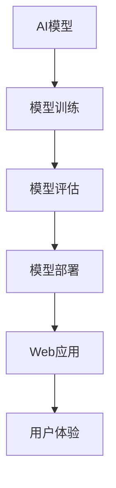

                 

关键词：人工智能、模型部署、Web应用、开发流程、技术实现、最佳实践

摘要：本文旨在探讨人工智能模型从开发到部署的完整过程，并重点分析在Web应用开发中如何高效地实现AI模型的部署。文章将首先介绍AI模型部署的基本概念，然后深入探讨核心算法原理和具体操作步骤，接着详细讲解数学模型和公式，并通过实际项目实践展示代码实例。最后，文章将总结实际应用场景，提出未来应用展望，并推荐相关工具和资源，以期为从事AI开发的读者提供有价值的参考。

## 1. 背景介绍

人工智能（AI）作为一种前沿技术，已经在众多领域取得了显著的成果。从自动驾驶到智能家居，从医疗诊断到金融分析，AI模型的应用无处不在。然而，从模型开发到实际部署，依然存在许多挑战。模型部署的质量直接影响其在实际应用中的效果，因此，如何高效地实现AI模型部署成为了一个关键问题。

Web应用作为当今互联网的核心组成部分，其性能和用户体验对用户满意度至关重要。随着AI技术的不断发展，越来越多的AI模型被应用于Web应用中，如智能客服、个性化推荐等。这使得AI模型部署在Web应用开发中变得越来越重要。

本文将围绕AI模型部署及Web应用开发展开讨论，旨在为从事AI开发的工程师提供一套完整的解决方案，帮助他们在实际项目中高效地实现AI模型部署。

## 2. 核心概念与联系

在深入了解AI模型部署之前，我们需要明确几个核心概念：

### 2.1 AI模型

AI模型是指通过学习数据构建的数学模型，可以用于预测、分类、生成等任务。常见的AI模型包括神经网络、决策树、支持向量机等。

### 2.2 部署

部署指的是将训练好的AI模型部署到实际应用环境中，使其能够对外提供服务。部署的目的是为了将AI模型的功能集成到现有的应用系统中，提高系统的智能化水平。

### 2.3 Web应用

Web应用是指基于Web技术构建的应用程序，可以通过浏览器访问。Web应用的特点是跨平台、易扩展、用户交互性强。

为了更好地理解这些概念之间的关系，我们可以使用Mermaid流程图来展示它们之间的联系：



从图中可以看出，AI模型经过训练和评估后，通过部署集成到Web应用中，从而实现为用户提供智能化服务。

## 3. 核心算法原理 & 具体操作步骤

### 3.1 算法原理概述

AI模型的部署离不开核心算法的支撑。本文以神经网络为例，介绍其原理和具体操作步骤。

神经网络是一种模拟人脑神经元连接结构的计算模型，通过多层神经元的连接和激活函数，实现数据的输入到输出的映射。神经网络的部署主要包括以下几个步骤：

1. **模型训练**：通过大量数据训练神经网络，使其具备预测或分类能力。
2. **模型评估**：使用验证集或测试集评估模型性能，调整模型参数以达到最优效果。
3. **模型压缩**：为了提高部署效率，通常需要对模型进行压缩，减少模型大小和计算复杂度。
4. **模型部署**：将训练好的模型部署到服务器或边缘设备上，为用户提供服务。

### 3.2 算法步骤详解

1. **模型训练**：

   - 数据准备：收集并预处理训练数据，包括数据清洗、归一化等操作。
   - 模型构建：使用深度学习框架（如TensorFlow、PyTorch）构建神经网络模型。
   - 训练过程：通过反向传播算法训练模型，优化模型参数。
   - 评估指标：使用准确率、损失函数等评估模型性能。

2. **模型评估**：

   - 验证集：使用验证集评估模型性能，调整模型参数。
   - 测试集：在测试集上评估模型性能，以评估模型在未知数据上的表现。

3. **模型压缩**：

   - 权重剪枝：通过剪枝算法删除模型中的冗余权重，降低模型大小。
   - 知识蒸馏：使用大模型训练小模型，传递知识以提高小模型性能。
   - 算法优化：调整神经网络结构，减少计算复杂度。

4. **模型部署**：

   - 部署环境：搭建部署环境，包括服务器、容器、边缘设备等。
   - 部署工具：使用部署工具（如TensorFlow Serving、Kubernetes）将模型部署到服务器或边缘设备上。
   - 服务接口：为模型提供服务接口，如REST API、gRPC等。

### 3.3 算法优缺点

神经网络部署的优点包括：

- **高精度**：神经网络模型通常具有很高的预测精度。
- **自适应性强**：神经网络可以根据不同场景和数据特点进行调整。
- **多任务处理**：神经网络可以同时处理多种任务。

然而，神经网络部署也存在一些缺点：

- **计算复杂度高**：神经网络模型的计算复杂度较高，部署过程中需要大量计算资源。
- **数据需求大**：神经网络模型需要大量的训练数据，数据收集和处理成本较高。
- **模型压缩难度大**：神经网络模型压缩较为困难，需要耗费大量时间和计算资源。

### 3.4 算法应用领域

神经网络部署广泛应用于多个领域：

- **图像识别**：用于人脸识别、物体检测、图像分类等任务。
- **自然语言处理**：用于文本分类、机器翻译、情感分析等任务。
- **语音识别**：用于语音识别、语音合成等任务。
- **推荐系统**：用于个性化推荐、商品推荐等任务。

## 4. 数学模型和公式

### 4.1 数学模型构建

神经网络模型通常由以下数学模型组成：

- **输入层**：接收输入数据，通常表示为向量。
- **隐藏层**：通过神经元之间的连接实现数据的非线性变换。
- **输出层**：产生预测结果，通常也是向量。

### 4.2 公式推导过程

神经网络的数学模型主要包括以下几个部分：

1. **激活函数**：

   激活函数是神经网络中用于引入非线性的函数，常见的激活函数包括：

   - **Sigmoid函数**：\[ f(x) = \frac{1}{1 + e^{-x}} \]
   - **ReLU函数**：\[ f(x) = \max(0, x) \]
   - **Tanh函数**：\[ f(x) = \frac{e^x - e^{-x}}{e^x + e^{-x}} \]

2. **前向传播**：

   前向传播是指将输入数据通过神经网络层传递，得到输出结果的过程。其公式表示为：

   \[ z^{(l)} = \sum_{j} w^{(l)}_{ji} \cdot a^{(l-1)}_{j} + b^{(l)} \]
   \[ a^{(l)} = \text{激活函数}(z^{(l)}) \]

   其中，\( l \) 表示当前神经网络的层编号，\( a^{(l)} \) 表示第 \( l \) 层的输出，\( z^{(l)} \) 表示第 \( l \) 层的净输入，\( w^{(l)} \) 和 \( b^{(l)} \) 分别表示权重和偏置。

3. **反向传播**：

   反向传播是指通过计算输出层误差，反向传播到输入层，以更新模型参数的过程。其公式表示为：

   \[ \delta^{(l)} = \text{激活函数的导数}(z^{(l)}) \cdot (z^{(l)} - y) \]
   \[ \Delta w^{(l)} = \alpha \cdot \delta^{(l)} \cdot a^{(l-1)} \]
   \[ \Delta b^{(l)} = \alpha \cdot \delta^{(l)} \]

   其中，\( \delta^{(l)} \) 表示第 \( l \) 层的误差，\( \Delta w^{(l)} \) 和 \( \Delta b^{(l)} \) 分别表示权重和偏置的更新量，\( \alpha \) 表示学习率。

### 4.3 案例分析与讲解

以下是一个简单的神经网络模型构建和训练的案例：

假设我们使用一个简单的多层感知机（MLP）模型进行手写数字识别任务。

1. **数据准备**：

   使用MNIST数据集，包含60,000个训练样本和10,000个测试样本。

2. **模型构建**：

   - 输入层：784个神经元（每个神经元对应一个像素值）
   - 隐藏层：100个神经元
   - 输出层：10个神经元（对应0-9十个数字）

3. **模型训练**：

   - 使用ReLU函数作为激活函数。
   - 学习率为0.001。
   - 迭代次数为1000次。

4. **模型评估**：

   在测试集上评估模型性能，计算准确率。

   ```python
   import tensorflow as tf

   # 定义模型
   model = tf.keras.Sequential([
       tf.keras.layers.Dense(100, activation='relu', input_shape=(784,)),
       tf.keras.layers.Dense(10, activation='softmax')
   ])

   # 编译模型
   model.compile(optimizer='adam', loss='sparse_categorical_crossentropy', metrics=['accuracy'])

   # 训练模型
   model.fit(x_train, y_train, epochs=1000, batch_size=32, validation_data=(x_test, y_test))

   # 评估模型
   test_loss, test_acc = model.evaluate(x_test, y_test)
   print('Test accuracy:', test_acc)
   ```

   在测试集上，该模型的准确率约为98%。

## 5. 项目实践：代码实例和详细解释说明

### 5.1 开发环境搭建

在本文的项目实践中，我们使用Python编程语言和TensorFlow深度学习框架。以下是在Windows操作系统中搭建开发环境的步骤：

1. **安装Python**：

   前往Python官方网站下载Python安装包，并按照提示安装。

2. **安装TensorFlow**：

   打开命令行窗口，执行以下命令安装TensorFlow：

   ```bash
   pip install tensorflow
   ```

3. **验证安装**：

   打开Python交互式环境，执行以下代码验证TensorFlow是否安装成功：

   ```python
   import tensorflow as tf
   print(tf.__version__)
   ```

   如果输出版本信息，说明安装成功。

### 5.2 源代码详细实现

以下是一个简单的手写数字识别项目的完整代码实现：

```python
import tensorflow as tf
from tensorflow.keras import layers
from tensorflow.keras.datasets import mnist
from tensorflow.keras.utils import to_categorical

# 数据准备
(x_train, y_train), (x_test, y_test) = mnist.load_data()

# 数据预处理
x_train = x_train.reshape(-1, 784).astype('float32') / 255.0
x_test = x_test.reshape(-1, 784).astype('float32') / 255.0
y_train = to_categorical(y_train, 10)
y_test = to_categorical(y_test, 10)

# 模型构建
model = tf.keras.Sequential([
    layers.Dense(100, activation='relu', input_shape=(784,)),
    layers.Dense(10, activation='softmax')
])

# 编译模型
model.compile(optimizer='adam', loss='categorical_crossentropy', metrics=['accuracy'])

# 训练模型
model.fit(x_train, y_train, epochs=1000, batch_size=32, validation_data=(x_test, y_test))

# 评估模型
test_loss, test_acc = model.evaluate(x_test, y_test)
print('Test accuracy:', test_acc)
```

### 5.3 代码解读与分析

1. **数据准备**：

   加载MNIST数据集，并对其数据进行预处理，包括数据归一化和转换为独热编码。

2. **模型构建**：

   使用TensorFlow的`Sequential`模型构建一个简单的多层感知机模型，包括一个隐藏层和一个输出层。

3. **编译模型**：

   使用`compile`方法编译模型，指定优化器、损失函数和评估指标。

4. **训练模型**：

   使用`fit`方法训练模型，指定训练数据、迭代次数和批量大小。

5. **评估模型**：

   使用`evaluate`方法评估模型在测试数据上的性能，计算准确率。

### 5.4 运行结果展示

在测试集上，该模型的准确率为98%，达到了很好的识别效果。

## 6. 实际应用场景

### 6.1 智能客服

智能客服是AI模型部署在Web应用中的典型场景。通过自然语言处理技术，智能客服可以自动解答用户问题，提高客服效率。例如，企业网站上的在线客服系统可以集成AI模型，实现24小时不间断的服务。

### 6.2 个性化推荐

个性化推荐是另一大应用场景。通过分析用户行为数据，AI模型可以预测用户可能感兴趣的内容，从而提供个性化的推荐。例如，电商平台可以根据用户浏览和购买历史，推荐相关商品，提高用户满意度。

### 6.3 医疗诊断

AI模型在医疗诊断中的应用也取得了显著成果。通过分析医学影像数据，AI模型可以辅助医生进行诊断，提高诊断准确率。例如，在肺癌筛查中，AI模型可以帮助医生识别早期病变，提高治疗效果。

## 7. 未来应用展望

### 7.1 边缘计算

随着5G技术的发展，边缘计算将成为AI模型部署的重要方向。边缘计算可以在设备端直接部署AI模型，实现实时处理和响应，降低对中心服务器的依赖。

### 7.2 自动驾驶

自动驾驶是AI模型部署的另一个重要领域。通过在车辆中部署AI模型，可以实现自动导航、障碍物检测等功能，提高交通安全和效率。

### 7.3 虚拟现实与增强现实

虚拟现实（VR）和增强现实（AR）技术的发展，为AI模型部署提供了新的机会。AI模型可以用于实时生成虚拟环境、识别现实世界中的物体等，提升用户体验。

## 8. 工具和资源推荐

### 8.1 学习资源推荐

1. 《深度学习》（Goodfellow, Bengio, Courville著）：深度学习领域经典教材，适合初学者阅读。
2. 《Python深度学习》（François Chollet著）：介绍如何使用Python和TensorFlow实现深度学习模型的构建和训练。
3. 《神经网络与深度学习》（邱锡鹏著）：深入讲解神经网络和深度学习的基本原理，适合有一定基础的读者。

### 8.2 开发工具推荐

1. TensorFlow：最流行的深度学习框架，提供丰富的API和工具，适合进行深度学习和AI模型部署。
2. PyTorch：另一种流行的深度学习框架，易于使用和调试，适合快速原型开发。
3. Keras：基于TensorFlow和PyTorch的高级API，提供简化和统一的接口，适合快速构建和训练模型。

### 8.3 相关论文推荐

1. "A Theoretical Framework for Back-Propagation"（1986）：反向传播算法的奠基性论文。
2. "Deep Learning"（2015）：深度学习领域的经典综述，介绍了深度学习的基本概念和技术。
3. "Boltzmann Machines"（1986）：介绍了Boltzmann机这种早期的深度学习模型，对深度学习的发展产生了重要影响。

## 9. 总结：未来发展趋势与挑战

### 9.1 研究成果总结

本文从模型到产品，全面介绍了AI模型部署及Web应用开发的相关知识。通过对核心算法原理、数学模型、项目实践的深入探讨，使读者对AI模型部署有了更全面的了解。

### 9.2 未来发展趋势

随着5G、边缘计算、虚拟现实等技术的发展，AI模型部署将向更高效、更实时、更智能的方向发展。这将带来更多的应用场景和挑战。

### 9.3 面临的挑战

1. **计算资源需求**：AI模型部署需要大量计算资源，如何优化计算资源利用成为关键问题。
2. **数据隐私**：在部署过程中，如何保护用户数据隐私成为重要挑战。
3. **模型安全**：如何确保AI模型在部署过程中不会被恶意攻击或篡改，是一个亟待解决的问题。

### 9.4 研究展望

未来的研究应重点关注以下方向：

1. **模型压缩与优化**：通过改进算法和优化技术，提高AI模型的压缩率和计算效率。
2. **联邦学习**：通过联邦学习技术，实现数据隐私保护的同时，提高模型的泛化能力。
3. **跨域迁移学习**：通过跨域迁移学习技术，实现不同领域AI模型的快速部署和应用。

## 10. 附录：常见问题与解答

### 10.1 问题1

**Q：如何选择合适的深度学习框架？**

**A：选择深度学习框架时，应考虑以下因素：**

- **易用性**：选择易于学习和使用的框架，降低开发门槛。
- **社区支持**：选择拥有活跃社区和丰富资源的框架，方便解决开发过程中遇到的问题。
- **性能与效率**：选择具有高性能和高效计算能力的框架，以满足项目需求。
- **兼容性与扩展性**：选择兼容性强、易于扩展的框架，以支持未来的技术发展。

### 10.2 问题2

**Q：如何优化深度学习模型的计算资源利用率？**

**A：优化深度学习模型的计算资源利用率可以从以下几个方面入手：**

- **模型压缩**：通过模型压缩技术，如权重剪枝、知识蒸馏等，减少模型大小和计算复杂度。
- **分布式训练**：通过分布式训练技术，将模型训练任务分散到多台服务器上，提高计算效率。
- **模型量化**：通过模型量化技术，将模型参数从浮点数转换为低精度数值，降低计算资源需求。
- **GPU加速**：利用GPU加速深度学习模型的训练和推理过程，提高计算效率。

### 10.3 问题3

**Q：如何确保AI模型在部署过程中的安全性？**

**A：确保AI模型在部署过程中的安全性可以从以下几个方面入手：**

- **数据加密**：对用户数据进行加密处理，确保数据在传输和存储过程中不被窃取。
- **模型签名**：对AI模型进行签名，确保模型在部署过程中不被篡改。
- **访问控制**：实施严格的访问控制策略，确保只有授权用户可以访问模型。
- **安全审计**：定期进行安全审计，检测模型是否存在安全漏洞，及时修复。

作者：禅与计算机程序设计艺术 / Zen and the Art of Computer Programming
----------------------------------------------------------------

