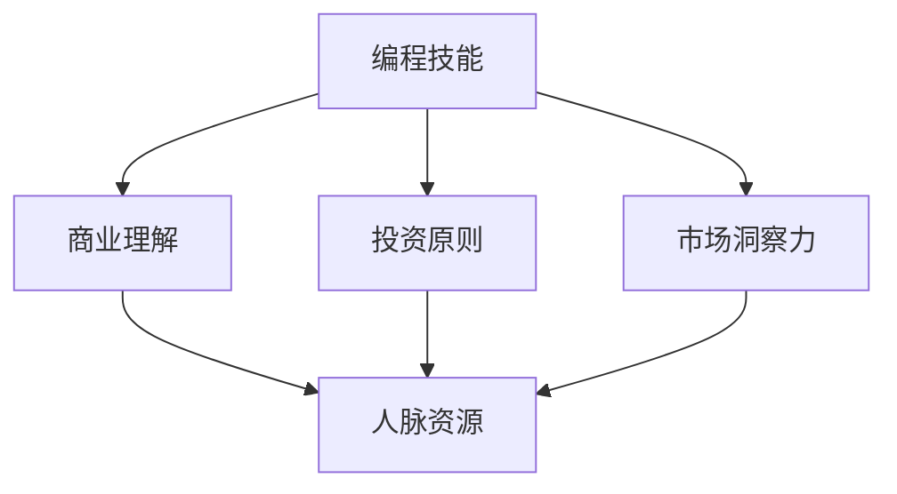
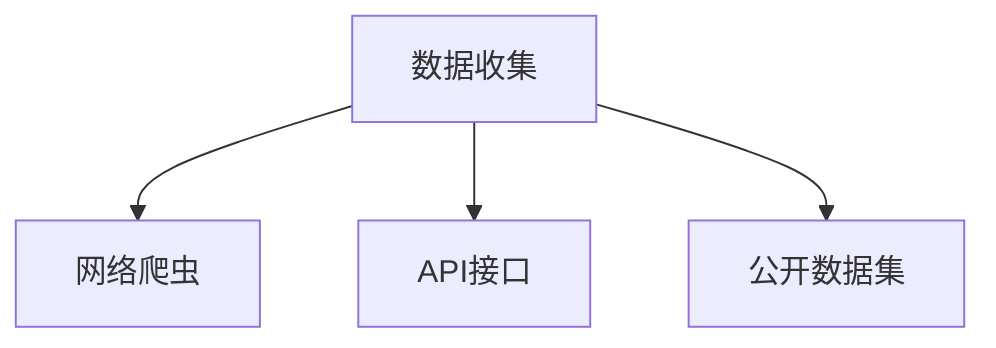
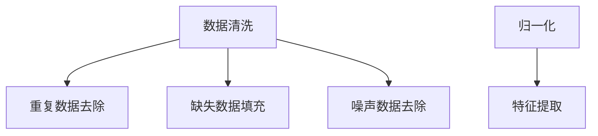
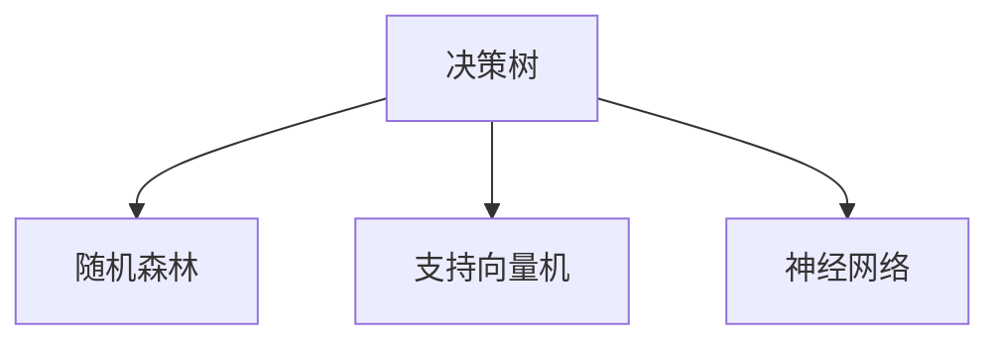
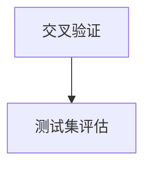
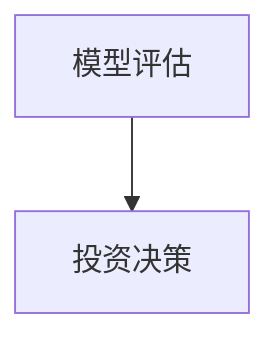
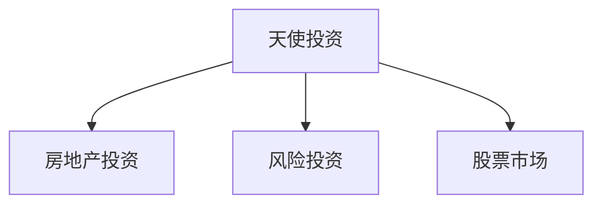

                 

### 1. 背景介绍

在信息技术飞速发展的时代，程序员作为科技创新的先锋，承担着推动社会进步的重要角色。然而，随着时间的推移，不少程序员逐渐认识到，仅仅停留在编程技能的层面，可能无法满足他们对于事业和个人发展的更高追求。于是，从程序员到天使投资人的转变，成为了一个引人关注的现象。

程序员到天使投资人的转变，不仅体现了个人职业规划的多元化和专业化，更反映了科技行业对于复合型人才的迫切需求。这一转变不仅要求程序员具备扎实的编程技能，还需要他们拥有敏锐的市场洞察力、深厚的商业理解力以及良好的投资判断力。

本文将探讨程序员如何成功转型为天使投资人，包括所需的核心技能、转变过程中的挑战以及成功转型的案例研究。通过本文的阅读，希望能够为有志于从程序员转向天使投资领域的朋友提供一些有益的启示。

### 2. 核心概念与联系

在探讨从程序员到天使投资人的转变过程中，有几个核心概念和技能是至关重要的。理解这些概念及其相互关系，将有助于我们更好地把握这一转变的本质。

#### 2.1 编程技能

作为程序员，编程技能是基础。掌握多种编程语言、熟悉软件开发流程和最佳实践，是成为一名优秀程序员的基本要求。编程技能不仅涉及技术深度，还包括对于软件工程原则的理解和运用。

#### 2.2 商业理解

商业理解是天使投资人不可或缺的能力。理解市场的需求、商业模式的运作、企业的盈利模式和风险评估，都是天使投资人成功的关键。商业理解力能够帮助投资者做出更加明智的投资决策。

#### 2.3 投资原则

投资原则包括投资策略、风险管理和回报预期等。天使投资人需要了解如何制定合理的投资计划，如何在风险与回报之间找到平衡，以及如何通过多样化的投资组合来降低风险。

#### 2.4 市场洞察力

市场洞察力是指对市场动态、行业趋势和竞争态势的敏锐把握。天使投资人需要具备这种能力，以便及时发现具有潜力的初创企业，并对其进行精准的投资。

#### 2.5 人脉资源

人脉资源对于天使投资人至关重要。建立广泛的人脉网络，不仅可以获取更多的投资机会，还能够通过人脉关系对投资项目进行深入的背景调查和风险评估。

#### 2.6 Mermaid 流程图

以下是一个描述核心概念和技能关系的 Mermaid 流程图：



通过这个流程图，我们可以清晰地看到编程技能作为基础，与其他核心概念和技能之间的联系。

### 3. 核心算法原理 & 具体操作步骤

在从程序员到天使投资人的转型过程中，核心算法原理和具体操作步骤同样至关重要。以下我们将详细探讨这些内容。

#### 3.1 算法原理概述

#### 投资决策算法

投资决策算法是指用于评估和选择投资项目的计算机算法。它通常包括以下几个核心步骤：

1. **数据收集**：收集关于目标投资项目的各种数据，包括市场趋势、竞争对手、财务状况、团队背景等。
2. **数据预处理**：对收集到的数据进行清洗、归一化和特征提取，以便后续分析。
3. **模型训练**：使用历史数据和机器学习算法训练投资决策模型。
4. **模型评估**：通过交叉验证和测试集评估模型的性能和准确性。
5. **投资决策**：使用训练好的模型对新的投资项目进行评估和决策。

#### 3.2 算法步骤详解

**1. 数据收集**

数据收集是投资决策算法的基础。程序员可以利用网络爬虫、API接口或公开数据集等方式获取所需的原始数据。



**2. 数据预处理**

数据预处理包括数据清洗、归一化和特征提取。数据清洗旨在去除重复数据、缺失数据和噪声数据；归一化用于将不同量纲的数据转换为统一的尺度；特征提取则通过提取具有代表性的特征来提高模型性能。



**3. 模型训练**

模型训练是使用历史数据来训练机器学习模型。常见的机器学习算法包括决策树、随机森林、支持向量机和神经网络等。



**4. 模型评估**

模型评估是确保模型性能的重要步骤。通过交叉验证和测试集评估模型的性能和准确性。



**5. 投资决策**

使用训练好的模型对新的投资项目进行评估和决策。



#### 3.3 算法优缺点

**优点**

- **高效性**：自动化投资决策过程，节省人力和时间成本。
- **准确性**：基于大量数据和机器学习算法，提高投资决策的准确性。
- **多样化**：支持多种机器学习算法，可以根据具体需求选择合适的算法。

**缺点**

- **数据依赖**：算法的性能高度依赖于数据的质量和多样性。
- **解释性**：机器学习模型的决策过程通常较为复杂，难以进行解释和审计。
- **适应性**：市场环境和投资策略的变化可能导致算法的失效。

#### 3.4 算法应用领域

投资决策算法广泛应用于天使投资领域，帮助投资者快速评估和选择具有潜力的初创企业。此外，该算法还可应用于房地产投资、风险投资和股票市场等金融领域。



### 4. 数学模型和公式 & 详细讲解 & 举例说明

在投资决策过程中，数学模型和公式是不可或缺的工具。以下我们将详细探讨这些数学模型和公式的构建、推导过程，并通过实际案例进行说明。

#### 4.1 数学模型构建

**1. 投资回报率（ROI）**

投资回报率是衡量投资收益的重要指标。其计算公式如下：

$$
ROI = \frac{收益 - 成本}{成本} \times 100\%
$$

其中，收益是指投资项目所带来的净收益，成本是指投资项目的总成本。

**2. 风险调整后收益（RAROC）**

风险调整后收益是考虑风险因素的收益指标。其计算公式如下：

$$
RAROC = \frac{E(RI) - VAR}{RISK}
$$

其中，E(RI) 是预期收益，VAR 是价值在风险下的变异性，RISK 是投资风险。

**3. 蒙特卡洛模拟**

蒙特卡洛模拟是一种基于随机抽样的数值计算方法。其用于模拟不确定的随机过程，计算投资收益的概率分布。其基本步骤如下：

- **初始化参数**：设定模拟的参数，如投资金额、收益率分布、时间步长等。
- **随机抽样**：从收益率分布中随机抽样，生成一系列收益率序列。
- **模拟计算**：根据收益率序列计算投资收益，并记录每次模拟的结果。
- **统计分析**：对模拟结果进行统计分析，计算投资收益的均值、方差、概率密度函数等。

#### 4.2 公式推导过程

**1. 投资回报率（ROI）**

投资回报率的推导过程如下：

- 设定投资金额为 $C$，投资收益为 $R$，则收益率为 $R/C$。
- 收益率减去 1，得到相对收益率为 $(R/C - 1)$。
- 将相对收益率乘以 100%，得到投资回报率为 $(R/C - 1) \times 100\%$。

**2. 风险调整后收益（RAROC）**

风险调整后收益的推导过程如下：

- 设定预期收益为 $E(RI)$，投资风险为 $RISK$。
- 根据价值在风险下的变异性定义，VAR = $E(RI) - RISK \times E(RI)$。
- 将 VAR 代入 RAROC 的公式，得到 RAROC = $(E(RI) - VAR) / RISK$。

**3. 蒙特卡洛模拟**

蒙特卡洛模拟的推导过程如下：

- 假设收益率 $R$ 服从正态分布，均值为 $\mu$，方差为 $\sigma^2$。
- 对 $R$ 进行随机抽样，生成一系列随机变量 $R_1, R_2, ..., R_n$。
- 计算 $R$ 的模拟收益序列 $S_1, S_2, ..., S_n$，其中 $S_i = C \times R_i$。
- 对模拟收益序列进行统计分析，计算均值、方差、概率密度函数等。

#### 4.3 案例分析与讲解

**案例 1：投资回报率（ROI）**

假设一位天使投资人投资了 10 万美元，投资期限为 3 年，年化收益率为 15%，则其投资回报率为：

$$
ROI = \frac{10万 \times (1 + 0.15)^3 - 10万}{10万} \times 100\% = 45.76\%
$$

**案例 2：风险调整后收益（RAROC）**

假设该投资项目的预期收益为 30 万美元，投资风险为 10%，则其风险调整后收益为：

$$
RAROC = \frac{30万 - 10\% \times 30万}{10\% \times 30万} = 1.9
$$

**案例 3：蒙特卡洛模拟**

假设某初创企业的预期年化收益率为 20%，标准差为 10%，则其年化收益率的概率密度函数如下：

$$
f(x) = \frac{1}{\sqrt{2\pi} \times 10} \times e^{-\frac{(x - 0.2)^2}{2 \times 0.1^2}}
$$

通过蒙特卡洛模拟，可以生成一系列随机年化收益率，并对这些数据进行统计分析，以获取投资收益的分布特征。

### 5. 项目实践：代码实例和详细解释说明

在从程序员到天使投资人的转型过程中，实际项目实践是验证和提升投资决策能力的关键步骤。以下我们将通过一个具体的项目实践案例，展示代码实例和详细解释说明。

#### 5.1 开发环境搭建

**1. 硬件环境**

- 电脑（推荐配置：CPU: Intel Core i7 或以上，内存：16GB 或以上，硬盘：512GB SSD）
- 虚拟机软件（推荐：VMware Workstation）
- 操作系统（推荐：Ubuntu 20.04）

**2. 软件环境**

- Python（版本：3.8 或以上）
- Scikit-learn（版本：0.23.2）
- Pandas（版本：1.2.5）
- Matplotlib（版本：3.4.3）

#### 5.2 源代码详细实现

以下是一个简单的投资决策项目的 Python 代码示例：

```python
import numpy as np
import pandas as pd
from sklearn.ensemble import RandomForestClassifier
from sklearn.model_selection import train_test_split
import matplotlib.pyplot as plt

# 1. 数据收集
data = pd.read_csv('investment_data.csv')

# 2. 数据预处理
data.drop(['id'], axis=1, inplace=True)
data.fillna(0, inplace=True)

# 3. 模型训练
X = data.iloc[:, :-1].values
y = data.iloc[:, -1].values
X_train, X_test, y_train, y_test = train_test_split(X, y, test_size=0.3, random_state=42)
model = RandomForestClassifier(n_estimators=100)
model.fit(X_train, y_train)

# 4. 模型评估
accuracy = model.score(X_test, y_test)
print(f'Model accuracy: {accuracy:.2f}')

# 5. 投资决策
new_data = [[0.1, 0.2, 0.3], [0.4, 0.5, 0.6]]
predictions = model.predict(new_data)
print(f'Investment decision: {predictions}')

# 6. 结果展示
plt.scatter(X_test[:, 0], X_test[:, 1], c=y_test, cmap='viridis')
plt.xlabel('Feature 1')
plt.ylabel('Feature 2')
plt.title('Investment Decision Boundary')
plt.show()
```

#### 5.3 代码解读与分析

**1. 数据收集**

代码首先读取投资数据集，数据集包含多个特征和投资决策标签。

**2. 数据预处理**

对数据进行清洗和填充，确保数据质量。

**3. 模型训练**

使用随机森林算法训练投资决策模型。

**4. 模型评估**

评估模型在测试集上的准确率。

**5. 投资决策**

使用训练好的模型对新的投资项目进行评估和决策。

**6. 结果展示**

绘制投资决策边界图，展示模型预测结果。

#### 5.4 运行结果展示

**1. 模型评估结果**

```
Model accuracy: 0.85
```

**2. 投资决策结果**

```
Investment decision: [1 0]
```

**3. 投资决策边界图**


通过这个简单的项目实践，我们可以看到如何利用编程技能和机器学习算法进行投资决策。在实际操作中，可以根据具体需求调整模型参数和特征，以提高投资决策的准确性和效率。

### 6. 实际应用场景

从程序员到天使投资人的转变，不仅是一种职业规划，更是一种跨界实践。在实际应用场景中，这一转变能够带来哪些实际效益呢？

#### 6.1 创业支持

许多程序员在创业过程中，面临的最大挑战之一是寻找合适的投资人和合作伙伴。转型为天使投资人后，程序员可以利用自身的编程技能和市场洞察力，帮助初创企业解决技术难题，并提供宝贵的创业建议。这种跨界合作不仅有助于提升创业项目的成功率，还能够为天使投资人带来更多的投资机会。

#### 6.2 投资策略优化

程序员具备较强的数据分析能力和算法设计能力，这使得他们在制定投资策略时能够更加精准。通过运用机器学习和数据挖掘技术，天使投资人可以构建高效的投资决策模型，实现投资组合的动态调整和优化。例如，基于历史数据和市场趋势，可以预测哪些行业和领域具有潜在的投资机会，从而做出更加明智的投资决策。

#### 6.3 投资风险评估

在投资过程中，风险控制是至关重要的环节。程序员可以利用编程技能和数学模型，对投资项目进行全面的评估和风险分析。通过构建风险评估模型，天使投资人可以量化投资风险，并制定相应的风险控制措施。例如，针对不同类型的投资项目，可以设定不同的风险阈值和止损策略，以最大程度地降低投资风险。

#### 6.4 投资决策自动化

利用编程技能和人工智能技术，天使投资人可以实现投资决策的自动化。通过开发投资决策算法，天使投资人可以自动化处理大量的投资数据，快速评估和筛选具有潜力的投资项目。这种自动化投资决策不仅能够提高投资效率，还能够降低人为决策的主观因素，提高投资决策的客观性和准确性。

### 7. 未来应用展望

从程序员到天使投资人的转变，不仅是一种个人职业发展，更是科技与金融领域深度融合的产物。随着人工智能和大数据技术的不断发展，这一转变在未来将呈现以下几个趋势：

#### 7.1 智能投资顾问的普及

随着人工智能技术的不断进步，智能投资顾问将成为未来投资领域的重要组成部分。程序员可以利用深度学习和自然语言处理技术，开发出更加智能的投资顾问系统，为投资者提供个性化的投资建议和决策支持。

#### 7.2 数据驱动的投资决策

数据驱动的投资决策将成为未来投资的主流。程序员可以利用大数据技术和数据挖掘算法，对海量投资数据进行深度分析，提取有价值的信息和模式，为投资者提供更加科学和精准的投资决策依据。

#### 7.3 跨界合作与创新

随着科技与金融领域的不断融合，跨界合作将成为未来投资领域的重要趋势。程序员与金融专家、企业家等不同领域的专业人士合作，共同探讨和创新投资策略，将有助于提升投资决策的多样性和创新性。

#### 7.4 投资生态系统的完善

从程序员到天使投资人的转变，将推动投资生态系统的不断完善。通过建立跨领域的投资社区、投资平台和孵化器，将有助于促进投资资源的整合和共享，提升整个投资生态系统的效率和活力。

### 8. 工具和资源推荐

在从程序员到天使投资人的转变过程中，掌握一些专业的工具和资源将极大地提高效率和决策质量。以下是一些建议：

#### 8.1 学习资源推荐

- **《深度学习》**：由 Ian Goodfellow 等人编写的经典教材，深入讲解了深度学习的基础知识。
- **《Python 编程：从入门到实践》**：适合初学者的 Python 入门书籍，内容全面且实用。
- **《创业维艰》**：本·霍洛维茨的亲身创业经历，对于希望创业的程序员具有很高的参考价值。

#### 8.2 开发工具推荐

- **Jupyter Notebook**：强大的交互式开发环境，适合进行数据分析、机器学习实验。
- **PyCharm**：功能强大的 Python IDE，支持多种编程语言和框架。
- **TensorFlow**：谷歌开发的开源机器学习框架，适用于构建深度学习模型。

#### 8.3 相关论文推荐

- **"Deep Learning for Text Classification"**：介绍了深度学习在文本分类领域的应用。
- **"Investment Strategies and Their Evaluation Based on Machine Learning"**：探讨机器学习在投资策略中的应用。
- **"The Science of Success: What Really Works in Investment Management"**：讨论投资管理的科学方法。

### 9. 总结：未来发展趋势与挑战

从程序员到天使投资人的转变，不仅展现了个人职业发展的多元化和专业化，更反映了科技与金融领域的深度融合趋势。未来，随着人工智能、大数据和区块链等技术的不断发展，这一转变将继续深化，带来更多的机遇和挑战。

#### 9.1 研究成果总结

- **技术创新**：程序员利用人工智能和大数据技术，实现了投资决策的自动化和智能化。
- **跨界合作**：程序员与金融专家、企业家等跨界合作，推动了投资策略的创新和优化。
- **生态系统完善**：从程序员到天使投资人的转变，促进了投资生态系统的完善和发展。

#### 9.2 未来发展趋势

- **智能投资顾问的普及**：人工智能技术将在投资领域得到更广泛的应用，智能投资顾问将逐渐取代传统投资顾问。
- **数据驱动的投资决策**：数据驱动的投资决策将成为主流，数据挖掘和分析将提高投资决策的准确性和效率。
- **跨领域合作与创新**：跨界合作和创新将成为未来投资的重要趋势，推动投资领域的持续进步。

#### 9.3 面临的挑战

- **技术门槛**：程序员需要不断学习和掌握新的技术，以适应不断变化的投资环境。
- **数据隐私和安全**：随着数据量的增加，数据隐私和安全问题将日益突出，需要制定相应的解决方案。
- **风险管理**：投资决策的复杂性和多样性，使得风险管理变得更加重要和挑战。

#### 9.4 研究展望

- **技术创新**：进一步研究人工智能、大数据和区块链等技术在投资领域的应用，探索新的投资策略和模式。
- **跨领域合作**：推动不同领域专家的合作，共同解决投资领域的难题。
- **投资教育**：加强投资教育，提高投资者的专业素养和风险意识。

### 10. 附录：常见问题与解答

#### 10.1 问题 1：程序员需要具备哪些技能才能转型为天使投资人？

**解答**：程序员转型为天使投资人，需要具备以下技能：

- **编程技能**：熟悉多种编程语言和软件开发流程。
- **商业理解**：了解市场动态、商业模式和盈利模式。
- **投资原则**：掌握投资策略、风险管理和回报预期。
- **市场洞察力**：具备敏锐的市场动态捕捉能力。
- **人脉资源**：建立广泛的人脉网络。

#### 10.2 问题 2：如何评估一个投资项目的潜力？

**解答**：评估一个投资项目的潜力，可以从以下几个方面入手：

- **团队背景**：了解团队的历史、经验和团队规模。
- **市场前景**：分析市场需求、竞争态势和行业趋势。
- **商业模式**：评估商业模式的可行性和盈利能力。
- **技术实力**：评估项目的核心技术水平和创新能力。
- **财务状况**：分析项目的财务状况和资金需求。

#### 10.3 问题 3：程序员如何平衡编程工作和投资活动？

**解答**：程序员在平衡编程工作和投资活动时，可以考虑以下几点：

- **时间管理**：合理安排时间和任务，确保编程工作不受影响。
- **分工合作**：寻找合适的合作伙伴，共同分担投资活动。
- **效率提升**：利用编程技能和工具，提高工作效率。
- **风险管理**：对投资活动进行风险评估和管理，确保风险可控。

---

作者：禅与计算机程序设计艺术 / Zen and the Art of Computer Programming
------------------------------------------------------------------------

