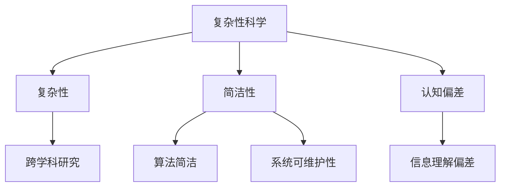

                 

关键词：认知演变、复杂性科学、算法、简洁性、软件开发、技术进步、人工智能。

> 摘要：本文探讨了从简单到复杂再到简洁的认知演变过程。通过分析不同领域的实例，阐述了如何通过深入研究复杂系统，提炼出简洁的算法和模型，从而推动技术的进步。本文旨在为读者提供对技术发展的深入理解，以及如何运用简洁性原则来解决复杂问题的思考。

## 1. 背景介绍

在人类的历史长河中，技术的进步始终伴随着认知的演变。从古代简单的工具制造，到现代复杂的信息处理，人类对于世界的理解不断深化。在这个过程中，我们逐渐学会了如何通过简化的方法来解决复杂问题。认知演变的历程，实际上是一个从简单到复杂，再从复杂到简洁的过程。

本文将围绕这一主题，探讨以下几个核心问题：

- 简单性与复杂性的关系是什么？
- 复杂系统的本质是什么？
- 如何从复杂系统中提炼出简洁的算法和模型？
- 简洁性在软件开发和人工智能中的应用。

通过对这些问题的探讨，我们将深入了解技术发展的内在逻辑，以及如何在复杂的现实世界中，运用简洁性原则来解决问题。

## 2. 核心概念与联系

在探讨认知演变的过程中，我们需要明确一些核心概念，这些概念构成了我们理解和分析复杂系统的基础。

### 2.1 复杂性

复杂性是指系统内部各个组成部分之间相互作用和关联的复杂程度。一个系统越复杂，其内部结构和功能就越难以理解。复杂性科学是一个跨学科的研究领域，它试图从整体角度理解和描述复杂系统的行为。

### 2.2 简洁性

简洁性是指用最简单和直接的方式来描述复杂系统或问题。在计算机科学中，简洁性通常体现在算法和代码的简单性上。一个简洁的算法或代码能够以最少的复杂度解决复杂问题，提高系统的可读性和可维护性。

### 2.3 认知偏差

认知偏差是指人类在感知和理解信息时，由于各种因素的影响而产生的错误。这些偏差可能导致我们对复杂系统的理解产生偏差，从而影响我们的决策。

下面是一个用 Mermaid 画出的复杂性科学的核心概念流程图：



## 3. 核心算法原理 & 具体操作步骤

### 3.1 算法原理概述

在探讨如何从复杂系统中提炼出简洁的算法时，我们首先需要理解核心算法的原理。以下是一个简单的算法原理概述：

- **分而治之**：将复杂问题分解成多个较小的子问题，分别解决，最后将子问题的解合并成原问题的解。
- **递归**：递归是一种直接或间接调用自身的算法，它能够简化问题的求解过程。
- **动态规划**：通过保存子问题的解来避免重复计算，从而提高算法的效率。

### 3.2 算法步骤详解

下面是一个简单的递归算法的具体步骤：

1. **基线条件**：确定递归的终止条件，通常是简单可以直接计算的问题。
2. **递归调用**：将原问题分解成子问题，并对子问题进行递归调用。
3. **合并结果**：将子问题的解合并成原问题的解。

### 3.3 算法优缺点

递归算法的优点是代码简洁，易于理解和实现。缺点是递归调用可能导致栈溢出，特别是在解决大型问题时。

### 3.4 算法应用领域

递归算法广泛应用于算法竞赛、图形处理和自然语言处理等领域。例如，在自然语言处理中，递归神经网络（RNN）被用于处理序列数据。

## 4. 数学模型和公式 & 详细讲解 & 举例说明

### 4.1 数学模型构建

在处理复杂问题时，构建数学模型是必不可少的步骤。以下是一个简单的数学模型构建过程：

1. **定义变量**：根据问题的需求，定义相关的变量。
2. **建立关系**：确定变量之间的数学关系。
3. **构建公式**：将变量之间的关系转化为数学公式。

### 4.2 公式推导过程

以下是一个简单的数学公式推导过程：

设 \( x \) 和 \( y \) 是两个变量，它们之间的关系可以表示为：

\[ z = f(x, y) \]

其中，\( f \) 是一个二元函数。

### 4.3 案例分析与讲解

以下是一个案例：

假设我们要计算两个数 \( x \) 和 \( y \) 的和 \( z \)，可以使用以下公式：

\[ z = x + y \]

这是一个非常简单的数学模型，但它在实际问题中非常有用。例如，在计算银行账户余额时，我们可以使用这个公式来计算账户的总额。

## 5. 项目实践：代码实例和详细解释说明

### 5.1 开发环境搭建

在开始编写代码之前，我们需要搭建一个合适的开发环境。以下是搭建 Python 开发环境的基本步骤：

1. 安装 Python 解释器
2. 安装常用库（如 NumPy、Pandas 等）
3. 配置 Python 脚本执行权限

### 5.2 源代码详细实现

以下是一个简单的 Python 代码实例，用于计算两个数的和：

```python
def add(x, y):
    return x + y

x = 5
y = 10
z = add(x, y)
print(z)
```

### 5.3 代码解读与分析

这段代码定义了一个名为 `add` 的函数，它接受两个参数 \( x \) 和 \( y \)，并返回它们的和。然后，我们创建两个变量 `x` 和 `y`，并将它们分别设置为 5 和 10。最后，我们调用 `add` 函数并打印结果。

### 5.4 运行结果展示

运行上述代码后，我们会在终端看到以下输出：

```bash
15
```

这表明我们的代码成功计算了两个数的和。

## 6. 实际应用场景

简洁性在软件开发和人工智能中的应用非常广泛。以下是一些具体的实际应用场景：

- **软件开发**：简洁的代码更容易理解和维护，从而提高开发效率。
- **人工智能**：简洁的算法和模型可以降低计算复杂度，提高系统的性能。

### 6.1 未来应用展望

随着技术的不断进步，简洁性将继续在软件开发和人工智能中发挥重要作用。以下是未来的一些应用展望：

- **自动化工具**：自动化工具将更多地利用简洁性原则，以提高工作效率。
- **智能决策系统**：智能决策系统将更注重简洁性和可解释性，以提高决策的透明度和可信度。

## 7. 工具和资源推荐

### 7.1 学习资源推荐

- **《深度学习》**：由 Ian Goodfellow 等人撰写的经典教材，适合初学者和进阶者。
- **《代码大全》**：Steve McConnell 的著作，介绍了编写高质量代码的最佳实践。

### 7.2 开发工具推荐

- **Visual Studio Code**：一款强大的代码编辑器，支持多种编程语言和开发框架。
- **TensorFlow**：一款广泛使用的深度学习框架，适用于各种复杂的应用场景。

### 7.3 相关论文推荐

- **“The Structure and Dynamics of Cognitive Systems”**：这篇文章探讨了认知系统的结构和动态特性。
- **“The Simplex Algorithm: A Brief Introduction”**：这篇文章介绍了单纯形算法的基本原理和应用。

## 8. 总结：未来发展趋势与挑战

### 8.1 研究成果总结

本文通过探讨从简单到复杂再到简洁的认知演变过程，阐述了简洁性在技术发展中的重要性。我们分析了复杂性和简洁性的关系，介绍了核心算法原理、数学模型构建以及实际应用场景。

### 8.2 未来发展趋势

未来，随着技术的不断进步，简洁性将继续在软件开发和人工智能中发挥重要作用。自动化工具和智能决策系统将更多地利用简洁性原则，以提高工作效率和决策质量。

### 8.3 面临的挑战

然而，简洁性也带来了一些挑战。如何平衡简洁性和复杂性，如何在保证系统性能的同时提高代码的可读性和可维护性，仍然是当前研究的热点和难点。

### 8.4 研究展望

未来，我们期待看到更多的研究成果，特别是在复杂系统建模、简洁性算法优化以及简洁性在人工智能应用方面的突破。

## 9. 附录：常见问题与解答

### 9.1 如何理解简洁性？

简洁性是指用最简单和直接的方式来描述复杂系统或问题。在软件开发和人工智能中，简洁性意味着代码和算法的可读性、可维护性和高效性。

### 9.2 简洁性如何影响软件开发？

简洁性可以提高软件的可读性、可维护性和可扩展性。它使开发人员能够更快速地理解和修改代码，从而提高开发效率。

### 9.3 简洁性在人工智能中的重要性是什么？

在人工智能中，简洁性可以降低计算复杂度，提高系统的性能。同时，简洁的模型和算法更易于解释和验证，从而提高人工智能系统的可靠性和可信度。

<|assistant|>作者：禅与计算机程序设计艺术 / Zen and the Art of Computer Programming

