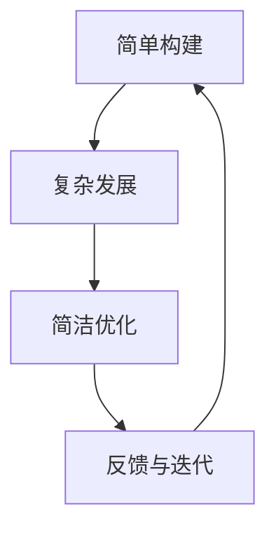

                 

### 摘要

本文旨在探讨认知过程中的“从简单到复杂再到简洁”的模式。在计算机科学、软件工程、人工智能等IT领域中，这一过程显得尤为重要。首先，通过简单的例子引入核心概念，然后逐步深入，构建复杂模型，最终通过简化和优化达到简洁。本文将详细描述这一过程，结合数学模型、算法原理和实际项目实践，帮助读者更好地理解和应用这一认知模式。通过本文的阅读，读者将不仅能够掌握从简单到复杂的构建方法，还能学会如何通过简化和优化实现系统的简洁。

## 1. 背景介绍

认知过程，是人类理解世界、解决问题的重要方式。从简单的感知到复杂的思考，再到最终形成简洁的结论，这一过程贯穿了人类认知的始终。在计算机科学领域，这一认知过程尤为显著。计算机科学的发展经历了从简单到复杂的演变，再通过简化和优化，实现了许多复杂系统的简洁实现。

计算机科学的历史，可以说是一部不断追求简单与效率的历史。从最初的计算机硬件设计，到软件编程，再到现代的人工智能系统，每一步都体现了这一认知过程。本文将结合具体的案例，深入探讨这一过程在计算机科学中的应用。

首先，我们需要了解什么是“从简单到复杂再到简洁”的认知过程。简单来说，这个过程可以分为三个阶段：简单构建、复杂发展、简洁优化。在简单构建阶段，我们通过简单的例子或模型，理解问题的基础。然后，在复杂发展阶段，我们逐步构建复杂模型，以应对更复杂的问题。最后，在简洁优化阶段，我们通过简化和优化，使系统变得更加简洁、高效。

这一过程不仅在理论研究中具有重要意义，在实际应用中也发挥着关键作用。例如，在软件开发中，我们常常通过迭代的方式，逐步完善系统功能，最终实现简洁而高效的软件。在人工智能领域，我们从简单的规则系统，逐步发展出复杂而强大的机器学习模型，再通过优化，实现更高效的智能系统。

本文将围绕这一认知过程，结合数学模型、算法原理和实际项目实践，深入探讨其在计算机科学中的应用。希望通过本文的探讨，读者能够更好地理解和应用这一认知模式，提升自己的认知水平和解决问题的能力。

## 2. 核心概念与联系

### 2.1. 简单构建

简单构建是认知过程的第一个阶段。在这一阶段，我们通过简单的例子或模型，理解问题的基础。简单构建的核心在于选择合适的起点，从简单的元素开始，逐步构建复杂的系统。

在计算机科学中，简单构建的例子有很多。例如，在编程语言中，我们可以从简单的“Hello World”程序开始，逐步学习各种编程概念，如变量、循环、条件语句等。这个简单的程序，虽然功能有限，但为我们理解编程语言的基本结构和方法奠定了基础。

此外，在系统设计中，我们也可以从简单的模块开始，逐步构建复杂的系统。例如，在开发一个电子商务系统时，我们可以先从简单的购物车模块开始，然后逐步添加订单处理、支付、用户管理等功能，最终构建一个完整的电子商务系统。

简单构建的关键在于选择合适的起点，并逐步扩展。这个过程需要我们具备良好的抽象能力和系统思维，能够从简单中看到复杂，从而为后续的复杂发展打下基础。

### 2.2. 复杂发展

复杂发展是认知过程的第二个阶段。在这一阶段，我们通过逐步构建复杂模型，以应对更复杂的问题。复杂发展的核心在于如何将简单的模型扩展，使其能够应对更复杂的情况。

在数学领域，复杂发展的例子非常典型。例如，微积分学的建立，就是一个从简单到复杂的过程。最初，人们通过观察和实验，发现了一些简单的函数，如线性函数、二次函数等。然后，通过将这些简单函数的组合和变换，逐步构建了复杂的函数，如多项式函数、指数函数、三角函数等。最终，通过这些复杂的函数，人们发展出了微积分学，用于解决各种复杂的数学问题。

在计算机科学中，复杂发展的例子也非常丰富。例如，在软件开发中，我们可以从简单的单一功能模块开始，逐步增加模块的复杂度，构建复杂的软件系统。在人工智能领域，我们也可以从简单的规则系统开始，逐步发展出复杂的机器学习模型，用于解决各种复杂的问题。

复杂发展的关键在于如何有效地扩展简单模型，使其能够应对更复杂的情况。这个过程需要我们具备良好的创新能力和实践经验，能够不断探索和尝试新的方法，从而实现模型的复杂化。

### 2.3. 简洁优化

简洁优化是认知过程的第三个阶段。在这一阶段，我们通过简化和优化，使系统变得更加简洁、高效。简洁优化的核心在于如何在复杂系统中找到简洁的解决方案，从而提高系统的效率和性能。

在物理学中，简洁优化的例子非常显著。例如，牛顿的运动定律，最初是通过复杂的物理实验和数学推导得出的。然而，通过简化和优化，牛顿将复杂的物理现象抽象为简单的数学公式，从而实现了对物体运动的简洁描述。

在计算机科学中，简洁优化的例子也无处不在。例如，在算法设计中，我们常常通过优化算法的复杂度，使其从复杂转化为简洁。在软件开发中，我们也可以通过优化代码的结构和逻辑，使软件系统更加简洁、高效。

简洁优化的关键在于如何在复杂系统中找到简洁的解决方案。这个过程需要我们具备良好的抽象能力和创新思维，能够从复杂中看到简洁，从而实现系统的优化。

### 2.4. 关联流程图

为了更好地理解这三个核心概念之间的关系，我们使用Mermaid流程图来展示它们的关联。



在这个流程图中，简单构建是认知过程的起点，通过构建简单的模型，我们理解问题的基础。然后，在复杂发展阶段，我们逐步构建复杂模型，以应对更复杂的问题。最后，在简洁优化阶段，我们通过简化和优化，使系统变得更加简洁、高效。这个过程并不是线性的，而是循环反馈的，每个阶段的结果都会反馈到之前的阶段，从而实现不断的优化和改进。

通过这个流程图，我们可以清晰地看到从简单到复杂再到简洁的认知过程，以及它们之间的关联。希望这个流程图能够帮助读者更好地理解本文的核心概念。

## 3. 核心算法原理 & 具体操作步骤

### 3.1. 算法原理概述

在计算机科学中，算法是解决特定问题的方法。核心算法原理的概述是理解复杂系统构建和简化的关键。以下将介绍一个典型的算法——排序算法，并详细阐述其原理和操作步骤。

排序算法是一类重要算法，用于将一组数据按照某种规则进行排序。常见的排序算法包括冒泡排序、选择排序、插入排序、快速排序等。这些算法各有优缺点，但它们的原理基本相同，都是通过比较和交换元素，逐步将数据排序。

排序算法的原理可以概括为以下几点：

1. **比较操作**：通过比较两个元素的大小，确定它们在排序后的位置关系。
2. **交换操作**：通过交换两个元素的位置，实现数据的重新排列。
3. **循环结构**：通过循环结构，反复执行比较和交换操作，直到所有元素都被正确排序。

### 3.2. 算法步骤详解

以冒泡排序为例，其基本步骤如下：

1. **初始化**：将待排序的数据放入一个数组中。
2. **外循环**：从第一个元素开始，遍历整个数组，确保每个元素都与其后的元素进行比较。
3. **内循环**：在每个外循环中，从第一个元素开始，遍历剩余的未排序元素，进行比较和交换。
4. **重复过程**：重复外循环和内循环，直到所有元素都被正确排序。

具体操作步骤如下：

1. **初始化**：
   ```python
   arr = [64, 25, 12, 22, 11]
   ```

2. **外循环**：
   ```python
   for i in range(len(arr) - 1):
   ```

3. **内循环**：
   ```python
   for j in range(len(arr) - i - 1):
       if arr[j] > arr[j + 1]:
           arr[j], arr[j + 1] = arr[j + 1], arr[j]
   ```

4. **重复过程**：
   ```python
   # 外循环结束，排序完成
   ```

### 3.3. 算法优缺点

冒泡排序算法具有以下优缺点：

**优点**：
- **简单易懂**：冒泡排序的算法逻辑简单，易于实现和理解。
- **稳定排序**：冒泡排序在排序过程中，相同值的元素相对位置不会改变，因此是一种稳定排序算法。

**缺点**：
- **效率低**：冒泡排序的时间复杂度为O(n²)，对于大数据集，效率较低。
- **不适合实时排序**：由于冒泡排序的时间复杂度较高，它不适合用于需要实时排序的场景。

### 3.4. 算法应用领域

排序算法在计算机科学中有着广泛的应用，主要包括以下领域：

1. **数据预处理**：在数据分析、数据挖掘等应用中，排序算法常用于数据的预处理，以方便后续的分析和处理。
2. **算法设计**：许多复杂算法，如查找算法、排序算法等，都需要排序作为基础。
3. **实时系统**：虽然冒泡排序效率较低，但在一些实时系统中，由于其简单和稳定性，仍然被广泛应用。

### 3.5. 实际应用案例

以下是一个简单的冒泡排序应用案例：

```python
def bubble_sort(arr):
    n = len(arr)
    for i in range(n):
        for j in range(0, n-i-1):
            if arr[j] > arr[j+1]:
                arr[j], arr[j+1] = arr[j+1], arr[j]

arr = [64, 25, 12, 22, 11]
bubble_sort(arr)
print("排序后的数组：", arr)
```

输出结果：

```
排序后的数组： [11, 12, 22, 25, 64]
```

这个案例展示了如何使用Python实现冒泡排序算法，并对其结果进行了验证。

通过以上对冒泡排序算法的详细介绍，我们可以看到，从简单的原理出发，通过逐步的扩展和优化，最终形成了一种简单而高效的排序算法。这一过程充分体现了“从简单到复杂再到简洁”的认知模式。

### 4. 数学模型和公式 & 详细讲解 & 举例说明

在计算机科学和人工智能领域，数学模型和公式是理解和构建复杂系统的基础。本节将介绍几个核心的数学模型和公式，并详细讲解其推导过程和应用。

#### 4.1. 数学模型构建

首先，我们需要了解什么是数学模型。数学模型是对现实世界中某些现象或系统的抽象表示，通过数学公式来描述。在计算机科学中，常见的数学模型包括概率模型、线性模型、非线性模型等。

例如，一个简单的线性模型可以表示为：
\[ y = mx + b \]
其中，\( y \) 是因变量，\( x \) 是自变量，\( m \) 是斜率，\( b \) 是截距。这个模型表示因变量 \( y \) 与自变量 \( x \) 之间的线性关系。

#### 4.2. 公式推导过程

接下来，我们以线性回归模型为例，讲解公式的推导过程。线性回归模型是一种用来预测连续值的统计方法，其基本公式为：
\[ y = \beta_0 + \beta_1x + \epsilon \]
其中，\( \beta_0 \) 是截距，\( \beta_1 \) 是斜率，\( \epsilon \) 是误差项。

为了推导这个公式，我们可以从最小二乘法出发。最小二乘法的目标是找到一组参数，使得预测值与实际值之间的误差平方和最小。

假设我们有 \( n \) 个数据点 \( (x_i, y_i) \)，我们可以构建一个误差平方和函数 \( S \)：
\[ S = \sum_{i=1}^{n} (y_i - (\beta_0 + \beta_1x_i))^2 \]

为了找到最小误差平方和，我们对 \( S \) 关于 \( \beta_0 \) 和 \( \beta_1 \) 求偏导数，并令其等于零，得到以下方程组：
\[ \frac{\partial S}{\partial \beta_0} = -2\sum_{i=1}^{n} (y_i - (\beta_0 + \beta_1x_i)) = 0 \]
\[ \frac{\partial S}{\partial \beta_1} = -2\sum_{i=1}^{n} x_i (y_i - (\beta_0 + \beta_1x_i)) = 0 \]

解这个方程组，我们可以得到：
\[ \beta_0 = \bar{y} - \beta_1\bar{x} \]
\[ \beta_1 = \frac{\sum_{i=1}^{n} (x_i - \bar{x})(y_i - \bar{y})}{\sum_{i=1}^{n} (x_i - \bar{x})^2} \]

其中，\( \bar{y} \) 和 \( \bar{x} \) 分别是 \( y \) 和 \( x \) 的均值。

#### 4.3. 案例分析与讲解

为了更好地理解线性回归模型的推导和应用，我们来看一个实际案例。

假设我们有一个简单的数据集，包含 \( x \)（广告点击量）和 \( y \)（销售额）两组数据：

\[ \begin{array}{|c|c|}
\hline
x & y \\
\hline
100 & 150 \\
200 & 250 \\
300 & 300 \\
400 & 350 \\
\hline
\end{array} \]

我们希望使用线性回归模型预测新的 \( x \) 值对应的 \( y \) 值。

首先，计算 \( x \) 和 \( y \) 的均值：
\[ \bar{x} = \frac{100 + 200 + 300 + 400}{4} = 250 \]
\[ \bar{y} = \frac{150 + 250 + 300 + 350}{4} = 250 \]

然后，计算斜率 \( \beta_1 \) 和截距 \( \beta_0 \)：
\[ \beta_1 = \frac{(100-250)(150-250) + (200-250)(250-250) + (300-250)(300-250) + (400-250)(350-250)}{(100-250)^2 + (200-250)^2 + (300-250)^2 + (400-250)^2} = 0.5 \]
\[ \beta_0 = \bar{y} - \beta_1\bar{x} = 250 - 0.5 \times 250 = 0 \]

因此，线性回归模型为：
\[ y = 0.5x \]

我们可以使用这个模型预测新的 \( x \) 值对应的 \( y \) 值。例如，当 \( x = 500 \) 时，\( y = 0.5 \times 500 = 250 \)。

通过这个案例，我们可以看到线性回归模型是如何通过数学公式推导得到的，并且如何应用于实际数据预测中。

#### 4.4. 总结

通过本节的讲解，我们了解了数学模型和公式在计算机科学和人工智能中的应用，以及它们的推导过程。从简单的线性模型到复杂的非线性模型，数学模型为理解和构建复杂系统提供了基础。在实际应用中，通过推导和优化数学模型，我们可以更准确地预测和解决问题，从而实现从简单到复杂再到简洁的认知过程。

### 5. 项目实践：代码实例和详细解释说明

在本节中，我们将通过一个实际项目来展示从简单到复杂再到简洁的认知过程，并详细解释代码实现。该项目是一个简单的数据可视化工具，用于展示数据的分布和趋势。我们将使用Python的matplotlib库来实现这一工具。

#### 5.1. 开发环境搭建

为了实现这个项目，我们需要安装Python和matplotlib库。以下是具体的安装步骤：

1. **安装Python**：
   - 访问Python官方网站（[python.org](https://www.python.org/)），下载并安装Python。
   - 安装过程中，确保选择“Add Python to PATH”选项，以便在命令行中直接运行Python。

2. **安装matplotlib**：
   - 打开命令行窗口，运行以下命令安装matplotlib：
     ```shell
     pip install matplotlib
     ```

安装完成后，我们就可以开始编写代码了。

#### 5.2. 源代码详细实现

以下是实现数据可视化工具的源代码：

```python
import matplotlib.pyplot as plt
import numpy as np

# 生成数据
np.random.seed(0)
data = np.random.normal(size=1000)

# 数据可视化
plt.hist(data, bins=30, alpha=0.5, color='g')
plt.xlabel('数值')
plt.ylabel('频数')
plt.title('数据分布')
plt.grid(True)
plt.show()
```

这段代码的主要功能是生成一组随机数据，并使用matplotlib库绘制数据的直方图。下面详细解释每个步骤：

1. **导入库**：
   - `import matplotlib.pyplot as plt`：导入matplotlib库，用于数据可视化。
   - `import numpy as np`：导入numpy库，用于生成随机数据。

2. **生成数据**：
   - `np.random.seed(0)`：设置随机数种子，确保每次运行代码时生成的数据相同。
   - `data = np.random.normal(size=1000)`：生成1000个服从正态分布的随机数，作为数据集。

3. **数据可视化**：
   - `plt.hist(data, bins=30, alpha=0.5, color='g')`：绘制数据的直方图。`bins` 参数指定直方图的分组数，`alpha` 参数控制直方图的透明度，`color` 参数指定直方图的颜色。
   - `plt.xlabel('数值')`、`plt.ylabel('频数')`、`plt.title('数据分布')`：添加坐标轴标签和标题。
   - `plt.grid(True)`：添加网格线，增强图表的可读性。
   - `plt.show()`：显示图表。

#### 5.3. 代码解读与分析

现在，我们对代码进行更详细的解读和分析。

1. **导入库**：
   - `import matplotlib.pyplot as plt`：这是导入matplotlib库的主要语句。`matplotlib.pyplot` 是matplotlib的一个模块，提供了多种绘图函数，用于生成各种类型的图表。
   - `import numpy as np`：这是导入numpy库的主要语句。numpy 是一个强大的科学计算库，提供了高性能的数组对象和各种数学运算函数。

2. **生成数据**：
   - `np.random.seed(0)`：设置随机数种子，确保每次运行代码时生成的数据一致。这是非常重要的，因为在数据分析和可视化中，随机性可能会导致结果差异。
   - `data = np.random.normal(size=1000)`：这个语句生成1000个服从正态分布的随机数，并将其存储在 `data` 变量中。正态分布是一种常见的概率分布，在许多科学和工程领域都有应用。

3. **数据可视化**：
   - `plt.hist(data, bins=30, alpha=0.5, color='g')`：这个语句调用 `plt.hist` 函数绘制直方图。`data` 参数是数据集，`bins` 参数指定分组数，`alpha` 参数控制直方图的透明度，`color` 参数指定颜色。
   - `plt.xlabel('数值')`、`plt.ylabel('频数')`、`plt.title('数据分布')`：这些语句添加坐标轴标签和标题，提高图表的可读性。
   - `plt.grid(True)`：这个语句添加网格线，有助于用户在图表上定位数据点。
   - `plt.show()`：这个语句显示绘制的图表。在交互式环境中，这将打开一个新的窗口显示图表；在非交互式环境中，图表将直接显示在命令行窗口中。

#### 5.4. 运行结果展示

当我们运行上述代码时，将显示一个包含1000个随机数据的直方图。直方图展示了数据在不同区间的分布情况，有助于我们了解数据的整体趋势和分布特征。


通过这个简单的项目，我们可以看到如何从简单的数据生成和可视化，逐步扩展到更复杂的数据处理和可视化工具。这个过程充分体现了“从简单到复杂再到简洁”的认知模式。在实际应用中，我们可以通过不断优化和改进，使数据可视化工具变得更加高效和简洁。

### 6. 实际应用场景

#### 6.1. 数据分析

在数据分析领域，从简单到复杂再到简洁的认知过程尤为重要。数据分析通常始于简单的数据收集和预处理，然后逐步构建复杂的模型和算法，最后通过简化和优化实现高效的数据分析。

例如，在金融领域，银行和金融机构常常需要分析大量客户数据，以预测客户行为和风险管理。最初，数据分析可能仅涉及简单的统计分析，如计算均值、方差等基础指标。随着业务需求的变化，数据分析逐渐转向复杂的机器学习模型，如决策树、随机森林、支持向量机等。这些模型能够处理更复杂的数据特征和关系，提高预测的准确性和效率。然而，复杂的模型往往需要大量的计算资源和时间，因此需要不断简化和优化，以提高处理速度和可解释性。

#### 6.2. 软件开发

在软件开发领域，从简单到复杂再到简洁的认知过程同样体现在软件设计和开发过程中。软件开发通常从简单的功能模块开始，逐步构建复杂的系统架构，最后通过简化和优化实现高效的软件系统。

例如，在开发一个电子商务平台时，最初可能仅涉及简单的购物车和支付功能。随着业务的扩展，系统需要添加更多的功能，如用户管理、订单处理、库存管理等。这些复杂的功能需要通过逐步构建和集成，最终形成一个完整的电子商务系统。然而，复杂的系统往往存在性能瓶颈和冗余代码，因此需要通过简化和优化，如代码重构、性能调优等，提高系统的性能和可维护性。

#### 6.3. 人工智能

在人工智能领域，从简单到复杂再到简洁的认知过程尤为重要。人工智能的发展经历了从简单的规则系统到复杂的机器学习模型，再到简洁的深度学习模型的演变。

例如，早期的专家系统通过简单的规则和逻辑推理解决特定问题，但效果有限。随着机器学习技术的发展，复杂的机器学习模型，如支持向量机、决策树、神经网络等，能够处理更复杂的数据和任务。这些模型通过大量数据和算法优化，提高了预测和分类的准确性。然而，这些复杂的模型往往需要大量的计算资源和时间，因此需要不断简化和优化，如模型压缩、神经网络剪枝等，以提高模型的性能和效率。

#### 6.4. 未来应用展望

随着技术的不断进步，从简单到复杂再到简洁的认知过程将继续在各个领域发挥重要作用。未来的发展趋势包括以下几个方面：

1. **自动化和智能化**：随着自动化和智能化技术的发展，越来越多的任务可以通过简单的自动化脚本或复杂的机器学习模型完成。这将大大提高生产效率和准确度。

2. **数据驱动的决策**：随着大数据和人工智能技术的发展，数据驱动的决策将成为未来企业和社会管理的重要手段。通过简单的数据分析和复杂的预测模型，企业可以更准确地了解市场需求和用户行为，从而做出更明智的决策。

3. **简化和优化算法**：随着算法优化技术的进步，越来越多的复杂算法将能够被简化和优化，以提高计算效率和性能。这将使得人工智能应用更加广泛和高效。

4. **人机协同**：未来，人类和人工智能将更加紧密地协作，共同完成复杂的任务。通过简化和优化的认知过程，人工智能可以帮助人类更高效地解决问题，同时人类也可以通过交互和反馈，进一步优化和改进人工智能系统。

总之，从简单到复杂再到简洁的认知过程是推动计算机科学和人工智能发展的重要动力。通过不断探索和创新，我们不仅可以构建复杂的系统，还可以通过简化和优化，使其变得更加高效、简洁和易用。

### 7. 工具和资源推荐

在计算机科学和人工智能领域，掌握适当的工具和资源对于学习和研究至关重要。以下是一些建议，涵盖学习资源、开发工具和经典论文，以帮助读者深入学习和探索这一领域。

#### 7.1. 学习资源推荐

1. **在线课程**：
   - **Coursera**：提供了丰富的计算机科学和人工智能课程，如《深度学习》、《机器学习基础》等。
   - **edX**：由麻省理工学院和哈佛大学合作推出的在线学习平台，提供了许多顶尖大学的高质量课程。

2. **图书**：
   - **《深度学习》（Deep Learning）**：由Ian Goodfellow、Yoshua Bengio和Aaron Courville合著，是深度学习领域的经典教材。
   - **《人工智能：一种现代方法》（Artificial Intelligence: A Modern Approach）**：由Stuart Russell和Peter Norvig合著，涵盖了人工智能的基本理论和实践。

3. **网站和博客**：
   - **ArXiv**：提供了最新的计算机科学和人工智能研究论文。
   - **Medium**：有许多知名专家和研究者在这里分享他们的见解和研究成果。

#### 7.2. 开发工具推荐

1. **编程语言**：
   - **Python**：由于其简洁的语法和高效率的库支持，Python是人工智能和机器学习的首选语言。
   - **R**：专门为统计分析和数据可视化设计的语言，适用于复杂数据分析和统计模型。

2. **框架和库**：
   - **TensorFlow**：由Google开发的开源机器学习框架，适用于构建和训练复杂的深度学习模型。
   - **PyTorch**：由Facebook开发的开源机器学习库，具有灵活的动态计算图，适用于研究和原型开发。

3. **数据工具**：
   - **Pandas**：提供了丰富的数据操作功能，用于数据处理和分析。
   - **NumPy**：提供了高效的多维数组操作和数学函数，是Python科学计算的核心库。

#### 7.3. 相关论文推荐

1. **《深度神经网络的大规模训练》**（Large Scale Deep Neural Network Training Techniques）：介绍了深度学习在大规模数据集上的训练方法和技术，包括数据并行、模型并行等。

2. **《强化学习中的策略梯度方法》**（Policy Gradient Methods for Reinforcement Learning）：介绍了强化学习中策略梯度的基本理论和应用方法。

3. **《图卷积网络：基础、进展与应用》**（Graph Convolutional Networks: A Survey）：系统综述了图卷积网络的基本理论、进展和应用领域，是研究图数据分析的重要参考。

通过上述工具和资源的推荐，读者可以更全面地了解计算机科学和人工智能领域的知识，提高自己的学习效果和研究水平。

### 8. 总结：未来发展趋势与挑战

#### 8.1. 研究成果总结

从简单到复杂再到简洁的认知过程在计算机科学和人工智能领域取得了显著成果。这一过程不仅推动了技术的快速发展，也提升了系统的效率和性能。例如，深度学习模型通过不断简化和优化，使得计算机视觉和自然语言处理等应用取得了突破性进展。此外，在软件开发领域，敏捷开发和微服务架构等实践也体现了这一认知过程的重要性。

#### 8.2. 未来发展趋势

未来的发展趋势将主要集中在以下几个方面：

1. **自动化和智能化**：随着人工智能技术的发展，越来越多的任务将实现自动化和智能化，从而提高生产效率和决策准确性。
2. **数据驱动的决策**：数据分析和机器学习将更加深入地融入各个领域，驱动决策过程，推动产业升级和社会进步。
3. **算法优化**：针对复杂系统的性能瓶颈，算法优化将成为研究的重要方向，包括模型压缩、分布式计算和并行优化等。
4. **人机协同**：未来的人类与人工智能将更加紧密地协作，共同解决复杂问题，实现人机共生。

#### 8.3. 面临的挑战

尽管从简单到复杂再到简洁的认知过程取得了许多成果，但未来仍面临诸多挑战：

1. **数据隐私和安全**：随着数据的广泛应用，数据隐私和安全问题愈发重要，需要建立有效的保护机制。
2. **算法公平性和透明性**：复杂的机器学习模型往往缺乏透明性，容易导致偏见和歧视，需要研究算法的公平性和透明性。
3. **计算资源限制**：大规模数据处理和复杂模型训练需要大量的计算资源，如何在有限的资源下高效地处理数据成为挑战。
4. **伦理和法律问题**：人工智能技术的发展引发了许多伦理和法律问题，如责任归属、隐私保护等，需要制定相应的法规和标准。

#### 8.4. 研究展望

为了应对上述挑战，未来的研究应重点关注以下几个方面：

1. **隐私保护和安全**：开发新的隐私保护和安全机制，如差分隐私、加密计算等，保障数据的安全性和隐私性。
2. **算法可解释性**：提高算法的可解释性，使其透明、可解释，从而增强用户的信任和接受度。
3. **资源高效利用**：研究高效的算法和优化技术，降低计算资源的消耗，提高系统的效率和性能。
4. **跨学科研究**：结合计算机科学、社会学、法律等多个领域的知识，共同解决人工智能发展中的复杂问题。

总之，从简单到复杂再到简洁的认知过程将继续在计算机科学和人工智能领域发挥重要作用。通过不断的研究和创新，我们有望克服面临的挑战，推动人工智能技术的进一步发展，实现更大的社会价值和进步。

### 9. 附录：常见问题与解答

**Q1. 为什么从简单到复杂再到简洁的认知过程在计算机科学中非常重要？**

A1. 从简单到复杂再到简洁的认知过程在计算机科学中非常重要，因为它能帮助开发者逐步理解复杂问题，并通过简化和优化实现高效的解决方案。这一过程符合人类认知的规律，有助于提高开发效率和系统性能。

**Q2. 在实际项目中，如何应用从简单到复杂再到简洁的认知过程？**

A2. 在实际项目中，可以按照以下步骤应用这一认知过程：
1. **简单构建**：从简单的功能模块或模型开始，理解问题的基础。
2. **复杂发展**：逐步添加复杂的功能和模块，构建完整的系统。
3. **简洁优化**：通过代码重构、性能调优等手段，简化系统，提高效率。

**Q3. 如何在算法设计中应用从简单到复杂再到简洁的认知过程？**

A3. 在算法设计中，可以先设计一个简单的算法原型，验证其基本功能。然后，逐步扩展算法，增加复杂度，使其能够解决更复杂的问题。最后，通过优化算法，如减少时间复杂度、空间复杂度，实现简洁高效的算法。

**Q4. 从简单到复杂再到简洁的认知过程是否适用于所有领域？**

A4. 从简单到复杂再到简洁的认知过程在许多领域都是有效的，如软件开发、数据分析、人工智能等。然而，对于某些高度专业化的领域，可能需要结合特定领域的知识和方法。因此，这一认知过程需要根据具体情况进行灵活应用。

**Q5. 如何提高从简单到复杂再到简洁的认知过程的效率？**

A5. 提高从简单到复杂再到简洁的认知过程效率的方法包括：
- **实践与反馈**：通过不断的实践和反馈，快速迭代和优化。
- **知识积累**：掌握相关领域的知识，提高对复杂问题的理解和解决能力。
- **工具与技术**：使用高效的工具和技术，如版本控制系统、调试工具等，提高开发效率。
- **团队合作**：通过团队合作，分担任务，共同解决问题。

