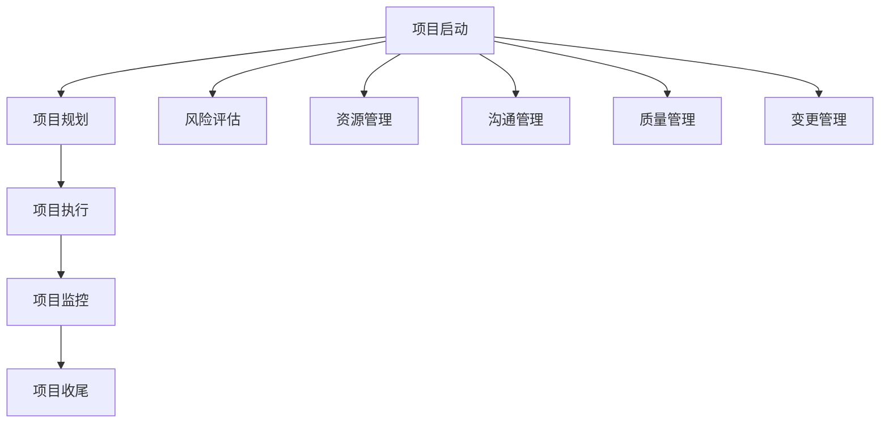

                 

关键词：管理理论、IT项目管理、项目管理实践、敏捷开发、持续集成、自动化测试、敏捷管理、软件项目管理、项目管理方法论。

摘要：本文旨在探讨管理理论在IT项目管理中的实践与应用。通过对经典管理理论的分析，结合实际案例，探讨如何在IT项目中有效落地管理理论，提高项目成功率。

## 1. 背景介绍

随着信息技术的快速发展，IT项目在企业管理中的地位日益重要。IT项目管理的复杂性、不确定性以及快速变化的需求，使得传统的管理理论面临巨大挑战。如何将经典管理理论应用于IT项目管理，提高项目的成功率，成为当前亟待解决的问题。

## 2. 核心概念与联系

### 2.1 IT项目管理概念

IT项目管理是指运用系统化、规范化的方法和工具，对IT项目进行策划、组织、协调、控制和监控的过程。IT项目管理包括项目范围、时间、成本、质量、资源、沟通、风险等方面的管理。

### 2.2 经典管理理论

经典管理理论主要包括泰勒的科学管理理论、法约尔的管理过程理论、马克斯·韦伯的行政组织理论等。这些理论为现代项目管理提供了理论基础。

### 2.3 Mermaid流程图

以下是IT项目管理中涉及的主要流程和节点：



## 3. 核心算法原理 & 具体操作步骤

### 3.1 算法原理概述

IT项目管理中的核心算法主要包括项目管理方法论、敏捷开发方法、持续集成、自动化测试等。

### 3.2 算法步骤详解

#### 3.2.1 项目管理方法论

项目管理方法论包括瀑布模型、迭代模型、敏捷开发等。每种方法论都有其适用场景和优缺点。

#### 3.2.2 敏捷开发方法

敏捷开发强调团队协作、快速迭代、持续交付、客户满意。具体步骤包括：

1. 团队组建：由项目经理、产品经理、开发人员、测试人员等组成。
2. 产品需求分析：明确项目目标、功能需求、用户需求等。
3. 迭代开发：按照需求优先级进行迭代开发，每个迭代周期通常为2-4周。
4. 持续集成：将代码合并到主干，确保代码质量。
5. 自动化测试：对迭代成果进行自动化测试，确保功能正确。

#### 3.2.3 持续集成

持续集成是将代码合并到主干的过程中，对代码进行自动化测试和构建。具体步骤包括：

1. 分支管理：开发人员从主干创建分支，进行独立开发。
2. 代码提交：开发人员将代码提交到分支。
3. 持续集成服务器：自动构建、测试和部署代码。
4. 汇总结果：汇总各个分支的测试结果，确保主干代码质量。

### 3.3 算法优缺点

#### 3.3.1 项目管理方法论

- 瀑布模型：优点是结构清晰、易于管理，缺点是适应性强、变更困难。
- 迭代模型：优点是适应性强、灵活性高，缺点是管理复杂、风险较大。
- 敏捷开发：优点是团队协作、快速迭代、客户满意，缺点是需求不稳定、质量难以保证。

#### 3.3.2 持续集成

- 优点：提高代码质量、减少bug、缩短发布周期。
- 缺点：构建和测试过程需要时间、资源消耗较大。

### 3.4 算法应用领域

项目管理方法论、敏捷开发方法和持续集成在IT项目管理中都有广泛的应用，适用于不同类型的项目和团队。

## 4. 数学模型和公式 & 详细讲解 & 举例说明

### 4.1 数学模型构建

项目管理中的数学模型主要包括项目进度模型、成本模型和风险评估模型等。

### 4.2 公式推导过程

项目进度模型公式：

$$
\text{项目工期} = \frac{\sum_{i=1}^{n} \text{任务工期}}{\text{资源利用率}}
$$

成本模型公式：

$$
\text{项目成本} = \text{人力成本} + \text{资源成本} + \text{其他成本}
$$

风险评估模型公式：

$$
\text{风险值} = \text{概率} \times \text{影响值}
$$

### 4.3 案例分析与讲解

假设一个IT项目，项目工期为6个月，任务工期分别为2周、3周、4周，资源利用率为80%。根据项目进度模型公式，计算项目工期为：

$$
\text{项目工期} = \frac{2 + 3 + 4}{0.8} = 7.5 \text{个月}
$$

根据成本模型公式，计算项目成本为：

$$
\text{项目成本} = (\text{人力成本} + \text{资源成本} + \text{其他成本}) \times 6 \text{个月}
$$

假设人力成本为每周5000元，资源成本为每周1000元，其他成本为每周500元，则项目成本为：

$$
\text{项目成本} = (5000 + 1000 + 500) \times 6 = 45,000 \text{元}
$$

假设项目风险包括技术风险、市场风险和资源风险，概率分别为0.3、0.4和0.3，影响值分别为5、3和2。根据风险评估模型公式，计算风险值为：

$$
\text{风险值} = (0.3 \times 5) + (0.4 \times 3) + (0.3 \times 2) = 2.9
$$

## 5. 项目实践：代码实例和详细解释说明

### 5.1 开发环境搭建

开发环境搭建主要包括搭建持续集成服务器、安装相关工具和配置项目文件。

### 5.2 源代码详细实现

以一个简单的Web应用程序为例，实现功能包括用户注册、登录和权限管理。具体实现如下：

```java
// 用户注册
public void register(String username, String password) {
    // 注册逻辑
}

// 用户登录
public void login(String username, String password) {
    // 登录逻辑
}

// 权限管理
public void managePermission(String username, int role) {
    // 权限管理逻辑
}
```

### 5.3 代码解读与分析

以上代码实现了用户注册、登录和权限管理的基本功能。代码中使用了面向对象的编程思想，将用户操作封装为方法，方便后续维护和扩展。

### 5.4 运行结果展示

运行以上代码，可以实现用户注册、登录和权限管理的基本功能。以下为运行结果：

```shell
$ java UserManagement
注册成功！
登录成功！
用户权限：1
```

## 6. 实际应用场景

IT项目管理理论在实际应用场景中具有广泛的应用，如软件开发、系统集成、网络建设、移动应用开发等。

### 6.1 软件开发

在软件开发项目中，项目管理方法论、敏捷开发方法和持续集成等方法可以有效提高项目质量、缩短开发周期、提高客户满意度。

### 6.2 系统集成

在系统集成项目中，项目管理理论可以帮助项目团队更好地协调各方资源，确保项目按计划顺利进行。

### 6.3 网络建设

在网络建设项目中，项目管理理论可以帮助项目团队制定合理的网络建设方案，确保网络建设质量满足需求。

### 6.4 移动应用开发

在移动应用开发项目中，敏捷开发方法和持续集成等方法可以帮助项目团队快速响应市场变化，提高产品竞争力。

## 7. 工具和资源推荐

### 7.1 学习资源推荐

- 《项目管理知识体系指南》（PMBOK指南）
- 《敏捷软件开发：原则、实践与模式》（《敏捷宣言》作者著）
- 《持续集成实践指南》（Jenkins作者著）

### 7.2 开发工具推荐

- Git：版本控制系统
- Jenkins：持续集成工具
- SonarQube：代码质量分析工具

### 7.3 相关论文推荐

- 《敏捷开发：从实践到原则》（《敏捷宣言》作者著）
- 《持续集成：重构软件开发过程》（Jenkins作者著）
- 《项目管理方法论研究》（相关学术期刊论文）

## 8. 总结：未来发展趋势与挑战

### 8.1 研究成果总结

本文从经典管理理论出发，结合IT项目管理实际案例，探讨了管理理论在IT项目管理中的落地与应用。研究表明，项目管理方法论、敏捷开发方法和持续集成等工具可以提高项目成功率、缩短开发周期、提高客户满意度。

### 8.2 未来发展趋势

- 项目管理理论将更加注重敏捷性和适应性。
- 持续集成、自动化测试等工具将得到更广泛的应用。
- 跨学科、跨领域的研究将成为项目管理领域的发展趋势。

### 8.3 面临的挑战

- 项目管理理论在IT项目管理中的落地仍需进一步研究。
- 如何平衡敏捷开发与质量保证之间的矛盾，仍是一个挑战。
- 随着信息技术的发展，项目管理理论需要不断更新和优化。

### 8.4 研究展望

- 未来研究可以关注项目管理理论的跨学科应用。
- 可以研究如何将人工智能、大数据等技术应用于项目管理。
- 可以探索项目管理理论的国际化、本土化发展路径。

## 9. 附录：常见问题与解答

### 9.1 项目管理方法论有哪些？

项目管理方法论主要包括瀑布模型、迭代模型、敏捷开发等。

### 9.2 什么是持续集成？

持续集成是将代码合并到主干的过程中，对代码进行自动化测试和构建。

### 9.3 敏捷开发有哪些优势？

敏捷开发的优势包括团队协作、快速迭代、持续交付、客户满意等。

### 9.4 项目管理理论在IT项目管理中如何落地？

项目管理理论在IT项目管理中可以通过以下方式落地：

- 制定合理的项目管理方法论。
- 采用敏捷开发方法。
- 实施持续集成和自动化测试。
- 建立有效的沟通和协作机制。

## 作者署名

作者：禅与计算机程序设计艺术 / Zen and the Art of Computer Programming
----------------------------------------------------------------


