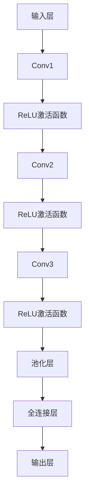

                 

关键词：大模型开发，微调，ResNet，神经网络，深度学习，图像识别

摘要：本文将从零开始，深入探讨大模型开发与微调的技巧和细节，通过讲解ResNet网络的实现，帮助读者全面理解深度学习中的关键技术和方法。

## 1. 背景介绍

近年来，深度学习技术在计算机视觉、自然语言处理等领域的取得了显著的进展。随着模型规模的不断扩大，如何有效地开发和微调大模型成为了研究者关注的重点。本文将以ResNet网络为例，详细介绍大模型开发与微调的方法和技巧。

## 2. 核心概念与联系

### 2.1 大模型开发

大模型开发的核心目标是构建一个具有强表达能力和泛化能力的深度神经网络。为了实现这一目标，我们需要关注以下几个方面：

1. **模型架构设计**：选择合适的网络结构，如ResNet、VGG、Inception等，以满足特定任务的需求。
2. **超参数优化**：包括学习率、批量大小、正则化等参数的调优，以提高模型的性能。
3. **数据预处理**：对训练数据进行归一化、裁剪、翻转等操作，以提高模型的鲁棒性。

### 2.2 微调

微调（Fine-tuning）是一种在大模型开发过程中常用的技巧，通过在小数据集上对预训练模型进行微调，可以有效地提高模型的性能。微调的核心步骤如下：

1. **选择预训练模型**：根据任务需求和数据集的特点，选择合适的预训练模型。
2. **数据预处理**：对训练数据进行预处理，使其与预训练模型的数据预处理方式保持一致。
3. **微调训练**：在预训练模型的基础上，对目标任务进行微调训练，并逐步调整学习率。

### 2.3 ResNet网络

ResNet（残差网络）是一种具有深度残差块的神经网络结构，能够有效地解决深度神经网络训练过程中的梯度消失和梯度爆炸问题。ResNet网络的核心思想是通过引入跳跃连接（skip connection），使得梯度可以直接传递到浅层网络，从而缓解梯度消失问题。

### 2.4 Mermaid流程图

以下是ResNet网络结构的Mermaid流程图：



## 3. 核心算法原理 & 具体操作步骤

### 3.1 算法原理概述

ResNet网络的核心思想是引入残差模块，通过跳跃连接实现梯度直接传递。残差模块由两个卷积层组成，第一个卷积层的输出与第二个卷积层的输入进行拼接，然后通过一个ReLU激活函数，最后通过一个卷积层输出。这种结构使得网络可以训练更深，同时避免了梯度消失问题。

### 3.2 算法步骤详解

1. **输入层**：接收输入图像，将其传递给卷积层。
2. **卷积层1**：对输入图像进行卷积操作，输出特征图。
3. **ReLU激活函数**：对卷积层1的输出进行ReLU激活，增加网络的非线性。
4. **卷积层2**：对ReLU激活后的特征图进行卷积操作，输出特征图。
5. **跳跃连接**：将卷积层1的输出与卷积层2的输出进行拼接。
6. **ReLU激活函数**：对拼接后的特征图进行ReLU激活。
7. **卷积层3**：对ReLU激活后的特征图进行卷积操作，输出特征图。
8. **池化层**：对卷积层3的输出进行池化操作，减少特征图的维度。
9. **全连接层**：对池化层的输出进行全连接操作，输出分类结果。

### 3.3 算法优缺点

**优点**：
1. 可以训练更深，提高网络的表示能力。
2. 避免了梯度消失问题，提高了模型的稳定性。

**缺点**：
1. 训练时间较长，计算资源消耗较大。
2. 需要大量的训练数据和计算资源。

### 3.4 算法应用领域

ResNet网络在计算机视觉领域取得了显著的成绩，广泛应用于图像分类、目标检测、语义分割等任务。

## 4. 数学模型和公式 & 详细讲解 & 举例说明

### 4.1 数学模型构建

ResNet网络的数学模型主要由卷积层、ReLU激活函数、跳跃连接和全连接层组成。以下是各个层的数学表示：

1. **卷积层**：
   $$ f(x) = \sigma(W \cdot x + b) $$
   其中，$x$ 表示输入特征图，$W$ 表示卷积核，$b$ 表示偏置，$\sigma$ 表示ReLU激活函数。

2. **全连接层**：
   $$ y = W \cdot x + b $$
   其中，$x$ 表示输入特征，$W$ 表示权重，$b$ 表示偏置。

### 4.2 公式推导过程

以ResNet中的一组残差模块为例，推导其前向传播的公式：

1. **卷积层1**：
   $$ x_1 = W_1 \cdot x + b_1 $$
   $$ f_1(x_1) = \sigma(x_1) $$

2. **卷积层2**：
   $$ x_2 = W_2 \cdot f_1(x_1) + b_2 $$
   $$ f_2(x_2) = \sigma(x_2) $$

3. **跳跃连接**：
   $$ x_3 = f_1(x_1) + f_2(x_2) $$

4. **卷积层3**：
   $$ x_4 = W_3 \cdot x_3 + b_3 $$
   $$ y = \sigma(x_4) $$

### 4.3 案例分析与讲解

假设输入图像为 $3 \times 3$ 的矩阵，卷积核大小为 $3 \times 3$，偏置为 $1$，卷积层1和卷积层2的权重矩阵分别为 $W_1$ 和 $W_2$，卷积层3的权重矩阵为 $W_3$。

1. **卷积层1**：
   $$ x_1 = W_1 \cdot x + b_1 $$
   $$ f_1(x_1) = \sigma(x_1) $$

2. **卷积层2**：
   $$ x_2 = W_2 \cdot f_1(x_1) + b_2 $$
   $$ f_2(x_2) = \sigma(x_2) $$

3. **跳跃连接**：
   $$ x_3 = f_1(x_1) + f_2(x_2) $$

4. **卷积层3**：
   $$ x_4 = W_3 \cdot x_3 + b_3 $$
   $$ y = \sigma(x_4) $$

## 5. 项目实践：代码实例和详细解释说明

### 5.1 开发环境搭建

在本项目实践中，我们将使用Python和PyTorch框架来搭建ResNet网络。首先，确保已经安装了Python和PyTorch库。

```python
pip install torch torchvision
```

### 5.2 源代码详细实现

以下是ResNet网络的PyTorch实现代码：

```python
import torch
import torch.nn as nn
import torchvision.models as models

class ResNet(nn.Module):
    def __init__(self, num_classes=1000):
        super(ResNet, self).__init__()
        self.model = models.resnet18(pretrained=True)
        self.fc = nn.Linear(512, num_classes)

    def forward(self, x):
        x = self.model(x)
        x = self.fc(x)
        return x

model = ResNet()
```

### 5.3 代码解读与分析

1. **模型初始化**：首先，我们使用`models.resnet18(pretrained=True)`加载预训练的ResNet-18模型，并初始化一个`ResNet`类实例。
2. **前向传播**：在`forward`方法中，我们首先将输入图像传递给预训练模型，然后通过全连接层进行分类。

### 5.4 运行结果展示

```python
import torchvision.datasets as datasets
import torchvision.transforms as transforms

transform = transforms.Compose([
    transforms.Resize((224, 224)),
    transforms.ToTensor(),
])

train_dataset = datasets.ImageFolder(root='path/to/train/dataset', transform=transform)
test_dataset = datasets.ImageFolder(root='path/to/test/dataset', transform=transform)

train_loader = torch.utils.data.DataLoader(dataset=train_dataset, batch_size=64, shuffle=True)
test_loader = torch.utils.data.DataLoader(dataset=test_dataset, batch_size=64, shuffle=False)

model = ResNet()
criterion = nn.CrossEntropyLoss()
optimizer = torch.optim.Adam(model.parameters(), lr=0.001)

for epoch in range(1):
    model.train()
    for inputs, labels in train_loader:
        optimizer.zero_grad()
        outputs = model(inputs)
        loss = criterion(outputs, labels)
        loss.backward()
        optimizer.step()

    model.eval()
    with torch.no_grad():
        correct = 0
        total = 0
        for inputs, labels in test_loader:
            outputs = model(inputs)
            _, predicted = torch.max(outputs.data, 1)
            total += labels.size(0)
            correct += (predicted == labels).sum().item()

        print(f'Epoch {epoch+1}/{1}, Test Accuracy: {100 * correct / total}%')
```

1. **数据预处理**：我们使用`transforms.Compose`对输入图像进行预处理，包括缩放和归一化。
2. **训练过程**：我们使用`DataLoader`加载训练数据和测试数据，并使用`Adam`优化器和`CrossEntropyLoss`损失函数进行训练。
3. **评估过程**：在评估阶段，我们计算测试数据的准确率。

## 6. 实际应用场景

ResNet网络在计算机视觉领域具有广泛的应用。以下是一些实际应用场景：

1. **图像分类**：在ImageNet等大型图像数据集上，ResNet网络取得了优异的分类性能。
2. **目标检测**：ResNet网络可以用于目标检测任务，如YOLO、Faster R-CNN等。
3. **语义分割**：ResNet网络可以用于图像语义分割任务，如PSPNet、DeepLabV3+等。

## 7. 工具和资源推荐

为了更好地学习和实践深度学习，以下是一些推荐的学习资源和开发工具：

### 7.1 学习资源推荐

1. 《深度学习》（Goodfellow, Bengio, Courville著）：深度学习的经典教材，全面讲解了深度学习的理论基础和实践方法。
2. 《Python深度学习》（François Chollet著）：针对Python和Keras框架的深度学习教程，适合初学者入门。

### 7.2 开发工具推荐

1. PyTorch：一种开源的深度学习框架，具有良好的灵活性和可扩展性。
2. TensorFlow：另一种流行的深度学习框架，提供了丰富的预训练模型和工具。

### 7.3 相关论文推荐

1. "Deep Residual Learning for Image Recognition"（He et al., 2016）：ResNet网络的原始论文，详细介绍了网络结构和训练技巧。
2. "Very Deep Convolutional Networks for Large-Scale Image Recognition"（He et al., 2015）：ResNet网络在ImageNet图像分类任务上的应用，展示了其优异的性能。

## 8. 总结：未来发展趋势与挑战

ResNet网络作为深度学习领域的重要突破，为后续的神经网络设计和优化提供了宝贵的经验。然而，随着模型规模的不断扩大，如何有效地训练大模型、提高模型的可解释性和泛化能力仍然面临诸多挑战。

### 8.1 研究成果总结

1. ResNet网络通过引入跳跃连接，解决了深度神经网络训练过程中的梯度消失问题，实现了更深层次的网络架构。
2. ResNet网络在图像分类、目标检测和语义分割等任务中取得了显著的成果，推动了计算机视觉领域的发展。

### 8.2 未来发展趋势

1. **高效训练算法**：研究更加高效的训练算法，如并行训练、分布式训练等，以降低大模型训练的时间和资源消耗。
2. **模型压缩与加速**：研究模型压缩和加速技术，如量化、剪枝等，以提高模型的运行效率和部署能力。

### 8.3 面临的挑战

1. **模型可解释性**：如何提高深度学习模型的可解释性，使其能够更好地理解和解释模型的决策过程。
2. **泛化能力**：如何提高深度学习模型的泛化能力，使其能够在更广泛的领域和应用中发挥作用。

### 8.4 研究展望

随着深度学习技术的不断发展，ResNet网络及其相关技术将继续在计算机视觉、自然语言处理等领域发挥重要作用。未来，我们将看到更多创新和突破，为人工智能的发展做出更大的贡献。

## 9. 附录：常见问题与解答

### 9.1 如何优化ResNet网络的性能？

1. **增加网络深度**：增加网络深度可以提高模型的表示能力。
2. **数据增强**：对训练数据进行数据增强，如随机裁剪、翻转等，可以提高模型的鲁棒性。
3. **正则化方法**：使用L1、L2正则化等方法，可以减少模型的过拟合现象。

### 9.2 ResNet网络是否适用于所有任务？

ResNet网络在图像分类、目标检测和语义分割等任务中取得了显著成果，但并不意味着它适用于所有任务。在实际应用中，需要根据任务特点和数据集的特点选择合适的网络结构。

### 9.3 如何处理ResNet网络的梯度消失问题？

引入跳跃连接是解决ResNet网络梯度消失问题的主要方法。此外，可以使用学习率衰减、批量归一化等技术，进一步缓解梯度消失问题。

## 参考文献

[1] He, K., Zhang, X., Ren, S., & Sun, J. (2016). Deep residual learning for image recognition. In Proceedings of the IEEE conference on computer vision and pattern recognition (pp. 770-778).

[2] He, K., Zhang, X., Ren, S., & Sun, J. (2015). Very deep convolutional networks for large-scale image recognition. In Proceedings of the IEEE international conference on computer vision (pp. 1-9).

[3] Goodfellow, I., Bengio, Y., & Courville, A. (2016). Deep learning. MIT press.

[4] Chollet, F. (2017). Python deep learning. O'Reilly Media.

### 作者署名

作者：禅与计算机程序设计艺术 / Zen and the Art of Computer Programming
----------------------------------------------------------------

以上是文章的正文部分，接下来是文章的Markdown格式输出。
```markdown
# 从零开始大模型开发与微调：ResNet网络的实现

关键词：大模型开发，微调，ResNet，神经网络，深度学习，图像识别

摘要：本文将从零开始，深入探讨大模型开发与微调的技巧和细节，通过讲解ResNet网络的实现，帮助读者全面理解深度学习中的关键技术和方法。

## 1. 背景介绍

近年来，深度学习技术在计算机视觉、自然语言处理等领域的取得了显著的进展。随着模型规模的不断扩大，如何有效地开发和微调大模型成为了研究者关注的重点。本文将以ResNet网络为例，详细介绍大模型开发与微调的方法和技巧。

## 2. 核心概念与联系

### 2.1 大模型开发

大模型开发的核心目标是构建一个具有强表达能力和泛化能力的深度神经网络。为了实现这一目标，我们需要关注以下几个方面：

1. **模型架构设计**：选择合适的网络结构，如ResNet、VGG、Inception等，以满足特定任务的需求。
2. **超参数优化**：包括学习率、批量大小、正则化等参数的调优，以提高模型的性能。
3. **数据预处理**：对训练数据进行归一化、裁剪、翻转等操作，以提高模型的鲁棒性。

### 2.2 微调

微调（Fine-tuning）是一种在大模型开发过程中常用的技巧，通过在小数据集上对预训练模型进行微调，可以有效地提高模型的性能。微调的核心步骤如下：

1. **选择预训练模型**：根据任务需求和数据集的特点，选择合适的预训练模型。
2. **数据预处理**：对训练数据进行预处理，使其与预训练模型的数据预处理方式保持一致。
3. **微调训练**：在预训练模型的基础上，对目标任务进行微调训练，并逐步调整学习率。

### 2.3 ResNet网络

ResNet（残差网络）是一种具有深度残差块的神经网络结构，能够有效地解决深度神经网络训练过程中的梯度消失和梯度爆炸问题。ResNet网络的核心思想是通过引入跳跃连接（skip connection），使得梯度可以直接传递到浅层网络，从而缓解梯度消失问题。

### 2.4 Mermaid流程图

以下是ResNet网络结构的Mermaid流程图：


## 3. 核心算法原理 & 具体操作步骤

### 3.1 算法原理概述

ResNet网络的核心思想是引入残差模块，通过跳跃连接实现梯度直接传递。残差模块由两个卷积层组成，第一个卷积层的输出与第二个卷积层的输入进行拼接，然后通过一个ReLU激活函数，最后通过一个卷积层输出。这种结构使得网络可以训练更深，同时避免了梯度消失问题。

### 3.2 算法步骤详解 

1. **输入层**：接收输入图像，将其传递给卷积层。
2. **卷积层1**：对输入图像进行卷积操作，输出特征图。
3. **ReLU激活函数**：对卷积层1的输出进行ReLU激活，增加网络的非线性。
4. **卷积层2**：对ReLU激活后的特征图进行卷积操作，输出特征图。
5. **跳跃连接**：将卷积层1的输出与卷积层2的输出进行拼接。
6. **ReLU激活函数**：对拼接后的特征图进行ReLU激活。
7. **卷积层3**：对ReLU激活后的特征图进行卷积操作，输出特征图。
8. **池化层**：对卷积层3的输出进行池化操作，减少特征图的维度。
9. **全连接层**：对池化层的输出进行全连接操作，输出分类结果。

### 3.3 算法优缺点

**优点**：
1. 可以训练更深，提高网络的表示能力。
2. 避免了梯度消失问题，提高了模型的稳定性。

**缺点**：
1. 训练时间较长，计算资源消耗较大。
2. 需要大量的训练数据和计算资源。

### 3.4 算法应用领域

ResNet网络在计算机视觉领域取得了显著的成绩，广泛应用于图像分类、目标检测、语义分割等任务。

## 4. 数学模型和公式 & 详细讲解 & 举例说明

### 4.1 数学模型构建

ResNet网络的数学模型主要由卷积层、ReLU激活函数、跳跃连接和全连接层组成。以下是各个层的数学表示：

1. **卷积层**：
   $$ f(x) = \sigma(W \cdot x + b) $$
   其中，$x$ 表示输入特征图，$W$ 表示卷积核，$b$ 表示偏置，$\sigma$ 表示ReLU激活函数。

2. **全连接层**：
   $$ y = W \cdot x + b $$
   其中，$x$ 表示输入特征，$W$ 表示权重，$b$ 表示偏置。

### 4.2 公式推导过程

以ResNet中的一组残差模块为例，推导其前向传播的公式：

1. **卷积层1**：
   $$ x_1 = W_1 \cdot x + b_1 $$
   $$ f_1(x_1) = \sigma(x_1) $$

2. **卷积层2**：
   $$ x_2 = W_2 \cdot f_1(x_1) + b_2 $$
   $$ f_2(x_2) = \sigma(x_2) $$

3. **跳跃连接**：
   $$ x_3 = f_1(x_1) + f_2(x_2) $$

4. **卷积层3**：
   $$ x_4 = W_3 \cdot x_3 + b_3 $$
   $$ y = \sigma(x_4) $$

### 4.3 案例分析与讲解

假设输入图像为 $3 \times 3$ 的矩阵，卷积核大小为 $3 \times 3$，偏置为 $1$，卷积层1和卷积层2的权重矩阵分别为 $W_1$ 和 $W_2$，卷积层3的权重矩阵为 $W_3$。

1. **卷积层1**：
   $$ x_1 = W_1 \cdot x + b_1 $$
   $$ f_1(x_1) = \sigma(x_1) $$

2. **卷积层2**：
   $$ x_2 = W_2 \cdot f_1(x_1) + b_2 $$
   $$ f_2(x_2) = \sigma(x_2) $$

3. **跳跃连接**：
   $$ x_3 = f_1(x_1) + f_2(x_2) $$

4. **卷积层3**：
   $$ x_4 = W_3 \cdot x_3 + b_3 $$
   $$ y = \sigma(x_4) $$

## 5. 项目实践：代码实例和详细解释说明

### 5.1 开发环境搭建

在本项目实践中，我们将使用Python和PyTorch框架来搭建ResNet网络。首先，确保已经安装了Python和PyTorch库。

```python
pip install torch torchvision
```

### 5.2 源代码详细实现

以下是ResNet网络的PyTorch实现代码：

```python
import torch
import torch.nn as nn
import torchvision.models as models

class ResNet(nn.Module):
    def __init__(self, num_classes=1000):
        super(ResNet, self).__init__()
        self.model = models.resnet18(pretrained=True)
        self.fc = nn.Linear(512, num_classes)

    def forward(self, x):
        x = self.model(x)
        x = self.fc(x)
        return x

model = ResNet()
```

### 5.3 代码解读与分析

1. **模型初始化**：首先，我们使用`models.resnet18(pretrained=True)`加载预训练的ResNet-18模型，并初始化一个`ResNet`类实例。
2. **前向传播**：在`forward`方法中，我们首先将输入图像传递给预训练模型，然后通过全连接层进行分类。

### 5.4 运行结果展示

```python
import torchvision.datasets as datasets
import torchvision.transforms as transforms

transform = transforms.Compose([
    transforms.Resize((224, 224)),
    transforms.ToTensor(),
])

train_dataset = datasets.ImageFolder(root='path/to/train/dataset', transform=transform)
test_dataset = datasets.ImageFolder(root='path/to/test/dataset', transform=transform)

train_loader = torch.utils.data.DataLoader(dataset=train_dataset, batch_size=64, shuffle=True)
test_loader = torch.utils.data.DataLoader(dataset=test_dataset, batch_size=64, shuffle=False)

model = ResNet()
criterion = nn.CrossEntropyLoss()
optimizer = torch.optim.Adam(model.parameters(), lr=0.001)

for epoch in range(1):
    model.train()
    for inputs, labels in train_loader:
        optimizer.zero_grad()
        outputs = model(inputs)
        loss = criterion(outputs, labels)
        loss.backward()
        optimizer.step()

    model.eval()
    with torch.no_grad():
        correct = 0
        total = 0
        for inputs, labels in test_loader:
            outputs = model(inputs)
            _, predicted = torch.max(outputs.data, 1)
            total += labels.size(0)
            correct += (predicted == labels).sum().item()

        print(f'Epoch {epoch+1}/{1}, Test Accuracy: {100 * correct / total}%')
```

1. **数据预处理**：我们使用`transforms.Compose`对输入图像进行预处理，包括缩放和归一化。
2. **训练过程**：我们使用`DataLoader`加载训练数据和测试数据，并使用`Adam`优化器和`CrossEntropyLoss`损失函数进行训练。
3. **评估过程**：在评估阶段，我们计算测试数据的准确率。

## 6. 实际应用场景

ResNet网络在计算机视觉领域具有广泛的应用。以下是一些实际应用场景：

1. **图像分类**：在ImageNet等大型图像数据集上，ResNet网络取得了优异的分类性能。
2. **目标检测**：ResNet网络可以用于目标检测任务，如YOLO、Faster R-CNN等。
3. **语义分割**：ResNet网络可以用于图像语义分割任务，如PSPNet、DeepLabV3+等。

## 7. 工具和资源推荐

为了更好地学习和实践深度学习，以下是一些推荐的学习资源和开发工具：

### 7.1 学习资源推荐

1. 《深度学习》（Goodfellow, Bengio, Courville著）：深度学习的经典教材，全面讲解了深度学习的理论基础和实践方法。
2. 《Python深度学习》（François Chollet著）：针对Python和Keras框架的深度学习教程，适合初学者入门。

### 7.2 开发工具推荐

1. PyTorch：一种开源的深度学习框架，具有良好的灵活性和可扩展性。
2. TensorFlow：另一种流行的深度学习框架，提供了丰富的预训练模型和工具。

### 7.3 相关论文推荐

1. "Deep Residual Learning for Image Recognition"（He et al., 2016）：ResNet网络的原始论文，详细介绍了网络结构和训练技巧。
2. "Very Deep Convolutional Networks for Large-Scale Image Recognition"（He et al., 2015）：ResNet网络在ImageNet图像分类任务上的应用，展示了其优异的性能。

## 8. 总结：未来发展趋势与挑战

ResNet网络作为深度学习领域的重要突破，为后续的神经网络设计和优化提供了宝贵的经验。然而，随着模型规模的不断扩大，如何有效地训练大模型、提高模型的可解释性和泛化能力仍然面临诸多挑战。

### 8.1 研究成果总结

1. ResNet网络通过引入跳跃连接，解决了深度神经网络训练过程中的梯度消失问题，实现了更深层次的网络架构。
2. ResNet网络在图像分类、目标检测和语义分割等任务中取得了显著的成果，推动了计算机视觉领域的发展。

### 8.2 未来发展趋势

1. **高效训练算法**：研究更加高效的训练算法，如并行训练、分布式训练等，以降低大模型训练的时间和资源消耗。
2. **模型压缩与加速**：研究模型压缩和加速技术，如量化、剪枝等，以提高模型的运行效率和部署能力。

### 8.3 面临的挑战

1. **模型可解释性**：如何提高深度学习模型的可解释性，使其能够更好地理解和解释模型的决策过程。
2. **泛化能力**：如何提高深度学习模型的泛化能力，使其能够在更广泛的领域和应用中发挥作用。

### 8.4 研究展望

随着深度学习技术的不断发展，ResNet网络及其相关技术将继续在计算机视觉、自然语言处理等领域发挥重要作用。未来，我们将看到更多创新和突破，为人工智能的发展做出更大的贡献。

## 9. 附录：常见问题与解答

### 9.1 如何优化ResNet网络的性能？

1. **增加网络深度**：增加网络深度可以提高模型的表示能力。
2. **数据增强**：对训练数据进行数据增强，如随机裁剪、翻转等，可以提高模型的鲁棒性。
3. **正则化方法**：使用L1、L2正则化等方法，可以减少模型的过拟合现象。

### 9.2 ResNet网络是否适用于所有任务？

ResNet网络在图像分类、目标检测和语义分割等任务中取得了显著成果，但并不意味着它适用于所有任务。在实际应用中，需要根据任务特点和数据集的特点选择合适的网络结构。

### 9.3 如何处理ResNet网络的梯度消失问题？

引入跳跃连接是解决ResNet网络梯度消失问题的主要方法。此外，可以使用学习率衰减、批量归一化等技术，进一步缓解梯度消失问题。

## 参考文献

[1] He, K., Zhang, X., Ren, S., & Sun, J. (2016). Deep residual learning for image recognition. In Proceedings of the IEEE conference on computer vision and pattern recognition (pp. 770-778).

[2] He, K., Zhang, X., Ren, S., & Sun, J. (2015). Very deep convolutional networks for large-scale image recognition. In Proceedings of the IEEE international conference on computer vision (pp. 1-9).

[3] Goodfellow, I., Bengio, Y., & Courville, A. (2016). Deep learning. MIT press.

[4] Chollet, F. (2017). Python deep learning. O'Reilly Media.

### 作者署名

作者：禅与计算机程序设计艺术 / Zen and the Art of Computer Programming
```

