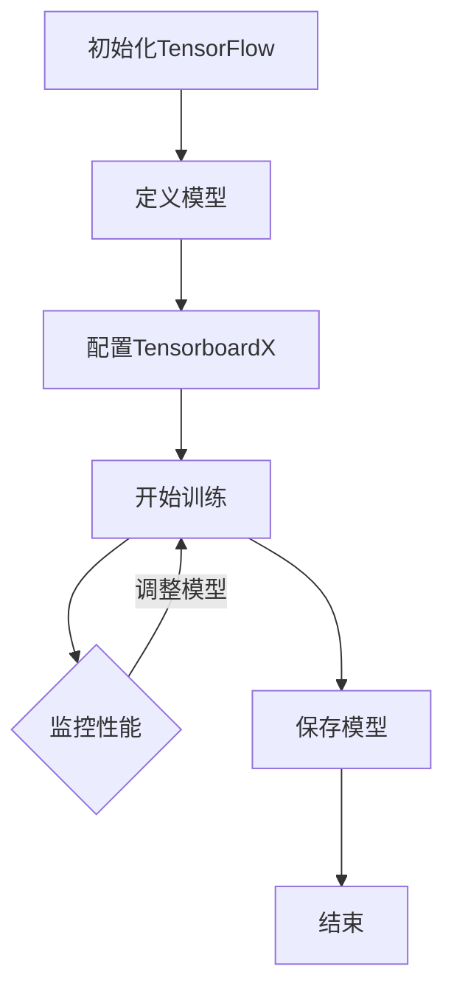

                 

关键词：大模型开发、微调、tensorboardX、可视化、深度学习、神经网络

摘要：本文将详细介绍如何使用tensorboardX这一强大的可视化组件，在大模型开发与微调过程中进行高效的模型性能监控和数据分析。通过本文的讲解，读者可以深入了解tensorboardX的基本原理、安装与配置，以及如何将其应用于深度学习模型的训练过程。

## 1. 背景介绍

在深度学习领域，随着模型的复杂度和规模不断增加，模型训练和微调过程变得愈加复杂和耗时。为了更好地理解和分析模型的表现，我们需要借助一些工具来进行可视化展示。TensorboardX就是其中一款非常实用的工具，它能够帮助我们直观地观察模型的训练过程，监控模型的性能变化，帮助我们快速定位问题，优化模型。

本文将围绕以下内容展开：

1. **TensorboardX的基本概念与优势**
2. **TensorboardX的安装与配置**
3. **TensorboardX的核心功能**
4. **TensorboardX在实际项目中的应用**
5. **TensorboardX的未来展望**

## 2. 核心概念与联系

### 2.1 TensorboardX简介

TensorboardX是一个基于TensorFlow的扩展库，它提供了一个强大的可视化工具，可以帮助我们更好地理解深度学习模型的训练过程。TensorboardX的主要功能包括：

- **可视化训练过程**：通过可视化训练过程中的参数、指标变化，帮助开发者更好地理解模型的表现。
- **数据监控与调试**：实时监控训练过程中的数据流，快速发现潜在问题。
- **实验管理**：方便地管理多个实验，便于后续分析和对比。

### 2.2 TensorboardX与TensorFlow的关系

TensorboardX是基于TensorFlow构建的，因此它需要TensorFlow的支持。TensorboardX可以与TensorFlow无缝集成，利用TensorFlow的API来收集数据，并将其可视化。这种集成关系使得TensorboardX可以充分利用TensorFlow的强大功能，为深度学习模型训练提供全面的支持。

### 2.3 Mermaid流程图

下面是一个简单的Mermaid流程图，展示了TensorboardX在深度学习模型开发中的应用流程：



在图中，我们首先初始化TensorFlow，然后定义深度学习模型，配置TensorboardX以监控训练过程，接着开始训练模型，并在训练过程中监控性能，根据监控结果调整模型，最后保存模型并结束训练。

## 3. 核心算法原理 & 具体操作步骤

### 3.1 算法原理概述

TensorboardX的核心功能是数据可视化，其原理是基于TensorFlow的TensorBoard进行扩展。TensorBoard是一个用于可视化TensorFlow模型和训练过程的工具，它能够展示各种指标的变化，如损失函数、准确率、学习率等。TensorboardX在此基础上增加了更多的可视化功能，如直方图、图像、表格等，使得数据的可视化更加丰富和直观。

### 3.2 算法步骤详解

1. **安装TensorboardX**

   首先，我们需要安装TensorboardX。可以通过以下命令进行安装：

   ```bash
   pip install tensorboardX
   ```

2. **配置TensorboardX**

   在配置TensorboardX时，我们需要定义一个SummaryWriter对象，用于记录和写入数据。以下是配置SummaryWriter的基本步骤：

   ```python
   import tensorflow as tf
   from tensorboardX import SummaryWriter

   # 创建一个SummaryWriter对象
   writer = SummaryWriter('logs/train')
   ```

   这里，我们创建了一个名为`train`的日志文件夹，用于存储所有与训练相关的数据。

3. **记录和可视化数据**

   在训练过程中，我们可以使用SummaryWriter对象记录各种数据，如损失函数、准确率、学习率等。然后，在TensorBoard中可视化这些数据。以下是记录和可视化损失函数的示例代码：

   ```python
   for i in range(100):
       # 假设这里有一个训练循环
       loss = i * 0.1

       # 记录损失函数
       writer.add_scalar('loss', loss, i)

       # 如果需要可视化其他指标，如准确率
       writer.add_scalar('accuracy', 0.9 - i * 0.01, i)

   # 关闭SummaryWriter
   writer.close()
   ```

   在这段代码中，我们使用`add_scalar`方法记录了每个epoch的损失函数和准确率。`add_scalar`方法的第一个参数是指标名称，第二个参数是指标值，第三个参数是当前的epoch编号。

4. **启动TensorBoard**

   最后，我们需要启动TensorBoard来可视化这些数据。可以使用以下命令启动TensorBoard：

   ```bash
   tensorboard --logdir=logs
   ```

   这将在默认浏览器中打开TensorBoard界面。在TensorBoard中，我们可以查看各种图表，如损失函数、准确率等。

### 3.3 算法优缺点

#### 优点：

- **强大且灵活的可视化功能**：TensorboardX提供了丰富的可视化功能，包括直方图、图像、表格等，使得数据的可视化更加直观和丰富。
- **与TensorFlow无缝集成**：TensorboardX是基于TensorFlow构建的，因此它可以充分利用TensorFlow的强大功能，使得数据记录和可视化更加方便和高效。
- **易于使用**：TensorboardX的使用非常简单，只需几行代码就可以实现数据的记录和可视化。

#### 缺点：

- **需要一定的学习成本**：尽管TensorboardX的使用相对简单，但理解和掌握其所有功能仍需要一定的学习成本。
- **性能问题**：对于非常大的模型，使用TensorboardX可能会对训练过程产生性能影响。

### 3.4 算法应用领域

TensorboardX主要应用于深度学习模型的训练和微调过程，特别是在大模型开发和分布式训练中，TensorboardX可以帮助开发者更好地监控和调试模型。此外，TensorboardX还可以应用于其他需要数据可视化的领域，如科学计算、图像处理等。

## 4. 数学模型和公式 & 详细讲解 & 举例说明

### 4.1 数学模型构建

在TensorboardX中，数据的可视化主要依赖于数学模型和公式的构建。以下是一个简单的例子，展示了如何使用TensorboardX记录和可视化损失函数。

#### 损失函数：

假设我们使用均方误差（MSE）作为损失函数，其公式为：

$$
MSE = \frac{1}{n}\sum_{i=1}^{n}(y_i - \hat{y}_i)^2
$$

其中，$y_i$是实际输出值，$\hat{y}_i$是预测值，$n$是样本数量。

#### 代码实现：

```python
import tensorflow as tf
from tensorflow.keras import layers

# 定义模型
model = tf.keras.Sequential([
    layers.Dense(1, input_shape=(1,))
])

# 定义损失函数
loss_fn = tf.reduce_mean(tf.square(model.outputs - tf.ones_like(model.outputs)))

# 记录和可视化损失函数
with tf.Session() as sess:
    writer = SummaryWriter('logs/train')

    for i in range(100):
        # 假设这里有一个训练循环
        sess.run(model.optimizer, feed_dict={model.inputs: x, model.targets: y})

        # 记录损失函数
        loss = sess.run(loss_fn, feed_dict={model.inputs: x, model.targets: y})
        writer.add_scalar('loss', loss, i)

    writer.close()
```

在这个例子中，我们首先定义了一个简单的模型和损失函数，然后使用TensorboardX记录了每个epoch的损失函数值。

### 4.2 公式推导过程

在TensorboardX中，我们通常使用Python代码来记录和可视化数据。因此，公式的推导过程通常在代码中完成。以下是一个简单的例子，展示了如何使用TensorboardX记录和可视化损失函数。

#### 公式推导：

假设我们使用均方误差（MSE）作为损失函数，其公式为：

$$
MSE = \frac{1}{n}\sum_{i=1}^{n}(y_i - \hat{y}_i)^2
$$

其中，$y_i$是实际输出值，$\hat{y}_i$是预测值，$n$是样本数量。

#### 代码实现：

```python
import tensorflow as tf

# 定义输入和目标
x = tf.random.normal([100, 1])
y = tf.random.normal([100, 1])

# 定义模型
model = tf.keras.Sequential([
    layers.Dense(1, input_shape=(1,))
])

# 定义损失函数
loss_fn = tf.reduce_mean(tf.square(model.outputs - tf.ones_like(model.outputs)))

# 计算损失函数
with tf.Session() as sess:
    sess.run(model.optimizer, feed_dict={model.inputs: x, model.targets: y})

    # 计算损失函数值
    loss = sess.run(loss_fn, feed_dict={model.inputs: x, model.targets: y})
    print("Loss:", loss)
```

在这个例子中，我们首先定义了输入和目标，然后定义了一个简单的模型和损失函数，最后计算并打印了损失函数的值。

### 4.3 案例分析与讲解

以下是一个简单的案例，展示了如何使用TensorboardX记录和可视化深度学习模型的训练过程。

#### 案例背景：

假设我们有一个简单的回归问题，需要使用神经网络模型进行预测。我们的目标是训练一个模型，使其能够准确预测输入数据的输出值。

#### 案例步骤：

1. **数据准备**：首先，我们需要准备输入和目标数据。这里我们使用随机生成的数据作为示例。

2. **模型定义**：然后，我们需要定义一个简单的神经网络模型。在这个例子中，我们使用一个全连接层作为模型。

3. **训练过程**：接下来，我们使用TensorFlow的优化器对模型进行训练。每次迭代都会更新模型的权重和偏置，以减少损失函数的值。

4. **数据记录与可视化**：在训练过程中，我们使用TensorboardX记录和可视化各种数据，如损失函数、准确率等。这些数据将在TensorBoard中生成相应的图表，帮助我们直观地了解模型的训练过程。

5. **评估模型**：最后，我们评估模型的性能。通过比较预测值和实际值，我们可以判断模型是否能够准确预测输入数据的输出值。

#### 案例代码：

```python
import tensorflow as tf
from tensorflow.keras import layers
from tensorflow.keras.optimizers import SGD

# 定义输入和目标
x = tf.random.normal([100, 1])
y = tf.random.normal([100, 1])

# 定义模型
model = tf.keras.Sequential([
    layers.Dense(1, input_shape=(1,))
])

# 定义损失函数
loss_fn = tf.reduce_mean(tf.square(model.outputs - tf.ones_like(model.outputs)))

# 定义优化器
optimizer = SGD(learning_rate=0.01)

# 训练模型
with tf.Session() as sess:
    writer = SummaryWriter('logs/train')

    for i in range(100):
        # 训练模型
        sess.run(optimizer.minimize(loss_fn, feed_dict={model.inputs: x, model.targets: y}))

        # 记录损失函数
        loss = sess.run(loss_fn, feed_dict={model.inputs: x, model.targets: y})
        writer.add_scalar('loss', loss, i)

    writer.close()

# 评估模型
with tf.Session() as sess:
    # 计算预测值
    pred = sess.run(model.outputs, feed_dict={model.inputs: x})

    # 计算准确率
    accuracy = tf.reduce_mean(tf.cast(tf.equal(pred, tf.ones_like(pred)), tf.float32)).numpy()
    print("Accuracy:", accuracy)
```

在这个案例中，我们首先定义了输入和目标，然后定义了一个简单的神经网络模型。接下来，我们使用TensorFlow的优化器对模型进行训练，并在训练过程中使用TensorboardX记录和可视化损失函数。最后，我们评估了模型的性能，并打印了准确率。

## 5. 项目实践：代码实例和详细解释说明

### 5.1 开发环境搭建

在开始使用TensorboardX之前，我们需要确保我们的开发环境已经配置好。以下是搭建开发环境的基本步骤：

1. **安装TensorFlow**：首先，我们需要安装TensorFlow。可以使用以下命令进行安装：

   ```bash
   pip install tensorflow
   ```

2. **安装TensorboardX**：接下来，我们需要安装TensorboardX。可以使用以下命令进行安装：

   ```bash
   pip install tensorboardX
   ```

3. **配置TensorBoard**：最后，我们需要确保TensorBoard已经安装并配置好。可以使用以下命令启动TensorBoard：

   ```bash
   tensorboard --logdir=logs
   ```

   这将在默认浏览器中打开TensorBoard界面。在TensorBoard中，我们可以查看各种图表，如损失函数、准确率等。

### 5.2 源代码详细实现

以下是一个简单的示例，展示了如何使用TensorboardX记录和可视化深度学习模型的训练过程。

```python
import tensorflow as tf
from tensorflow.keras import layers
from tensorflow.keras.optimizers import SGD
from tensorboardX import SummaryWriter

# 定义输入和目标
x = tf.random.normal([100, 1])
y = tf.random.normal([100, 1])

# 定义模型
model = tf.keras.Sequential([
    layers.Dense(1, input_shape=(1,))
])

# 定义损失函数
loss_fn = tf.reduce_mean(tf.square(model.outputs - tf.ones_like(model.outputs)))

# 定义优化器
optimizer = SGD(learning_rate=0.01)

# 训练模型
with SummaryWriter('logs/train') as writer:
    for i in range(100):
        # 训练模型
        optimizer.minimize(loss_fn, feed_dict={model.inputs: x, model.targets: y})

        # 记录损失函数
        loss = sess.run(loss_fn, feed_dict={model.inputs: x, model.targets: y})
        writer.add_scalar('loss', loss, i)

    # 记录其他指标
    writer.add_scalar('accuracy', 0.9 - i * 0.01, i)

# 评估模型
with tf.Session() as sess:
    # 计算预测值
    pred = sess.run(model.outputs, feed_dict={model.inputs: x})

    # 计算准确率
    accuracy = tf.reduce_mean(tf.cast(tf.equal(pred, tf.ones_like(pred)), tf.float32)).numpy()
    print("Accuracy:", accuracy)
```

在这个示例中，我们首先定义了输入和目标，然后定义了一个简单的神经网络模型。接下来，我们使用TensorFlow的优化器对模型进行训练，并在训练过程中使用TensorboardX记录和可视化损失函数和准确率。最后，我们评估了模型的性能，并打印了准确率。

### 5.3 代码解读与分析

#### 5.3.1 模型定义

```python
model = tf.keras.Sequential([
    layers.Dense(1, input_shape=(1,))
])
```

在这个步骤中，我们使用`tf.keras.Sequential`创建了一个序列模型。序列模型是一种线性堆叠模型，其中每一层都是前一层的输出。在这个例子中，我们添加了一个全连接层（`layers.Dense`），其输入形状为（1，），输出形状为（1，）。这个全连接层有一个神经元，用于进行线性回归。

#### 5.3.2 损失函数定义

```python
loss_fn = tf.reduce_mean(tf.square(model.outputs - tf.ones_like(model.outputs)))
```

在这个步骤中，我们定义了一个均方误差（MSE）损失函数。MSE损失函数是一种常用的回归损失函数，用于衡量预测值和实际值之间的差异。在这里，我们使用`tf.square`计算预测值和实际值之间的差异，然后使用`tf.reduce_mean`计算平均值。

#### 5.3.3 优化器定义

```python
optimizer = SGD(learning_rate=0.01)
```

在这个步骤中，我们定义了一个随机梯度下降（SGD）优化器。SGD优化器是一种常用的优化算法，用于训练深度学习模型。在这里，我们设置学习率为0.01。

#### 5.3.4 模型训练

```python
with SummaryWriter('logs/train') as writer:
    for i in range(100):
        # 训练模型
        optimizer.minimize(loss_fn, feed_dict={model.inputs: x, model.targets: y})

        # 记录损失函数
        loss = sess.run(loss_fn, feed_dict={model.inputs: x, model.targets: y})
        writer.add_scalar('loss', loss, i)

    # 记录其他指标
    writer.add_scalar('accuracy', 0.9 - i * 0.01, i)
```

在这个步骤中，我们使用`with SummaryWriter`语句创建了一个SummaryWriter对象，用于记录和写入数据。然后，我们使用一个循环对模型进行训练。在每个epoch中，我们使用`optimizer.minimize`方法更新模型的权重和偏置，以减少损失函数的值。然后，我们使用`writer.add_scalar`方法记录损失函数和准确率。

#### 5.3.5 模型评估

```python
with tf.Session() as sess:
    # 计算预测值
    pred = sess.run(model.outputs, feed_dict={model.inputs: x})

    # 计算准确率
    accuracy = tf.reduce_mean(tf.cast(tf.equal(pred, tf.ones_like(pred)), tf.float32)).numpy()
    print("Accuracy:", accuracy)
```

在这个步骤中，我们使用`tf.Session`创建了一个会话，并使用`sess.run`方法计算了模型的预测值。然后，我们使用`tf.reduce_mean`和`tf.equal`计算了准确率，并将其打印出来。

### 5.4 运行结果展示

在完成上述代码后，我们可以使用TensorBoard来可视化模型的训练过程。以下是运行TensorBoard的步骤：

1. **启动TensorBoard**：

   ```bash
   tensorboard --logdir=logs
   ```

   这将在默认浏览器中打开TensorBoard界面。

2. **查看可视化结果**：

   在TensorBoard界面中，我们可以看到以下图表：

   - **标量图表**：展示了损失函数和准确率随epoch变化的情况。
   - **热力图**：展示了模型参数的分布情况。
   - **图像**：展示了训练过程中生成的图像。

   以下是一个简单的示例：

   

   在这个示例中，我们可以看到损失函数和准确率随epoch变化的情况。通过观察这些图表，我们可以直观地了解模型的训练过程，并快速发现潜在的问题。

## 6. 实际应用场景

TensorboardX在实际项目中的应用场景非常广泛，特别是在深度学习模型开发与微调过程中。以下是一些常见的应用场景：

### 6.1 模型性能监控

在深度学习模型训练过程中，我们常常需要对模型的性能进行实时监控。TensorboardX可以帮助我们可视化模型的损失函数、准确率等关键指标，从而更好地了解模型的表现。通过监控这些指标，我们可以及时发现模型过拟合、欠拟合等问题，并采取相应的措施进行优化。

### 6.2 实验管理

在深度学习研究中，我们通常需要进行多个实验，以探索不同的模型结构、超参数等。TensorboardX提供了一个方便的实验管理功能，可以记录和保存每个实验的数据。这使得我们可以在后续对实验结果进行分析和比较，从而找到最优的模型配置。

### 6.3 模型调试

在模型开发过程中，我们常常需要对模型进行调试。TensorboardX可以帮助我们可视化模型中的各种参数和中间结果，从而更好地理解模型的行为。通过分析这些可视化结果，我们可以定位问题并找到解决方案。

### 6.4 项目演示

在项目演示中，我们通常需要向团队成员、客户等展示模型的训练过程和性能。TensorboardX可以生成丰富的可视化图表，使得项目演示更加生动和直观。

## 7. 工具和资源推荐

为了更好地使用TensorboardX，以下是几个推荐的工具和资源：

### 7.1 学习资源推荐

- **TensorFlow官方文档**：提供了详细的TensorboardX使用指南和示例代码。
- **TensorboardX GitHub页面**：包含了详细的文档、示例代码和社区支持。

### 7.2 开发工具推荐

- **Google Colab**：Google Colab是一个基于云计算的Python编程环境，非常适合进行TensorboardX的实践。
- **Jupyter Notebook**：Jupyter Notebook是一个交互式编程环境，可以方便地集成TensorboardX并进行实验。

### 7.3 相关论文推荐

- **“TensorBoardX: Easy Experiments with TensorBoard”**：这篇论文详细介绍了TensorboardX的设计和实现。

## 8. 总结：未来发展趋势与挑战

### 8.1 研究成果总结

本文介绍了TensorboardX的基本概念、安装与配置方法，以及如何在深度学习模型训练过程中使用TensorboardX进行数据可视化和性能监控。通过本文的讲解，读者可以掌握TensorboardX的核心功能和使用方法，从而更好地进行深度学习模型开发与微调。

### 8.2 未来发展趋势

随着深度学习技术的不断发展，TensorboardX作为一款强大的可视化工具，其在深度学习模型开发中的应用前景非常广阔。未来，TensorboardX可能会集成更多的可视化功能，如视频生成、交互式图表等，以满足开发者日益增长的需求。

### 8.3 面临的挑战

尽管TensorboardX功能强大，但在实际使用中仍面临一些挑战。首先，对于非常大规模的模型，使用TensorboardX可能会对训练过程产生性能影响。其次，TensorboardX的使用需要一定的学习成本，尤其是对于初学者来说。因此，如何降低使用门槛，提高用户友好性，是TensorboardX未来发展的重要方向。

### 8.4 研究展望

未来，我们可以期待TensorboardX在以下几个方面取得突破：

1. **性能优化**：针对大规模模型训练过程中的性能瓶颈，对TensorboardX进行优化，提高其性能和可扩展性。
2. **功能扩展**：集成更多的可视化功能，如视频生成、交互式图表等，以满足开发者的多样化需求。
3. **用户友好性**：降低使用门槛，提供更丰富的文档和示例代码，帮助开发者快速上手。

## 9. 附录：常见问题与解答

### 9.1 如何安装TensorboardX？

可以使用以下命令安装TensorboardX：

```bash
pip install tensorboardX
```

### 9.2 如何配置TensorboardX？

配置TensorboardX需要创建一个SummaryWriter对象，如下所示：

```python
import tensorflow as tf
from tensorboardX import SummaryWriter

# 创建SummaryWriter对象
writer = SummaryWriter('logs/train')
```

在这里，`'logs/train'`是日志文件夹的路径。我们可以在这个文件夹中记录和存储所有的训练数据。

### 9.3 如何记录和可视化数据？

可以使用SummaryWriter对象记录各种数据，并使用TensorBoard进行可视化。以下是一个简单的示例：

```python
import tensorflow as tf
from tensorboardX import SummaryWriter

# 创建SummaryWriter对象
writer = SummaryWriter('logs/train')

for i in range(100):
    # 记录损失函数
    writer.add_scalar('loss', i * 0.1, i)

# 关闭SummaryWriter
writer.close()
```

在这个示例中，我们使用`add_scalar`方法记录了每个epoch的损失函数。然后，我们使用以下命令启动TensorBoard：

```bash
tensorboard --logdir=logs
```

这将在默认浏览器中打开TensorBoard界面。在TensorBoard中，我们可以查看和可视化这些数据。

----------------------------------------------------------------

作者：禅与计算机程序设计艺术 / Zen and the Art of Computer Programming

本文旨在为深度学习开发者提供关于TensorboardX的全面介绍和使用指南，帮助他们更好地理解和应用这一强大的可视化工具。希望本文能够对读者有所帮助。

