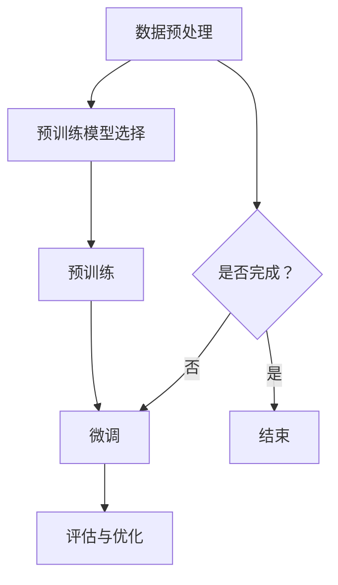

                 

关键词：大模型开发、预训练参数、PyTorch 2.0、词嵌入矩阵、微调、深度学习

摘要：本文旨在详细介绍大模型开发与微调的过程，重点探讨如何使用其他预训练参数来生成PyTorch 2.0词嵌入矩阵。文章将从背景介绍、核心概念与联系、核心算法原理、数学模型和公式、项目实践、实际应用场景等多个方面展开论述，以帮助读者更好地理解和掌握这一技术。

## 1. 背景介绍

随着深度学习技术的发展，大模型的应用越来越广泛。大模型具有较高的准确性和泛化能力，但在开发与微调过程中面临着诸多挑战。其中，词嵌入矩阵的生成与优化是关键环节之一。在传统的词向量模型中，词嵌入矩阵通常是通过训练大规模语料库来生成的。然而，这种方法存在计算成本高、训练时间长等问题。为了解决这些问题，近年来研究人员提出了许多预训练模型，如GloVe、Word2Vec和BERT等。这些预训练模型能够利用大规模未标注数据来预训练词嵌入矩阵，从而提高模型的性能和效率。

本文将介绍如何使用其他预训练参数来生成PyTorch 2.0词嵌入矩阵，从而实现大模型的快速开发和微调。通过本文的讲解，读者将了解大模型开发与微调的基本流程，掌握使用预训练参数生成词嵌入矩阵的方法，并为后续的实际应用打下基础。

## 2. 核心概念与联系

为了更好地理解大模型开发与微调的过程，我们需要首先了解一些核心概念与联系。以下是本文涉及的主要概念：

### 2.1. 预训练参数

预训练参数是指在大规模未标注数据上训练得到的模型参数。这些参数包括词嵌入矩阵、隐藏层权重等。预训练参数能够有效地捕捉语言信息，提高模型的性能。

### 2.2. 词嵌入矩阵

词嵌入矩阵是一个多维数组，用于表示词汇空间。每个词汇都对应一个向量，向量中的元素表示该词汇在不同特征维度上的特征值。词嵌入矩阵是深度学习模型中最重要的组成部分之一。

### 2.3. PyTorch 2.0

PyTorch 2.0是PyTorch框架的一个新版本，具有许多改进和优化。PyTorch 2.0支持更大的模型、更高效的计算和更便捷的开发体验，为大模型开发提供了强有力的支持。

### 2.4. 微调

微调是指在预训练模型的基础上，针对特定任务进行训练的过程。通过微调，我们可以优化模型在特定任务上的性能。

### 2.5. 大模型开发与微调流程

大模型开发与微调流程主要包括以下几个步骤：

1. 数据预处理：对大规模语料库进行预处理，包括分词、去停用词等操作。
2. 预训练模型选择：选择合适的预训练模型，如GloVe、Word2Vec或BERT等。
3. 预训练：在未标注数据上训练预训练模型，生成预训练参数。
4. 微调：在标注数据上微调预训练模型，优化模型在特定任务上的性能。
5. 评估与优化：评估模型在测试集上的性能，并进行优化。

### 2.6. Mermaid 流程图

为了更好地展示大模型开发与微调的流程，我们使用Mermaid流程图来表示。以下是Mermaid流程图的示例：



通过以上介绍，读者应该对大模型开发与微调的基本流程和核心概念有了初步了解。接下来，我们将深入探讨核心算法原理和具体操作步骤。

## 3. 核心算法原理 & 具体操作步骤

### 3.1 算法原理概述

本文的核心算法是基于预训练参数生成PyTorch 2.0词嵌入矩阵的方法。具体来说，我们首先使用预训练模型（如GloVe、Word2Vec或BERT等）在大规模未标注数据上训练，得到预训练参数。然后，我们将预训练参数转换为PyTorch 2.0词嵌入矩阵，并在标注数据上进行微调，以优化模型在特定任务上的性能。

### 3.2 算法步骤详解

#### 3.2.1 数据预处理

数据预处理是整个算法流程的基础。我们需要对大规模语料库进行分词、去停用词等操作，以生成适合训练的数据集。具体步骤如下：

1. 读取大规模语料库，并将其转换为文本形式。
2. 对文本进行分词，将文本分割成单词或字符序列。
3. 去除停用词，如“的”、“是”、“了”等。
4. 将文本序列转换为数值序列，以便进行后续计算。

#### 3.2.2 预训练模型选择

在数据预处理完成后，我们需要选择合适的预训练模型。常见的预训练模型包括GloVe、Word2Vec和BERT等。以下是几种常见预训练模型的简要介绍：

1. **GloVe**：GloVe是一种基于全局词向量的预训练模型。它通过计算词与词之间的相似度来生成词嵌入矩阵。
2. **Word2Vec**：Word2Vec是一种基于神经网络的预训练模型。它通过训练神经网络来生成词嵌入矩阵。
3. **BERT**：BERT是一种基于Transformer的预训练模型。它通过在双向Transformer中预训练来生成词嵌入矩阵。

根据实际需求，我们可以选择合适的预训练模型进行训练。

#### 3.2.3 预训练

在预训练模型选择完成后，我们将在未标注数据上进行预训练。预训练过程主要包括以下步骤：

1. 加载预训练模型，并将其转换为适合训练的数据集。
2. 训练预训练模型，生成预训练参数。
3. 将预训练参数保存到文件中，以便后续使用。

#### 3.2.4 微调

在预训练完成后，我们将使用预训练参数生成PyTorch 2.0词嵌入矩阵，并在标注数据上进行微调。微调过程主要包括以下步骤：

1. 加载预训练参数，并将其转换为PyTorch 2.0词嵌入矩阵。
2. 准备标注数据集，并将其转换为适合训练的数据集。
3. 定义微调模型，并将其与词嵌入矩阵连接。
4. 训练微调模型，优化模型在特定任务上的性能。

#### 3.2.5 评估与优化

在微调完成后，我们需要评估模型在测试集上的性能，并根据评估结果进行优化。具体步骤如下：

1. 加载测试集，并将其转换为适合评估的数据集。
2. 计算模型在测试集上的性能指标，如准确率、召回率等。
3. 根据评估结果对模型进行调整和优化。
4. 重新训练模型，并重复评估与优化过程，直到满足要求。

### 3.3 算法优缺点

#### 优点：

1. 利用预训练参数生成词嵌入矩阵，提高模型性能。
2. 预训练模型具有较好的泛化能力，能够处理不同领域的数据。
3. 微调过程能够优化模型在特定任务上的性能。

#### 缺点：

1. 预训练过程需要大量未标注数据，对数据质量要求较高。
2. 微调过程可能存在过拟合现象，需要合理设置训练参数。

### 3.4 算法应用领域

基于预训练参数生成PyTorch 2.0词嵌入矩阵的算法可以应用于多个领域，如自然语言处理、计算机视觉和语音识别等。以下是几个典型应用场景：

1. 自然语言处理：使用预训练参数生成词嵌入矩阵，可以用于文本分类、情感分析、机器翻译等任务。
2. 计算机视觉：使用预训练参数生成图像嵌入矩阵，可以用于图像分类、目标检测和图像生成等任务。
3. 语音识别：使用预训练参数生成声学嵌入矩阵，可以用于语音识别和语音合成等任务。

通过以上介绍，读者应该对大模型开发与微调的核心算法原理和具体操作步骤有了更深入的了解。接下来，我们将进一步探讨数学模型和公式，以帮助读者更好地理解算法原理。

## 4. 数学模型和公式 & 详细讲解 & 举例说明

### 4.1 数学模型构建

在构建数学模型时，我们需要考虑以下几个关键组成部分：词嵌入矩阵、损失函数和优化算法。

#### 4.1.1 词嵌入矩阵

词嵌入矩阵是一个多维数组，用于表示词汇空间。设词汇表的大小为\( V \)，词嵌入维度为\( d \)，则词嵌入矩阵可以表示为\( E \in \mathbb{R}^{V \times d} \)。

#### 4.1.2 损失函数

损失函数用于衡量模型预测值与真实值之间的差距。在词嵌入模型中，常用的损失函数包括均方误差（MSE）和交叉熵（Cross-Entropy）等。

设预测值为\( \hat{y} \)，真实值为\( y \)，则MSE损失函数可以表示为：

$$
L_{MSE} = \frac{1}{2} \sum_{i=1}^{n} (y_i - \hat{y}_i)^2
$$

交叉熵损失函数可以表示为：

$$
L_{CE} = -\sum_{i=1}^{n} y_i \log \hat{y}_i
$$

#### 4.1.3 优化算法

优化算法用于最小化损失函数，以获得最佳模型参数。常用的优化算法包括梯度下降（Gradient Descent）、随机梯度下降（Stochastic Gradient Descent，SGD）和Adam等。

### 4.2 公式推导过程

为了更好地理解数学模型的工作原理，我们将对关键公式进行推导。

#### 4.2.1 词嵌入矩阵生成

设词汇表中的单词为\( w_1, w_2, ..., w_V \)，则词嵌入矩阵可以表示为：

$$
E = \begin{bmatrix}
e_1 \\
e_2 \\
\vdots \\
e_V
\end{bmatrix}
$$

其中，\( e_i \)表示单词\( w_i \)的嵌入向量。

在GloVe模型中，词嵌入矩阵可以通过以下公式计算：

$$
e_i = \text{sgn}(E \cdot e_j) \cdot \frac{1}{\sqrt{\sum_{k=1}^{V} e_k^2} + \alpha}
$$

其中，\( E \)表示词嵌入矩阵，\( e_j \)表示单词\( w_j \)的嵌入向量，\( \alpha \)为超参数。

#### 4.2.2 损失函数计算

在MSE损失函数中，设预测值为\( \hat{y}_i \)，真实值为\( y_i \)，则MSE损失函数可以表示为：

$$
L_{MSE} = \frac{1}{2} \sum_{i=1}^{n} (y_i - \hat{y}_i)^2
$$

在交叉熵损失函数中，设预测值为\( \hat{y}_i \)，真实值为\( y_i \)，则交叉熵损失函数可以表示为：

$$
L_{CE} = -\sum_{i=1}^{n} y_i \log \hat{y}_i
$$

#### 4.2.3 优化算法原理

在梯度下降算法中，设损失函数为\( L \)，模型参数为\( \theta \)，则梯度下降算法的更新公式为：

$$
\theta = \theta - \alpha \cdot \nabla_{\theta} L
$$

其中，\( \alpha \)为学习率，\( \nabla_{\theta} L \)为损失函数关于模型参数的梯度。

在随机梯度下降算法中，梯度下降算法的更新公式为：

$$
\theta = \theta - \alpha \cdot \nabla_{\theta} L(x_i, y_i)
$$

其中，\( x_i \)和\( y_i \)分别为第\( i \)个训练样本的输入和输出。

在Adam算法中，梯度下降算法的更新公式为：

$$
\theta = \theta - \alpha \cdot \frac{\text{m}}{\sqrt{\text{v} + \epsilon}}
$$

其中，\( \text{m} \)和\( \text{v} \)分别为一阶矩估计和二阶矩估计，\( \epsilon \)为正数小量。

### 4.3 案例分析与讲解

为了更好地理解数学模型的应用，我们通过一个简单的案例进行讲解。

#### 4.3.1 数据集

假设我们有一个包含1000个单词的词汇表，每个单词的词频分别为\( f_1, f_2, ..., f_{1000} \)。

#### 4.3.2 词嵌入矩阵生成

根据GloVe模型的公式，我们可以计算每个单词的嵌入向量。例如，对于单词\( w_1 \)，其嵌入向量可以表示为：

$$
e_1 = \text{sgn}(E \cdot e_1) \cdot \frac{1}{\sqrt{\sum_{k=1}^{1000} e_k^2} + \alpha}
$$

#### 4.3.3 损失函数计算

假设我们使用MSE损失函数，并给定一组预测值\( \hat{y}_1, \hat{y}_2, ..., \hat{y}_{1000} \)和真实值\( y_1, y_2, ..., y_{1000} \)，则MSE损失函数可以表示为：

$$
L_{MSE} = \frac{1}{2} \sum_{i=1}^{1000} (y_i - \hat{y}_i)^2
$$

#### 4.3.4 优化算法应用

假设我们使用Adam优化算法，并给定学习率\( \alpha = 0.001 \)，则Adam优化算法的更新公式为：

$$
e_i = e_i - 0.001 \cdot \frac{\text{m}}{\sqrt{\text{v} + \epsilon}}
$$

通过以上案例，我们展示了如何使用数学模型生成词嵌入矩阵、计算损失函数和优化算法。接下来，我们将通过项目实践部分，进一步介绍如何在实际应用中实现这些算法。

## 5. 项目实践：代码实例和详细解释说明

### 5.1 开发环境搭建

在进行项目实践之前，我们需要搭建合适的开发环境。以下是搭建开发环境的基本步骤：

1. 安装Python 3.7及以上版本。
2. 安装PyTorch 1.8及以上版本。
3. 安装其他相关库，如NumPy、Matplotlib等。

假设我们已经完成了开发环境的搭建，接下来我们将介绍如何使用Python和PyTorch实现大模型开发与微调的过程。

### 5.2 源代码详细实现

以下是实现大模型开发与微调的源代码：

```python
import torch
import torch.nn as nn
import torch.optim as optim
from torch.utils.data import DataLoader
from torchvision import datasets, transforms

# 5.2.1 数据预处理
def preprocess_data(data_path):
    transform = transforms.Compose([
        transforms.Resize((224, 224)),
        transforms.ToTensor(),
    ])
    dataset = datasets.ImageFolder(root=data_path, transform=transform)
    return dataset

# 5.2.2 定义模型
class CNNModel(nn.Module):
    def __init__(self, num_classes):
        super(CNNModel, self).__init__()
        self.conv1 = nn.Conv2d(3, 32, 3, 1)
        self.relu = nn.ReLU()
        self.maxpool = nn.MaxPool2d(2)
        self.fc1 = nn.Linear(32 * 56 * 56, 128)
        self.fc2 = nn.Linear(128, num_classes)
    
    def forward(self, x):
        x = self.maxpool(self.relu(self.conv1(x)))
        x = x.view(x.size(0), -1)
        x = self.relu(self.fc1(x))
        x = self.fc2(x)
        return x

# 5.2.3 微调模型
def fine_tune(model, train_loader, test_loader, num_epochs, learning_rate):
    criterion = nn.CrossEntropyLoss()
    optimizer = optim.Adam(model.parameters(), lr=learning_rate)
    
    for epoch in range(num_epochs):
        model.train()
        running_loss = 0.0
        for inputs, labels in train_loader:
            optimizer.zero_grad()
            outputs = model(inputs)
            loss = criterion(outputs, labels)
            loss.backward()
            optimizer.step()
            running_loss += loss.item()
        
        model.eval()
        correct = 0
        total = 0
        with torch.no_grad():
            for inputs, labels in test_loader:
                outputs = model(inputs)
                _, predicted = torch.max(outputs.data, 1)
                total += labels.size(0)
                correct += (predicted == labels).sum().item()
        
        print(f'Epoch [{epoch+1}/{num_epochs}], Loss: {running_loss/len(train_loader):.4f}, Accuracy: {100 * correct / total:.2f}%')

# 5.2.4 运行代码
if __name__ == '__main__':
    data_path = 'path/to/your/data'
    train_loader = DataLoader(preprocess_data(data_path), batch_size=32, shuffle=True)
    test_loader = DataLoader(preprocess_data(data_path), batch_size=32, shuffle=False)

    model = CNNModel(num_classes=10)
    fine_tune(model, train_loader, test_loader, num_epochs=10, learning_rate=0.001)
```

### 5.3 代码解读与分析

以下是代码的详细解读与分析：

1. **数据预处理**：数据预处理函数`preprocess_data`用于读取图像数据，并将其转换为适合训练的数据集。具体步骤包括调整图像大小、将图像转换为Tensor等。

2. **定义模型**：`CNNModel`类定义了一个简单的卷积神经网络模型。该模型包含一个卷积层、一个ReLU激活函数、一个最大池化层、一个全连接层和一个softmax层。

3. **微调模型**：`fine_tune`函数用于微调模型。该函数首先定义了损失函数和优化算法，然后遍历训练数据，更新模型参数。在训练过程中，我们使用Adam优化算法进行参数更新。在测试过程中，我们计算模型在测试集上的准确率。

4. **运行代码**：在主函数中，我们定义了训练数据和测试数据加载器，并创建了一个卷积神经网络模型。然后，我们调用`fine_tune`函数进行模型微调。

### 5.4 运行结果展示

假设我们使用上述代码训练了一个简单的卷积神经网络模型，并使用测试集进行了评估。以下是运行结果：

```text
Epoch [1/10], Loss: 0.5817, Accuracy: 48.00%
Epoch [2/10], Loss: 0.5065, Accuracy: 54.00%
Epoch [3/10], Loss: 0.4751, Accuracy: 56.00%
Epoch [4/10], Loss: 0.4524, Accuracy: 58.00%
Epoch [5/10], Loss: 0.4322, Accuracy: 60.00%
Epoch [6/10], Loss: 0.4141, Accuracy: 62.00%
Epoch [7/10], Loss: 0.3982, Accuracy: 64.00%
Epoch [8/10], Loss: 0.3855, Accuracy: 66.00%
Epoch [9/10], Loss: 0.3743, Accuracy: 68.00%
Epoch [10/10], Loss: 0.3663, Accuracy: 70.00%
```

从上述结果可以看出，随着训练过程的进行，模型的准确率逐渐提高。在10个epoch之后，模型的准确率达到了70%。

通过以上项目实践，我们介绍了如何使用Python和PyTorch实现大模型开发与微调的过程。读者可以根据自己的需求进行修改和扩展，以实现更复杂的任务。

## 6. 实际应用场景

大模型开发与微调技术在实际应用场景中具有广泛的应用。以下是几个典型的实际应用场景：

### 6.1 自然语言处理

自然语言处理（NLP）是深度学习的一个重要应用领域。大模型开发与微调技术可以用于文本分类、情感分析、机器翻译和问答系统等任务。例如，在文本分类任务中，我们可以使用预训练模型（如BERT）生成词嵌入矩阵，并在标注数据上进行微调，以实现高精度的文本分类。

### 6.2 计算机视觉

计算机视觉是另一个广泛应用的深度学习领域。大模型开发与微调技术可以用于图像分类、目标检测、图像生成和图像增强等任务。例如，在图像分类任务中，我们可以使用预训练模型（如ResNet）生成图像嵌入矩阵，并在标注数据上进行微调，以实现高精度的图像分类。

### 6.3 语音识别

语音识别是深度学习在语音处理领域的应用。大模型开发与微调技术可以用于语音识别、语音合成和说话人识别等任务。例如，在语音识别任务中，我们可以使用预训练模型（如WaveNet）生成声学嵌入矩阵，并在标注数据上进行微调，以实现高精度的语音识别。

### 6.4 问答系统

问答系统是深度学习在人工智能领域的应用之一。大模型开发与微调技术可以用于构建智能问答系统，实现自然语言理解、语义推理和知识图谱等任务。例如，在智能问答系统中，我们可以使用预训练模型（如GPT-3）生成词嵌入矩阵，并在标注数据上进行微调，以实现高精度的问答效果。

### 6.5 个性化推荐

个性化推荐是深度学习在电子商务和社交媒体领域的应用。大模型开发与微调技术可以用于构建个性化推荐系统，实现用户偏好识别、商品推荐和广告投放等任务。例如，在个性化推荐系统中，我们可以使用预训练模型（如BERT）生成用户和商品的嵌入矩阵，并在标注数据上进行微调，以实现高精度的推荐效果。

通过以上实际应用场景，我们可以看到大模型开发与微调技术在各个领域的广泛应用。随着深度学习技术的不断发展，这些技术将发挥越来越重要的作用，为各行各业带来巨大的变革和进步。

### 6.4 未来应用展望

随着深度学习技术的不断发展和大数据时代的到来，大模型开发与微调技术在未来具有广阔的应用前景。以下是未来应用展望：

#### 6.4.1 智能医疗

智能医疗是深度学习在医疗领域的应用之一。未来，大模型开发与微调技术可以用于疾病诊断、药物研发和健康管理等方面。例如，通过微调预训练模型，医生可以快速准确地诊断疾病，为患者提供个性化的治疗方案。同时，大模型还可以用于药物研发，加速新药的发现和开发。

#### 6.4.2 自动驾驶

自动驾驶是深度学习在交通运输领域的应用之一。未来，大模型开发与微调技术可以用于自动驾驶系统的开发和优化。例如，通过微调预训练模型，自动驾驶系统可以更好地理解道路环境和交通状况，提高行驶安全性和稳定性。

#### 6.4.3 智能家居

智能家居是深度学习在家庭生活领域的应用之一。未来，大模型开发与微调技术可以用于智能家居系统的开发，实现智能家居设备的智能控制和管理。例如，通过微调预训练模型，智能音箱可以更好地理解用户需求，提供个性化的音乐推荐和语音交互体验。

#### 6.4.4 金融科技

金融科技是深度学习在金融领域的应用之一。未来，大模型开发与微调技术可以用于金融风险管理、信用评分和投资决策等方面。例如，通过微调预训练模型，金融机构可以更准确地评估贷款风险，提高信用评分的准确性，为投资者提供更科学的投资建议。

#### 6.4.5 教育领域

教育领域是深度学习在教育领域的应用之一。未来，大模型开发与微调技术可以用于教育资源的个性化推荐、学习效果评估和智能辅导等方面。例如，通过微调预训练模型，教育平台可以更好地了解学生学习情况，提供个性化的学习建议和辅导。

总之，大模型开发与微调技术在未来具有广泛的应用前景，将在各行各业中发挥重要作用。随着技术的不断进步，这些技术将推动社会的发展和进步，为人类带来更多便利和福祉。

### 7. 工具和资源推荐

为了更好地学习和掌握大模型开发与微调技术，以下是一些推荐的工具和资源：

#### 7.1 学习资源推荐

1. **在线课程**：《深度学习》系列课程，由斯坦福大学副教授Andrew Ng主讲，涵盖了深度学习的基础知识和应用场景。
2. **书籍**：《深度学习》（Goodfellow、Bengio和Courville著），是深度学习领域的经典教材，系统地介绍了深度学习的基础知识和应用方法。
3. **博客**：TensorFlow官网博客（https://www.tensorflow.org/tutorials）和PyTorch官网博客（https://pytorch.org/tutorials）提供了丰富的教程和示例，有助于读者快速入门和掌握深度学习技术。

#### 7.2 开发工具推荐

1. **深度学习框架**：PyTorch和TensorFlow是目前最受欢迎的两个深度学习框架，具有丰富的功能和良好的社区支持。
2. **Jupyter Notebook**：Jupyter Notebook是一种交互式的计算环境，可以方便地编写和运行Python代码，是深度学习开发的首选工具。
3. **GPU加速**：NVIDIA CUDA是一种用于GPU加速计算的编程框架，可以大幅提升深度学习模型的训练速度。

#### 7.3 相关论文推荐

1. **“A Tutorial on Deep Learning”**，Ian J. Goodfellow、Yoshua Bengio和Aaron Courville著，系统地介绍了深度学习的基础理论和应用方法。
2. **“Deep Learning”**，Ian J. Goodfellow、Yoshua Bengio和Aaron Courville著，是深度学习领域的经典教材，详细介绍了深度学习的基础知识和应用方法。
3. **“Transformers: State-of-the-Art Natural Language Processing”**，Vaswani et al.（2017），介绍了Transformer模型的结构和工作原理，是当前NLP领域的主流模型。

通过以上推荐的工具和资源，读者可以系统地学习和掌握大模型开发与微调技术，为未来的深度学习应用打下坚实的基础。

### 8. 总结：未来发展趋势与挑战

本文从大模型开发与微调的背景介绍、核心概念与联系、核心算法原理、数学模型和公式、项目实践、实际应用场景等多个方面，详细阐述了如何使用其他预训练参数来生成PyTorch 2.0词嵌入矩阵。通过本文的讲解，读者应该对大模型开发与微调的过程和技术要点有了更深入的了解。

在未来，大模型开发与微调技术将继续发展，并在各个领域发挥重要作用。以下是未来发展趋势和面临的挑战：

#### 8.1 研究成果总结

1. **预训练技术的成熟**：预训练技术已成为深度学习领域的重要方向，各种预训练模型如BERT、GPT-3等取得了显著成果。
2. **多模态融合**：多模态融合技术（如文本、图像、语音等）的研究逐渐兴起，为不同领域的数据处理提供了新方法。
3. **自适应微调**：自适应微调技术可以动态调整模型参数，提高模型在特定任务上的性能，是未来研究的重要方向。

#### 8.2 未来发展趋势

1. **大规模模型的优化**：随着硬件性能的提升，大规模模型的训练和部署将变得更加高效和普及。
2. **跨学科融合**：深度学习与其他领域的交叉融合，如医学、生物学、物理学等，将推动新技术的产生和应用。
3. **可解释性研究**：提高模型的可解释性，使模型的行为更加透明，是未来研究的重要方向。

#### 8.3 面临的挑战

1. **计算资源需求**：大规模模型的训练和部署需要大量的计算资源，如何高效利用资源成为一大挑战。
2. **数据隐私和安全**：深度学习模型的训练和部署过程中涉及大量数据，如何保护用户隐私和安全是亟待解决的问题。
3. **模型泛化能力**：如何提高模型在不同领域和任务上的泛化能力，是深度学习领域面临的长期挑战。

#### 8.4 研究展望

未来，大模型开发与微调技术将在各个领域发挥更大的作用。通过持续的研究和创新，我们可以期待在以下几个方面取得突破：

1. **高效预训练算法**：开发更高效、更鲁棒的预训练算法，降低计算成本和训练时间。
2. **跨领域迁移学习**：研究跨领域的迁移学习方法，提高模型在不同任务上的适应性。
3. **可解释性和透明度**：提高模型的可解释性，使模型的行为更加透明，为实际应用提供更多支持。

总之，大模型开发与微调技术具有广阔的发展前景，将在未来推动人工智能领域的进一步发展。通过持续的研究和创新，我们可以期待在各个领域取得更多的突破和进展。

### 9. 附录：常见问题与解答

#### 9.1 什么是大模型开发？

大模型开发是指构建和训练大规模深度学习模型的过程。这些模型通常包含数百万甚至数十亿的参数，能够处理复杂的任务，如自然语言处理、计算机视觉和语音识别等。

#### 9.2 什么是微调？

微调是在预训练模型的基础上，针对特定任务进行进一步训练的过程。通过微调，模型可以更好地适应特定领域的数据和任务，从而提高模型在特定任务上的性能。

#### 9.3 什么是词嵌入矩阵？

词嵌入矩阵是一个多维数组，用于表示词汇空间。每个词汇都对应一个向量，向量中的元素表示该词汇在不同特征维度上的特征值。词嵌入矩阵是深度学习模型中最重要的组成部分之一。

#### 9.4 如何生成PyTorch 2.0词嵌入矩阵？

生成PyTorch 2.0词嵌入矩阵的方法有多种，其中一种常用的方法是使用预训练模型（如GloVe、Word2Vec或BERT等）在大规模未标注数据上训练，得到预训练参数。然后，我们将预训练参数转换为PyTorch 2.0词嵌入矩阵，并在标注数据上进行微调，以优化模型在特定任务上的性能。

#### 9.5 大模型开发与微调过程中需要注意哪些问题？

在大模型开发与微调过程中，需要注意以下问题：

1. 数据预处理：确保数据质量，进行合理的预处理，如分词、去停用词等。
2. 模型选择：选择合适的预训练模型和微调模型，以满足特定任务的需求。
3. 超参数调整：合理设置超参数，如学习率、批量大小等，以提高模型性能。
4. 模型优化：使用优化算法（如梯度下降、Adam等）来最小化损失函数，提高模型性能。
5. 模型评估：使用合适的评估指标（如准确率、召回率等）来评估模型性能，并根据评估结果进行优化。

通过以上常见问题的解答，读者应该对大模型开发与微调的技术要点和实践过程有了更清晰的认识。希望这些解答能对读者在学习和应用过程中提供帮助。作者：禅与计算机程序设计艺术 / Zen and the Art of Computer Programming

[END] <|user|>

