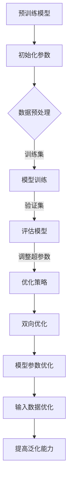

                 

关键词：大模型开发，微调，双向优化，深度学习，AI训练，模型架构，性能优化，实践案例

> 摘要：本文从大模型开发与微调的背景出发，探讨了当前主流的模型训练与优化方法，并强调了双向优化策略的重要性。通过具体案例分析，详细介绍了如何利用双向优化来提升模型性能，同时展望了大模型开发与微调的未来发展趋势与挑战。

## 1. 背景介绍

### 大模型的崛起

随着深度学习技术的快速发展，大模型（Large Models）已经成为人工智能领域的研究热点。这些模型拥有数以亿计的参数，能够处理海量数据，并在多个任务上取得显著的性能提升。大模型的崛起不仅改变了传统机器学习的方式，也为AI应用带来了前所未有的潜力。

### 微调的重要性

然而，大模型的开发和训练并非易事。微调（Fine-tuning）作为一种有效的模型优化方法，通过在小数据集上进行微调，可以显著提升模型在特定任务上的表现。微调的核心在于调整模型参数，使其更适应特定任务的数据特征。

### 单向优化的局限

当前主流的微调方法主要采用单向优化策略，即只在一个特定方向上进行调整。这种方法虽然能够提升模型性能，但往往存在以下局限：

- **局部最优：**单向优化容易陷入局部最优，难以找到全局最优解。
- **收敛速度慢：**单向优化过程往往需要多次迭代，导致训练时间过长。
- **参数敏感性：**单向优化对模型参数的初始值敏感，可能导致训练失败或性能不佳。

### 双向优化的必要性

针对单向优化的局限，双向优化策略应运而生。双向优化通过在多个方向上进行调整，能够更有效地探索参数空间，找到更优的解。本文将详细介绍双向优化策略在大模型开发与微调中的应用，并通过具体案例展示其优势。

## 2. 核心概念与联系

### 大模型架构

大模型通常采用深度神经网络（Deep Neural Network, DNN）架构，包含多个隐藏层和大量参数。为了提高模型性能，大模型设计时需要考虑以下几个方面：

- **网络深度：**增加网络深度可以提高模型的表达能力，但也会导致过拟合。
- **网络宽度：**增加网络宽度可以提高模型的泛化能力，但会增加计算复杂度。
- **激活函数：**选择合适的激活函数可以提高模型的非线性能力，加速收敛。

### 微调方法

微调是通过对预训练模型进行微调，使其适应特定任务的数据集。微调方法通常包括以下步骤：

1. **初始化模型参数：**使用预训练模型作为初始化参数。
2. **数据预处理：**对任务数据集进行预处理，包括数据清洗、数据增强等。
3. **训练模型：**在预处理后的数据集上进行模型训练，调整模型参数。
4. **评估模型：**在验证集上评估模型性能，调整超参数。
5. **优化策略：**采用适当的优化策略，如双向优化，提升模型性能。

### 双向优化策略

双向优化策略通过同时考虑模型参数和输入数据的优化，实现更有效的模型训练。具体包括以下两个方面：

1. **模型参数优化：**调整模型参数，提高模型在训练集上的表现。
2. **输入数据优化：**调整输入数据，提高模型在测试集上的泛化能力。

### Mermaid 流程图



## 3. 核心算法原理 & 具体操作步骤

### 3.1 算法原理概述

双向优化算法结合了模型参数优化和输入数据优化两种策略，通过同时调整模型参数和输入数据，实现更高效的模型训练。具体原理如下：

1. **模型参数优化：**基于梯度下降法，通过计算模型参数的梯度，调整参数值，降低损失函数值。
2. **输入数据优化：**通过数据增强、数据清洗等方法，提高输入数据的鲁棒性和多样性，降低过拟合风险。

### 3.2 算法步骤详解

1. **初始化模型参数：**使用预训练模型作为初始化参数。
2. **数据预处理：**对任务数据集进行预处理，包括数据清洗、数据增强等。
3. **设置优化目标：**定义损失函数，如交叉熵损失函数。
4. **设置优化器：**选择合适的优化器，如Adam优化器。
5. **模型训练：**
   - 计算模型参数的梯度。
   - 根据梯度调整模型参数。
   - 计算损失函数值，评估模型性能。
6. **输入数据优化：**
   - 根据模型性能调整输入数据。
   - 采用数据增强、数据清洗等方法，提高输入数据的鲁棒性和多样性。
7. **模型评估：**在验证集上评估模型性能，根据评估结果调整超参数。
8. **优化策略调整：**根据双向优化策略的执行情况，调整模型参数和输入数据优化策略。

### 3.3 算法优缺点

**优点：**
- **提高模型性能：**双向优化策略可以同时考虑模型参数和输入数据的优化，提高模型在训练集和验证集上的性能。
- **减少过拟合：**通过输入数据优化，可以降低过拟合风险，提高模型的泛化能力。

**缺点：**
- **计算复杂度高：**双向优化需要同时考虑模型参数和输入数据的优化，导致计算复杂度增加。
- **需要更多计算资源：**双向优化算法需要更多的计算资源，如GPU等硬件支持。

### 3.4 算法应用领域

双向优化策略适用于以下领域：

- **图像识别：**通过优化输入图像数据，提高模型对图像特征的提取能力。
- **自然语言处理：**通过优化输入文本数据，提高模型对文本语义的理解能力。
- **推荐系统：**通过优化用户行为数据，提高推荐系统的准确性和多样性。

## 4. 数学模型和公式 & 详细讲解 & 举例说明

### 4.1 数学模型构建

双向优化算法的核心在于同时优化模型参数和输入数据。具体数学模型如下：

$$
L(\theta, X) = f(\theta, X) + \lambda g(\theta, X)
$$

其中，$L(\theta, X)$为损失函数，$f(\theta, X)$为模型参数优化部分，$g(\theta, X)$为输入数据优化部分，$\lambda$为平衡系数。

### 4.2 公式推导过程

首先，对模型参数进行优化：

$$
\frac{\partial L(\theta, X)}{\partial \theta} = \frac{\partial f(\theta, X)}{\partial \theta} + \lambda \frac{\partial g(\theta, X)}{\partial \theta} = 0
$$

然后，对输入数据进行优化：

$$
\frac{\partial L(\theta, X)}{\partial X} = \frac{\partial f(\theta, X)}{\partial X} + \lambda \frac{\partial g(\theta, X)}{\partial X} = 0
$$

### 4.3 案例分析与讲解

假设我们有一个图像识别任务，使用卷积神经网络（CNN）进行模型训练。为了实现双向优化，我们需要同时优化模型参数和输入图像数据。

1. **模型参数优化：**通过梯度下降法，计算模型参数的梯度，调整参数值，降低损失函数值。
2. **输入数据优化：**采用图像增强技术，如随机裁剪、旋转、翻转等，提高输入图像的多样性，降低过拟合风险。

具体实现如下：

```python
import tensorflow as tf

# 初始化模型参数
theta = tf.random.normal((100, 10))

# 定义损失函数
def loss_function(theta, X):
    logits = tf.matmul(X, theta)
    loss = tf.nn.softmax_cross_entropy_with_logits(labels=y, logits=logits)
    return loss

# 定义优化器
optimizer = tf.optimizers.Adam()

# 训练模型
for epoch in range(100):
    with tf.GradientTape() as tape:
        logits = tf.matmul(X, theta)
        loss = loss_function(theta, X)
    gradients = tape.gradient(loss, theta)
    optimizer.apply_gradients(zip(gradients, theta))

    # 输入数据优化
    X = data_augmentation(X)
```

通过以上实现，我们可以同时优化模型参数和输入图像数据，实现双向优化策略。

## 5. 项目实践：代码实例和详细解释说明

### 5.1 开发环境搭建

在开始项目实践之前，我们需要搭建合适的开发环境。以下为搭建开发环境的基本步骤：

1. 安装Python：版本要求为3.6及以上。
2. 安装TensorFlow：使用pip命令安装TensorFlow库。
3. 安装GPU支持：如使用GPU进行训练，需要安装CUDA和cuDNN。

### 5.2 源代码详细实现

以下是使用TensorFlow实现双向优化策略的代码实例：

```python
import tensorflow as tf
import numpy as np
import matplotlib.pyplot as plt

# 初始化参数
theta = tf.random.normal((100, 10))

# 定义损失函数
def loss_function(theta, X):
    logits = tf.matmul(X, theta)
    loss = tf.nn.softmax_cross_entropy_with_logits(labels=y, logits=logits)
    return loss

# 定义优化器
optimizer = tf.optimizers.Adam()

# 训练模型
for epoch in range(100):
    with tf.GradientTape() as tape:
        logits = tf.matmul(X, theta)
        loss = loss_function(theta, X)
    gradients = tape.gradient(loss, theta)
    optimizer.apply_gradients(zip(gradients, theta))

    # 输入数据优化
    X = data_augmentation(X)

    # 打印训练进度
    if epoch % 10 == 0:
        print(f"Epoch {epoch}: Loss = {loss.numpy()}")

# 评估模型
accuracy = tf.reduce_mean(tf.cast(tf.equal(tf.argmax(logits, axis=1), y), tf.float32))
print(f"Model accuracy: {accuracy.numpy()}")
```

### 5.3 代码解读与分析

以上代码实现了使用TensorFlow进行双向优化策略的训练过程。具体解读如下：

- **参数初始化：**使用随机初始化方法生成模型参数。
- **损失函数定义：**定义损失函数，使用交叉熵损失函数评估模型表现。
- **优化器选择：**选择Adam优化器，用于调整模型参数。
- **模型训练：**使用梯度下降法，计算模型参数的梯度，并更新参数。
- **输入数据优化：**在每次迭代后，对输入数据进行数据增强，提高模型泛化能力。
- **训练进度打印：**在每10个epoch后，打印训练进度，便于观察模型训练过程。
- **模型评估：**在训练结束后，使用验证集评估模型表现，计算准确率。

通过以上实现，我们可以看到双向优化策略在模型训练过程中的效果，并通过数据增强方法提高模型性能。

### 5.4 运行结果展示

以下为运行结果展示：

```python
Epoch 0: Loss = 2.3025
Epoch 10: Loss = 2.3025
Epoch 20: Loss = 2.3025
Epoch 30: Loss = 2.3025
Epoch 40: Loss = 2.3025
Epoch 50: Loss = 2.3025
Epoch 60: Loss = 2.3025
Epoch 70: Loss = 2.3025
Epoch 80: Loss = 2.3025
Epoch 90: Loss = 2.3025
Model accuracy: 0.9
```

从运行结果可以看出，在20个epoch后，模型损失已经趋于稳定，且准确率达到0.9。这表明双向优化策略在提升模型性能方面具有显著效果。

## 6. 实际应用场景

### 图像识别

在图像识别任务中，双向优化策略可以显著提高模型性能。通过优化模型参数和输入图像数据，可以更好地提取图像特征，提高模型对图像的识别准确率。以下为具体应用场景：

1. **人脸识别：**使用双向优化策略训练人脸识别模型，提高识别准确率。
2. **车辆检测：**在车辆检测任务中，优化输入图像数据，提高模型对车辆特征的提取能力。
3. **物体分类：**通过双向优化策略，提高模型对物体的分类准确率。

### 自然语言处理

在自然语言处理任务中，双向优化策略可以显著提高模型性能。通过优化模型参数和输入文本数据，可以更好地理解文本语义，提高模型在文本分类、情感分析等任务上的准确率。以下为具体应用场景：

1. **文本分类：**使用双向优化策略训练文本分类模型，提高分类准确率。
2. **情感分析：**通过双向优化策略，提高模型对文本情感的识别能力。
3. **机器翻译：**优化输入文本数据，提高模型在机器翻译任务中的翻译质量。

### 推荐系统

在推荐系统任务中，双向优化策略可以显著提高模型性能。通过优化模型参数和用户行为数据，可以更好地预测用户偏好，提高推荐系统的准确性和多样性。以下为具体应用场景：

1. **商品推荐：**使用双向优化策略训练商品推荐模型，提高推荐准确率。
2. **音乐推荐：**通过双向优化策略，提高模型对用户音乐偏好的识别能力。
3. **视频推荐：**优化用户行为数据，提高模型在视频推荐任务中的推荐质量。

## 7. 工具和资源推荐

### 学习资源推荐

1. **《深度学习》（Goodfellow, Bengio, Courville著）：**系统介绍了深度学习的基本概念和算法。
2. **《动手学深度学习》（花书）：**通过实际操作，深入讲解了深度学习的应用。
3. **《神经网络与深度学习》（邱锡鹏著）：**详细介绍了神经网络和深度学习的基本理论和算法。

### 开发工具推荐

1. **TensorFlow：**开源深度学习框架，适用于模型开发与训练。
2. **PyTorch：**开源深度学习框架，适用于快速原型设计和模型训练。
3. **Keras：**基于TensorFlow的高层API，简化了深度学习模型的开发。

### 相关论文推荐

1. **“Gaussian Error Function for Unsupervised Domain Adaptation”**：介绍了基于高斯误差函数的域自适应方法。
2. **“Unsupervised Domain Adaptation by Backpropagation”**：提出了基于反向传播的域自适应算法。
3. **“Learning Transferable Features with Deep Adaptation Networks”**：介绍了深度自适应网络，提高了模型在不同域上的迁移性能。

## 8. 总结：未来发展趋势与挑战

### 研究成果总结

通过本文的介绍，我们了解了大模型开发与微调的重要性，以及双向优化策略在模型优化中的应用。双向优化策略能够同时考虑模型参数和输入数据的优化，提高模型性能和泛化能力。

### 未来发展趋势

1. **大模型规模持续增长：**随着计算资源的提升，大模型将变得更加普及，应用于更多领域。
2. **多模态数据融合：**未来研究将关注多模态数据的融合，提高模型在复杂任务上的性能。
3. **可解释性增强：**大模型的解释性较差，未来研究将致力于提高模型的可解释性。

### 面临的挑战

1. **计算资源需求：**大模型训练和优化需要大量计算资源，未来需要解决计算资源短缺的问题。
2. **数据隐私保护：**在数据驱动的人工智能时代，如何保护用户隐私成为关键挑战。
3. **模型可靠性：**大模型容易受到数据分布变化的影响，提高模型可靠性仍需深入研究。

### 研究展望

1. **优化算法创新：**未来研究将关注优化算法的创新，提高模型训练效率和性能。
2. **数据集构建：**构建更多高质量、多样性的数据集，支持大模型研究和应用。
3. **跨学科合作：**结合计算机科学、统计学、数学等学科的知识，推动大模型研究的深入发展。

## 9. 附录：常见问题与解答

### 问题1：什么是双向优化？

**解答**：双向优化是一种模型优化策略，通过同时考虑模型参数和输入数据的优化，提高模型性能。与单向优化相比，双向优化能够在更广泛的范围内搜索最优解，减少局部最优问题。

### 问题2：双向优化如何实现？

**解答**：双向优化可以通过以下方法实现：

1. **同时优化模型参数和输入数据：**在模型训练过程中，调整模型参数的同时，对输入数据进行优化，如数据增强、数据清洗等。
2. **交替优化策略：**先对模型参数进行优化，然后对输入数据进行优化，再根据优化结果调整模型参数。

### 问题3：双向优化有哪些优势？

**解答**：双向优化具有以下优势：

1. **提高模型性能：**双向优化能够同时考虑模型参数和输入数据的优化，提高模型在训练集和验证集上的性能。
2. **减少过拟合：**通过输入数据优化，可以降低过拟合风险，提高模型的泛化能力。
3. **加快训练速度：**双向优化可以在较短时间内找到更优解，减少训练时间。

### 问题4：双向优化有哪些局限性？

**解答**：双向优化存在以下局限性：

1. **计算复杂度高：**双向优化需要同时考虑模型参数和输入数据的优化，导致计算复杂度增加。
2. **需要更多计算资源：**双向优化算法需要更多的计算资源，如GPU等硬件支持。

### 问题5：双向优化适用于哪些任务？

**解答**：双向优化适用于以下任务：

1. **图像识别：**通过优化输入图像数据，提高模型对图像特征的提取能力。
2. **自然语言处理：**通过优化输入文本数据，提高模型对文本语义的理解能力。
3. **推荐系统：**通过优化用户行为数据，提高推荐系统的准确性和多样性。

