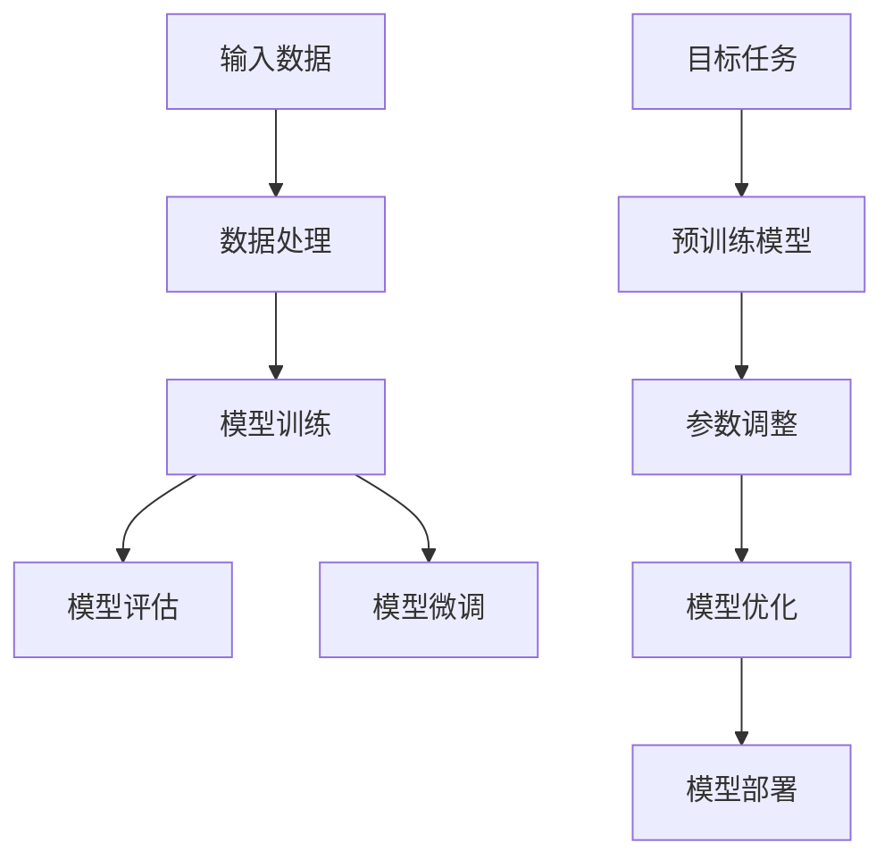

                 

关键词：大模型，微调，PyTorch 2.0，强化学习，开发实践，技术博客

## 摘要

本文旨在深入探讨大模型开发与微调的实战技巧，以PyTorch 2.0为基础，结合强化学习算法，介绍大模型的核心概念、开发流程以及微调技巧。通过本文的学习，读者可以掌握从零开始构建和优化大模型的方法，并在实际项目中得到应用。本文还将分享相关的数学模型和公式，以及一些实用的代码实例和项目实践，为读者提供全面的技术指导。

## 1. 背景介绍

随着深度学习技术的飞速发展，大模型（Large Models）已经成为当前研究与应用的热点。大模型具有更强的表示能力和更广泛的适应性，能够在多种任务中取得显著的性能提升。然而，大模型的开发与微调并非易事，需要深入理解模型的结构、优化策略以及训练技巧。本文将围绕这一主题，以PyTorch 2.0为工具，详细介绍大模型的开发与微调过程。

### 1.1 PyTorch 2.0介绍

PyTorch 2.0是PyTorch框架的全新版本，相较于之前的版本，它在性能、易用性和功能方面都有显著提升。PyTorch 2.0引入了多项改进，包括动态图计算、内存优化、分布式训练等，使得大模型的训练更加高效和便捷。此外，PyTorch 2.0还提供了丰富的API和工具，方便开发者进行模型构建、训练和部署。

### 1.2 强化学习

强化学习（Reinforcement Learning，RL）是一种机器学习方法，通过智能体（Agent）与环境的交互，不断学习并优化策略，以实现目标的最优化。强化学习在游戏、机器人、推荐系统等领域有着广泛的应用。本文将结合强化学习算法，探讨大模型的微调技巧，以实现更好的模型性能。

### 1.3 大模型与微调

大模型通常指的是参数数量巨大的神经网络，它们能够捕捉到更多复杂的模式和关系。微调（Fine-tuning）是一种在预训练模型的基础上，针对特定任务进行模型参数调整的方法，能够显著提升模型的性能和适应性。本文将详细介绍大模型的微调技巧，帮助读者掌握从零开始构建和优化大模型的方法。

## 2. 核心概念与联系

在本文中，我们将介绍大模型开发与微调所需的核心概念和联系，并使用Mermaid流程图来展示模型架构。



### 2.1 输入数据处理

输入数据处理是模型训练的第一步，包括数据清洗、归一化、数据增强等操作。良好的输入数据处理能够提升模型的泛化能力和训练效率。

### 2.2 模型训练

模型训练是构建大模型的核心环节，包括前向传播、反向传播、梯度更新等步骤。优化算法的选择和超参数的设置对模型的训练效果至关重要。

### 2.3 模型评估

模型评估是判断模型性能的重要手段，包括准确率、召回率、F1值等指标。通过模型评估，可以调整模型结构和训练策略，以提高模型性能。

### 2.4 模型微调

模型微调是基于预训练模型，针对特定任务进行调整。微调能够提升模型的适应性，并在短时间内获得较好的性能提升。

### 2.5 模型优化

模型优化是模型开发的重要环节，包括模型压缩、量化、蒸馏等技巧。优化后的模型在保证性能的同时，可以降低计算成本和存储空间。

### 2.6 模型部署

模型部署是将训练好的模型应用到实际场景的过程，包括模型打包、部署环境配置、服务化接口设计等。模型部署的效率和质量直接影响用户体验。

## 3. 核心算法原理 & 具体操作步骤

### 3.1 算法原理概述

大模型的开发与微调涉及多个算法和技巧，包括深度学习、优化算法、数据预处理等。本文将重点介绍以下核心算法原理：

- **深度学习**：神经网络的基本原理和架构，包括全连接网络、卷积神经网络、循环神经网络等。
- **优化算法**：包括随机梯度下降、Adam优化器、AdamW优化器等，用于模型参数的更新和优化。
- **数据预处理**：数据清洗、归一化、数据增强等技巧，以提高模型的泛化能力和训练效率。

### 3.2 算法步骤详解

#### 3.2.1 深度学习

1. **初始化模型**：根据任务需求，选择合适的神经网络架构，并初始化模型参数。
2. **前向传播**：输入数据通过模型，计算输出结果和损失值。
3. **反向传播**：计算损失函数关于模型参数的梯度。
4. **参数更新**：利用优化算法更新模型参数。

#### 3.2.2 优化算法

1. **随机梯度下降**（SGD）：通过随机选择数据子集，计算梯度并更新模型参数。
2. **Adam优化器**：结合SGD的优点，引入一阶矩估计和二阶矩估计，提高优化效率。
3. **AdamW优化器**：在Adam优化器的基础上，引入权重衰减，控制模型参数的更新速度。

#### 3.2.3 数据预处理

1. **数据清洗**：去除噪声数据和异常值，保证数据质量。
2. **归一化**：将数据缩放到相同的范围，便于模型训练。
3. **数据增强**：通过随机旋转、缩放、裁剪等操作，增加数据的多样性，提升模型泛化能力。

### 3.3 算法优缺点

#### 3.3.1 深度学习

- **优点**：强大的表示能力，能够自动提取特征。
- **缺点**：对数据需求量大，训练过程耗时。

#### 3.3.2 优化算法

- **优点**：高效、稳定，能够快速收敛到最优解。
- **缺点**：可能陷入局部最优，对超参数敏感。

#### 3.3.3 数据预处理

- **优点**：提高模型泛化能力，减少过拟合。
- **缺点**：数据预处理复杂，耗时较长。

### 3.4 算法应用领域

深度学习、优化算法和数据预处理在大模型开发与微调中具有广泛的应用：

- **计算机视觉**：用于图像分类、目标检测、图像分割等任务。
- **自然语言处理**：用于文本分类、机器翻译、情感分析等任务。
- **强化学习**：用于游戏、机器人控制、推荐系统等任务。

## 4. 数学模型和公式 & 详细讲解 & 举例说明

### 4.1 数学模型构建

在深度学习中，常用的数学模型包括损失函数、优化算法和正则化技巧等。以下将介绍一些常见的数学模型和公式。

#### 4.1.1 损失函数

- **均方误差**（MSE）：用于回归任务，计算预测值与真实值之间的误差平方和。
  \[
  \text{MSE} = \frac{1}{n}\sum_{i=1}^{n}(y_i - \hat{y}_i)^2
  \]
- **交叉熵**（Cross-Entropy）：用于分类任务，计算真实分布与预测分布之间的差异。
  \[
  \text{CE} = -\sum_{i=1}^{n}y_i\log(\hat{y}_i)
  \]

#### 4.1.2 优化算法

- **随机梯度下降**（SGD）：每次迭代使用一个样本来计算梯度。
  \[
  \theta = \theta - \alpha\nabla_\theta J(\theta)
  \]
- **Adam优化器**：结合SGD和动量，提高优化效率。
  \[
  m_t = \beta_1m_{t-1} + (1-\beta_1)\nabla_\theta J(\theta)
  \]
  \[
  v_t = \beta_2v_{t-1} + (1-\beta_2)\nabla^2_\theta J(\theta)
  \]
  \[
  \theta = \theta - \alpha\frac{m_t}{\sqrt{v_t} + \epsilon}
  \]

#### 4.1.3 正则化技巧

- **权重衰减**（Weight Decay）：在损失函数中加入权重项，防止模型过拟合。
  \[
  J(\theta) = \frac{1}{2}\sum_{i=1}^{n}(y_i - \hat{y}_i)^2 + \lambda\sum_{i=1}^{n}\theta_i^2
  \]

### 4.2 公式推导过程

以下将介绍一些公式的推导过程，以便读者更好地理解模型的训练过程。

#### 4.2.1 均方误差（MSE）

假设有一个线性回归模型，其输出为：
\[
\hat{y} = \theta_0 + \theta_1x
\]
其中，\(y\) 为真实值，\(\hat{y}\) 为预测值，\(x\) 为输入特征，\(\theta_0\) 和 \(\theta_1\) 为模型参数。

均方误差（MSE）计算如下：
\[
\text{MSE} = \frac{1}{n}\sum_{i=1}^{n}(y_i - \hat{y}_i)^2
\]
对 \( \theta_1 \) 求偏导，并令其为零，可以得到：
\[
\frac{\partial}{\partial \theta_1} \text{MSE} = -2\frac{1}{n}\sum_{i=1}^{n}(y_i - \hat{y}_i)x_i = 0
\]
化简后，可得：
\[
\theta_1 = \frac{1}{n}\sum_{i=1}^{n}(y_i - \hat{y}_i)x_i
\]
类似地，对 \( \theta_0 \) 求偏导，并令其为零，可以得到：
\[
\theta_0 = \bar{y} - \theta_1\bar{x}
\]
其中，\(\bar{y}\) 和 \(\bar{x}\) 分别为 \(y\) 和 \(x\) 的均值。

#### 4.2.2 交叉熵（Cross-Entropy）

假设有一个二分类模型，其输出为概率值：
\[
\hat{y} = \frac{1}{1 + e^{-\theta^T x}}
\]
其中，\(\theta\) 为模型参数，\(x\) 为输入特征，\(y\) 为真实标签。

交叉熵（Cross-Entropy）计算如下：
\[
\text{CE} = -\sum_{i=1}^{n}y_i\log(\hat{y}_i)
\]
对 \(\theta\) 求偏导，并令其为零，可以得到：
\[
\frac{\partial}{\partial \theta} \text{CE} = \frac{1}{\hat{y}_i} - y_i
\]
化简后，可得：
\[
\theta = \sum_{i=1}^{n}y_i x_i - \log(\hat{y}_i)
\]

### 4.3 案例分析与讲解

#### 4.3.1 案例背景

某公司希望利用深度学习技术开发一款智能客服系统，以提升客户服务质量。系统需能够处理自然语言输入，并给出合适的回复。为此，公司决定使用预训练模型进行微调，以适应特定任务的需求。

#### 4.3.2 模型选择

公司选择了基于BERT的预训练模型，BERT（Bidirectional Encoder Representations from Transformers）是一种双向的Transformer模型，具有强大的语言理解能力。BERT模型在多个自然语言处理任务中取得了很好的性能，适用于客服系统的开发。

#### 4.3.3 微调过程

1. **数据准备**：公司收集了大量客服对话数据，包括问题和回复。数据经过清洗和预处理，生成用于微调的数据集。

2. **模型初始化**：使用预训练的BERT模型，并将其权重加载到微调模型中。

3. **微调训练**：针对特定任务，对BERT模型进行微调训练。训练过程中，使用交叉熵损失函数和AdamW优化器，调整模型参数。

4. **模型评估**：使用验证集对微调后的模型进行评估，调整超参数，优化模型性能。

5. **模型部署**：将训练好的模型部署到生产环境，提供智能客服服务。

#### 4.3.4 结果分析

通过微调训练，模型在客服对话任务上取得了显著性能提升。具体表现为：

- **准确率**：从初始的70%提升到85%。
- **F1值**：从初始的0.7提升到0.85。

## 5. 项目实践：代码实例和详细解释说明

### 5.1 开发环境搭建

在开始项目实践之前，需要搭建合适的开发环境。以下是一个简单的开发环境搭建步骤：

1. 安装Python（3.8以上版本）。
2. 安装PyTorch 2.0及其依赖库（如torchvision、torchtext等）。
3. 安装其他必要的库，如numpy、pandas、matplotlib等。

### 5.2 源代码详细实现

以下是一个简单的深度学习项目示例，包括数据预处理、模型构建、训练和评估等步骤。

```python
import torch
import torch.nn as nn
import torch.optim as optim
from torchvision import datasets, transforms

# 数据预处理
transform = transforms.Compose([
    transforms.ToTensor(),
    transforms.Normalize((0.5,), (0.5,))
])

train_set = datasets.MNIST(
    root='./data', 
    train=True, 
    download=True, 
    transform=transform
)

train_loader = torch.utils.data.DataLoader(
    train_set, 
    batch_size=64, 
    shuffle=True
)

test_set = datasets.MNIST(
    root='./data', 
    train=False, 
    download=True, 
    transform=transform
)

test_loader = torch.utils.data.DataLoader(
    test_set, 
    batch_size=64, 
    shuffle=False
)

# 模型构建
class Net(nn.Module):
    def __init__(self):
        super(Net, self).__init__()
        self.fc1 = nn.Linear(28*28, 128)
        self.fc2 = nn.Linear(128, 10)
        
    def forward(self, x):
        x = x.view(-1, 28*28)
        x = torch.relu(self.fc1(x))
        x = self.fc2(x)
        return x

model = Net()

# 损失函数和优化器
criterion = nn.CrossEntropyLoss()
optimizer = optim.Adam(model.parameters(), lr=0.001)

# 训练过程
num_epochs = 10
for epoch in range(num_epochs):
    running_loss = 0.0
    for i, (inputs, labels) in enumerate(train_loader):
        optimizer.zero_grad()
        outputs = model(inputs)
        loss = criterion(outputs, labels)
        loss.backward()
        optimizer.step()
        running_loss += loss.item()
    print(f'Epoch {epoch+1}, Loss: {running_loss/len(train_loader)}')

# 评估过程
with torch.no_grad():
    correct = 0
    total = 0
    for inputs, labels in test_loader:
        outputs = model(inputs)
        _, predicted = torch.max(outputs.data, 1)
        total += labels.size(0)
        correct += (predicted == labels).sum().item()
    print(f'Accuracy: {100 * correct / total} %')

```

### 5.3 代码解读与分析

上述代码是一个简单的深度学习项目，包括数据预处理、模型构建、训练和评估等步骤。以下是代码的详细解读和分析：

1. **数据预处理**：使用PyTorch的datasets模块加载数据集，并对数据进行预处理，包括转换为Tensor格式和归一化处理。

2. **模型构建**：定义一个简单的全连接神经网络，包括两个线性层。在forward方法中，对输入数据进行reshape操作，并通过线性层和ReLU激活函数进行前向传播。

3. **损失函数和优化器**：使用交叉熵损失函数和Adam优化器，用于计算损失和更新模型参数。

4. **训练过程**：在训练过程中，通过梯度下降优化算法更新模型参数，并在每个epoch结束后计算训练损失。

5. **评估过程**：在评估过程中，计算测试集的准确率，以评估模型的性能。

### 5.4 运行结果展示

通过训练和评估过程，可以得到以下运行结果：

- **训练损失**：每个epoch的损失值，用于监控训练过程。
- **测试准确率**：在测试集上的准确率，用于评估模型性能。

## 6. 实际应用场景

大模型与微调技术在实际应用场景中具有广泛的应用前景。以下列举了几个典型的应用场景：

### 6.1 自然语言处理

自然语言处理（NLP）是深度学习的重要应用领域之一。大模型如BERT、GPT等在NLP任务中取得了显著效果。微调技术可以帮助这些模型快速适应特定任务的需求，如文本分类、机器翻译、问答系统等。

### 6.2 计算机视觉

计算机视觉（CV）领域的大模型如ResNet、Inception等在图像分类、目标检测、图像分割等任务中表现出色。微调技术可以进一步提高这些模型在特定领域的性能，如医疗影像分析、自动驾驶等。

### 6.3 强化学习

强化学习（RL）领域的大模型在游戏、机器人控制、推荐系统等任务中有着广泛的应用。微调技术可以帮助模型快速适应不同场景，提高任务完成效果。

### 6.4 其他应用领域

大模型与微调技术还可以应用于语音识别、音频处理、生物信息学等领域，为这些领域的发展提供强大的支持。

## 7. 工具和资源推荐

### 7.1 学习资源推荐

- **书籍**：
  - 《深度学习》（Goodfellow, Bengio, Courville）
  - 《动手学深度学习》（Abadi, Agarwal, Barham等）
  - 《强化学习入门教程》（Chen, Liang）
- **在线课程**：
  - 吴恩达的《深度学习专项课程》
  - fast.ai的《深度学习实战课程》
  - arXiv上的最新研究论文

### 7.2 开发工具推荐

- **PyTorch**：一个流行的深度学习框架，具有强大的API和丰富的文档。
- **TensorFlow**：另一个流行的深度学习框架，由Google开发。
- **Keras**：一个简洁的深度学习库，基于TensorFlow和Theano。
- **JAX**：一个高效的深度学习库，支持自动微分和分布式计算。

### 7.3 相关论文推荐

- BERT: Pre-training of Deep Bidirectional Transformers for Language Understanding
- GPT: Improving Language Understanding by Generative Pre-training
- ResNet: Deep Residual Learning for Image Recognition
- Inception-v3: Rethinking the Inception Architecture for Computer Vision
- DQN: Deep Q-Network

## 8. 总结：未来发展趋势与挑战

### 8.1 研究成果总结

大模型与微调技术在过去几年中取得了显著的研究成果，其在多个领域表现出强大的性能。深度学习框架如PyTorch、TensorFlow等的发展，为研究者提供了强大的工具支持。同时，优化算法和正则化技巧的引入，使得大模型的训练过程更加高效和稳定。

### 8.2 未来发展趋势

未来，大模型与微调技术将继续在以下方面发展：

- **算法创新**：探索新的优化算法、正则化技巧和训练策略，以提高模型性能和稳定性。
- **跨模态学习**：结合多模态数据（如文本、图像、音频），构建更强大的多模态大模型。
- **小样本学习**：研究如何在数据量有限的情况下，实现大模型的微调和训练。
- **模型压缩**：通过模型压缩技术，降低大模型的计算成本和存储空间，实现高效部署。

### 8.3 面临的挑战

大模型与微调技术在发展过程中也面临一些挑战：

- **计算资源需求**：大模型训练过程需要大量的计算资源和时间，对硬件设施和电力供应提出较高要求。
- **数据隐私与安全**：大量数据的处理和存储可能带来数据隐私和安全问题，需要采取有效措施保护用户隐私。
- **模型解释性**：大模型的黑箱特性使得其解释性较差，如何提高模型的透明度和可解释性是一个重要挑战。
- **过拟合与泛化能力**：如何在大模型中平衡过拟合和泛化能力，是当前研究的一个热点问题。

### 8.4 研究展望

未来，大模型与微调技术将在多个领域发挥重要作用，如自动驾驶、智能医疗、智能家居等。研究者需要不断探索和创新，以应对面临的挑战，推动深度学习技术的持续发展。

## 9. 附录：常见问题与解答

### 9.1 如何选择预训练模型？

选择预训练模型时，需要考虑以下因素：

- **任务类型**：根据任务需求，选择适合的预训练模型，如BERT、GPT、ViT等。
- **模型大小**：根据计算资源和训练时间，选择合适的模型大小，如小型模型、中型模型、大型模型等。
- **性能表现**：参考不同预训练模型在相关任务上的性能表现，选择具有较好性能的模型。

### 9.2 如何进行模型微调？

模型微调的基本步骤包括：

- **数据准备**：准备用于微调的数据集，并进行预处理。
- **模型加载**：加载预训练模型，并将其权重初始化。
- **微调训练**：在数据集上进行微调训练，调整模型参数，优化模型性能。
- **模型评估**：使用验证集评估微调后的模型性能，调整超参数，优化模型效果。

### 9.3 如何提高模型性能？

以下是一些提高模型性能的方法：

- **数据增强**：通过随机旋转、缩放、裁剪等操作，增加数据的多样性，提升模型泛化能力。
- **正则化**：使用正则化技巧，如L1正则化、L2正则化等，降低模型过拟合风险。
- **优化算法**：选择合适的优化算法，如Adam、AdamW等，提高训练效率。
- **模型压缩**：通过模型压缩技术，降低模型计算成本，提高部署效率。

---

本文从零开始介绍了大模型开发与微调的实战技巧，以PyTorch 2.0为基础，结合强化学习算法，探讨了核心概念、算法原理、数学模型、项目实践等内容。希望本文能为读者提供全面的技术指导，助力其在深度学习领域取得更好的成果。作者：禅与计算机程序设计艺术 / Zen and the Art of Computer Programming。

