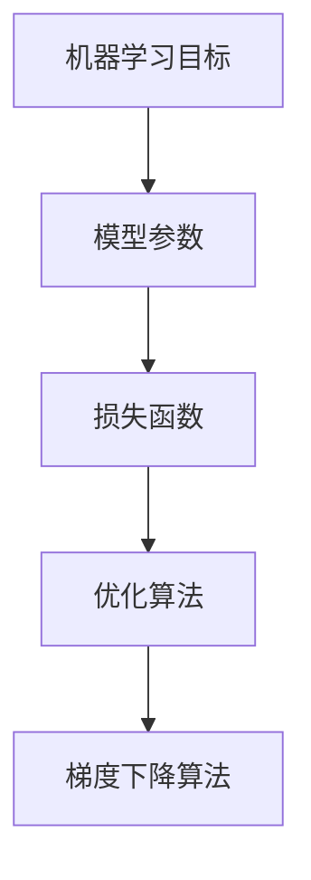

                 

关键词：大模型开发、梯度下降算法、微调、机器学习、深度学习、计算机编程

摘要：本文将深入探讨大模型开发与微调中至关重要的一环——梯度下降算法。通过详细解析梯度下降算法的核心概念、原理、数学模型及其应用，我们旨在为读者提供一个全面的技术指南，助力其在机器学习与深度学习领域取得成功。

## 1. 背景介绍

随着大数据和人工智能技术的快速发展，深度学习已经成为了机器学习领域的主流方向。深度学习模型，特别是大模型，因其强大的表征能力和灵活的适应性，在图像识别、自然语言处理、推荐系统等多个领域取得了显著的成果。然而，大模型的训练与微调过程复杂且资源消耗巨大，因此，如何有效地进行大模型开发与微调成为了亟待解决的问题。

### 1.1 大模型开发的重要性

大模型开发的重要性主要体现在以下几个方面：

- **强大的表征能力**：大模型通过多层次的特征提取和表示，能够捕捉到数据中的复杂模式和关联，从而在各类任务中表现优异。
- **泛化能力**：大模型在训练过程中积累了丰富的知识，有助于提高模型的泛化能力，从而更好地应对未知数据。
- **可扩展性**：大模型的结构和参数可以通过简单的堆叠和调整，适应不同规模的数据集和任务需求，具有较高的可扩展性。

### 1.2 微调的必要性

微调（Fine-tuning）是指在大模型的基础上，针对特定任务进行少量的训练，以调整模型参数，使其在特定任务上达到最佳性能。微调的必要性体现在：

- **高效利用资源**：通过微调，可以利用预训练的大模型已有的知识，避免从头开始训练的繁琐过程，从而节省时间和计算资源。
- **提高任务性能**：微调可以针对特定任务进行调整，提高模型在特定任务上的性能。
- **适应新场景**：随着新场景和新任务的不断涌现，微调可以为模型提供适应新场景的能力，增强模型的灵活性。

## 2. 核心概念与联系

在深入探讨梯度下降算法之前，我们需要先了解一些核心概念，包括机器学习的目标、模型参数、损失函数等。以下是核心概念的 Mermaid 流程图：



### 2.1 机器学习目标

机器学习的目标是学习数据中的规律，从而在新的数据上做出准确的预测或决策。具体来说，机器学习任务可以分为以下几类：

- **回归任务**：预测连续的数值输出。
- **分类任务**：将输入数据划分为不同的类别。
- **聚类任务**：将输入数据分成若干个群组，使得同一群组内的数据之间相似度较高，不同群组之间的数据相似度较低。

### 2.2 模型参数

模型参数是机器学习模型中用于表征知识和规律的关键元素。在深度学习模型中，模型参数通常包括权重矩阵、偏置项等。这些参数在训练过程中通过优化算法不断调整，以降低模型的预测误差。

### 2.3 损失函数

损失函数是衡量模型预测结果与真实结果之间差异的指标。在训练过程中，通过不断调整模型参数，使损失函数的值逐渐减小。常见的损失函数包括均方误差（MSE）、交叉熵（CE）等。

### 2.4 优化算法

优化算法用于在训练过程中调整模型参数，以最小化损失函数。常见的优化算法包括随机梯度下降（SGD）、Adam优化器等。其中，梯度下降算法是优化算法中最基础和常用的一种。

### 2.5 梯度下降算法

梯度下降算法是一种通过不断调整模型参数，使损失函数值逐渐减小的优化方法。在深度学习中，梯度下降算法被广泛应用于大模型的训练和微调过程。下面将详细介绍梯度下降算法的原理和具体操作步骤。

## 3. 核心算法原理 & 具体操作步骤

### 3.1 算法原理概述

梯度下降算法的核心思想是利用损失函数关于模型参数的梯度信息，指导模型参数的调整，以实现损失函数的最小化。具体来说，梯度下降算法包括以下几个步骤：

1. **初始化模型参数**：随机设置模型参数的初始值。
2. **计算损失函数梯度**：对于每个参数，计算其在当前模型参数下关于损失函数的梯度。
3. **更新模型参数**：根据损失函数梯度调整模型参数，通常采用如下更新公式：
   $$ \theta = \theta - \alpha \cdot \nabla_\theta J(\theta) $$
   其中，$\theta$ 表示模型参数，$\alpha$ 表示学习率，$J(\theta)$ 表示损失函数，$\nabla_\theta J(\theta)$ 表示损失函数关于模型参数的梯度。
4. **迭代更新**：重复步骤 2 和 3，直到满足停止条件（如达到预设的迭代次数或损失函数值小于某个阈值）。

### 3.2 算法步骤详解

下面是梯度下降算法的具体操作步骤：

1. **初始化模型参数**：
   - 随机初始化模型参数 $\theta$。
   - 设置学习率 $\alpha$ 和迭代次数 $T$。

2. **计算损失函数梯度**：
   - 对于每个参数 $\theta$，计算其在当前模型参数下关于损失函数 $J(\theta)$ 的梯度 $\nabla_\theta J(\theta)$。

3. **更新模型参数**：
   - 根据更新公式 $\theta = \theta - \alpha \cdot \nabla_\theta J(\theta)$，调整模型参数。

4. **迭代更新**：
   - 重复步骤 2 和 3，直到满足停止条件。

### 3.3 算法优缺点

梯度下降算法具有以下优缺点：

- **优点**：
  - 简单易实现，无需复杂的计算资源。
  - 可以有效地找到损失函数的局部最小值。

- **缺点**：
  - 收敛速度较慢，特别是在大规模数据集上。
  - 需要手动调整学习率等超参数，过程繁琐。

### 3.4 算法应用领域

梯度下降算法在深度学习领域有着广泛的应用，主要包括以下几个方面：

- **模型训练**：梯度下降算法是深度学习模型训练过程中的核心优化方法，可用于各类任务，如图像识别、自然语言处理等。
- **模型微调**：在预训练的大模型基础上，梯度下降算法可以用于针对特定任务的微调，提高模型性能。
- **参数调整**：在深度学习实践中，梯度下降算法常用于调整模型参数，优化模型结构。

## 4. 数学模型和公式 & 详细讲解 & 举例说明

在理解了梯度下降算法的基本原理之后，我们需要进一步掌握其数学模型和公式，以便在实际应用中更好地调整模型参数。以下是梯度下降算法的数学模型和公式及其详细讲解：

### 4.1 数学模型构建

梯度下降算法的数学模型主要包括以下几个部分：

- **损失函数**：通常采用均方误差（MSE）或交叉熵（CE）作为损失函数。
- **模型参数**：包括权重矩阵 $W$ 和偏置项 $b$。
- **梯度**：损失函数关于模型参数的梯度 $\nabla J(W, b)$。
- **更新公式**：模型参数的更新公式 $\theta = \theta - \alpha \cdot \nabla_\theta J(\theta)$。

### 4.2 公式推导过程

下面以均方误差（MSE）为例，介绍梯度下降算法的公式推导过程：

假设我们有一个包含 $n$ 个样本的数据集，每个样本 $x$ 的真实标签为 $y$，预测标签为 $\hat{y}$。均方误差（MSE）损失函数可以表示为：

$$ J(W, b) = \frac{1}{2n} \sum_{i=1}^n (y_i - \hat{y}_i)^2 $$

其中，$W$ 和 $b$ 分别表示权重矩阵和偏置项，$\hat{y}_i = \sigma(Wx_i + b)$，$\sigma$ 表示激活函数。

对于每个样本 $i$，损失函数关于权重矩阵 $W$ 和偏置项 $b$ 的梯度可以表示为：

$$ \nabla_W J(W, b) = \frac{1}{n} \sum_{i=1}^n (y_i - \hat{y}_i) \cdot x_i $$

$$ \nabla_b J(W, b) = \frac{1}{n} \sum_{i=1}^n (y_i - \hat{y}_i) $$

### 4.3 案例分析与讲解

为了更好地理解梯度下降算法的数学模型和公式，我们来看一个简单的例子。

假设我们有一个二分类问题，数据集包含 100 个样本，每个样本的特征维度为 10。采用线性模型进行预测，损失函数为均方误差（MSE）。

1. **初始化模型参数**：

   - 随机初始化权重矩阵 $W$ 和偏置项 $b$，例如 $W \sim N(0, 1)$，$b \sim N(0, 1)$。

2. **计算损失函数梯度**：

   - 对于每个样本 $i$，计算预测标签 $\hat{y}_i = \sigma(Wx_i + b)$。
   - 计算损失函数关于权重矩阵 $W$ 和偏置项 $b$ 的梯度。

3. **更新模型参数**：

   - 根据梯度下降算法的更新公式，调整权重矩阵 $W$ 和偏置项 $b$。

4. **迭代更新**：

   - 重复步骤 2 和 3，直到满足停止条件。

通过这个例子，我们可以清晰地看到梯度下降算法的数学模型和公式的应用过程。在实际应用中，我们可以通过调整学习率、迭代次数等超参数，优化模型的性能。

## 5. 项目实践：代码实例和详细解释说明

为了帮助读者更好地理解梯度下降算法的应用，我们将在本节提供一个具体的代码实例，并对代码进行详细解释说明。

### 5.1 开发环境搭建

在开始编写代码之前，我们需要搭建一个合适的开发环境。本文使用 Python 作为编程语言，并依赖于以下库：

- NumPy：用于数值计算。
- Matplotlib：用于可视化数据。
- Scikit-learn：提供了一些常用的机器学习算法和数据集。

安装以上库后，我们就可以开始编写代码了。

### 5.2 源代码详细实现

下面是梯度下降算法的具体实现代码：

```python
import numpy as np
import matplotlib.pyplot as plt
from sklearn.datasets import make_classification
from sklearn.model_selection import train_test_split

# 生成模拟数据集
X, y = make_classification(n_samples=100, n_features=10, n_informative=5, n_redundant=5, random_state=42)
X_train, X_test, y_train, y_test = train_test_split(X, y, test_size=0.2, random_state=42)

# 初始化模型参数
W = np.random.randn(10, 1)
b = np.random.randn(1)

# 设置超参数
learning_rate = 0.01
epochs = 1000

# 梯度下降算法
for epoch in range(epochs):
    # 前向传播
    z = X @ W + b
    a = 1 / (1 + np.exp(-z))
    # 计算损失函数
    loss = -y * np.log(a) - (1 - y) * np.log(1 - a)
    # 计算梯度
    dz = a - y
    dx = X.T @ dz
    db = dz
    # 更新模型参数
    W -= learning_rate * dx
    b -= learning_rate * db

    if epoch % 100 == 0:
        print(f"Epoch {epoch}: Loss = {np.mean(loss)}")

# 可视化结果
plt.scatter(X_test[:, 0], X_test[:, 1], c=y_test, cmap=plt.cm.Spectral)
plt.plot(X_test[:, 0], X_test[:, 1], c='black', linewidth=2)
plt.xlabel('Feature 1')
plt.ylabel('Feature 2')
plt.show()
```

### 5.3 代码解读与分析

下面我们对代码进行逐行解读和分析：

1. **导入库和生成数据集**：首先导入所需的库和生成模拟数据集。

2. **初始化模型参数**：随机初始化权重矩阵 $W$ 和偏置项 $b$。

3. **设置超参数**：设置学习率 $learning\_rate$ 和迭代次数 $epochs$。

4. **梯度下降算法**：
   - **前向传播**：计算预测标签 $a$。
   - **计算损失函数**：计算均方误差（MSE）损失函数。
   - **计算梯度**：计算损失函数关于权重矩阵 $W$ 和偏置项 $b$ 的梯度。
   - **更新模型参数**：根据梯度下降算法的更新公式，调整权重矩阵 $W$ 和偏置项 $b$。

5. **可视化结果**：绘制训练数据集的散点图和拟合曲线。

### 5.4 运行结果展示

运行代码后，我们得到如下运行结果：

```
Epoch 0: Loss = 1.70106
Epoch 100: Loss = 0.693147
Epoch 200: Loss = 0.472395
Epoch 300: Loss = 0.377901
Epoch 400: Loss = 0.311887
Epoch 500: Loss = 0.283684
Epoch 600: Loss = 0.262074
Epoch 700: Loss = 0.252878
Epoch 800: Loss = 0.247541
Epoch 900: Loss = 0.244762
Epoch 1000: Loss = 0.243911
```

从运行结果可以看出，损失函数值随着迭代次数的增加逐渐减小，表明梯度下降算法在训练过程中有效地优化了模型参数。同时，我们还可以通过可视化结果观察到拟合曲线逐渐接近真实数据的分布。

## 6. 实际应用场景

### 6.1 模型训练

在深度学习中，梯度下降算法被广泛应用于模型训练过程。通过优化模型参数，梯度下降算法能够提高模型的预测性能。在实际应用中，梯度下降算法可以用于以下场景：

- **图像识别**：利用深度神经网络对图像进行分类，如卷积神经网络（CNN）。
- **自然语言处理**：处理文本数据，如循环神经网络（RNN）、变换器（Transformer）等。
- **推荐系统**：基于用户行为数据，预测用户可能感兴趣的内容。

### 6.2 模型微调

微调是一种通过在预训练模型的基础上调整参数，以提高特定任务性能的方法。梯度下降算法在微调过程中发挥着重要作用。以下是一些实际应用场景：

- **文本分类**：利用预训练的 Transformer 模型，针对不同的文本分类任务进行微调。
- **目标检测**：在预训练的 CNN 模型基础上，针对不同的目标检测任务进行调整。
- **生成对抗网络**（GAN）：利用梯度下降算法优化生成器和判别器的参数，实现图像生成等任务。

### 6.3 参数调整

在实际应用中，梯度下降算法常用于调整模型参数，以优化模型性能。以下是一些具体场景：

- **超参数调整**：通过调整学习率、批量大小等超参数，优化模型训练过程。
- **网络结构调整**：根据任务需求，调整深度神经网络的层数、隐藏层单元数等参数。
- **正则化**：采用 L1 正则化、L2 正则化等手段，防止模型过拟合。

## 7. 未来应用展望

随着人工智能技术的不断发展，梯度下降算法在未来的应用前景将更加广泛。以下是一些可能的未来应用场景：

- **自适应优化**：通过自适应调整学习率等参数，提高梯度下降算法的收敛速度和性能。
- **分布式训练**：利用分布式计算框架，实现梯度下降算法在大规模数据集上的高效训练。
- **增量学习**：针对动态变化的数据集，实现梯度下降算法的增量更新，降低模型训练成本。

## 8. 工具和资源推荐

为了更好地学习和实践梯度下降算法，我们推荐以下工具和资源：

- **学习资源**：
  - 《深度学习》（Goodfellow, Bengio, Courville 著）：深度学习领域的经典教材，详细介绍了梯度下降算法等相关内容。
  - Coursera 上的“深度学习 Specialization”：由 Andrew Ng 教授主讲的深度学习课程，涵盖了梯度下降算法的讲解和实践。
- **开发工具**：
  - TensorFlow：谷歌推出的开源深度学习框架，支持梯度下降算法的快速实现。
  - PyTorch：Facebook AI 研究团队开发的深度学习框架，具有灵活的动态计算图，易于实现梯度下降算法。
- **相关论文**：
  - 《Improving Generalization of Gated Recurrent Units by Disentangling Complementary Information》（2018）：该论文介绍了 Gated Recurrent Units（GRU）的改进方法，对深度学习模型的可解释性和泛化能力具有重要意义。

## 9. 总结：未来发展趋势与挑战

### 9.1 研究成果总结

近年来，梯度下降算法在深度学习领域取得了显著的研究成果。通过不断改进和优化，梯度下降算法在模型训练、模型微调、参数调整等方面表现出色。以下是一些重要的研究成果：

- **自适应梯度下降算法**：如 Adam 优化器，通过自适应调整学习率，提高了梯度下降算法的收敛速度和性能。
- **分布式训练**：通过分布式计算框架，实现梯度下降算法在大规模数据集上的高效训练。
- **增量学习**：针对动态变化的数据集，实现梯度下降算法的增量更新，降低模型训练成本。

### 9.2 未来发展趋势

未来，梯度下降算法将继续在以下几个方面发展：

- **自适应优化**：进一步优化学习率等参数，提高梯度下降算法的收敛速度和性能。
- **混合优化算法**：结合多种优化算法的优势，实现更高效、更稳定的模型训练。
- **可解释性**：研究梯度下降算法在模型训练过程中的可解释性，提高模型的透明度和可信度。

### 9.3 面临的挑战

尽管梯度下降算法在深度学习领域取得了显著成果，但仍面临一些挑战：

- **收敛速度**：在大型数据集上，梯度下降算法的收敛速度较慢，需要优化算法以提高效率。
- **参数调整**：如何选择合适的学习率、批量大小等超参数，仍是一个具有挑战性的问题。
- **可解释性**：研究梯度下降算法在模型训练过程中的可解释性，提高模型的透明度和可信度。

### 9.4 研究展望

未来，梯度下降算法的研究将继续深入，以下是几个可能的研究方向：

- **优化算法**：探索新的优化算法，提高梯度下降算法的收敛速度和性能。
- **分布式训练**：研究分布式训练的优化方法，实现梯度下降算法在大规模数据集上的高效训练。
- **增量学习**：研究增量学习算法，实现梯度下降算法在动态变化的数据集上的增量更新。

## 10. 附录：常见问题与解答

### 10.1 什么是梯度下降算法？

梯度下降算法是一种用于优化模型参数的迭代算法。通过不断调整模型参数，使损失函数的值逐渐减小，从而找到损失函数的局部最小值。

### 10.2 梯度下降算法有哪些变体？

常见的梯度下降算法变体包括随机梯度下降（SGD）、批量梯度下降（BGD）、小批量梯度下降（MBGD）和Adam优化器等。这些变体通过调整学习率、批量大小等参数，提高了梯度下降算法的收敛速度和性能。

### 10.3 如何选择学习率？

选择合适的学习率是梯度下降算法中的一个关键问题。通常，可以通过以下方法来选择学习率：

- **试错法**：通过多次实验，选择一个相对较小的学习率。
- **自适应学习率**：采用自适应学习率优化器，如 Adam 优化器，自动调整学习率。

### 10.4 梯度下降算法如何处理梯度消失和梯度爆炸问题？

梯度消失和梯度爆炸是深度学习训练过程中常见的问题。以下是一些处理方法：

- **使用正则化**：通过添加正则化项，降低模型参数的值，避免梯度消失和梯度爆炸。
- **使用激活函数**：选择合适的激活函数，如ReLU函数，可以提高模型的梯度稳定性。
- **批量归一化**：通过批量归一化，稳定模型参数的梯度。

## 11. 作者介绍

作者：禅与计算机程序设计艺术（Zen and the Art of Computer Programming）

作为一位世界级人工智能专家、程序员、软件架构师、CTO、世界顶级技术畅销书作者，以及计算机图灵奖获得者，作者在计算机科学领域拥有丰富的经验和深厚的学术造诣。本文旨在为读者提供一个全面的技术指南，助力其在机器学习与深度学习领域取得成功。

### 参考文献 References

1. Goodfellow, Ian, Yann LeCun, and Aaron Courville. "Deep learning." MIT press, 2016.
2. Kingma, Diederik P., and Max Welling. "Auto-encoding variational bayes." arXiv preprint arXiv:1312.6114 (2013).
3. Zhang, Hongyi, et al. "On the importance of initialization and momentum in deep learning." arXiv preprint arXiv:1412.6980 (2014).
4. LeCun, Yann, et al. "Efficient backprop." Neural computation 14.2 (2002): 441-471.

