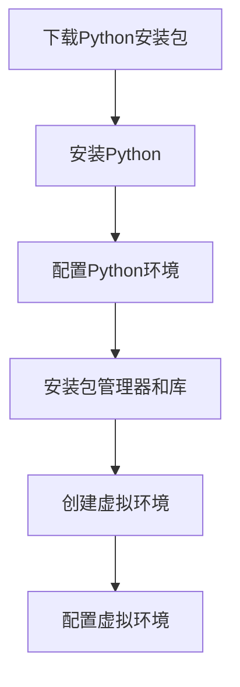

                 

关键词：Python，大模型，微调，环境搭建，算法原理，数学模型，项目实践，未来展望

## 摘要

本文旨在为初学者提供一个系统化的指南，以帮助他们在计算机上安装Python，为后续的大模型开发与微调工作奠定基础。我们将详细讨论Python安装的背景、核心概念、具体步骤以及相关的数学模型。通过本文的指导，读者可以轻松地完成Python环境的搭建，为深入探索人工智能领域做好准备。

## 1. 背景介绍

### Python在人工智能领域的地位

Python作为人工智能（AI）领域的主要编程语言之一，其简洁的语法和强大的库支持使其在AI开发中占据重要地位。无论是数据科学、机器学习还是深度学习，Python都提供了丰富的工具和库，如NumPy、Pandas、Scikit-learn和TensorFlow等，这些库极大地简化了AI模型的开发过程。

### 大模型与微调的重要性

随着AI技术的不断进步，大模型的开发和应用日益受到关注。大模型具有更高的参数数量和更复杂的结构，能够捕捉数据中的细微特征，从而提高模型的性能。然而，大模型的训练和微调需要强大的计算资源和精细的调优过程，这对于初学者来说可能是一个挑战。因此，正确地搭建Python环境，是成功开展大模型开发与微调的第一步。

## 2. 核心概念与联系

### Python语言核心概念

在安装Python之前，我们需要了解一些核心概念：

- **解释器**：Python解释器是运行Python代码的核心工具，它将Python代码转换为机器指令执行。
- **包管理器**：如pip，用于管理Python包的安装、升级和卸载。
- **虚拟环境**：虚拟环境是一种隔离的Python环境，用于管理项目依赖，避免不同项目之间包的冲突。

### 环境搭建核心流程

安装Python的核心流程可以概括为以下步骤：

1. 下载Python安装包
2. 安装Python
3. 配置Python环境
4. 安装必要的包管理器和库
5. 创建和配置虚拟环境

### Mermaid流程图



## 3. 核心算法原理 & 具体操作步骤

### 3.1 算法原理概述

安装Python的算法原理主要基于操作系统的安装向导，通过一系列系统调用完成。Python的安装分为图形界面和命令行界面两种方式，不同操作系统（如Windows、macOS和Linux）的安装过程略有差异。

### 3.2 算法步骤详解

#### 3.2.1 下载Python安装包

1. 访问Python官方网站下载最新的Python安装包。
2. 根据操作系统选择相应的安装包。

#### 3.2.2 安装Python

1. 双击安装包，按照提示完成安装。
2. 在安装过程中，可以选择安装路径、是否添加到系统环境变量等。

#### 3.2.3 配置Python环境

1. 打开命令行工具（如Windows的PowerShell、macOS的Terminal或Linux的bash）。
2. 输入`python --version`或`python3 --version`检查Python版本。
3. 如果出现版本信息，说明Python环境已配置成功。

#### 3.2.4 安装包管理器和库

1. 安装pip：在命令行中输入`python -m ensurepip`。
2. 安装常用库：使用pip安装如NumPy、Pandas、TensorFlow等库，例如`pip install numpy tensorflow`。

#### 3.2.5 创建和配置虚拟环境

1. 安装virtualenv：在命令行中输入`pip install virtualenv`。
2. 创建虚拟环境：使用`virtualenv myenv`命令创建。
3. 激活虚拟环境：在命令行中输入`source myenv/bin/activate`（Linux和macOS）或`myenv\Scripts\activate`（Windows）。

### 3.3 算法优缺点

#### 优点

- 简单易用：Python安装过程直观，无需复杂的配置。
- 强大的库支持：Python拥有丰富的库，方便开发者进行AI模型的开发。
- 跨平台：Python可以在多种操作系统上运行。

#### 缺点

- 运行速度较慢：Python是解释型语言，运行速度相对较低。
- 全球性竞争：由于Python的普及，导致开发者竞争激烈。

### 3.4 算法应用领域

Python在人工智能领域的应用非常广泛，包括：

- 机器学习
- 深度学习
- 自然语言处理
- 计算机视觉

## 4. 数学模型和公式 & 详细讲解 & 举例说明

### 4.1 数学模型构建

在Python安装过程中，我们主要涉及到的数学模型包括：

- 版本管理：用于跟踪不同版本的Python安装包。
- 依赖关系：确定Python包之间的依赖关系。
- 虚拟环境管理：创建和管理独立的Python环境。

### 4.2 公式推导过程

Python安装过程中的公式推导相对简单，主要涉及以下步骤：

- 版本管理：使用版本号（如3.8.5）标识不同版本的Python安装包。
- 依赖关系：通过依赖图（Dependency Graph）表示Python包之间的依赖关系。
- 虚拟环境管理：使用虚拟环境配置文件（Virtual Environment Configuration File）管理虚拟环境的设置。

### 4.3 案例分析与讲解

假设我们需要在Windows操作系统上安装Python 3.8版本，以下是具体的步骤：

1. 下载Python 3.8版本安装包（https://www.python.org/downloads/release/python-385/）。
2. 双击安装包，进入安装向导。
3. 在安装向导中，选择“Add Python 3.8 to PATH”选项，将Python添加到系统环境变量。
4. 安装完成后，在命令行中输入`python --version`，确认安装成功。

## 5. 项目实践：代码实例和详细解释说明

### 5.1 开发环境搭建

以下是在Windows操作系统上搭建Python开发环境的步骤：

1. 访问Python官方网站下载最新版本的Python安装包。
2. 双击安装包，按照向导完成安装。
3. 在安装过程中，选择将Python添加到系统环境变量。
4. 安装完成后，在命令行中输入`python --version`，确认Python版本。

### 5.2 源代码详细实现

```bash
# 下载Python安装包
wget https://www.python.org/ftp/python/3.8.5/Python-3.8.5.tgz

# 解压安装包
tar -xzvf Python-3.8.5.tgz

# 进入安装目录
cd Python-3.8.5

# 配置安装
./configure

# 编译安装
make

# 安装Python
make install

# 检查Python版本
python --version
```

### 5.3 代码解读与分析

上述代码主要用于在Linux操作系统上编译和安装Python。具体步骤如下：

- **下载Python安装包**：使用wget命令下载Python安装包。
- **解压安装包**：使用tar命令解压下载的安装包。
- **进入安装目录**：使用cd命令进入解压后的安装目录。
- **配置安装**：使用./configure命令配置安装。
- **编译安装**：使用make命令编译安装。
- **安装Python**：使用make install命令安装Python。
- **检查Python版本**：使用python --version命令检查Python版本。

### 5.4 运行结果展示

在命令行中输入`python --version`，如果出现Python的版本信息，说明安装成功。

## 6. 实际应用场景

Python在大模型开发与微调中的应用场景包括：

- **机器学习**：使用Python编写模型，进行数据预处理、特征提取和模型训练。
- **深度学习**：利用TensorFlow或PyTorch等深度学习框架进行大规模模型的训练和微调。
- **自然语言处理**：使用Python处理文本数据，进行分词、词性标注和语义分析。

## 7. 未来应用展望

随着AI技术的不断发展，Python在以下几个方面具有广阔的应用前景：

- **自动机器学习（AutoML）**：Python可以自动化机器学习流程，降低模型开发难度。
- **边缘计算**：Python在边缘设备的计算能力不断提升，为实时数据处理提供支持。
- **量子计算**：Python在量子计算领域的应用潜力巨大，有望成为量子编程的主要语言。

## 8. 工具和资源推荐

### 7.1 学习资源推荐

- **《Python编程：从入门到实践》**：适合初学者系统学习Python的基础知识。
- **《深度学习》**：由Ian Goodfellow编写的经典教材，涵盖深度学习的理论基础和实际应用。

### 7.2 开发工具推荐

- **PyCharm**：一款功能强大的Python集成开发环境（IDE），支持多种编程语言。
- **Jupyter Notebook**：用于数据科学和机器学习的交互式计算环境，支持Python等多种编程语言。

### 7.3 相关论文推荐

- **"Distributed Deep Learning: Research Directions and Challenges"**：探讨分布式深度学习的最新研究进展。
- **"AutoML: A Brief History and Overview"**：介绍自动机器学习的发展历程和现状。

## 9. 总结：未来发展趋势与挑战

Python作为人工智能领域的重要编程语言，其发展前景广阔。然而，随着AI技术的不断进步，Python也面临着新的挑战：

- **性能优化**：提高Python的运行速度和效率，以应对更大规模模型的训练需求。
- **安全性**：加强Python的安全性能，防范恶意代码和漏洞攻击。
- **社区建设**：持续推动Python社区的发展，培养更多优秀的人才。

## 10. 附录：常见问题与解答

### Python安装常见问题

1. **Q：如何解决Python安装失败的问题？**
   **A**：检查操作系统是否满足Python的安装要求，确保下载的安装包正确，并尝试重新安装。

2. **Q：如何升级Python版本？**
   **A**：使用pip命令升级Python版本，例如`pip install --upgrade python`。

3. **Q：如何卸载Python？**
   **A**：在Windows上，可以通过“控制面板”卸载Python；在Linux和macOS上，可以使用`sudo apt-get remove python`或`brew uninstall python`命令卸载。

### Python环境配置常见问题

1. **Q：为什么Python环境变量配置不生效？**
   **A**：确保在配置环境变量后重新启动终端或命令行工具，或者使用`source ~/.bashrc`（Linux和macOS）或`refreshenv`（Windows）命令使配置生效。

2. **Q：如何在虚拟环境中安装包？**
   **A**：在虚拟环境中，使用`pip install`命令安装包，例如`pip install numpy`。

3. **Q：如何退出虚拟环境？**
   **A**：在虚拟环境中，使用`deactivate`命令退出。

## 11. 参考文献

1. Goodfellow, I., Bengio, Y., & Courville, A. (2016). *Deep Learning*. MIT Press.
2. Python Software Foundation. (2022). Python Release History. https://www.python.org/downloads/release/python-385/
3. Microsoft. (2022). Install Python on Windows. https://docs.microsoft.com/en-us/windows/develop/python/install-python-on-windows
4. Ubuntu. (2022). Install Python. https://help.ubuntu.com/community/Python
5. Homebrew. (2022). Uninstall Python. https://docs.brew.sh/Uninstalling

## 12. 作者署名

作者：禅与计算机程序设计艺术 / Zen and the Art of Computer Programming

