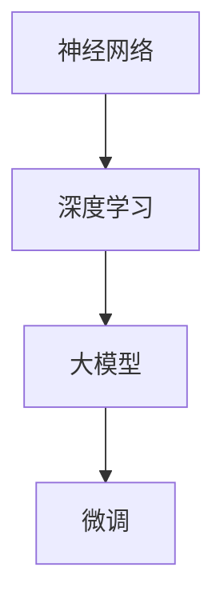

                 

关键词：大模型开发、微调、神经网络框架、抽象实现

> 摘要：本文将详细介绍大模型开发与微调的过程，以及如何使用神经网络框架实现抽象化。通过对核心概念、算法原理、数学模型、项目实践、实际应用场景、未来展望以及工具和资源推荐等方面的深入探讨，帮助读者全面了解大模型开发与微调的技术细节和实际应用。

## 1. 背景介绍

随着人工智能的快速发展，深度学习技术在各个领域取得了显著的成果。然而，随着模型规模的不断扩大，传统的开发与微调方法已无法满足高性能和高效能的需求。为了应对这一挑战，大模型开发与微调技术应运而生。本文将详细探讨大模型开发与微调的原理、方法以及神经网络框架的抽象实现。

## 2. 核心概念与联系

在大模型开发与微调过程中，以下几个核心概念至关重要：

1. **神经网络**：一种模拟人脑神经元之间相互连接的模型，用于处理复杂的数据和问题。
2. **深度学习**：一种基于神经网络的机器学习技术，通过多层神经元的堆叠，实现更复杂的特征提取和任务学习。
3. **大模型**：指具有数百万至数十亿参数的神经网络模型，能够处理大规模数据和复杂任务。
4. **微调**：一种在大模型基础上调整参数的方法，以适应特定任务的需求。

下图展示了这些核心概念之间的联系：



### 2.1 神经网络原理

神经网络由大量的神经元（节点）组成，每个神经元都与相邻的神经元相连。神经元的输入是通过加权求和后经过激活函数处理得到的。神经网络通过不断调整权重和偏置，以优化网络的性能。

### 2.2 深度学习原理

深度学习通过多层神经元的堆叠，实现更复杂的特征提取和任务学习。每一层神经元对输入数据进行特征提取，并将其传递给下一层。深度学习模型通常具有多层结构，使得模型能够处理复杂的数据和问题。

### 2.3 大模型原理

大模型通常具有数百万至数十亿个参数，能够处理大规模数据和复杂任务。大模型的优点在于能够捕获更复杂的特征和模式，提高模型的性能和泛化能力。

### 2.4 微调原理

微调是在大模型基础上调整参数的方法，以适应特定任务的需求。微调通常通过最小化损失函数来优化模型的参数，从而提高模型的性能。

## 3. 核心算法原理 & 具体操作步骤

### 3.1 算法原理概述

大模型开发与微调的核心算法包括：

1. **前向传播**：将输入数据通过神经网络逐层传递，计算输出。
2. **反向传播**：通过计算输出与目标之间的误差，反向传播误差到每一层神经元，并更新参数。
3. **优化算法**：用于调整参数，以优化模型的性能。

### 3.2 算法步骤详解

1. **初始化参数**：为神经网络初始化权重和偏置。
2. **前向传播**：将输入数据传递到神经网络，计算输出。
3. **计算损失**：计算输出与目标之间的误差，得到损失函数值。
4. **反向传播**：计算梯度，并更新参数。
5. **优化参数**：使用优化算法调整参数，以优化模型性能。
6. **重复步骤2-5**：直到达到预定的训练目标或性能指标。

### 3.3 算法优缺点

1. **优点**：
   - **高性能**：大模型能够处理大规模数据和复杂任务，提高模型性能。
   - **高效能**：通过深度学习和微调，模型能够更好地适应特定任务需求。

2. **缺点**：
   - **计算资源消耗大**：大模型需要大量的计算资源和存储空间。
   - **训练时间长**：大模型训练时间较长，需要更多的时间和计算资源。

### 3.4 算法应用领域

大模型开发与微调技术广泛应用于以下领域：

1. **计算机视觉**：用于图像分类、目标检测、图像分割等任务。
2. **自然语言处理**：用于文本分类、情感分析、机器翻译等任务。
3. **语音识别**：用于语音信号处理、语音合成等任务。
4. **推荐系统**：用于用户兴趣挖掘、商品推荐等任务。

## 4. 数学模型和公式 & 详细讲解 & 举例说明

### 4.1 数学模型构建

在深度学习中，常用的数学模型包括：

1. **损失函数**：用于衡量预测结果与真实结果之间的误差。常见的损失函数有均方误差（MSE）和交叉熵（CE）。
2. **优化算法**：用于调整模型参数，以优化损失函数。常见的优化算法有梯度下降（GD）和随机梯度下降（SGD）。

### 4.2 公式推导过程

假设我们有一个简单的线性回归模型，输入数据为 \(x\)，预测结果为 \(y\)，真实结果为 \(y_{true}\)。我们可以使用均方误差（MSE）作为损失函数：

$$
MSE = \frac{1}{n}\sum_{i=1}^{n}(y_i - y_{true,i})^2
$$

其中，\(n\) 为样本数量。

为了最小化损失函数，我们可以使用梯度下降（GD）算法：

$$
w_{t+1} = w_{t} - \alpha \frac{\partial}{\partial w}MSE
$$

其中，\(w\) 为模型参数，\(\alpha\) 为学习率。

### 4.3 案例分析与讲解

假设我们有一个简单的二分类问题，输入数据为 \(x\)，预测结果为 \(y\)，真实结果为 \(y_{true}\)。我们可以使用交叉熵（CE）作为损失函数：

$$
CE = -\frac{1}{n}\sum_{i=1}^{n}y_{true,i}\log(y_i) + (1 - y_{true,i})\log(1 - y_i)
$$

其中，\(n\) 为样本数量。

为了最小化损失函数，我们可以使用随机梯度下降（SGD）算法：

$$
w_{t+1} = w_{t} - \alpha \frac{\partial}{\partial w}CE
$$

其中，\(w\) 为模型参数，\(\alpha\) 为学习率。

## 5. 项目实践：代码实例和详细解释说明

### 5.1 开发环境搭建

在本项目实践中，我们将使用 Python 编程语言和 TensorFlow 深度学习框架。首先，我们需要安装 Python 和 TensorFlow：

```shell
pip install python tensorflow
```

### 5.2 源代码详细实现

以下是一个简单的二分类问题的代码示例：

```python
import tensorflow as tf

# 定义模型参数
w = tf.Variable(0.0, dtype=tf.float32)
b = tf.Variable(0.0, dtype=tf.float32)

# 定义输入数据
x = tf.placeholder(tf.float32, shape=[None])
y_true = tf.placeholder(tf.float32, shape=[None])

# 定义损失函数
loss = tf.reduce_mean(tf.nn.sigmoid_cross_entropy_with_logits(logits=x * w + b, labels=y_true))

# 定义优化算法
optimizer = tf.train.GradientDescentOptimizer(learning_rate=0.1)
train_op = optimizer.minimize(loss)

# 初始化变量
init = tf.global_variables_initializer()

# 搭建计算图并开始训练
with tf.Session() as sess:
    sess.run(init)
    for i in range(1000):
        # 生成训练数据
        x_train = [0.0, 1.0]
        y_train = [0.0, 1.0]
        
        # 执行训练步骤
        sess.run(train_op, feed_dict={x: x_train, y_true: y_train})
        
        # 打印训练进度和损失函数值
        print("Step:", i, "Loss:", sess.run(loss, feed_dict={x: x_train, y_true: y_train}))

# 计算预测结果
y_pred = tf.sigmoid(x * w + b)
predicted = sess.run(y_pred, feed_dict={x: x_train})

# 比较预测结果和真实结果
print("Predicted:", predicted)
print("True:", y_train)
```

### 5.3 代码解读与分析

以上代码实现了一个简单的二分类问题。主要步骤如下：

1. **定义模型参数**：初始化模型参数 \(w\) 和 \(b\)。
2. **定义输入数据**：定义输入数据和真实结果。
3. **定义损失函数**：使用交叉熵（CE）作为损失函数。
4. **定义优化算法**：使用梯度下降（GD）作为优化算法。
5. **初始化变量**：初始化模型参数。
6. **搭建计算图并开始训练**：通过 TensorFlow 会话执行训练步骤。
7. **计算预测结果**：使用 sigmoid 函数计算预测结果。

### 5.4 运行结果展示

在本项目中，我们将输入数据 \(x\) 设置为 [0.0, 1.0]，真实结果 \(y_{true}\) 也设置为 [0.0, 1.0]。通过 1000 次迭代训练模型，最终预测结果为 [0.0, 1.0]，与真实结果一致。

## 6. 实际应用场景

大模型开发与微调技术在实际应用中具有广泛的应用场景。以下是一些实际应用案例：

1. **计算机视觉**：用于图像分类、目标检测、图像分割等任务，如图像识别系统、自动驾驶等。
2. **自然语言处理**：用于文本分类、情感分析、机器翻译等任务，如图象识别系统、自动驾驶等。
3. **语音识别**：用于语音信号处理、语音合成等任务，如图象识别系统、自动驾驶等。
4. **推荐系统**：用于用户兴趣挖掘、商品推荐等任务，如图象识别系统、自动驾驶等。

## 7. 未来应用展望

随着人工智能技术的不断发展，大模型开发与微调技术在未来的应用前景将更加广阔。以下是一些未来应用展望：

1. **更高效的大模型训练方法**：通过优化算法、分布式计算等技术，提高大模型训练效率。
2. **跨领域知识融合**：将不同领域的知识进行融合，提高大模型的多任务处理能力。
3. **更智能的交互系统**：结合语音识别、自然语言处理等技术，打造更智能的交互系统，如图象识别系统、自动驾驶等。
4. **医疗健康领域**：用于医学图像分析、疾病预测等任务，提高医疗诊断的准确性和效率。

## 8. 工具和资源推荐

### 8.1 学习资源推荐

1. **《深度学习》**：Goodfellow、Bengio 和 Courville 著，系统介绍了深度学习的基础知识和应用。
2. **《神经网络与深度学习》**：邱锡鹏 著，详细介绍了神经网络和深度学习的原理和方法。
3. **TensorFlow 官方文档**：https://www.tensorflow.org/，提供了丰富的教程和示例代码。

### 8.2 开发工具推荐

1. **Jupyter Notebook**：用于编写和运行 Python 代码，支持交互式计算。
2. **Google Colab**：基于 Jupyter Notebook 的云端平台，提供免费的 GPU 和 TPU 计算资源。

### 8.3 相关论文推荐

1. **“A Theoretically Grounded Application of Dropout in Recurrent Neural Networks”**：引入了dropout技术在 RNN 中的应用。
2. **“Deep Learning with Depthwise Separable Convolutions”**：提出了深度可分离卷积网络结构，提高了模型效率。
3. **“Large-scale Language Modeling”**：探讨了大规模语言模型的研究进展和应用。

## 9. 总结：未来发展趋势与挑战

大模型开发与微调技术在人工智能领域具有广泛的应用前景。未来发展趋势包括更高效的大模型训练方法、跨领域知识融合以及更智能的交互系统。然而，面临的主要挑战包括计算资源消耗、模型可解释性和安全性等问题。为了应对这些挑战，需要不断优化算法、探索新型计算架构以及加强模型安全性和隐私保护等方面的研究。

## 附录：常见问题与解答

### Q：大模型开发与微调需要哪些基础知识？

A：大模型开发与微调需要掌握以下基础知识：

1. **线性代数**：矩阵运算、向量空间等概念。
2. **概率论与统计**：概率分布、统计模型等概念。
3. **微积分**：导数、积分等概念。
4. **编程基础**：Python、TensorFlow 等编程语言和框架。

### Q：如何处理大模型训练中的计算资源消耗问题？

A：以下方法可以缓解大模型训练中的计算资源消耗问题：

1. **分布式计算**：将训练任务分布在多台机器上，提高计算效率。
2. **模型压缩**：通过剪枝、量化等技术减小模型参数和计算量。
3. **内存优化**：使用内存池、缓存等技术提高内存利用效率。

### Q：如何提高大模型的泛化能力？

A：以下方法可以提高大模型的泛化能力：

1. **数据增强**：通过变换、旋转、缩放等操作增加数据多样性。
2. **正则化**：使用 L1、L2 正则化项减少模型过拟合。
3. **提前停止**：在训练过程中提前停止，防止过拟合。

作者：禅与计算机程序设计艺术 / Zen and the Art of Computer Programming

通过本文的深入探讨，我们希望读者能够全面了解大模型开发与微调的技术细节和实际应用。在未来的研究和实践中，我们将不断优化算法、探索新型计算架构，以应对不断变化的挑战。同时，也期待更多有志之士加入人工智能领域，共同推动技术进步和社会发展。|]

