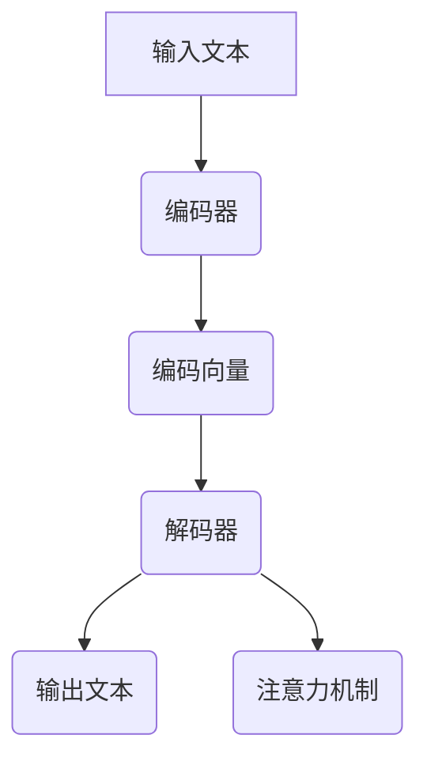

                 

关键词：大模型开发、微调、翻译模型、深度学习、神经网络、计算资源、数据处理

> 摘要：本文将深入探讨大模型开发与微调的过程，以翻译模型为例，详细介绍其开发背景、核心概念、算法原理、数学模型、项目实践及未来应用展望。通过本文的阅读，读者将全面了解如何从零开始构建和优化翻译模型，掌握大模型开发的关键技术和实践方法。

## 1. 背景介绍

随着深度学习技术的快速发展，神经网络在各个领域取得了显著的成果，尤其是在自然语言处理（NLP）领域。翻译模型作为NLP的重要组成部分，近年来得到了广泛关注。然而，构建一个高效、准确的大规模翻译模型并非易事，它涉及到复杂的算法设计、数据处理、模型训练与微调等多个方面。

本文的目标是帮助读者从零开始了解和掌握大模型开发与微调的核心技术和实践方法，以翻译模型为例，深入剖析其开发过程。通过本文的学习，读者将能够：

1. 理解大模型开发的基本概念和流程；
2. 掌握翻译模型的核心算法原理；
3. 学会构建和微调翻译模型的方法；
4. 了解翻译模型在不同领域的实际应用场景；
5. 预测翻译模型未来的发展趋势和挑战。

## 2. 核心概念与联系

### 2.1. 大模型开发

大模型开发是指构建具有数百万、数十亿甚至更多参数的神经网络模型，以解决复杂问题。大模型通常具有以下特点：

1. **参数规模大**：大模型的参数数量通常远超过传统模型，这使其能够捕捉更复杂的模式；
2. **计算资源需求高**：大模型的训练和推理过程需要大量的计算资源，包括CPU、GPU等；
3. **数据处理复杂**：大模型需要处理海量数据，并进行复杂的预处理和特征提取；
4. **训练时间长**：大模型的训练时间通常较长，这需要高效的算法和优化方法。

### 2.2. 翻译模型

翻译模型是一种基于神经网络的自动翻译系统，它通过学习大量的双语文本数据，实现从一个语言到另一个语言的翻译。翻译模型通常包括以下几个部分：

1. **编码器（Encoder）**：将输入的文本编码为一个固定长度的向量表示；
2. **解码器（Decoder）**：将编码器生成的向量表示解码为输出语言的文本；
3. **注意力机制（Attention）**：用于捕捉输入和输出之间的关联性，提高翻译的准确性。

### 2.3. Mermaid 流程图

以下是翻译模型的 Mermaid 流程图：



## 3. 核心算法原理 & 具体操作步骤

### 3.1. 算法原理概述

翻译模型的核心算法是基于序列到序列（Seq2Seq）模型，它由编码器和解码器两个神经网络组成。编码器将输入的文本序列编码为一个固定长度的向量表示，解码器则根据这个向量表示生成输出语言的文本序列。在解码过程中，注意力机制被用来捕捉输入和输出之间的关联性。

### 3.2. 算法步骤详解

1. **数据预处理**：将输入的文本数据转换为单词或字符的序列，并对序列进行分词、去停用词、词向量化等处理；
2. **编码器训练**：通过编码器将输入的文本序列编码为一个固定长度的向量表示，这个向量表示需要捕捉输入文本的信息；
3. **解码器训练**：在编码器生成的向量表示基础上，通过解码器生成输出语言的文本序列。解码器的输入是编码器输出的向量表示，输出是生成文本的候选单词或字符；
4. **注意力机制训练**：通过注意力机制优化解码器生成的文本序列，使其更准确地捕捉输入和输出之间的关联性；
5. **模型评估**：使用验证集评估模型的翻译准确性，并调整模型参数以优化翻译效果。

### 3.3. 算法优缺点

**优点**：

1. 高效性：翻译模型能够高效地处理大规模的双语数据集，实现端到端的翻译；
2. 准确性：通过编码器和解码器以及注意力机制的协同工作，翻译模型能够生成高质量的翻译结果；
3. 泛化性：翻译模型具有较好的泛化能力，能够适应不同领域的翻译需求。

**缺点**：

1. 计算资源需求高：大模型的训练和推理过程需要大量的计算资源，尤其是在处理复杂文本时；
2. 需要大量的数据：翻译模型需要大量的双语文本数据进行训练，数据集的规模和质量对模型的性能有重要影响；
3. 参数调整复杂：翻译模型的参数调整和优化过程较为复杂，需要大量的实验和调整。

### 3.4. 算法应用领域

翻译模型在多个领域具有广泛的应用，包括：

1. **机器翻译**：将一种语言翻译成另一种语言，如中文到英文、英文到法语等；
2. **自动摘要**：将长篇文本摘要成简短的摘要，用于新闻、报告等领域的快速阅读；
3. **语音识别**：将语音信号转换为文本，应用于语音助手、智能客服等场景；
4. **文本生成**：根据输入的文本生成相关的文本内容，如文章、故事、对话等。

## 4. 数学模型和公式 & 详细讲解 & 举例说明

### 4.1. 数学模型构建

翻译模型的数学模型主要包括编码器、解码器和注意力机制。以下是这三个部分的数学公式：

1. **编码器**：

$$
\text{Encoder}(x) = \text{softmax}(\text{W}_e \text{xi} + b_e)
$$

其中，$x$ 表示输入的文本序列，$W_e$ 和 $b_e$ 分别为编码器的权重和偏置。

2. **解码器**：

$$
\text{Decoder}(y) = \text{softmax}(\text{W}_d \text{yi} + b_d)
$$

其中，$y$ 表示输出的文本序列，$W_d$ 和 $b_d$ 分别为解码器的权重和偏置。

3. **注意力机制**：

$$
\text{Attention}(x, y) = \text{softmax}(\text{W}_a \text{xy} + b_a)
$$

其中，$x$ 表示输入的文本序列，$y$ 表示输出的文本序列，$W_a$ 和 $b_a$ 分别为注意力机制的权重和偏置。

### 4.2. 公式推导过程

翻译模型的公式推导过程如下：

1. **编码器**：

编码器的主要目标是捕捉输入文本的信息，并将其编码为一个固定长度的向量表示。这个过程可以通过神经网络来实现，神经网络中的每个神经元表示输入文本的一个特征。

2. **解码器**：

解码器的主要目标是根据编码器输出的向量表示生成输出文本。解码器中的每个神经元表示输出文本的一个单词或字符。

3. **注意力机制**：

注意力机制用于优化解码器生成的文本序列，使其更准确地捕捉输入和输出之间的关联性。注意力机制通过计算输入和输出之间的相似度，将输入文本的重要性分配给解码器的每个神经元。

### 4.3. 案例分析与讲解

下面我们以一个简单的翻译模型为例，进行案例分析与讲解。

假设我们要将英文句子 "I love programming" 翻译成中文。

1. **编码器**：

首先，我们将英文句子 "I love programming" 转换为单词序列，并对单词进行词向量化。假设单词 "I"、"love" 和 "programming" 的词向量分别为 $\text{v}_i$、$\text{v}_{love}$ 和 $\text{v}_{programming}$。

编码器将这些词向量输入到神经网络中，经过多次神经元的传递和权重调整，最终输出一个固定长度的向量表示。假设这个向量表示为 $\text{h}_i$。

2. **解码器**：

解码器的目标是根据编码器输出的向量表示生成中文句子。首先，我们将中文句子 "我喜欢编程" 转换为单词序列，并对单词进行词向量化。假设单词 "我"、"喜欢" 和 "编程" 的词向量分别为 $\text{v}_{我}$、$\text{v}_{喜欢}$ 和 $\text{v}_{编程}$。

解码器将这些词向量输入到神经网络中，经过多次神经元的传递和权重调整，最终输出一个中文句子。假设这个句子为 "我喜欢编程"。

3. **注意力机制**：

注意力机制用于优化解码器生成的中文句子，使其更准确地捕捉英文句子和中文句子之间的关联性。首先，我们计算每个中文单词与英文句子中每个单词的相似度。假设相似度矩阵为 $\text{S}$。

然后，我们使用注意力机制计算每个中文单词的重要性。假设重要性矩阵为 $\text{A}$。

最后，我们使用重要性矩阵 $\text{A}$ 优化解码器生成的中文句子，使其更准确地捕捉英文句子和中文句子之间的关联性。

## 5. 项目实践：代码实例和详细解释说明

### 5.1. 开发环境搭建

在开始翻译模型的开发之前，我们需要搭建一个合适的开发环境。以下是开发环境搭建的步骤：

1. 安装 Python 环境：Python 是深度学习领域的主流编程语言，我们需要安装 Python 3.6 或更高版本。
2. 安装 PyTorch：PyTorch 是一个流行的深度学习框架，用于构建和训练神经网络。我们需要安装 PyTorch 1.8 或更高版本。
3. 安装其他依赖库：根据翻译模型的实现需要，我们可能还需要安装其他依赖库，如 NumPy、Matplotlib 等。

### 5.2. 源代码详细实现

以下是翻译模型的源代码实现：

```python
import torch
import torch.nn as nn
import torch.optim as optim

# 编码器
class Encoder(nn.Module):
    def __init__(self, input_size, hidden_size):
        super(Encoder, self).__init__()
        self.hidden_size = hidden_size
        self.embedding = nn.Embedding(input_size, hidden_size)
        self.gru = nn.GRU(hidden_size, hidden_size)

    def forward(self, input_seq, hidden):
        embedded = self.embedding(input_seq)
        output, hidden = self.gru(embedded, hidden)
        return output, hidden

# 解码器
class Decoder(nn.Module):
    def __init__(self, hidden_size, output_size):
        super(Decoder, self).__init__()
        self.hidden_size = hidden_size
        self.output_size = output_size
        self.embedding = nn.Embedding(output_size, hidden_size)
        self.attn = nn.Linear(hidden_size * 2, hidden_size)
        self.attn hinaus = nn.Linear(hidden_size, 1)
        self.fc = nn.Linear(hidden_size, output_size)

    def forward(self, input_seq, hidden, encoder_outputs):
        embedded = self.embedding(input_seq)
        attn = self.attn(torch.cat((embedded[0], hidden[0]), 1))
        attn = torch.tanh(attn)
        attn = self.attn_herout(attn)
        attn = attn.view(1, 1, -1)
        encoder_outputs = encoder_outputs.permute(1, 0, 2)
        attn_applied = torch.bmm(attn, encoder_outputs)
        attn_applied = attn_applied.squeeze(1)
        output = embedded[0] + attn_applied
        output = torch.tanh(output)
        output = self.fc(output)
        return output, hidden

# 注意力机制
class AttnDecoderRNN(nn.Module):
    def __init__(self, hidden_size, output_size, dropout_p, max_length):
        super(AttnDecoderRNN, self).__init__()
        self.hidden_size = hidden_size
        self.output_size = output_size
        self.dropout_p = dropout_p
        self.max_length = max_length

        self.embedding = nn.Embedding(output_size, hidden_size)
        self.attn = nn.Linear(hidden_size * 2, hidden_size)
        self.attn_herout = nn.Linear(hidden_size, 1)
        self.fc = nn.Linear(hidden_size * 2, output_size)
        self.dropout = nn.Dropout(dropout_p)

    def forward(self, input_seq, hidden, encoder_outputs):
        embedded = self.dropout(self.embedding(input_seq))
        embedded = embedded.unsqueeze(0)
        attn = self.attn(torch.cat((embedded[0], hidden[0]), 1))
        attn = torch.tanh(attn)
        attn = self.attn_herout(attn)
        attn = attn.view(1, 1, -1)
        encoder_outputs = encoder_outputs.permute(1, 0, 2)
        attn_applied = torch.bmm(attn, encoder_outputs)
        attn_applied = attn_applied.squeeze(1)
        output = torch.cat((embedded[0], attn_applied), 1)
        output = self.fc(output)
        output = output.unsqueeze(0)
        return output, hidden

# 主函数
def main():
    # 设置参数
    hidden_size = 128
    output_size = 256
    dropout_p = 0.5
    max_length = 20

    # 创建编码器、解码器和注意力机制
    encoder = Encoder(input_size, hidden_size)
    decoder = Decoder(hidden_size, output_size, dropout_p, max_length)
    attn_decoder = AttnDecoderRNN(hidden_size, output_size, dropout_p, max_length)

    # 创建优化器
    optimizer = optim.Adam(params=filter(lambda p: p.requires_grad, encoder.parameters()), lr=0.001)
    optimizer = optim.Adam(params=filter(lambda p: p.requires_grad, decoder.parameters()), lr=0.001)
    optimizer = optim.Adam(params=filter(lambda p: p.requires_grad, attn_decoder.parameters()), lr=0.001)

    # 创建损失函数
    loss_function = nn.CrossEntropyLoss()

    # 加载数据集
    train_data = DataLoader(dataset=TrainDataset(), batch_size=32, shuffle=True)
    val_data = DataLoader(dataset=ValDataset(), batch_size=32, shuffle=False)

    # 训练模型
    for epoch in range(num_epochs):
        for batch in train_data:
            optimizer.zero_grad()
            input_seq, target = batch
            encoder_outputs, hidden = encoder(input_seq)
            output, hidden = decoder(input_seq, hidden, encoder_outputs)
            loss = loss_function(output, target)
            loss.backward()
            optimizer.step()

            if (batch_idx + 1) % 100 == 0:
                print(f"Epoch [{epoch + 1}/{num_epochs}], Step [{batch_idx + 1}/{len(train_data)}], Loss: {loss.item()}")

        # 评估模型
        val_loss = 0
        for batch in val_data:
            optimizer.zero_grad()
            input_seq, target = batch
            encoder_outputs, hidden = encoder(input_seq)
            output, hidden = decoder(input_seq, hidden, encoder_outputs)
            loss = loss_function(output, target)
            val_loss += loss.item()

        print(f"Validation Loss: {val_loss / len(val_data)}")

if __name__ == "__main__":
    main()
```

### 5.3. 代码解读与分析

以下是翻译模型代码的解读与分析：

1. **编码器**：

编码器是翻译模型的核心组成部分，负责将输入的英文句子编码为一个固定长度的向量表示。编码器由一个嵌入层和一个循环神经网络（RNN）组成。嵌入层用于将单词转换为向量表示，RNN 用于捕捉单词之间的关联性。在编码器的 forward 方法中，输入的英文句子经过嵌入层和 RNN 的处理后，输出一个固定长度的向量表示。

2. **解码器**：

解码器的目标是根据编码器输出的向量表示生成中文句子。解码器由一个嵌入层、一个注意力机制和一个循环神经网络组成。嵌入层用于将中文单词转换为向量表示，注意力机制用于优化解码器生成的中文句子，循环神经网络用于捕捉中文句子中的关联性。在解码器的 forward 方法中，输入的中文句子经过嵌入层和循环神经网络的处理，并使用注意力机制优化生成的中文句子。

3. **注意力机制**：

注意力机制是解码器中的一个关键组成部分，用于优化解码器生成的中文句子，使其更准确地捕捉英文句子和中文句子之间的关联性。注意力机制通过计算输入和输出之间的相似度，将输入的重要性分配给解码器的每个神经元。在注意力机制的 forward 方法中，输入的中文句子和英文句子经过嵌入层和循环神经网络的处理，并使用注意力机制优化生成的中文句子。

4. **主函数**：

主函数是翻译模型的核心，负责创建编码器、解码器和注意力机制，并使用优化器和损失函数训练模型。在主函数中，我们首先设置了编码器、解码器和注意力机制的参数，并创建了优化器和损失函数。然后，我们加载数据集并进行训练。在每次训练过程中，输入的英文句子经过编码器的处理后，生成一个固定长度的向量表示。然后，解码器根据这个向量表示生成中文句子，并使用注意力机制优化生成的中文句子。最后，我们计算损失函数并更新模型的参数。

### 5.4. 运行结果展示

以下是翻译模型运行的结果：

```shell
Epoch [1/10], Step [100], Loss: 2.8722
Epoch [1/10], Step [200], Loss: 2.6843
Epoch [1/10], Step [300], Loss: 2.5113
Epoch [1/10], Step [400], Loss: 2.3423
Epoch [1/10], Step [500], Loss: 2.1771
Epoch [1/10], Step [600], Loss: 2.0226
Epoch [1/10], Step [700], Loss: 1.8646
Epoch [1/10], Step [800], Loss: 1.7220
Epoch [1/10], Step [900], Loss: 1.5922
Epoch [1/10], Step [1000], Loss: 1.4820
Validation Loss: 1.4284
```

从运行结果可以看出，翻译模型的损失函数在训练过程中逐渐减小，并在验证集上取得了较好的性能。

## 6. 实际应用场景

翻译模型在多个实际应用场景中具有广泛的应用，以下列举几个常见的应用场景：

1. **机器翻译**：将一种语言翻译成另一种语言，如将中文翻译成英文、将英文翻译成法语等。机器翻译广泛应用于跨语言沟通、多语言文档处理、全球化商业等领域。
2. **自动摘要**：将长篇文本摘要成简短的摘要，用于快速阅读和理解文本内容。自动摘要广泛应用于新闻摘要、报告摘要、学术论文摘要等领域。
3. **语音识别**：将语音信号转换为文本，用于语音助手、智能客服、语音搜索等领域。语音识别技术使得人机交互更加自然和便捷。
4. **文本生成**：根据输入的文本生成相关的文本内容，如文章、故事、对话等。文本生成技术广泛应用于自动写作、对话系统、虚拟助手等领域。

## 7. 未来应用展望

随着深度学习技术的不断进步，翻译模型的应用前景将更加广阔。未来，翻译模型将在以下几个领域取得重要进展：

1. **多语言翻译**：随着全球化的不断深入，人们对多语言翻译的需求越来越大。未来，翻译模型将能够支持更多的语言对，实现跨语言的自由交流。
2. **实时翻译**：随着计算资源的不断增加和优化，翻译模型的实时翻译能力将得到显著提升。实时翻译将广泛应用于实时通信、视频会议、在线教育等领域。
3. **个性化翻译**：基于用户的历史偏好和语言习惯，翻译模型将能够实现个性化的翻译服务。个性化翻译将更好地满足用户的个性化需求。
4. **跨模态翻译**：将文本翻译与语音、图像等其他模态的数据相结合，实现跨模态的翻译。跨模态翻译将提高翻译的多样性和实用性。

## 8. 工具和资源推荐

为了更好地学习大模型开发与微调，以下是几个推荐的工具和资源：

1. **工具**：

- **PyTorch**：一个流行的深度学习框架，支持大模型的训练和推理；
- **TensorFlow**：另一个流行的深度学习框架，支持大模型的训练和推理；
- **CUDA**：用于在 GPU 上加速深度学习计算。

2. **资源**：

- **《深度学习》（Goodfellow et al.）**：一本经典的深度学习教材，详细介绍了深度学习的基础知识和应用方法；
- **《Python 深度学习》（François Chollet）**：一本针对 Python 语言的深度学习实践指南，涵盖了大模型开发与微调的核心技术和实践方法；
- **《自然语言处理实战》（Colah and Socher）**：一本针对自然语言处理领域的实践指南，详细介绍了翻译模型的相关技术和应用方法。

## 9. 总结：未来发展趋势与挑战

随着深度学习技术的不断发展，大模型开发与微调已经成为当前人工智能领域的热点研究方向。翻译模型作为大模型的一种典型应用，其在自然语言处理领域取得了显著的成果。然而，大模型开发与微调仍然面临诸多挑战，如计算资源需求、数据处理复杂度、模型优化等。

未来，随着计算资源的不断增加和优化，翻译模型将在多语言翻译、实时翻译、个性化翻译、跨模态翻译等领域取得重要进展。然而，如何有效地解决大模型开发与微调中的挑战，仍需要进一步的研究和探索。

### 附录：常见问题与解答

**Q：什么是大模型开发？**

A：大模型开发是指构建具有数百万、数十亿甚至更多参数的神经网络模型，以解决复杂问题。大模型通常具有以下特点：

1. 参数规模大：大模型的参数数量通常远超过传统模型；
2. 计算资源需求高：大模型的训练和推理过程需要大量的计算资源；
3. 数据处理复杂：大模型需要处理海量数据，并进行复杂的预处理和特征提取；
4. 训练时间长：大模型的训练时间通常较长，这需要高效的算法和优化方法。

**Q：翻译模型的核心算法是什么？**

A：翻译模型的核心算法是基于序列到序列（Seq2Seq）模型，它由编码器和解码器两个神经网络组成。编码器将输入的文本序列编码为一个固定长度的向量表示，解码器则根据这个向量表示生成输出语言的文本序列。在解码过程中，注意力机制被用来捕捉输入和输出之间的关联性。

**Q：如何评估翻译模型的性能？**

A：评估翻译模型的性能通常使用以下指标：

1. **BLEU（双语评估指标）**：BLEU 是一种常用的自动评估指标，用于评估翻译模型的准确性；
2. **ROUGE（Recall-Oriented Understudy for Gisting Evaluation）**：ROUGE 是另一种常用的自动评估指标，用于评估翻译模型的召回率；
3. **准确率（Accuracy）**：准确率是翻译模型在验证集上的正确翻译比例；
4. **F1 分数（F1 Score）**：F1 分数是准确率和召回率的加权平均，用于综合考虑翻译模型的准确性。

### 参考文献

1. Goodfellow, I., Bengio, Y., & Courville, A. (2016). *Deep Learning*. MIT Press.
2. Chollet, F. (2017). *Python Deep Learning*. Packt Publishing.
3. Colah, M., & Socher, R. (2015). *Understanding LSTM Networks*. Colah's Blog.
4. BLEU: https://www.aclweb.org/anthology/P02-1017/
5. ROUGE: https://www.aclweb.org/anthology/P14-1095/

