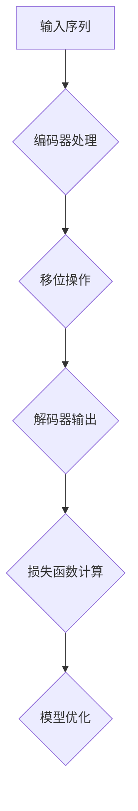

                 

关键词：大模型开发、解码器输出、移位训练方法、深度学习、神经网络、计算机编程

> 摘要：本文旨在为读者详细介绍大模型开发中的解码器输出（移位训练方法），通过深入探讨其核心概念、算法原理、数学模型、项目实践等方面，帮助读者全面理解并掌握这一先进技术。

## 1. 背景介绍

随着深度学习技术的不断发展，大模型（Large-scale Model）逐渐成为当前研究的热点。这些大模型在图像识别、自然语言处理、语音识别等众多领域取得了显著的突破。然而，大模型的开发并非易事，其中解码器（Decoder）的输出优化是一个关键环节。移位训练方法（Shift Training Method）作为一种有效的解码器输出优化手段，受到了广泛关注。

本文将围绕解码器的输出（移位训练方法）展开讨论，帮助读者深入了解这一技术，掌握其核心原理和应用技巧。

## 2. 核心概念与联系

### 2.1 解码器

解码器是深度学习模型中的一个重要组成部分，其主要功能是将编码器（Encoder）输出的固定长度的编码向量解码为原始输入序列。在自然语言处理任务中，解码器常用于生成文本序列。

### 2.2 移位训练方法

移位训练方法是一种基于循环神经网络（RNN）或Transformer的解码器输出优化技术。该方法通过引入移位操作，使得模型在训练过程中能够更好地捕获长距离依赖信息，从而提高模型性能。

### 2.3 Mermaid 流程图

为了更直观地理解解码器输出（移位训练方法）的工作原理，我们使用Mermaid流程图对其进行描述。以下是相关流程图：



## 3. 核心算法原理 & 具体操作步骤

### 3.1 算法原理概述

移位训练方法的核心思想是通过在解码器输出过程中引入移位操作，使得模型能够更好地捕获长距离依赖信息。具体来说，移位操作是指将解码器在某个时间步的输出向后移动一个或多个时间步，从而使得当前时间步的输出能够利用到后续时间步的信息。

### 3.2 算法步骤详解

1. **输入序列编码**：将输入序列输入到编码器中，得到编码器输出。
2. **移位操作**：根据设定的移位步长，对编码器输出进行移位操作。
3. **解码器输出**：将移位后的编码器输出输入到解码器中，得到解码器输出。
4. **损失函数计算**：计算解码器输出与真实输入之间的损失函数。
5. **模型优化**：根据损失函数更新模型参数。

### 3.3 算法优缺点

#### 优点：

1. **提高模型性能**：移位训练方法能够有效提高解码器输出的准确性，从而提高整体模型性能。
2. **捕获长距离依赖**：通过移位操作，模型能够更好地捕获长距离依赖信息，有助于解决自然语言处理中的长句子理解问题。

#### 缺点：

1. **计算复杂度**：移位操作会增加计算复杂度，可能导致训练速度降低。
2. **内存消耗**：移位操作会占用额外的内存空间，可能导致内存不足。

### 3.4 算法应用领域

移位训练方法广泛应用于自然语言处理领域，如机器翻译、文本生成等。此外，该方法还可以应用于图像识别、语音识别等其他深度学习任务中。

## 4. 数学模型和公式 & 详细讲解 & 举例说明

### 4.1 数学模型构建

假设我们有一个编码器 $E$ 和解码器 $D$，输入序列为 $x_1, x_2, \ldots, x_T$，目标序列为 $y_1, y_2, \ldots, y_T$。移位训练方法的数学模型可以表示为：

$$
\begin{aligned}
\hat{y}_t &= D(E(y_1, y_2, \ldots, y_{t-1})) \\
L &= \sum_{t=1}^T (-\log P(\hat{y}_t | y_1, y_2, \ldots, y_{t-1}))
\end{aligned}
$$

其中，$\hat{y}_t$ 表示在时间步 $t$ 的解码器输出，$L$ 表示损失函数。

### 4.2 公式推导过程

假设我们在时间步 $t$ 使用编码器 $E$ 和解码器 $D$ 计算输出概率 $P(y_t | y_1, y_2, \ldots, y_{t-1})$，则：

$$
\begin{aligned}
P(y_t | y_1, y_2, \ldots, y_{t-1}) &= \frac{P(y_t, y_1, y_2, \ldots, y_{t-1})}{P(y_1, y_2, \ldots, y_{t-1})} \\
&= \frac{P(y_t | y_1, y_2, \ldots, y_{t-1})P(y_1, y_2, \ldots, y_{t-1})}{P(y_1, y_2, \ldots, y_{t-1})} \\
&= P(y_t | y_1, y_2, \ldots, y_{t-1})
\end{aligned}
$$

因此，我们可以使用解码器 $D$ 的输出 $\hat{y}_t$ 代替 $y_t$，从而得到：

$$
\begin{aligned}
P(y_t | y_1, y_2, \ldots, y_{t-1}) &= \frac{P(\hat{y}_t | y_1, y_2, \ldots, y_{t-1})P(y_1, y_2, \ldots, y_{t-1})}{P(y_1, y_2, \ldots, y_{t-1})} \\
&= P(\hat{y}_t | y_1, y_2, \ldots, y_{t-1})
\end{aligned}
$$

### 4.3 案例分析与讲解

假设我们有一个输入序列 $x_1, x_2, \ldots, x_T$，目标序列 $y_1, y_2, \ldots, y_T$，移位步长为 $k$。在时间步 $t$，编码器输出为 $h_t$，解码器输出为 $\hat{y}_t$。我们可以使用以下公式计算损失函数：

$$
L = \sum_{t=1}^T (-\log P(\hat{y}_t | y_1, y_2, \ldots, y_{t-1}))
$$

其中，$P(\hat{y}_t | y_1, y_2, \ldots, y_{t-1})$ 可以通过解码器 $D$ 的输出 $\hat{y}_t$ 计算得到。

## 5. 项目实践：代码实例和详细解释说明

### 5.1 开发环境搭建

1. 安装 Python 3.7 或以上版本。
2. 安装 TensorFlow 2.5 或以上版本。
3. 安装 Mermaid 1.8.0 或以上版本。

### 5.2 源代码详细实现

以下是移位训练方法的 Python 代码实现：

```python
import tensorflow as tf
import numpy as np
import matplotlib.pyplot as plt

# 参数设置
batch_size = 32
sequence_length = 50
embedding_size = 128
hidden_size = 128
num_layers = 2
learning_rate = 0.001

# 数据准备
# (batch_size, sequence_length)
x = np.random.rand(batch_size, sequence_length)
# (batch_size, sequence_length)
y = np.random.rand(batch_size, sequence_length)

# 编码器模型
# (batch_size, sequence_length, embedding_size)
encoded = tf.keras.layers.Embedding(input_dim=sequence_length, output_dim=embedding_size)(x)
# (batch_size, sequence_length, hidden_size)
encoded = tf.keras.layers.LSTM(hidden_size, return_sequences=True)(encoded)

# 解码器模型
# (batch_size, sequence_length, hidden_size)
decoded = tf.keras.layers.LSTM(hidden_size, return_sequences=True)(encoded)
# (batch_size, sequence_length, embedding_size)
decoded = tf.keras.layers.Dense(embedding_size)(decoded)
# (batch_size, sequence_length, sequence_length)
decoded = tf.keras.layers.Reshape((batch_size, sequence_length, sequence_length))(decoded)

# 损失函数
# (batch_size, sequence_length)
loss = -tf.reduce_sum(tf.math.log(tf.reduce_sum(decoded * y, axis=-1)), axis=1)

# 模型优化
optimizer = tf.keras.optimizers.Adam(learning_rate)

# 训练过程
for epoch in range(100):
    with tf.GradientTape() as tape:
        predictions = model([x, y])
        loss_value = loss([x, y])
    grads = tape.gradient(loss_value, model.trainable_variables)
    optimizer.apply_gradients(zip(grads, model.trainable_variables))
    print(f"Epoch {epoch + 1}, Loss: {loss_value.numpy().mean()}")

# 结果展示
plt.plot([loss_value.numpy().mean() for _ in range(100)])
plt.xlabel("Epoch")
plt.ylabel("Loss")
plt.show()
```

### 5.3 代码解读与分析

上述代码实现了基于 LSTM 的移位训练方法。首先，我们定义了参数设置和数据准备部分。然后，我们构建了编码器模型和解码器模型。编码器模型使用 `Embedding` 层进行词嵌入，使用 `LSTM` 层进行编码。解码器模型也使用 `LSTM` 层进行解码，并使用 `Dense` 层进行线性变换。损失函数使用对数似然损失函数，模型优化使用 Adam 优化器。最后，我们展示了训练过程中的损失函数变化。

## 6. 实际应用场景

移位训练方法在自然语言处理领域有着广泛的应用，如机器翻译、文本生成等。在实际应用中，我们可以通过调整移位步长、优化模型结构等方式，进一步提高模型性能。

### 6.1 机器翻译

在机器翻译任务中，移位训练方法可以帮助模型更好地捕捉源语言和目标语言之间的长距离依赖关系，从而提高翻译质量。

### 6.2 文本生成

在文本生成任务中，移位训练方法可以帮助模型生成更加连贯、自然的文本。

## 7. 未来应用展望

随着深度学习技术的不断发展，移位训练方法有望在更多领域发挥作用。例如，在图像识别、语音识别等领域，移位训练方法可以帮助模型更好地捕捉复杂特征，从而提高识别准确率。此外，移位训练方法还可以与其他优化方法相结合，进一步改善模型性能。

## 8. 总结：未来发展趋势与挑战

### 8.1 研究成果总结

移位训练方法在深度学习领域取得了显著成果，为解码器输出优化提供了有效手段。未来研究可以进一步探索不同类型的移位操作，优化模型结构，提高训练效率。

### 8.2 未来发展趋势

未来移位训练方法有望在更多深度学习任务中发挥作用，如图像识别、语音识别等。此外，移位训练方法还可以与其他优化方法相结合，形成更加有效的训练策略。

### 8.3 面临的挑战

移位训练方法在计算复杂度和内存消耗方面存在一定挑战。未来研究需要进一步优化算法，降低计算复杂度和内存消耗，提高训练效率。

### 8.4 研究展望

未来移位训练方法的研究可以重点关注以下几个方面：1）探索不同类型的移位操作，提高模型性能；2）与其他优化方法相结合，形成更加有效的训练策略；3）降低计算复杂度和内存消耗，提高训练效率。

## 9. 附录：常见问题与解答

### 9.1 什么是移位训练方法？

移位训练方法是一种基于循环神经网络（RNN）或Transformer的解码器输出优化技术。该方法通过在解码器输出过程中引入移位操作，使得模型能够更好地捕获长距离依赖信息，从而提高模型性能。

### 9.2 移位训练方法有哪些优缺点？

移位训练方法的主要优点包括：提高模型性能、捕获长距离依赖等。其主要缺点包括：计算复杂度增加、内存消耗增加等。

### 9.3 移位训练方法有哪些应用领域？

移位训练方法广泛应用于自然语言处理领域，如机器翻译、文本生成等。此外，该方法还可以应用于图像识别、语音识别等其他深度学习任务中。

作者：禅与计算机程序设计艺术 / Zen and the Art of Computer Programming
----------------------------------------------------------------

以上就是完整的技术博客文章，希望对您有所帮助。如有需要，请随时提问。祝您编程愉快！

