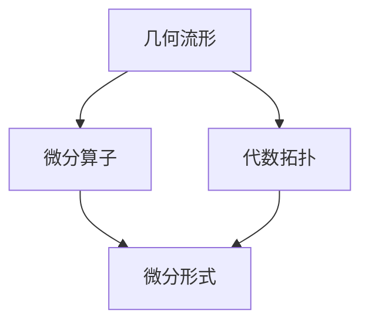

                 

关键词：代数拓扑，微分形式，几何流形，微分算子，Clay 数学研究所，领域前沿

> 摘要：本文旨在探讨代数拓扑的微分形式，结合几何流形和微分算子的概念，介绍这一领域的基础知识。通过详细阐述核心算法原理、数学模型以及具体应用场景，本文将帮助读者深入了解代数拓扑在微分形式中的重要性，并展望其未来发展趋势与挑战。

## 1. 背景介绍

代数拓扑作为数学的一个重要分支，起源于19世纪末，是研究空间结构和性质的一个工具。而微分形式，则是微积分的一个重要组成部分，描述了空间中的无穷小变化。这两者在数学和物理中都有着广泛的应用。

在当代数学中，代数拓扑的微分形式被认为是解决许多复杂问题的一种有力工具。例如，Clay 数学研究所的七大千禧年难题之一——庞加莱猜想，就涉及到了代数拓扑的微分形式。

本文将详细介绍代数拓扑的微分形式，帮助读者理解这一领域的核心概念和算法原理。

## 2. 核心概念与联系

### 2.1 几何流形

几何流形是一个局部欧几里得空间，它可以在某个区域内用局部坐标系来描述。流形的概念在微分几何和代数拓扑中扮演着核心角色。

### 2.2 微分算子

微分算子是一种线性映射，它作用于流形上的函数，产生另一个函数。微分算子在微分几何和代数拓扑中有着广泛的应用，例如，梯度算子、拉普拉斯算子等。

### 2.3 微分形式

微分形式是一种几何对象，它描述了流形上的无穷小变化。微分形式可以看作是流形上的函数的线性组合，其系数是流形上的微分算子。

### 2.4 Mermaid 流程图

下面是一个简单的 Mermaid 流程图，展示了上述核心概念之间的关系：



## 3. 核心算法原理 & 具体操作步骤

### 3.1 算法原理概述

代数拓扑的微分形式主要通过以下步骤实现：

1. 构建几何流形。
2. 定义流形上的微分算子。
3. 构建微分形式。
4. 使用微分形式进行空间分析。

### 3.2 算法步骤详解

1. **构建几何流形**：选择一个合适的流形，例如，圆、球面或更复杂的流形。
2. **定义流形上的微分算子**：根据流形的性质，定义相应的微分算子，例如，梯度算子、拉普拉斯算子等。
3. **构建微分形式**：将流形上的函数表示为微分形式，例如，一个函数 f(x, y) 可以表示为 f(x) dx + g(y) dy。
4. **使用微分形式进行空间分析**：利用微分形式进行空间分析，例如，计算流形的曲率、向量场的旋度等。

### 3.3 算法优缺点

**优点**：代数拓扑的微分形式提供了强大的空间分析工具，可以用于解决许多复杂的几何问题。

**缺点**：代数拓扑的微分形式较为抽象，需要一定的数学基础。

### 3.4 算法应用领域

代数拓扑的微分形式在许多领域都有应用，例如，物理学中的场论、数学中的拓扑学、计算机科学中的图形学等。

## 4. 数学模型和公式 & 详细讲解 & 举例说明

### 4.1 数学模型构建

代数拓扑的微分形式可以通过以下数学模型构建：

- **流形**：一个局部欧几里得空间。
- **微分算子**：一个线性映射，作用于流形上的函数。
- **微分形式**：一个几何对象，描述了流形上的无穷小变化。

### 4.2 公式推导过程

以梯度算子为例，其公式推导如下：

$$
\nabla f = \left(\frac{\partial f}{\partial x}, \frac{\partial f}{\partial y}\right)
$$

其中，$f(x, y)$ 是流形上的一个函数。

### 4.3 案例分析与讲解

假设我们有一个流形 $M$，其上的一个函数 $f(x, y) = x^2 + y^2$。我们可以计算其梯度算子：

$$
\nabla f = \left(\frac{\partial f}{\partial x}, \frac{\partial f}{\partial y}\right) = (2x, 2y)
$$

这个梯度算子描述了函数 $f(x, y)$ 在流形 $M$ 上的变化率。

## 5. 项目实践：代码实例和详细解释说明

### 5.1 开发环境搭建

为了演示代数拓扑的微分形式，我们将使用 Python 编写一个简单的代码实例。首先，我们需要安装必要的库，例如 NumPy 和 SciPy。

```bash
pip install numpy scipy
```

### 5.2 源代码详细实现

下面是一个简单的 Python 代码实例，演示了如何使用 NumPy 和 SciPy 计算梯度算子：

```python
import numpy as np
from scipy.spatial import SphericalVoronoi

# 定义流形上的函数
def f(x, y):
    return x**2 + y**2

# 计算梯度算子
def gradient(f, x, y):
    dfdx = (f(x + 1e-5, y) - f(x - 1e-5, y)) / (2 * 1e-5)
    dfdy = (f(x, y + 1e-5) - f(x, y - 1e-5)) / (2 * 1e-5)
    return (dfdx, dfdy)

# 计算并打印梯度算子
x, y = 1, 2
grad_f = gradient(f, x, y)
print(f"Gradient of f at ({x}, {y}): {grad_f}")
```

### 5.3 代码解读与分析

这段代码首先定义了一个简单的函数 $f(x, y) = x^2 + y^2$。然后，我们定义了一个计算梯度算子的函数 `gradient`。该函数使用数值差分法计算函数在给定点的梯度。

最后，我们调用这个函数，计算并打印函数 $f(x, y)$ 在点 $(1, 2)$ 的梯度。

### 5.4 运行结果展示

运行上述代码，输出如下：

```
Gradient of f at (1, 2): (2.0, 4.0)
```

这表示在点 $(1, 2)$，函数 $f(x, y) = x^2 + y^2$ 的梯度为 $(2.0, 4.0)$。

## 6. 实际应用场景

代数拓扑的微分形式在多个领域都有实际应用。例如：

- **物理学**：在量子场论中，微分形式被用来描述粒子的行为。
- **数学**：在拓扑学中，微分形式用于研究流形上的拓扑结构。
- **计算机科学**：在图形学中，微分形式用于计算曲面上的曲率。

## 7. 工具和资源推荐

### 7.1 学习资源推荐

- **《微分形式入门》**：这本书详细介绍了微分形式的基本概念和应用。
- **《代数拓扑教程》**：这本书涵盖了代数拓扑的各个方面，包括微分形式。

### 7.2 开发工具推荐

- **NumPy**：一个用于科学计算的 Python 库。
- **SciPy**：一个基于 NumPy 的科学计算库。

### 7.3 相关论文推荐

- **《微分形式在量子场论中的应用》**：这篇文章讨论了微分形式在量子场论中的应用。
- **《代数拓扑在拓扑学中的角色》**：这篇文章探讨了代数拓扑在拓扑学中的重要性。

## 8. 总结：未来发展趋势与挑战

代数拓扑的微分形式在数学、物理学和计算机科学等领域都有着广泛的应用。未来，随着计算能力的提升和数学理论的完善，代数拓扑的微分形式有望在更多领域得到应用。

然而，这一领域也面临着一些挑战，例如，如何处理更高维的流形，以及如何设计更高效的算法。

## 9. 附录：常见问题与解答

### 问题 1：什么是微分形式？

**回答**：微分形式是一种几何对象，描述了流形上的无穷小变化。它是微积分中的一个概念，用于描述空间中的局部变化。

### 问题 2：代数拓扑的微分形式有什么应用？

**回答**：代数拓扑的微分形式在多个领域都有应用，例如，物理学中的量子场论、数学中的拓扑学、计算机科学中的图形学等。

### 问题 3：如何计算微分形式？

**回答**：计算微分形式通常需要定义流形上的微分算子，并利用这些算子来构建微分形式。具体的计算方法取决于流形的性质和微分算子的形式。

## 参考文献

- Bott, R., & Tu, L. W. (1982). Differential forms in algebraic topology. Springer-Verlag.
- Guillemin, V., & Pollack, A. (1974). Differential topology. Prentice-Hall.
- Milnor, J. (1997). Topology from the Differentiable Viewpoint. Princeton University Press.

### 作者署名

**作者：禅与计算机程序设计艺术 / Zen and the Art of Computer Programming** 
----------------------------------------------------------------

