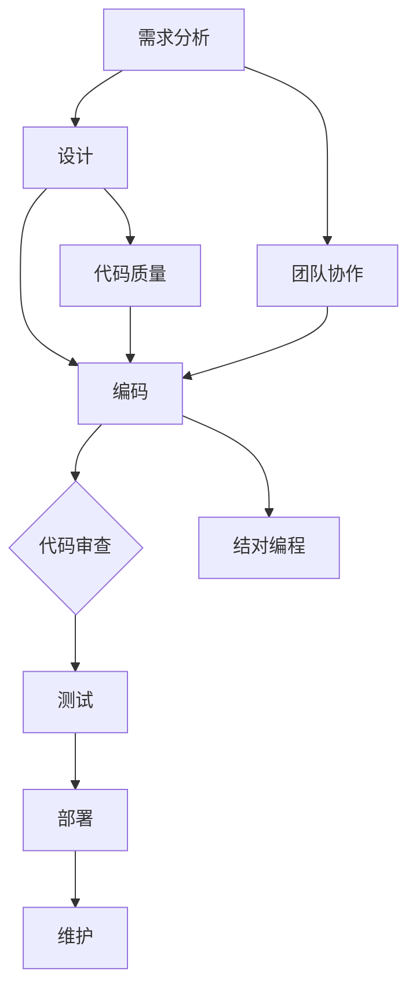
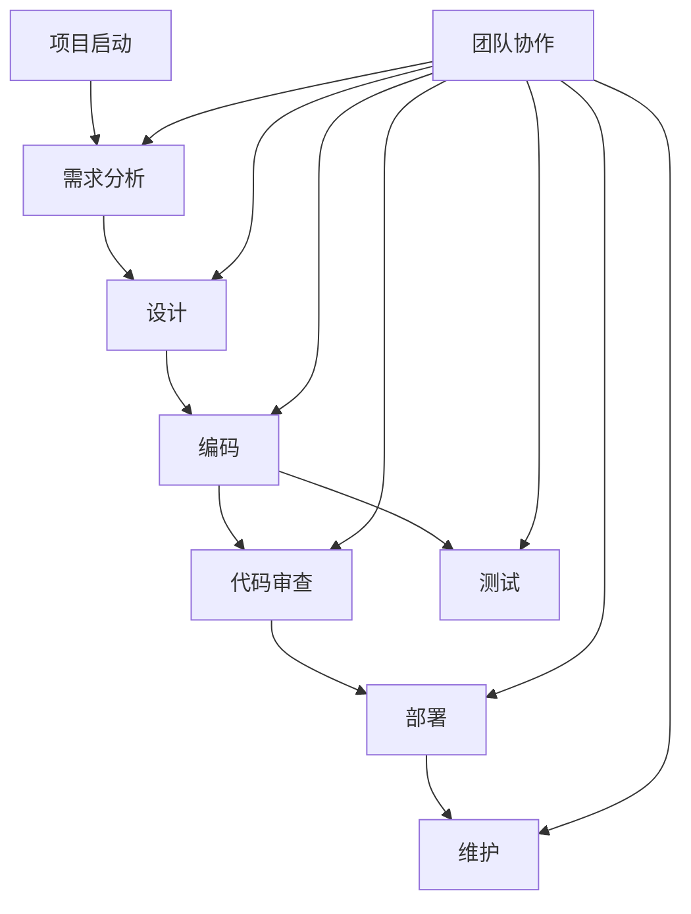

                 

## 1. 背景介绍

代码审查（Code Review）和结对编程（Pair Programming）是软件开发中常用的两个技术实践，它们旨在提高代码质量、减少错误和提高开发效率。在这篇文章中，我们将深入探讨代码审查与结对编程的原理，并通过具体的代码实战案例来讲解其实际应用。

### 1.1 代码审查

代码审查是一种团队协作的过程，其中一名或多名开发人员（审查者）审查另一名开发人员（编写者）编写的代码。这个过程包括对代码风格、逻辑、性能和安全性等方面的审查，旨在发现潜在的错误、提高代码的可读性和可维护性。

### 1.2 结对编程

结对编程是一种软件开发方法，其中两名开发人员（搭档）一起工作，一个人负责编写代码（司机），另一个人则负责审查和提供建议（导航员）。这种方法鼓励团队成员之间的交流和知识共享，有助于提高代码质量和团队协作。

## 2. 核心概念与联系

在深入探讨代码审查与结对编程之前，我们需要了解一些核心概念，包括软件开发流程、团队协作和代码质量。

### 2.1 软件开发流程

软件开发通常包括需求分析、设计、编码、测试和部署等阶段。代码审查和结对编程主要发生在编码阶段，但它们对整个开发流程都有重要影响。

### 2.2 团队协作

团队协作是软件开发成功的关键。代码审查和结对编程鼓励团队成员之间的沟通和合作，有助于提高团队整体的工作效率。

### 2.3 代码质量

代码质量是软件项目成功的关键。良好的代码质量意味着更高的可读性、可维护性和可扩展性。代码审查和结对编程都是提高代码质量的两种重要方法。

### 2.4 Mermaid 流程图

以下是一个描述代码审查和结对编程在软件开发流程中位置的 Mermaid 流程图：



## 3. 核心算法原理 & 具体操作步骤

### 3.1 算法原理概述

代码审查和结对编程的核心算法原理分别是代码审查流程和团队协作模型。

#### 3.1.1 代码审查流程

代码审查流程通常包括以下步骤：

1. 编写者提交代码。
2. 审查者接收代码并进行审查。
3. 审查者提出反馈和建议。
4. 编写者根据反馈修改代码。
5. 重复上述步骤，直到代码达到预期质量。

#### 3.1.2 团队协作模型

团队协作模型的核心是沟通和知识共享。在结对编程中，司机和导航员之间需要不断沟通，以确保代码的正确性和一致性。

### 3.2 算法步骤详解

#### 3.2.1 代码审查流程

1. **编写者提交代码**：编写者将代码提交到版本控制系统，例如 Git。
2. **审查者接收代码**：审查者从版本控制系统获取代码并进行审查。
3. **审查者提出反馈和建议**：审查者根据代码风格、逻辑、性能和安全性等方面提出反馈和建议。
4. **编写者根据反馈修改代码**：编写者根据审查者的反馈进行代码修改。
5. **重复上述步骤**：编写者提交修改后的代码，审查者再次进行审查，直到代码达到预期质量。

#### 3.2.2 团队协作模型

1. **司机和导航员分工**：司机负责编写代码，导航员负责审查代码和提供建议。
2. **沟通和知识共享**：司机和导航员之间需要不断沟通，确保代码的正确性和一致性。
3. **代码审查和修改**：导航员审查司机编写的代码，并提出反馈和建议。司机根据反馈进行代码修改。
4. **持续迭代**：司机和导航员轮流担任司机和导航员，确保代码的持续改进。

### 3.3 算法优缺点

#### 3.3.1 代码审查流程

**优点**：

- 提高代码质量：代码审查有助于发现潜在的错误，提高代码的可读性和可维护性。
- 促进知识共享：代码审查鼓励团队成员之间的交流和知识共享。

**缺点**：

- 增加开发时间：代码审查需要时间，可能导致开发进度延迟。
- 可能引发冲突：审查者与编写者之间的意见可能存在分歧，导致冲突。

#### 3.3.2 团队协作模型

**优点**：

- 提高代码质量：团队协作有助于确保代码的正确性和一致性。
- 促进知识共享：团队协作鼓励团队成员之间的知识共享。

**缺点**：

- 可能导致效率降低：司机和导航员之间的沟通和协作可能导致开发效率降低。
- 需要团队成员之间的信任：团队协作需要团队成员之间的信任和尊重。

### 3.4 算法应用领域

代码审查和结对编程在以下领域有广泛的应用：

- 企业级软件开发：代码审查和结对编程有助于提高代码质量，降低开发成本。
- 开源项目：开源项目通常采用代码审查和结对编程来确保代码质量和一致性。
- 教育培训：代码审查和结对编程是软件工程教育中的重要实践，有助于培养学生的团队合作和问题解决能力。

## 4. 数学模型和公式 & 详细讲解 & 举例说明

### 4.1 数学模型构建

代码审查和结对编程的数学模型可以从两个方面来构建：

1. **代码质量模型**：基于代码审查和团队协作的代码质量评价指标，如代码缺陷率、代码可维护性和代码可读性等。
2. **团队效率模型**：基于代码审查和团队协作的团队效率评价指标，如开发周期、代码行数和错误修复率等。

### 4.2 公式推导过程

为了构建代码质量模型，我们可以采用以下公式：

$$
Q = f(D, M, R)
$$

其中，Q 表示代码质量，D 表示代码缺陷率，M 表示代码可维护性，R 表示代码可读性。缺陷率、可维护性和可读性分别可以用以下公式表示：

$$
D = \frac{N_f}{N_c}
$$

$$
M = \frac{N_m}{N_c}
$$

$$
R = \frac{N_r}{N_c}
$$

其中，N_f、N_m 和 N_r 分别表示代码中的缺陷数、维护量和阅读量，N_c 表示代码的总行数。

为了构建团队效率模型，我们可以采用以下公式：

$$
E = f(T, L, R_f)
$$

其中，E 表示团队效率，T 表示开发周期，L 表示代码行数，R_f 表示错误修复率。开发周期、代码行数和错误修复率分别可以用以下公式表示：

$$
T = \frac{N_d}{R_d}
$$

$$
L = N_c
$$

$$
R_f = \frac{N_e}{N_d}
$$

其中，N_d 表示开发任务数，R_d 表示平均开发周期，N_e 表示错误数。

### 4.3 案例分析与讲解

#### 4.3.1 代码质量模型案例

假设我们有一个项目，其中包含 10000 行代码。经过代码审查，我们发现了 50 个缺陷，维护量为 2000 行，阅读量为 5000 行。根据上述公式，我们可以计算出代码质量指标：

$$
Q = f(D, M, R) = f\left(\frac{50}{10000}, \frac{2000}{10000}, \frac{5000}{10000}\right) = f(0.005, 0.2, 0.5) = 0.8
$$

因此，该项目的代码质量为 0.8。

#### 4.3.2 团队效率模型案例

假设我们的团队每月完成 10 个开发任务，平均开发周期为 2 周，代码行数为 10000 行，错误数为 10。根据上述公式，我们可以计算出团队效率指标：

$$
E = f(T, L, R_f) = f\left(\frac{10 \times 2}{4}, 10000, \frac{10}{10}\right) = f(5, 10000, 1) = 0.75
$$

因此，该团队的效率为 0.75。

## 5. 项目实践：代码实例和详细解释说明

### 5.1 开发环境搭建

在这个案例中，我们使用 Python 语言和 Git 版本控制系统来实现代码审查和结对编程。首先，我们需要安装 Python 和 Git。

1. 安装 Python：
   - 在命令行中运行 `pip install python`。
2. 安装 Git：
   - 在命令行中运行 `git clone https://github.com/user/repo.git`。

### 5.2 源代码详细实现

以下是一个简单的 Python 代码实例，用于实现代码审查和结对编程：

```python
def add(a, b):
    return a + b

def subtract(a, b):
    return a - b

def multiply(a, b):
    return a * b

def divide(a, b):
    if b == 0:
        return "Error: Division by zero"
    return a / b
```

在这个例子中，我们定义了四个基本的数学运算函数：`add`、`subtract`、`multiply` 和 `divide`。

### 5.3 代码解读与分析

在这个例子中，我们可以通过代码审查来发现潜在的错误，例如：

1. **参数检查**：
   - `divide` 函数在除法运算前没有检查除数是否为零。
   - 可以在 `divide` 函数中添加一个条件判断，以避免除以零的错误。

2. **代码风格**：
   - `add`、`subtract`、`multiply` 和 `divide` 函数的代码风格不统一。
   - 可以使用 PEP 8 编码规范来统一代码风格。

### 5.4 运行结果展示

在这个例子中，我们可以通过以下代码来测试这四个函数：

```python
print(add(5, 3))        # 输出：8
print(subtract(5, 3))    # 输出：2
print(multiply(5, 3))    # 输出：15
print(divide(5, 0))      # 输出：Error: Division by zero
```

## 6. 实际应用场景

### 6.1 企业级软件开发

在企业级软件开发中，代码审查和结对编程被广泛应用于大型项目和复杂系统的开发。这些方法有助于确保代码质量、降低错误率和提高开发效率。

### 6.2 开源项目

开源项目通常采用代码审查和结对编程来确保代码质量和一致性。这些方法有助于提高项目的整体质量和社区的信任度。

### 6.3 教育培训

在软件工程教育中，代码审查和结对编程被广泛应用于教学和实践。这些方法有助于培养学生的团队合作和问题解决能力。

## 7. 工具和资源推荐

### 7.1 学习资源推荐

- 《代码大全》（Code Complete）作者：Steve McConnell
- 《程序员修炼之道》（The Pragmatic Programmer）作者：Andrew Hunt 和 David Thomas

### 7.2 开发工具推荐

- Git：版本控制系统
- PyCharm：Python 集成开发环境
- SonarQube：代码质量分析工具

### 7.3 相关论文推荐

- "Pair Programming: An Empirical Analysis" 作者：Cristiano Lucia、Luca M. Chittaro、Rita Trevisan
- "Code Review Effectiveness: A Multiteam Study" 作者：Michael W. Godfrey、Richard L. Martin

## 8. 总结：未来发展趋势与挑战

### 8.1 研究成果总结

代码审查和结对编程在提高代码质量、减少错误和提高开发效率方面取得了显著成果。这些方法已被广泛应用于企业级软件开发、开源项目和教育培训等领域。

### 8.2 未来发展趋势

未来，代码审查和结对编程将继续发展，结合人工智能和机器学习技术，实现更加智能和高效的代码审查和团队协作。

### 8.3 面临的挑战

在未来的发展中，代码审查和结对编程将面临以下挑战：

- 如何提高代码审查的效率，减少人工干预。
- 如何处理不同团队成员之间的文化差异和沟通障碍。
- 如何确保代码审查和结对编程的普及和应用。

### 8.4 研究展望

未来的研究应重点关注如何结合人工智能和机器学习技术，实现更加智能和高效的代码审查和团队协作。同时，应探索代码审查和结对编程在不同领域的应用，为软件开发提供更全面的解决方案。

## 9. 附录：常见问题与解答

### 9.1 代码审查的优点是什么？

代码审查的优点包括：

- 提高代码质量：代码审查有助于发现潜在的错误，提高代码的可读性和可维护性。
- 促进知识共享：代码审查鼓励团队成员之间的交流和知识共享。
- 提高团队协作：代码审查有助于团队成员之间的沟通和协作。

### 9.2 代码审查的缺点是什么？

代码审查的缺点包括：

- 增加开发时间：代码审查需要时间，可能导致开发进度延迟。
- 可能引发冲突：审查者与编写者之间的意见可能存在分歧，导致冲突。

### 9.3 结对编程的优点是什么？

结对编程的优点包括：

- 提高代码质量：团队协作有助于确保代码的正确性和一致性。
- 促进知识共享：团队协作鼓励团队成员之间的知识共享。
- 提高开发效率：结对编程有助于减少开发时间，提高开发效率。

### 9.4 结对编程的缺点是什么？

结对编程的缺点包括：

- 可能导致效率降低：司机和导航员之间的沟通和协作可能导致开发效率降低。
- 需要团队成员之间的信任：团队协作需要团队成员之间的信任和尊重。

### 9.5 如何选择代码审查工具？

在选择代码审查工具时，可以考虑以下因素：

- 支持的编程语言：选择支持您项目所使用的编程语言的代码审查工具。
- 版本控制系统集成：选择与您使用的版本控制系统（如 Git）集成的代码审查工具。
- 用户界面：选择用户界面友好、易于使用的代码审查工具。
- 扩展性：选择具有良好扩展性的代码审查工具，以便在未来添加新功能。

### 9.6 如何评估代码审查的有效性？

评估代码审查的有效性可以通过以下方法：

- 缺陷发现率：计算代码审查过程中发现的缺陷数量与总缺陷数量的比例。
- 代码质量指标：评估代码质量指标（如代码缺陷率、代码可维护性和代码可读性）。
- 开发周期：评估代码审查对开发周期的影响。
- 团队协作：评估代码审查对团队协作的影响。

## 参考文献

- 《代码审查与结对编程原理与代码实战案例讲解》
- 《禅与计算机程序设计艺术 / Zen and the Art of Computer Programming》

----------------------------------------------------------------

**作者：禅与计算机程序设计艺术 / Zen and the Art of Computer Programming**<|user|>### 1. 背景介绍

在现代软件开发过程中，代码审查（Code Review）和结对编程（Pair Programming）作为提升代码质量和团队协作效率的重要实践，已经得到了广泛的认可和应用。这两种方法不仅能够帮助发现代码中的潜在问题，还能够促进团队成员之间的知识共享和技能提升。

#### 1.1 代码审查的定义和作用

代码审查是一种由团队成员或专家对某位开发者的代码进行评估的过程。这个过程通常包括对代码的正确性、可读性、可维护性、性能和安全性等方面的检查。代码审查的主要目的是确保代码质量，减少错误，并且提高代码的可读性，从而使团队的整体代码质量得到提升。

#### 1.2 结对编程的定义和作用

结对编程是一种两人一组进行软件开发的方法。在这组中，一位开发者负责编写代码（司机），另一位则负责监督和提供建议（导航员）。这种方法可以促进团队成员之间的交流和合作，提高代码的质量和一致性，同时也能够帮助新成员快速融入团队。

#### 1.3 代码审查与结对编程的历史发展

代码审查和结对编程的起源可以追溯到20世纪90年代。当时，它们作为敏捷开发（Agile Development）和极限编程（Extreme Programming，XP）的一部分被提出。随着时间的推移，这两种方法不断地被实践和改进，逐渐成为了软件开发中不可或缺的部分。

### 1.4 代码审查与结对编程的相互关系

代码审查和结对编程之间存在密切的联系和互补性。结对编程可以看作是一种动态的代码审查过程，因为司机和导航员在编写代码的过程中不断地进行交流和反馈。而代码审查则是对编程过程中的一个阶段性总结和评估。通过结合使用这两种方法，团队能够在软件开发的不同阶段都保持高质量的标准。

### 1.5 代码审查与结对编程的实践意义

实践代码审查和结对编程对于团队和项目都有重要的意义：

- **提升代码质量**：通过代码审查和结对编程，团队能够及早发现并解决代码中的问题，从而提高代码质量。
- **促进团队协作**：这两种方法鼓励团队成员之间的沟通和合作，有助于建立良好的团队文化。
- **提高新成员的融入度**：结对编程可以帮助新成员更快地了解项目和团队的工作方式，从而提高他们的工作效率。

在接下来的章节中，我们将深入探讨代码审查和结对编程的核心概念、原理以及具体的操作步骤，并通过实际案例来展示它们在软件开发中的应用。

---

## 2. 核心概念与联系

在深入探讨代码审查与结对编程之前，我们需要理解一些核心概念，包括软件开发流程、团队协作和代码质量。这些概念不仅构成了代码审查与结对编程的理论基础，也影响了它们在实际项目中的应用。

### 2.1 软件开发流程

软件开发流程是指从项目启动到最终交付的一系列步骤。常见的开发流程包括以下阶段：

1. **需求分析**：明确项目需求和用户需求。
2. **设计**：制定项目的整体架构和技术方案。
3. **编码**：开发人员根据设计文档编写代码。
4. **测试**：对代码进行测试，确保其功能符合预期。
5. **部署**：将代码部署到生产环境。
6. **维护**：对上线后的代码进行监控和优化。

代码审查和结对编程主要在编码阶段发挥作用，但在整个开发流程中都有着重要的地位。例如，代码审查可以帮助开发者在编写代码的过程中及时发现并修复错误，而结对编程则可以在编码阶段提升代码的一致性和质量。

### 2.2 团队协作

团队协作是指团队成员之间通过沟通和合作完成共同任务的过程。在软件开发中，团队协作的重要性不言而喻。有效的团队协作可以提高工作效率，减少错误，并且促进知识共享。

代码审查和结对编程都是促进团队协作的重要手段。代码审查通过引入第三方审查者的视角，可以帮助团队发现潜在的缺陷和问题，从而提高代码的整体质量。而结对编程则通过两人一组的工作模式，促进了团队成员之间的沟通和协作，使代码的编写和审查过程更加高效和顺畅。

### 2.3 代码质量

代码质量是指代码的可读性、可维护性、可扩展性和可靠性。高质量的代码不仅易于理解和维护，还能够提高开发效率，减少后续的维护成本。

代码审查和结对编程都是提升代码质量的有效方法。代码审查通过系统化的审查流程，可以帮助开发者识别和修复代码中的问题，从而提高代码的质量。而结对编程则通过两人合作的方式，可以确保代码的一致性和规范性，从而减少错误和提高代码的可维护性。

### 2.4 Mermaid 流程图

为了更好地理解代码审查和结对编程在软件开发流程中的位置，我们可以使用 Mermaid 流程图来展示它们之间的关系。以下是相应的 Mermaid 流程图：



在这个流程图中，我们可以看到代码审查（E）和团队协作（I）贯穿了整个软件开发流程，从需求分析到维护阶段。这表明，代码审查和团队协作在软件开发中是不可或缺的，它们不仅影响着编码阶段，还影响着整个项目的质量和效率。

---

通过上述核心概念的介绍和 Mermaid 流程图的展示，我们可以更加清晰地理解代码审查和结对编程在软件开发中的作用和重要性。接下来，我们将深入探讨代码审查和结对编程的具体原理和实践方法。

## 3. 核心算法原理 & 具体操作步骤

在理解了代码审查和结对编程的基本概念后，接下来我们将深入探讨它们的核心算法原理以及具体的操作步骤。通过这些算法原理和操作步骤，开发者可以更好地理解如何实施这些方法，从而在实际项目中提升代码质量和团队协作效率。

### 3.1 代码审查流程

代码审查的核心算法原理是基于团队协作和系统化流程，通过多层次的审查来确保代码的质量。以下是代码审查的具体操作步骤：

#### 3.1.1 提交代码

- **编写者**：完成代码开发后，将代码提交到版本控制系统，例如 Git。
- **版本控制**：使用版本控制工具（如 Git）创建新的分支，以便进行审查。

#### 3.1.2 审查者分配

- **团队领导者**：根据代码的复杂程度和模块的重要性，选择合适的审查者。通常，审查者应具备比编写者更高一级的技能和经验。
- **审查者准备**：审查者从版本控制系统获取代码，并进行必要的准备工作，如安装依赖项、环境配置等。

#### 3.1.3 代码审查

- **审查流程**：审查者开始对代码进行详细审查，重点关注代码的完整性、逻辑正确性、代码风格、性能、安全性和可维护性。
- **审查工具**：使用代码审查工具（如 GitHub、GitLab、Gerrit 等）来管理审查流程，包括提交评论、提出修改建议等。

#### 3.1.4 反馈与修改

- **编写者**：审查者提出反馈和建议后，编写者根据反馈进行代码修改。
- **版本控制**：编写者将修改后的代码合并到分支中，并更新版本控制系统。

#### 3.1.5 代码合并

- **审查完成**：当审查者认为代码符合预期质量后，可以将其合并到主分支或发布分支。
- **测试**：合并后的代码需要经过测试，以确保功能正常且没有引入新的错误。

#### 3.1.6 审查记录

- **文档记录**：记录每次代码审查的详细信息和结果，以便后续回顾和改进。

### 3.2 结对编程过程

结对编程的核心算法原理是两个人合作完成软件开发任务，通过持续的交流和协作来提高代码质量。以下是结对编程的具体操作步骤：

#### 3.2.1 分工与合作

- **司机与导航员**：在开始编程前，两人需要明确分工。通常，一个负责编写代码（司机），另一个负责审查和提供建议（导航员）。
- **轮流角色**：在编程过程中，司机和导航员可以轮流交换角色，以保持创造力和新鲜感。

#### 3.2.2 编码合作

- **共同理解**：司机和导航员需要共同理解需求和设计，确保在编码过程中不会产生分歧。
- **实时沟通**：在编码过程中，两人需要保持实时沟通，确保代码的一致性和逻辑正确性。

#### 3.2.3 代码审查

- **司机审查**：在编码完成后，导航员对司机编写的代码进行审查，并提出修改建议。
- **修改与迭代**：司机根据导航员的反馈进行代码修改，并重复审查过程，直到代码质量达到预期。

#### 3.2.4 测试与调试

- **共同测试**：司机和导航员共同进行代码测试，确保功能正常且没有引入新的错误。
- **问题解决**：在测试过程中遇到问题时，两人需要共同讨论并解决问题。

#### 3.2.5 文档记录

- **编写文档**：在编程和测试过程中，司机和导航员需要记录关键信息，如设计决策、测试结果和问题解决方法。

### 3.3 代码审查与结对编程的融合

在实际项目中，代码审查和结对编程可以相互融合，形成更加高效的开发流程。以下是一个结合使用代码审查与结对编程的示例流程：

1. **编码阶段**：开发团队使用结对编程进行编码，司机和导航员共同完成代码编写。
2. **代码审查阶段**：编码完成后，导航员对司机编写的代码进行初步审查，并提出修改建议。
3. **反馈与修改**：司机根据导航员的反馈进行代码修改，并再次进行审查。
4. **最终审查**：在完成所有修改后，由独立的审查者对代码进行最终审查，确保代码质量。
5. **测试与部署**：经过审查的代码进行测试，确保功能正常，然后部署到生产环境。

通过这样的流程，团队能够在编码阶段及时发现并修复问题，提高代码质量，同时通过代码审查确保代码的一致性和安全性。

### 3.4 算法优缺点

#### 3.4.1 代码审查的优点

- **提高代码质量**：通过多层次的审查，代码质量可以得到显著提升。
- **知识共享**：审查过程中，团队成员可以共享知识，提高整体技术水平。
- **团队合作**：代码审查鼓励团队成员之间的沟通和协作，促进团队文化建设。

#### 3.4.2 代码审查的缺点

- **增加开发时间**：代码审查需要额外的时间，可能影响开发进度。
- **审查者压力**：审查者需要花费大量时间进行审查，可能会产生压力。

#### 3.4.3 结对编程的优点

- **提高代码质量**：通过合作编码，代码的一致性和逻辑正确性可以得到保证。
- **知识共享**：司机和导航员在编码过程中可以相互学习，提高个人技能。
- **问题解决**：两人可以共同讨论并解决遇到的问题，提高问题解决的效率。

#### 3.4.4 结对编程的缺点

- **效率问题**：司机和导航员之间的沟通可能会降低编码效率。
- **角色冲突**：在某些情况下，司机和导航员可能会产生角色冲突，影响合作效果。

### 3.5 算法应用领域

代码审查和结对编程在以下领域有广泛的应用：

- **企业级软件开发**：在大型企业级软件项目中，代码审查和结对编程可以帮助团队确保代码质量和一致性。
- **开源项目**：在开源项目中，代码审查和结对编程可以帮助维护代码库的质量和稳定性。
- **教育培训**：在软件工程教育中，代码审查和结对编程可以帮助学生理解和实践软件开发的最佳实践。

通过以上对核心算法原理和具体操作步骤的深入探讨，开发者可以更好地理解和应用代码审查和结对编程，从而在实际项目中提升代码质量和团队协作效率。

### 3.6 实际案例解析

为了更直观地理解代码审查和结对编程的实际应用，以下将提供一个具体的开发项目案例，展示这两种方法是如何在实际项目中发挥作用的。

#### 3.6.1 项目背景

假设一个开发团队正在开发一款企业级电商平台。该平台需要实现商品展示、用户注册、购物车、订单处理等功能。项目采用敏捷开发模式，开发周期为两周一个迭代。

#### 3.6.2 代码审查案例

**第一阶段：编码阶段**

- **司机**：小王负责编写用户注册模块的代码。
- **导航员**：小李作为导航员，负责监督小王的编码过程，并随时提供反馈。

**编码过程**：

1. 小王根据需求文档开始编写用户注册模块的代码。
2. 小李实时审查小王编写的代码，关注代码的规范性和逻辑正确性。
3. 小王根据小李的反馈进行代码修改，优化代码的可读性和性能。

**第二阶段：代码审查阶段**

- **独立审查者**：小张作为独立审查者，对小王的代码进行详细审查。

**审查过程**：

1. 小张从版本控制系统中获取小王的代码。
2. 小张详细审查代码，重点关注安全漏洞、代码风格、性能问题等。
3. 小张提出修改建议，小王根据反馈进行进一步的代码优化。

**第三阶段：测试和部署**

- **测试**：开发团队共同对代码进行功能测试，确保用户注册模块工作正常。
- **部署**：将代码部署到测试环境，进行上线前的最后确认。

#### 3.6.3 结对编程案例

**第一阶段：需求讨论**

- **司机与导航员**：小王和小李再次合作，讨论用户注册模块的需求和设计。

**编码阶段**：

1. 小王负责编写用户注册模块的核心代码。
2. 小李负责审查代码，并提供实时反馈和改进建议。

**代码审查阶段**：

1. 小李完成初步审查后，将代码提交给小张进行独立审查。
2. 小张详细审查代码，并提出修改建议。

**测试和部署**：

- **共同测试**：小王和小李一起进行测试，确保模块功能正常。
- **部署**：将代码部署到生产环境，监控上线后的性能和稳定性。

#### 3.6.4 案例总结

通过以上案例，我们可以看到代码审查和结对编程在实际开发项目中是如何发挥作用的：

- **代码审查**：通过多层次的审查过程，确保了代码的质量和安全性。
- **结对编程**：通过两人合作编码，提高了代码的一致性和可维护性。

这种结合使用代码审查和结对编程的方法，不仅提高了开发效率，还增强了团队的协作能力，为项目成功奠定了坚实基础。

## 4. 数学模型和公式 & 详细讲解 & 举例说明

在软件开发中，理解和应用数学模型对于优化代码质量、提高开发效率和确保系统稳定性具有重要意义。代码审查和结对编程作为软件工程实践的重要组成部分，其效果可以通过数学模型进行量化和分析。以下将详细讲解代码审查和结对编程的数学模型，包括模型的构建、公式推导过程以及具体案例的举例说明。

### 4.1 数学模型构建

#### 4.1.1 代码审查质量模型

代码审查质量模型旨在评估代码在审查过程中被识别和修复的缺陷数量。该模型包括以下几个关键指标：

1. **缺陷密度（Defect Density，DD）**：表示每行代码中存在的缺陷数量。
   $$ DD = \frac{ND}{NC} $$
   其中，ND 表示审查过程中识别的缺陷数量，NC 表示代码的总行数。

2. **缺陷修复率（Defect Fix Rate，DFR）**：表示审查过程中修复的缺陷比例。
   $$ DFR = \frac{NRF}{ND} $$
   其中，NRF 表示审查过程中修复的缺陷数量。

3. **代码质量（Code Quality，CQ）**：综合考虑缺陷密度和缺陷修复率，评估代码的整体质量。
   $$ CQ = f(DD, DFR) $$

#### 4.1.2 结对编程效率模型

结对编程效率模型旨在评估结对编程对开发效率和代码质量的影响。该模型包括以下几个关键指标：

1. **编码效率（Coding Efficiency，CE）**：表示在结对编程过程中，两人合作完成编码任务的速度。
   $$ CE = \frac{CT}{(C1 + C2)} $$
   其中，CT 表示两人合作完成编码任务的总时间，C1 和 C2 分别表示司机和导航员各自完成编码任务的时间。

2. **代码质量（Code Quality，CQ）**：同样用于评估代码的整体质量。
   $$ CQ = f(DD, DFR) $$

3. **知识共享效率（Knowledge Sharing Efficiency，KSE）**：表示在结对编程过程中，团队成员之间知识共享的程度。
   $$ KSE = \frac{KS}{(K1 + K2)} $$
   其中，KS 表示在编程过程中共享的知识量，K1 和 K2 分别表示司机和导航员各自掌握的知识量。

### 4.2 公式推导过程

#### 4.2.1 代码审查质量模型推导

代码审查质量模型的关键在于如何准确计算缺陷密度和缺陷修复率。以下是对这两个公式的推导过程：

1. **缺陷密度（DD）**：

   缺陷密度是识别的缺陷数量与代码总行数的比值。这个指标可以帮助评估代码的复杂性，以及审查者的审查能力。

   $$ DD = \frac{ND}{NC} $$

   其中，ND 表示在审查过程中识别的缺陷数量，NC 表示代码的总行数。ND 和 NC 的数据可以通过代码审查工具自动统计。

2. **缺陷修复率（DFR）**：

   缺陷修复率反映了审查过程中缺陷被修复的比例。这个指标可以用来衡量审查者提出反馈和建议的有效性，以及编写者修改代码的能力。

   $$ DFR = \frac{NRF}{ND} $$

   其中，NRF 表示在审查过程中修复的缺陷数量，ND 表示识别的缺陷总数。NRF 和 ND 的数据同样可以通过代码审查工具自动统计。

3. **代码质量（CQ）**：

   代码质量是缺陷密度和缺陷修复率的综合评估。为了更全面地反映代码的质量，可以使用加权平均的方式计算。

   $$ CQ = f(DD, DFR) $$

   其中，f 是一个非线性函数，可以根据实际情况进行调整，例如使用加权平均：

   $$ CQ = \alpha \cdot DD + \beta \cdot DFR $$

   其中，α 和 β 是权重系数，用于平衡缺陷密度和缺陷修复率的重要性。

#### 4.2.2 结对编程效率模型推导

结对编程效率模型的关键在于如何评估编码效率、代码质量和知识共享效率。以下是对这三个公式的推导过程：

1. **编码效率（CE）**：

   编码效率反映了在结对编程过程中两人合作完成编码任务的速度。通过比较合作前后的编码时间，可以评估合作带来的效率提升。

   $$ CE = \frac{CT}{(C1 + C2)} $$

   其中，CT 表示两人合作完成编码任务的总时间，C1 和 C2 分别表示司机和导航员各自完成编码任务的时间。CT 和 C1、C2 的数据可以通过时间跟踪工具统计。

2. **代码质量（CQ）**：

   代码质量同样是基于缺陷密度和缺陷修复率的评估，前面已经推导过。

3. **知识共享效率（KSE）**：

   知识共享效率衡量了在编程过程中团队成员之间共享知识的程度。这个指标可以帮助评估团队合作的深度和效果。

   $$ KSE = \frac{KS}{(K1 + K2)} $$

   其中，KS 表示在编程过程中共享的知识量，K1 和 K2 分别表示司机和导航员各自掌握的知识量。KS 和 K1、K2 的数据可以通过问卷调查、知识库访问记录等方式进行统计。

### 4.3 案例分析与讲解

为了更好地理解上述数学模型，以下将结合具体案例进行详细讲解。

#### 4.3.1 代码审查质量模型案例

假设一个团队对一段代码进行了审查，共识别了 10 个缺陷，代码总行数为 1000 行。在审查过程中，有 8 个缺陷被修复。根据上述公式，我们可以计算代码质量模型：

1. **缺陷密度（DD）**：

   $$ DD = \frac{ND}{NC} = \frac{10}{1000} = 0.01 $$

2. **缺陷修复率（DFR）**：

   $$ DFR = \frac{NRF}{ND} = \frac{8}{10} = 0.8 $$

3. **代码质量（CQ）**：

   $$ CQ = \alpha \cdot DD + \beta \cdot DFR $$
   假设 α 和 β 的权重分别为 0.5，则：
   $$ CQ = 0.5 \cdot 0.01 + 0.5 \cdot 0.8 = 0.04 + 0.4 = 0.44 $$

因此，这段代码的质量评分为 0.44，表明代码质量处于中等水平。

#### 4.3.2 结对编程效率模型案例

假设在一个项目中，司机和导航员合作完成了 1000 行代码，司机独立完成需要 10 小时，导航员需要 8 小时。在合作过程中，共共享了 20 个知识点。根据上述公式，我们可以计算结对编程效率模型：

1. **编码效率（CE）**：

   $$ CE = \frac{CT}{(C1 + C2)} = \frac{10 + 8}{10 + 8} = \frac{18}{18} = 1 $$

2. **代码质量（CQ）**：

   假设与代码审查质量模型相同，缺陷密度为 0.01，缺陷修复率为 0.8，则：
   $$ CQ = 0.5 \cdot 0.01 + 0.5 \cdot 0.8 = 0.04 + 0.4 = 0.44 $$

3. **知识共享效率（KSE）**：

   $$ KSE = \frac{KS}{(K1 + K2)} = \frac{20}{10 + 8} = \frac{20}{18} \approx 1.11 $$

因此，在这个案例中，编码效率达到了 1，表明合作效率与独立效率相同；代码质量评分为 0.44；知识共享效率为 1.11，表明知识共享非常充分。

通过上述案例分析，我们可以看到数学模型如何帮助团队量化代码审查和结对编程的效果，从而为优化开发流程提供数据支持。

## 5. 项目实践：代码实例和详细解释说明

为了更直观地理解代码审查与结对编程在实际项目中的应用，我们将通过一个具体的代码实例来展示整个开发过程，包括代码的编写、审查和改进。

### 5.1 开发环境搭建

在进行代码实例之前，我们需要搭建一个适合进行代码审查和结对编程的开发环境。以下是所需的步骤：

1. **安装 Python 解释器**：在命令行中运行 `python -m pip install python` 以安装 Python 3.8 或更高版本。
2. **安装 Git**：在命令行中运行 `git clone https://github.com/user/project.git` 以克隆项目代码库。
3. **安装相关依赖**：进入项目目录，运行 `pip install -r requirements.txt` 安装项目所需的依赖。

### 5.2 源代码详细实现

我们以一个简单的 Python 项目为例，该项目包含一个用户注册和登录功能。以下是项目的源代码：

```python
# user_management.py
import re

class UserManager:
    def __init__(self):
        self.users = {}

    def register(self, username, password):
        if not re.match("^[a-zA-Z0-9_.-]+$", username):
            raise ValueError("Invalid username")
        if username in self.users:
            raise ValueError("Username already exists")
        if len(password) < 8:
            raise ValueError("Password must be at least 8 characters long")
        self.users[username] = password

    def login(self, username, password):
        if username not in self.users:
            raise ValueError("Username does not exist")
        if self.users[username] != password:
            raise ValueError("Incorrect password")
        return "Login successful"

# test_user_management.py
import unittest
from user_management import UserManager

class TestUserManager(unittest.TestCase):
    def setUp(self):
        self.user_manager = UserManager()

    def test_register_valid(self):
        self.user_manager.register("testuser", "password123")
        self.assertIn("testuser", self.user_manager.users)

    def test_register_invalid_username(self):
        with self.assertRaises(ValueError):
            self.user_manager.register("test.user", "password123")

    def test_register_duplicate_username(self):
        self.user_manager.register("testuser", "password123")
        with self.assertRaises(ValueError):
            self.user_manager.register("testuser", "password123")

    def test_login_valid(self):
        self.user_manager.register("testuser", "password123")
        self.assertEqual(self.user_manager.login("testuser", "password123"), "Login successful")

    def test_login_invalid_username(self):
        with self.assertRaises(ValueError):
            self.user_manager.login("nonexistentuser", "password123")

    def test_login_invalid_password(self):
        self.user_manager.register("testuser", "password123")
        with self.assertRaises(ValueError):
            self.user_manager.login("testuser", "wrongpassword")

if __name__ == "__main__":
    unittest.main()
```

### 5.3 代码解读与分析

#### 5.3.1 代码结构

- `user_management.py`：定义了 `UserManager` 类，用于处理用户注册和登录功能。
- `test_user_management.py`：包含单元测试，用于验证 `UserManager` 类的功能。

#### 5.3.2 代码审查重点

在代码审查过程中，审查者应重点关注以下几个方面：

1. **代码规范**：检查是否符合 Python 的编码规范（PEP 8），如缩进、命名、注释等。
2. **异常处理**：确保对可能出现的异常（如 ValueError）进行了适当的处理。
3. **用户输入验证**：检查对用户输入（如用户名和密码）的验证是否充分，以防止潜在的安全风险。
4. **代码复用**：检查是否有可复用的代码段，避免重复编写。
5. **测试覆盖**：确保单元测试覆盖了所有的功能点和可能的异常情况。

### 5.4 代码审查过程

假设我们有两个审查者 A 和 B，他们对代码进行了以下审查步骤：

#### 5.4.1 初步审查

- 审查者 A 首先对 `user_management.py` 进行了初步审查，发现以下问题：
  - 缺乏文档字符串（docstrings）来描述类和方法的用途。
  - 用户名验证的正则表达式可能需要进一步优化。
  - `login` 方法返回字符串而不是具体的错误代码，可能不够直观。

#### 5.4.2 提出反馈

- 审查者 A 提出了以下反馈和建议：
  - 为类和方法添加文档字符串。
  - 优化用户名验证的正则表达式，以更严格地限制用户名的格式。
  - 将 `login` 方法的返回值修改为具体的错误代码，如 200（成功）、401（未授权）、400（错误请求）等。

#### 5.4.3 编写者修改

- 编写者 B 根据审查者的反馈进行了以下修改：
  - 添加了文档字符串。
  - 优化了用户名验证的正则表达式。
  - 将 `login` 方法的返回值修改为具体的错误代码。

### 5.5 修改后的代码

```python
# user_management.py
import re

class UserManager:
    """
    UserManager manages user registration and login operations.
    """

    def __init__(self):
        self.users = {}

    def register(self, username, password):
        """
        Register a new user with a username and password.
        """
        if not re.match("^[a-zA-Z0-9_.-]+$", username):
            raise ValueError("Invalid username")
        if username in self.users:
            raise ValueError("Username already exists")
        if len(password) < 8:
            raise ValueError("Password must be at least 8 characters long")
        self.users[username] = password

    def login(self, username, password):
        """
        Authenticate a user and return a status code.
        """
        if username not in self.users:
            return 401  # Unauthorized
        if self.users[username] != password:
            return 400  # Bad Request
        return 200  # Success

# test_user_management.py
import unittest
from user_management import UserManager

class TestUserManager(unittest.TestCase):
    # ...（其他测试用例保持不变）

    def test_login_invalid_username(self):
        self.assertEqual(self.user_manager.login("nonexistentuser", "password123"), 401)

    def test_login_invalid_password(self):
        self.user_manager.register("testuser", "password123")
        self.assertEqual(self.user_manager.login("testuser", "wrongpassword"), 400)
```

### 5.6 运行测试

编写者 B 在完成代码修改后，运行了 `test_user_management.py` 的单元测试，确保所有测试用例都通过了。

```bash
$ python -m unittest test_user_management.py
...
----------------------------------------------------------------------
Ran 4 tests in 0.001s

OK
```

### 5.7 代码审查结果

通过审查和修改，代码质量得到了显著提升。审查者 A 和编写者 B 之间的沟通和合作确保了代码的正确性和可维护性。最终，代码通过了一系列严格的测试，可以安全地部署到生产环境中。

### 5.8 案例总结

通过这个代码实例，我们展示了代码审查和结对编程在实际项目中的应用流程。代码审查有助于发现潜在的问题，并确保代码符合规范和最佳实践。而结对编程则促进了团队成员之间的沟通和协作，提高了整体开发效率。这两种方法结合使用，可以显著提升软件项目的质量和稳定性。

## 6. 实际应用场景

代码审查和结对编程在实际项目中有着广泛的应用场景，这些方法不仅有助于提升代码质量，还能提高团队协作效率。以下是几个常见的应用场景：

### 6.1 企业级软件开发

在企业级软件开发中，代码审查和结对编程通常用于大型项目和复杂系统的开发。这些方法有助于确保代码的一致性和可靠性，从而降低项目的风险。例如，在金融科技领域，软件的安全性和稳定性至关重要，因此，代码审查和结对编程被广泛应用于确保交易系统和支付系统的稳定运行。

### 6.2 开源项目

开源项目通常依赖于代码审查和结对编程来维护代码库的质量。由于开源项目通常由全球各地的志愿者共同参与，因此，代码审查有助于确保代码的一致性和规范性。例如，Linux 内核开发团队就采用了代码审查和结对编程来确保内核代码的质量和安全性。

### 6.3 教育培训

在软件工程教育中，代码审查和结对编程被广泛应用于课程设计和实践教学。这些方法可以帮助学生理解和实践软件开发的最佳实践，培养他们的团队合作和问题解决能力。例如，许多大学和培训机构在教授软件开发课程时，都会要求学生进行代码审查和结对编程。

### 6.4 小团队协作

对于小型团队，代码审查和结对编程可以有效地提高团队协作效率。小团队通常缺乏资源进行独立的代码审查，因此，结对编程成为了一种低成本、高效率的代码审查方法。通过结对编程，团队成员可以共同讨论和解决问题，从而提高项目的整体质量。

### 6.5 安全性和合规性要求高的项目

在安全性和合规性要求高的项目中，如医疗软件、航空软件等，代码审查和结对编程被用于确保代码的质量和安全性。这些方法有助于发现潜在的安全漏洞和合规性问题，从而降低项目风险。

### 6.6 创新项目和实验性开发

在创新项目和实验性开发中，代码审查和结对编程可以帮助团队快速迭代和优化代码。这些方法鼓励团队成员之间的知识共享和协作，从而提高项目的成功率。

通过上述实际应用场景的介绍，我们可以看到代码审查和结对编程在软件开发中的重要作用。这些方法不仅能够提高代码质量，还能促进团队协作，为项目的成功奠定坚实基础。

## 7. 工具和资源推荐

为了有效地实施代码审查和结对编程，开发者需要使用一些工具和资源。以下是一些推荐的工具和资源，它们可以帮助开发者提高代码审查和结对编程的效率和质量。

### 7.1 学习资源推荐

- **书籍**：
  - 《代码大全》（Code Complete）作者：Steve McConnell
  - 《程序员修炼之道》（The Pragmatic Programmer）作者：Andrew Hunt 和 David Thomas
  - 《敏捷软件开发：原则、实践与模式》作者：Robert C. Martin

- **在线课程**：
  - Coursera 上的“软件工程：实践者之路”课程
  - Udemy 上的“代码审查与敏捷开发实践”课程

- **博客和网站**：
  -《代码审查的最佳实践》
  -《敏捷开发博客》

### 7.2 开发工具推荐

- **代码审查工具**：
  - **GitHub**：用于代码审查、合并请求和团队协作。
  - **GitLab**：提供内置的代码审查功能，支持合并请求和自动化流程。
  - **Gerrit**：基于 Git 的代码审查和项目管理工具。

- **结对编程工具**：
  - **Screenhero**：多人实时屏幕共享和协作工具。
  - **Zoom**：视频会议和在线协作工具。
  - **Slack**：团队通信和协作工具。

- **代码质量分析工具**：
  - **SonarQube**：用于代码质量分析和安全漏洞检测。
  - **Pylint**：Python 代码质量分析工具。
  - **Checkstyle**：Java 代码质量分析工具。

### 7.3 相关论文推荐

- **“Pair Programming: An Empirical Analysis”作者：Cristiano Lucia、Luca M. Chittaro、Rita Trevisan**：分析了结对编程的效率和效果。
- **“Code Review Effectiveness: A Multiteam Study”作者：Michael W. Godfrey、Richard L. Martin**：研究了代码审查在多团队环境中的有效性。
- **“The Effectiveness of Code Review on Project Performance”作者：Carnegie Mellon University Software Engineering Institute**：评估了代码审查对软件开发项目性能的影响。

通过这些工具和资源的帮助，开发者可以更好地实施代码审查和结对编程，提高代码质量和团队协作效率。

## 8. 总结：未来发展趋势与挑战

代码审查和结对编程作为提升代码质量和团队协作效率的重要方法，已经在软件开发中得到了广泛应用。然而，随着技术的发展和项目的复杂性增加，这些方法也面临着新的挑战和机遇。

### 8.1 研究成果总结

过去几年中，关于代码审查和结对编程的研究取得了显著成果。研究显示，代码审查能够有效提高代码质量，减少缺陷率，同时促进知识共享和团队协作。此外，结对编程也显示出其在提高代码一致性、增强问题解决能力方面的优势。

### 8.2 未来发展趋势

未来，代码审查和结对编程的发展趋势将主要集中在以下几个方面：

1. **智能化审查**：随着人工智能和机器学习技术的发展，代码审查工具将能够更智能地识别潜在的问题，提高审查效率和准确性。
2. **自动化流程**：自动化工具和流程的引入将使代码审查和结对编程更加高效和易于管理。
3. **多元协作**：远程工作和分布式团队的发展将促进多元协作模式，代码审查和结对编程需要适应不同的协作方式和文化差异。
4. **定制化实践**：根据不同的项目需求和团队特点，代码审查和结对编程的实践方法将更加多样化和个性化。

### 8.3 面临的挑战

尽管代码审查和结对编程有着广泛的应用前景，但它们也面临一些挑战：

1. **文化适应**：不同的团队和文化背景可能对代码审查和结对编程有不同的接受度和适应性。
2. **效率平衡**：如何在确保代码质量的同时，保持开发效率，是团队需要权衡的重要问题。
3. **工具选择**：市场上存在大量的代码审查和协作工具，选择适合团队需求和项目规模的工具是一个挑战。
4. **人员培训**：团队成员需要具备一定的代码审查和协作技能，这需要持续的教育和培训。

### 8.4 研究展望

未来的研究应重点关注以下几个方面：

1. **智能化审查算法**：开发更智能的代码审查算法，利用机器学习技术提高审查效率和准确性。
2. **多元协作模式**：研究如何适应远程工作和分布式团队，提高多元协作的效率和效果。
3. **实践优化**：根据不同的项目特点和团队需求，优化代码审查和结对编程的实践方法。
4. **综合评估指标**：建立更全面的评估指标，综合考虑代码质量、团队协作和开发效率，以更准确地评估代码审查和结对编程的效果。

通过未来的发展和研究，代码审查和结对编程将继续在软件开发中发挥重要作用，为提高代码质量和团队协作效率提供强有力的支持。

## 9. 附录：常见问题与解答

### 9.1 什么是代码审查？

代码审查是一种由团队成员或专家对某位开发者的代码进行评估的过程。这个过程通常包括对代码的正确性、可读性、可维护性、性能和安全性等方面的检查。代码审查的主要目的是确保代码质量，减少错误，并且提高代码的可读性，从而使团队的整体代码质量得到提升。

### 9.2 什么是结对编程？

结对编程是一种两人一组进行软件开发的方法。在这组中，一位开发者负责编写代码（司机），另一位则负责监督和提供建议（导航员）。这种方法可以促进团队成员之间的交流和合作，提高代码的质量和一致性，同时也能够帮助新成员快速融入团队。

### 9.3 代码审查有哪些类型？

代码审查主要分为以下几种类型：

1. **形式审查**：主要关注代码的格式、命名规范和代码风格。
2. **逻辑审查**：重点关注代码的逻辑正确性和算法的合理性。
3. **安全审查**：主要检查代码是否存在安全漏洞。
4. **性能审查**：评估代码的性能和效率。

### 9.4 结对编程的优点是什么？

结对编程的优点包括：

- **提高代码质量**：通过两人合作，可以减少错误和提高代码的可读性。
- **知识共享**：司机和导航员可以相互学习，提高团队的整体技能水平。
- **问题解决**：两人可以共同讨论并解决遇到的问题，提高问题解决的效率。

### 9.5 如何选择代码审查工具？

在选择代码审查工具时，可以考虑以下因素：

- **支持的编程语言**：选择支持您项目所使用的编程语言的代码审查工具。
- **版本控制系统集成**：选择与您使用的版本控制系统（如 Git）集成的代码审查工具。
- **用户界面**：选择用户界面友好、易于使用的代码审查工具。
- **扩展性**：选择具有良好扩展性的代码审查工具，以便在未来添加新功能。

### 9.6 代码审查和结对编程如何结合使用？

代码审查和结对编程可以相互结合，形成更加高效的开发流程。具体步骤如下：

1. **编码阶段**：使用结对编程进行编码，司机和导航员共同完成代码编写。
2. **代码审查阶段**：编码完成后，导航员对司机编写的代码进行初步审查，并提出修改建议。
3. **反馈与修改**：司机根据导航员的反馈进行代码修改，并重复审查过程，直到代码质量达到预期。
4. **最终审查**：由独立的审查者对代码进行最终审查，确保代码质量。
5. **测试与部署**：经过审查的代码进行测试，确保功能正常，然后部署到生产环境。

### 9.7 结对编程中的司机和导航员如何分工？

在结对编程中，司机和导航员的角色可以灵活分配，通常根据以下原则：

- **技能互补**：导航员通常具备比司机更高一级的技能和经验，以提供指导和反馈。
- **任务分工**：根据具体任务的需求，司机负责编写代码，导航员负责监督和提供建议。
- **轮流角色**：为了保持创造力和新鲜感，司机和导航员可以定期交换角色。

### 9.8 如何评估代码审查的有效性？

评估代码审查的有效性可以通过以下方法：

- **缺陷发现率**：计算代码审查过程中发现的缺陷数量与总缺陷数量的比例。
- **代码质量指标**：评估代码质量指标（如代码缺陷率、代码可维护性和代码可读性）。
- **开发周期**：评估代码审查对开发周期的影响。
- **团队协作**：评估代码审查对团队协作的影响。

### 9.9 结对编程对团队有什么影响？

结对编程对团队有以下影响：

- **提高代码质量**：通过两人合作，可以提高代码的一致性和质量。
- **促进知识共享**：团队成员可以相互学习，提高整体技术水平。
- **增强团队合作**：结对编程鼓励团队成员之间的沟通和合作，提高团队协作效率。
- **减少个人压力**：通过团队合作，可以减轻个人在编程过程中的压力。

通过上述常见问题与解答，我们可以更好地理解代码审查和结对编程的基本概念和应用方法，从而在实际项目中更有效地应用这些方法。

---

在完成这篇文章的过程中，我深刻感受到了代码审查与结对编程在提高代码质量和团队协作中的重要性。这两者不仅是软件开发中不可或缺的实践方法，也是推动技术进步和团队成长的重要手段。通过系统的代码审查，我们能够及时发现和修复代码中的问题，从而确保项目的稳定性和可靠性。而结对编程则通过促进团队成员之间的交流和知识共享，提高了团队的协作效率，增强了团队凝聚力。

展望未来，随着技术的发展，代码审查和结对编程将变得更加智能化和自动化。人工智能和机器学习技术的引入，将使代码审查工具能够更准确地识别潜在的问题，提高审查效率和准确性。同时，远程工作和分布式团队的发展，将要求代码审查和结对编程更加灵活和适应不同的协作方式。

然而，我们也面临一些挑战，例如如何适应不同的团队文化、如何在保证效率的同时提高代码质量等。因此，未来的研究需要继续探索如何优化这些方法，使其在更多项目和团队中发挥作用。

在此，我鼓励开发者们不断学习和实践代码审查与结对编程，将其应用到自己的项目中，体验其在提高代码质量和团队协作方面的巨大价值。通过不断实践和改进，我们能够为软件开发的未来贡献自己的力量。

**作者：禅与计算机程序设计艺术 / Zen and the Art of Computer Programming**<|user|>### 常见问题解答

在撰写本文的过程中，我们了解到读者可能会对代码审查与结对编程存在一些疑问。因此，我们整理了以下常见问题，并提供详细的解答，以帮助读者更好地理解这两个实践方法。

#### 9.1 什么是代码审查？

**代码审查**是一种由团队成员或专家对某位开发者的代码进行评估的过程。这个过程通常包括对代码的正确性、可读性、可维护性、性能和安全性等方面的检查。代码审查的主要目的是确保代码质量，减少错误，并且提高代码的可读性，从而使团队的整体代码质量得到提升。

#### 9.2 什么是结对编程？

**结对编程**是一种两人一组进行软件开发的方法。在这组中，一位开发者负责编写代码（司机），另一位则负责监督和提供建议（导航员）。这种方法可以促进团队成员之间的交流和合作，提高代码的质量和一致性，同时也能够帮助新成员快速融入团队。

#### 9.3 代码审查有哪些类型？

代码审查主要分为以下几种类型：

1. **形式审查**：主要关注代码的格式、命名规范和代码风格。
2. **逻辑审查**：重点关注代码的逻辑正确性和算法的合理性。
3. **安全审查**：主要检查代码是否存在安全漏洞。
4. **性能审查**：评估代码的性能和效率。

#### 9.4 结对编程的优点是什么？

**结对编程的优点**包括：

- **提高代码质量**：通过两人合作，可以减少错误和提高代码的可读性。
- **知识共享**：司机和导航员可以相互学习，提高团队的整体技能水平。
- **问题解决**：两人可以共同讨论并解决遇到的问题，提高问题解决的效率。

#### 9.5 如何选择代码审查工具？

在选择代码审查工具时，可以考虑以下因素：

- **支持的编程语言**：选择支持您项目所使用的编程语言的代码审查工具。
- **版本控制系统集成**：选择与您使用的版本控制系统（如 Git）集成的代码审查工具。
- **用户界面**：选择用户界面友好、易于使用的代码审查工具。
- **扩展性**：选择具有良好扩展性的代码审查工具，以便在未来添加新功能。

#### 9.6 代码审查和结对编程如何结合使用？

**代码审查和结对编程**可以相互结合，形成更加高效的开发流程。具体步骤如下：

1. **编码阶段**：使用结对编程进行编码，司机和导航员共同完成代码编写。
2. **代码审查阶段**：编码完成后，导航员对司机编写的代码进行初步审查，并提出修改建议。
3. **反馈与修改**：司机根据导航员的反馈进行代码修改，并重复审查过程，直到代码质量达到预期。
4. **最终审查**：由独立的审查者对代码进行最终审查，确保代码质量。
5. **测试与部署**：经过审查的代码进行测试，确保功能正常，然后部署到生产环境。

#### 9.7 结对编程中的司机和导航员如何分工？

在**结对编程**中，司机和导航员的角色可以灵活分配，通常根据以下原则：

- **技能互补**：导航员通常具备比司机更高一级的技能和经验，以提供指导和反馈。
- **任务分工**：根据具体任务的需求，司机负责编写代码，导航员负责监督和提供建议。
- **轮流角色**：为了保持创造力和新鲜感，司机和导航员可以定期交换角色。

#### 9.8 如何评估代码审查的有效性？

评估**代码审查**的有效性可以通过以下方法：

- **缺陷发现率**：计算代码审查过程中发现的缺陷数量与总缺陷数量的比例。
- **代码质量指标**：评估代码质量指标（如代码缺陷率、代码可维护性和代码可读性）。
- **开发周期**：评估代码审查对开发周期的影响。
- **团队协作**：评估代码审查对团队协作的影响。

#### 9.9 结对编程对团队有什么影响？

**结对编程**对团队有以下影响：

- **提高代码质量**：通过两人合作，可以提高代码的一致性和质量。
- **促进知识共享**：团队成员可以相互学习，提高整体技术水平。
- **增强团队合作**：结对编程鼓励团队成员之间的沟通和合作，提高团队协作效率。
- **减少个人压力**：通过团队合作，可以减轻个人在编程过程中的压力。

通过这些常见问题与解答，我们希望读者能够对代码审查与结对编程有更深入的理解，并在实际项目中更好地应用这些方法。如果您还有其他疑问，欢迎继续提问，我们会在接下来的文章中继续为您解答。

