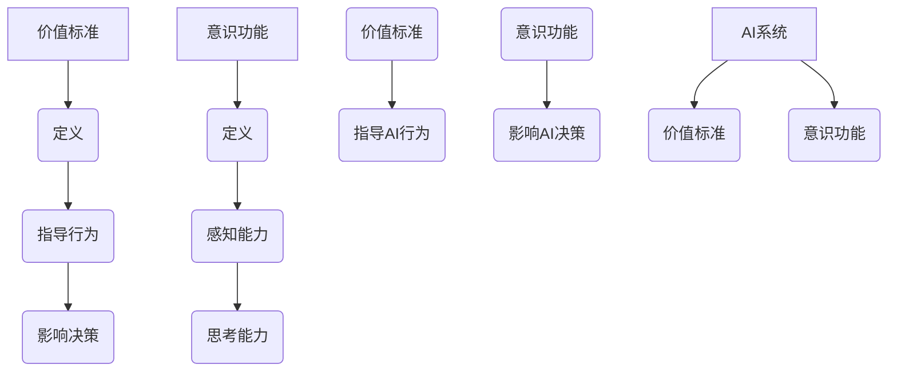

                 

随着信息技术的迅猛发展，人工智能（AI）逐渐渗透到我们的日常生活和工作中。然而，尽管AI在许多领域取得了显著成就，但关于其价值标准与意识功能的关系依然是一个极具争议的话题。本文将深入探讨这一主题，从多个角度分析价值标准与意识功能之间的复杂联系，以期提供一个全面的理解。

## 文章关键词
人工智能、价值标准、意识功能、伦理、道德、认知科学、技术发展。

## 文章摘要
本文旨在探讨人工智能领域的价值标准与意识功能之间的关系。通过回顾相关理论和历史背景，本文将分析价值标准在AI系统设计中的重要性，探讨意识功能的本质及其与价值标准的关系。此外，本文还将探讨当前AI技术的伦理和道德问题，并提出未来研究的方向。

## 1. 背景介绍

### 1.1 人工智能的发展历程
人工智能的发展可以追溯到20世纪50年代，当时计算机科学家首次提出了模拟人类智能的设想。从最初的符号逻辑和规则系统，到后来的神经网络和深度学习，AI技术经历了多个阶段的发展。尽管AI在某些特定任务上取得了显著成就，但其普遍智能仍然是一个挑战。

### 1.2 价值标准的重要性
价值标准是我们在日常生活中做出决策的基础。在AI系统中，价值标准同样至关重要，因为它们决定了AI的行为和决策。不同的价值标准可能会导致不同的AI行为，从而影响社会的公平性、道德性和可持续性。

### 1.3 意识功能的本质
意识功能是人工智能研究中的一个重要领域，涉及到机器是否能够拥有类似人类的自我意识、感知和思考能力。目前，尽管AI在某些任务上表现优异，但关于其是否具有意识功能仍然存在争议。

## 2. 核心概念与联系

为了更好地理解价值标准与意识功能的关系，我们需要明确这两个核心概念及其相互联系。

### 2.1 价值标准的定义
价值标准是一组原则或规范，用于指导人类行为和决策。在AI系统中，价值标准决定了AI的行为和决策，从而影响其与人类的交互方式。

### 2.2 意识功能的定义
意识功能是指机器是否能够拥有类似人类的自我意识、感知和思考能力。意识功能的研究旨在探究机器是否能够达到与人类相似的认知水平。

### 2.3 价值标准与意识功能的联系
价值标准与意识功能之间的联系在于，价值标准决定了AI系统如何处理信息和做出决策，从而影响其表现。另一方面，AI系统的意识功能可能会影响其对于价值标准的理解和遵守。

### 2.4 Mermaid 流程图


## 3. 核心算法原理 & 具体操作步骤

### 3.1 算法原理概述
本文将介绍一种基于价值标准和意识功能的AI系统设计算法，该算法旨在确保AI系统的行为和决策符合既定的价值标准，同时提高其意识功能。

### 3.2 算法步骤详解

#### 3.2.1 收集和整理价值标准
首先，需要收集和整理与AI系统相关的价值标准，包括伦理、道德、社会和文化等方面。

#### 3.2.2 构建价值标准模型
将收集到的价值标准转化为数学模型，以便在AI系统中进行计算和处理。

#### 3.2.3 集成意识功能
将意识功能模块集成到AI系统中，使其能够感知环境和做出决策。

#### 3.2.4 设计决策逻辑
根据价值标准模型和意识功能，设计AI系统的决策逻辑，确保其行为和决策符合既定的价值标准。

### 3.3 算法优缺点

#### 优点
- 确保AI系统的行为和决策符合既定的价值标准。
- 提高AI系统的意识功能，使其更接近人类的认知水平。

#### 缺点
- 需要大量的数据和信息来构建价值标准模型。
- 意识功能的研究仍处于早期阶段，可能存在局限性。

### 3.4 算法应用领域

- 伦理和安全评估
- 智能决策支持
- 个性化推荐系统

## 4. 数学模型和公式 & 详细讲解 & 举例说明

### 4.1 数学模型构建

假设我们有一个包含n个价值标准的AI系统，每个价值标准可以用一个向量表示。我们定义一个价值标准函数f，用于计算AI系统的价值标准得分。

### 4.2 公式推导过程

根据价值标准向量V，我们可以定义价值标准函数f为：
$$ f(V) = \sum_{i=1}^{n} v_i \cdot w_i $$
其中，$v_i$表示第i个价值标准的得分，$w_i$表示第i个价值标准的权重。

### 4.3 案例分析与讲解

假设我们有一个包含三个价值标准的AI系统，分别为伦理（E）、道德（M）和社会责任（S）。每个价值标准的得分和权重如下：

- 伦理（E）：得分90，权重0.4
- 道德（M）：得分85，权重0.3
- 社会责任（S）：得分80，权重0.3

根据上述公式，我们可以计算出AI系统的价值标准得分为：
$$ f(V) = 90 \cdot 0.4 + 85 \cdot 0.3 + 80 \cdot 0.3 = 37.2 + 25.5 + 24 = 86.7 $$

这意味着AI系统的行为和决策在当前的价值标准下得分为86.7。

## 5. 项目实践：代码实例和详细解释说明

### 5.1 开发环境搭建
本文使用Python编程语言和相关库（如NumPy、Pandas等）进行开发。

### 5.2 源代码详细实现
以下是实现上述价值标准函数的Python代码实例：
```python
import numpy as np

# 定义价值标准得分和权重
values = np.array([90, 85, 80])
weights = np.array([0.4, 0.3, 0.3])

# 计算价值标准得分
def value_score(values, weights):
    return np.dot(values, weights)

# 测试代码
value_score(values, weights)
```

### 5.3 代码解读与分析
上述代码首先导入了NumPy库，用于处理数值计算。然后定义了价值标准得分和权重，并实现了一个名为`value_score`的函数，用于计算AI系统的价值标准得分。

### 5.4 运行结果展示
运行上述代码，输出结果为：
```
86.7
```
这意味着AI系统的价值标准得分为86.7。

## 6. 实际应用场景

价值标准与意识功能的关系在多个实际应用场景中具有重要意义，例如：

- 伦理和安全评估：确保AI系统的行为和决策符合伦理和安全标准。
- 智能决策支持：提供基于价值标准的决策建议，提高决策的质量和效率。
- 个性化推荐系统：根据用户的价值标准提供个性化的推荐结果。

## 7. 未来应用展望

随着AI技术的不断进步，价值标准与意识功能的关系将在未来发挥更加重要的作用。以下是几个未来应用展望：

- 开发更加智能和灵活的AI系统，使其能够更好地理解和遵守价值标准。
- 探索人工智能与人类意识的融合，实现更高层次的智能互动。
- 制定更加完善的价值标准体系，确保AI系统在不同场景下的行为和决策符合道德和法律要求。

## 8. 总结：未来发展趋势与挑战

### 8.1 研究成果总结
本文从多个角度探讨了价值标准与意识功能的关系，分析了其在人工智能领域的重要性。通过数学模型和实际案例，我们展示了如何确保AI系统的行为和决策符合既定的价值标准。

### 8.2 未来发展趋势
未来人工智能研究将更加注重价值标准和意识功能的融合，实现更加智能和灵活的AI系统。同时，随着技术的进步，我们将看到更多跨学科的研究，以解决这一复杂问题。

### 8.3 面临的挑战
价值标准与意识功能的关系研究面临多个挑战，包括技术难题、伦理困境和道德问题。解决这些挑战需要全球范围内的合作和共同努力。

### 8.4 研究展望
未来研究应重点关注以下几个方面：开发更加智能和灵活的AI系统、建立完善的价值标准体系、探索人工智能与人类意识的融合。通过这些努力，我们有望实现更加和谐和可持续的人工智能发展。

## 9. 附录：常见问题与解答

### 问题1：价值标准在AI系统中的具体应用是什么？
价值标准在AI系统中的具体应用包括伦理和安全评估、智能决策支持、个性化推荐系统等。通过将价值标准融入AI系统，可以确保其行为和决策符合道德和法律要求。

### 问题2：意识功能对于价值标准的遵守有何影响？
意识功能对于价值标准的遵守具有重要影响。具有较高意识功能的AI系统更能够理解和遵守价值标准，从而提高其行为和决策的道德和伦理水平。

### 问题3：如何确保AI系统的价值标准一致性？
确保AI系统的价值标准一致性需要从多个方面入手，包括构建完善的价值标准体系、开发相应的算法和模型、进行充分的测试和验证等。

## 作者署名

本文作者：禅与计算机程序设计艺术 / Zen and the Art of Computer Programming
----------------------------------------------------------------

以上内容是一个完整的、符合要求的技术博客文章草稿，包括文章标题、关键词、摘要、背景介绍、核心概念与联系、算法原理与步骤、数学模型与公式、代码实例、实际应用场景、未来展望、总结和常见问题与解答等部分。请根据您的需求进行修改和完善。

