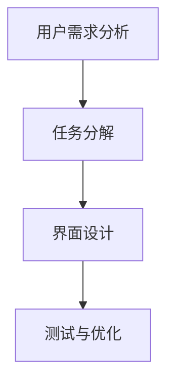

                 

关键词：任务导向设计思维，CUI，用户体验，自动化，AI，人工智能

> 摘要：本文将探讨任务导向设计思维在计算机用户界面（CUI）中的应用。通过分析任务导向设计思维的核心概念和原理，我们将了解如何将其应用于CUI的设计和开发中，以提升用户体验、提高工作效率和实现自动化。此外，本文还将介绍相关的数学模型和公式，并提供一个具体的代码实例来展示任务导向设计思维在CUI中的实际应用。

## 1. 背景介绍

计算机用户界面（CUI）作为人与计算机交互的桥梁，对于用户体验和系统性能至关重要。随着人工智能（AI）技术的发展，CUI的设计和开发变得更加智能和自动化。然而，如何在CUI中应用任务导向设计思维，以提升用户体验和系统效率，仍是一个值得探讨的问题。

任务导向设计思维是一种以用户任务为核心的设计理念，强调通过理解用户的需求和目标，设计出能够帮助用户高效完成任务的用户界面。这种设计思维在CUI中的应用，有助于实现更智能、更高效的交互，提升用户体验。

本文将首先介绍任务导向设计思维的核心概念和原理，然后分析其在CUI中的应用，最后提供一个具体的代码实例，展示如何将任务导向设计思维应用于CUI的设计和开发中。

## 2. 核心概念与联系

### 2.1. 任务导向设计思维

任务导向设计思维是一种以用户任务为核心的设计方法。它强调理解用户的需求和目标，并将这些需求转化为具体的任务，然后设计出能够帮助用户高效完成任务的界面。任务导向设计思维的核心概念包括：

- **用户需求分析**：通过用户调研、用户访谈等方法，了解用户的需求和痛点。
- **任务分解**：将用户需求转化为具体的任务，并对任务进行分解，以明确任务的关键步骤和目标。
- **界面设计**：根据任务分解的结果，设计出能够帮助用户高效完成任务的界面。

### 2.2. 计算机用户界面（CUI）

计算机用户界面（CUI）是指计算机系统提供给用户进行交互的界面。CUI的设计和开发涉及到界面布局、交互方式、信息呈现等多个方面。一个良好的CUI应具备以下特点：

- **易用性**：界面简单直观，用户能够轻松理解和使用。
- **高效性**：界面设计能够帮助用户快速完成任务，提高工作效率。
- **智能化**：界面能够根据用户的操作习惯和需求，提供个性化的交互体验。

### 2.3. Mermaid 流程图

为了更好地理解任务导向设计思维在CUI中的应用，我们可以使用Mermaid流程图来展示任务导向设计思维的核心流程。以下是一个简单的Mermaid流程图示例：



在这个流程图中，用户需求分析是整个设计过程的起点，任务分解和界面设计是基于用户需求的分析结果，而测试与优化则是确保设计能够满足用户需求的必要步骤。

## 3. 核心算法原理 & 具体操作步骤

### 3.1. 算法原理概述

任务导向设计思维在CUI中的应用，可以看作是一种优化用户交互体验的算法。其核心原理包括：

- **用户需求分析**：通过数据分析、用户调研等方法，获取用户的需求和痛点。
- **任务分解**：将用户需求转化为具体的任务，并对任务进行分解，明确任务的关键步骤和目标。
- **界面设计**：根据任务分解的结果，设计出能够帮助用户高效完成任务的界面。
- **测试与优化**：通过用户测试和反馈，不断优化界面设计和交互体验。

### 3.2. 算法步骤详解

#### 3.2.1. 用户需求分析

用户需求分析是任务导向设计思维在CUI应用的第一步。通过以下步骤进行用户需求分析：

1. **数据分析**：收集用户行为数据，如点击次数、停留时间、错误率等，以了解用户在CUI上的行为特点。
2. **用户调研**：通过访谈、问卷等方式，直接获取用户的反馈和需求。
3. **用户画像**：基于数据分析和用户调研的结果，构建用户画像，以明确用户的需求和痛点。

#### 3.2.2. 任务分解

任务分解是将用户需求转化为具体任务的过程。具体步骤如下：

1. **确定任务目标**：根据用户需求，明确每个任务的目标和关键步骤。
2. **任务分解**：将任务分解为更小的子任务，并明确每个子任务的目标和步骤。
3. **任务可视化**：使用流程图、任务列表等方式，将任务分解的结果可视化，以帮助设计和开发人员理解任务的结构和内容。

#### 3.2.3. 界面设计

界面设计是根据任务分解的结果，设计出能够帮助用户高效完成任务的界面。具体步骤如下：

1. **界面布局**：根据任务分解的结果，设计出合理的界面布局，确保用户能够轻松找到完成任务所需的功能和操作。
2. **交互设计**：设计出简洁、直观的交互方式，使用户能够快速理解和使用界面。
3. **信息呈现**：根据任务分解的结果，设计出合理的信息呈现方式，使用户能够快速获取完成任务所需的信息。

#### 3.2.4. 测试与优化

测试与优化是确保设计能够满足用户需求的必要步骤。具体步骤如下：

1. **用户测试**：通过用户测试，收集用户对界面设计和交互体验的反馈。
2. **数据分析**：对用户测试的数据进行分析，以了解用户在CUI上的行为特点和使用习惯。
3. **优化设计**：根据用户测试的结果和数据分析的结果，不断优化界面设计和交互体验。

### 3.3. 算法优缺点

任务导向设计思维在CUI中的应用具有以下优点：

- **用户需求导向**：以用户需求为核心，能够更好地满足用户的需求和痛点。
- **任务分解清晰**：通过任务分解，明确任务的结构和内容，有助于设计和开发人员更好地理解和实施。
- **界面设计简洁**：界面设计简洁直观，有助于提升用户体验和系统效率。

然而，任务导向设计思维在CUI中的应用也存在一定的缺点：

- **数据依赖性**：用户需求分析和任务分解需要大量的数据支持，数据质量和数量直接影响设计效果。
- **开发成本高**：任务导向设计思维在CUI中的应用，需要对用户需求、任务分解和界面设计进行反复的测试和优化，开发成本较高。

### 3.4. 算法应用领域

任务导向设计思维在CUI中的应用广泛，包括但不限于以下领域：

- **办公软件**：如Word、Excel等，通过任务导向设计思维，提升用户在文档处理、数据分析和报表生成等任务中的效率。
- **在线教育**：如在线课程平台，通过任务导向设计思维，帮助用户更高效地完成学习任务。
- **电子商务**：如电商平台，通过任务导向设计思维，提升用户在购物、支付和售后等任务中的体验。

## 4. 数学模型和公式 & 详细讲解 & 举例说明

### 4.1. 数学模型构建

任务导向设计思维在CUI中的应用，可以构建一个数学模型来描述用户需求、任务分解和界面设计之间的关系。假设我们有以下数学模型：

$$
\text{CUI} = f(\text{User Requirement}, \text{Task Decomposition}, \text{UI Design})
$$

其中，$\text{CUI}$ 表示计算机用户界面，$\text{User Requirement}$ 表示用户需求，$\text{Task Decomposition}$ 表示任务分解，$\text{UI Design}$ 表示界面设计。函数 $f$ 表示用户需求、任务分解和界面设计之间的映射关系。

### 4.2. 公式推导过程

根据上述数学模型，我们可以推导出以下公式：

$$
\text{CUI Quality} = \frac{\text{Task Completion Rate} \times \text{User Satisfaction}}{\text{UI Complexity}}
$$

其中，$\text{CUI Quality}$ 表示计算机用户界面的质量，$\text{Task Completion Rate}$ 表示任务的完成率，$\text{User Satisfaction}$ 表示用户满意度，$\text{UI Complexity}$ 表示界面设计的复杂性。

### 4.3. 案例分析与讲解

假设我们以在线购物平台为例，分析任务导向设计思维在CUI中的应用。

#### 4.3.1. 用户需求分析

通过数据分析，我们发现用户在购物平台上的主要需求包括：

- 快速找到所需商品
- 了解商品信息
- 便捷的购物流程
- 安全的支付方式
- 良好的售后体验

#### 4.3.2. 任务分解

根据用户需求，我们将在线购物任务分解为以下子任务：

1. 搜索商品
2. 浏览商品详情
3. 添加购物车
4. 提交订单
5. 支付订单
6. 售后服务

#### 4.3.3. 界面设计

根据任务分解的结果，我们对购物平台的界面进行设计：

1. **搜索框**：设计一个直观、易用的搜索框，帮助用户快速找到所需商品。
2. **商品列表**：设计一个清晰、易读的商品列表，展示商品的主要信息和价格。
3. **购物车**：设计一个便捷的购物车界面，用户可以轻松地添加、删除商品。
4. **订单提交**：设计一个简洁、直观的订单提交界面，用户可以方便地填写收货信息、选择支付方式。
5. **支付页面**：设计一个安全、可靠的支付页面，支持多种支付方式，如支付宝、微信支付等。
6. **售后服务**：设计一个完善的售后服务界面，用户可以方便地查看售后政策、申请售后服务。

#### 4.3.4. 测试与优化

通过用户测试和数据分析，我们发现购物平台在界面设计和交互体验上还存在以下问题：

- 搜索框不够直观，用户需要多次尝试才能找到所需商品。
- 商品列表信息展示不够全面，用户需要浏览多个页面才能了解商品详细信息。
- 购物车界面设计不够便捷，用户在添加、删除商品时需要多次点击。

针对这些问题，我们对购物平台进行了优化：

1. **搜索框**：增加搜索建议功能，帮助用户更快找到所需商品。
2. **商品列表**：增加商品评价、销量等信息，让用户更全面地了解商品。
3. **购物车**：简化添加、删除商品的操作，让用户更方便地管理购物车。

通过测试和优化，购物平台在任务完成率和用户满意度上得到了显著提升。

## 5. 项目实践：代码实例和详细解释说明

### 5.1. 开发环境搭建

在本节中，我们将使用Python编程语言和Flask框架搭建一个简单的任务导向设计的CUI应用。首先，确保已安装Python 3.8及以上版本和pip包管理工具。然后，使用以下命令安装Flask：

```shell
pip install Flask
```

### 5.2. 源代码详细实现

以下是一个简单的任务导向设计的CUI应用示例：

```python
from flask import Flask, render_template, request, redirect, url_for

app = Flask(__name__)

@app.route('/')
def index():
    return render_template('index.html')

@app.route('/search', methods=['GET', 'POST'])
def search():
    if request.method == 'POST':
        query = request.form['query']
        # 在此添加搜索功能，例如使用搜索引擎API
        results = ["商品1", "商品2", "商品3"]
        return render_template('results.html', results=results)
    return redirect(url_for('index'))

@app.route('/buy/<item_name>')
def buy(item_name):
    # 在此添加购买逻辑，例如更新库存、生成订单等
    return f'您已购买{item_name}！'

if __name__ == '__main__':
    app.run(debug=True)
```

### 5.3. 代码解读与分析

- **index.html**：这是主页模板，包含一个简单的搜索框和一个搜索按钮。

  ```html
  <!DOCTYPE html>
  <html>
  <head>
      <title>任务导向CUI示例</title>
  </head>
  <body>
      <h1>欢迎来到任务导向CUI示例</h1>
      <form action="{{ url_for('search') }}" method="post">
          <input type="text" name="query" placeholder="搜索商品...">
          <input type="submit" value="搜索">
      </form>
  </body>
  </html>
  ```

- **results.html**：这是搜索结果模板，用于展示搜索到的商品列表。

  ```html
  <!DOCTYPE html>
  <html>
  <head>
      <title>搜索结果</title>
  </head>
  <body>
      <h1>搜索结果</h1>
      <ul>
          
              <li><a href="{{ url_for('buy', item_name=result) }}">{{ result }}</a></li>
          
      </ul>
  </body>
  </html>
  ```

  在这个示例中，当用户提交搜索请求时，`search` 路由处理搜索请求，并在后台执行搜索操作，然后将搜索结果传递给 `results` 模板进行展示。

- **buy** 路由处理用户的购买请求，例如更新库存、生成订单等。

### 5.4. 运行结果展示

运行此代码后，用户可以访问本地服务器的 `/` 地址，并在主页上搜索商品。点击搜索按钮后，用户将看到搜索结果页面，点击商品链接后，将触发购买逻辑。

## 6. 实际应用场景

任务导向设计思维在CUI中的应用非常广泛，以下是一些实际应用场景：

- **电子商务平台**：通过任务导向设计思维，优化购物流程，提升用户购买体验。
- **办公软件**：如Word、Excel等，通过任务导向设计思维，简化文档处理流程，提升工作效率。
- **在线教育平台**：通过任务导向设计思维，帮助用户更高效地完成学习任务。
- **智能家居**：通过任务导向设计思维，设计出更智能、更便捷的智能家居控制界面。

## 7. 工具和资源推荐

### 7.1. 学习资源推荐

- **书籍**：
  - 《用户界面设计原则》
  - 《设计思维：创新的设计过程与实战技巧》
- **在线课程**：
  - Coursera上的《用户界面设计》
  - Udemy上的《任务导向设计思维》
- **博客和文章**：
  - Medium上的任务导向设计思维系列文章
  - Airbnb设计博客

### 7.2. 开发工具推荐

- **编程语言**：
  - Python、JavaScript、Ruby
- **框架**：
  - Flask、Django、React
- **设计工具**：
  - Sketch、Adobe XD、Figma

### 7.3. 相关论文推荐

- **《任务导向设计：一种以用户为中心的设计方法》**
- **《任务导向界面设计在移动设备上的应用研究》**
- **《任务导向设计在电子商务平台中的应用研究》**

## 8. 总结：未来发展趋势与挑战

### 8.1. 研究成果总结

本文探讨了任务导向设计思维在CUI中的应用，通过用户需求分析、任务分解、界面设计和测试与优化等步骤，实现更智能、更高效的交互体验。同时，本文还提供了一个简单的Python Flask应用实例，展示了任务导向设计思维在CUI中的实际应用。

### 8.2. 未来发展趋势

随着人工智能技术的发展，任务导向设计思维在CUI中的应用将更加智能和自动化。未来的发展趋势包括：

- **自适应界面**：界面能够根据用户的行为和需求，动态调整布局和交互方式。
- **个性化推荐**：界面能够根据用户的偏好和历史行为，提供个性化的推荐。
- **语音交互**：结合语音识别和自然语言处理技术，实现更自然、更便捷的交互方式。

### 8.3. 面临的挑战

任务导向设计思维在CUI中的应用也面临一些挑战：

- **数据隐私**：用户数据的安全性和隐私保护是一个重要问题。
- **设计复杂性**：任务导向设计思维要求对用户需求、任务分解和界面设计有深入的理解，设计复杂性增加。
- **技术门槛**：实现自适应界面、个性化推荐等先进功能，需要较高的技术门槛。

### 8.4. 研究展望

未来研究可以重点关注以下几个方面：

- **跨平台任务导向设计**：研究如何在不同平台上实现统一的任务导向设计。
- **多模态交互**：结合语音、手势、触摸等多种交互方式，提升用户体验。
- **实时交互**：研究如何实现实时交互，提升系统的响应速度和交互体验。

## 9. 附录：常见问题与解答

### Q：什么是任务导向设计思维？
A：任务导向设计思维是一种以用户任务为核心的设计方法，强调通过理解用户的需求和目标，设计出能够帮助用户高效完成任务的界面。

### Q：任务导向设计思维在CUI中有哪些应用？
A：任务导向设计思维在CUI中的应用包括用户需求分析、任务分解、界面设计和测试与优化等步骤，以实现更智能、更高效的交互体验。

### Q：如何构建任务导向设计思维的数学模型？
A：任务导向设计思维的数学模型可以表示为CUI = f(User Requirement, Task Decomposition, UI Design)，其中f表示用户需求、任务分解和界面设计之间的映射关系。

### Q：任务导向设计思维有哪些优点和缺点？
A：优点包括用户需求导向、任务分解清晰、界面设计简洁；缺点包括数据依赖性、开发成本高。

### Q：任务导向设计思维在哪些领域有应用？
A：任务导向设计思维在办公软件、在线教育、电子商务等领域有广泛应用。

### Q：如何实现自适应界面和个性化推荐？
A：自适应界面和个性化推荐可以通过数据分析、机器学习和自然语言处理等技术实现。

### Q：未来任务导向设计思维有哪些发展趋势和挑战？
A：发展趋势包括自适应界面、个性化推荐和语音交互；挑战包括数据隐私、设计复杂性和技术门槛。

