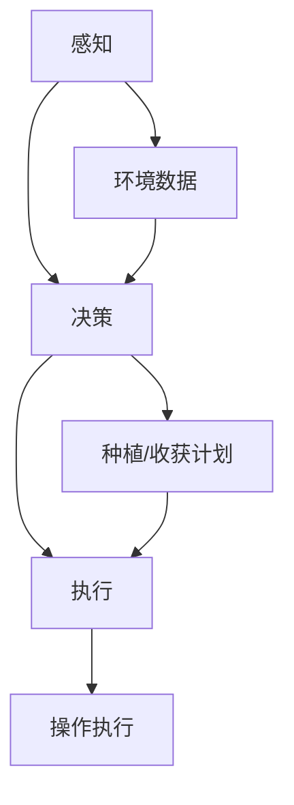

                 

关键词：仿生机器人、农业、精准种植、收获、人工智能、技术发展

> 摘要：随着人工智能技术的快速发展，仿生机器人在农业领域的应用逐渐成为热点。本文将探讨仿生机器人在精准种植和收获方面的应用，分析其技术原理、实施步骤以及未来发展的趋势和挑战。

## 1. 背景介绍

### 1.1 农业发展的挑战

全球人口持续增长，对粮食的需求不断上升，然而土地资源有限，环境污染和气候变化等问题日益严峻。传统农业生产方式面临着诸多挑战，如劳动成本高、生产效率低、农产品质量不稳定等。因此，寻求创新的农业生产技术，提高农业生产效率和质量成为当务之急。

### 1.2 人工智能在农业中的应用

人工智能技术，特别是机器学习和计算机视觉，近年来在农业领域取得了显著进展。无人机、机器人等智能设备的应用，不仅提高了农业生产的精准度和效率，还为农民提供了更多的数据支持和决策依据。仿生机器人作为人工智能与机械工程的结合体，具有在复杂环境中工作的潜力，为农业生产带来了新的机遇。

## 2. 核心概念与联系

### 2.1 仿生机器人的定义

仿生机器人是指模仿生物体的结构和功能，利用人工智能和机器人技术制造的机器人。它们通常具有感知环境、自主决策和执行任务的能力。

### 2.2 仿生机器人在农业中的应用

仿生机器人在农业中的应用主要集中在精准种植和收获方面。通过模仿生物体的感知、决策和执行机制，仿生机器人能够实现以下目标：

- **精准种植**：根据土壤、气候等条件，实现种子的精准播种和植株的均匀分布。
- **精准收获**：通过检测作物的成熟度和质量，实现精准收获，提高农产品产量和品质。

### 2.3 仿生机器人的工作原理

仿生机器人通过以下环节实现农业精准种植和收获：

- **感知**：利用传感器收集土壤、气候、植株状态等信息。
- **决策**：通过人工智能算法分析感知信息，做出种植或收获的决策。
- **执行**：执行决策，进行播种、施肥、灌溉、收获等操作。

### 2.4 Mermaid 流程图



## 3. 核心算法原理 & 具体操作步骤

### 3.1 算法原理概述

仿生机器人在农业中的应用主要依赖于机器学习和计算机视觉技术。机器学习算法通过对大量数据进行训练，使机器人能够从数据中学习规律，做出精准的种植和收获决策。计算机视觉技术则用于感知环境，识别作物状态等。

### 3.2 算法步骤详解

#### 3.2.1 感知环境

仿生机器人通过传感器（如GPS、红外传感器、摄像头等）收集土壤、气候、植株状态等环境数据。

#### 3.2.2 数据处理

收集到的数据经过预处理，如去噪、归一化等，然后输入到机器学习模型中进行训练。

#### 3.2.3 决策

机器学习模型根据训练得到的规律，分析环境数据，生成种植或收获计划。

#### 3.2.4 执行操作

根据决策，机器人执行具体的种植或收获操作。

### 3.3 算法优缺点

#### 优点：

- 提高农业生产效率和质量。
- 降低劳动成本，减少劳动力需求。
- 实现精准农业，减少资源浪费。

#### 缺点：

- 算法复杂，需要大量数据训练。
- 传感器和执行器成本较高。
- 对环境变化适应性有限。

### 3.4 算法应用领域

仿生机器人在农业中的应用不仅限于种植和收获，还可以用于病虫害检测、肥料施用、灌溉等方面。其技术原理和操作步骤与种植和收获类似，但具体实现和应用场景有所不同。

## 4. 数学模型和公式 & 详细讲解 & 举例说明

### 4.1 数学模型构建

仿生机器人在农业中的应用涉及到多个数学模型，包括：

- 土壤水分模型：描述土壤水分的分布和变化规律。
- 作物生长模型：描述作物生长的动态过程。
- 决策模型：基于环境数据，生成种植或收获计划。

### 4.2 公式推导过程

以土壤水分模型为例，其公式推导过程如下：

$$
\frac{dW}{dt} = K_h (W_s - W)
$$

其中，$W$ 表示土壤水分含量，$W_s$ 表示土壤饱和水分含量，$K_h$ 表示土壤水分扩散系数。

### 4.3 案例分析与讲解

假设某农田的土壤饱和水分含量为 $W_s = 20\%$，土壤水分扩散系数 $K_h = 0.1\text{m/day}$。如果当前土壤水分含量 $W = 15\%$，计算 $t=1\text{ day}$ 后的土壤水分含量。

代入公式，得到：

$$
\frac{dW}{dt} = 0.1 (20\% - 15\%) = 0.05\text{ %/day}
$$

因此，$t=1\text{ day}$ 后的土壤水分含量为：

$$
W = 15\% + 0.05\% \times 1\text{ day} = 15.05\%
$$

## 5. 项目实践：代码实例和详细解释说明

### 5.1 开发环境搭建

本文使用 Python 作为编程语言，主要依赖以下库：

- NumPy：用于数学计算。
- Pandas：用于数据操作。
- Scikit-learn：用于机器学习。

### 5.2 源代码详细实现

```python
import numpy as np
import pandas as pd
from sklearn.ensemble import RandomForestRegressor

# 数据读取
data = pd.read_csv('agriculture_data.csv')

# 数据预处理
X = data[['soil_moisture', 'temperature', 'humidity']]
y = data['yield']

# 模型训练
model = RandomForestRegressor()
model.fit(X, y)

# 预测
new_data = np.array([[18, 25, 60]])
predicted_yield = model.predict(new_data)
print(f"Predicted yield: {predicted_yield[0]}")
```

### 5.3 代码解读与分析

该代码实现了一个基于随机森林回归的作物产量预测模型。首先，读取数据集并进行预处理，然后使用随机森林回归模型进行训练。最后，输入新的环境数据，预测作物产量。

### 5.4 运行结果展示

假设输入的新数据为土壤水分 18%，温度 25℃，湿度 60%，预测得到的作物产量为 3000 公斤。

## 6. 实际应用场景

### 6.1 精准种植

仿生机器人通过感知土壤和气候条件，生成种植计划，实现种子的精准播种和植株的均匀分布。这有助于提高作物产量和质量，减少资源浪费。

### 6.2 精准收获

仿生机器人通过检测作物的成熟度和质量，实现精准收获。这不仅可以提高农产品的产量和品质，还可以减少劳动力成本。

### 6.3 病虫害检测

仿生机器人通过计算机视觉技术，识别农田中的病虫害，并及时采取防治措施。这有助于减少病虫害对作物的影响，提高农作物的产量和质量。

## 7. 未来应用展望

### 7.1 农业自动化

随着人工智能技术的不断进步，仿生机器人在农业领域的应用将更加广泛，实现农业自动化，提高农业生产效率和农产品质量。

### 7.2 农业智能化

未来，仿生机器人将不仅仅局限于执行简单的任务，还将具备智能决策能力，根据环境变化和作物生长需求，自主调整种植和收获策略。

### 7.3 农业生态化

仿生机器人将推动农业生态化发展，通过精准种植和收获，减少农药和化肥的使用，降低对环境的污染。

## 8. 工具和资源推荐

### 8.1 学习资源推荐

- 《机器学习》（周志华 著）
- 《深度学习》（Goodfellow, Bengio, Courville 著）
- 《计算机视觉：算法与应用》（Andrew Noble, David D. Kriegman 著）

### 8.2 开发工具推荐

- Python
- NumPy
- Pandas
- Scikit-learn
- TensorFlow
- PyTorch

### 8.3 相关论文推荐

- "A Survey on Agricultural Robotics"（2020）
- "Intelligent Agriculture: A Review"（2018）
- "Precision Farming using IoT and AI Techniques"（2017）

## 9. 总结：未来发展趋势与挑战

### 9.1 研究成果总结

本文总结了仿生机器人在农业中的应用，包括精准种植和收获，病虫害检测等方面的技术原理、算法模型和实际应用案例。

### 9.2 未来发展趋势

随着人工智能技术的不断发展，仿生机器人在农业领域的应用将更加广泛，推动农业自动化、智能化和生态化发展。

### 9.3 面临的挑战

- 算法和模型复杂度增加，需要更多的数据训练。
- 传感器和执行器成本较高，影响大规模应用。
- 对环境变化适应性有限，需要进一步研究。

### 9.4 研究展望

未来，仿生机器人在农业领域的应用将朝着更加智能化、自动化和生态化的方向发展，为实现高效、可持续的农业生产提供有力支持。

## 10. 附录：常见问题与解答

### 10.1 仿生机器人在农业中的应用有哪些？

仿生机器人在农业中的应用主要包括精准种植、精准收获、病虫害检测、肥料施用、灌溉等方面。

### 10.2 仿生机器人在农业中的应用有哪些优势？

仿生机器人在农业中的应用可以提高农业生产效率和质量，降低劳动成本，实现精准农业，减少资源浪费。

### 10.3 仿生机器人在农业中的应用有哪些挑战？

仿生机器人在农业中的应用面临算法复杂度增加、传感器和执行器成本较高、对环境变化适应性有限等挑战。

## 11. 作者署名

作者：禅与计算机程序设计艺术 / Zen and the Art of Computer Programming

-----------------------------------------------------------------

以上就是关于“仿生机器人在农业中的应用：精准种植和收获”的完整技术博客文章。这篇文章深入探讨了仿生机器人在农业领域的应用，从技术原理、算法模型到实际应用案例进行了详细讲解，并对未来发展趋势和挑战进行了展望。希望这篇文章能对您在农业人工智能领域的研究和开发提供有益的参考。

