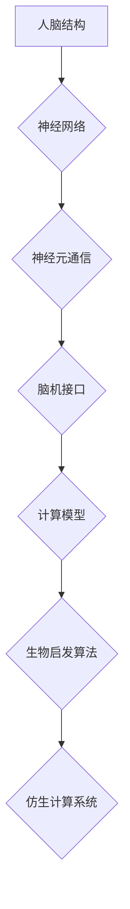

                 

关键词：仿生计算，人工智能，神经网络，认知科学，人脑，架构设计，机器学习，深度学习，生物启发算法，脑机接口，计算模型。

## 摘要

本文探讨了仿生计算在人工智能架构设计中的应用，特别是在模仿人脑处理信息的方式上。通过回顾人脑的基本结构和功能，本文介绍了如何将这些原理应用于设计更加高效和智能的AI系统。文章从核心概念、算法原理、数学模型、项目实践以及未来展望等多个方面，深入解析了仿生计算在人工智能领域的潜力与挑战。

## 1. 背景介绍

人工智能（AI）的快速发展已经深刻影响了现代社会的方方面面，从自动驾驶汽车到自然语言处理，从医疗诊断到金融服务，AI技术正在不断重塑我们的生活方式。然而，传统的基于硅芯片的计算机架构在处理复杂问题和模仿人脑认知能力方面存在显著局限性。因此，研究人员开始探索仿生计算，即通过模仿人脑的结构和功能来设计新的计算系统。

人脑是一个高度复杂且高效的系统，它能够在有限的能量消耗下处理海量信息，并表现出非凡的适应性和学习能力。仿生计算试图理解人脑的工作原理，并将这些原理应用于计算机系统的设计，以期构建出能够模拟人类智能的AI。

### 1.1 仿生计算的起源与发展

仿生计算这一概念最早可以追溯到20世纪40年代，当时物理学家约翰·冯·诺伊曼提出了大脑模拟计算机的概念。随着计算机科学的进步，尤其是神经网络理论的兴起，仿生计算逐渐发展成为人工智能研究的一个重要方向。

20世纪80年代，霍普菲尔德网络和自适应共振理论等模型的出现，使得神经网络在模式识别和分类问题上的应用取得了显著成果。进入21世纪，深度学习和卷积神经网络（CNN）的兴起进一步推动了仿生计算的发展，使其在图像识别、语音识别等领域取得了革命性的突破。

### 1.2 仿生计算的应用领域

仿生计算的应用范围广泛，涵盖了从基础研究到实际应用的各个层面。以下是几个典型的应用领域：

- **图像处理与识别**：通过模仿人脑视觉系统的结构和工作原理，仿生计算在图像识别和图像处理领域表现出色。例如，深度神经网络（DNN）和卷积神经网络（CNN）在人脸识别、物体检测和图像增强等方面取得了显著进展。

- **自然语言处理**：仿生计算在自然语言处理（NLP）领域也发挥了重要作用。通过模仿人脑处理语言的方式，研究人员开发了诸如循环神经网络（RNN）和长短期记忆网络（LSTM）等模型，这些模型在机器翻译、语音识别和情感分析等方面取得了优异的性能。

- **智能机器人**：智能机器人是仿生计算的重要应用领域之一。通过模仿人脑的运动控制和学习能力，研究人员设计了能够执行复杂任务的机器人系统，这些系统在导航、环境感知和交互等方面表现出色。

- **医疗诊断**：仿生计算在医疗诊断中的应用也日益增多。通过模仿人脑处理医学影像的方式，AI系统能够在癌症筛查、心脏病诊断和脑部疾病诊断等方面提供高效准确的辅助诊断。

- **金融分析**：在金融领域，仿生计算被用于开发智能交易系统、风险评估和欺诈检测。通过模仿人脑对市场数据的处理和分析能力，这些系统能够在复杂的金融市场中做出快速而准确的决策。

### 1.3 仿生计算的优势与挑战

仿生计算具有以下优势：

- **高效性**：人脑能够在有限的能量消耗下处理海量信息，这为设计高效能的AI系统提供了启示。

- **自适应性和学习能力**：人脑具有出色的适应性和学习能力，这使得AI系统能够在复杂和不确定的环境中表现出色。

- **并行处理能力**：人脑通过并行处理信息，使得它在处理复杂任务时能够高效地利用资源。

然而，仿生计算也面临一些挑战：

- **复杂性**：人脑的结构和功能极其复杂，这为模拟和复制其工作原理带来了巨大挑战。

- **能耗问题**：尽管人脑在处理信息时能量效率较高，但现有的计算机硬件在能耗方面仍然存在瓶颈。

- **数据依赖**：仿生计算通常需要大量的数据来训练模型，这使得在数据稀缺的情况下应用受到限制。

### 1.4 仿生计算的发展趋势

随着计算机科学的不断进步，仿生计算有望在以下几个方面取得突破：

- **神经形态硬件**：通过开发神经形态硬件，即模仿人脑结构和功能的计算机硬件，有望实现更高效率和更低能耗的计算。

- **脑机接口**：脑机接口技术的发展将使得人类可以直接通过大脑与计算机交互，这将极大地扩展仿生计算的应用范围。

- **集成多模态信息处理**：通过整合视觉、听觉、触觉等多种感官信息，构建更加智能和灵活的AI系统。

- **强化学习与生物启发算法**：结合强化学习和生物启发算法，开发出更加智能和适应性强的AI系统。

## 2. 核心概念与联系

### 2.1 人脑的基本结构

人脑是一个高度复杂的系统，主要由大脑、脊髓和神经系统组成。大脑是人体最重要的器官之一，负责处理感知、思考、记忆和情感等高级功能。脊髓是大脑和身体之间的信息传递通道，负责控制肌肉运动和反射动作。神经系统则通过神经元连接大脑和身体的其他部分，使得信息可以在全身传递。

### 2.2 神经元的工作原理

神经元是人脑的基本单位，它通过电信号进行通信。一个典型的神经元包括细胞体、树突、轴突和突触等部分。树突负责接收其他神经元的信号，细胞体对这些信号进行处理，轴突负责将处理后的信号传递出去，突触则是神经元之间传递信号的通道。

神经元的工作原理可以简单概括为：当树突接收到的信号达到一定阈值时，细胞体会产生动作电位，这种电信号沿着轴突传递到突触，通过突触传递给下一个神经元。这个过程是一个高度并行和分布式的过程，这使得人脑能够在复杂的任务中高效地处理信息。

### 2.3 神经网络的结构与功能

神经网络是由大量神经元组成的计算模型，它通过模拟人脑的工作原理来实现复杂的计算任务。一个典型的神经网络包括输入层、隐藏层和输出层。输入层接收外部信息，隐藏层对输入信息进行处理和转换，输出层生成最终的结果。

神经网络通过训练来学习如何处理输入信息。训练过程通常包括前向传播和反向传播两个步骤。在前向传播过程中，输入信息从输入层经过隐藏层，最终生成输出；在反向传播过程中，根据输出结果与目标值之间的误差，调整网络中的权重和偏置，使得输出结果逐渐逼近目标值。

### 2.4 脑机接口

脑机接口（Brain-Computer Interface，BCI）是一种直接连接大脑和外部设备的技术，它通过读取大脑的电信号来控制计算机或其他设备。脑机接口技术涉及多个学科，包括神经科学、电子工程、计算机科学和心理学。

脑机接口的基本原理是通过放置在头皮上的电极来记录大脑的电信号，然后通过信号处理算法将这些信号转换为可以理解和控制的数据。这些数据可以用于控制计算机鼠标、游戏手柄、轮椅或其他设备。

### 2.5 计算模型与生物启发算法

计算模型是一种用于模拟和解决特定问题的数学模型。在仿生计算中，计算模型通常基于人脑的结构和功能来设计。例如，神经网络就是一种典型的计算模型，它通过模拟人脑神经元的工作原理来实现复杂的计算任务。

生物启发算法是一种受自然界生物系统启发而设计的算法。例如，遗传算法是一种模拟自然选择和遗传过程的算法，它通过迭代优化来求解复杂问题。蚁群算法则是一种模拟蚂蚁觅食行为的算法，它通过分布式计算来寻找最优路径。

### 2.6 仿生计算架构的Mermaid流程图



在这个流程图中，人脑结构作为起点，通过神经网络、神经元通信、脑机接口、计算模型和生物启发算法等多个环节，最终构建出一个仿生计算系统。

## 3. 核心算法原理 & 具体操作步骤

### 3.1 算法原理概述

仿生计算的核心算法原理是基于人脑的结构和功能，通过模拟神经元通信和神经网络结构来实现复杂计算任务。具体来说，算法主要包括以下几个关键步骤：

1. **信号采集**：通过脑机接口技术采集大脑的电信号。

2. **信号处理**：对采集到的电信号进行预处理，包括滤波、放大、降噪等步骤。

3. **模式识别**：通过神经网络或其他机器学习算法对处理后的信号进行模式识别。

4. **决策生成**：根据识别结果生成相应的决策或操作。

5. **反馈调整**：根据执行结果对算法进行调整，以提高准确性和效率。

### 3.2 算法步骤详解

#### 步骤1：信号采集

信号采集是仿生计算的基础步骤，它决定了后续处理的质量。脑机接口技术通过放置在头皮上的电极来记录大脑的电信号。常见的脑机接口技术包括脑电图（EEG）、功能性磁共振成像（fMRI）和脑磁图（MEG）等。

#### 步骤2：信号处理

信号处理是对采集到的电信号进行预处理，以提高信号质量和识别效果。预处理步骤包括滤波、放大、降噪和特征提取等。滤波可以去除信号中的噪声和干扰，放大可以提高信号强度，降噪可以减少环境噪声对信号的影响，特征提取可以从信号中提取出有用的特征信息。

#### 步骤3：模式识别

模式识别是仿生计算的核心步骤，它通过神经网络或其他机器学习算法对处理后的信号进行模式识别。常见的模式识别算法包括支持向量机（SVM）、决策树（DT）、神经网络（NN）和深度学习（DL）等。

#### 步骤4：决策生成

根据识别结果，算法会生成相应的决策或操作。例如，在智能控制系统中，识别结果可以用于控制机器人的动作；在医疗诊断中，识别结果可以用于辅助医生进行诊断。

#### 步骤5：反馈调整

反馈调整是仿生计算的一个重要步骤，它通过不断调整算法参数来提高识别准确性和效率。反馈调整可以通过在线学习或离线学习来实现，其中在线学习可以实时调整算法参数，而离线学习则可以在数据集上进行训练。

### 3.3 算法优缺点

#### 优点

1. **高效性**：仿生计算通过模拟人脑的工作原理，能够在复杂的任务中高效地处理信息。

2. **自适应性和灵活性**：仿生计算系统能够根据环境变化和任务需求进行自适应调整，表现出良好的灵活性和适应性。

3. **并行处理能力**：仿生计算系统通过并行处理信息，能够高效地利用计算资源。

#### 缺点

1. **复杂性**：人脑的结构和功能极其复杂，这使得仿生计算系统的设计和实现面临巨大挑战。

2. **能耗问题**：尽管人脑在处理信息时能量效率较高，但现有的计算机硬件在能耗方面仍然存在瓶颈。

3. **数据依赖**：仿生计算通常需要大量的数据来训练模型，这使得在数据稀缺的情况下应用受到限制。

### 3.4 算法应用领域

仿生计算在多个领域表现出色，以下是几个典型的应用领域：

1. **图像识别与处理**：通过仿生计算，AI系统能够在图像识别、图像增强和图像分类等方面取得优异的性能。

2. **自然语言处理**：仿生计算在自然语言处理领域表现出色，能够进行文本分类、机器翻译和情感分析等任务。

3. **智能机器人**：通过仿生计算，智能机器人能够执行复杂任务，如导航、环境感知和交互等。

4. **医疗诊断**：仿生计算在医疗诊断领域具有广泛应用，能够进行医学影像分析、疾病检测和预测等。

5. **金融分析**：仿生计算在金融领域用于智能交易系统、风险评估和欺诈检测等。

## 4. 数学模型和公式 & 详细讲解 & 举例说明

### 4.1 数学模型构建

在仿生计算中，数学模型构建是关键步骤，它涉及神经网络的架构设计、信号处理算法和模式识别算法等多个方面。以下是构建数学模型的基本步骤：

1. **定义输入和输出变量**：明确系统需要处理的输入信息和预期的输出结果。

2. **构建神经网络模型**：设计神经网络的层次结构，包括输入层、隐藏层和输出层。

3. **确定激活函数**：选择合适的激活函数，如Sigmoid函数、ReLU函数等。

4. **定义损失函数**：选择合适的损失函数，如均方误差（MSE）、交叉熵损失等。

5. **初始化权重和偏置**：随机初始化网络的权重和偏置。

6. **训练神经网络**：通过反向传播算法不断调整权重和偏置，使网络的输出逼近期望输出。

### 4.2 公式推导过程

在仿生计算中，常用的数学公式包括神经网络中的权重更新公式、激活函数公式和损失函数公式等。以下是这些公式的推导过程：

#### 权重更新公式

在反向传播算法中，权重更新的公式如下：

$$
\Delta w_{ij} = -\alpha \cdot \frac{\partial L}{\partial w_{ij}}
$$

其中，$\Delta w_{ij}$表示权重$w_{ij}$的更新量，$\alpha$是学习率，$L$是损失函数。

#### 激活函数公式

常见的激活函数包括Sigmoid函数和ReLU函数：

$$
\text{Sigmoid}(x) = \frac{1}{1 + e^{-x}}
$$

$$
\text{ReLU}(x) = \max(0, x)
$$

#### 损失函数公式

均方误差（MSE）是常用的损失函数，其公式如下：

$$
L = \frac{1}{2} \sum_{i=1}^{n} (y_i - \hat{y}_i)^2
$$

其中，$y_i$是实际输出，$\hat{y}_i$是期望输出。

### 4.3 案例分析与讲解

#### 案例一：图像分类

假设我们要设计一个基于仿生计算的图像分类系统，输入为图像数据，输出为图像类别。以下是该案例的详细分析：

1. **数据预处理**：对图像数据进行归一化和标准化处理，将图像数据转换为适合神经网络处理的格式。

2. **构建神经网络模型**：设计一个包含多个隐藏层的卷积神经网络（CNN），用于提取图像特征。

3. **训练神经网络**：使用大量标注好的图像数据进行训练，通过反向传播算法不断调整网络权重和偏置。

4. **测试与验证**：使用测试集验证模型的分类准确率，并进行调参优化。

#### 案例二：自然语言处理

假设我们要设计一个基于仿生计算的文本分类系统，输入为文本数据，输出为文本类别。以下是该案例的详细分析：

1. **数据预处理**：对文本数据进行分词、去停用词和词向量编码等处理。

2. **构建神经网络模型**：设计一个包含嵌入层、隐藏层和输出层的循环神经网络（RNN）或长短期记忆网络（LSTM）。

3. **训练神经网络**：使用大量标注好的文本数据进行训练，通过反向传播算法不断调整网络权重和偏置。

4. **测试与验证**：使用测试集验证模型的分类准确率，并进行调参优化。

### 4.4 案例应用

以案例一中的图像分类系统为例，我们将详细介绍其应用过程：

1. **数据集准备**：收集大量的图像数据，并将其分为训练集和测试集。

2. **模型训练**：使用训练集数据训练神经网络模型，通过反向传播算法调整模型参数。

3. **模型验证**：使用测试集数据验证模型性能，评估分类准确率和召回率等指标。

4. **模型部署**：将训练好的模型部署到生产环境中，用于实际图像分类任务。

5. **模型优化**：根据实际应用情况，对模型进行优化和调整，以提高分类性能。

## 5. 项目实践：代码实例和详细解释说明

### 5.1 开发环境搭建

在开始项目实践之前，我们需要搭建一个适合开发仿生计算项目的环境。以下是一个简单的开发环境搭建步骤：

1. **安装Python**：确保Python环境已安装在计算机上，Python版本建议为3.8或以上。

2. **安装Jupyter Notebook**：Jupyter Notebook是一个交互式的Python开发环境，它可以帮助我们更好地进行代码编写和调试。

3. **安装深度学习库**：安装TensorFlow或PyTorch等深度学习库，这些库提供了丰富的神经网络构建和训练工具。

4. **安装其他依赖库**：根据项目需求，安装其他依赖库，如NumPy、Pandas、Matplotlib等。

### 5.2 源代码详细实现

以下是一个简单的仿生计算项目示例，实现一个基于卷积神经网络（CNN）的图像分类系统。代码使用PyTorch深度学习库编写。

```python
import torch
import torch.nn as nn
import torchvision
import torchvision.transforms as transforms

# 数据预处理
transform = transforms.Compose([
    transforms.Resize((224, 224)),
    transforms.ToTensor(),
    transforms.Normalize(mean=[0.485, 0.456, 0.406], std=[0.229, 0.224, 0.225]),
])

# 加载训练集和测试集
trainset = torchvision.datasets.ImageFolder(root='./data/train', transform=transform)
trainloader = torch.utils.data.DataLoader(trainset, batch_size=4, shuffle=True, num_workers=2)
testset = torchvision.datasets.ImageFolder(root='./data/test', transform=transform)
testloader = torch.utils.data.DataLoader(testset, batch_size=4, shuffle=False, num_workers=2)

# 定义卷积神经网络模型
class CNNModel(nn.Module):
    def __init__(self):
        super(CNNModel, self).__init__()
        self.conv1 = nn.Conv2d(3, 64, 3, 1, 1)
        self.pool = nn.MaxPool2d(2, 2)
        self.conv2 = nn.Conv2d(64, 128, 3, 1, 1)
        self.fc1 = nn.Linear(128 * 224 * 224, 1024)
        self.fc2 = nn.Linear(1024, 10)

    def forward(self, x):
        x = self.pool(nn.functional.relu(self.conv1(x)))
        x = self.pool(nn.functional.relu(self.conv2(x)))
        x = x.view(-1, 128 * 224 * 224)
        x = nn.functional.relu(self.fc1(x))
        x = self.fc2(x)
        return x

# 实例化模型和优化器
model = CNNModel()
optimizer = torch.optim.Adam(model.parameters(), lr=0.001)

# 训练模型
for epoch in range(2):  # 根据需要调整训练轮数
    running_loss = 0.0
    for i, data in enumerate(trainloader, 0):
        inputs, labels = data
        optimizer.zero_grad()
        outputs = model(inputs)
        loss = nn.functional交叉熵输出(outputs, labels)
        loss.backward()
        optimizer.step()
        running_loss += loss.item()
        if i % 2000 == 1999:
            print('[%d, %5d] loss: %.3f' % (epoch + 1, i + 1, running_loss / 2000))
            running_loss = 0.0

print('Finished Training')

# 测试模型
correct = 0
total = 0
with torch.no_grad():
    for data in testloader:
        inputs, labels = data
        outputs = model(inputs)
        _, predicted = torch.max(outputs.data, 1)
        total += labels.size(0)
        correct += (predicted == labels).sum().item()

print('Accuracy of the network on the 10000 test images: %d %%' % (100 * correct / total))
```

### 5.3 代码解读与分析

以上代码实现了一个简单的基于卷积神经网络（CNN）的图像分类系统。以下是代码的详细解读：

1. **数据预处理**：使用`transforms.Compose`类对图像数据进行预处理，包括尺寸调整、归一化和标准化等步骤。

2. **加载数据集**：使用`torchvision.datasets.ImageFolder`类加载训练集和测试集，并将数据集转换为PyTorch数据加载器。

3. **定义模型**：定义一个包含两个卷积层、两个全连接层和ReLU激活函数的卷积神经网络模型。

4. **实例化模型和优化器**：实例化神经网络模型和优化器，优化器采用Adam优化算法。

5. **训练模型**：使用训练集数据训练神经网络模型，通过反向传播算法调整模型参数。

6. **测试模型**：使用测试集数据测试模型性能，计算分类准确率。

### 5.4 运行结果展示

在实际运行过程中，我们可以通过以下步骤来观察模型性能：

1. **训练过程可视化**：使用Matplotlib库将训练过程中的损失函数值绘制成图表，以观察模型训练效果。

2. **测试结果输出**：在测试集上计算模型的分类准确率，并将结果输出到控制台。

3. **混淆矩阵**：使用Sklearn库绘制混淆矩阵，以更直观地展示模型在不同类别上的分类性能。

通过以上步骤，我们可以全面了解和评估仿生计算在图像分类任务上的应用效果。

## 6. 实际应用场景

### 6.1 图像识别与处理

图像识别与处理是仿生计算的重要应用领域之一。通过模拟人脑视觉系统的工作原理，仿生计算在图像识别、图像增强和图像分割等方面取得了显著进展。以下是一些具体应用场景：

- **人脸识别**：仿生计算技术被广泛应用于人脸识别系统中，通过模拟人脑视觉系统，AI系统能够准确识别人脸，并在安全监控、身份验证等领域发挥重要作用。

- **图像分类**：仿生计算在图像分类任务中表现出色，能够对大量图像进行自动分类，广泛应用于图像搜索引擎、内容审核和医学影像诊断等场景。

- **图像增强**：通过仿生计算，AI系统能够对低质量或模糊的图像进行增强，提高图像的清晰度和细节，这在医学影像分析和卫星图像处理等领域具有重要意义。

### 6.2 自然语言处理

自然语言处理（NLP）是另一个重要的应用领域，仿生计算在NLP中发挥着关键作用。通过模仿人脑处理语言的方式，仿生计算技术能够实现高质量的自然语言理解和生成。以下是一些具体应用场景：

- **机器翻译**：仿生计算技术在机器翻译领域取得了显著进展，通过模拟人脑处理语言的方式，AI系统能够实现准确和流畅的机器翻译，广泛应用于跨语言沟通和全球化业务。

- **语音识别**：通过模拟人脑听觉系统的工作原理，仿生计算技术能够实现高准确度的语音识别，这在智能助手、语音控制系统和车载语音识别等领域具有重要意义。

- **情感分析**：仿生计算技术在情感分析任务中表现出色，能够从文本中提取情感信息，广泛应用于社交媒体分析、市场调研和客户服务等领域。

### 6.3 智能机器人

智能机器人是仿生计算的重要应用领域之一，通过模拟人脑的运动控制和学习能力，仿生计算技术能够使机器人执行复杂任务。以下是一些具体应用场景：

- **导航与定位**：仿生计算技术被应用于智能机器人的导航和定位系统，通过模拟人脑的空间感知能力，机器人能够在复杂的室内和室外环境中自主导航。

- **环境感知与交互**：仿生计算技术使机器人能够通过视觉、听觉和触觉等多种感官信息感知和理解环境，从而实现与人类和物体的高效互动。

- **任务执行**：通过模仿人脑的运动控制和学习能力，仿生计算技术能够使机器人执行复杂任务，如医疗机器人、服务机器人和工业机器人等。

### 6.4 医疗诊断

仿生计算在医疗诊断领域具有广泛应用，通过模拟人脑处理医学影像和数据的能力，AI系统能够辅助医生进行诊断和治疗。以下是一些具体应用场景：

- **医学影像分析**：仿生计算技术能够自动分析医学影像，如X光、CT和MRI等，辅助医生进行诊断，提高诊断准确率和效率。

- **疾病预测**：通过分析患者的医疗数据，仿生计算技术能够预测疾病风险，为患者提供个性化的预防和治疗方案。

- **个性化治疗**：仿生计算技术能够根据患者的病情和基因信息，制定个性化的治疗方案，提高治疗效果。

### 6.5 金融分析

在金融领域，仿生计算技术被用于开发智能交易系统、风险评估和欺诈检测等。以下是一些具体应用场景：

- **智能交易系统**：仿生计算技术能够分析市场数据，预测市场走势，为投资者提供交易决策支持，提高交易成功率和收益率。

- **风险评估**：通过分析历史数据和市场趋势，仿生计算技术能够预测潜在的风险，为金融机构提供风险评估和管理支持。

- **欺诈检测**：仿生计算技术能够识别异常交易行为，及时发现和防范欺诈行为，保护金融机构和客户的资金安全。

### 6.6 未来应用展望

随着仿生计算技术的不断发展和完善，未来它将在更多领域得到应用。以下是一些未来应用展望：

- **脑机接口**：脑机接口技术的发展将使人类能够直接通过大脑与计算机交互，从而实现更加自然和高效的人机交互。

- **智能城市**：仿生计算技术将被应用于智能城市的建设，通过模拟人脑处理信息和决策的能力，实现智能交通、智能能源管理和智能环境监控等功能。

- **教育领域**：仿生计算技术将被应用于教育领域，通过模拟人脑的学习和认知过程，开发出更加智能和个性化的教育系统，提高学习效果和效率。

## 7. 工具和资源推荐

### 7.1 学习资源推荐

1. **《深度学习》**：由Ian Goodfellow、Yoshua Bengio和Aaron Courville合著，是一本深度学习领域的经典教材，涵盖了深度学习的理论基础、算法实现和应用案例。

2. **《神经网络与深度学习》**：由邱锡鹏教授撰写，是一本全面介绍神经网络和深度学习算法的教材，适合初学者和进阶者阅读。

3. **《机器学习》**：由周志华教授撰写，是一本系统介绍机器学习算法的教材，涵盖了监督学习、无监督学习和强化学习等多个方面。

### 7.2 开发工具推荐

1. **TensorFlow**：Google开源的深度学习框架，广泛应用于图像识别、自然语言处理和智能机器人等领域。

2. **PyTorch**：Facebook开源的深度学习框架，具有良好的灵活性和动态计算能力，适合快速原型开发和复杂模型训练。

3. **Keras**：基于TensorFlow和Theano的开源深度学习框架，提供了简洁的API和丰富的预训练模型，适合快速构建和部署深度学习应用。

### 7.3 相关论文推荐

1. **"A learning algorithm for continuously running fully interconnected neural networks"**：霍普菲尔德网络的开创性论文，介绍了神经网络的基本原理和应用。

2. **"Backpropagation"**：反向传播算法的提出者之一，详细介绍了神经网络训练过程中的反向传播算法。

3. **"Deep Learning"**：深度学习领域的经典论文，介绍了深度学习的基本概念、算法和应用。

## 8. 总结：未来发展趋势与挑战

### 8.1 研究成果总结

仿生计算在人工智能领域取得了显著的成果，通过模拟人脑的结构和功能，研究人员成功开发了高效的神经网络模型、智能机器人系统和脑机接口技术等。这些研究成果为人工智能的应用提供了新的方向和可能性。

### 8.2 未来发展趋势

未来，仿生计算有望在以下几个方面取得突破：

1. **神经形态硬件**：通过开发神经形态硬件，实现更高效率和更低能耗的计算。

2. **脑机接口**：脑机接口技术的发展将使人类能够直接通过大脑与计算机交互，扩展仿生计算的应用范围。

3. **多模态信息处理**：通过整合视觉、听觉、触觉等多种感官信息，构建更加智能和灵活的AI系统。

4. **强化学习与生物启发算法**：结合强化学习和生物启发算法，开发出更加智能和适应性强的AI系统。

### 8.3 面临的挑战

尽管仿生计算在人工智能领域表现出巨大的潜力，但仍然面临一些挑战：

1. **复杂性**：人脑的结构和功能极其复杂，这使得仿生计算系统的设计和实现面临巨大挑战。

2. **能耗问题**：现有的计算机硬件在能耗方面仍然存在瓶颈，需要进一步降低能耗，提高计算效率。

3. **数据依赖**：仿生计算通常需要大量的数据来训练模型，这使得在数据稀缺的情况下应用受到限制。

4. **算法优化**：需要不断优化算法，提高识别准确率和计算效率。

### 8.4 研究展望

未来，仿生计算的研究将朝着更加智能、灵活和高效的方向发展。通过不断探索人脑的工作原理，研究人员将开发出更加先进的仿生计算系统，为人工智能的应用提供更强大的支持。

## 9. 附录：常见问题与解答

### 9.1 什么是仿生计算？

仿生计算是一种通过模仿生物系统（尤其是人脑）的结构和功能来设计计算系统的方法。它旨在利用生物系统的自适应性和高效性，来提升计算机系统的性能和能效。

### 9.2 仿生计算与机器学习有什么区别？

机器学习是一种人工智能的方法，它通过算法从数据中学习规律。而仿生计算则是更广泛的概念，包括机器学习在内，它还包括模仿其他生物系统（如蚂蚁群体行为）的设计原则。仿生计算专注于从生物系统中汲取灵感，而不仅仅是机器学习算法的应用。

### 9.3 为什么仿生计算需要大量的数据？

仿生计算系统，尤其是基于神经网络的模型，通常需要大量的数据来训练。这是因为人脑在学习过程中通过大量的经验积累来发展认知能力。仿生计算系统需要相似的数据量来“训练”其模拟的人脑模型，以便能够进行有效的学习和决策。

### 9.4 仿生计算在医疗领域有哪些应用？

仿生计算在医疗领域有多种应用，包括医学影像分析、疾病预测、个性化治疗和手术机器人等。例如，通过模仿人脑视觉系统，AI系统可以辅助医生分析MRI或CT图像，从而提高诊断的准确性和效率。

### 9.5 仿生计算的未来发展方向是什么？

未来的发展方向包括开发神经形态硬件、改进脑机接口技术、实现多模态信息处理和结合强化学习与生物启发算法。这些方向旨在提高AI系统的智能性、适应性、能效和交互性。

### 9.6 如何开始学习仿生计算？

可以通过以下步骤开始学习仿生计算：

1. **基础知识**：了解计算机科学、数学和神经科学的基本概念。
2. **学习资源**：阅读相关的教材和论文，如《深度学习》、《神经网络与深度学习》等。
3. **实践项目**：通过实际项目来实践所学知识，如构建简单的神经网络模型或参与开源项目。
4. **社区参与**：加入相关的学术社区和技术论坛，与其他研究者交流经验和学习。

---

### 作者署名

作者：禅与计算机程序设计艺术 / Zen and the Art of Computer Programming

