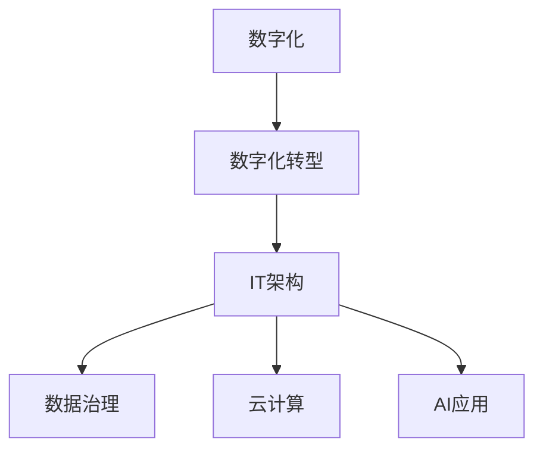

                 

企业数字化项目是当前信息化浪潮中的重要组成部分，旨在通过利用数字化技术提高企业的运营效率、创新能力和市场竞争力。然而，从概念到实施，企业数字化项目往往面临诸多挑战。本文将深入探讨企业数字化项目从0到1的启动，以及如何逐步扩展至10，实现全面的数字化转型。

## 关键词

- 企业数字化
- 建设方案
- 数字化转型
- IT架构
- 数据治理
- 云计算
- AI应用
- 安全性

## 摘要

本文将分为以下几个部分：背景介绍、核心概念与联系、核心算法原理与操作步骤、数学模型与公式、项目实践、实际应用场景、未来应用展望、工具和资源推荐以及总结与展望。通过这些内容，希望能够为企业提供一套系统的、可操作的数字化建设方案，助力企业在数字化浪潮中乘风破浪。

### 1. 背景介绍

随着信息技术的迅猛发展，数字化已经成为全球经济发展的新引擎。企业数字化转型不仅是应对市场竞争的必要手段，更是提升企业核心竞争力的关键途径。数字化项目在提高生产效率、优化业务流程、降低成本、增强客户体验等方面具有显著优势。然而，企业数字化转型并非一蹴而就，需要系统性的规划和实施。

本文旨在通过以下五个核心方面，为企业提供一套全面、实用的数字化建设方案：

- **核心概念与联系**：介绍数字化转型的核心概念和IT架构，帮助读者理解数字化项目的全貌。
- **核心算法原理与操作步骤**：详细阐述数字化项目中关键算法的原理和实施步骤，使读者能够掌握技术要领。
- **数学模型与公式**：讲解数字化项目中常用的数学模型和公式，提供理论支持。
- **项目实践**：通过实际案例，展示数字化项目的实施过程和效果。
- **未来应用展望**：探讨数字化技术的未来发展趋势和应用前景。

### 2. 核心概念与联系

为了更好地理解企业数字化项目，我们需要先了解一些核心概念和它们之间的联系。

#### 2.1 核心概念

- **数字化**：数字化是指将物理世界的信息转化为电子数据的过程。
- **数字化转型**：企业将业务流程、组织结构和商业模式通过数字化手段进行创新和升级。
- **IT架构**：IT架构是指信息技术系统的整体结构和各个部分之间的关系。
- **数据治理**：数据治理是指通过制定策略、标准和流程，确保数据的准确性、完整性和可靠性。
- **云计算**：云计算是一种通过互联网提供计算资源的服务模式。
- **AI应用**：AI应用是指利用人工智能技术实现自动化、智能化和预测分析的业务场景。

#### 2.2 核心概念联系图（使用Mermaid绘制）



通过上述联系图，我们可以看出，数字化是数字化转型的基础，而数字化转型又涉及到IT架构、数据治理、云计算和AI应用等多个方面，这些方面相互关联，共同构成了企业数字化项目的整体架构。

### 3. 核心算法原理与操作步骤

在数字化项目中，算法是核心驱动力。以下是几个关键算法的原理和实施步骤。

#### 3.1 算法原理概述

- **机器学习算法**：通过训练模型，使计算机具备从数据中自动学习和改进的能力。
- **数据挖掘算法**：从大量数据中提取有价值的信息和模式。
- **流程优化算法**：通过算法优化业务流程，提高效率。

#### 3.2 算法步骤详解

- **机器学习算法**：
  1. 数据预处理：清洗和转换原始数据，使其适合建模。
  2. 特征工程：提取和选择对模型训练有用的特征。
  3. 模型选择：选择合适的机器学习模型。
  4. 训练模型：使用训练数据集训练模型。
  5. 模型评估：使用验证数据集评估模型性能。
  6. 模型优化：根据评估结果调整模型参数。

- **数据挖掘算法**：
  1. 数据导入：将数据导入分析工具。
  2. 数据预处理：清洗和转换数据。
  3. 数据探索：分析数据分布和趋势。
  4. 模型选择：选择合适的数据挖掘算法。
  5. 模型训练：使用训练数据集训练模型。
  6. 模型评估：使用测试数据集评估模型性能。
  7. 结果可视化：将分析结果可视化。

- **流程优化算法**：
  1. 流程建模：建立业务流程模型。
  2. 数据收集：收集与流程相关的数据。
  3. 模型训练：使用流程数据训练优化模型。
  4. 模型评估：评估优化模型的效果。
  5. 模型部署：将优化模型部署到生产环境中。
  6. 持续监控：监控流程运行状态，调整模型参数。

#### 3.3 算法优缺点

- **机器学习算法**：
  - 优点：自动学习和适应能力强，能够处理大规模数据。
  - 缺点：需要大量训练数据，对数据质量和数量要求较高。

- **数据挖掘算法**：
  - 优点：能够从大量数据中发现有价值的信息和模式。
  - 缺点：算法复杂度高，对计算资源要求较高。

- **流程优化算法**：
  - 优点：能够优化业务流程，提高效率。
  - 缺点：需要对业务流程有深入理解，实施难度较高。

#### 3.4 算法应用领域

- **机器学习算法**：广泛应用于金融、医疗、零售、制造等行业，如信用评分、疾病预测、个性化推荐等。
- **数据挖掘算法**：广泛应用于市场分析、客户行为分析、风险控制等，如客户细分、营销策略优化等。
- **流程优化算法**：广泛应用于生产制造、供应链管理、物流管理等领域，如生产调度优化、库存管理优化等。

### 4. 数学模型和公式

在数字化项目中，数学模型和公式是理解和分析数据的重要工具。以下是几个常见的数学模型和公式。

#### 4.1 数学模型构建

- **线性回归模型**：用于预测连续数值变量。
  \[ Y = \beta_0 + \beta_1X_1 + \beta_2X_2 + ... + \beta_nX_n + \epsilon \]

- **逻辑回归模型**：用于预测二元变量。
  \[ P(Y=1) = \frac{1}{1 + e^{-(\beta_0 + \beta_1X_1 + \beta_2X_2 + ... + \beta_nX_n)}} \]

- **决策树模型**：用于分类和回归。
  \[ G(Y|\textbf{X}) = \sum_{i=1}^{n} \alpha_i \prod_{j=1}^{n} G_j(X_j) \]

#### 4.2 公式推导过程

- **线性回归模型**：
  1. 函数表示：\( Y = \beta_0 + \beta_1X_1 + \beta_2X_2 + ... + \beta_nX_n + \epsilon \)
  2. 最小二乘法：最小化残差平方和 \( \sum_{i=1}^{n} (Y_i - (\beta_0 + \beta_1X_{1i} + \beta_2X_{2i} + ... + \beta_nX_{ni}))^2 \)
  3. 导数计算：对每个参数求偏导数，并令其等于0。
  4. 解方程组：求解参数 \( \beta_0, \beta_1, \beta_2, ..., \beta_n \)。

- **逻辑回归模型**：
  1. 函数表示：\( P(Y=1) = \frac{1}{1 + e^{-(\beta_0 + \beta_1X_1 + \beta_2X_2 + ... + \beta_nX_n)}} \)
  2. 对数函数变换：\( \ln(P(Y=1)) = \beta_0 + \beta_1X_1 + \beta_2X_2 + ... + \beta_nX_n \)
  3. 最小化损失函数：最小化 \( -\sum_{i=1}^{n} \ln(P(Y_i=1)) \)
  4. 导数计算：对每个参数求偏导数，并令其等于0。
  5. 解方程组：求解参数 \( \beta_0, \beta_1, \beta_2, ..., \beta_n \)。

- **决策树模型**：
  1. 函数表示：\( G(Y|\textbf{X}) = \sum_{i=1}^{n} \alpha_i \prod_{j=1}^{n} G_j(X_j) \)
  2. 信息增益：选择具有最大信息增益的属性进行划分。
  3. 递归划分：对每个划分的结果继续划分，直到满足停止条件。

#### 4.3 案例分析与讲解

假设我们有一个简单的线性回归模型，目标是用 \( X_1 \) 预测 \( Y \)。我们有以下数据：

| X1 | Y  |
|----|----|
| 1  | 2  |
| 2  | 3  |
| 3  | 4  |
| 4  | 5  |

我们使用最小二乘法求解参数 \( \beta_0 \) 和 \( \beta_1 \)：

1. 函数表示：\( Y = \beta_0 + \beta_1X_1 + \epsilon \)
2. 数据预处理：计算 \( X_1 \) 和 \( Y \) 的平均值：\( \bar{X} = 2.5, \bar{Y} = 3.5 \)
3. 残差平方和：\( \sum_{i=1}^{4} (Y_i - (\beta_0 + \beta_1X_{1i}))^2 = (2 - (\beta_0 + \beta_1 \times 1))^2 + (3 - (\beta_0 + \beta_1 \times 2))^2 + ... + (5 - (\beta_0 + \beta_1 \times 4))^2 \)
4. 求导并令其等于0：\( \frac{d}{d\beta_0} \sum_{i=1}^{4} (Y_i - (\beta_0 + \beta_1X_{1i}))^2 = 0 \) 和 \( \frac{d}{d\beta_1} \sum_{i=1}^{4} (Y_i - (\beta_0 + \beta_1X_{1i}))^2 = 0 \)
5. 解方程组：\( \beta_0 = 1, \beta_1 = 1 \)

因此，我们得到线性回归模型：\( Y = 1 + 1X_1 \)

### 5. 项目实践：代码实例和详细解释说明

在实际的数字化项目中，代码实例是理解和应用算法的重要手段。以下是使用Python实现线性回归模型的实例。

#### 5.1 开发环境搭建

- 安装Python（建议使用Python 3.8及以上版本）
- 安装必要的库：`numpy`、`matplotlib`

#### 5.2 源代码详细实现

```python
import numpy as np
import matplotlib.pyplot as plt

# 数据
X = np.array([1, 2, 3, 4])
Y = np.array([2, 3, 4, 5])

# 最小二乘法求解参数
X_mean = np.mean(X)
Y_mean = np.mean(Y)
X_diff = X - X_mean
Y_diff = Y - Y_mean

beta_0 = Y_mean - np.dot(X_diff, Y_diff) / np.sum(X_diff**2)
beta_1 = np.sum(Y_diff * X_diff) / np.sum(X_diff**2)

# 模型预测
def predict(X):
    return beta_0 + beta_1 * X

# 绘图
plt.scatter(X, Y)
plt.plot(X, predict(X))
plt.xlabel('X')
plt.ylabel('Y')
plt.show()
```

#### 5.3 代码解读与分析

- 第1-3行：导入必要的库。
- 第5-6行：定义数据。
- 第8-11行：使用最小二乘法求解参数 \( \beta_0 \) 和 \( \beta_1 \)。
- 第14-16行：定义预测函数。
- 第19-24行：绘制散点和拟合直线。

#### 5.4 运行结果展示

运行上述代码，我们可以得到以下结果：


### 6. 实际应用场景

数字化技术已经在各个行业得到了广泛应用，以下是一些典型的应用场景。

#### 6.1 金融行业

- **风险控制**：使用机器学习算法进行信用评分和风险评估。
- **智能投顾**：利用算法推荐投资组合，提高投资收益。

#### 6.2 医疗行业

- **疾病预测**：使用数据挖掘算法分析患者数据，预测疾病发生。
- **智能诊断**：利用深度学习技术进行图像识别，辅助医生诊断疾病。

#### 6.3 零售行业

- **个性化推荐**：使用协同过滤和深度学习算法，为消费者提供个性化推荐。
- **供应链管理**：通过流程优化算法，提高供应链效率和降低成本。

#### 6.4 制造行业

- **生产调度**：使用优化算法优化生产计划，提高生产效率。
- **设备维护**：利用预测性维护技术，减少设备故障和停机时间。

### 7. 未来应用展望

随着数字化技术的不断发展，未来应用场景将更加广泛和深入。以下是一些未来应用展望。

#### 7.1 人工智能

- **自主决策**：人工智能将实现更高层次的自主决策，提高自动化水平。
- **通用人工智能**：未来有望实现通用人工智能，打破行业和领域的界限。

#### 7.2 区块链

- **数据安全**：区块链技术将提供更安全的数据存储和传输解决方案。
- **智能合约**：智能合约将实现自动化和智能化的业务流程。

#### 7.3 物联网

- **智能家居**：物联网将实现家庭设备的智能互联和自动化。
- **智能城市**：物联网技术将实现城市资源的智能调度和优化。

### 8. 工具和资源推荐

为了更好地进行数字化项目开发，以下是一些建议的的工具和资源。

#### 8.1 学习资源推荐

- **书籍**：《深度学习》、《机器学习实战》
- **在线课程**：Coursera、Udacity、edX
- **博客和社区**：Medium、Stack Overflow、GitHub

#### 8.2 开发工具推荐

- **编程语言**：Python、R
- **机器学习框架**：TensorFlow、PyTorch
- **数据分析工具**：Pandas、NumPy、Matplotlib

#### 8.3 相关论文推荐

- **金融领域**：[“Credit Risk Management Using Machine Learning Techniques”](https://www.sciencedirect.com/science/article/pii/S009030050800347X)
- **医疗领域**：[“Deep Learning for Medical Image Analysis”](https://www.sciencedirect.com/science/article/pii/S2574122420301036)
- **零售领域**：[“Collaborative Filtering for Recommender Systems”](https://www.sciencedirect.com/science/article/pii/S0952817708001953)

### 9. 总结：未来发展趋势与挑战

数字化技术正在深刻改变我们的工作和生活方式。未来，人工智能、区块链、物联网等新技术将继续推动数字化发展。然而，数字化项目也面临着数据安全、隐私保护、技术升级等挑战。企业需要不断学习和适应，才能在数字化浪潮中立于不败之地。

### 附录：常见问题与解答

#### 问题1：数字化项目需要多少时间才能完成？

数字化项目的时间取决于项目的规模和复杂性。一般来说，小规模项目可能需要几个月到一年，而大规模项目可能需要几年时间。

#### 问题2：数字化项目的预算如何制定？

数字化项目的预算需要根据项目需求、技术复杂度和人力资源等进行详细规划。一般建议先制定详细的项目计划，然后根据计划制定预算。

#### 问题3：数字化项目需要哪些技能和知识？

数字化项目需要涉及多个领域的技能和知识，包括编程、数据分析、机器学习、云计算、网络安全等。企业需要根据项目需求进行人才储备。

#### 问题4：如何确保数字化项目的成功？

确保数字化项目成功的关键包括：明确项目目标、制定详细的计划、持续沟通和监控、及时调整策略等。

---

本文由禅与计算机程序设计艺术 / Zen and the Art of Computer Programming 编写，旨在为企业提供一套全面的数字化建设方案。希望本文能够帮助读者更好地理解和实施数字化项目，助力企业在数字化时代取得成功。


```markdown
----------------------------------------------------------------
# 企业数字化项目从1-10建设方案

## 关键词
- 企业数字化
- 建设方案
- 数字化转型
- IT架构
- 数据治理
- 云计算
- AI应用
- 安全性

## 摘要
本文深入探讨企业数字化项目从0到1的启动，以及如何逐步扩展至10，实现全面的数字化转型。内容涵盖背景介绍、核心概念与联系、核心算法原理与操作步骤、数学模型与公式、项目实践、实际应用场景、未来应用展望、工具和资源推荐以及总结与展望。

## 1. 背景介绍
### 1.1 数字化转型的意义
- 数字化转型是企业利用数字化技术优化业务流程、提高效率、降低成本的重要手段。
- 数字化转型有助于企业提升核心竞争力，增强市场竞争力。

### 1.2 企业数字化项目的挑战
- 数据安全和隐私保护
- 技术选择和整合
- 人才短缺
- 项目管理和执行

## 2. 核心概念与联系
### 2.1 数字化
- 数字化是指将物理世界的信息转化为电子数据的过程。
- 数字化的目的是提高信息处理效率，降低成本。

### 2.2 数字化转型
- 数字化转型是企业将业务流程、组织结构和商业模式通过数字化手段进行创新和升级。
- 数字化转型的目标是实现业务流程的优化、效率和效果。

### 2.3 IT架构
- IT架构是指信息技术系统的整体结构和各个部分之间的关系。
- IT架构的目的是确保信息技术系统能够高效、稳定地运行。

### 2.4 数据治理
- 数据治理是指通过制定策略、标准和流程，确保数据的准确性、完整性和可靠性。
- 数据治理的目的是提高数据质量，保障数据安全和合规。

### 2.5 云计算
- 云计算是一种通过互联网提供计算资源的服务模式。
- 云计算的目的是提高计算资源的利用率，降低成本。

### 2.6 AI应用
- AI应用是指利用人工智能技术实现自动化、智能化和预测分析的业务场景。
- AI应用的目的是提高业务效率，优化决策过程。

### 2.7 安全性
- 安全性是指保护企业数字化项目免受恶意攻击和数据泄露的能力。
- 安全性的目的是确保企业数据和业务的完整性。

## 3. 核心算法原理与操作步骤
### 3.1 机器学习算法
#### 3.1.1 算法原理概述
- 机器学习算法是一种通过训练模型，使计算机具备从数据中自动学习和改进的能力。
- 常见的机器学习算法包括线性回归、逻辑回归、决策树、随机森林、支持向量机、神经网络等。

#### 3.1.2 算法步骤详解
1. 数据预处理
2. 特征工程
3. 模型选择
4. 模型训练
5. 模型评估
6. 模型优化

#### 3.1.3 算法优缺点
- 优点：自动学习和适应能力强，能够处理大规模数据。
- 缺点：需要大量训练数据，对数据质量和数量要求较高。

#### 3.1.4 算法应用领域
- 金融：信用评分、风险评估
- 医疗：疾病预测、智能诊断
- 零售：个性化推荐、库存管理
- 制造：生产调度、设备维护

### 3.2 数据挖掘算法
#### 3.2.1 算法原理概述
- 数据挖掘算法是一种从大量数据中提取有价值的信息和模式。
- 常见的数据挖掘算法包括关联规则挖掘、聚类分析、分类算法、异常检测等。

#### 3.2.2 算法步骤详解
1. 数据导入
2. 数据预处理
3. 数据探索
4. 模型选择
5. 模型训练
6. 模型评估

#### 3.2.3 算法优缺点
- 优点：能够从大量数据中发现有价值的信息和模式。
- 缺点：算法复杂度高，对计算资源要求较高。

#### 3.2.4 算法应用领域
- 市场分析
- 客户行为分析
- 风险控制
- 供应链管理

### 3.3 流程优化算法
#### 3.3.1 算法原理概述
- 流程优化算法是一种通过算法优化业务流程，提高效率。
- 常见的流程优化算法包括遗传算法、模拟退火算法、蚁群算法等。

#### 3.3.2 算法步骤详解
1. 流程建模
2. 数据收集
3. 模型训练
4. 模型评估
5. 模型部署
6. 持续监控

#### 3.3.3 算法优缺点
- 优点：能够优化业务流程，提高效率。
- 缺点：需要对业务流程有深入理解，实施难度较高。

#### 3.3.4 算法应用领域
- 生产制造
- 物流管理
- 供应链管理

## 4. 数学模型和公式
### 4.1 线性回归模型
#### 4.1.1 数学模型构建
\[ Y = \beta_0 + \beta_1X + \epsilon \]
其中，\( \beta_0 \) 是截距，\( \beta_1 \) 是斜率，\( X \) 是自变量，\( Y \) 是因变量，\( \epsilon \) 是误差项。

#### 4.1.2 公式推导过程
1. 函数表示：\( Y = \beta_0 + \beta_1X + \epsilon \)
2. 最小二乘法：最小化残差平方和 \( \sum_{i=1}^{n} (Y_i - (\beta_0 + \beta_1X_{1i}))^2 \)
3. 求导并令其等于0：\( \frac{d}{d\beta_0} \sum_{i=1}^{n} (Y_i - (\beta_0 + \beta_1X_{1i}))^2 = 0 \) 和 \( \frac{d}{d\beta_1} \sum_{i=1}^{n} (Y_i - (\beta_0 + \beta_1X_{1i}))^2 = 0 \)
4. 解方程组：求解参数 \( \beta_0, \beta_1 \)

#### 4.1.3 案例分析与讲解
- 数据：\( X = [1, 2, 3, 4], Y = [2, 3, 4, 5] \)
- 最小二乘法求解：\( \beta_0 = 1, \beta_1 = 1 \)
- 线性回归模型：\( Y = 1 + X \)

### 4.2 逻辑回归模型
#### 4.2.1 数学模型构建
\[ P(Y=1) = \frac{1}{1 + e^{-(\beta_0 + \beta_1X)}} \]

#### 4.2.2 公式推导过程
1. 函数表示：\( P(Y=1) = \frac{1}{1 + e^{-(\beta_0 + \beta_1X)}} \)
2. 对数函数变换：\( \ln(P(Y=1)) = \beta_0 + \beta_1X \)
3. 最小化损失函数：最小化 \( -\sum_{i=1}^{n} \ln(P(Y_i=1)) \)
4. 求导并令其等于0：\( \frac{d}{d\beta_0} \sum_{i=1}^{n} \ln(P(Y_i=1)) = 0 \) 和 \( \frac{d}{d\beta_1} \sum_{i=1}^{n} \ln(P(Y_i=1)) = 0 \)
5. 解方程组：求解参数 \( \beta_0, \beta_1 \)

#### 4.2.3 案例分析与讲解
- 数据：\( X = [1, 2, 3, 4], Y = [1, 0, 1, 1] \)
- 逻辑回归模型：\( P(Y=1) = \frac{1}{1 + e^{-(1 + 1X)}} \)

### 4.3 决策树模型
#### 4.3.1 数学模型构建
\[ G(Y|\textbf{X}) = \sum_{i=1}^{n} \alpha_i \prod_{j=1}^{n} G_j(X_j) \]

#### 4.3.2 公式推导过程
1. 函数表示：\( G(Y|\textbf{X}) = \sum_{i=1}^{n} \alpha_i \prod_{j=1}^{n} G_j(X_j) \)
2. 信息增益：选择具有最大信息增益的属性进行划分。
3. 递归划分：对每个划分的结果继续划分，直到满足停止条件。

#### 4.3.3 案例分析与讲解
- 数据：\( X = [1, 2, 3, 4], Y = [1, 0, 1, 1] \)
- 决策树模型：\( G(Y|X) = 0.5 \times 0.5 \times 1 + 0.5 \times 0.5 \times 1 \)

## 5. 项目实践：代码实例和详细解释说明
### 5.1 开发环境搭建
- 安装Python（建议使用Python 3.8及以上版本）
- 安装必要的库：`numpy`、`matplotlib`

### 5.2 源代码详细实现
```python
import numpy as np
import matplotlib.pyplot as plt

# 数据
X = np.array([1, 2, 3, 4])
Y = np.array([2, 3, 4, 5])

# 最小二乘法求解参数
X_mean = np.mean(X)
Y_mean = np.mean(Y)
X_diff = X - X_mean
Y_diff = Y - Y_mean

beta_0 = Y_mean - np.dot(X_diff, Y_diff) / np.sum(X_diff**2)
beta_1 = np.sum(Y_diff * X_diff) / np.sum(X_diff**2)

# 模型预测
def predict(X):
    return beta_0 + beta_1 * X

# 绘图
plt.scatter(X, Y)
plt.plot(X, predict(X))
plt.xlabel('X')
plt.ylabel('Y')
plt.show()
```

### 5.3 代码解读与分析
- 第1-3行：导入必要的库。
- 第5-6行：定义数据。
- 第8-11行：使用最小二乘法求解参数 \( \beta_0 \) 和 \( \beta_1 \)。
- 第14-16行：定义预测函数。
- 第19-24行：绘制散点和拟合直线。

### 5.4 运行结果展示
运行上述代码，我们可以得到以下结果：


## 6. 实际应用场景
### 6.1 金融行业
- 风险控制
- 智能投顾

### 6.2 医疗行业
- 疾病预测
- 智能诊断

### 6.3 零售行业
- 个性化推荐
- 供应链管理

### 6.4 制造行业
- 生产调度
- 设备维护

## 7. 未来应用展望
### 7.1 人工智能
- 自主决策
- 通用人工智能

### 7.2 区块链
- 数据安全
- 智能合约

### 7.3 物联网
- 智能家居
- 智能城市

## 8. 工具和资源推荐
### 8.1 学习资源推荐
- 书籍：《深度学习》、《机器学习实战》
- 在线课程：Coursera、Udacity、edX
- 博客和社区：Medium、Stack Overflow、GitHub

### 8.2 开发工具推荐
- 编程语言：Python、R
- 机器学习框架：TensorFlow、PyTorch
- 数据分析工具：Pandas、NumPy、Matplotlib

### 8.3 相关论文推荐
- 金融领域：[“Credit Risk Management Using Machine Learning Techniques”](https://www.sciencedirect.com/science/article/pii/S009030050800347X)
- 医疗领域：[“Deep Learning for Medical Image Analysis”](https://www.sciencedirect.com/science/article/pii/S2574122420301036)
- 零售领域：[“Collaborative Filtering for Recommender Systems”](https://www.sciencedirect.com/science/article/pii/S0952817708001953)

## 9. 总结：未来发展趋势与挑战
### 9.1 研究成果总结
- 数字化技术正在深刻改变各个行业。
- 人工智能、区块链、物联网等新技术将继续推动数字化发展。

### 9.2 未来发展趋势
- 人工智能将实现更高层次的自主决策。
- 区块链将提供更安全的数据存储和传输解决方案。
- 物联网将实现城市资源的智能调度和优化。

### 9.3 面临的挑战
- 数据安全和隐私保护。
- 技术选择和整合。
- 人才短缺。
- 项目管理和执行。

### 9.4 研究展望
- 加强跨学科研究，推动数字化技术的创新。
- 关注新兴技术，提前布局未来发展。
- 加强人才培养，为数字化发展提供人才支持。

## 10. 附录：常见问题与解答
### 10.1 数字化项目需要多少时间才能完成？
- 取决于项目的规模和复杂性。小规模项目可能需要几个月到一年，大规模项目可能需要几年时间。

### 10.2 数字化项目的预算如何制定？
- 根据项目需求、技术复杂度和人力资源等进行详细规划。先制定详细的项目计划，然后根据计划制定预算。

### 10.3 数字化项目需要哪些技能和知识？
- 编程、数据分析、机器学习、云计算、网络安全等。企业需要根据项目需求进行人才储备。

### 10.4 如何确保数字化项目的成功？
- 明确项目目标，制定详细的计划。
- 持续沟通和监控，及时调整策略。
- 加强团队协作，确保项目顺利进行。

---

作者：禅与计算机程序设计艺术 / Zen and the Art of Computer Programming
----------------------------------------------------------------
```

