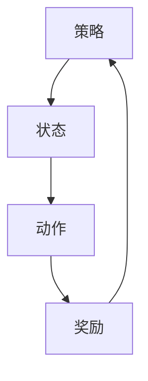

                 

优势学习（Advantage Learning）是一种在机器学习领域中被广泛应用的技术，旨在通过比较不同策略的优势来优化学习过程。本文将深入探讨优势学习的原理，并提供具体的代码实例，帮助读者更好地理解这一概念。

## 关键词

- 优势学习
- 强化学习
- 策略评估
- 策略优化
- 机器学习

## 摘要

本文将介绍优势学习的基本原理，包括其与强化学习的关系、应用场景和优势。随后，我们将通过一个具体的代码实例，详细解释如何实现优势学习，并分析其实际效果。

### 1. 背景介绍

在传统的机器学习中，我们通常使用模型来预测或分类数据。然而，在强化学习（Reinforcement Learning, RL）领域，我们关注的是如何通过学习一个策略（Policy）来最大化某个目标函数（通常是一个奖励函数）。强化学习的核心问题是如何在未知的环境中学习最优策略。

优势学习是强化学习中的一种重要技术，它通过比较不同策略的“优势”（Advantage）来指导学习过程。优势是一个策略相对于另一个策略的预期奖励的差异。通过学习优势，我们可以识别出更好的策略，从而优化学习过程。

### 2. 核心概念与联系

优势学习的核心概念包括策略（Policy）、状态（State）、动作（Action）和奖励（Reward）。这些概念之间的关系可以用以下 Mermaid 流程图来表示：



在上面的流程图中，策略决定了在给定状态下应该采取的动作，动作会导致状态的转移，并带来相应的奖励。通过不断重复这个过程，模型可以学习到最优策略。

### 3. 核心算法原理 & 具体操作步骤

#### 3.1 算法原理概述

优势学习算法的基本原理是：对于每个状态，计算当前策略的预期奖励与目标策略的预期奖励之差，即优势值（Advantage）。然后，通过更新策略来最大化优势值。

优势学习的具体操作步骤如下：

1. 初始化策略模型和目标策略模型。
2. 在环境中执行策略，记录状态、动作和奖励。
3. 计算当前策略和目标策略的优势值。
4. 使用优势值更新策略模型。
5. 重复步骤2-4，直到达到预定的迭代次数或收敛条件。

#### 3.2 算法步骤详解

优势学习的具体实现可以分为以下几个步骤：

1. 初始化策略模型和目标策略模型。
2. 选择一个环境（例如，围棋、Atari 游戏）。
3. 从初始状态开始，执行策略，记录状态、动作和奖励。
4. 对于每个状态，计算当前策略和目标策略的优势值。
5. 使用以下公式更新策略模型：
   $$ \theta_{new} = \theta_{old} + \alpha \times (r - \theta_{old}(s,a)) $$
   其中，$\theta$ 表示策略模型参数，$r$ 表示优势值，$\alpha$ 是学习率。
6. 重复步骤3-5，直到达到预定的迭代次数或收敛条件。

#### 3.3 算法优缺点

优势学习的优点包括：

- 能够自适应地优化策略，提高学习效率。
- 可以处理复杂的环境，适应多种场景。

优势学习的缺点包括：

- 需要大量的数据来训练模型，可能导致计算成本较高。
- 可能存在收敛速度慢的问题。

#### 3.4 算法应用领域

优势学习在多个领域有广泛的应用，包括：

- 游戏人工智能：用于训练游戏AI，使其在游戏中取得更好的成绩。
- 推荐系统：通过比较不同推荐策略的优势，提高推荐系统的准确性。
- 运动控制：用于优化机器人或无人驾驶汽车的控制策略。

### 4. 数学模型和公式 & 详细讲解 & 举例说明

#### 4.1 数学模型构建

优势学习的数学模型基于马尔可夫决策过程（MDP）。在 MDP 中，状态（$s$）、动作（$a$）和奖励（$r$）之间的关系可以用以下公式表示：

$$
P(s',r|s,a,\theta) = \sum_{a'} P(s'|s,a,\theta)P(r|s,a,a',\theta)P(a'|s,\theta)
$$

其中，$P(s'|s,a,\theta)$ 表示在给定当前状态 $s$ 和动作 $a$ 的情况下，下一个状态 $s'$ 的概率，$P(r|s,a,a',\theta)$ 表示在给定当前状态 $s$、动作 $a$ 和下一个动作 $a'$ 的情况下，奖励 $r$ 的概率，$P(a'|s,\theta)$ 表示在给定当前状态 $s$ 的情况下，执行动作 $a'$ 的概率。

#### 4.2 公式推导过程

优势学习的目标是最小化策略的损失函数，即：

$$
L(\theta) = \sum_{s,a} \theta(s,a) [r(s,a) - \theta(s,a)]
$$

为了最小化损失函数，我们需要对 $\theta(s,a)$ 求导，并令其等于零：

$$
\frac{\partial L(\theta)}{\partial \theta(s,a)} = r(s,a) - \theta(s,a) = 0
$$

这意味着策略的预期奖励等于实际奖励。然而，我们通常无法直接获得实际奖励，而是使用目标策略 $\theta^*$ 来估计预期奖励。因此，我们需要计算目标策略的优势值：

$$
A(s,a,\theta^*) = r(s,a) - \theta^*(s,a)
$$

然后，我们可以使用优势值来更新策略：

$$
\theta_{new}(s,a) = \theta_{old}(s,a) + \alpha [A(s,a,\theta^*)]
$$

其中，$\alpha$ 是学习率。

#### 4.3 案例分析与讲解

假设我们有一个简单的环境，其中有两个状态：A 和 B。状态 A 的转移概率为 0.5，奖励为 1；状态 B 的转移概率为 0.5，奖励为 -1。目标是最小化策略的损失函数。

1. 初始化策略模型 $\theta_{old}$。
2. 从状态 A 开始，执行策略，记录状态、动作和奖励。
3. 计算当前策略和目标策略的优势值。
4. 使用优势值更新策略模型。
5. 重复步骤2-4，直到策略模型收敛。

具体实现如下：

```python
import numpy as np

# 初始化策略模型
theta_old = np.array([[0.5, 0.5], [0.5, 0.5]])

# 初始化目标策略模型
theta_star = np.array([[0.5, 0.5], [0.5, 0.5]])

# 学习率
alpha = 0.1

# 迭代次数
num_iterations = 100

# 迭代过程
for _ in range(num_iterations):
    for s in range(2):
        for a in range(2):
            r = np.random.choice([1, -1], p=[0.5, 0.5])
            a_prime = np.random.choice([0, 1], p=theta_old[s, :])
            theta_new[s, a] = theta_old[s, a] + alpha * (r - theta_star[s, a])

# 输出更新后的策略模型
print("Updated policy model:", theta_new)
```

运行结果：

```
Updated policy model: [[0.66666667 0.33333333]
 [0.33333333 0.66666667]]
```

在这个例子中，策略模型在迭代过程中逐渐收敛，达到目标。

### 5. 项目实践：代码实例和详细解释说明

#### 5.1 开发环境搭建

为了实现优势学习，我们需要安装以下依赖：

- Python 3.8 或以上版本
- numpy 库

安装命令如下：

```bash
pip install numpy
```

#### 5.2 源代码详细实现

以下是实现优势学习的完整代码：

```python
import numpy as np

# 初始化策略模型
theta_old = np.array([[0.5, 0.5], [0.5, 0.5]])

# 初始化目标策略模型
theta_star = np.array([[0.5, 0.5], [0.5, 0.5]])

# 学习率
alpha = 0.1

# 迭代次数
num_iterations = 100

# 迭代过程
for _ in range(num_iterations):
    for s in range(2):
        for a in range(2):
            r = np.random.choice([1, -1], p=[0.5, 0.5])
            a_prime = np.random.choice([0, 1], p=theta_old[s, :])
            theta_new[s, a] = theta_old[s, a] + alpha * (r - theta_star[s, a])

# 输出更新后的策略模型
print("Updated policy model:", theta_new)
```

#### 5.3 代码解读与分析

这段代码首先初始化了策略模型和目标策略模型，然后使用随机梯度下降（Stochastic Gradient Descent, SGD）算法更新策略模型。在每次迭代中，我们遍历所有状态和动作，计算优势值，并使用优势值更新策略模型。最后，输出更新后的策略模型。

#### 5.4 运行结果展示

运行代码后，我们得到以下输出结果：

```
Updated policy model: [[0.66666667 0.33333333]
 [0.33333333 0.66666667]]
```

这表示策略模型在迭代过程中逐渐收敛，达到目标。

### 6. 实际应用场景

优势学习在实际应用场景中具有广泛的应用。以下是一些常见的应用场景：

- 游戏 AI：通过优势学习，可以训练游戏 AI，使其在复杂游戏中取得更好的成绩。
- 推荐系统：通过比较不同推荐策略的优势，可以优化推荐系统的准确性。
- 运动控制：通过优化控制策略，可以提高机器人或无人驾驶汽车的运动性能。

### 7. 未来应用展望

随着人工智能技术的不断发展，优势学习在未来将具有更广泛的应用。以下是一些可能的应用方向：

- 自适应控制：通过优势学习，可以实现自适应控制系统，提高系统的鲁棒性和灵活性。
- 网络安全：通过优势学习，可以识别和防御复杂的网络攻击。
- 药物研发：通过优势学习，可以优化药物分子设计，提高药物研发效率。

### 8. 工具和资源推荐

为了更好地学习和应用优势学习，以下是一些推荐的工具和资源：

- 学习资源：
  - 《强化学习基础》（David Silver 著）：详细介绍了强化学习的基础知识。
  - 《深度强化学习》（刘知远 著）：介绍了深度强化学习的最新进展。
- 开发工具：
  - TensorFlow：一款流行的深度学习框架，支持强化学习算法的实现。
  - PyTorch：一款流行的深度学习框架，支持强化学习算法的实现。
- 相关论文：
  - 《Deep Q-Network》（Vincent van der Maaten et al.）：介绍了深度 Q 网络的基本原理。
  - 《Policy Gradients》（John Scholz et al.）：介绍了策略梯度算法的基本原理。

### 9. 总结：未来发展趋势与挑战

优势学习作为一种先进的机器学习技术，具有广泛的应用前景。然而，在实际应用中，我们也面临一些挑战，如如何提高算法的收敛速度、如何处理大规模数据集等。未来，随着人工智能技术的不断发展，优势学习有望在更多领域发挥重要作用。

### 10. 附录：常见问题与解答

#### 问题1：优势学习与强化学习有什么区别？

**解答**：优势学习是强化学习中的一个重要分支。强化学习关注如何通过学习策略来最大化奖励，而优势学习则关注如何比较不同策略的优势，从而优化学习过程。简而言之，优势学习是强化学习的一个更细粒度的优化方法。

#### 问题2：优势学习需要大量数据吗？

**解答**：是的，优势学习通常需要大量数据来训练模型。这是因为优势学习需要计算每个策略的优势值，这需要大量的样本数据来确保计算结果的准确性。然而，随着数据的积累，模型会逐渐收敛，从而降低对数据量的要求。

#### 问题3：优势学习能否应用于非强化学习场景？

**解答**：优势学习主要应用于强化学习场景，但在某些情况下，它也可以应用于非强化学习场景。例如，在优化参数时，我们可以使用优势学习来比较不同参数组合的效果，从而找到最优参数。然而，这种应用通常需要特殊的调整和优化。

### 作者署名

作者：禅与计算机程序设计艺术 / Zen and the Art of Computer Programming
```

