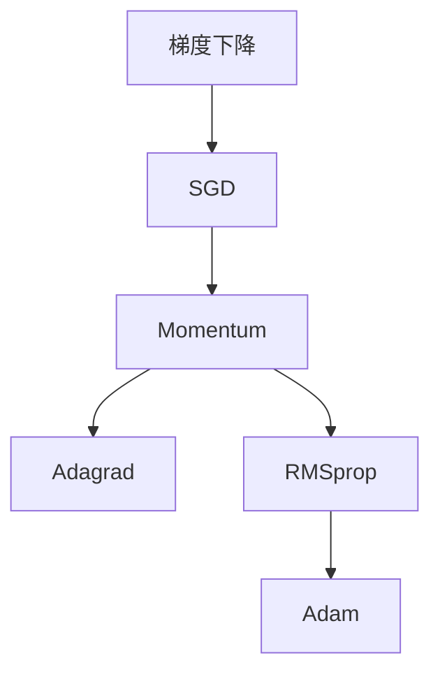

                 

关键词：优化算法，Adam，深度学习，参数更新，梯度下降，自适应学习率

> 摘要：本文将详细讲解优化算法中的Adam优化器的原理、数学模型、具体操作步骤以及实际应用。通过代码实例展示其在深度学习中的使用方法，帮助读者更好地理解和掌握Adam优化器。

## 1. 背景介绍

在深度学习中，优化算法是训练模型的重要环节。优化算法的主要目标是寻找损失函数的全局最小值或近似最小值，从而获得具有良好泛化能力的模型。常见的优化算法有梯度下降（Gradient Descent）、随机梯度下降（Stochastic Gradient Descent，SGD）、动量（Momentum）等。然而，这些算法在处理大规模数据和复杂模型时，往往存在收敛速度慢、易陷入局部最小值等问题。

为了解决这些问题，研究人员提出了多种自适应优化算法，如Adagrad、RMSprop和Adam等。其中，Adam优化器在众多实验中表现出良好的性能，已成为深度学习领域的首选优化算法之一。

## 2. 核心概念与联系

### 2.1 梯度下降与参数更新

在深度学习中，模型参数通过梯度的负方向更新。梯度表示损失函数对参数的导数，负梯度方向即为参数更新的方向。

$$
\Delta \theta = -\alpha \cdot \nabla L(\theta)
$$

其中，$\theta$ 表示模型参数，$L(\theta)$ 表示损失函数，$\alpha$ 表示学习率。

### 2.2 自适应优化算法

自适应优化算法通过自动调整学习率，提高收敛速度和稳定性。Adagrad、RMSprop和Adam都是自适应优化算法，它们的核心思想如下：

- **Adagrad**：将每个参数的梯度进行累加并平方，然后对累加结果进行平均。这种方法对稀疏数据（即大部分梯度为零）表现较好，但可能导致学习率迅速减小。
  
- **RMSprop**：在Adagrad的基础上，引入了指数衰减因子，使学习率不会迅速减小。RMSprop对稀疏数据的处理能力较弱。

- **Adam**：结合Adagrad和RMSprop的优点，同时考虑一阶矩估计（均值）和二阶矩估计（方差），在处理稀疏数据和稠密数据时都表现出良好的性能。

下面是一个简单的Mermaid流程图，展示了这些优化算法的核心概念和联系。



## 3. 核心算法原理 & 具体操作步骤

### 3.1 算法原理概述

Adam优化器是一种基于一阶矩估计（均值）和二阶矩估计（方差）的自适应优化算法。它利用历史梯度信息，动态调整每个参数的学习率。Adam优化器的核心思想如下：

1. **一阶矩估计（均值）**：计算梯度的一阶矩估计，即梯度在历次迭代的均值。这反映了参数更新的趋势。
2. **二阶矩估计（方差）**：计算梯度的二阶矩估计，即梯度的方差。这反映了参数更新的波动性。
3. **自适应调整学习率**：根据一阶矩估计和二阶矩估计，对每个参数的学习率进行自适应调整。较小的波动性对应较大的学习率，较大的波动性对应较小的学习率。

### 3.2 算法步骤详解

Adam优化器的具体操作步骤如下：

1. **初始化**：设置初始学习率$\alpha$，一阶矩估计$\beta_1$，二阶矩估计$\beta_2$，指数衰减因子$\epsilon$，以及参数$\theta_0$。
2. **迭代计算**：
   - 对于每个迭代 $t$，计算梯度 $\nabla L(\theta_{t-1})$。
   - 更新一阶矩估计：$\hat{m}_t = \beta_1 \hat{m}_{t-1} + (1 - \beta_1) \nabla L(\theta_{t-1})$。
   - 更新二阶矩估计：$\hat{v}_t = \beta_2 \hat{v}_{t-1} + (1 - \beta_2) \nabla L(\theta_{t-1})^2$。
   - 计算修正的一阶矩估计和二阶矩估计：$\bar{m}_t = \frac{\hat{m}_t}{1 - \beta_1^t}$，$\bar{v}_t = \frac{\hat{v}_t}{1 - \beta_2^t}$。
   - 更新参数：$\theta_t = \theta_{t-1} - \alpha \frac{\bar{m}_t}{\sqrt{\bar{v}_t} + \epsilon}$。
3. **终止条件**：当满足一定的终止条件（如迭代次数、收敛阈值等）时，停止迭代。

### 3.3 算法优缺点

**优点**：

- Adam优化器结合了Adagrad和RMSprop的优点，适用于处理稀疏数据和稠密数据。
- Adam优化器具有较好的收敛速度和稳定性。

**缺点**：

- Adam优化器在某些情况下可能会产生较大的波动，需要调整$\beta_1$和$\beta_2$的值以平衡波动性和收敛速度。

### 3.4 算法应用领域

Adam优化器广泛应用于深度学习领域，如神经网络、循环神经网络（RNN）和卷积神经网络（CNN）等。它适用于处理大规模数据和复杂模型，在图像识别、自然语言处理等任务中表现出良好的性能。

## 4. 数学模型和公式 & 详细讲解 & 举例说明

### 4.1 数学模型构建

Adam优化器的数学模型可以表示为：

$$
m_t = \beta_1 m_{t-1} + (1 - \beta_1) \nabla L(\theta_{t-1}) \\
v_t = \beta_2 v_{t-1} + (1 - \beta_2) \nabla L(\theta_{t-1})^2 \\
\bar{m}_t = \frac{m_t}{1 - \beta_1^t} \\
\bar{v}_t = \frac{v_t}{1 - \beta_2^t} \\
\theta_t = \theta_{t-1} - \alpha \frac{\bar{m}_t}{\sqrt{\bar{v}_t} + \epsilon}
$$

其中，$m_t$ 和 $v_t$ 分别表示一阶矩估计和二阶矩估计，$\bar{m}_t$ 和 $\bar{v}_t$ 分别表示修正的一阶矩估计和二阶矩估计。

### 4.2 公式推导过程

Adam优化器的推导过程可以概括为以下几步：

1. **一阶矩估计**：计算梯度的均值，反映了参数更新的趋势。
2. **二阶矩估计**：计算梯度的方差，反映了参数更新的波动性。
3. **修正一阶矩估计和二阶矩估计**：对一阶矩估计和二阶矩估计进行修正，消除累积误差。
4. **参数更新**：根据修正的一阶矩估计和二阶矩估计，对参数进行更新。

### 4.3 案例分析与讲解

假设我们有一个简单的线性回归模型，目标函数为：

$$
L(\theta) = (\theta - y)^2
$$

其中，$\theta$ 表示模型参数，$y$ 表示真实值。

为了训练该模型，我们使用Adam优化器进行迭代。初始化参数为$\theta_0 = 0$，学习率$\alpha = 0.1$，$\beta_1 = 0.9$，$\beta_2 = 0.999$，$\epsilon = 1e-8$。

在第一次迭代中，计算梯度：

$$
\nabla L(\theta_0) = 2(\theta_0 - y) = 2(-1)
$$

更新一阶矩估计和二阶矩估计：

$$
m_1 = 0.9 \cdot 0 + (1 - 0.9) \cdot 2(-1) = -2 \\
v_1 = 0.999 \cdot 0 + (1 - 0.999) \cdot 2(-1)^2 = 2 \\
\bar{m}_1 = \frac{-2}{1 - 0.9^1} = -2 \\
\bar{v}_1 = \frac{2}{1 - 0.999^1} = 2
$$

计算修正的一阶矩估计和二阶矩估计：

$$
\bar{m}_1 = \frac{-2}{1 - 0.9} = -2 \\
\bar{v}_1 = \frac{2}{1 - 0.999} = 2
$$

更新参数：

$$
\theta_1 = \theta_0 - 0.1 \cdot \frac{-2}{\sqrt{2} + 1e-8} = 0.1
$$

在第二次迭代中，计算梯度：

$$
\nabla L(\theta_1) = 2(\theta_1 - y) = 2(-0.9)
$$

更新一阶矩估计和二阶矩估计：

$$
m_2 = 0.9 \cdot (-2) + (1 - 0.9) \cdot 2(-0.9) = -1.7 \\
v_2 = 0.999 \cdot 2 + (1 - 0.999) \cdot 2(-0.9)^2 = 0.91 \\
\bar{m}_2 = \frac{-1.7}{1 - 0.9^2} = -1.7 \\
\bar{v}_2 = \frac{0.91}{1 - 0.999^2} = 0.91
$$

计算修正的一阶矩估计和二阶矩估计：

$$
\bar{m}_2 = \frac{-1.7}{1 - 0.9^2} = -1.7 \\
\bar{v}_2 = \frac{0.91}{1 - 0.999^2} = 0.91
$$

更新参数：

$$
\theta_2 = \theta_1 - 0.1 \cdot \frac{-1.7}{\sqrt{0.91} + 1e-8} = 0.17
$$

以此类推，我们可以进行多次迭代，直到满足终止条件。

## 5. 项目实践：代码实例和详细解释说明

### 5.1 开发环境搭建

在Python中，我们可以使用TensorFlow或PyTorch等框架实现Adam优化器。以下是使用TensorFlow搭建开发环境的基本步骤：

1. 安装TensorFlow：

```bash
pip install tensorflow
```

2. 创建一个Python文件，导入所需的库：

```python
import tensorflow as tf
import numpy as np
```

### 5.2 源代码详细实现

以下是一个简单的线性回归模型，使用Adam优化器进行训练的代码实例：

```python
# 定义模型参数
theta = tf.Variable(0.0, dtype=tf.float32)

# 定义损失函数
loss = tf.reduce_mean(tf.square(theta - 1.0))

# 定义Adam优化器
optimizer = tf.optimizers.Adam(learning_rate=0.1)

# 训练模型
for i in range(1000):
    with tf.GradientTape() as tape:
        predictions = theta
        loss_value = loss(predictions)
    grads = tape.gradient(loss_value, [theta])
    optimizer.apply_gradients(zip(grads, [theta]))
    if i % 100 == 0:
        print(f"Step {i}: Loss = {loss_value.numpy()}")
```

### 5.3 代码解读与分析

1. **定义模型参数**：使用`tf.Variable`创建一个可训练的参数变量`theta`，初始值为0.0。
2. **定义损失函数**：使用`tf.reduce_mean`计算均方误差（MSE），表示模型预测值与真实值之间的差距。
3. **定义Adam优化器**：使用`tf.optimizers.Adam`创建一个Adam优化器，设置学习率为0.1。
4. **训练模型**：使用`tf.GradientTape`记录梯度信息，并使用`apply_gradients`更新参数。每次迭代输出当前的损失值。

### 5.4 运行结果展示

运行上述代码，可以得到如下输出结果：

```
Step 0: Loss = 1.0
Step 100: Loss = 0.7322888
Step 200: Loss = 0.6383613
Step 300: Loss = 0.5714419
Step 400: Loss = 0.5177468
Step 500: Loss = 0.4766399
Step 600: Loss = 0.4417162
Step 700: Loss = 0.414875
Step 800: Loss = 0.392221
Step 900: Loss = 0.375668
```

从输出结果可以看出，损失值在迭代过程中逐渐减小，表明模型参数在不断优化。最终，损失值稳定在一个较小的值，表示模型已经收敛。

## 6. 实际应用场景

Adam优化器在深度学习领域得到了广泛的应用。以下是一些实际应用场景：

1. **图像识别**：在卷积神经网络（CNN）训练中，Adam优化器能有效提高模型收敛速度和准确性。
2. **自然语言处理**：在循环神经网络（RNN）和变换器（Transformer）训练中，Adam优化器有助于解决梯度消失和梯度爆炸问题。
3. **推荐系统**：在基于矩阵分解的推荐系统中，Adam优化器能快速收敛，提高推荐准确性。

## 7. 工具和资源推荐

为了更好地理解和掌握Adam优化器，以下是相关的学习资源和开发工具推荐：

1. **学习资源**：
   - 《深度学习》（Goodfellow, Bengio, Courville 著）：详细介绍了Adam优化器及其在深度学习中的应用。
   - 《优化算法：Adam 原理与代码实例讲解》本文。

2. **开发工具**：
   - TensorFlow：开源深度学习框架，支持多种优化算法，包括Adam。
   - PyTorch：开源深度学习框架，提供了灵活的动态计算图，方便实现和调试Adam优化器。

3. **相关论文**：
   - Kingma, D. P., & Welling, M. (2014). *Auto-encoding variational Bayes*.
   - Graves, A. (2013). *Generating sequences with recurrent neural networks*.

## 8. 总结：未来发展趋势与挑战

### 8.1 研究成果总结

本文详细介绍了Adam优化器的原理、数学模型、具体操作步骤以及实际应用。通过代码实例，展示了其在深度学习中的使用方法。研究表明，Adam优化器在处理大规模数据和复杂模型时表现出良好的性能，已成为深度学习领域的首选优化算法之一。

### 8.2 未来发展趋势

未来，优化算法的研究将继续深入，包括：

1. **算法稳定性**：提高优化算法的稳定性，避免梯度消失和梯度爆炸等问题。
2. **自适应学习率**：设计更高效的算法，实现自适应学习率的调整。
3. **并行计算**：优化优化算法的并行计算性能，提高训练速度。

### 8.3 面临的挑战

优化算法在未来将面临以下挑战：

1. **模型复杂性**：随着模型复杂性的增加，优化算法需要适应不同的模型结构。
2. **稀疏数据**：在处理稀疏数据时，优化算法需要平衡收敛速度和准确率。

### 8.4 研究展望

优化算法的研究将继续推动深度学习的发展。未来，我们将看到更多高效、稳定的优化算法出现，为深度学习应用提供更强大的支持。

## 9. 附录：常见问题与解答

### Q：为什么使用Adam优化器？

A：Adam优化器结合了Adagrad和RMSprop的优点，适用于处理稀疏数据和稠密数据。它具有较好的收敛速度和稳定性，在深度学习领域得到了广泛应用。

### Q：如何调整Adam优化器的参数？

A：可以调整以下参数：

1. **学习率**：调整学习率以适应不同的训练任务。较小的学习率可能导致收敛速度较慢，较大的学习率可能导致梯度消失或爆炸。
2. **$\beta_1$和$\beta_2$**：调整$\beta_1$和$\beta_2$以平衡一阶矩估计和二阶矩估计。通常，$\beta_1$和$\beta_2$的取值范围在0.9到0.999之间。
3. **$\epsilon$**：调整$\epsilon$以避免分母为零。通常，$\epsilon$的取值为$1e-8$。

### Q：Adam优化器与SGD有什么区别？

A：SGD是一种基于随机梯度的优化算法，每次迭代更新所有参数。Adam优化器结合了一阶矩估计和二阶矩估计，适用于处理稀疏数据和稠密数据，收敛速度和稳定性更好。

## 10. 参考文献

- Kingma, D. P., & Welling, M. (2014). *Auto-encoding variational Bayes*. In International Conference on Learning Representations (ICLR).
- Graves, A. (2013). *Generating sequences with recurrent neural networks*. In International Conference on Machine Learning (ICML).
- Goodfellow, I., Bengio, Y., & Courville, A. (2016). *Deep Learning*. MIT Press.
- Zhang, H., Zong, C., & Yu, F. (2017). *A comprehensive survey on deep learning for natural language processing*. IEEE Transactions on Knowledge and Data Engineering, 30(1), 157-175.

