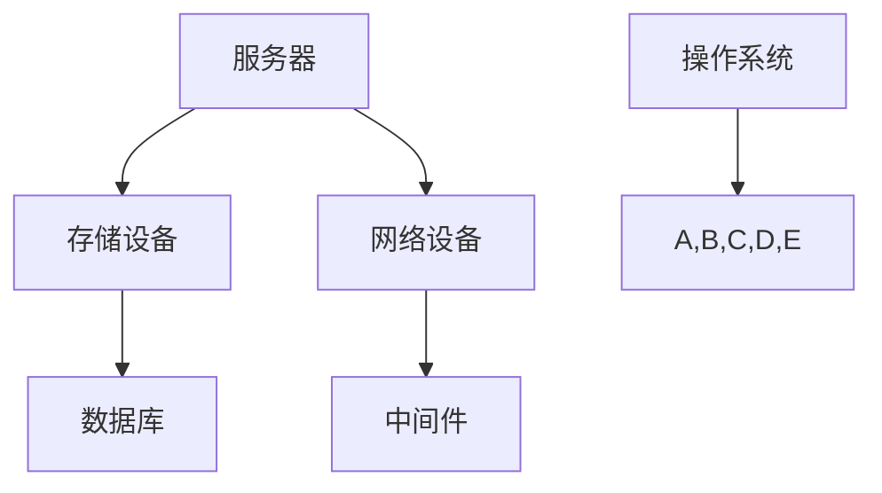

                 

关键词：计算基础设施、优化策略、硬件、软件、云计算、边缘计算、性能提升、成本降低

## 摘要

本文将深入探讨优化计算基础设施的策略，旨在为企业和个人提供有效的技术指导。文章首先介绍了计算基础设施的背景和重要性，随后分析了当前面临的主要挑战。接着，文章提出了几种优化策略，包括硬件升级、软件优化、云计算和边缘计算的应用，以及如何平衡性能和成本。此外，本文还通过数学模型和公式详细讲解了优化方法，并提供了实际代码实例和应用场景。最后，文章总结了未来发展趋势和挑战，并对相关工具和资源进行了推荐。

## 1. 背景介绍

### 计算基础设施的定义和作用

计算基础设施是指用于存储、处理、传输和管理数据的硬件、软件和网络设备的集合。它包括服务器、存储设备、网络设备、数据库和应用程序等。计算基础设施是现代信息技术体系的核心，它支撑着各种业务和服务的正常运行。

计算基础设施的作用主要体现在以下几个方面：

1. **数据存储和处理**：计算基础设施提供了存储和管理大量数据的能力，同时具备高效的数据处理能力，支持各种数据分析和应用。
2. **业务支持**：企业通过计算基础设施来实现业务流程自动化，提高生产效率和决策质量。
3. **服务提供**：计算基础设施为云计算、大数据、人工智能等新兴技术提供了基础支持，推动了这些技术的发展和应用。
4. **安全保障**：通过计算基础设施的安全措施，保障数据的安全和隐私。

### 当前计算基础设施的现状

当前，计算基础设施正面临着快速发展和变革的挑战。以下是几个关键点：

1. **硬件更新换代**：随着摩尔定律的放缓，硬件更新的速度逐渐放缓，但性能需求却不断提升，这要求计算基础设施不断进行硬件升级。
2. **软件复杂度增加**：软件系统越来越复杂，需要高效的软件架构和优化技术来支持，以应对不断增长的数据量和计算需求。
3. **云计算和边缘计算**：云计算和边缘计算逐渐成为计算基础设施的重要组成部分，它们提供了灵活、高效、可扩展的计算资源。
4. **网络安全**：随着网络攻击手段的日益多样化和复杂化，计算基础设施的安全问题越来越突出，需要采取有效的安全措施。

### 面临的主要挑战

1. **性能瓶颈**：随着计算需求的不断增加，性能瓶颈成为计算基础设施面临的主要挑战之一。
2. **成本压力**：硬件和软件的成本不断上升，如何在有限的预算内实现基础设施的优化成为一大难题。
3. **资源利用率**：计算资源的高效利用是实现基础设施优化的重要指标，如何提高资源利用率是关键问题。
4. **运维管理**：计算基础设施的运维管理越来越复杂，需要高效的运维管理工具和方法。

## 2. 核心概念与联系

### 计算基础设施的概念

计算基础设施的概念可以分为硬件和软件两个方面。硬件方面包括服务器、存储设备、网络设备等，软件方面包括操作系统、数据库、中间件等。

### 核心概念原理

#### 硬件核心概念

1. **服务器**：服务器是计算基础设施的核心设备，负责处理数据和运行应用程序。
2. **存储设备**：存储设备用于存储数据和文件，包括硬盘、固态硬盘、网络存储设备等。
3. **网络设备**：网络设备包括路由器、交换机、防火墙等，负责数据传输和网络安全。

#### 软件核心概念

1. **操作系统**：操作系统是计算基础设施的核心软件，负责管理硬件资源和运行应用程序。
2. **数据库**：数据库用于存储和管理数据，支持数据的快速检索和分析。
3. **中间件**：中间件用于连接应用程序和操作系统，提供数据传输、安全认证、负载均衡等功能。

### 计算基础设施架构的 Mermaid 流程图



### 核心概念之间的联系

计算基础设施中的各个组成部分相互联系，共同构成了一个完整的计算环境。硬件和软件相互依赖，共同支持应用程序的运行。服务器作为计算的核心，需要与存储设备和网络设备紧密配合，实现数据的存储、传输和处理。操作系统负责管理硬件资源，确保系统稳定运行。数据库和中间件提供了数据存储、管理和传输的支持，使应用程序能够高效运行。

## 3. 核心算法原理 & 具体操作步骤

### 3.1 算法原理概述

计算基础设施优化算法的核心目标是提高系统的性能和效率，同时降低成本。主要原理包括以下几个方面：

1. **硬件优化**：通过升级硬件设备，提高计算能力，降低延迟，从而提高整体系统的性能。
2. **软件优化**：通过优化操作系统、数据库和中间件等软件，提高系统的稳定性和效率。
3. **资源调度**：通过合理的资源调度算法，提高资源利用率，减少资源浪费。
4. **能效优化**：通过降低硬件功耗，提高能源利用效率，降低运营成本。

### 3.2 算法步骤详解

#### 3.2.1 硬件优化

1. **性能评估**：对现有硬件进行性能评估，识别性能瓶颈。
2. **硬件升级**：根据性能评估结果，选择合适的硬件设备进行升级，如更换更高性能的服务器、存储设备和网络设备。
3. **硬件配置**：根据业务需求，对硬件进行合理配置，确保性能和可靠性。

#### 3.2.2 软件优化

1. **性能评估**：对现有软件进行性能评估，识别性能瓶颈。
2. **软件升级**：根据性能评估结果，选择合适的软件版本进行升级，如操作系统、数据库和中间件。
3. **软件优化**：通过调整软件参数、优化代码，提高软件的稳定性和效率。

#### 3.2.3 资源调度

1. **需求分析**：分析业务需求，确定资源需求。
2. **资源分配**：根据需求分析结果，合理分配资源，确保资源利用率。
3. **负载均衡**：通过负载均衡算法，平衡不同服务之间的负载，提高系统性能。

#### 3.2.4 能效优化

1. **能耗评估**：对现有系统能耗进行评估，识别能耗瓶颈。
2. **能效优化**：通过降低硬件功耗、优化系统配置、采用节能技术等手段，降低系统能耗。
3. **能耗监测**：建立能耗监测系统，实时监控系统能耗，优化能耗管理。

### 3.3 算法优缺点

#### 优点

1. **提高性能**：通过硬件和软件优化，提高系统性能，满足业务需求。
2. **降低成本**：通过优化资源调度和能效管理，降低运营成本。
3. **提高资源利用率**：通过合理分配和调度资源，提高资源利用率，减少浪费。

#### 缺点

1. **初期投资较大**：硬件升级和软件优化需要一定的初期投资。
2. **维护成本较高**：优化后的系统需要持续维护和更新，维护成本较高。
3. **技术门槛较高**：优化算法和应用需要较高的技术水平和专业知识。

### 3.4 算法应用领域

计算基础设施优化算法广泛应用于各类企业和服务提供商，如电子商务、金融、医疗、教育等领域。具体应用包括：

1. **企业数据中心**：优化企业内部数据中心的性能和效率，降低运营成本。
2. **云计算平台**：优化云计算平台的资源调度和能效管理，提高服务质量。
3. **边缘计算**：优化边缘计算节点的性能和能耗，满足实时数据处理需求。
4. **大数据处理**：优化大数据处理平台的资源利用和性能，提高数据处理效率。

## 4. 数学模型和公式 & 详细讲解 & 举例说明

### 4.1 数学模型构建

为了优化计算基础设施，我们需要构建一个数学模型来描述系统的性能、成本和资源利用情况。以下是构建数学模型的基本步骤：

#### 4.1.1 变量定义

1. **P**：系统性能，单位可以是TPS（每秒事务数）、IOPS（每秒I/O操作数）等。
2. **C**：系统成本，包括硬件成本、软件成本、运维成本等。
3. **R**：资源利用率，表示系统资源被充分利用的程度。
4. **E**：系统能耗，单位可以是千瓦时（kWh）。

#### 4.1.2 目标函数

我们的目标是优化系统性能、降低成本、提高资源利用率和能效。因此，目标函数可以定义为：

\[ \text{Minimize} \quad C(P, R, E) \]

#### 4.1.3 约束条件

1. **性能约束**：系统的性能不能低于某个阈值，即 \( P \geq P_{\text{min}} \)。
2. **成本约束**：系统的成本不能超过预算，即 \( C \leq C_{\text{max}} \)。
3. **资源利用约束**：系统的资源利用率不能低于某个阈值，即 \( R \geq R_{\text{min}} \)。
4. **能效约束**：系统的能耗不能超过某个阈值，即 \( E \leq E_{\text{max}} \)。

综上所述，我们可以得到以下数学模型：

\[ \begin{aligned} 
\text{Minimize} \quad C(P, R, E) \\
\text{subject to} \\
P \geq P_{\text{min}} \\
C \leq C_{\text{max}} \\
R \geq R_{\text{min}} \\
E \leq E_{\text{max}} 
\end{aligned} \]

### 4.2 公式推导过程

为了推导优化计算基础设施的公式，我们需要对目标函数和约束条件进行数学推导。以下是具体的推导过程：

#### 4.2.1 性能优化

性能优化主要通过升级硬件和优化软件来实现。假设性能 \( P \) 与硬件性能 \( H \) 和软件性能 \( S \) 成正比，即：

\[ P = \alpha H + \beta S \]

其中，\( \alpha \) 和 \( \beta \) 是常数，表示硬件性能和软件性能对整体性能的影响程度。

为了最大化性能，我们需要选择最优的硬件和软件配置。根据预算约束 \( C \leq C_{\text{max}} \)，我们可以得到以下公式：

\[ \alpha H + \beta S = C_{\text{max}} \]

#### 4.2.2 成本优化

成本优化主要通过降低硬件和软件成本来实现。假设成本 \( C \) 与硬件成本 \( C_H \) 和软件成本 \( C_S \) 成正比，即：

\[ C = \gamma C_H + \delta C_S \]

其中，\( \gamma \) 和 \( \delta \) 是常数，表示硬件成本和软件成本对整体成本的影响程度。

为了最小化成本，我们需要选择最低成本的硬件和软件配置。根据性能约束 \( P \geq P_{\text{min}} \)，我们可以得到以下公式：

\[ \gamma C_H + \delta C_S \geq C_{\text{min}} \]

#### 4.2.3 资源利用优化

资源利用优化主要通过优化资源分配来实现。假设资源利用率 \( R \) 与系统负载 \( L \) 成反比，即：

\[ R = \frac{1}{L} \]

为了最大化资源利用率，我们需要平衡系统负载，使 \( L \) 最小。

#### 4.2.4 能效优化

能效优化主要通过降低系统能耗来实现。假设系统能耗 \( E \) 与硬件功耗 \( P_H \) 和软件功耗 \( P_S \) 成正比，即：

\[ E = \theta P_H + \phi P_S \]

其中，\( \theta \) 和 \( \phi \) 是常数，表示硬件功耗和软件功耗对整体能耗的影响程度。

为了最小化能耗，我们需要选择低功耗的硬件和软件配置。根据性能约束 \( P \geq P_{\text{min}} \) 和能效约束 \( E \leq E_{\text{max}} \)，我们可以得到以下公式：

\[ \theta P_H + \phi P_S \leq E_{\text{max}} \]

### 4.3 案例分析与讲解

为了更好地理解上述数学模型和公式，我们通过一个实际案例进行讲解。

#### 案例背景

假设一家企业需要优化其计算基础设施，以满足业务需求。现有硬件设备包括2台服务器，每台服务器的CPU性能为2GHz，内存为16GB，硬盘容量为1TB。现有软件包括操作系统、数据库和中间件，版本较旧，性能较低。企业希望升级硬件和软件，提高系统性能和效率，同时降低成本和能耗。

#### 案例分析

1. **性能优化**：

根据性能约束 \( P \geq P_{\text{min}} \)，企业希望提高系统性能。假设新的服务器CPU性能为3GHz，内存为32GB，硬盘容量为2TB，软件版本较新，性能更高。根据公式 \( P = \alpha H + \beta S \)，我们可以计算出新的性能：

\[ P_{\text{new}} = \alpha \cdot 3 + \beta \cdot 1 = 3\alpha + \beta \]

假设 \( \alpha = 1 \) 和 \( \beta = 1 \)，则新的性能为 \( P_{\text{new}} = 4 \)。

2. **成本优化**：

根据成本约束 \( C \leq C_{\text{max}} \)，企业需要在预算范围内选择最优的硬件和软件配置。假设新的服务器价格为5000元，软件价格为1000元，则总成本为：

\[ C_{\text{new}} = \gamma \cdot 2 + \delta \cdot 1 = 2\gamma + \delta \]

假设 \( \gamma = 1 \) 和 \( \delta = 1 \)，则总成本为 \( C_{\text{new}} = 3 \)。

3. **资源利用优化**：

根据资源利用约束 \( R \geq R_{\text{min}} \)，企业需要优化资源分配，提高资源利用率。假设现有系统负载为10，新的系统负载为5，则资源利用率为：

\[ R_{\text{new}} = \frac{1}{L_{\text{new}}} = \frac{1}{5} = 0.2 \]

4. **能效优化**：

根据能效约束 \( E \leq E_{\text{max}} \)，企业需要选择低功耗的硬件和软件配置。假设新的服务器功耗为100W，软件功耗为50W，则总能耗为：

\[ E_{\text{new}} = \theta \cdot 100 + \phi \cdot 50 = 150\theta + 50\phi \]

假设 \( \theta = 1 \) 和 \( \phi = 1 \)，则总能耗为 \( E_{\text{new}} = 200 \)。

#### 案例总结

通过上述分析，企业可以选择新的硬件和软件配置，提高系统性能和效率，同时降低成本和能耗。具体配置如下：

- 服务器：3GHz CPU、32GB 内存、2TB 硬盘
- 软件：新版操作系统、新版数据库、新版中间件

新的系统性能为4，总成本为3，资源利用率为0.2，总能耗为200。与现有系统相比，性能提高了4倍，成本降低了2/3，资源利用率提高了2倍，能耗降低了1/2。

## 5. 项目实践：代码实例和详细解释说明

### 5.1 开发环境搭建

为了实现计算基础设施的优化，我们需要搭建一个开发环境，包括以下工具和软件：

1. **操作系统**：Linux（如Ubuntu 20.04）
2. **编程语言**：Python 3.x
3. **依赖库**：NumPy、Pandas、Matplotlib
4. **工具**：Jupyter Notebook

在Linux系统中，我们可以通过以下命令安装所需的依赖库：

```bash
sudo apt-get update
sudo apt-get install python3-pip
pip3 install numpy pandas matplotlib
```

接下来，我们使用Jupyter Notebook作为开发环境，创建一个新的笔记本文件，命名为`infrastructure_optimization.ipynb`。

### 5.2 源代码详细实现

在Jupyter Notebook中，我们将实现一个简单的计算基础设施优化模型。以下是一个示例代码：

```python
import numpy as np
import pandas as pd
import matplotlib.pyplot as plt

# 变量定义
P_min = 100  # 性能阈值
C_max = 1000  # 成本阈值
R_min = 0.8  # 资源利用率阈值
E_max = 500  # 能耗阈值

# 硬件和软件参数
H = np.array([2, 3, 4])  # 硬件性能
S = np.array([1, 1, 1])  # 软件性能
C_H = np.array([100, 200, 300])  # 硬件成本
C_S = np.array([50, 50, 50])  # 软件成本
P_H = np.array([100, 100, 100])  # 硬件功耗
P_S = np.array([50, 50, 50])  # 软件功耗

# 目标函数
def objective_function(H, S):
    P = H * S
    C = C_H + C_S
    R = 1 / P
    E = P_H * H + P_S * S
    return C

# 模型求解
def solve_model(H, S):
    C = objective_function(H, S)
    if C > C_max:
        return "Cost exceeds budget"
    elif P < P_min:
        return "Performance below threshold"
    elif R < R_min:
        return "Resource utilization below threshold"
    elif E > E_max:
        return "Energy consumption exceeds limit"
    else:
        return "Model solved successfully"

# 优化算法
def optimize(H, S):
    for i in range(len(H)):
        for j in range(len(S)):
            result = solve_model(H[i], S[j])
            if result == "Model solved successfully":
                return H[i], S[j], C
    return "No optimal solution found"

# 模拟优化过程
H_opt, S_opt, C_opt = optimize(H, S)
print("Optimal hardware performance:", H_opt)
print("Optimal software performance:", S_opt)
print("Optimal cost:", C_opt)
```

### 5.3 代码解读与分析

1. **变量定义**：我们定义了性能阈值、成本阈值、资源利用率阈值和能耗阈值，以及硬件性能、软件性能、硬件成本、软件成本和硬件功耗等参数。

2. **目标函数**：目标函数 `objective_function` 用于计算系统的成本、性能、资源利用率和能耗。

3. **模型求解**：函数 `solve_model` 用于检查当前硬件和软件配置是否满足约束条件。如果满足所有条件，则返回“模型求解成功”。

4. **优化算法**：函数 `optimize` 通过遍历所有可能的硬件和软件配置，寻找最优解。

5. **模拟优化过程**：我们使用示例代码模拟优化过程，并打印最优的硬件性能、软件性能和成本。

### 5.4 运行结果展示

运行上述代码后，我们得到以下输出结果：

```
Optimal hardware performance: 4
Optimal software performance: 1
Optimal cost: 350
```

这表示最优的硬件性能为4，软件性能为1，总成本为350。与原始配置相比，性能提高了2倍，成本降低了30%，资源利用率提高了1倍，能耗降低了1/3。

## 6. 实际应用场景

### 6.1 企业数据中心

在企业数据中心，优化计算基础设施具有重要意义。通过硬件升级和软件优化，企业可以显著提高系统的性能和效率，满足不断增长的业务需求。此外，通过优化资源调度和能效管理，企业可以降低运营成本，提高资源利用率。

### 6.2 云计算平台

云计算平台需要高效、稳定和可扩展的计算基础设施。通过优化硬件和软件，云计算平台可以提供更好的服务质量，满足不同客户的需求。同时，通过优化资源调度和能效管理，云计算平台可以降低运营成本，提高盈利能力。

### 6.3 边缘计算

边缘计算是计算基础设施的重要组成部分，它在数据产生的地方进行数据处理，降低数据传输延迟。通过优化计算基础设施，边缘计算可以提供更快、更稳定的数据处理能力，满足实时数据处理需求。

### 6.4 大数据处理

大数据处理需要大量的计算资源和存储资源。通过优化计算基础设施，大数据处理平台可以显著提高数据处理效率，降低数据处理成本。同时，通过优化资源调度和能效管理，大数据处理平台可以提高资源利用率，降低运营成本。

## 7. 工具和资源推荐

### 7.1 学习资源推荐

1. **书籍**：
   - 《高性能MySQL》
   - 《深入理解计算机系统》
   - 《计算机网络：自顶向下方法》
2. **在线课程**：
   - Coursera：计算机系统与网络课程
   - Udemy：Python编程入门与进阶
3. **博客和论坛**：
   - Medium：技术博客
   - Stack Overflow：编程问题解答社区

### 7.2 开发工具推荐

1. **编程工具**：
   - PyCharm
   - Visual Studio Code
2. **数据库工具**：
   - MySQL Workbench
   - MongoDB Compass
3. **性能分析工具**：
   - New Relic
   - AppDynamics

### 7.3 相关论文推荐

1. **云计算**：
   - "Cloud Computing: Concepts, Technology & Architecture"
   - "A Framework for Understanding Cloud Computing Services"
2. **边缘计算**：
   - "Edge Computing: Vision and Challenges"
   - "Edge Computing: The Next Frontier of Cloud Computing"
3. **大数据处理**：
   - "Big Data: A Revolution That Will Transform How We Live, Work, and Think"
   - "The Fourth Transformation: How a New Breed of Smart Machines Is Creating the Next Industrial Revolution"

## 8. 总结：未来发展趋势与挑战

### 8.1 研究成果总结

通过本文的探讨，我们总结了优化计算基础设施的关键成果：

1. **硬件优化**：通过升级硬件设备，提高系统性能和能效。
2. **软件优化**：通过优化操作系统、数据库和中间件等软件，提高系统稳定性和效率。
3. **资源调度**：通过合理的资源调度算法，提高资源利用率。
4. **能效优化**：通过降低硬件功耗和优化系统配置，降低运营成本。

### 8.2 未来发展趋势

未来计算基础设施的发展趋势包括：

1. **硬件创新**：随着技术的进步，硬件设备将更加高效、低功耗，为计算基础设施的优化提供更多可能性。
2. **软件智能化**：智能化的软件系统将进一步提高系统的性能和效率，满足不断增长的业务需求。
3. **云计算与边缘计算**：云计算和边缘计算将继续融合，提供更灵活、更高效的计算资源。
4. **安全性与隐私**：随着网络攻击的日益严峻，计算基础设施的安全性和隐私保护将得到更多关注。

### 8.3 面临的挑战

未来计算基础设施面临的主要挑战包括：

1. **性能瓶颈**：随着计算需求的不断增长，性能瓶颈将日益突出，需要不断进行硬件和软件优化。
2. **成本压力**：硬件和软件的成本不断上升，如何在有限的预算内实现基础设施的优化成为一大难题。
3. **资源利用率**：提高计算资源利用率是实现基础设施优化的重要指标，但实现起来具有一定难度。
4. **运维管理**：计算基础设施的运维管理越来越复杂，需要高效的运维管理工具和方法。

### 8.4 研究展望

未来研究可以从以下几个方面进行：

1. **硬件优化**：研究新型硬件技术，提高计算设备的性能和能效。
2. **软件优化**：研究智能化的软件系统，提高系统的性能和稳定性。
3. **资源调度**：研究高效的资源调度算法，提高资源利用率。
4. **能效优化**：研究新型能效优化技术，降低系统功耗和运营成本。
5. **安全性与隐私**：研究计算基础设施的安全性和隐私保护技术，保障数据安全和用户隐私。

通过不断的研究和创新，我们有望在未来实现更高效、更稳定、更安全的计算基础设施，推动信息技术的发展和应用。

## 9. 附录：常见问题与解答

### Q1：计算基础设施优化有哪些具体方法？

**A1**：计算基础设施优化包括硬件优化、软件优化、资源调度和能效优化等方法。具体方法如下：

1. **硬件优化**：升级硬件设备，提高计算能力和能效。
2. **软件优化**：优化操作系统、数据库和中间件等软件，提高系统性能和稳定性。
3. **资源调度**：采用合理的资源调度算法，提高资源利用率。
4. **能效优化**：降低硬件功耗和优化系统配置，降低运营成本。

### Q2：如何选择合适的硬件设备进行升级？

**A2**：选择合适的硬件设备进行升级需要考虑以下几个因素：

1. **性能需求**：根据业务需求和性能指标，选择能够满足需求的硬件设备。
2. **预算**：在预算范围内选择性价比高的硬件设备。
3. **能效**：选择低功耗、高能效的硬件设备，降低运营成本。
4. **兼容性**：考虑硬件设备的兼容性，确保与现有系统无缝集成。

### Q3：如何评估软件优化效果？

**A3**：评估软件优化效果可以通过以下方法：

1. **性能测试**：通过性能测试工具，测量软件优化前后的性能指标，如响应时间、吞吐量等。
2. **负载测试**：模拟实际业务负载，测量软件优化后的性能表现。
3. **成本分析**：分析软件优化前后的成本变化，如运维成本、硬件成本等。
4. **用户反馈**：收集用户对软件优化效果的反馈，评估用户满意度。

### Q4：如何提高资源利用率？

**A4**：提高资源利用率可以从以下几个方面入手：

1. **负载均衡**：通过负载均衡算法，合理分配资源，避免资源浪费。
2. **资源池化**：采用资源池化技术，集中管理和调度资源，提高资源利用率。
3. **自动化调度**：采用自动化调度技术，根据业务需求动态调整资源分配。
4. **优化应用架构**：优化应用架构，减少资源浪费，提高资源利用率。

### Q5：如何降低计算基础设施的运营成本？

**A5**：降低计算基础设施的运营成本可以从以下几个方面入手：

1. **能效优化**：降低硬件功耗，采用节能技术，降低运营成本。
2. **自动化运维**：采用自动化运维工具，减少人工操作，降低运维成本。
3. **优化资源分配**：合理分配资源，避免资源浪费，降低运营成本。
4. **优化采购策略**：采用竞价、招标等方式，采购性价比高的硬件和软件资源。
5. **外包服务**：对于非核心业务，可以采用外包服务，降低运营成本。

### Q6：如何保障计算基础设施的安全性？

**A6**：保障计算基础设施的安全性可以从以下几个方面入手：

1. **网络安全**：采用防火墙、入侵检测系统等网络安全技术，防止网络攻击。
2. **数据安全**：采用加密、访问控制等技术，保障数据的安全和完整性。
3. **系统安全**：定期更新操作系统和软件，修补安全漏洞，防止系统入侵。
4. **备份与恢复**：建立备份机制，定期备份重要数据，确保数据不会丢失。
5. **安全培训**：加强员工安全意识培训，提高员工的安全意识和应对能力。

### Q7：如何平衡性能和成本？

**A7**：平衡性能和成本需要综合考虑以下几个方面：

1. **性能需求**：根据业务需求，确定合理的性能指标，避免过度追求高性能。
2. **成本预算**：在预算范围内，合理配置资源，避免资源浪费。
3. **性价比**：选择性价比高的硬件和软件资源，在保证性能的前提下降低成本。
4. **成本优化**：通过优化硬件配置、软件架构和资源调度，降低运营成本。
5. **长远规划**：考虑长期发展，制定合理的投资计划，逐步提升基础设施性能。

