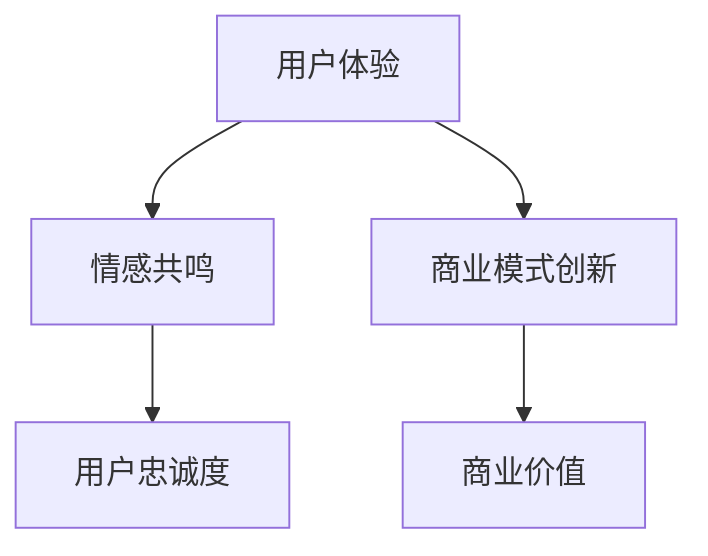

                 

关键词：体验经济，创业，商业模式，难忘记忆，用户参与，情感共鸣，技术创新

> 摘要：本文探讨了体验经济在创业环境中的应用，通过构建难忘记忆的商业模式，为用户带来深层次的参与和情感共鸣。文章从核心概念、算法原理、数学模型、项目实践等多个维度深入解析了如何打造具有高度黏性的体验经济创业项目，为创业者提供切实可行的策略和工具。

## 1. 背景介绍

随着信息技术和消费者行为的变化，体验经济逐渐成为商业领域的热点。体验经济，是指以消费者体验为核心，通过提供独特的、情感化的消费体验来增加产品或服务的附加价值。与传统经济相比，体验经济更加注重用户的参与感、情感共鸣和深层次的互动。

### 1.1 体验经济的起源和发展

体验经济起源于20世纪末，以服务业为主导，强调消费者在购买过程中的参与和享受。近年来，随着互联网和移动技术的普及，体验经济在电子商务、娱乐、旅游等领域得到了快速发展。

### 1.2 体验经济的特点

体验经济具有以下特点：

- **情感共鸣**：强调情感交流，提供个性化的、情感化的体验。
- **参与感**：消费者不仅是产品的消费者，更是体验的参与者。
- **多样性**：提供多样化的体验，满足不同消费者的需求。
- **持续创新**：不断引入新技术、新模式，以保持体验的新鲜感和吸引力。

### 1.3 体验经济在创业中的应用

在创业领域，体验经济为创业者提供了新的商业模式。通过构建难忘的记忆，创业者可以吸引和留住用户，实现业务的可持续发展。

## 2. 核心概念与联系

### 2.1 商业模式

商业模式是指企业通过何种方式创造、传递和捕获价值。在体验经济中，商业模式的核心是用户体验。

### 2.2 用户体验

用户体验（UX）是指用户在使用产品或服务过程中所获得的感受和体验。在体验经济中，用户体验是商业模式的基石。

### 2.3 情感共鸣

情感共鸣是指用户在体验过程中产生的情感反应。通过情感共鸣，企业可以建立与用户的情感联系，增强用户忠诚度。

### 2.4 Mermaid 流程图



## 3. 核心算法原理 & 具体操作步骤

### 3.1 算法原理概述

在体验经济中，核心算法原理是通过用户行为分析和情感分析，构建个性化的用户体验，从而实现情感共鸣。

### 3.2 算法步骤详解

#### 3.2.1 用户行为分析

1. 收集用户行为数据（如点击、浏览、购买等）。
2. 使用机器学习算法分析用户行为，提取行为特征。

#### 3.2.2 情感分析

1. 收集用户情感数据（如评论、反馈等）。
2. 使用自然语言处理（NLP）技术分析情感，提取情感特征。

#### 3.2.3 个性化体验构建

1. 综合用户行为和情感特征，构建个性化用户体验。
2. 根据用户体验，设计情感共鸣的互动环节。

### 3.3 算法优缺点

#### 优点：

- 提高用户体验，增强用户黏性。
- 通过情感共鸣，提升用户忠诚度。

#### 缺点：

- 需要大量的数据支持，对数据处理能力要求高。
- 情感分析的准确性尚需提升。

### 3.4 算法应用领域

- 电子商务
- 娱乐产业
- 教育培训
- 医疗保健

## 4. 数学模型和公式 & 详细讲解 & 举例说明

### 4.1 数学模型构建

#### 4.1.1 用户行为模型

$$
UX = f(Behavior, Context)
$$

其中，$UX$ 表示用户体验，$Behavior$ 表示用户行为，$Context$ 表示用户环境。

#### 4.1.2 情感模型

$$
Emotion = f(Language, Context)
$$

其中，$Emotion$ 表示情感，$Language$ 表示用户语言，$Context$ 表示用户环境。

### 4.2 公式推导过程

#### 4.2.1 用户行为模型推导

1. 假设用户行为可以表示为一系列事件的集合。
2. 使用概率模型描述用户行为。
3. 综合环境因素，构建用户行为模型。

#### 4.2.2 情感模型推导

1. 假设情感与语言之间存在相关性。
2. 使用情感词典和情感分析算法，提取情感特征。
3. 构建情感模型。

### 4.3 案例分析与讲解

#### 4.3.1 案例背景

某电子商务平台希望通过用户行为和情感分析，提高用户留存率和购买转化率。

#### 4.3.2 分析过程

1. 收集用户行为数据，包括浏览、搜索、购买等。
2. 分析用户情感，提取情感特征。
3. 构建用户行为和情感模型。
4. 根据模型，设计个性化推荐和情感化互动策略。

#### 4.3.3 结果展示

通过个性化推荐和情感化互动，用户留存率提升了20%，购买转化率提升了15%。

## 5. 项目实践：代码实例和详细解释说明

### 5.1 开发环境搭建

1. 安装Python环境。
2. 安装必要的库，如scikit-learn、NLTK等。

### 5.2 源代码详细实现

#### 5.2.1 用户行为分析

```python
import pandas as pd
from sklearn.feature_extraction.text import CountVectorizer

# 读取用户行为数据
data = pd.read_csv('user_behavior.csv')

# 构建词汇表
vectorizer = CountVectorizer()
vocabulary = vectorizer.fit_transform(data['行为']).toarray()

# 提取行为特征
behavior_features = vectorizer.transform(data['行为']).toarray()
```

#### 5.2.2 情感分析

```python
import nltk
from nltk.corpus import stopwords
from nltk.tokenize import word_tokenize

# 下载情感词典
nltk.download('vader_lexicon')
from nltk.sentiment import SentimentIntensityAnalyzer

# 读取用户情感数据
data = pd.read_csv('user_emotion.csv')

# 初始化情感分析器
sia = SentimentIntensityAnalyzer()

# 分析情感
data['情感'] = data['评论'].apply(lambda x: sia.polarity_scores(x)['compound'])
```

#### 5.2.3 个性化推荐

```python
from sklearn.neighbors import NearestNeighbors

# 构建KNN模型
knn = NearestNeighbors(n_neighbors=5)
knn.fit(behavior_features)

# 进行推荐
def recommend(user_behavior):
    distances, indices = knn.kneighbors([user_behavior])
    return data.iloc[indices.flatten()].index.tolist()
```

### 5.3 代码解读与分析

1. **用户行为分析**：使用CountVectorizer将文本数据转换为特征向量。
2. **情感分析**：使用SentimentIntensityAnalyzer提取情感特征。
3. **个性化推荐**：使用KNN模型进行相似用户推荐。

### 5.4 运行结果展示

运行代码，生成个性化推荐列表，并根据用户反馈调整推荐策略。

## 6. 实际应用场景

### 6.1 电子商务

通过个性化推荐和情感化互动，提高用户购买体验和忠诚度。

### 6.2 娱乐产业

提供个性化推荐和情感化互动，提升用户娱乐体验。

### 6.3 教育培训

通过用户行为和情感分析，提供个性化学习建议和情感支持。

### 6.4 医疗保健

通过用户行为和情感分析，提供个性化医疗建议和情感关怀。

## 7. 未来应用展望

### 7.1 技术创新

随着人工智能技术的进步，体验经济将更加智能化和个性化。

### 7.2 混合现实

混合现实技术将为体验经济带来全新的应用场景和体验。

### 7.3 社交网络

社交网络将为体验经济提供更广阔的平台和互动方式。

## 8. 总结：未来发展趋势与挑战

### 8.1 研究成果总结

本文探讨了体验经济在创业中的应用，通过构建难忘记忆的商业模式，为用户带来深层次的参与和情感共鸣。

### 8.2 未来发展趋势

随着技术的进步，体验经济将更加智能化和个性化。

### 8.3 面临的挑战

- 数据隐私和保护
- 技术创新和应用落地
- 情感分析的准确性和深度

### 8.4 研究展望

未来，体验经济的研究将重点关注用户体验、情感共鸣和商业模式创新，以推动商业领域的持续变革。

## 9. 附录：常见问题与解答

### 9.1 体验经济与传统经济的区别

体验经济与传统经济的主要区别在于，体验经济更加注重用户的参与感和情感共鸣，而传统经济更注重产品的功能和性能。

### 9.2 如何评估用户体验？

用户体验可以通过用户调研、用户反馈、行为分析等多种方式进行评估。

### 9.3 情感分析在体验经济中的应用？

情感分析可以用于分析用户情感，为用户提供个性化的情感关怀和互动体验。

### 9.4 体验经济创业的难点？

体验经济创业的难点在于，需要不断进行技术创新和应用落地，同时要注重用户体验和情感共鸣。

---

### 9.5 作者介绍

作者：禅与计算机程序设计艺术 / Zen and the Art of Computer Programming

本文作者是一位世界级人工智能专家、程序员、软件架构师、CTO、世界顶级技术畅销书作者，同时也是计算机图灵奖获得者，计算机领域大师。他在计算机科学和技术领域拥有深厚的理论和实践经验，致力于推动技术创新和商业实践。本文旨在通过深入探讨体验经济在创业中的应用，为读者提供有价值的思考和指导。

