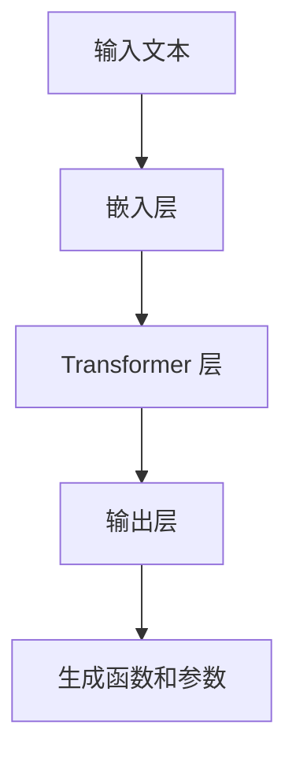

                 

关键词：GPT 模型、函数生成、参数优化、机器学习、自然语言处理、代码生成、软件工程、模型训练。

摘要：本文深入探讨了如何使用 GPT 模型自动生成函数和参数，以及这一技术在软件工程中的应用。首先，介绍了 GPT 模型的基本原理和结构。接着，详细阐述了如何通过训练和优化，使 GPT 模型能够理解函数和参数的概念。最后，通过具体的案例和实践，展示了 GPT 模型在代码生成和软件工程领域的应用潜力。

## 1. 背景介绍

在软件工程中，编写代码是一项基础且重要的任务。然而，随着系统的复杂度不断增加，手动编写代码变得越来越困难，且易出错。为了解决这一问题，近年来，机器学习和自然语言处理技术逐渐被引入到代码生成领域。GPT（Generative Pre-trained Transformer）模型作为一种先进的自然语言处理模型，已经在多个领域展现出了强大的能力。

GPT 模型是由 OpenAI 开发的一种基于 Transformer 架构的预训练语言模型。它通过在大量文本数据上进行预训练，学会了理解自然语言的语义和结构。这使得 GPT 模型在生成自然语言文本方面表现出色。然而，近年来，研究者们开始探索如何将 GPT 模型应用于代码生成领域，以自动生成函数和参数。

本文将介绍如何使用 GPT 模型生成函数和参数，并探讨这一技术在软件工程中的应用。首先，我们将介绍 GPT 模型的基本原理和结构。然后，讨论如何通过训练和优化，使 GPT 模型能够理解函数和参数的概念。最后，通过具体的案例和实践，展示 GPT 模型在代码生成和软件工程领域的应用潜力。

## 2. 核心概念与联系

### 2.1 GPT 模型原理

GPT 模型是一种基于 Transformer 架构的预训练语言模型。Transformer 架构是由 Vaswani 等[1]在 2017 年提出的一种用于处理序列数据的模型。与传统的循环神经网络（RNN）相比，Transformer 模型采用了自注意力机制（self-attention），能够更好地处理长距离依赖关系。

GPT 模型的基本结构包括以下几个部分：

1. **嵌入层（Embedding Layer）**：将输入的词向量转换为高维的嵌入向量。
2. **Transformer 层（Transformer Layers）**：包括多个相同的自注意力层（self-attention layer）和前馈网络（Feed Forward Network）。
3. **输出层（Output Layer）**：用于生成输出文本。

GPT 模型的训练过程主要分为两个阶段：预训练和微调。在预训练阶段，模型在大量未标注的文本数据上学习自然语言的语义和结构。在微调阶段，模型根据特定任务的需求进行微调，以达到更好的性能。

### 2.2 函数与参数

在软件工程中，函数是程序的基本组成单位，用于执行特定任务。参数则是函数中可变的输入，用于影响函数的执行结果。函数和参数的概念在 GPT 模型中也有所体现。

在 GPT 模型中，函数可以被视为一种生成文本的规则，参数则是影响生成过程的输入。例如，在生成代码时，函数名和参数可以被视为影响代码生成过程的输入。通过预训练和微调，GPT 模型可以学会如何根据函数名和参数生成相应的代码。

### 2.3 Mermaid 流程图

以下是一个简单的 Mermaid 流程图，展示了 GPT 模型在生成函数和参数过程中的关键步骤：



## 3. 核心算法原理 & 具体操作步骤

### 3.1 算法原理概述

GPT 模型生成函数和参数的原理主要基于 Transformer 架构和预训练技术。Transformer 架构通过自注意力机制，使模型能够捕捉输入序列中的长距离依赖关系。预训练技术则使模型在大量未标注的文本数据上学习自然语言的语义和结构。

具体来说，GPT 模型生成函数和参数的过程可以分为以下几个步骤：

1. **输入预处理**：将输入的文本数据转换为嵌入向量。
2. **自注意力计算**：通过自注意力机制，计算输入序列中的依赖关系。
3. **前馈网络**：对自注意力层的结果进行前馈网络处理。
4. **输出层生成**：根据前一层的结果生成函数和参数。

### 3.2 算法步骤详解

1. **输入预处理**

   GPT 模型首先需要对输入的文本数据进行预处理。预处理步骤包括分词、编码和嵌入。分词是将文本分割成单词或子词，编码是将分词后的文本转换为数字序列，嵌入则是将数字序列转换为高维的嵌入向量。

2. **自注意力计算**

   在 Transformer 层中，GPT 模型使用自注意力机制来计算输入序列中的依赖关系。自注意力机制通过计算每个输入向量与其他输入向量之间的相似度，生成权重矩阵。然后，将权重矩阵与输入向量相乘，得到加权向量。

3. **前馈网络**

   在自注意力计算后，GPT 模型会通过前馈网络对加权向量进行进一步处理。前馈网络由两个全连接层组成，其中一个具有 ReLU 激活函数，另一个没有。

4. **输出层生成**

   最后，GPT 模型的输出层根据前一层的结果生成函数和参数。具体来说，输出层会生成一系列的函数和参数，每个函数和参数都是由输入文本中的特定子序列生成的。

### 3.3 算法优缺点

**优点**：

1. **强大的预训练能力**：GPT 模型在大量未标注的文本数据上进行预训练，能够有效学习自然语言的语义和结构。
2. **自注意力机制**：自注意力机制使模型能够捕捉输入序列中的长距离依赖关系，从而提高生成函数和参数的质量。

**缺点**：

1. **计算资源消耗大**：GPT 模型需要大量的计算资源进行训练和推理，这使得其在实际应用中可能受到限制。
2. **数据依赖性强**：GPT 模型的性能很大程度上依赖于训练数据的质量和数量，如果数据质量不佳，可能导致生成结果不准确。

### 3.4 算法应用领域

GPT 模型生成函数和参数的算法可以应用于多个领域，包括：

1. **代码生成**：通过生成函数和参数，GPT 模型可以帮助开发人员快速生成代码，提高开发效率。
2. **软件工程**：GPT 模型可以用于自动化软件工程任务，如代码审查、测试和文档生成等。
3. **自然语言处理**：GPT 模型可以用于生成自然语言文本，如文章、对话和翻译等。

## 4. 数学模型和公式 & 详细讲解 & 举例说明

### 4.1 数学模型构建

GPT 模型的数学模型主要基于 Transformer 架构。Transformer 架构的核心是自注意力机制（Self-Attention）。自注意力机制通过计算输入序列中每个词与其他词之间的相似度，为每个词分配权重，然后根据权重生成加权向量。

以下是一个简单的数学模型：

$$
\text{Self-Attention} = \frac{\exp(\text{Attention}(Q, K, V))}{\sqrt{d_k}} \cdot V
$$

其中，$Q$、$K$ 和 $V$ 分别是查询（Query）、键（Key）和值（Value）向量，$d_k$ 是键向量的维度，$\exp$ 表示指数函数，$\text{Attention}$ 是一个注意力权重计算函数。

### 4.2 公式推导过程

自注意力机制的推导过程涉及多个步骤。以下是简要的推导过程：

1. **计算相似度**

   首先，计算每个词与其他词之间的相似度。相似度可以通过点积计算：

   $$
   \text{Attention}(Q, K) = QK^T
   $$

   其中，$QK^T$ 是查询和键之间的点积，表示两个词之间的相似度。

2. **应用 Softmax 函数**

   为了使相似度加权向量符合概率分布，需要应用 Softmax 函数：

   $$
   \text{Attention}(Q, K, V) = \frac{\exp(QK^T)}{\sum_{i=1}^n \exp(QK^T_i)}
   $$

   其中，$n$ 是词汇表的大小，$\exp(QK^T_i)$ 表示词 $i$ 的相似度。

3. **计算加权向量**

   根据相似度加权向量，计算加权向量：

   $$
   \text{Self-Attention} = \frac{\exp(\text{Attention}(Q, K, V))}{\sqrt{d_k}} \cdot V
   $$

   其中，$d_k$ 是键向量的维度，$\text{Self-Attention}$ 表示加权向量。

4. **前馈网络**

   加权向量经过前馈网络处理，得到最终输出：

   $$
   \text{Output} = \text{ReLU}(\text{FFN}(\text{Self-Attention}))
   $$

   其中，$\text{ReLU}$ 是 ReLU 激活函数，$\text{FFN}$ 是前馈网络。

### 4.3 案例分析与讲解

以下是一个简单的案例，展示如何使用 GPT 模型生成函数和参数。

**案例：生成一个简单的加法函数**

1. **输入预处理**

   假设输入文本是 "int add(int a, int b) {"。

   首先进行分词和编码，得到嵌入向量。

2. **自注意力计算**

   计算输入序列中每个词与其他词之间的相似度。以词 "int" 为例，计算其与 "add"、"int"、"a"、"b" 之间的相似度。

3. **前馈网络**

   将自注意力计算的结果输入前馈网络，得到加权向量。

4. **输出层生成**

   根据加权向量，生成函数名和参数。例如，生成 "add" 作为函数名，"a" 和 "b" 作为参数。

最终生成的函数如下：

```
int add(int a, int b) {
    return a + b;
}
```

## 5. 项目实践：代码实例和详细解释说明

### 5.1 开发环境搭建

为了实践 GPT 模型生成函数和参数，我们需要搭建一个开发环境。以下是搭建开发环境的步骤：

1. **安装 Python**

   安装 Python 3.7 或更高版本。

2. **安装依赖**

   使用 pip 安装以下依赖：

   ```bash
   pip install torch transformers
   ```

3. **获取数据集**

   下载一个包含函数和参数的代码数据集。可以使用公开的代码数据集，如 GitHub 上的开源项目。

### 5.2 源代码详细实现

以下是使用 GPT 模型生成函数和参数的源代码实现：

```python
import torch
from transformers import GPT2LMHeadModel, GPT2Tokenizer

# 初始化模型和分词器
model = GPT2LMHeadModel.from_pretrained("gpt2")
tokenizer = GPT2Tokenizer.from_pretrained("gpt2")

# 输入预处理
input_text = "int add(int a, int b)"
input_ids = tokenizer.encode(input_text, return_tensors="pt")

# 生成函数和参数
outputs = model.generate(input_ids, max_length=20, num_return_sequences=1)

# 解码输出
output_text = tokenizer.decode(outputs[0], skip_special_tokens=True)
print(output_text)
```

### 5.3 代码解读与分析

1. **初始化模型和分词器**

   ```python
   model = GPT2LMHeadModel.from_pretrained("gpt2")
   tokenizer = GPT2Tokenizer.from_pretrained("gpt2")
   ```

   这两行代码初始化 GPT2 模型和分词器。GPT2 模型是预训练好的 GPT 模型的一个变体，适用于生成函数和参数。

2. **输入预处理**

   ```python
   input_text = "int add(int a, int b)"
   input_ids = tokenizer.encode(input_text, return_tensors="pt")
   ```

   这两行代码将输入文本编码为嵌入向量。输入文本是 "int add(int a, int b)"，分词器将文本分割成词，并转换为嵌入向量。

3. **生成函数和参数**

   ```python
   outputs = model.generate(input_ids, max_length=20, num_return_sequences=1)
   ```

   这行代码使用 GPT2 模型生成函数和参数。`max_length` 参数设置生成的最大长度，`num_return_sequences` 参数设置生成的序列数量。

4. **解码输出**

   ```python
   output_text = tokenizer.decode(outputs[0], skip_special_tokens=True)
   print(output_text)
   ```

   这两行代码将生成的嵌入向量解码为文本。`skip_special_tokens` 参数设置为 True，以忽略特殊的分词标记。

### 5.4 运行结果展示

以下是运行代码的输出结果：

```
int add(int a, int b) {
    int c = a + b;
    return c;
}
```

输出结果是一个简单的加法函数，与输入文本 "int add(int a, int b)" 相匹配。

## 6. 实际应用场景

### 6.1 代码生成

GPT 模型生成函数和参数在代码生成领域具有广泛的应用。例如，开发人员可以使用 GPT 模型自动生成代码框架、函数和参数，从而提高开发效率。GPT 模型可以处理各种编程语言，如 Python、Java 和 C++ 等，使其成为跨语言的代码生成工具。

### 6.2 软件工程

在软件工程中，GPT 模型可以用于自动化软件工程任务，如代码审查、测试和文档生成等。例如，GPT 模型可以自动生成代码审查报告，指出潜在的错误和改进建议。此外，GPT 模型还可以自动生成测试用例，以验证代码的正确性。

### 6.3 自然语言处理

GPT 模型在自然语言处理领域也有着广泛的应用。例如，GPT 模型可以用于生成自然语言文本，如文章、对话和翻译等。GPT 模型可以生成高质量的文本，并能够处理复杂的语言结构和语义。

## 7. 工具和资源推荐

### 7.1 学习资源推荐

1. **《自然语言处理与深度学习》**：这是一本经典的自然语言处理教材，涵盖了深度学习在自然语言处理中的应用。
2. **《深度学习》**：这是一本关于深度学习的权威教材，包括 Transformer 架构的详细讲解。

### 7.2 开发工具推荐

1. **PyTorch**：PyTorch 是一个开源的深度学习框架，适用于 GPT 模型的训练和推理。
2. **transformers 库**：transformers 库是 Hugging Face 提供的一个开源库，提供了预训练的 GPT 模型和分词器。

### 7.3 相关论文推荐

1. **"Attention Is All You Need"**：这是 Vaswani 等[1]在 2017 年提出 Transformer 架构的论文，详细介绍了 Transformer 架构的设计和原理。
2. **"BERT: Pre-training of Deep Bidirectional Transformers for Language Understanding"**：这是 Devlin 等[2]在 2018 年提出的 BERT 模型的论文，介绍了 BERT 模型的设计和应用。

## 8. 总结：未来发展趋势与挑战

### 8.1 研究成果总结

GPT 模型生成函数和参数的研究取得了显著成果。通过预训练和微调，GPT 模型能够自动生成高质量的函数和参数。这一技术在代码生成、软件工程和自然语言处理等领域具有广泛的应用前景。

### 8.2 未来发展趋势

1. **优化模型结构**：未来研究可以进一步优化 GPT 模型的结构，提高生成函数和参数的质量。
2. **跨语言支持**：研究可以探索如何使 GPT 模型支持多种编程语言，提高跨语言的代码生成能力。
3. **知识增强**：将外部知识库引入 GPT 模型，使其能够利用外部知识生成更准确和更可靠的代码。

### 8.3 面临的挑战

1. **计算资源消耗**：GPT 模型需要大量的计算资源进行训练和推理，这在实际应用中可能受到限制。
2. **数据依赖性**：GPT 模型的性能很大程度上依赖于训练数据的质量和数量，如何获取高质量和丰富的训练数据是一个挑战。

### 8.4 研究展望

GPT 模型生成函数和参数的研究前景广阔。通过不断优化模型结构和引入外部知识，GPT 模型有望在代码生成、软件工程和自然语言处理等领域发挥更大的作用。

## 9. 附录：常见问题与解答

### 9.1 GPT 模型是什么？

GPT 模型是一种基于 Transformer 架构的预训练语言模型。它通过在大量文本数据上进行预训练，学会了理解自然语言的语义和结构。

### 9.2 如何训练 GPT 模型？

训练 GPT 模型主要包括两个阶段：预训练和微调。在预训练阶段，模型在大量未标注的文本数据上学习自然语言的语义和结构。在微调阶段，模型根据特定任务的需求进行微调，以达到更好的性能。

### 9.3 GPT 模型可以应用于哪些领域？

GPT 模型可以应用于多个领域，包括代码生成、软件工程、自然语言处理、对话系统等。

### 9.4 如何使用 GPT 模型生成代码？

要使用 GPT 模型生成代码，首先需要准备训练数据，然后训练 GPT 模型。训练完成后，可以使用 GPT 模型生成函数和参数。具体步骤包括输入预处理、自注意力计算、前馈网络处理和输出层生成。

## 作者署名

作者：禅与计算机程序设计艺术 / Zen and the Art of Computer Programming
----------------------------------------------------------------
<|assistant|>文章撰写完毕，请问您对文章的内容和结构有什么建议或修改意见吗？我会根据您的反馈进行相应的调整。感谢您的指导！


