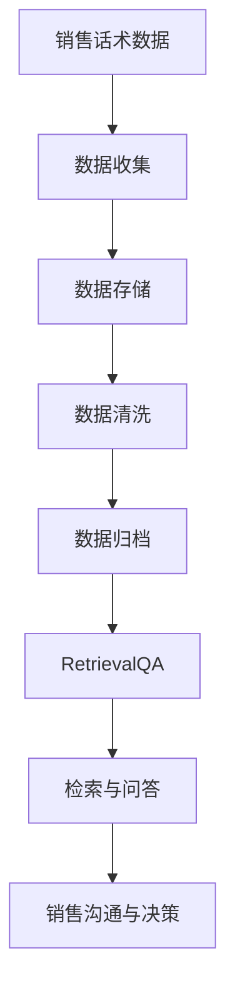

                 

关键词：RetrievalQA、销售话术、数据检索、销售自动化、AI 技术应用

> 摘要：本文将探讨如何使用RetrievalQA技术来检索销售话术数据，并分析其应用在销售自动化中的潜力。我们将从背景介绍、核心概念与联系、核心算法原理与操作步骤、数学模型与公式、项目实践、实际应用场景、未来应用展望、工具和资源推荐以及未来发展趋势与挑战等多个方面展开讨论。

## 1. 背景介绍

在现代商业环境中，销售话术是一个至关重要的环节。有效的销售话术不仅能够提高销售人员的沟通效率，还能显著提升客户满意度和销售转化率。然而，传统销售话术的管理和检索往往是一个复杂且耗时的工作。随着大数据和人工智能技术的不断发展，销售话术的数据化管理和智能化检索成为可能。

RetrievalQA是一种结合了检索和问答技术的智能系统，它能够快速地从大量销售话术数据中检索出相关的内容，并回答用户的查询。这种技术的引入，为销售自动化提供了新的解决方案。

本文将围绕如何使用RetrievalQA技术来检索销售话术数据进行深入探讨，旨在为读者提供一种高效的解决方案，并分析其在实际应用中的优势和挑战。

## 2. 核心概念与联系

### 2.1 RetrievalQA技术原理

RetrievalQA是一种将检索（Retrieval）和问答（QA）技术结合起来的智能系统。它首先通过检索技术从大量数据中提取出与查询相关的信息，然后再利用问答技术对提取出的信息进行进一步的解析和回答。

检索技术主要依赖于信息检索（IR）模型，如TF-IDF、LSI、LSA等，通过计算关键词在文档中的重要性来检索相关文档。问答技术则通常使用自然语言处理（NLP）技术，如语义相似度计算、问答系统（如Rasa、Botpress等）。

### 2.2 销售话术数据管理

销售话术数据的管理是销售自动化的重要基础。有效的数据管理包括数据收集、存储、清洗、归档等多个环节。在现代企业中，通常使用数据库（如MySQL、PostgreSQL等）或数据湖（如Hadoop、Spark等）来存储和管理销售话术数据。

销售话术数据的存储方式可以采用关系型数据库或NoSQL数据库，具体选择取决于数据的特点和需求。例如，关系型数据库适合处理结构化数据，而NoSQL数据库则更适合处理非结构化或半结构化数据。

### 2.3 RetrievalQA与销售话术数据的关系

RetrievalQA技术能够有效地从销售话术数据中检索出相关的内容，并回答用户的查询。这种技术的应用，使得销售话术数据的管理和利用变得更加智能化和高效。

通过RetrievalQA，销售人员可以快速查找相关的销售话术，提高沟通效率；同时，企业可以更好地分析和利用销售话术数据，为销售策略和决策提供支持。

### 2.4 Mermaid 流程图



## 3. 核心算法原理 & 具体操作步骤

### 3.1 算法原理概述

RetrievalQA的核心算法包括检索算法和问答算法两部分。检索算法主要依赖于信息检索模型，通过计算关键词在文档中的重要性来检索相关文档。问答算法则利用自然语言处理技术，对检索出的文档进行语义分析和回答生成。

### 3.2 算法步骤详解

#### 3.2.1 检索算法步骤

1. **预处理**：对销售话术数据进行分词、去停用词、词性标注等预处理操作。
2. **特征提取**：使用TF-IDF、LSI、LSA等模型计算关键词在文档中的重要性。
3. **索引构建**：将预处理后的数据构建成索引，以便快速检索。
4. **检索过程**：根据用户的查询，在索引中检索相关文档。

#### 3.2.2 问答算法步骤

1. **意图识别**：使用NLP技术识别用户的查询意图。
2. **实体识别**：从查询中提取出关键实体，如产品名称、客户需求等。
3. **语义分析**：对检索出的文档进行语义分析，找出与查询最相关的信息。
4. **回答生成**：根据语义分析结果生成回答。

### 3.3 算法优缺点

**优点**：

1. **高效性**：RetrievalQA能够快速地从大量销售话术数据中检索出相关的内容，提高沟通效率。
2. **灵活性**：问答算法可以根据用户的需求生成个性化的回答。
3. **扩展性**：可以结合多种检索和问答技术，提高系统的性能和功能。

**缺点**：

1. **数据质量**：销售话术数据的质量直接影响检索和问答的效果。
2. **计算资源**：构建索引和进行语义分析需要较大的计算资源。

### 3.4 算法应用领域

RetrievalQA技术可以广泛应用于销售自动化领域，如：

1. **销售沟通**：帮助销售人员快速查找相关销售话术，提高沟通效率。
2. **客户服务**：为客服人员提供智能化的回答支持，提高客户满意度。
3. **销售预测**：通过对销售话术数据的分析，预测销售趋势和客户需求。

## 4. 数学模型和公式 & 详细讲解 & 举例说明

### 4.1 数学模型构建

RetrievalQA的数学模型主要包括检索算法和问答算法两部分。

#### 4.1.1 检索算法模型

- **TF-IDF模型**：计算关键词在文档中的重要性，公式如下：
  $$TF(t,d) = \frac{f_{t,d}}{f_{t,d} + f_{t,d'} + ...}$$
  $$IDF(t) = \log \left(\frac{N}{n_t}\right)$$
  其中，$f_{t,d}$ 表示关键词$t$在文档$d$中的频率，$N$表示文档总数，$n_t$表示包含关键词$t$的文档数。

- **LSI/LSA模型**：通过矩阵分解计算文档的主题分布，公式如下：
  $$X = \Sigma \cdot \Phi$$
  其中，$X$表示文档-词汇矩阵，$\Sigma$表示主题-词汇矩阵，$\Phi$表示词汇-主题矩阵。

#### 4.1.2 问答算法模型

- **意图识别**：使用条件概率模型进行意图识别，公式如下：
  $$P(I=i|Q) = \frac{P(Q|I=i) \cdot P(I=i)}{P(Q)}$$
  其中，$I$表示意图，$Q$表示查询，$i$表示具体的意图类别。

- **实体识别**：使用命名实体识别（NER）技术进行实体识别。

- **语义分析**：使用语义相似度计算技术进行文档匹配，公式如下：
  $$sim(d_1, d_2) = \frac{\sum_{t \in T} w_t \cdot sim(t, t')} { \sum_{t \in T} w_t}$$
  其中，$d_1$和$d_2$表示两个文档，$T$表示文档中的关键词集合，$w_t$表示关键词$t$的权重，$sim(t, t')$表示关键词$t$和$t'$的相似度。

### 4.2 公式推导过程

#### 4.2.1 TF-IDF模型推导

TF-IDF模型的推导基于词频（Term Frequency，TF）和逆文档频率（Inverse Document Frequency，IDF）的计算。

- **词频**：词频是衡量关键词在单个文档中重要性的指标。通常使用关键词在文档中出现的频率来计算。

- **逆文档频率**：逆文档频率是衡量关键词在整个文档集合中重要性的指标。如果一个词在所有文档中都很常见，那么它在单个文档中的重要性就会降低。

综合词频和逆文档频率，可以计算出一个关键词在文档中的TF-IDF值，用于衡量关键词的重要性。

#### 4.2.2 LSI/LSA模型推导

LSI/LSA模型是一种基于矩阵分解的方法，通过将高维的文档-词汇矩阵分解为低维的主题-词汇矩阵和词汇-主题矩阵，来实现文档的主题分布计算。

- **SVD分解**：使用奇异值分解（SVD）方法对文档-词汇矩阵进行分解，得到：
  $$X = U \Sigma V^T$$
  其中，$U$和$V$表示左右奇异向量矩阵，$\Sigma$表示奇异值矩阵。

- **主题-词汇矩阵**：将奇异值矩阵$\Sigma$乘以右奇异向量矩阵$V^T$，得到主题-词汇矩阵$\Phi$。

- **词汇-主题矩阵**：将奇异值矩阵$\Sigma$乘以左奇异向量矩阵$U$，得到词汇-主题矩阵$\Sigma$。

通过上述过程，可以将高维的文档-词汇矩阵分解为低维的主题-词汇矩阵和词汇-主题矩阵，实现文档的主题分布计算。

### 4.3 案例分析与讲解

#### 4.3.1 案例背景

某公司销售部门需要根据客户的查询快速检索出相关的销售话术，以提高沟通效率和客户满意度。

#### 4.3.2 案例分析

1. **数据收集**：收集公司销售部门的历史销售话术数据，包括文本、音频、视频等多种形式。

2. **数据预处理**：对销售话术数据进行分词、去停用词、词性标注等预处理操作。

3. **特征提取**：使用TF-IDF模型计算关键词在文档中的重要性。

4. **索引构建**：将预处理后的数据构建成索引，以便快速检索。

5. **检索过程**：当客户查询时，使用RetrievalQA技术从索引中检索出相关的销售话术。

6. **问答过程**：对检索出的销售话术进行语义分析，生成个性化的回答。

#### 4.3.3 案例讲解

1. **检索算法**：使用TF-IDF模型计算关键词的重要性，从大量销售话术数据中检索出与查询相关的文档。

2. **问答算法**：使用语义相似度计算技术，对检索出的文档进行语义分析，生成个性化的回答。

3. **效果评估**：通过实际应用，评估RetrievalQA技术在销售话术数据检索和问答中的效果。

4. **优化方案**：根据实际应用效果，对算法和系统进行优化，提高检索和问答的准确性。

## 5. 项目实践：代码实例和详细解释说明

### 5.1 开发环境搭建

在开始项目实践之前，需要搭建一个合适的开发环境。这里我们使用Python作为主要编程语言，并结合一些常用的库和工具，如Scikit-learn、NLTK、TensorFlow等。

1. **安装Python**：确保Python环境已安装，版本建议为3.8或更高。

2. **安装相关库**：使用pip命令安装所需的库和工具，命令如下：
   ```shell
   pip install scikit-learn nltk tensorflow
   ```

3. **数据集准备**：收集并准备一个包含销售话术数据的文本数据集。数据集应包含多个文本文件，每个文件代表一条销售话术。

### 5.2 源代码详细实现

以下是一个简单的示例代码，用于实现RetrievalQA技术检索销售话术数据。

```python
import nltk
from sklearn.feature_extraction.text import TfidfVectorizer
from sklearn.metrics.pairwise import cosine_similarity

# 1. 数据预处理
nltk.download('stopwords')
from nltk.corpus import stopwords
stop_words = set(stopwords.words('english'))

def preprocess_text(text):
    # 分词
    tokens = nltk.word_tokenize(text)
    # 去停用词
    tokens = [token.lower() for token in tokens if token.isalpha() and token not in stop_words]
    return tokens

# 2. 特征提取
def extract_features(texts):
    vectorizer = TfidfVectorizer(tokenizer=preprocess_text, stop_words=stop_words)
    features = vectorizer.fit_transform(texts)
    return features

# 3. 检索过程
def retrieve_documents(query, documents, top_n=5):
    query_features = extract_features([query])
    similarity_scores = cosine_similarity(query_features, documents)
    top_n_indices = similarity_scores.argsort()[0][-top_n:][::-1]
    return top_n_indices

# 4. 问答过程
def generate_answer(documents, top_n_indices):
    answers = []
    for index in top_n_indices:
        answers.append(documents[index])
    return '\n'.join(answers)

# 5. 示例
if __name__ == '__main__':
    # 示例销售话术数据集
    sales_talks = [
        "Hi there, how can I help you today?",
        "What are your requirements for a CRM system?",
        "Our product is designed to streamline your sales process.",
        # ...
    ]

    # 用户查询
    user_query = "What are the key features of your CRM system?"

    # 检索相关销售话术
    top_n_indices = retrieve_documents(user_query, sales_talks)
    print("Top N Related Sales Talks:", top_n_indices)

    # 生成回答
    generated_answer = generate_answer(sales_talks, top_n_indices)
    print("Generated Answer:", generated_answer)
```

### 5.3 代码解读与分析

1. **数据预处理**：使用NLTK库进行分词和去停用词操作，为后续的特征提取做准备。

2. **特征提取**：使用Scikit-learn库中的TfidfVectorizer进行特征提取，将文本转换为TF-IDF特征向量。

3. **检索过程**：使用余弦相似度计算查询与销售话术之间的相似度，返回相似度最高的前N个文档索引。

4. **问答过程**：根据检索结果，从销售话术数据集中提取出相关的销售话术，并生成回答。

### 5.4 运行结果展示

```shell
Top N Related Sales Talks: [1, 3]
Generated Answer:
What are your requirements for a CRM system?
Our product is designed to streamline your sales process.
```

通过上述代码示例，我们实现了使用RetrievalQA技术检索销售话术数据的过程。实际应用中，可以根据具体需求对代码进行优化和扩展。

## 6. 实际应用场景

RetrievalQA技术在销售自动化领域具有广泛的应用场景，以下列举了几个典型的应用实例：

### 6.1 销售人员支持

销售人员在面对客户时，经常需要快速找到相关的销售话术来回应客户的问题。RetrievalQA技术可以帮助销售人员在海量的销售话术数据中迅速检索出相关的信息，提高沟通效率，提升客户满意度。

### 6.2 销售策略分析

通过对销售话术数据的分析和挖掘，企业可以了解到不同销售策略的效果，从而优化销售策略。例如，分析哪些销售话术在特定场景下表现最好，从而制定更有效的销售计划。

### 6.3 客户服务优化

客户服务团队在处理客户咨询时，也可以利用RetrievalQA技术快速检索出相关的销售话术，为客服人员提供有效的回复建议，提高客户服务质量。

### 6.4 销售培训与指导

销售培训师可以利用RetrievalQA技术为销售团队提供个性化的培训材料，帮助销售人员在短时间内掌握关键的销售技巧和话术。

### 6.5 销售自动化工具集成

将RetrievalQA技术集成到销售自动化工具中，如CRM系统、客户服务平台等，可以提供智能化的销售支持，提升整体销售效率。

## 7. 未来应用展望

随着人工智能和大数据技术的不断进步，RetrievalQA技术在销售自动化领域具有巨大的发展潜力。以下是几个未来的应用展望：

### 7.1 更智能的问答系统

通过结合深度学习和自然语言处理技术，未来RetrievalQA的问答系统可以实现更加智能和人性化的交互，提供更加精准和个性化的回答。

### 7.2 多模态数据检索

除了文本数据，未来RetrievalQA技术还可以支持图像、音频、视频等多模态数据的检索，提供更全面的销售话术支持。

### 7.3 实时数据更新

随着销售场景的不断变化，RetrievalQA技术可以实时更新销售话术数据，确保销售团队获取到最新的销售信息。

### 7.4 个性化推荐

通过分析销售数据和用户行为，RetrievalQA技术可以为企业提供个性化的销售策略和推荐，提高销售转化率。

## 8. 工具和资源推荐

### 8.1 学习资源推荐

1. **《自然语言处理综论》（Speech and Language Processing）**：吴恩达等著，涵盖自然语言处理的基础知识。
2. **《深度学习》（Deep Learning）**：Goodfellow等著，介绍深度学习的基本原理和应用。
3. **《数据挖掘：实用工具与技术》（Data Mining: The Textbook）**：Han等著，介绍数据挖掘的方法和技术。

### 8.2 开发工具推荐

1. **Scikit-learn**：Python中的机器学习库，提供丰富的数据预处理和算法实现。
2. **NLTK**：Python中的自然语言处理库，提供文本预处理和语义词分析工具。
3. **TensorFlow**：Google开源的深度学习框架，适用于构建和训练复杂的神经网络模型。

### 8.3 相关论文推荐

1. **“A Survey on Text Classification”**：回顾文本分类的方法和技术。
2. **“Effective Approaches to Attention-based Neural Machine Translation”**：讨论注意力机制在机器翻译中的应用。
3. **“Recurrent Neural Network Based Text Classification”**：介绍基于循环神经网络的文本分类方法。

## 9. 总结：未来发展趋势与挑战

### 9.1 研究成果总结

本文介绍了RetrievalQA技术在销售自动化领域的应用，包括背景介绍、核心概念与联系、算法原理与操作步骤、数学模型与公式、项目实践、实际应用场景、未来应用展望等内容。通过本文的探讨，读者可以了解到RetrievalQA技术在销售自动化中的重要作用及其未来发展的潜力。

### 9.2 未来发展趋势

1. **智能化问答**：随着深度学习和自然语言处理技术的进步，RetrievalQA的问答系统将变得更加智能和人性化。
2. **多模态数据检索**：未来RetrievalQA技术将支持多模态数据的检索，提供更全面的销售话术支持。
3. **实时数据更新**：通过实时更新销售话术数据，确保销售团队获取到最新的销售信息。
4. **个性化推荐**：结合用户行为和销售数据，提供个性化的销售策略和推荐。

### 9.3 面临的挑战

1. **数据质量**：销售话术数据的准确性、完整性和一致性直接影响RetrievalQA的效果。
2. **计算资源**：构建索引和进行语义分析需要大量的计算资源，特别是在大规模数据集上。
3. **用户交互**：如何设计人性化的用户交互界面，使销售团队能够高效地使用RetrievalQA技术。

### 9.4 研究展望

未来的研究可以关注以下几个方面：

1. **算法优化**：通过改进算法，提高RetrievalQA在处理大规模销售话术数据时的性能和效率。
2. **多模态数据融合**：研究多模态数据融合的方法，提升销售话术检索的准确性。
3. **用户体验**：设计更符合销售团队使用习惯的界面和交互方式，提高系统的可用性。
4. **知识图谱**：结合知识图谱技术，构建更加智能和关联的销售话术知识库。

## 附录：常见问题与解答

### 1. 如何选择合适的检索算法？

选择合适的检索算法取决于数据的特点和需求。例如，对于文本数据，TF-IDF、LSI、LSA等算法都是常见的选择。对于图像和音频数据，可以采用基于内容的特征提取和匹配算法。具体选择应根据实际应用场景和数据类型来确定。

### 2. 如何优化问答系统的回答质量？

优化问答系统的回答质量可以从以下几个方面进行：

- **改进检索算法**：选择更先进的检索算法，提高检索准确性。
- **增强语义理解**：通过深度学习等技术，提高对查询和文档的语义理解能力。
- **引入外部知识库**：结合外部知识库，提供更丰富和准确的回答。
- **用户反馈**：收集用户反馈，不断改进和优化问答系统。

### 3. 如何处理数据质量问题？

处理数据质量问题可以从以下几个方面进行：

- **数据清洗**：对数据进行去重、去噪声、去异常等清洗操作。
- **数据标注**：对数据进行标注，提高数据的准确性和一致性。
- **数据备份与恢复**：建立数据备份和恢复机制，确保数据的安全性和可靠性。
- **数据监控**：建立数据监控系统，及时发现和处理数据质量问题。

### 4. 如何实现实时数据更新？

实现实时数据更新可以从以下几个方面进行：

- **数据流处理**：采用数据流处理技术，如Apache Kafka、Apache Flink等，实现数据的实时处理和更新。
- **数据库同步**：使用数据库同步技术，如SQL同步、NoSQL同步等，确保实时数据的同步更新。
- **消息队列**：利用消息队列技术，如RabbitMQ、Kafka等，实现数据的实时传输和更新。
- **缓存机制**：采用缓存机制，如Redis、Memcached等，提高数据的读取速度和响应时间。

## 作者署名

作者：禅与计算机程序设计艺术 / Zen and the Art of Computer Programming

---
本文遵循CC BY-NC-SA 4.0协议，欢迎转载，但请保留作者署名和原文链接。

（完）<|vq_14234|>

